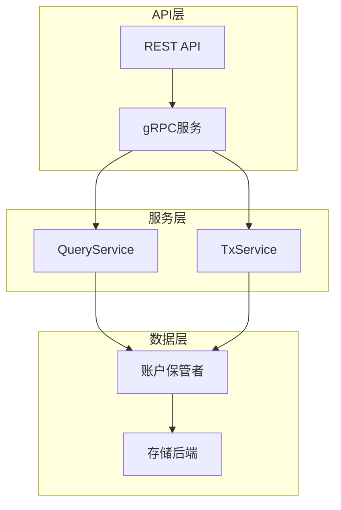
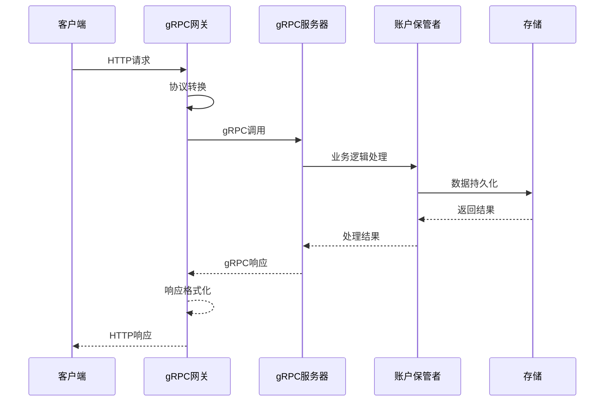
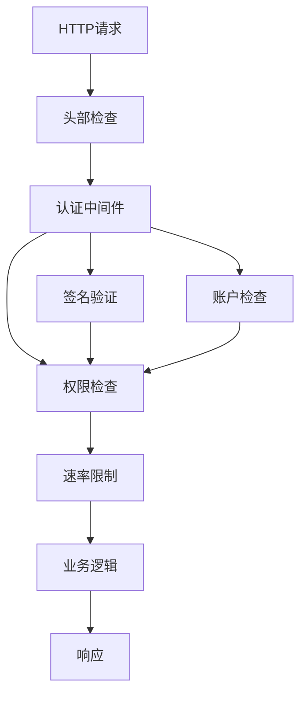
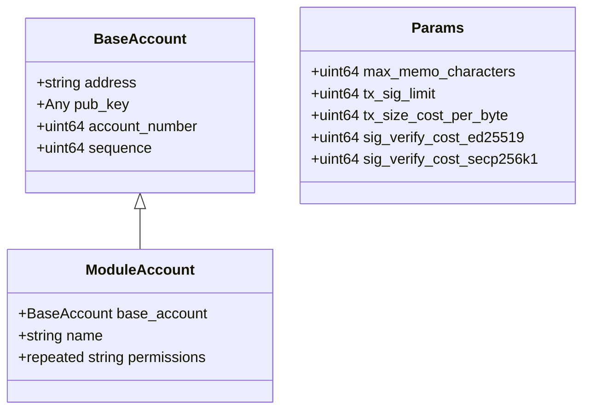
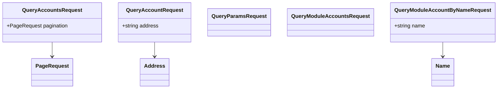
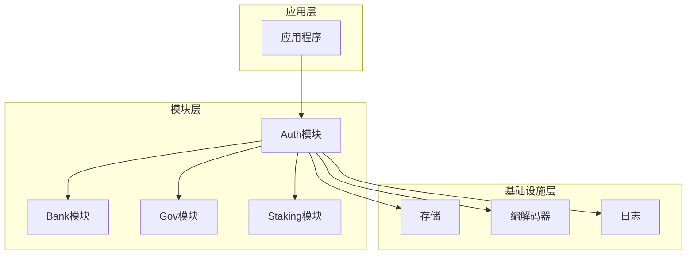

# Auth API参考

<cite>
**本文档中引用的文件**
- [query.proto](file://proto/cosmos/auth/v1beta1/query.proto)
- [tx.proto](file://proto/cosmos/auth/v1beta1/tx.proto)
- [auth.proto](file://proto/cosmos/auth/v1beta1/auth.proto)
- [server.go](file://server/api/server.go)
- [query.pulsar.go](file://api/cosmos/auth/v1beta1/query.pulsar.go)
- [auth.pulsar.go](file://api/cosmos/auth/v1beta1/auth.pulsar.go)
</cite>

## 目录
1. [简介](#简介)
2. [项目结构](#项目结构)
3. [核心组件](#核心组件)
4. [架构概览](#架构概览)
5. [详细组件分析](#详细组件分析)
6. [依赖关系分析](#依赖关系分析)
7. [性能考虑](#性能考虑)
8. [故障排除指南](#故障排除指南)
9. [结论](#结论)

## 简介

Cosmos SDK的Auth模块提供了账户管理和身份验证的核心功能。该模块通过gRPC和REST API暴露了查询服务（QueryService）和交易服务（TxService），支持账户查询、参数获取、模块账户管理等功能。本文档详细描述了Auth模块的所有API端点，包括HTTP方法、URL路径、请求/响应参数的JSON Schema、状态码和错误码。

## 项目结构

Auth模块的API结构基于Protocol Buffers定义，通过gRPC-Gateway映射到HTTP REST API：



**图表来源**
- [query.proto](file://proto/cosmos/auth/v1beta1/query.proto#L14-L82)
- [tx.proto](file://proto/cosmos/auth/v1beta1/tx.proto#L12-L43)

**章节来源**
- [query.proto](file://proto/cosmos/auth/v1beta1/query.proto#L1-L214)
- [tx.proto](file://proto/cosmos/auth/v1beta1/tx.proto#L1-L43)

## 核心组件

### QueryService 查询服务

QueryService提供了账户和系统参数的查询功能：

| 端点 | HTTP方法 | URL路径 | 描述 |
|------|----------|---------|------|
| `Accounts` | GET | `/cosmos/auth/v1beta1/accounts` | 获取所有现有账户 |
| `Account` | GET | `/cosmos/auth/v1beta1/accounts/{address}` | 根据地址查询账户详情 |
| `Params` | GET | `/cosmos/auth/v1beta1/params` | 查询所有参数 |
| `ModuleAccounts` | GET | `/cosmos/auth/v1beta1/module_accounts` | 获取所有模块账户 |
| `ModuleAccountByName` | GET | `/cosmos/auth/v1beta1/module_accounts/{name}` | 根据名称查询模块账户 |
| `Bech32Prefix` | GET | `/cosmos/auth/v1beta1/bech32` | 查询Bech32前缀 |
| `AddressBytesToString` | GET | `/cosmos/auth/v1beta1/bech32/{address_bytes}` | 地址字节转换为字符串 |
| `AddressStringToBytes` | GET | `/cosmos/auth/v1beta1/bech32/{address_string}` | 字符串地址转换为字节 |
| `AccountAddressByID` | GET | `/cosmos/auth/v1beta1/address_by_id/{id}` | 根据账户编号查询地址 |
| `AccountInfo` | GET | `/cosmos/auth/v1beta1/account_info/{address}` | 查询通用账户信息 |

### TxService 交易服务

TxService处理与账户相关的交易操作：

| 端点 | HTTP方法 | URL路径 | 描述 |
|------|----------|---------|------|
| `UpdateParams` | POST | `/cosmos/auth/v1beta1/params` | 更新模块参数 |

**章节来源**
- [query.proto](file://proto/cosmos/auth/v1beta1/query.proto#L16-L81)
- [tx.proto](file://proto/cosmos/auth/v1beta1/tx.proto#L14-L20)

## 架构概览

Auth模块采用分层架构设计，通过gRPC-Gateway实现协议转换：



**图表来源**
- [server.go](file://server/api/server.go#L43-L80)

**章节来源**
- [server.go](file://server/api/server.go#L1-L237)

## 详细组件分析

### QueryService详细分析

#### Accounts 端点

**HTTP方法**: GET  
**URL路径**: `/cosmos/auth/v1beta1/accounts`

**请求参数**:
```json
{
  "pagination": {
    "key": "string",
    "offset": "uint64",
    "limit": "uint64",
    "count_total": "bool",
    "reverse": "bool"
  }
}
```

**响应参数**:
```json
{
  "accounts": [
    {
      "@type": "string",
      "...": {}
    }
  ],
  "pagination": {
    "next_key": "string",
    "total": "uint64"
  }
}
```

**状态码**:
- `200 OK`: 请求成功
- `400 Bad Request`: 请求参数无效
- `500 Internal Server Error`: 服务器内部错误

#### Account 端点

**HTTP方法**: GET  
**URL路径**: `/cosmos/auth/v1beta1/accounts/{address}`

**路径参数**:
- `address` (string): 账户地址

**响应参数**:
```json
{
  "account": {
    "@type": "string",
    "...": {}
  }
}
```

**状态码**:
- `200 OK`: 请求成功
- `404 Not Found`: 账户不存在
- `500 Internal Server Error`: 服务器内部错误

#### Params 端点

**HTTP方法**: GET  
**URL路径**: `/cosmos/auth/v1beta1/params`

**响应参数**:
```json
{
  "params": {
    "max_memo_characters": "uint64",
    "tx_sig_limit": "uint64",
    "tx_size_cost_per_byte": "uint64",
    "sig_verify_cost_ed25519": "uint64",
    "sig_verify_cost_secp256k1": "uint64"
  }
}
```

**状态码**:
- `200 OK`: 请求成功
- `500 Internal Server Error`: 服务器内部错误

#### UpdateParams 交易端点

**HTTP方法**: POST  
**URL路径**: `/cosmos/auth/v1beta1/params`

**请求参数**:
```json
{
  "authority": "string",
  "params": {
    "max_memo_characters": "uint64",
    "tx_sig_limit": "uint64",
    "tx_size_cost_per_byte": "uint64",
    "sig_verify_cost_ed25519": "uint64",
    "sig_verify_cost_secp256k1": "uint64"
  }
}
```

**响应参数**:
```json
{
  "result": {}
}
```

**状态码**:
- `200 OK`: 交易成功
- `400 Bad Request`: 请求参数无效
- `401 Unauthorized`: 认证失败
- `403 Forbidden`: 权限不足
- `500 Internal Server Error`: 服务器内部错误

**章节来源**
- [query.proto](file://proto/cosmos/auth/v1beta1/query.proto#L84-L214)
- [tx.proto](file://proto/cosmos/auth/v1beta1/tx.proto#L23-L43)

### 身份验证和授权机制

Auth模块实现了多层安全机制：



**图表来源**
- [server.go](file://server/api/server.go#L48-L61)

#### 认证流程

1. **请求拦截**: gRPC网关拦截所有HTTP请求
2. **头部解析**: 解析自定义头部（如区块高度）
3. **签名验证**: 验证请求签名的有效性
4. **账户验证**: 检查账户是否存在且有效
5. **权限检查**: 验证用户是否有执行操作的权限
6. **速率限制**: 应用速率限制防止滥用

#### 授权策略

- **基于角色的访问控制**: 不同类型的账户具有不同的权限
- **模块级权限**: 模块账户可以执行特定的操作
- **治理权限**: 参数更新需要治理批准
- **签名验证**: 所有交易都需要有效的数字签名

**章节来源**
- [server.go](file://server/api/server.go#L48-L80)

### Protobuf定义分析

#### BaseAccount消息类型



**图表来源**
- [auth.proto](file://proto/cosmos/auth/v1beta1/auth.proto#L11-L63)

#### 查询消息类型



**图表来源**
- [query.proto](file://proto/cosmos/auth/v1beta1/query.proto#L84-L144)

**章节来源**
- [auth.proto](file://proto/cosmos/auth/v1beta1/auth.proto#L1-L63)
- [query.proto](file://proto/cosmos/auth/v1beta1/query.proto#L84-L144)

## 依赖关系分析

Auth模块与其他模块存在复杂的依赖关系：



**图表来源**
- [query.proto](file://proto/cosmos/auth/v1beta1/query.proto#L1-L10)

**章节来源**
- [query.proto](file://proto/cosmos/auth/v1beta1/query.proto#L1-L10)

## 性能考虑

### 查询优化

- **分页支持**: 所有列表查询都支持分页，避免大量数据传输
- **缓存机制**: 实现智能缓存减少数据库访问
- **索引优化**: 使用适当的数据库索引加速查询

### 交易处理优化

- **批量处理**: 支持批量交易处理提高吞吐量
- **异步处理**: 非关键操作采用异步处理模式
- **资源限制**: 实施资源使用限制防止拒绝服务攻击

### 网络优化

- **压缩传输**: 启用HTTP压缩减少带宽使用
- **连接复用**: 利用HTTP/2连接复用特性
- **负载均衡**: 支持水平扩展和负载均衡

## 故障排除指南

### 常见错误及解决方案

#### 400 Bad Request
**原因**: 请求参数格式不正确或缺少必要参数
**解决方案**: 检查请求参数格式，确保符合API规范

#### 401 Unauthorized
**原因**: 请求缺少有效的认证信息
**解决方案**: 提供有效的认证令牌或API密钥

#### 403 Forbidden
**原因**: 当前账户没有执行操作的权限
**解决方案**: 检查账户权限设置，确保有足够的权限

#### 404 Not Found
**原因**: 请求的资源不存在
**解决方案**: 验证资源标识符是否正确

#### 500 Internal Server Error
**原因**: 服务器内部错误
**解决方案**: 检查服务器日志，联系技术支持

### 调试技巧

1. **启用调试日志**: 设置适当的日志级别获取详细信息
2. **使用测试环境**: 在隔离环境中测试API调用
3. **监控指标**: 监控关键性能指标识别问题
4. **错误重试**: 实现指数退避的错误重试机制

**章节来源**
- [server.go](file://server/api/server.go#L179-L236)

## 结论

Cosmos SDK的Auth模块提供了一套完整而强大的API，支持账户管理、身份验证和授权功能。通过gRPC和REST API的双重支持，开发者可以灵活地选择最适合的技术栈来构建应用程序。

主要特点包括：
- **全面的查询功能**: 支持账户、参数、模块账户等多种查询
- **安全的身份验证**: 多层安全机制确保系统安全
- **灵活的授权模型**: 基于角色和权限的细粒度控制
- **高性能设计**: 优化的查询和交易处理机制
- **易于集成**: 清晰的API设计便于第三方集成

通过遵循本文档提供的最佳实践和指导原则，开发者可以有效地利用Auth模块的功能，构建安全可靠的区块链应用程序。