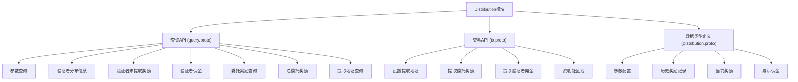
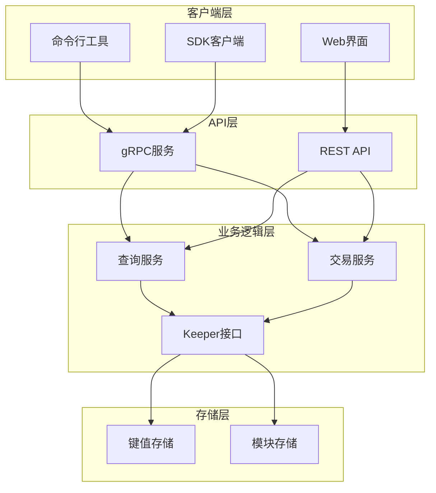
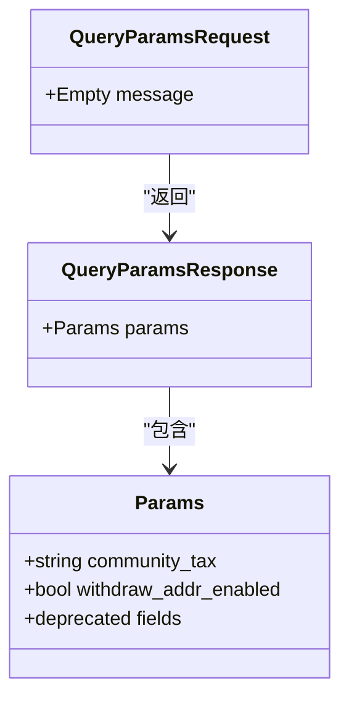
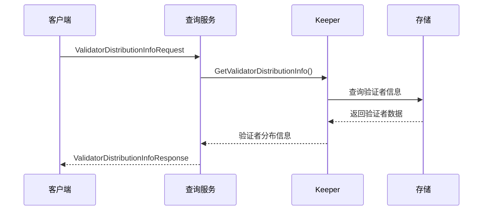
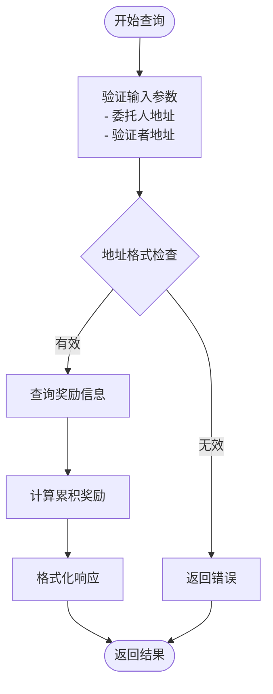
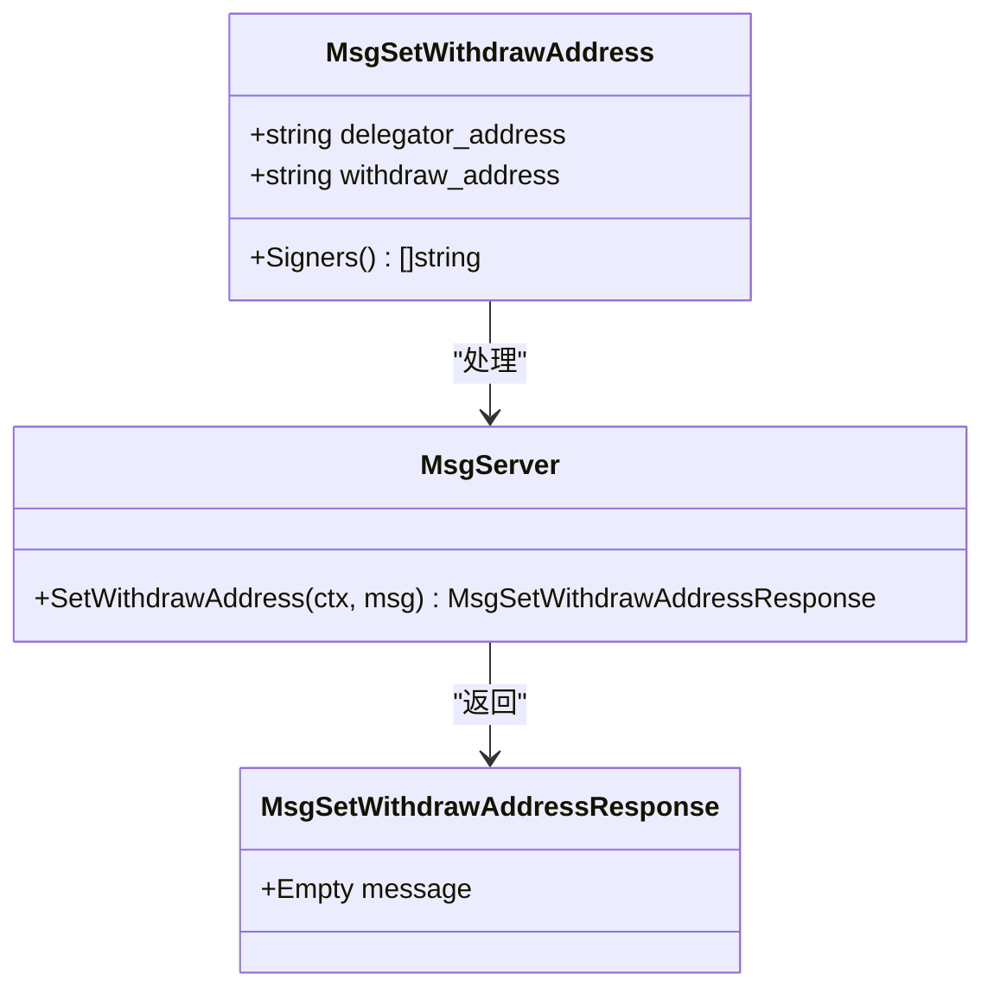
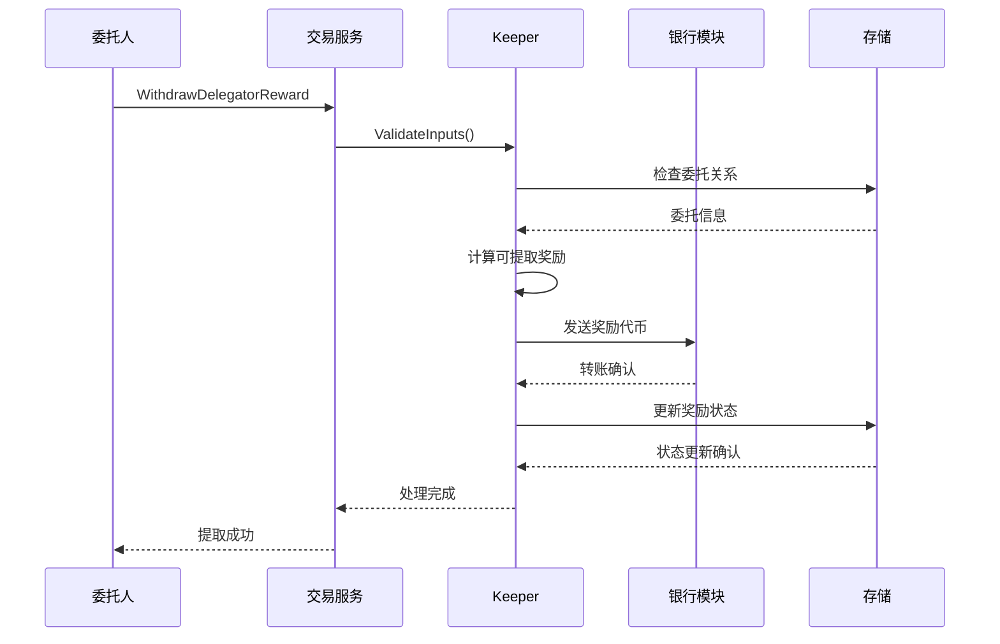
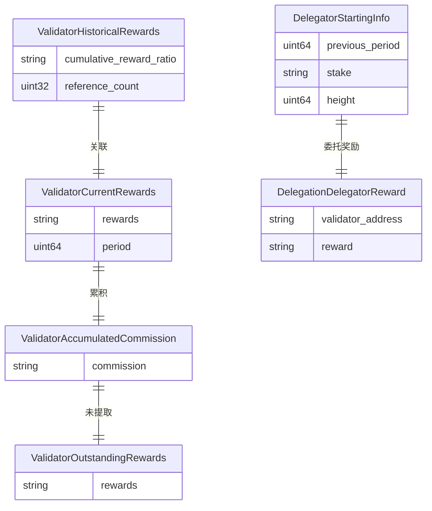
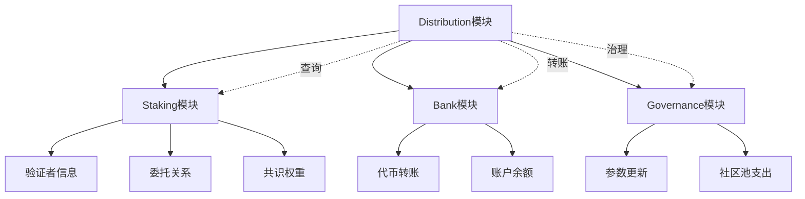

# Distribution API参考

<cite>
**本文档中引用的文件**
- [query.proto](file://proto/cosmos/distribution/v1beta1/query.proto)
- [tx.proto](file://proto/cosmos/distribution/v1beta1/tx.proto)
- [distribution.proto](file://proto/cosmos/distribution/v1beta1/distribution.proto)
- [query.pulsar.go](file://api/cosmos/distribution/v1beta1/query.pulsar.go)
- [tx.pulsar.go](file://api/cosmos/distribution/v1beta1/tx.pulsar.go)
- [grpc_query_suite.go](file://tests/e2e/distribution/grpc_query_suite.go)
- [grpc_query_test.go](file://tests/integration/distribution/keeper/grpc_query_test.go)
- [msg_server_test.go](file://tests/integration/distribution/keeper/msg_server_test.go)
</cite>

## 目录
1. [简介](#简介)
2. [项目结构](#项目结构)
3. [核心组件](#核心组件)
4. [架构概览](#架构概览)
5. [详细组件分析](#详细组件分析)
6. [依赖关系分析](#依赖关系分析)
7. [性能考虑](#性能考虑)
8. [故障排除指南](#故障排除指南)
9. [结论](#结论)

## 简介

Cosmos SDK的Distribution模块提供了奖励分配的核心功能，负责处理验证者佣金、委托奖励以及社区池资金的分配。该模块通过一系列查询API允许用户查询奖励信息，通过交易API执行奖励提取操作。

本文档详细描述了Distribution模块的API接口，包括查询类API用于获取奖励信息，交易类API用于执行奖励提取和地址设置操作。重点介绍了奖励分配机制在API层面的体现，包括累积分发机制的处理方式。

## 项目结构

Distribution模块的API结构遵循Cosmos SDK的标准protobuf定义模式，主要包含以下核心文件：

**图表来源**
- [query.proto](file://proto/cosmos/distribution/v1beta1/query.proto#L1-L258)
- [tx.proto](file://proto/cosmos/distribution/v1beta1/tx.proto#L1-L217)
- [distribution.proto](file://proto/cosmos/distribution/v1beta1/distribution.proto#L1-L195)

**章节来源**
- [query.proto](file://proto/cosmos/distribution/v1beta1/query.proto#L1-L258)
- [tx.proto](file://proto/cosmos/distribution/v1beta1/tx.proto#L1-L217)
- [distribution.proto](file://proto/cosmos/distribution/v1beta1/distribution.proto#L1-L195)

## 核心组件

Distribution模块包含三个主要组件：查询服务、交易服务和数据模型。每个组件都有明确的职责分工：

### 查询服务组件
查询服务提供各种奖励信息的查询功能，支持实时获取验证者和委托人的奖励状态。

### 交易服务组件  
交易服务处理奖励提取、地址设置等操作，确保奖励分配的安全性和一致性。

### 数据模型组件
数据模型定义了奖励分配过程中的各种数据结构，包括参数配置、历史记录和当前状态。

**章节来源**
- [query.proto](file://proto/cosmos/distribution/v1beta1/query.proto#L14-L75)
- [tx.proto](file://proto/cosmos/distribution/v1beta1/tx.proto#L14-L57)
- [distribution.proto](file://proto/cosmos/distribution/v1beta1/distribution.proto#L12-L195)

## 架构概览

Distribution模块采用分层架构设计，通过gRPC接口暴露功能：

**图表来源**
- [query.pulsar.go](file://api/cosmos/distribution/v1beta1/query.pulsar.go#L1-L50)
- [tx.pulsar.go](file://api/cosmos/distribution/v1beta1/tx.pulsar.go#L1-L50)

## 详细组件分析

### 查询API组件

查询API提供了全面的奖励信息查询功能，支持多种查询场景：

#### 参数查询 (QueryParams)

**图表来源**
- [query.proto](file://proto/cosmos/distribution/v1beta1/query.proto#L77-L84)
- [distribution.proto](file://proto/cosmos/distribution/v1beta1/distribution.proto#L13-L44)

#### 验证者分布信息查询 (QueryValidatorDistributionInfo)

该查询返回验证者的佣金和自委托奖励信息：

**图表来源**
- [query.proto](file://proto/cosmos/distribution/v1beta1/query.proto#L86-L105)

#### 委托奖励查询 (QueryDelegationRewards)

委托奖励查询是最常用的API之一，用于获取特定委托人对特定验证者的奖励：

**图表来源**
- [query.proto](file://proto/cosmos/distribution/v1beta1/query.proto#L159-L179)

**章节来源**
- [query.proto](file://proto/cosmos/distribution/v1beta1/query.proto#L14-L75)
- [query.pulsar.go](file://api/cosmos/distribution/v1beta1/query.pulsar.go#L9575-L9655)

### 交易API组件

交易API处理奖励提取和相关操作：

#### 设置提取地址 (SetWithdrawAddress)

**图表来源**
- [tx.proto](file://proto/cosmos/distribution/v1beta1/tx.proto#L59-L74)

#### 提取委托奖励 (WithdrawDelegatorReward)

提取委托奖励是奖励分配机制的核心功能：

**图表来源**
- [tx.proto](file://proto/cosmos/distribution/v1beta1/tx.proto#L76-L99)
- [msg_server_test.go](file://tests/integration/distribution/keeper/msg_server_test.go#L228-L274)

**章节来源**
- [tx.proto](file://proto/cosmos/distribution/v1beta1/tx.proto#L14-L57)
- [tx.pulsar.go](file://api/cosmos/distribution/v1beta1/tx.pulsar.go#L20-L504)

### 数据模型组件

数据模型定义了奖励分配过程中的核心数据结构：

#### 奖励数据结构

**图表来源**
- [distribution.proto](file://proto/cosmos/distribution/v1beta1/distribution.proto#L46-L182)

**章节来源**
- [distribution.proto](file://proto/cosmos/distribution/v1beta1/distribution.proto#L12-L195)

## 依赖关系分析

Distribution模块与其他模块存在密切的依赖关系：

**图表来源**
- [query.proto](file://proto/cosmos/distribution/v1beta1/query.proto#L1-L11)
- [tx.proto](file://proto/cosmos/distribution/v1beta1/tx.proto#L1-L13)

**章节来源**
- [query.proto](file://proto/cosmos/distribution/v1beta1/query.proto#L1-L11)
- [tx.proto](file://proto/cosmos/distribution/v1beta1/tx.proto#L1-L13)

## 性能考虑

Distribution模块在设计时充分考虑了性能优化：

### 查询优化
- 使用索引加速奖励查询
- 缓存常用奖励数据
- 分页处理大量委托奖励

### 交易优化
- 批量处理奖励提取
- 异步处理大额转账
- 最小化存储访问次数

### 存储优化
- 压缩历史奖励数据
- 定期清理过期记录
- 分层存储策略

## 故障排除指南

### 常见问题及解决方案

#### 奖励查询失败
**问题描述**: 查询委托奖励时返回空结果或错误
**可能原因**: 
- 委托关系不存在
- 验证者地址无效
- 区块高度不正确

**解决方案**:
1. 验证地址格式正确性
2. 确认委托关系存在
3. 检查区块同步状态

#### 奖励提取失败
**问题描述**: 提取奖励时出现交易错误
**可能原因**:
- 可用奖励不足
- 地址权限问题
- 网络费用不足

**解决方案**:
1. 检查可用奖励余额
2. 验证提取地址权限
3. 确保账户有足够的gas费

**章节来源**
- [grpc_query_test.go](file://tests/integration/distribution/keeper/grpc_query_test.go#L107-L148)
- [msg_server_test.go](file://tests/integration/distribution/keeper/msg_server_test.go#L228-L274)

## 结论

Cosmos SDK的Distribution模块提供了完整而强大的奖励分配API体系。通过查询API，用户可以实时获取验证者和委托人的奖励信息；通过交易API，用户可以安全地提取奖励并管理提取地址。

该模块的设计充分体现了Cosmos生态系统的去中心化理念，通过透明的API接口确保奖励分配的公平性和可审计性。累积分发机制在API层面得到了良好的体现，为构建复杂的奖励分配应用提供了坚实的基础。

未来的发展方向包括：
- 支持更多类型的奖励分配
- 优化查询性能和用户体验
- 增强安全性和抗审查能力
- 扩展跨链奖励分配功能