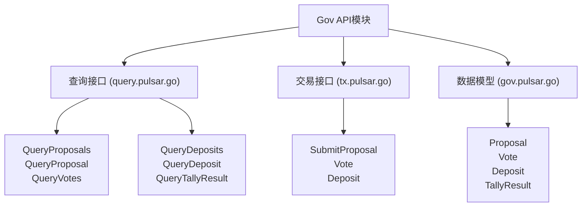
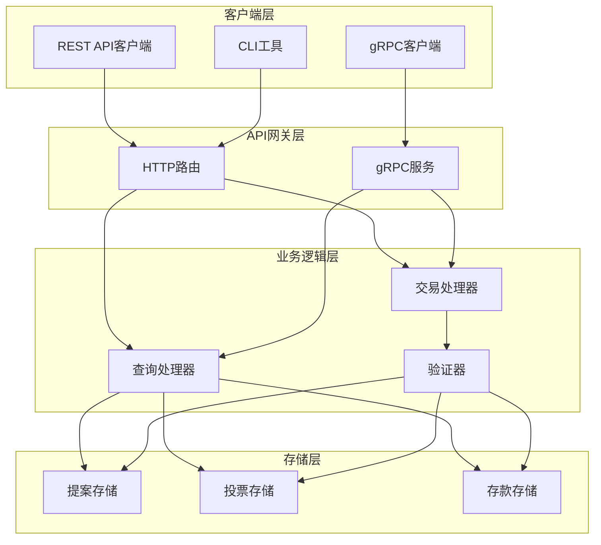
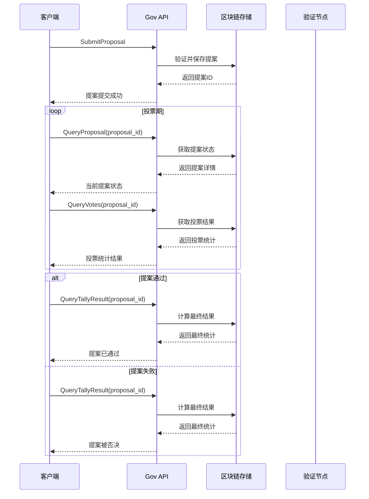
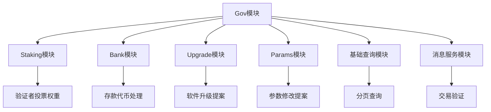

# Gov API参考

<cite>
**本文档中引用的文件**
- [api/cosmos/gov/v1/query.pulsar.go](file://api/cosmos/gov/v1/query.pulsar.go)
- [api/cosmos/gov/v1/tx.pulsar.go](file://api/cosmos/gov/v1/tx.pulsar.go)
- [api/cosmos/gov/v1/gov.pulsar.go](file://api/cosmos/gov/v1/gov.pulsar.go)
- [tests/e2e/gov/grpc.go](file://tests/e2e/gov/grpc.go)
- [tests/e2e/gov/deposits.go](file://tests/e2e/gov/deposits.go)
- [tests/e2e/gov/tx.go](file://tests/e2e/gov/tx.go)
- [systemtests/cli.go](file://systemtests/cli.go)
</cite>

## 目录
1. [简介](#简介)
2. [项目结构](#项目结构)
3. [核心组件](#核心组件)
4. [架构概览](#架构概览)
5. [详细组件分析](#详细组件分析)
6. [依赖关系分析](#依赖关系分析)
7. [性能考虑](#性能考虑)
8. [故障排除指南](#故障排除指南)
9. [结论](#结论)

## 简介

Cosmos SDK的治理（Gov）模块提供了完整的提案生命周期管理功能，包括提案提交、投票、存款等核心操作。该模块支持多种提案类型，如文本提案、软件升级提案、参数修改提案等，并提供了丰富的查询接口来跟踪提案状态和投票结果。

本文档详细介绍了Gov模块的所有API端点，包括查询接口和交易接口的使用方法、参数说明和响应格式。

## 项目结构

Gov模块的API结构遵循标准的Cosmos SDK模式，主要包含以下核心文件：



**图表来源**
- [api/cosmos/gov/v1/query.pulsar.go](file://api/cosmos/gov/v1/query.pulsar.go#L1-L100)
- [api/cosmos/gov/v1/tx.pulsar.go](file://api/cosmos/gov/v1/tx.pulsar.go#L1-L100)
- [api/cosmos/gov/v1/gov.pulsar.go](file://api/cosmos/gov/v1/gov.pulsar.go#L1-L100)

**章节来源**
- [api/cosmos/gov/v1/query.pulsar.go](file://api/cosmos/gov/v1/query.pulsar.go#L1-L50)
- [api/cosmos/gov/v1/tx.pulsar.go](file://api/cosmos/gov/v1/tx.pulsar.go#L1-L50)
- [api/cosmos/gov/v1/gov.pulsar.go](file://api/cosmos/gov/v1/gov.pulsar.go#L1-L50)

## 核心组件

### 查询接口组件

Gov模块提供了多个查询接口来获取提案相关信息：

1. **提案查询接口**
   - `QueryProposals`: 获取所有提案列表
   - `QueryProposal`: 获取单个提案详情

2. **投票查询接口**
   - `QueryVotes`: 获取提案的所有投票
   - `QueryVote`: 获取特定投票者的投票

3. **存款查询接口**
   - `QueryDeposits`: 获取提案的所有存款
   - `QueryDeposit`: 获取特定地址的存款

4. **统计查询接口**
   - `QueryTallyResult`: 获取提案的最终统计结果

**章节来源**
- [api/cosmos/gov/v1/query.pulsar.go](file://api/cosmos/gov/v1/query.pulsar.go#L8742-L8799)

### 交易接口组件

Gov模块的核心交易接口：

1. **提案相关交易**
   - `MsgSubmitProposal`: 提交新提案
   - `MsgVote`: 对提案进行投票
   - `MsgDeposit`: 向提案添加存款

2. **提案类型支持**
   - 文本提案 (Text Proposal)
   - 软件升级提案 (Software Upgrade Proposal)
   - 参数修改提案 (Parameter Change Proposal)
   - 法案提案 (Community Pool Spend Proposal)

**章节来源**
- [api/cosmos/gov/v1/tx.pulsar.go](file://api/cosmos/gov/v1/tx.pulsar.go#L1-L500)
- [api/cosmos/gov/v1/gov.pulsar.go](file://api/cosmos/gov/v1/gov.pulsar.go#L1-L500)

## 架构概览

Gov模块采用分层架构设计，清晰分离查询逻辑和业务逻辑：



**图表来源**
- [api/cosmos/gov/v1/query.pulsar.go](file://api/cosmos/gov/v1/query.pulsar.go#L1-L100)
- [api/cosmos/gov/v1/tx.pulsar.go](file://api/cosmos/gov/v1/tx.pulsar.go#L1-L100)

## 详细组件分析

### 查询接口详细分析

#### QueryProposals - 提案列表查询

**端点**: `GET /cosmos/gov/v1/proposals`

**请求参数**:
- `proposal_status` (可选): 按提案状态过滤 (枚举值: Unspecified, DepositPeriod, VotingPeriod, Passed, Rejected, Failed)
- `voter` (可选): 按投票者地址过滤
- `depositor` (可选): 按存款者地址过滤
- `pagination` (可选): 分页参数

**响应字段**:
```json
{
  "proposals": [
    {
      "id": "1",
      "messages": [...],
      "status": "PROPOSAL_STATUS_VOTING_PERIOD",
      "final_tally_result": {
        "yes": "1000000",
        "abstain": "0",
        "no": "0",
        "no_with_veto": "0"
      },
      "submit_time": "2023-01-01T00:00:00Z",
      "deposit_end_time": "2023-01-15T00:00:00Z",
      "total_deposit": [{"denom": "uatom", "amount": "1000000"}],
      "voting_start_time": "2023-01-15T00:00:00Z",
      "voting_end_time": "2023-01-22T00:00:00Z"
    }
  ],
  "pagination": {
    "next_key": null,
    "total": "1"
  }
}
```

**章节来源**
- [api/cosmos/gov/v1/query.pulsar.go](file://api/cosmos/gov/v1/query.pulsar.go#L5736-L5770)

#### QueryProposal - 单个提案查询

**端点**: `GET /cosmos/gov/v1/proposals/{proposal_id}`

**路径参数**:
- `proposal_id`: 提案唯一标识符

**响应字段**:
```json
{
  "proposal": {
    "id": "1",
    "messages": [
      {
        "@type": "/cosmos.gov.v1.MsgExecLegacyContent",
        "content": {
          "@type": "/cosmos.params.v1beta1.ParameterChangeProposal",
          "title": "Test Parameter Change",
          "description": "Change parameter",
          "changes": [
            {
              "subspace": "staking",
              "key": "MaxValidators",
              "value": "100"
            }
          ]
        },
        "authority": "cosmos10d07y265gmmuvt4z0w9aw880jnsr700j6zn9kn"
      }
    ],
    "status": "PROPOSAL_STATUS_PASSED",
    "final_tally_result": {
      "yes": "1000000000",
      "abstain": "0",
      "no": "0",
      "no_with_veto": "0"
    },
    "submit_time": "2023-01-01T00:00:00Z",
    "deposit_end_time": "2023-01-15T00:00:00Z",
    "total_deposit": [{"denom": "uatom", "amount": "1000000"}],
    "voting_start_time": "2023-01-15T00:00:00Z",
    "voting_end_time": "2023-01-22T00:00:00Z"
  }
}
```

**章节来源**
- [api/cosmos/gov/v1/query.pulsar.go](file://api/cosmos/gov/v1/query.pulsar.go#L8742-L8799)

#### QueryVotes - 提案投票查询

**端点**: `GET /cosmos/gov/v1/proposals/{proposal_id}/votes`

**路径参数**:
- `proposal_id`: 提案唯一标识符

**响应字段**:
```json
{
  "votes": [
    {
      "proposal_id": "1",
      "voter": "cosmos1...",
      "options": [
        {
          "option": "VOTE_OPTION_YES",
          "weight": "1.000000000000000000"
        }
      ],
      "metadata": ""
    }
  ],
  "pagination": {
    "next_key": null,
    "total": "1"
  }
}
```

**章节来源**
- [api/cosmos/gov/v1/query.pulsar.go](file://api/cosmos/gov/v1/query.pulsar.go#L8000-L8229)

### 交易接口详细分析

#### SubmitProposal - 提交提案

**端点**: `POST /cosmos/gov/v1/proposals`

**请求结构**:
```json
{
  "messages": [
    {
      "@type": "/cosmos.gov.v1.MsgExecLegacyContent",
      "content": {
        "@type": "/cosmos.upgrade.v1beta1.SoftwareUpgradeProposal",
        "title": "Test Upgrade",
        "description": "Upgrade to new version",
        "plan": {
          "name": "test-upgrade",
          "time": "0001-01-01T00:00:00Z",
          "height": "1000000",
          "info": "upgrade info",
          "upgraded_client_state": null
        }
      }
    }
  ],
  "initial_deposit": [
    {
      "denom": "uatom",
      "amount": "1000000"
    }
  ],
  "proposer": "cosmos1...",
  "metadata": "proposal metadata",
  "title": "Test Software Upgrade Proposal",
  "summary": "This is a test proposal for software upgrade",
  "expedited": false
}
```

**章节来源**
- [api/cosmos/gov/v1/tx.pulsar.go](file://api/cosmos/gov/v1/tx.pulsar.go#L1-L800)

#### Vote - 投票交易

**端点**: `POST /cosmos/gov/v1/proposals/{proposal_id}/votes`

**请求结构**:
```json
{
  "proposal_id": "1",
  "voter": "cosmos1...",
  "option": "VOTE_OPTION_YES",
  "options": [
    {
      "option": "VOTE_OPTION_YES",
      "weight": "1.000000000000000000"
    }
  ],
  "metadata": "vote metadata"
}
```

**投票选项枚举**:
- `VOTE_OPTION_UNSPECIFIED`: 未指定
- `VOTE_OPTION_YES`: 赞成
- `VOTE_OPTION_ABSTAIN`: 弃权
- `VOTE_OPTION_NO`: 反对
- `VOTE_OPTION_NO_WITH_VETO`: 否决

**章节来源**
- [api/cosmos/gov/v1/gov.pulsar.go](file://api/cosmos/gov/v1/gov.pulsar.go#L1-L800)

#### Deposit - 存款交易

**端点**: `POST /cosmos/gov/v1/proposals/{proposal_id}/deposits`

**请求结构**:
```json
{
  "proposal_id": "1",
  "depositor": "cosmos1...",
  "amount": [
    {
      "denom": "uatom",
      "amount": "1000000"
    }
  ]
}
```

**章节来源**
- [api/cosmos/gov/v1/tx.pulsar.go](file://api/cosmos/gov/v1/tx.pulsar.go#L1-L800)

### 创建软件升级提案的完整JSON示例

以下是一个完整的软件升级提案JSON示例：

```json
{
  "messages": [
    {
      "@type": "/cosmos.gov.v1.MsgExecLegacyContent",
      "content": {
        "@type": "/cosmos.upgrade.v1beta1.SoftwareUpgradeProposal",
        "title": "Test Upgrade",
        "description": "This proposal proposes a software upgrade to version 2.0.0",
        "plan": {
          "name": "test-upgrade-2.0.0",
          "time": "0001-01-01T00:00:00Z",
          "height": "1000000",
          "info": "https://example.com/upgrade-info",
          "upgraded_client_state": null
        }
      }
    }
  ],
  "initial_deposit": [
    {
      "denom": "uatom",
      "amount": "1000000"
    }
  ],
  "proposer": "cosmos1...",
  "metadata": "This is a test proposal for software upgrade",
  "title": "Test Software Upgrade Proposal",
  "summary": "This proposal aims to upgrade the software to version 2.0.0 with new features and improvements.",
  "expedited": false
}
```

### 提案状态跟踪流程



**图表来源**
- [tests/e2e/gov/grpc.go](file://tests/e2e/gov/grpc.go#L1-L200)
- [tests/e2e/gov/deposits.go](file://tests/e2e/gov/deposits.go#L1-L165)

**章节来源**
- [tests/e2e/gov/grpc.go](file://tests/e2e/gov/grpc.go#L1-L200)
- [tests/e2e/gov/deposits.go](file://tests/e2e/gov/deposits.go#L1-L165)

## 依赖关系分析

Gov模块与其他模块存在密切的依赖关系：



**图表来源**
- [api/cosmos/gov/v1/query.pulsar.go](file://api/cosmos/gov/v1/query.pulsar.go#L1-L100)
- [api/cosmos/gov/v1/tx.pulsar.go](file://api/cosmos/gov/v1/tx.pulsar.go#L1-L100)

**章节来源**
- [api/cosmos/gov/v1/query.pulsar.go](file://api/cosmos/gov/v1/query.pulsar.go#L1-L100)
- [api/cosmos/gov/v1/tx.pulsar.go](file://api/cosmos/gov/v1/tx.pulsar.go#L1-L100)

## 性能考虑

### 查询优化策略

1. **分页查询**: 大量提案时使用分页避免内存溢出
2. **索引优化**: 基于提案状态、投票者、存款者建立索引
3. **缓存机制**: 缓存频繁查询的提案状态和统计数据

### 交易处理优化

1. **批量处理**: 支持批量投票和存款操作
2. **异步验证**: 投票和存款验证可以异步执行
3. **资源限制**: 设置合理的Gas费用和区块大小限制

## 故障排除指南

### 常见错误及解决方案

1. **提案不存在错误**
   - 错误信息: `proposal {id} doesn't exist`
   - 解决方案: 检查提案ID是否正确，确认提案已提交

2. **权限不足错误**
   - 错误信息: `insufficient permissions`
   - 解决方案: 确认账户具有相应的治理权限

3. **存款不足错误**
   - 错误信息: `insufficient deposit`
   - 解决方案: 确保有足够的代币用于提案存款

4. **投票超时错误**
   - 错误信息: `voting period has ended`
   - 解决方案: 在投票期内完成投票

**章节来源**
- [tests/e2e/gov/grpc.go](file://tests/e2e/gov/grpc.go#L193-L247)
- [tests/e2e/gov/deposits.go](file://tests/e2e/gov/deposits.go#L115-L164)

## 结论

Cosmos SDK的Gov模块提供了完整而强大的治理功能，支持从提案提交到最终决策的整个生命周期。通过本文档介绍的API接口，开发者可以：

1. **全面掌握查询接口**: 使用各种查询接口获取提案、投票和存款信息
2. **熟练使用交易接口**: 提交提案、进行投票和添加存款
3. **理解提案类型**: 支持多种提案类型，满足不同治理需求
4. **跟踪提案状态**: 实时监控提案进展和投票结果

该模块的设计遵循了Cosmos SDK的最佳实践，具有良好的扩展性和维护性，为构建去中心化自治组织（DAO）和链上治理系统提供了坚实的基础。