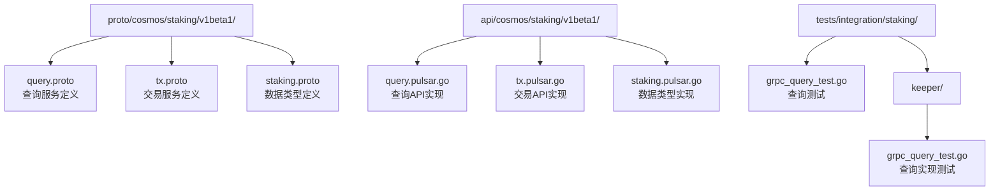
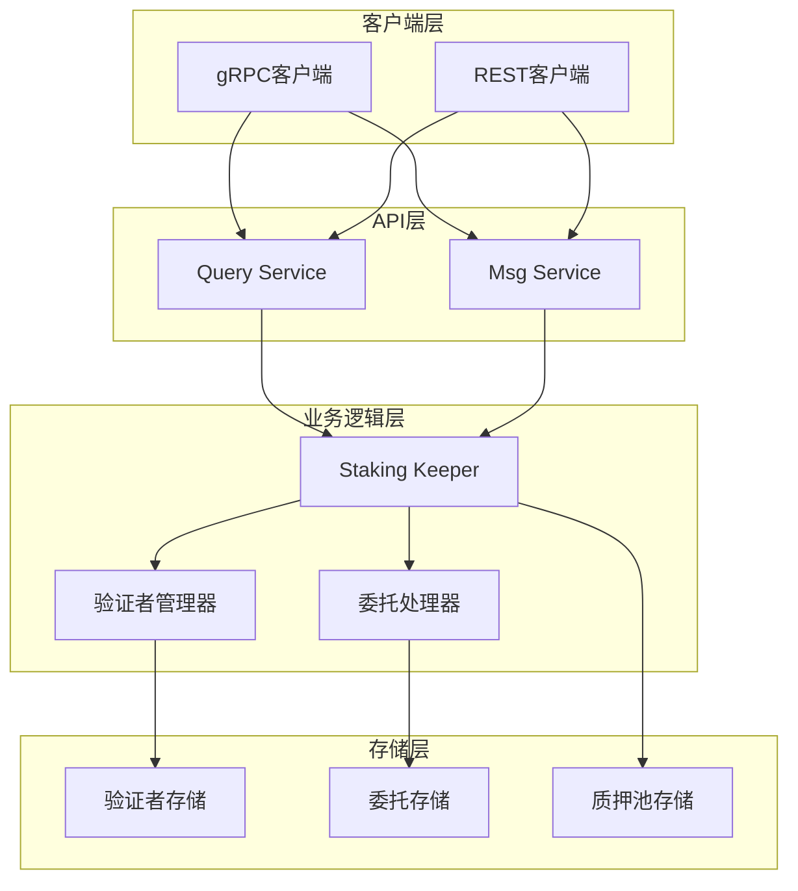
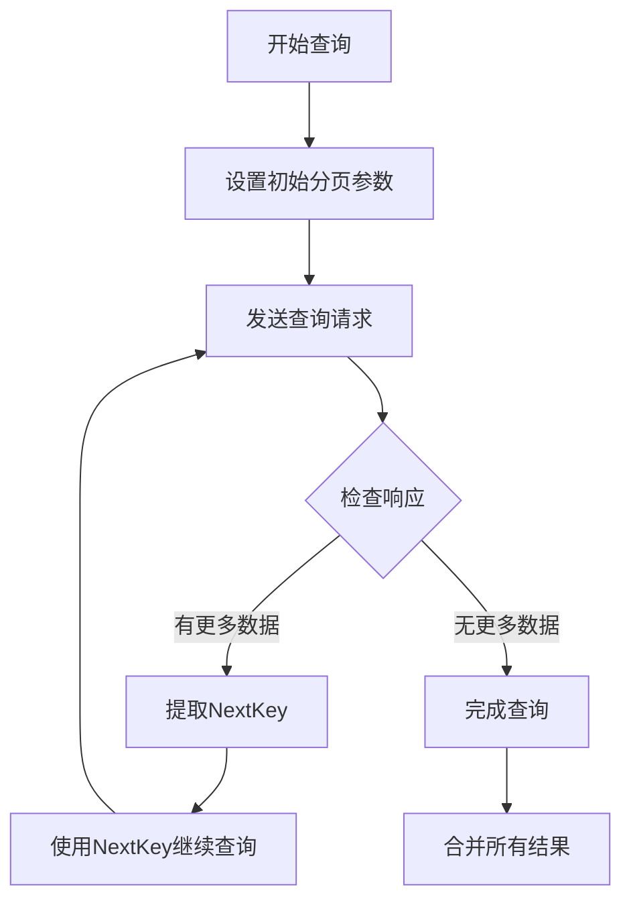
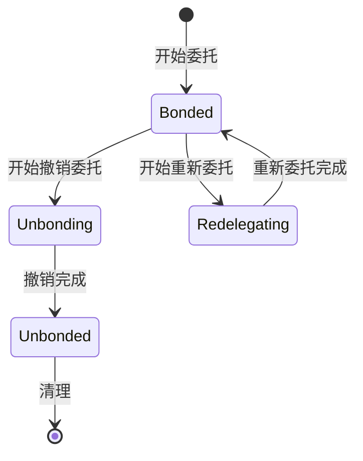
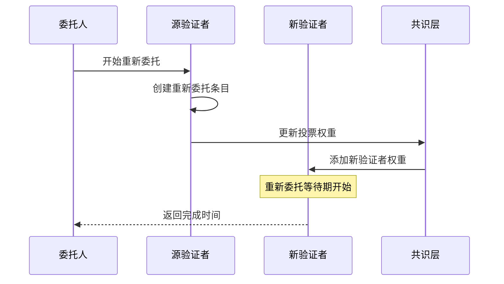
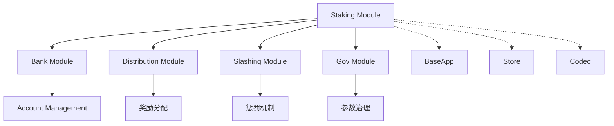

# Staking API参考

<cite>
**本文档中引用的文件**
- [query.proto](file://proto/cosmos/staking/v1beta1/query.proto)
- [tx.proto](file://proto/cosmos/staking/v1beta1/tx.proto)
- [staking.proto](file://proto/cosmos/staking/v1beta1/staking.proto)
- [query.pulsar.go](file://api/cosmos/staking/v1beta1/query.pulsar.go)
- [tx.pulsar.go](file://api/cosmos/staking/v1beta1/tx.pulsar.go)
- [staking.pulsar.go](file://api/cosmos/staking/v1beta1/staking.pulsar.go)
- [grpc_query_test.go](file://tests/integration/staking/keeper/grpc_query_test.go)
</cite>

## 目录
1. [简介](#简介)
2. [项目结构](#项目结构)
3. [核心组件](#核心组件)
4. [架构概览](#架构概览)
5. [详细组件分析](#详细组件分析)
6. [依赖关系分析](#依赖关系分析)
7. [性能考虑](#性能考虑)
8. [故障排除指南](#故障排除指南)
9. [结论](#结论)

## 简介

Cosmos SDK的Staking模块提供了完整的权益证明（Proof-of-Stake）功能，包括验证者管理、委托操作、质押管理和收益计算。该模块通过gRPC和REST API为客户端应用程序提供访问接口，支持复杂的查询操作和交易处理。

本文档详细介绍了Staking模块的所有API端点，包括查询接口和交易接口，涵盖了质押、委托、验证者管理等核心功能。

## 项目结构

Staking模块的API结构基于Protocol Buffers定义，主要包含以下核心文件：



**图表来源**
- [query.proto](file://proto/cosmos/staking/v1beta1/query.proto#L1-L388)
- [tx.proto](file://proto/cosmos/staking/v1beta1/tx.proto#L1-L205)
- [staking.proto](file://proto/cosmos/staking/v1beta1/staking.proto#L1-L394)

**章节来源**
- [query.proto](file://proto/cosmos/staking/v1beta1/query.proto#L1-L50)
- [tx.proto](file://proto/cosmos/staking/v1beta1/tx.proto#L1-L50)
- [staking.proto](file://proto/cosmos/staking/v1beta1/staking.proto#L1-L50)

## 核心组件

Staking模块的核心组件包括：

### 查询服务（Query Service）
负责提供各种查询接口，支持对验证者、委托人、质押池等信息的查询。

### 交易服务（Msg Service）
处理所有与质押相关的交易操作，包括委托、撤销委托、重新委托等。

### 数据模型
定义了验证者、委托、质押池等核心数据结构。

**章节来源**
- [query.proto](file://proto/cosmos/staking/v1beta1/query.proto#L14-L130)
- [tx.proto](file://proto/cosmos/staking/v1beta1/tx.proto#L16-L48)
- [staking.proto](file://proto/cosmos/staking/v1beta1/staking.proto#L17-L394)

## 架构概览

Staking模块采用分层架构设计，通过Protocol Buffers定义清晰的接口契约：



**图表来源**
- [query.proto](file://proto/cosmos/staking/v1beta1/query.proto#L14-L130)
- [tx.proto](file://proto/cosmos/staking/v1beta1/tx.proto#L16-L48)

## 详细组件分析

### 查询接口详解

#### 1. 验证者查询（QueryValidators）

**gRPC端点：** `/cosmos/staking/v1beta1/validators`

**请求结构：**
```protobuf
message QueryValidatorsRequest {
  string status = 1;
  cosmos.base.query.v1beta1.PageRequest pagination = 2;
}
```

**响应结构：**
```protobuf
message QueryValidatorsResponse {
  repeated Validator validators = 1;
  cosmos.base.query.v1beta1.PageResponse pagination = 2;
}
```

**参数说明：**
- `status`: 验证者状态过滤器（可选），支持"BOND_STATUS_BONDED"、"BOND_STATUS_UNBONDED"、"BOND_STATUS_UNBONDING"
- `pagination`: 分页参数，包含`limit`、`offset`、`count_total`等字段

**使用示例：**
```bash
# 查询所有验证者
curl -X GET "https://api.cosmos.network/cosmos/staking/v1beta1/validators"

# 查询已绑定的验证者并分页
curl -X GET "https://api.cosmos.network/cosmos/staking/v1beta1/validators?status=BOND_STATUS_BONDED&pagination.limit=10&pagination.count_total=true"
```

**章节来源**
- [query.proto](file://proto/cosmos/staking/v1beta1/query.proto#L133-L149)

#### 2. 委托人委托查询（QueryDelegatorDelegations）

**gRPC端点：** `/cosmos/staking/v1beta1/delegations/{delegator_addr}`

**请求结构：**
```protobuf
message QueryDelegatorDelegationsRequest {
  string delegator_addr = 1;
  cosmos.base.query.v1beta1.PageRequest pagination = 2;
}
```

**响应结构：**
```protobuf
message QueryDelegatorDelegationsResponse {
  repeated DelegationResponse delegation_responses = 1;
  cosmos.base.query.v1beta1.PageResponse pagination = 2;
}
```

**参数说明：**
- `delegator_addr`: 委托人地址（必需）
- `pagination`: 分页参数

**复杂查询场景：**

当处理大量委托记录时，分页机制至关重要：



**图表来源**
- [grpc_query_test.go](file://tests/integration/staking/keeper/grpc_query_test.go#L628-L680)

**章节来源**
- [query.proto](file://proto/cosmos/staking/v1beta1/query.proto#L240-L261)

#### 3. 撤销委托查询（QueryUnbondingDelegations）

**gRPC端点：** `/cosmos/staking/v1beta1/validators/{validator_addr}/delegations/{delegator_addr}/unbonding_delegation`

**请求结构：**
```protobuf
message QueryUnbondingDelegationRequest {
  string delegator_addr = 1;
  string validator_addr = 2;
}
```

**响应结构：**
```protobuf
message QueryUnbondingDelegationResponse {
  UnbondingDelegation unbond = 1;
}
```

**状态转换流程：**



**图表来源**
- [tx.proto](file://proto/cosmos/staking/v1beta1/tx.proto#L141-L155)

**章节来源**
- [query.proto](file://proto/cosmos/staking/v1beta1/query.proto#L220-L238)

### 交易接口详解

#### 1. 委托交易（Delegate）

**gRPC端点：** `Msg/Delegate`

**请求结构：**
```protobuf
message MsgDelegate {
  string delegator_address = 1;
  string validator_address = 2;
  cosmos.base.v1beta1.Coin amount = 3;
}
```

**响应结构：**
```protobuf
message MsgDelegateResponse {}
```

**请求格式：**
```json
{
  "delegator_address": "cosmos1...",
  "validator_address": "cosmosvaloper1...",
  "amount": {
    "denom": "uatom",
    "amount": "1000000"
  }
}
```

**状态转换：**
1. 验证输入参数有效性
2. 扣减委托人账户余额
3. 更新验证者投票权重
4. 创建委托记录
5. 触发共识更新

**章节来源**
- [tx.proto](file://proto/cosmos/staking/v1beta1/tx.proto#L103-L115)

#### 2. 撤销委托交易（Undelegate）

**gRPC端点：** `Msg/Undelegate`

**请求结构：**
```protobuf
message MsgUndelegate {
  string delegator_address = 1;
  string validator_address = 2;
  cosmos.base.v1beta1.Coin amount = 3;
}
```

**响应结构：**
```protobuf
message MsgUndelegateResponse {
  google.protobuf.Timestamp completion_time = 1;
  cosmos.base.v1beta1.Coin amount = 2;
}
```

**计算预期收益：**

收益计算涉及多个因素：
- 委托时间
- 验证者表现
- 奖励分配机制
- 手续费比例

**章节来源**
- [tx.proto](file://proto/cosmos/staking/v1beta1/tx.proto#L141-L155)

#### 3. 重新委托交易（BeginRedelegate）

**gRPC端点：** `Msg/BeginRedelegate`

**请求结构：**
```protobuf
message MsgBeginRedelegate {
  string delegator_address = 1;
  string validator_src_address = 2;
  string validator_dst_address = 3;
  cosmos.base.v1beta1.Coin amount = 4;
}
```

**响应结构：**
```protobuf
message MsgBeginRedelegateResponse {
  google.protobuf.Timestamp completion_time = 1;
}
```

**重新委托流程：**



**图表来源**
- [tx.proto](file://proto/cosmos/staking/v1beta1/tx.proto#L120-L132)

**章节来源**
- [tx.proto](file://proto/cosmos/staking/v1beta1/tx.proto#L120-L132)

### 数据模型详解

#### 验证者（Validator）

验证者是区块链网络中的关键角色，负责区块生产和验证。

**核心属性：**
- `operator_address`: 验证者操作员地址
- `consensus_pubkey`: 共识公钥
- `jailed`: 是否被监禁
- `status`: 验证者状态（Bonded/Unbonding/Unbonded）
- `tokens`: 投票权重
- `delegator_shares`: 总委托份额
- `description`: 描述信息
- `commission`: 手续费参数
- `min_self_delegation`: 最小自我委托

**章节来源**
- [staking.proto](file://proto/cosmos/staking/v1beta1/staking.proto#L82-L135)

#### 委托（Delegation）

委托表示委托人与验证者之间的关系。

**核心属性：**
- `delegator_address`: 委托人地址
- `validator_address`: 验证者地址
- `shares`: 委托份额

**章节来源**
- [staking.proto](file://proto/cosmos/staking/v1beta1/staking.proto#L191-L207)

#### 撤销委托（UnbondingDelegation）

撤销委托记录了正在进行的撤销过程。

**核心属性：**
- `delegator_address`: 委托人地址
- `validator_address`: 验证者地址
- `entries`: 撤销条目列表

**章节来源**
- [staking.proto](file://proto/cosmos/staking/v1beta1/staking.proto#L210-L223)

## 依赖关系分析

Staking模块与其他模块存在密切的依赖关系：



**图表来源**
- [query.proto](file://proto/cosmos/staking/v1beta1/query.proto#L4-L11)
- [tx.proto](file://proto/cosmos/staking/v1beta1/tx.proto#L4-L12)

**章节来源**
- [query.proto](file://proto/cosmos/staking/v1beta1/query.proto#L4-L11)
- [tx.proto](file://proto/cosmos/staking/v1beta1/tx.proto#L4-L12)

## 性能考虑

### 分页优化

对于大量数据的查询，必须合理使用分页机制：

1. **限制单次查询数量**：避免一次性查询过多数据导致内存溢出
2. **使用NextKey进行增量查询**：相比Offset更高效
3. **启用CountTotal时谨慎**：统计总数会增加查询开销

### 缓存策略

1. **验证者信息缓存**：验证者状态变化不频繁，适合缓存
2. **委托关系缓存**：委托人与验证者的映射关系可以缓存
3. **参数缓存**：系统参数变化频率低，适合本地缓存

### 并发控制

1. **读写分离**：查询操作与写入操作分开处理
2. **锁粒度优化**：尽量使用细粒度锁减少竞争
3. **异步处理**：非关键路径的操作采用异步处理

## 故障排除指南

### 常见错误及解决方案

#### 1. 地址格式错误
**错误信息：** "invalid bech32"
**解决方案：** 确保使用正确的Bech32编码格式

#### 2. 权限不足
**错误信息：** "unauthorized"
**解决方案：** 检查签名和权限配置

#### 3. 资金不足
**错误信息：** "insufficient funds"
**解决方案：** 确保账户有足够的可用资金

#### 4. 参数无效
**错误信息：** "invalid parameter"
**解决方案：** 检查参数范围和格式

### 监控指标

1. **查询延迟**：监控各查询接口的响应时间
2. **错误率**：跟踪各类错误的发生频率
3. **吞吐量**：监控系统的处理能力
4. **资源使用**：观察CPU和内存使用情况

**章节来源**
- [grpc_query_test.go](file://tests/integration/staking/keeper/grpc_query_test.go#L48-L118)

## 结论

Cosmos SDK的Staking模块提供了完整而强大的权益证明功能，通过精心设计的API接口支持各种复杂的质押和委托操作。模块采用模块化设计，具有良好的扩展性和维护性。

关键特性包括：
- 完整的查询接口支持复杂的数据检索
- 强大的交易接口支持各种质押操作
- 合理的分页机制处理大规模数据
- 清晰的状态转换确保系统一致性
- 丰富的错误处理机制提高系统稳定性

通过本文档的详细介绍，开发者可以全面理解Staking模块的API设计和使用方法，为构建基于Cosmos生态的应用程序提供坚实的基础。