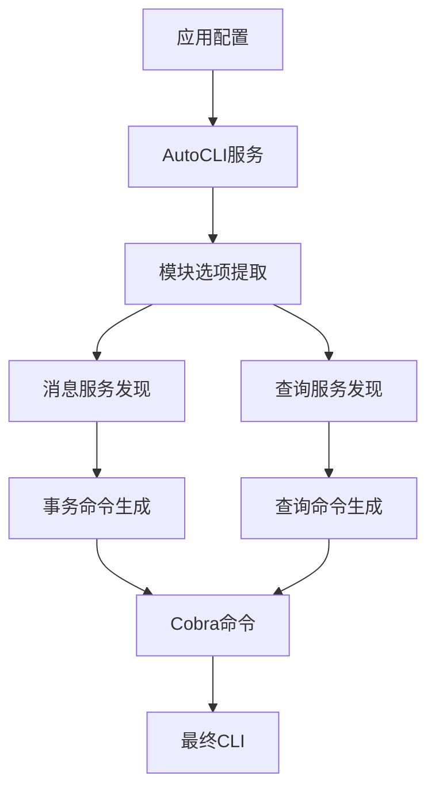
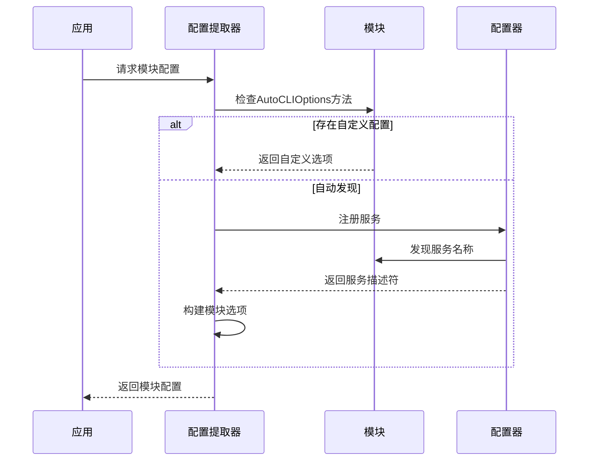
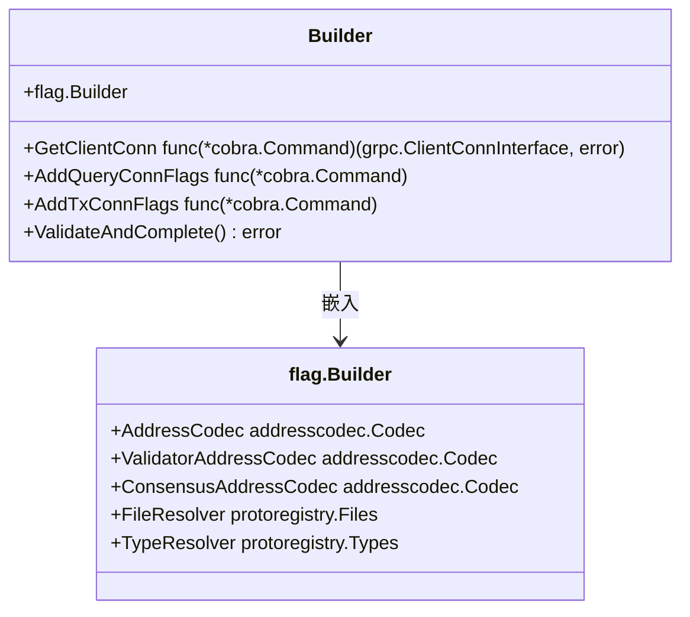
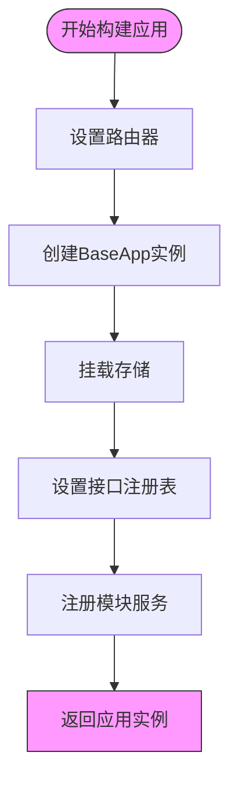
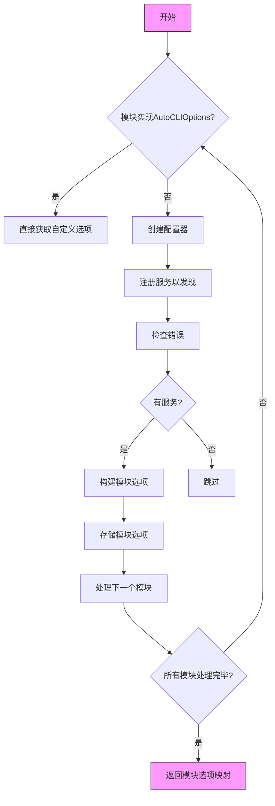

# AutoCLI自动化命令生成

<cite>
**本文档引用的文件**   
- [app.go](file://runtime/app.go)
- [builder.go](file://runtime/builder.go)
- [msg.go](file://client/v2/autocli/msg.go)
- [query.go](file://client/v2/autocli/query.go)
- [autocli.go](file://runtime/services/autocli.go)
- [options.pulsar.go](file://api/cosmos/autocli/v1/options.pulsar.go)
- [README.md](file://client/v2/README.md)
- [simapp/app.go](file://simapp/app.go)
- [x/auth/autocli.go](file://x/auth/autocli.go)
- [x/gov/autocli.go](file://x/gov/autocli.go)
</cite>

## 目录
1. [AutoCLI架构概述](#autocli架构概述)
2. [核心组件分析](#核心组件分析)
3. [命令生成逻辑](#命令生成逻辑)
4. [模块集成配置](#模块集成配置)
5. [高级配置示例](#高级配置示例)
6. [局限性与覆盖方法](#局限性与覆盖方法)
7. [性能优化建议](#性能优化建议)

## AutoCLI架构概述

AutoCLI是Cosmos SDK中的自动化命令行接口生成系统，它通过读取gRPC服务定义和Protobuf消息来自动生成CLI命令。该系统采用分层架构，核心组件包括服务发现、命令构建器和配置管理器。



**图表来源**
- [app.go](file://runtime/app.go#L40-L57)
- [autocli.go](file://runtime/services/autocli.go#L27-L92)

## 核心组件分析

AutoCLI系统由多个核心组件构成，这些组件协同工作以实现自动化命令生成。

### 服务发现组件

AutoCLI通过`ExtractAutoCLIOptions`函数从应用模块中提取配置选项。该函数首先检查模块是否实现了`AutoCLIOptions()`方法，如果存在则直接使用自定义配置；否则通过服务注册器自动发现消息和查询服务。



**图表来源**
- [autocli.go](file://runtime/services/autocli.go#L34-L88)

### 命令构建器

`Builder`结构体是AutoCLI的核心构建器，负责将服务描述符转换为Cobra命令。它包含标志构建器、客户端连接获取函数以及查询和事务连接标志添加函数。



**图表来源**
- [builder.go](file://client/v2/autocli/builder.go#L10-L28)

**本节来源**
- [builder.go](file://client/v2/autocli/builder.go#L1-L29)

## 命令生成逻辑

### 消息命令生成

消息命令生成器通过分析gRPC服务方法来创建事务命令。对于每个方法，系统会创建相应的Cobra命令，并根据消息字段生成参数标志。

```go
// 伪代码表示消息命令生成流程
func BuildMsgMethodCommand(descriptor, options) {
    execFunc := func(cmd, input) {
        // 获取客户端上下文
        clientCtx := GetClientTxContext(cmd)
        
        // 处理治理提案
        if options.GovProposal {
            return handleGovProposal(cmd, input, clientCtx)
        }
        
        // 设置签名者字段
        if signer字段为空 {
            signer := clientCtx.GetFromAddress()
            input.Set(signer字段, signer)
        }
        
        // 生成或广播交易
        return GenerateOrBroadcastTxCLI(clientCtx, cmd.Flags(), msg)
    }
    
    return buildMethodCommandCommon(descriptor, options, execFunc)
}
```

**本节来源**
- [msg.go](file://client/v2/autocli/msg.go#L119-L242)

### 查询命令生成

查询命令生成器负责创建查询相关的CLI命令。它通过gRPC客户端连接执行查询，并将结果格式化输出。

```go
// 伪代码表示查询命令生成流程
func BuildQueryMethodCommand(ctx, descriptor, options) {
    getClientConn := b.GetClientConn
    serviceName := descriptor.Parent().FullName()
    methodName := fmt.Sprintf("/%s/%s", serviceName, descriptor.Name())
    
    cmd, err := b.buildMethodCommandCommon(descriptor, options, func(cmd, input) {
        clientConn, err := getClientConn(cmd)
        output := 新输出类型()
        
        // 执行gRPC调用
        err = clientConn.Invoke(ctx, methodName, input, output)
        
        // 格式化输出
        encoder := aminojson.NewEncoder(encoderOptions)
        bz, err := enc.Marshal(output)
        
        return b.outOrStdoutFormat(cmd, bz)
    })
    
    // 添加查询连接标志
    if b.AddQueryConnFlags != nil {
        b.AddQueryConnFlags(cmd)
        cmd.Flags().BoolP(flags.FlagNoIndent, "", false, "不缩进JSON输出")
    }
    
    return cmd, nil
}
```

**本节来源**
- [query.go](file://client/v2/autocli/query.go#L117-L236)

## 模块集成配置

AutoCLI与应用配置的集成主要通过`app.go`文件中的配置实现。系统通过`AppBuilder`构建应用实例，并在构建过程中注册AutoCLI服务。

### 应用构建集成

在`runtime/app.go`中，`AppBuilder`结构体负责构建应用实例。`Build`方法在创建BaseApp实例后，会设置消息服务路由器和gRPC查询路由器，并注册服务。



**本节来源**
- [builder.go](file://runtime/builder.go#L26-L57)
- [app.go](file://runtime/app.go#L39-L271)

### 服务注册流程

AutoCLI服务通过`NewAutoCLIQueryService`函数创建，并从应用模块中提取配置选项。这个过程涉及对模块的类型断言和服务注册。



**本节来源**
- [autocli.go](file://runtime/services/autocli.go#L27-L92)

## 高级配置示例

### 基本配置示例

在自定义模块中启用AutoCLI需要实现`AutoCLIOptions`方法。以下是一个基本配置示例：

```go
func (am AppModule) AutoCLIOptions() *autocliv1.ModuleOptions {
    return &autocliv1.ModuleOptions{
        Tx: &autocliv1.ServiceCommandDescriptor{
            Service: "cosmos.bank.v1beta1.Msg",
            RpcCommandOptions: []*autocliv1.RpcCommandOptions{
                {
                    RpcMethod: "Send",
                    Use:       "send [from_key_or_address] [to_address] [amount]",
                    Short:     "发送指定金额的代币到目标地址",
                    PositionalArgs: []*autocliv1.PositionalArgDescriptor{
                        {ProtoField: "from_address"},
                        {ProtoField: "to_address"},
                        {ProtoField: "amount"},
                    },
                },
            },
        },
        Query: &autocliv1.ServiceCommandDescriptor{
            Service: "cosmos.bank.v1beta1.Query",
            RpcCommandOptions: []*autocliv1.RpcCommandOptions{
                {
                    RpcMethod: "Balance",
                    Use:       "balance [address] [denom]",
                    Short:     "查询账户余额",
                    PositionalArgs: []*autocliv1.PositionalArgDescriptor{
                        {ProtoField: "address"},
                        {ProtoField: "denom"},
                    },
                },
            },
        },
    }
}
```

**本节来源**
- [README.md](file://client/v2/README.md#L113-L138)

### 高级配置特性

#### 位置参数配置

AutoCLI支持将标志转换为位置参数，提升用户体验：

```go
*autocliv1.RpcCommandOptions{
    RpcMethod: "AuthorizeCircuitBreaker",
    Use:       "authorize <grantee> <level> <msg_type_urls>",
    PositionalArgs: []*autocliv1.PositionalArgDescriptor{
        {ProtoField: "grantee"},
        {ProtoField: "permissions.level"},
        {ProtoField: "permissions.limit_type_urls"},
    },
}
```

这允许用户以更直观的方式提供参数：
```bash
<appd> tx circuit authorize cosmos1... super-admin "/cosmos.bank.v1beta1.MsgSend,/cosmos.bank.v1beta1.MsgMultiSend"
```

#### 标志名称自定义

可以自定义生成的标志名称：

```go
autocliv1.RpcCommandOptions{ 
    FlagOptions: map[string]*autocliv1.FlagOptions{ 
        "test": { Name: "custom_name" }, 
        "test1": { Name: "other_name" }, 
    }, 
}
```

#### 治理提案支持

通过设置`GovProposal`字段，可以将任何交易转换为治理提案：

```go
*autocliv1.RpcCommandOptions{
    RpcMethod:   "UpdateParams",
    GovProposal: true,
    Short:       "创建更新参数的治理提案",
}
```

用户可以使用`--no-proposal`标志禁用提案创建。

**本节来源**
- [README.md](file://client/v2/README.md#L184-L219)

## 局限性与覆盖方法

### 当前局限性

1. **单签名者支持**：AutoCLI目前仅支持每个交易一个签名者
2. **复杂嵌套消息**：对于深度嵌套的消息结构，参数映射可能不够直观
3. **类型转换限制**：某些特殊类型（如Duration）需要自定义编码器处理
4. **向后兼容性**：与传统CLI命令的兼容性需要特别处理

### 手动覆盖方法

当需要覆盖自动生成的命令时，可以通过以下方式实现：

1. **完全自定义命令**：在模块中提供完整的Cobra命令
2. **增强现有命令**：设置`EnhanceCustomCommand`为true，允许AutoCLI增强现有命令
3. **跳过特定命令**：使用`Skip`选项跳过不需要的命令生成

```go
*autocliv1.RpcCommandOptions{
    RpcMethod: "Params",
    Skip:      true,
}
```

4. **组合使用**：在同一个模块中同时使用AutoCLI生成的命令和自定义命令

**本节来源**
- [README.md](file://client/v2/README.md#L233-L244)

## 性能优化建议

### 缓存优化

1. **协议缓冲区注册表缓存**：在`autocliConfigurator`中缓存`protoregistry.Files`实例，避免重复解析
2. **服务描述符缓存**：缓存已解析的服务描述符，减少反射开销
3. **类型解析缓存**：缓存频繁使用的类型解析结果

### 内存优化

1. **避免不必要的对象创建**：重用命令构建器实例
2. **批量处理**：在初始化时批量处理所有模块配置
3. **延迟加载**：仅在需要时解析和构建命令

### 启动时间优化

1. **并行处理**：并行处理多个模块的配置提取
2. **预编译**：在构建时预生成部分命令结构
3. **增量更新**：只在配置变更时重新生成相关命令

### 运行时优化

1. **连接池**：为gRPC客户端连接使用连接池
2. **请求批处理**：支持批量查询请求
3. **响应缓存**：对频繁查询的结果进行缓存

**本节来源**
- [query.go](file://client/v2/autocli/query.go#L117-L236)
- [msg.go](file://client/v2/autocli/msg.go#L119-L242)