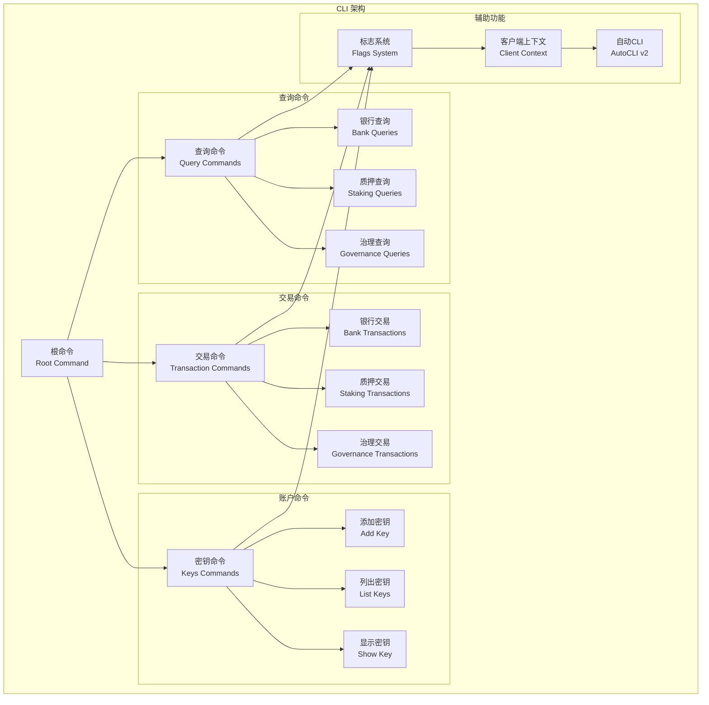
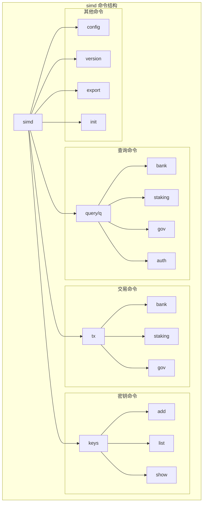
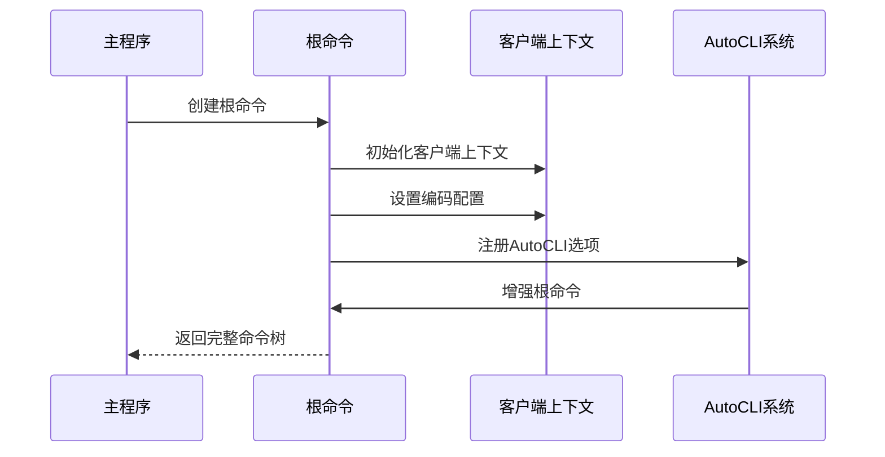
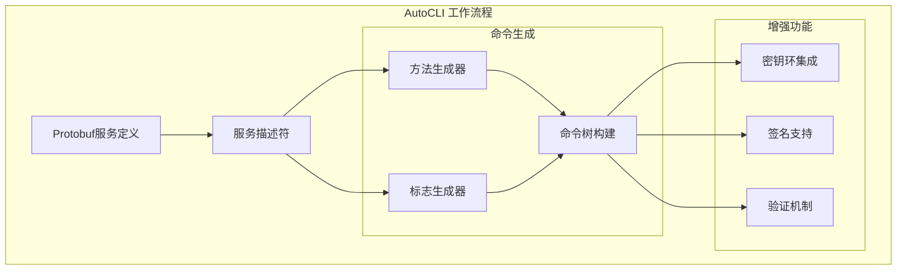
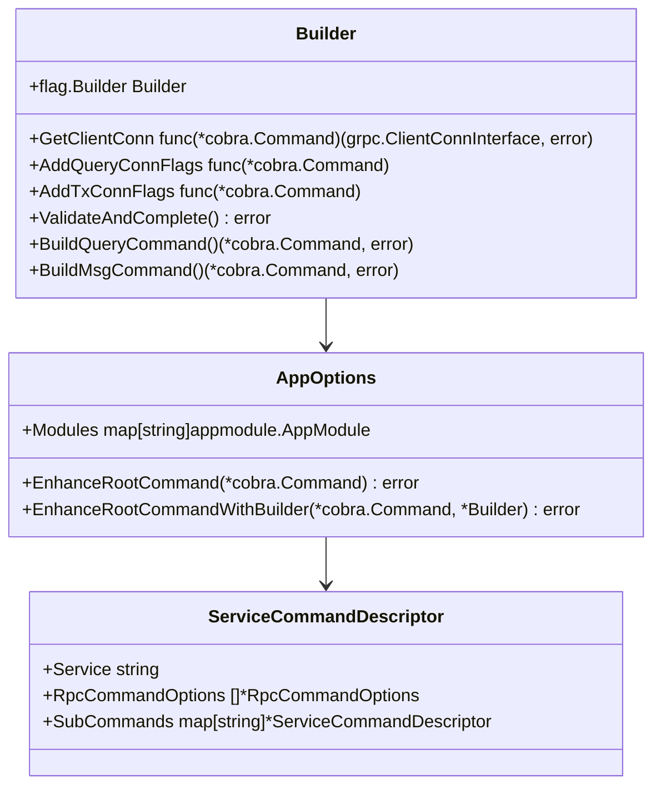
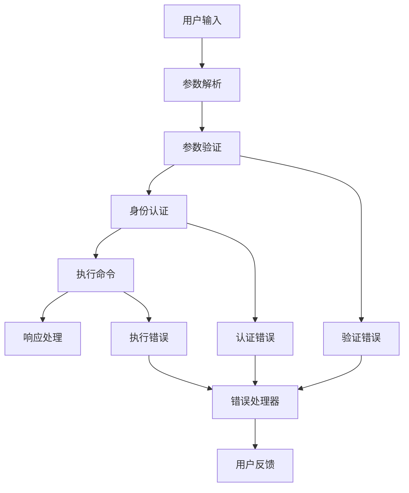

# Cosmos SDK CLI 使用指南

<cite>
**本文档中引用的文件**
- [client/cmd.go](file://client/cmd.go)
- [client/flags/flags.go](file://client/flags/flags.go)
- [client/v2/autocli/options.go](file://client/v2/autocli/options.go)
- [client/v2/autocli/query.go](file://client/v2/autocli/query.go)
- [client/v2/autocli/builder.go](file://client/v2/autocli/builder.go)
- [simapp/simd/cmd/root.go](file://simapp/simd/cmd/root.go)
- [client/keys/root.go](file://client/keys/root.go)
- [client/v2/README.md](file://client/v2/README.md)
</cite>

## 目录
1. [简介](#简介)
2. [CLI架构概览](#cli架构概览)
3. [命令结构设计](#命令结构设计)
4. [根命令和子命令注册机制](#根命令和子命令注册机制)
5. [全局和命令特定标志](#全局和命令特定标志)
6. [v2版本AutoCLI功能](#v2版本autocli功能)
7. [常用命令实用示例](#常用命令实用示例)
8. [最佳实践和集成指南](#最佳实践和集成指南)
9. [故障排除指南](#故障排除指南)
10. [总结](#总结)

## 简介

Cosmos SDK提供了强大而灵活的命令行界面（CLI），支持查询、交易、账户管理等多种操作。本指南将详细介绍CLI的使用方法，包括传统的命令结构和最新的v2版本AutoCLI功能。

CLI系统基于Cobra库构建，采用分层命令结构，支持丰富的标志（flags）配置，并通过AutoCLI实现了自动化命令生成功能。

## CLI架构概览

Cosmos SDK CLI采用模块化架构设计，主要组件包括：



**图表来源**
- [client/cmd.go](file://client/cmd.go#L1-L50)
- [client/keys/root.go](file://client/keys/root.go#L1-L30)

## 命令结构设计

Cosmos SDK CLI采用层次化的命令结构，以`simd`为例，展示典型的命令组织方式：



**图表来源**
- [simapp/simd/cmd/root.go](file://simapp/simd/cmd/root.go#L48-L114)

### 层级命令示例

典型的CLI命令遵循以下模式：

- **查询命令**: `simd query [模块] [子命令] [参数...]`
- **交易命令**: `simd tx [模块] [子命令] [参数...]`
- **密钥命令**: `simd keys [子命令] [参数...]`

例如：
- 查询余额：`simd query bank balances [地址]`
- 发送交易：`simd tx bank send [发送者] [接收者] [金额]`
- 创建密钥：`simd keys add [名称]`

**章节来源**
- [client/cmd.go](file://client/cmd.go#L1-L100)

## 根命令和子命令注册机制

### 根命令创建

根命令是CLI应用的入口点，负责初始化客户端上下文和处理全局标志。



**图表来源**
- [simapp/simd/cmd/root.go](file://simapp/simd/cmd/root.go#L26-L114)

### 子命令注册流程

子命令通过模块化方式注册到根命令中：

1. **模块发现**: 自动发现已注册的模块
2. **服务注册**: 为每个模块的服务注册对应的CLI命令
3. **标志添加**: 为命令添加必要的标志
4. **命令增强**: 应用AutoCLI增强功能

**章节来源**
- [simapp/simd/cmd/root.go](file://simapp/simd/cmd/root.go#L99-L114)

## 全局和命令特定标志

### 全局标志

全局标志在所有命令中都可用，用于配置客户端行为：

| 标志名称 | 类型 | 默认值 | 描述 |
|---------|------|--------|------|
| `--home` | string | `~/.simapp` | 客户端配置目录 |
| `--keyring-dir` | string | `--home` | 密钥环目录 |
| `--keyring-backend` | string | `os` | 密钥环后端类型 |
| `--chain-id` | string | 必需 | 区块链网络标识符 |
| `--node` | string | `tcp://localhost:26657` | CometBFT RPC节点地址 |
| `--grpc-addr` | string | 可选 | gRPC服务器地址 |
| `--output` | string | `text` | 输出格式（text/json） |

### 查询命令特定标志

| 标志名称 | 类型 | 默认值 | 描述 |
|---------|------|--------|------|
| `--height` | int64 | 0 | 查询指定区块高度 |
| `--page` | uint64 | 1 | 分页页码 |
| `--limit` | uint64 | 100 | 每页记录数 |
| `--count-total` | bool | false | 计算总记录数 |

### 交易命令特定标志

| 标志名称 | 类型 | 默认值 | 描述 |
|---------|------|--------|------|
| `--from` | string | 必需 | 交易签名者地址或密钥名称 |
| `--gas` | string | `auto` | 交易气体限制 |
| `--fees` | string | 可选 | 交易费用 |
| `--gas-prices` | string | 可选 | 气体价格 |
| `--broadcast-mode` | string | `sync` | 广播模式 |
| `--generate-only` | bool | false | 仅生成交易，不广播 |
| `--offline` | bool | false | 离线模式 |
| `--skip-confirm` | bool | false | 跳过确认提示 |

**章节来源**
- [client/flags/flags.go](file://client/flags/flags.go#L42-L211)

## v2版本AutoCLI功能

### AutoCLI概述

AutoCLI是Cosmos SDK v2引入的自动化CLI生成系统，能够根据gRPC服务定义自动生成CLI命令和标志。



**图表来源**
- [client/v2/autocli/query.go](file://client/v2/autocli/query.go#L23-L50)

### AutoCLI核心组件

AutoCLI Builder负责管理命令构建过程：



**图表来源**
- [client/v2/autocli/builder.go](file://client/v2/autocli/builder.go#L10-L29)

### 自动命令生成

AutoCLI根据protobuf消息自动生成CLI命令：

1. **服务发现**: 扫描所有注册的服务
2. **方法解析**: 解析服务中的每个方法
3. **参数映射**: 将protobuf字段映射为CLI标志
4. **命令构建**: 创建对应的Cobra命令

**章节来源**
- [client/v2/autocli/query.go](file://client/v2/autocli/query.go#L37-L118)

## 常用命令实用示例

### 银行模块命令

#### 查询余额
```bash
# 查询账户余额
simd query bank balances cosmos1address...

# 查询特定资产
simd query bank balances cosmos1address... --denom uatom

# 分页查询多个账户的余额
simd query bank balances cosmos1address... --page 1 --limit 10
```

#### 发送交易
```bash
# 发送代币
simd tx bank send [发送者] [接收者] [金额] \
  --from [密钥名称] \
  --chain-id [网络ID] \
  --gas auto \
  --fees 500uatom

# 离线模式生成交易
simd tx bank send [发送者] [接收者] [金额] \
  --from [密钥名称] \
  --generate-only > unsigned_tx.json
```

### 质押模块命令

#### 查询验证者
```bash
# 查询验证者列表
simd query staking validators

# 查询特定验证者
simd query staking validator cosmosvaloper1...

# 查询委托详情
simd query staking delegations cosmos1address...
```

#### 质押交易
```bash
# 委托代币
simd tx staking delegate cosmosvaloper1... 1000000uatom \
  --from mykey \
  --chain-id testnet

# 取消委托
simd tx staking unbond cosmosvaloper1... 500000uatom \
  --from mykey
```

### 治理模块命令

#### 查询提案
```bash
# 查询所有提案
simd query gov proposals

# 查询特定提案
simd query gov proposal 1

# 查询投票状态
simd query gov votes 1
```

#### 提交提案
```bash
# 提交文本提案
simd tx gov submit-proposal \
  --title "Test Proposal" \
  --description "This is a test proposal" \
  --type "Text" \
  --deposit "1000000uatom" \
  --from mykey \
  --chain-id testnet
```

### 密钥管理命令

#### 密钥操作
```bash
# 添加新密钥
simd keys add mykey

# 列出所有密钥
simd keys list

# 显示密钥详细信息
simd keys show mykey

# 导出密钥
simd keys export mykey > mykey.key

# 删除密钥
simd keys delete mykey
```

#### 密钥后端配置
```bash
# 使用文件后端
simd keys add mykey --keyring-backend file

# 使用测试后端（仅用于测试）
simd keys add mykey --keyring-backend test
```

**章节来源**
- [client/keys/root.go](file://client/keys/root.go#L1-L59)

## 最佳实践和集成指南

### 自定义CLI命令开发

#### 实现AutoCLIOptions接口

要为模块添加自定义CLI命令，需要实现`AutoCLIOptions()`方法：

```go
func (am AppModule) AutoCLIOptions() *autocliv1.ModuleOptions {
    return &autocliv1.ModuleOptions{
        Query: &autocliv1.ServiceCommandDescriptor{
            Service: "cosmos.bank.v1beta1.Query",
            RpcCommandOptions: []*autocliv1.RpcCommandOptions{
                {
                    RpcMethod: "Balance",
                    Use:       "balance [address] [denom]",
                    Short:     "查询账户特定资产余额",
                    PositionalArgs: []*autocliv1.PositionalArgDescriptor{
                        {ProtoField: "address"},
                        {ProtoField: "denom"},
                    },
                },
            },
        },
    }
}
```

#### 自定义命令增强

```go
func (am AppModule) AutoCLIOptions() *autocliv1.ModuleOptions {
    return &autocliv1.ModuleOptions{
        Query: &autocliv1.ServiceCommandDescriptor{
            Service: "cosmos.bank.v1beta1.Query",
            EnhanceCustomCommand: true,
            RpcCommandOptions: []*autocliv1.RpcCommandOptions{
                {
                    RpcMethod: "Balance",
                    Skip:      true, // 跳过自动生成的命令
                },
            },
        },
        Tx: &autocliv1.ServiceCommandDescriptor{
            Service: "cosmos.bank.v1beta1.Msg",
            EnhanceCustomCommand: true,
            RpcCommandOptions: []*autocliv1.RpcCommandOptions{
                {
                    RpcMethod: "Send",
                    Use:       "send [from] [to] [amount]",
                    Short:     "发送代币",
                    PositionalArgs: []*autocliv1.PositionalArgDescriptor{
                        {ProtoField: "from_address"},
                        {ProtoField: "to_address"},
                        {ProtoField: "amount"},
                    },
                },
            },
        },
    }
}
```

### 错误处理和验证

#### 命令验证模式



#### 自定义验证逻辑

```go
func validateCustomCommand(cmd *cobra.Command, args []string) error {
    // 参数数量验证
    if len(args) < 3 {
        return fmt.Errorf("至少需要3个参数: 发送者、接收者、金额")
    }
    
    // 地址格式验证
    if _, err := sdk.AccAddressFromBech32(args[0]); err != nil {
        return fmt.Errorf("无效的发送者地址: %w", err)
    }
    
    if _, err := sdk.AccAddressFromBech32(args[1]); err != nil {
        return fmt.Errorf("无效的接收者地址: %w", err)
    }
    
    // 金额格式验证
    if _, err := sdk.ParseCoinsNormalized(args[2]); err != nil {
        return fmt.Errorf("无效的金额格式: %w", err)
    }
    
    return nil
}
```

### 性能优化建议

#### 连接池管理

```go
// 优化gRPC连接管理
type OptimizedClient struct {
    connPool map[string]*grpc.ClientConn
    mu       sync.RWMutex
}

func (oc *OptimizedClient) GetConnection(nodeAddr string) (*grpc.ClientConn, error) {
    oc.mu.RLock()
    if conn, exists := oc.connPool[nodeAddr]; exists {
        oc.mu.RUnlock()
        return conn, nil
    }
    oc.mu.RUnlock()
    
    // 延迟创建连接
    return oc.createConnection(nodeAddr)
}
```

#### 缓存策略

```go
// 实现查询结果缓存
type CachedQueryClient struct {
    cache    *lru.Cache
    underlying QueryClient
}

func (cqc *CachedQueryClient) Balance(ctx context.Context, req *QueryBalanceRequest) (*QueryBalanceResponse, error) {
    cacheKey := fmt.Sprintf("balance:%s:%s", req.Address, req.Denom)
    
    if cached, found := cqc.cache.Get(cacheKey); found {
        return cached.(*QueryBalanceResponse), nil
    }
    
    resp, err := cqc.underlying.Balance(ctx, req)
    if err == nil {
        cqc.cache.Add(cacheKey, resp)
    }
    
    return resp, err
}
```

**章节来源**
- [client/v2/README.md](file://client/v2/README.md#L1-L259)

## 故障排除指南

### 常见问题和解决方案

#### 连接问题

**问题**: 无法连接到节点
```bash
# 错误信息
rpc error: code = Unavailable desc = connection error: desc = "transport: Error while dialing: dial tcp: connection refused"
```

**解决方案**:
1. 检查节点是否运行: `simd status`
2. 验证节点地址: `simd query block`
3. 检查防火墙设置
4. 确认网络连通性

#### 密钥问题

**问题**: 密钥不存在或无法解锁
```bash
# 错误信息
Key not found in keyring
```

**解决方案**:
```bash
# 检查密钥是否存在
simd keys list

# 重新导入密钥
simd keys import mykey backup.key

# 检查密钥环后端
simd keys add testkey --keyring-backend test
```

#### 交易问题

**问题**: 交易广播失败
```bash
# 错误信息
insufficient fees
```

**解决方案**:
```bash
# 增加gas价格
simd tx bank send ... --gas-prices 0.1uatom

# 手动设置gas限制
simd tx bank send ... --gas 200000

# 使用自动gas调整
simd tx bank send ... --gas auto
```

### 调试技巧

#### 启用详细日志

```bash
# 设置日志级别
simd query bank balances cosmos1... --log_level debug

# 输出到文件
simd tx bank send ... --output json 2>&1 | tee transaction.log
```

#### 验证命令语法

```bash
# 测试命令语法
simd query bank balances cosmos1... --dry-run

# 检查生成的交易
simd tx bank send ... --generate-only --dry-run
```

#### 网络诊断

```bash
# 检查网络连接
curl -s http://localhost:26657/status

# 验证gRPC连接
grpcurl -plaintext localhost:9090 cosmos.bank.v1beta1.Query/Balance
```

**章节来源**
- [client/cmd.go](file://client/cmd.go#L39-L85)

## 总结

Cosmos SDK CLI提供了强大而灵活的命令行工具集，支持从基本的查询操作到复杂的交易构建。通过理解命令结构设计、掌握标志使用方法、利用AutoCLI自动化功能，开发者可以高效地与Cosmos区块链进行交互。

### 关键要点

1. **分层命令结构**: 理解`simd query`、`simd tx`、`simd keys`等命令的层次关系
2. **标志系统**: 掌握全局标志和命令特定标志的使用
3. **AutoCLI功能**: 利用v2版本的自动化命令生成功能
4. **最佳实践**: 遵循安全性和性能优化的最佳实践
5. **故障排除**: 掌握常见问题的诊断和解决方法

### 未来发展

随着Cosmos SDK的持续发展，CLI系统将继续演进，提供更多自动化功能和更好的用户体验。开发者应该关注新版本的功能更新，并及时升级以获得最佳体验。

通过本指南的学习，您应该能够熟练使用Cosmos SDK CLI进行各种操作，并能够开发自定义的CLI命令来满足特定需求。