# 交易构建与广播流程

<cite>
**本文档引用的文件**
- [client/tx/factory.go](file://client/tx/factory.go)
- [client/tx/tx.go](file://client/tx/tx.go)
- [client/broadcast.go](file://client/broadcast.go)
- [client/query.go](file://client/query.go)
- [client/context.go](file://client/context.go)
- [client/flags/flags.go](file://client/flags/flags.go)
- [client/rpc/tx.go](file://client/rpc/tx.go)
</cite>

## 目录
1. [概述](#概述)
2. [交易工厂（TxBuilder）配置](#交易工厂txbuilder配置)
3. [交易构建流程](#交易构建流程)
4. [交易签名机制](#交易签名机制)
5. [广播策略详解](#广播策略详解)
6. [交易查询与状态监控](#交易查询与状态监控)
7. [复杂多消息交易示例](#复杂多消息交易示例)
8. [错误处理与重试策略](#错误处理与重试策略)
9. [最佳实践建议](#最佳实践建议)

## 概述

Cosmos SDK 的交易构建与广播流程是一个复杂的多阶段过程，涉及交易工厂配置、消息组装、签名验证、网络广播和状态查询等多个环节。本文档详细阐述了从构建到广播交易的完整流程，帮助开发者深入理解交易处理机制。

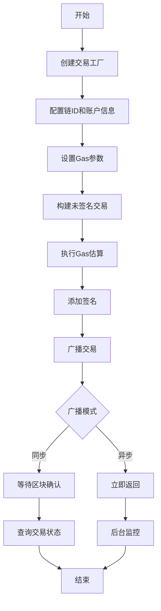

## 交易工厂（TxBuilder）配置

### 工厂结构体设计

交易工厂是整个交易处理流程的核心组件，负责管理交易构建过程中的各种配置参数。

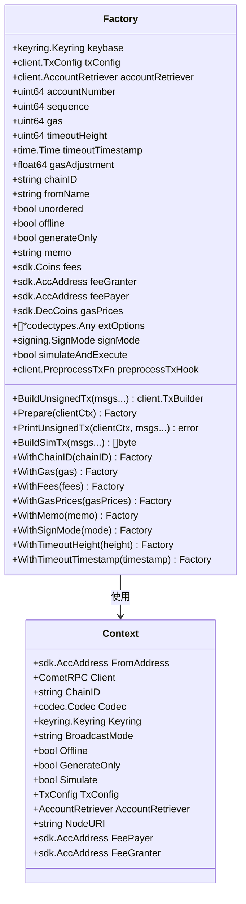

**图表来源**
- [client/tx/factory.go](file://client/tx/factory.go#L27-L53)
- [client/context.go](file://client/context.go#L27-L68)

### 核心配置参数

#### 链标识符（ChainID）
链ID是区分不同区块链网络的重要标识，确保交易在正确的网络中执行。

#### 账户序列号管理
- **accountNumber**: 账户的全局唯一编号
- **sequence**: 当前账户的交易序列号，用于防止重放攻击

#### Gas参数配置
- **gas**: 手动指定的Gas限制
- **gasAdjustment**: Gas估算调整因子，默认为1.0
- **gasPrices**: Gas价格，用于动态费用计算

#### 超时机制
- **timeoutHeight**: 基于区块高度的超时设置
- **timeoutTimestamp**: 基于时间戳的超时设置

**章节来源**
- [client/tx/factory.go](file://client/tx/factory.go#L29-L52)
- [client/tx/factory.go](file://client/tx/factory.go#L102-L122)

## 交易构建流程

### 未签名交易构建

交易构建过程分为多个步骤，每个步骤都有特定的职责和验证逻辑。

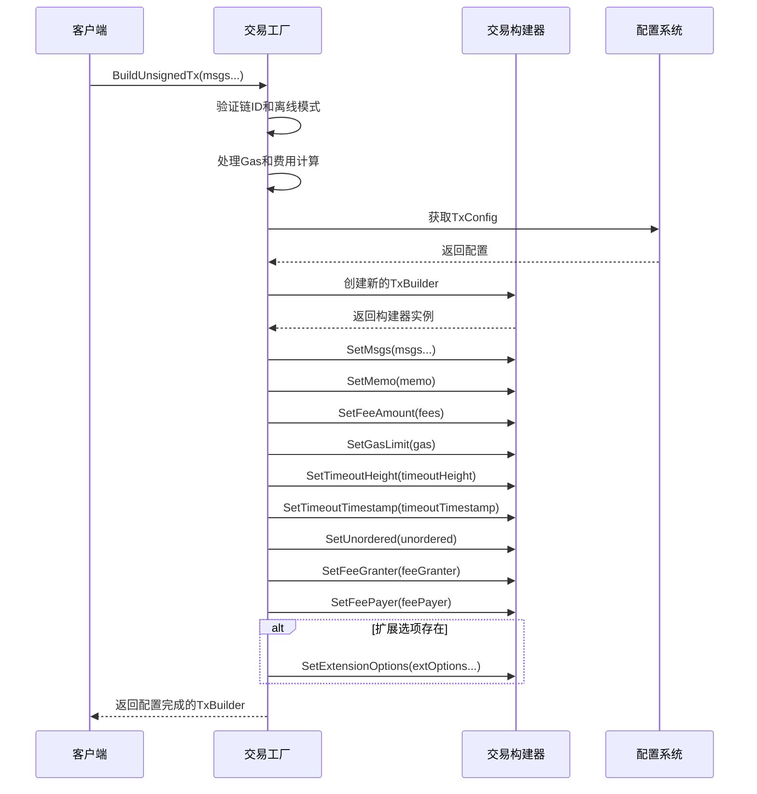

**图表来源**
- [client/tx/factory.go](file://client/tx/factory.go#L330-L387)

### Gas估算与费用计算

Gas估算是交易构建过程中的关键步骤，确保交易能够成功执行而不超出资源限制。

#### Gas估算流程

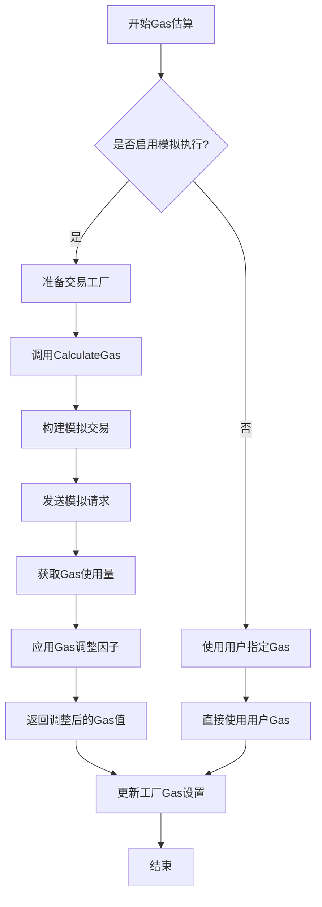

**图表来源**
- [client/tx/tx.go](file://client/tx/tx.go#L78-L90)

#### 费用计算机制

费用计算支持两种模式：
1. **固定费用模式**: 直接指定总费用
2. **Gas价格模式**: 基于Gas价格计算费用

**章节来源**
- [client/tx/factory.go](file://client/tx/factory.go#L341-L359)
- [client/tx/tx.go](file://client/tx/tx.go#L147-L166)

## 交易签名机制

### 签名流程详解

交易签名是确保交易完整性和身份认证的关键环节。

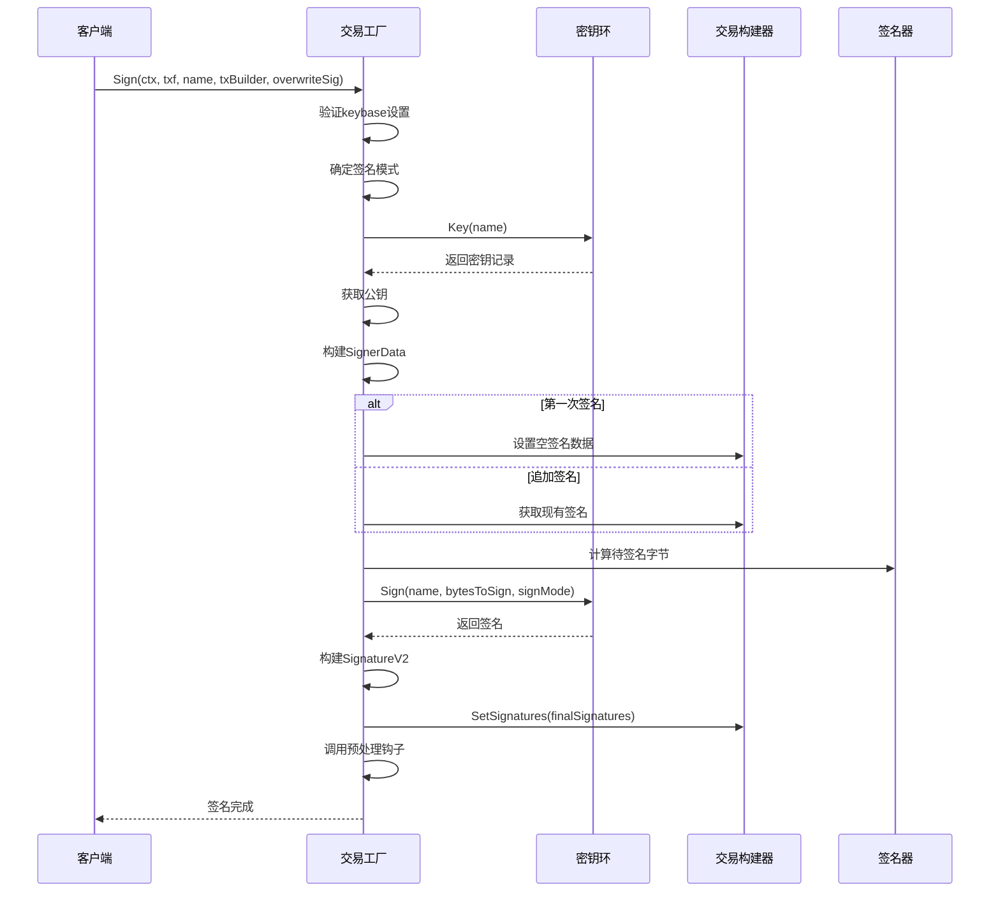

**图表来源**
- [client/tx/tx.go](file://client/tx/tx.go#L251-L360)

### 支持的签名模式

Cosmos SDK 支持多种签名模式以适应不同的安全需求和兼容性要求：

| 签名模式 | 描述 | 适用场景 |
|---------|------|----------|
| SIGN_MODE_DIRECT | 直接签名，最安全 | 生产环境，高安全性要求 |
| SIGN_MODE_LEGACY_AMINO_JSON | Amino JSON签名 | 向后兼容，旧版本节点 |
| SIGN_MODE_DIRECT_AUX | 辅助签名，用于小费 | EIP-191兼容性 |
| SIGN_MODE_TEXTUAL | 文本化签名 | 用户友好，可读性强 |
| SIGN_MODE_EIP_191 | EIP-191兼容签名 | 以太坊生态集成 |

**章节来源**
- [client/tx/tx.go](file://client/tx/tx.go#L257-L264)
- [client/flags/flags.go](file://client/flags/flags.go#L30-L39)

## 广播策略详解

### 广播模式对比

Cosmos SDK 提供三种不同的交易广播模式，每种模式适用于不同的使用场景。

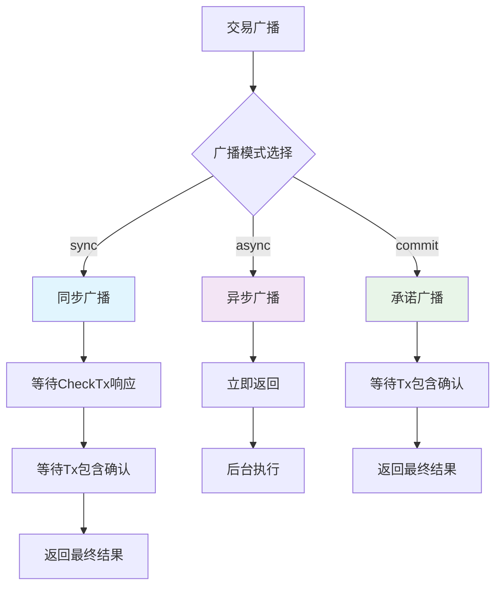

**图表来源**
- [client/broadcast.go](file://client/broadcast.go#L19-L35)

### 同步广播（BroadcastSync）

同步广播是最常用的模式，提供最高的可靠性保证。

#### 特点
- **可靠性高**: 等待交易被完全确认
- **延迟较高**: 需要等待区块打包
- **适用场景**: 重要交易，需要确认的场景

#### 实现细节
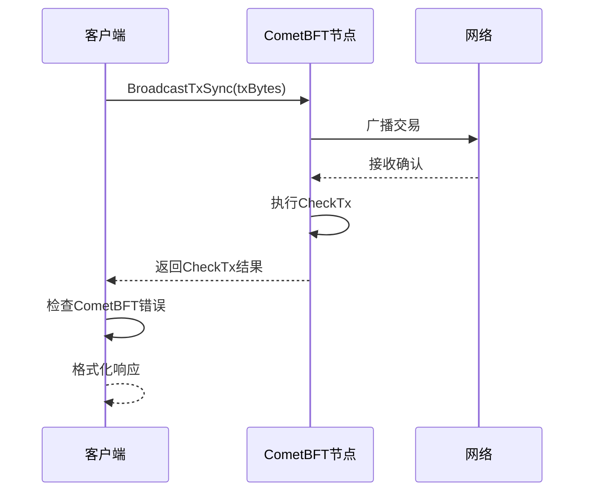

**图表来源**
- [client/broadcast.go](file://client/broadcast.go#L86-L100)

### 异步广播（BroadcastAsync）

异步广播提供最快的响应速度，适用于批量操作。

#### 特点
- **响应速度快**: 立即返回
- **可靠性较低**: 不保证交易被确认
- **适用场景**: 批量交易，性能优先场景

### 承诺广播（BroadcastCommit）

承诺广播介于同步和异步之间，提供平衡的可靠性和性能。

**章节来源**
- [client/broadcast.go](file://client/broadcast.go#L102-L116)

## 交易查询与状态监控

### 查询机制架构

交易状态查询是监控交易执行情况的重要手段。

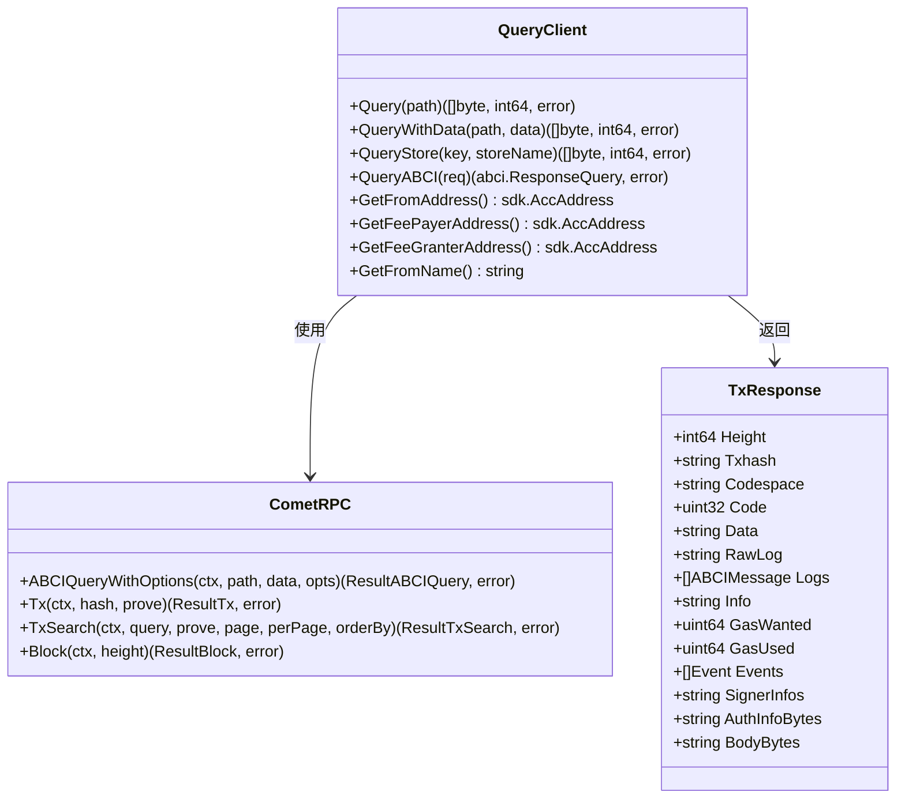

**图表来源**
- [client/query.go](file://client/query.go#L19-L171)

### 交易状态查询流程

```mermaid
flowchart TD
A[开始查询] --> B{查询类型}
B --> |交易哈希| C[查询具体交易]
B --> |区块范围| D[查询区块内交易]
B --> |自定义查询| E[ABCI查询]
C --> F[Tx(hash, prove)]
D --> G[TxSearch(query, prove, page, perPage)]
E --> H[ABCIQueryWithOptions]
F --> I{交易是否存在?}
G --> J{找到匹配交易?}
H --> K{查询成功?}
I --> |是| L[返回交易详情]
I --> |否| M[返回错误]
J --> |是| N[返回交易列表]
J --> |否| O[返回空结果]
K --> |是| P[返回查询结果]
K --> |否| Q[返回错误]
L --> R[格式化响应]
N --> R
P --> R
M --> S[结束]
O --> S
Q --> S
R --> S
```

**图表来源**
- [client/query.go](file://client/query.go#L127-L141)

### WebSocket事件订阅

对于实时监控，WebSocket事件订阅提供了更高效的解决方案。

**章节来源**
- [client/query.go](file://client/query.go#L78-L112)
- [client/rpc/tx.go](file://client/rpc/tx.go#L140-L184)

## 复杂多消息交易示例

### 多消息交易构建

复杂交易通常包含多个不同类型的消息，需要特殊的处理逻辑。

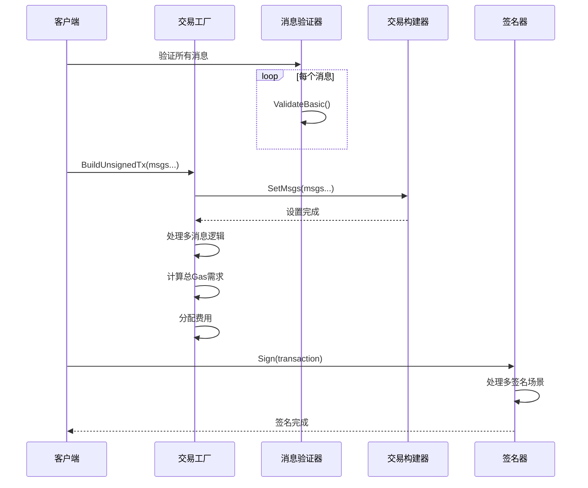

**图表来源**
- [client/tx/tx.go](file://client/tx/tx.go#L35-L51)

### 多签名交易处理

多签名交易需要特殊的签名处理逻辑，确保所有必要的签名都已提供。

**章节来源**
- [client/tx/tx.go](file://client/tx/tx.go#L206-L243)

## 错误处理与重试策略

### 常见交易失败原因

交易失败可能由多种因素引起，需要针对性的处理策略。

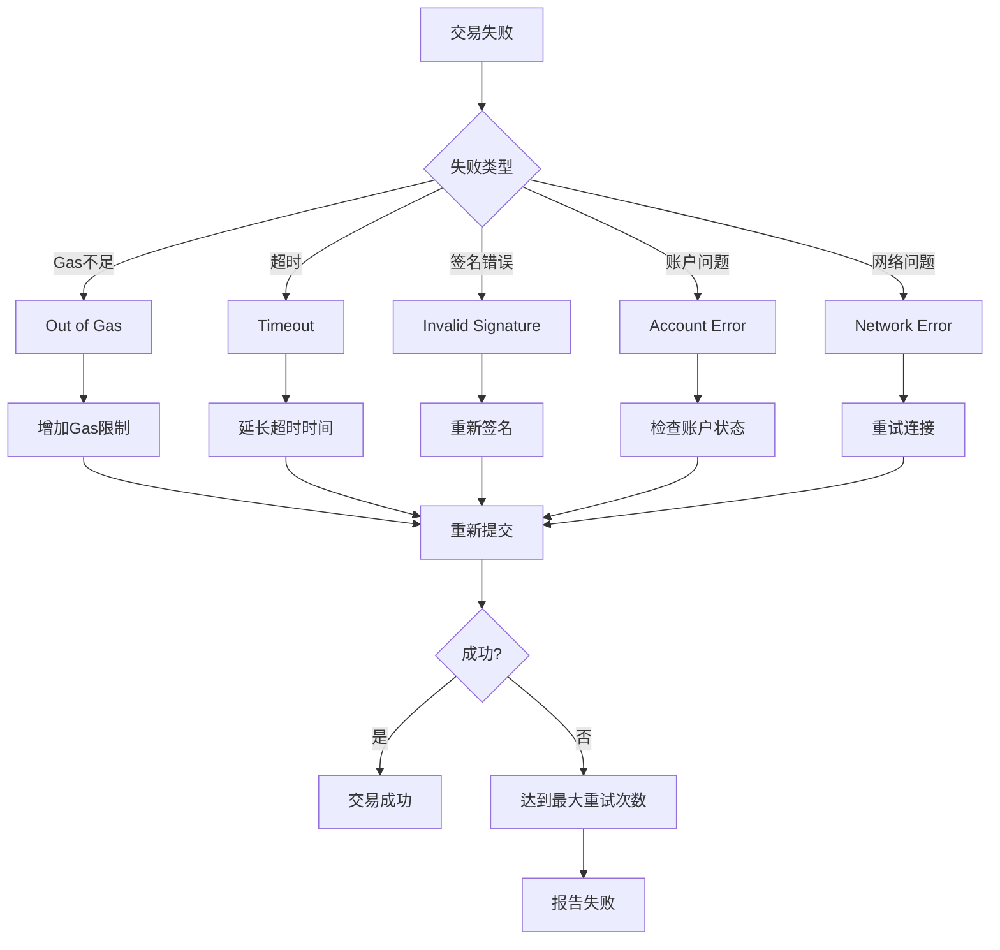

### 错误分类与处理

| 错误类型 | ABCI代码 | 处理策略 | 重试条件 |
|---------|----------|----------|----------|
| Gas不足 | 12 | 增加Gas调整因子 | 总是重试 |
| 超时 | 13 | 延长超时时间 | 时间相关错误 |
| 签名无效 | 14 | 检查私钥有效性 | 私钥相关错误 |
| 账户不存在 | 5 | 创建账户或使用其他账户 | 账户状态错误 |
| 内存池满 | 15 | 等待或降低Gas价格 | 网络拥塞错误 |

### 重试策略实现

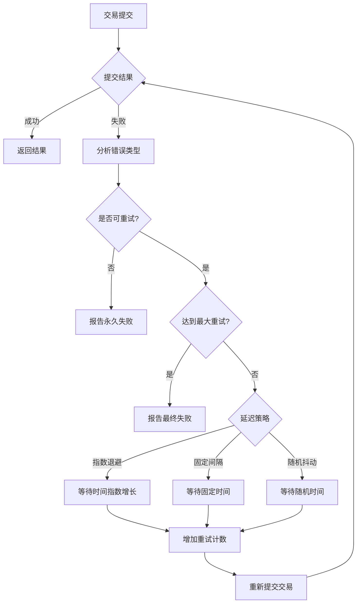

**图表来源**
- [client/broadcast.go](file://client/broadcast.go#L43-L84)

**章节来源**
- [client/broadcast.go](file://client/broadcast.go#L43-L84)
- [client/flags/flags.go](file://client/flags/flags.go#L17-L18)

## 最佳实践建议

### 性能优化建议

1. **Gas估算优化**
   - 使用合理的Gas调整因子（推荐1.1-1.3）
   - 对于简单交易，可以手动设置Gas限制
   - 利用批量Gas估算减少网络请求

2. **并发处理**
   - 对于大量交易，使用并发处理提高效率
   - 实施适当的并发控制避免网络过载
   - 使用连接池管理RPC连接

3. **缓存策略**
   - 缓存账户序列号以减少查询
   - 缓存Gas估算结果
   - 缓存链ID和其他静态配置

### 安全考虑

1. **密钥管理**
   - 使用硬件钱包处理敏感交易
   - 实施密钥轮换策略
   - 保护私钥存储和传输

2. **交易验证**
   - 在签名前验证所有输入参数
   - 检查交易大小限制
   - 验证Gas价格合理性

3. **网络安全**
   - 使用TLS加密RPC通信
   - 验证节点证书
   - 实施防DDoS措施

### 监控与调试

1. **日志记录**
   - 记录关键操作的时间戳
   - 包含足够的上下文信息
   - 实施分级日志策略

2. **指标收集**
   - 监控交易成功率
   - 跟踪Gas使用效率
   - 监控网络延迟

3. **故障排除**
   - 实施自动故障检测
   - 提供详细的错误诊断信息
   - 建立快速响应机制

通过遵循这些最佳实践，可以显著提高交易处理的可靠性、安全性和性能，确保在各种网络条件下都能稳定运行。