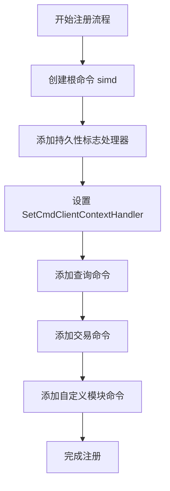
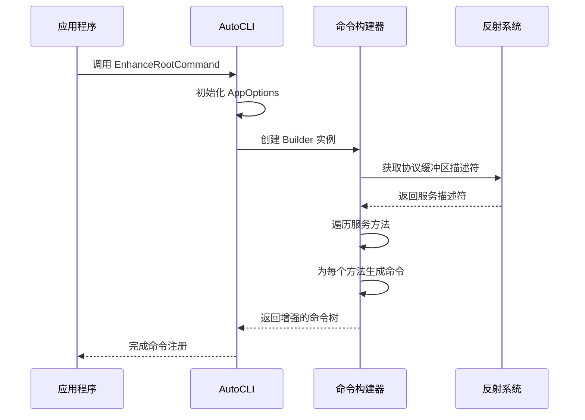
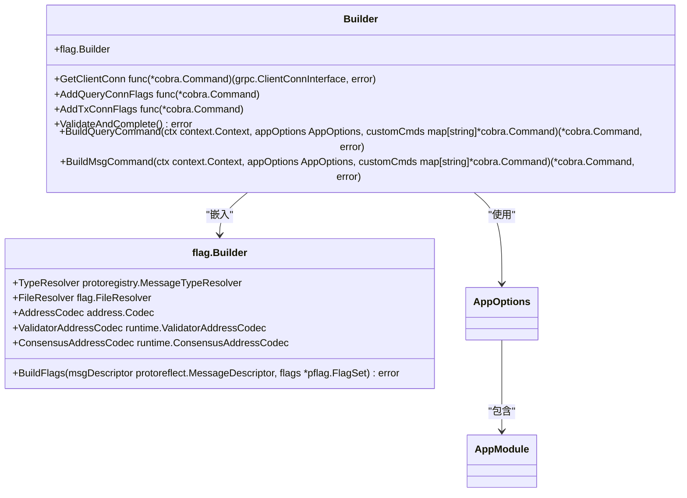
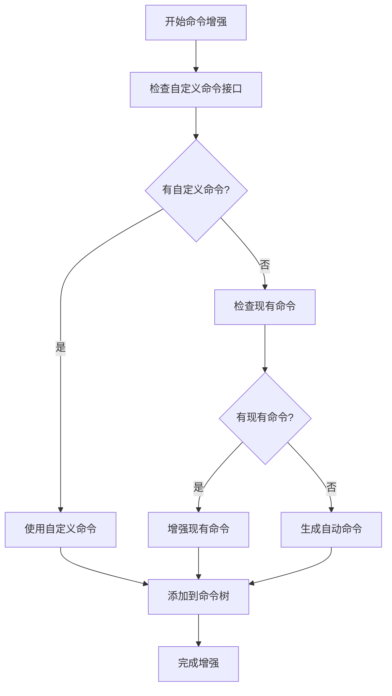

# 命令结构与注册机制

<cite>
**本文档引用的文件**  
- [cmd.go](file://client/cmd.go)
- [builder.go](file://client/v2/autocli/builder.go)
- [app.go](file://client/v2/autocli/app.go)
- [query.go](file://client/v2/autocli/query.go)
- [msg.go](file://client/v2/autocli/msg.go)
- [builder.go](file://runtime/builder.go)
</cite>

## 目录
1. [命令层级结构设计](#命令层级结构设计)
2. [Cobra命令注册流程](#cobra命令注册流程)
3. [AutoCLI自动生成机制](#autocli自动生成机制)
4. [命令构建器实现原理](#命令构建器实现原理)
5. [自定义命令注册](#自定义命令注册)
6. [高级用法](#高级用法)
7. [常见错误排查](#常见错误排查)

## 命令层级结构设计

Cosmos SDK CLI的命令层级结构采用分层设计模式，以`simd tx bank send`为例，其命令结构遵循典型的三层架构：根命令、模块命令和子命令。根命令`simd`作为应用程序的入口点，负责初始化CLI环境和注册所有子命令。`tx`作为模块命令，代表交易相关的操作集合，而`bank`和`send`则分别是银行模块和具体转账操作的子命令。

这种层级结构通过Cobra库实现，每个命令都是一个`cobra.Command`实例，通过`AddCommand`方法建立父子关系。例如，`tx`命令作为`simd`的子命令，而`bank`命令又作为`tx`的子命令。这种树状结构使得命令组织清晰，易于扩展和维护。同时，通过别名机制，用户可以使用更短的命令形式，如`simd q`代替`simd query`。

**Section sources**
- [cmd.go](file://client/cmd.go#L1-L376)

## Cobra命令注册流程

基于`cmd.go`文件，Cobra命令的注册流程始于根命令的创建和初始化。`SetCmdClientContextHandler`函数作为命令预处理钩子，在执行任何命令前读取持久性标志并设置客户端上下文。该流程通过`ReadPersistentCommandFlags`函数实现，该函数根据标志的优先级顺序更新`client.Context`：预填充的上下文字段、设置的标志值、默认标志值。

注册机制的核心是`SetCmdClientContext`函数，它将`client.Context`存储在命令的上下文中，通过`ClientContextKey`作为键。当执行命令时，`GetClientContextFromCmd`函数从命令上下文中检索`client.Context`。对于查询和交易命令，分别使用`GetClientQueryContext`和`GetClientTxContext`函数，这些函数在基础持久性标志的基础上，添加特定于查询或交易的标志处理逻辑。

**Diagram sources**
- [cmd.go](file://client/cmd.go#L30-L375)

**Section sources**
- [cmd.go](file://client/cmd.go#L30-L375)

## AutoCLI自动生成机制

`v2/autocli`包通过反射和配置实现了CLI命令的自动生成，极大地简化了命令注册过程。该机制的核心是`AppOptions`结构体，它通过依赖注入（depinject）收集应用程序的所有模块配置。`EnhanceRootCommand`方法是AutoCLI的入口点，它接收根命令并根据模块配置自动增强命令树。

自动生成过程首先通过`proto.MergedRegistry`获取协议缓冲区文件解析器，然后创建`Builder`实例。该构建器使用反射遍历gRPC服务定义，为每个RPC方法生成相应的CLI命令。对于查询命令，`BuildQueryCommand`方法创建`query`根命令，并通过`AddQueryServiceCommands`递归地为每个服务和子命令生成CLI命令。类似地，`BuildMsgCommand`处理交易命令。

**Diagram sources**
- [app.go](file://client/v2/autocli/app.go#L64-L149)
- [query.go](file://client/v2/autocli/query.go#L26-L35)

**Section sources**
- [app.go](file://client/v2/autocli/app.go#L64-L149)
- [query.go](file://client/v2/autocli/query.go#L26-L35)

## 命令构建器实现原理

`builder.go`中的命令构建器实现基于反射和模板化设计模式。`Builder`结构体包含`flag.Builder`嵌入字段，用于处理标志生成，以及`GetClientConn`、`AddQueryConnFlags`和`AddTxConnFlags`函数指针，用于连接gRPC客户端和添加连接标志。

构建器的核心方法是`buildMethodCommandCommon`，它为gRPC方法创建通用的CLI命令框架。该方法首先解析输入消息的字段，为每个字段生成相应的CLI标志。然后，它创建一个执行函数，该函数在运行时解析标志值，构建协议缓冲区消息，并通过gRPC客户端调用远程方法。对于查询命令，`BuildQueryMethodCommand`设置响应处理逻辑，将gRPC响应格式化为JSON输出。

**Diagram sources**
- [builder.go](file://client/v2/autocli/builder.go#L1-L29)
- [app.go](file://client/v2/autocli/app.go#L28-L47)

**Section sources**
- [builder.go](file://client/v2/autocli/builder.go#L1-L29)
- [app.go](file://client/v2/autocli/app.go#L28-L47)

## 自定义命令注册

自定义命令注册允许开发者在AutoCLI生成的命令基础上添加特定功能。通过实现`HasCustomQueryCommand`和`HasCustomTxCommand`接口，模块可以提供自定义的查询和交易命令。`AppOptions.EnhanceRootCommandWithBuilder`方法在增强根命令时，会检查这些接口并优先使用自定义命令。

自定义命令与AutoCLI的集成通过`customCmds`映射实现。在`enhanceCommandCommon`方法中，构建器首先检查是否存在自定义命令，如果存在则使用它，否则生成自动命令。这种设计模式确保了向后兼容性，允许逐步迁移到AutoCLI，同时保留现有的自定义命令逻辑。

**Diagram sources**
- [app.go](file://client/v2/autocli/app.go#L103-L148)
- [common.go](file://client/v2/autocli/common.go#L85-L128)

**Section sources**
- [app.go](file://client/v2/autocli/app.go#L103-L148)
- [common.go](file://client/v2/autocli/common.go#L85-L128)

## 高级用法

Cosmos SDK CLI支持多种高级用法，包括命令别名、短选项和位置参数。命令别名通过`Aliases`字段实现，如`query`命令的别名`q`。短选项使用单破折号语法，如`-h`表示帮助，而长选项使用双破折号，如`--home`。

位置参数的处理在`BuildMsgMethodCommand`中实现，通过分析消息字段的元数据确定哪些字段应作为位置参数。标志的优先级处理遵循特定顺序：预填充的上下文字段、设置的标志值、默认标志值。这确保了配置的一致性和可预测性。

此外，CLI支持事务模拟模式（`--dry-run`）、离线模式（`--offline`）和不同的广播模式（`--broadcast-mode`），这些功能通过`readTxCommandFlags`函数集成到交易上下文中。

**Section sources**
- [cmd.go](file://client/cmd.go#L216-L321)
- [msg.go](file://client/v2/autocli/msg.go#L119-L189)

## 常见错误排查

常见命令注册错误主要包括：模块配置缺失、协议缓冲区描述符未注册、gRPC服务定义不匹配等。排查这些错误时，首先应检查`AppOptions.Modules`映射是否正确注入了所有模块。其次，验证协议缓冲区文件是否已正确编译并注册到全局注册表中。

对于gRPC相关错误，应确保服务名称和方法名称与协议缓冲区定义完全匹配。使用`protoc`工具生成的Go代码应与Cosmos SDK版本兼容。调试时，可以启用详细日志记录，检查`Builder.ValidateAndComplete`方法的返回值，该方法会验证构建器字段的完整性。

**Section sources**
- [builder.go](file://client/v2/autocli/builder.go#L26-L28)
- [app.go](file://client/v2/autocli/app.go#L99-L101)
- [query.go](file://client/v2/autocli/query.go#L65-L68)