# 密钥管理操作指南

<cite>
**本文档中引用的文件**
- [root.go](file://client/keys/root.go)
- [add.go](file://client/keys/add.go)
- [list.go](file://client/keys/list.go)
- [show.go](file://client/keys/show.go)
- [import.go](file://client/keys/import.go)
- [delete.go](file://client/keys/delete.go)
- [export.go](file://client/keys/export.go)
- [mnemonic.go](file://client/keys/mnemonic.go)
- [types.go](file://client/keys/types.go)
- [utils.go](file://client/keys/utils.go)
- [output.go](file://client/keys/output.go)
- [parse.go](file://client/keys/parse.go)
- [migrate.go](file://client/keys/migrate.go)
- [rename.go](file://client/keys/rename.go)
</cite>

## 目录
1. [简介](#简介)
2. [密钥管理架构概览](#密钥管理架构概览)
3. [密钥创建与管理](#密钥创建与管理)
4. [密钥查看与查询](#密钥查看与查询)
5. [密钥导入与导出](#密钥导入与导出)
6. [密钥删除与重命名](#密钥删除与重命名)
7. [硬件钱包集成](#硬件钱包集成)
8. [密钥备份与恢复](#密钥备份与恢复)
9. [密钥迁移](#密钥迁移)
10. [故障排除](#故障排除)
11. [最佳实践](#最佳实践)

## 简介

Cosmos SDK 的密钥管理系统提供了完整的密钥生命周期管理功能，支持多种密钥类型、加密存储后端和硬件钱包集成。本指南详细介绍了密钥的创建、导入、导出、查看和删除等全生命周期管理操作。

密钥管理系统的核心特性包括：
- 支持多种加密算法（Secp256k1、Ed25519等）
- 多种存储后端（OS、File、KWallet、Pass等）
- 硬件钱包集成（Ledger Nano S/X）
- 助记词生成与恢复
- 多签密钥支持
- 密钥备份与恢复机制

## 密钥管理架构概览

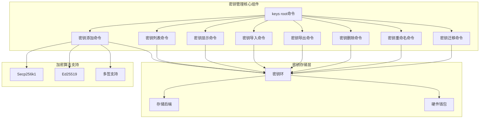

**图表来源**
- [root.go](file://client/keys/root.go#L12-L58)
- [add.go](file://client/keys/add.go#L48-L106)

**章节来源**
- [root.go](file://client/keys/root.go#L1-L59)

## 密钥创建与管理

### `simd keys add` 命令详解

`simd keys add` 是密钥管理的核心命令，支持多种密钥创建方式。

#### 基本语法
```bash
simd keys add <name> [flags]
```

#### 主要功能特性

1. **助记词生成**
   - 自动生成24字助记词
   - 支持自定义熵值输入
   - 默认使用系统熵值

2. **密钥恢复**
   - 通过助记词恢复现有密钥
   - 支持BIP39助记词验证

3. **硬件钱包集成**
   - 支持Ledger设备
   - 指定HD路径参数

4. **多签密钥**
   - 创建多签名地址
   - 支持阈值设置

#### 执行流程图

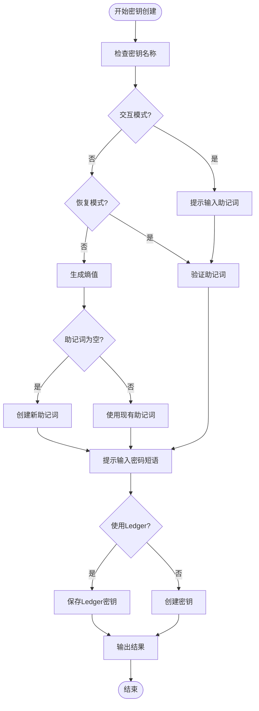

**图表来源**
- [add.go](file://client/keys/add.go#L137-L436)

#### 关键参数说明

| 参数 | 类型 | 描述 | 默认值 |
|------|------|------|--------|
| `--interactive` | bool | 交互式提示输入 | false |
| `--recover` | bool | 从助记词恢复密钥 | false |
| `--coin-type` | uint32 | BIP44币种类型 | 118 |
| `--account` | uint32 | 账户号 | 0 |
| `--index` | uint32 | 地址索引 | 0 |
| `--hd-path` | string | 自定义HD路径 | 自动生成 |
| `--dry-run` | bool | 仅模拟不保存 | false |
| `--multisig` | string | 多签密钥成员 | - |
| `--multisig-threshold` | int | 多签阈值 | 1 |

**章节来源**
- [add.go](file://client/keys/add.go#L48-L106)

### 助记词生成机制

助记词生成遵循BIP39标准，提供安全的密钥派生基础。

#### 生成过程

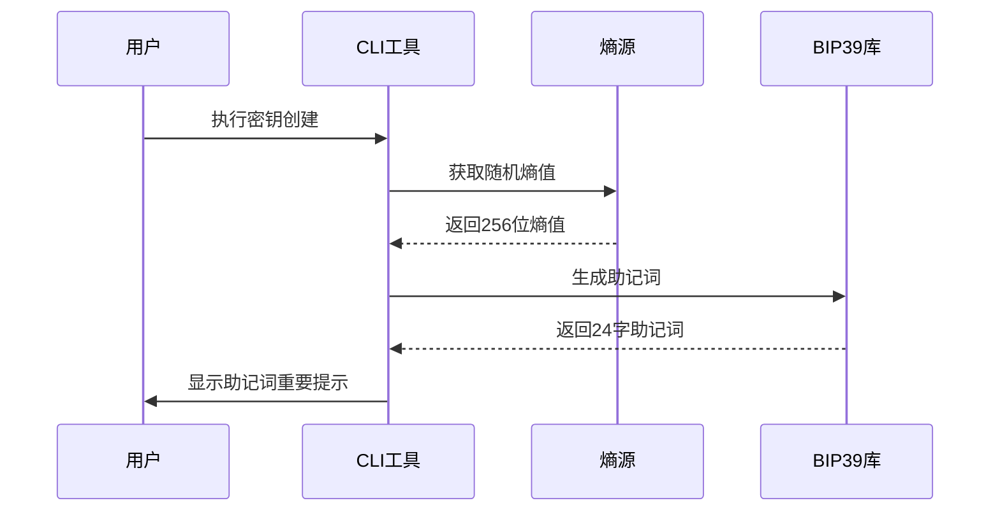

**图表来源**
- [mnemonic.go](file://client/keys/mnemonic.go#L20-L79)
- [add.go](file://client/keys/add.go#L335-L346)

**章节来源**
- [mnemonic.go](file://client/keys/mnemonic.go#L1-L79)

## 密钥查看与查询

### `simd keys list` 命令

列出所有存储在密钥环中的密钥信息。

#### 基本用法
```bash
simd keys list [flags]
```

#### 输出格式

| 格式 | 输出内容 |
|------|----------|
| 文本格式 | YAML格式的密钥列表 |
| JSON格式 | JSON格式的密钥数组 |

#### 列表输出示例
```yaml
- name: "mykey"
  type: "local"
  address: "cosmos1..."
  pubkey: '{"@type":"/cosmos.crypto.secp256k1.PubKey","key":"..."}'
```

**章节来源**
- [list.go](file://client/keys/list.go#L12-L72)

### `simd keys show` 命令

显示指定密钥的详细信息。

#### 基本语法
```bash
simd keys show <name_or_address> [flags]
```

#### 功能特性

1. **地址提取**
   ```bash
   simd keys show mykey --address
   ```

2. **公钥提取**
   ```bash
   simd keys show mykey --pubkey
   ```

3. **硬件钱包地址显示**
   ```bash
   simd keys show mykey --device
   ```

4. **多签密钥创建**
   ```bash
   simd keys show key1 key2 key3 --multisig-threshold=2
   ```

#### 查询流程

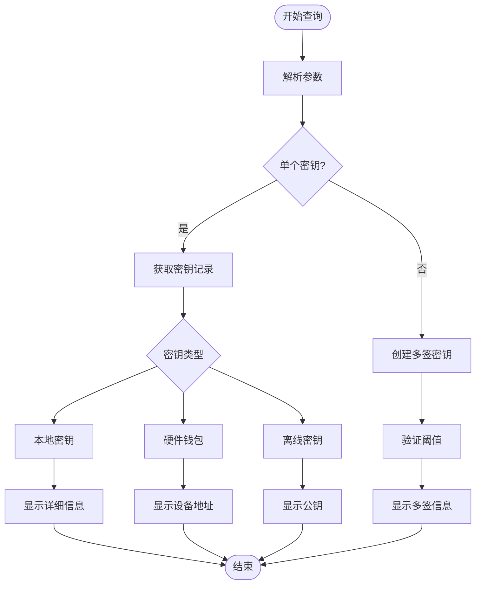

**图表来源**
- [show.go](file://client/keys/show.go#L58-L229)

**章节来源**
- [show.go](file://client/keys/show.go#L1-L229)

## 密钥导入与导出

### 密钥导入

#### `simd keys import` 命令

从ASCII装甲化的私钥文件导入密钥。

```bash
simd keys import <name> <keyfile>
```

#### `simd keys import-hex` 命令

从十六进制编码的私钥导入密钥。

```bash
simd keys import-hex <name> [hex]
```

#### 导入流程

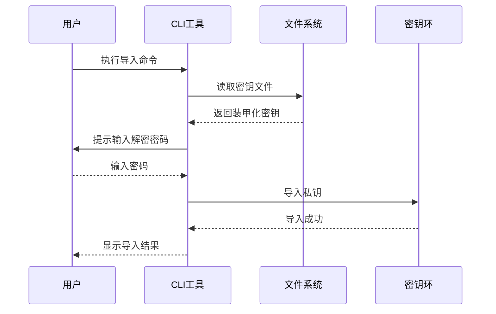

**图表来源**
- [import.go](file://client/keys/import.go#L17-L83)

**章节来源**
- [import.go](file://client/keys/import.go#L1-L83)

### 密钥导出

#### `simd keys export` 命令

导出私钥到ASCII装甲化的加密格式。

```bash
simd keys export <name>
```

#### 不安全导出选项

| 选项 | 描述 | 安全级别 |
|------|------|----------|
| `--unarmored-hex` | 导出十六进制私钥 | 高风险 |
| `--unsafe` | 启用不安全操作 | 高风险 |

#### 导出安全性对比

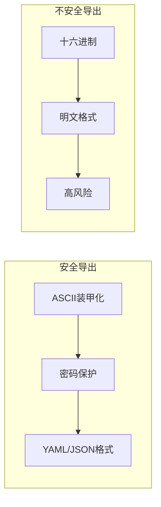

**图表来源**
- [export.go](file://client/keys/export.go#L21-L109)

**章节来源**
- [export.go](file://client/keys/export.go#L1-L109)

## 密钥删除与重命名

### 密钥删除

#### `simd keys delete` 命令

删除指定的密钥记录。

```bash
simd keys delete <name>...
```

#### 删除行为

| 密钥类型 | 删除行为 |
|----------|----------|
| 本地密钥 | 完全删除私钥和公钥 |
| 硬件钱包 | 只删除本地公钥引用 |
| 离线密钥 | 只删除本地公钥引用 |

#### 删除确认流程

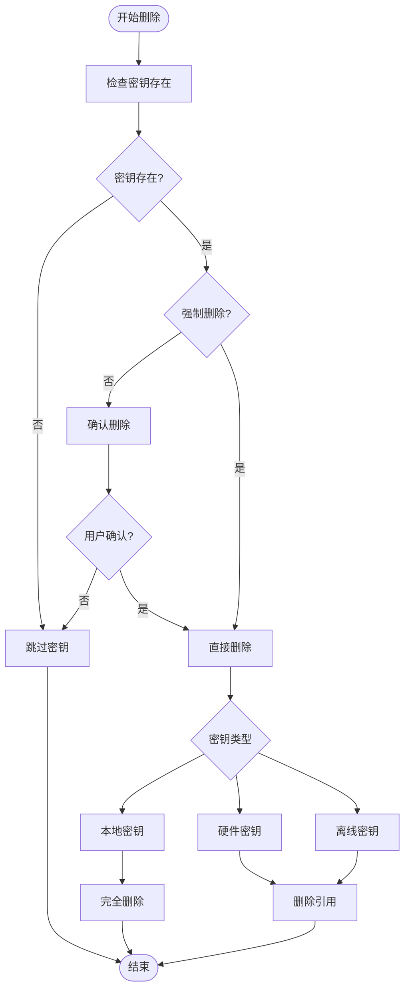

**图表来源**
- [delete.go](file://client/keys/delete.go#L18-L73)

**章节来源**
- [delete.go](file://client/keys/delete.go#L1-L73)

### 密钥重命名

#### `simd keys rename` 命令

重命名现有的密钥记录。

```bash
simd keys rename <old_name> <new_name>
```

#### 重命名限制

- 不能重命名硬件钱包或离线密钥
- 新名称不能为空或仅包含空白字符

**章节来源**
- [rename.go](file://client/keys/rename.go#L1-L74)

## 硬件钱包集成

### Ledger Nano S/X 支持

Cosmos SDK 提供完整的 Ledger 硬件钱包集成。

#### Ledger 密钥创建

```bash
simd keys add myledger --ledger --coin-type 118 --account 0 --index 0
```

#### 硬件钱包特性

| 特性 | 描述 |
|------|------|
| 离线签名 | 私钥永远不离开设备 |
| 地址验证 | 在设备上显示并确认地址 |
| 多链支持 | 支持多个币种的BIP44路径 |
| 安全存储 | 内置PIN码保护 |

#### Ledger 设备交互流程

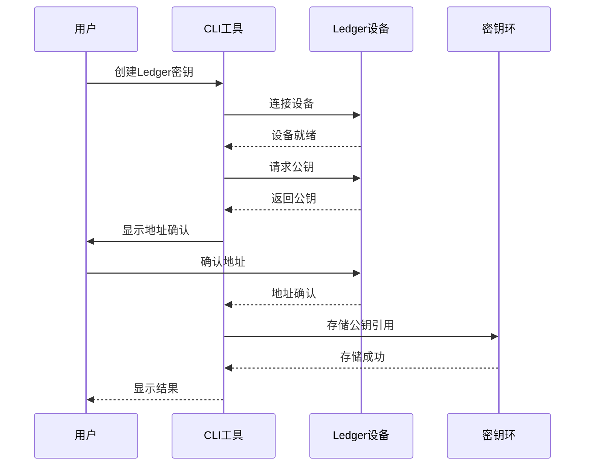

**图表来源**
- [add.go](file://client/keys/add.go#L285-L294)

**章节来源**
- [add.go](file://client/keys/add.go#L285-L294)

## 密钥备份与恢复

### 助记词备份

助记词是密钥恢复的关键，必须妥善保管。

#### 备份原则

1. **物理隔离**：不要存储在电子设备中
2. **多重备份**：制作多个独立备份
3. **安全存储**：存放在保险箱或安全柜中
4. **定期检查**：定期验证备份的有效性

#### 助记词恢复流程

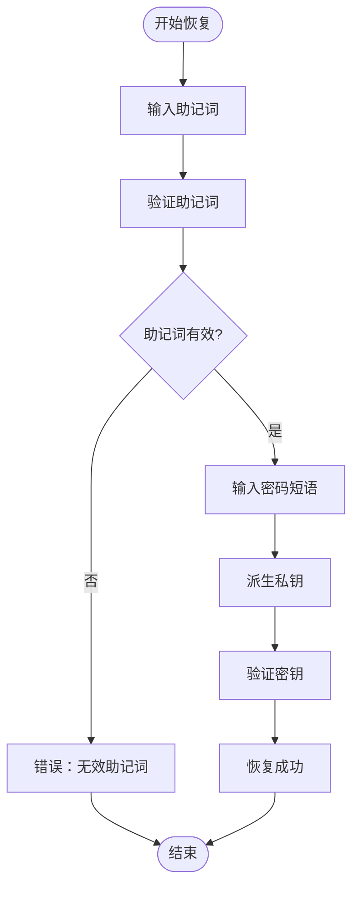

**图表来源**
- [add.go](file://client/keys/add.go#L299-L316)

### 密钥恢复最佳实践

#### 恢复步骤

1. **准备环境**
   - 使用可信的计算机
   - 确保网络隔离
   - 备份当前密钥

2. **执行恢复**
   ```bash
   simd keys add mykey --recover
   ```

3. **验证恢复**
   - 检查地址是否正确
   - 测试签名功能
   - 验证余额和交易历史

#### 恢复验证清单

| 验证项目 | 检查方法 | 重要性 |
|----------|----------|--------|
| 地址一致性 | 对比助记词恢复的地址 | 高 |
| 余额验证 | 查询区块链状态 | 高 |
| 交易历史 | 检查历史交易记录 | 中 |
| 签名功能 | 测试交易签名 | 高 |

**章节来源**
- [add.go](file://client/keys/add.go#L299-L382)

## 密钥迁移

### 迁移背景

随着SDK版本升级，密钥格式可能需要从Amino序列化迁移到Protocol Buffers序列化。

#### 迁移命令

```bash
simd keys migrate
```

#### 迁移流程

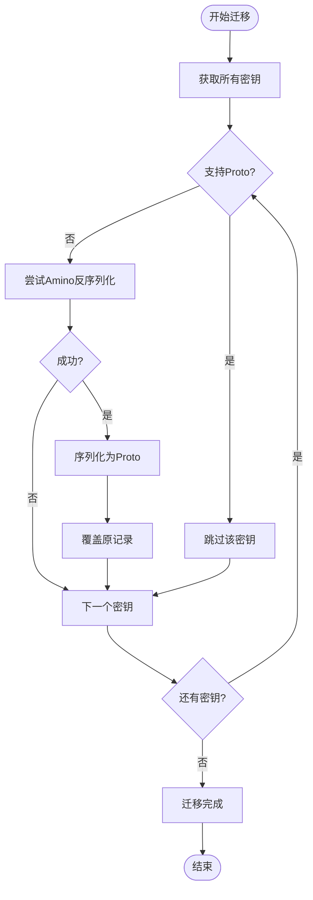

**图表来源**
- [migrate.go](file://client/keys/migrate.go#L9-L42)

#### 迁移注意事项

1. **备份数据**：迁移前备份密钥环
2. **版本兼容**：确保SDK版本兼容
3. **逐步迁移**：可以分批进行迁移
4. **验证结果**：迁移后验证密钥可用性

**章节来源**
- [migrate.go](file://client/keys/migrate.go#L1-L42)

## 故障排除

### 常见问题与解决方案

#### 密钥创建失败

| 错误类型 | 可能原因 | 解决方案 |
|----------|----------|----------|
| 名称冲突 | 密钥名称已存在 | 使用不同名称或删除旧密钥 |
| 磁盘空间不足 | 存储空间不够 | 清理磁盘空间 |
| 权限问题 | 文件权限不足 | 检查密钥环目录权限 |
| 硬件连接问题 | Ledger设备未连接 | 重新连接设备 |

#### 密钥导入失败

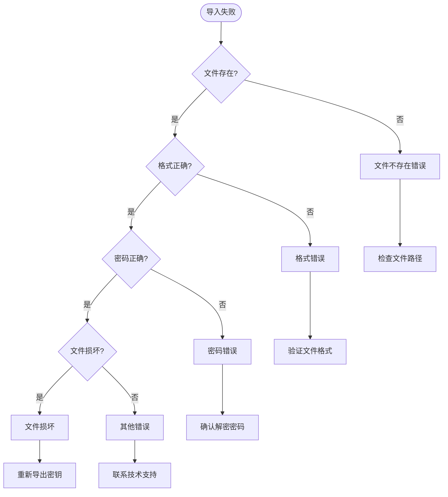

#### 密钥恢复问题

1. **助记词验证失败**
   - 检查单词拼写
   - 确认空格分隔
   - 验证单词数量

2. **地址不匹配**
   - 检查BIP44参数
   - 确认币种类型
   - 验证账户路径

3. **签名失败**
   - 检查密钥状态
   - 验证网络配置
   - 确认私钥可用性

### 应急响应方案

#### 密钥丢失应急流程

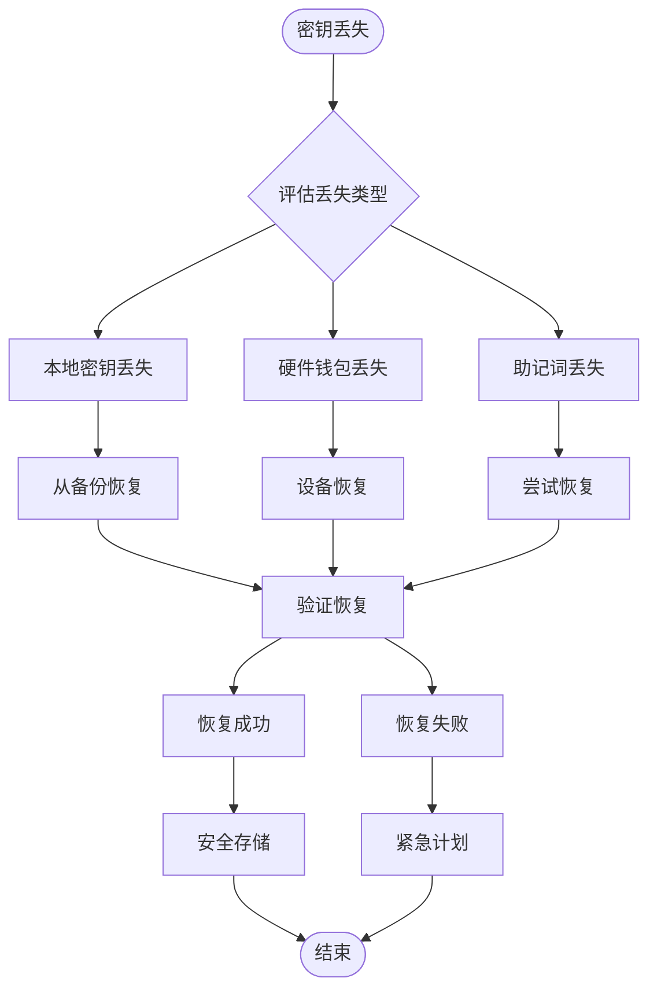

#### 数据恢复策略

1. **优先级排序**
   - 热钱包密钥 > 冷钱包密钥 > 助记词
   - 生产密钥 > 测试密钥 > 开发密钥

2. **恢复时间目标**
   - 关键密钥：< 2小时
   - 重要密钥：< 8小时
   - 一般密钥：< 24小时

3. **资源分配**
   - 技术支持团队
   - 法律顾问
   - 客户沟通团队

## 最佳实践

### 密钥管理安全原则

#### 1. 分层安全策略

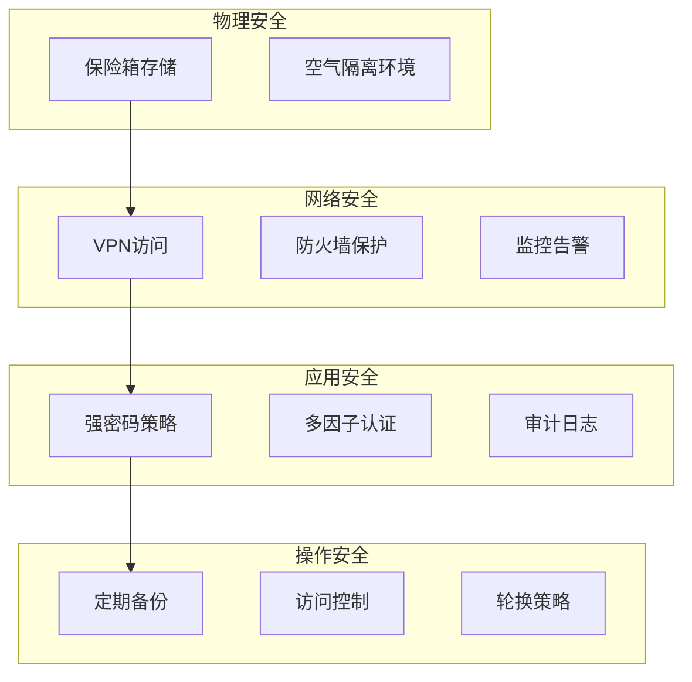

#### 2. 密钥分类管理

| 密钥类型 | 使用场景 | 安全级别 | 备份频率 |
|----------|----------|----------|----------|
| 热钱包密钥 | 日常交易 | 中 | 每日 |
| 冷钱包密钥 | 大额存储 | 高 | 每月 |
| 备用密钥 | 紧急恢复 | 最高 | 每季度 |
| 多签密钥 | 团队协作 | 高 | 每月 |

#### 3. 操作规范

1. **密钥创建**
   - 使用强随机数生成器
   - 记录创建时间和用途
   - 立即备份助记词

2. **密钥使用**
   - 最小权限原则
   - 定期轮换密钥
   - 监控异常活动

3. **密钥销毁**
   - 彻底清除数据
   - 记录销毁时间和原因
   - 更新相关文档

#### 4. 监控与审计

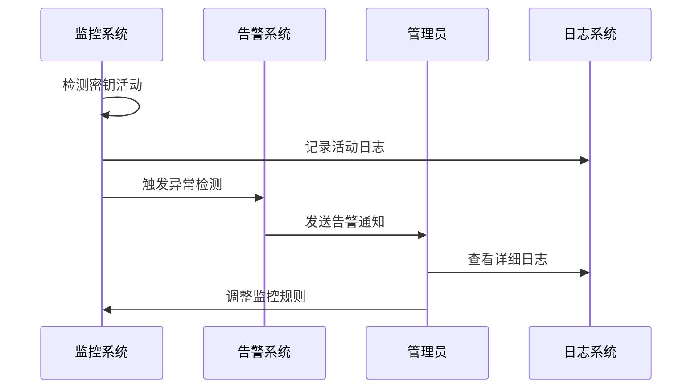

#### 5. 培训与意识

- **定期培训**：每季度进行安全培训
- **模拟演练**：定期进行应急演练
- **知识分享**：建立安全知识库
- **责任明确**：明确各角色职责

### 性能优化建议

#### 1. 密钥环优化

- 使用SSD存储密钥环
- 定期清理无用密钥
- 优化密钥搜索算法

#### 2. 硬件钱包优化

- 使用USB 3.0接口
- 定期更新固件
- 优化设备连接策略

#### 3. 网络优化

- 使用专用网络连接
- 配置DNS缓存
- 优化证书验证

通过遵循这些最佳实践，可以确保密钥管理系统的安全性、可靠性和高效性，为区块链应用提供坚实的安全基础。