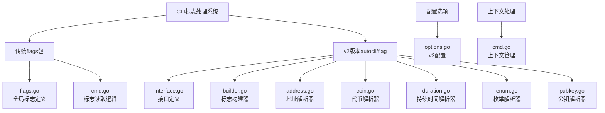
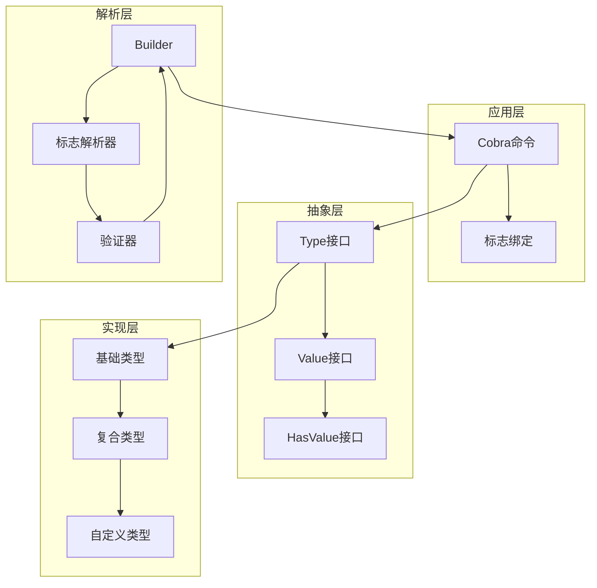
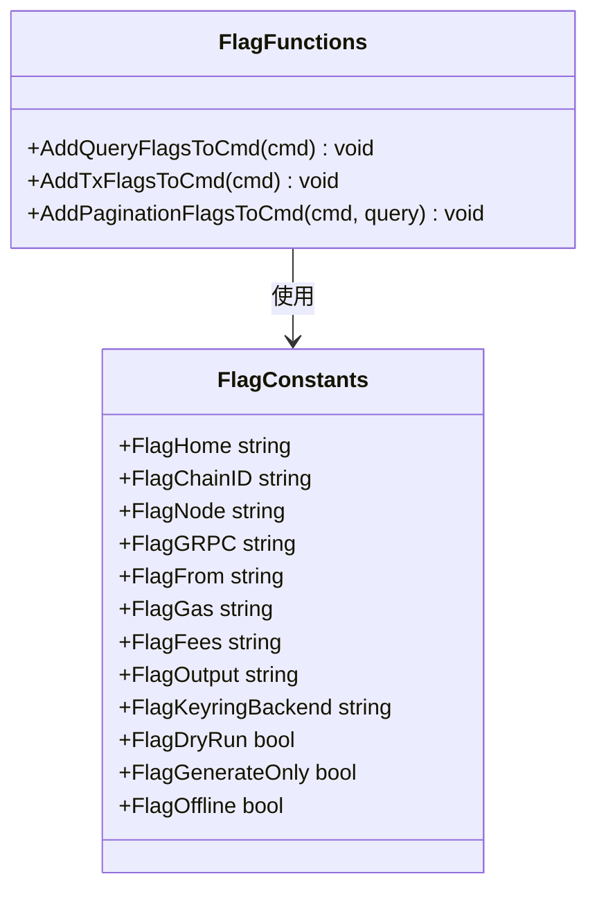
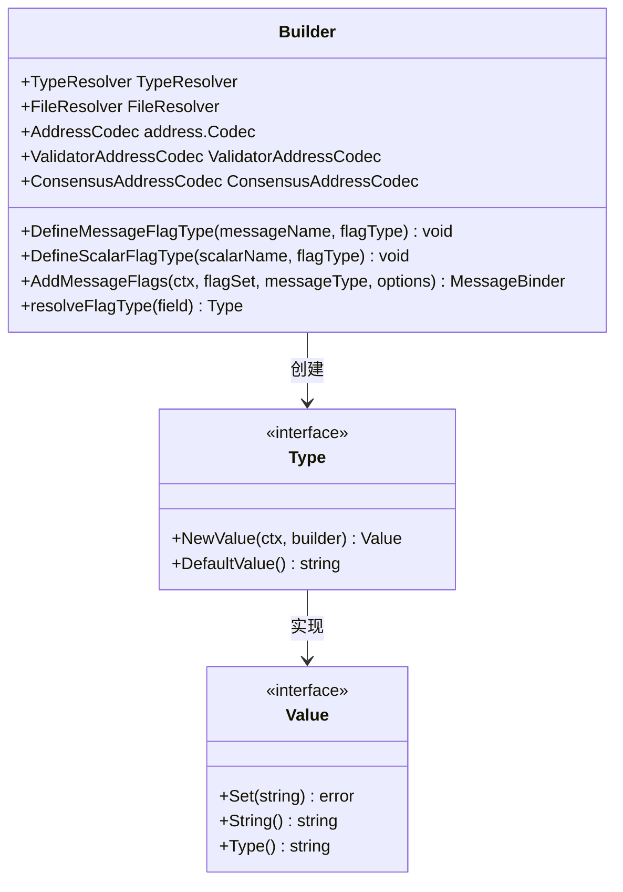
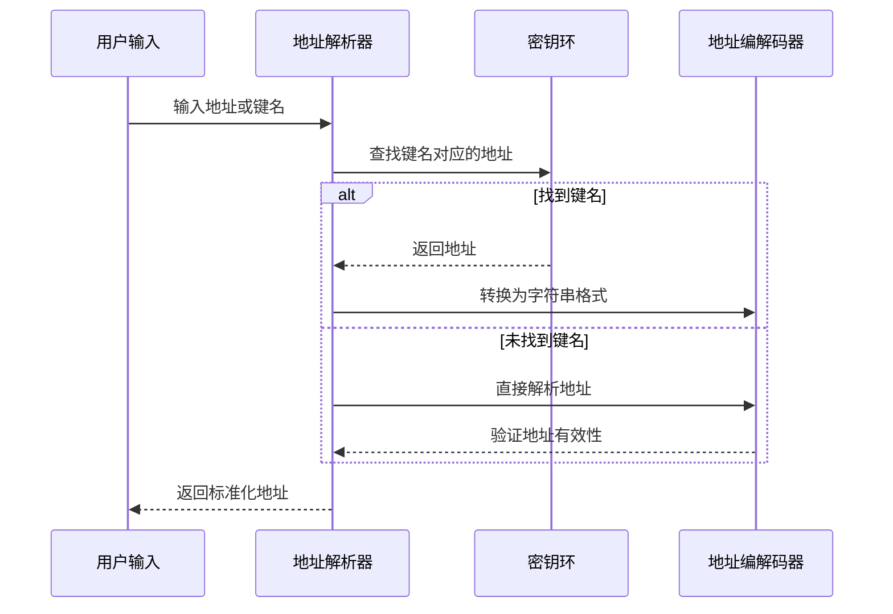
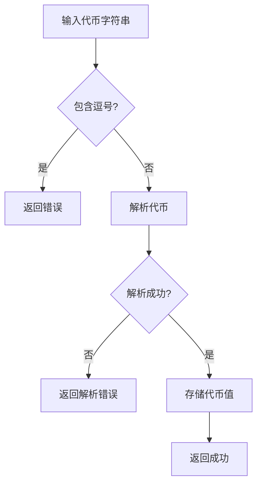
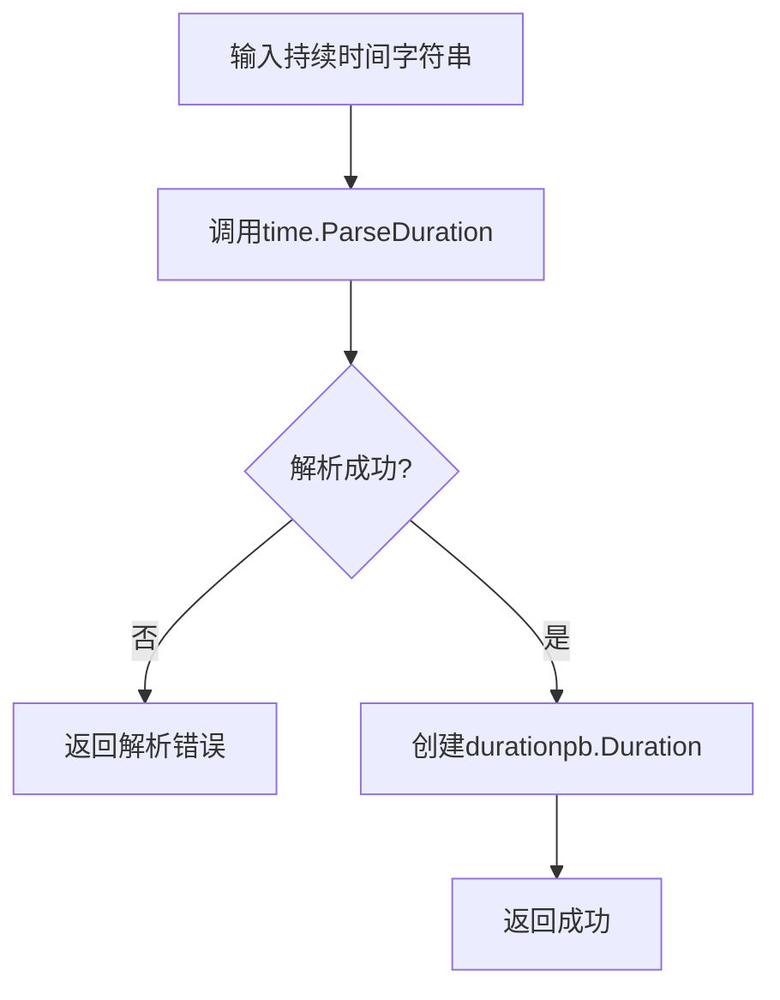
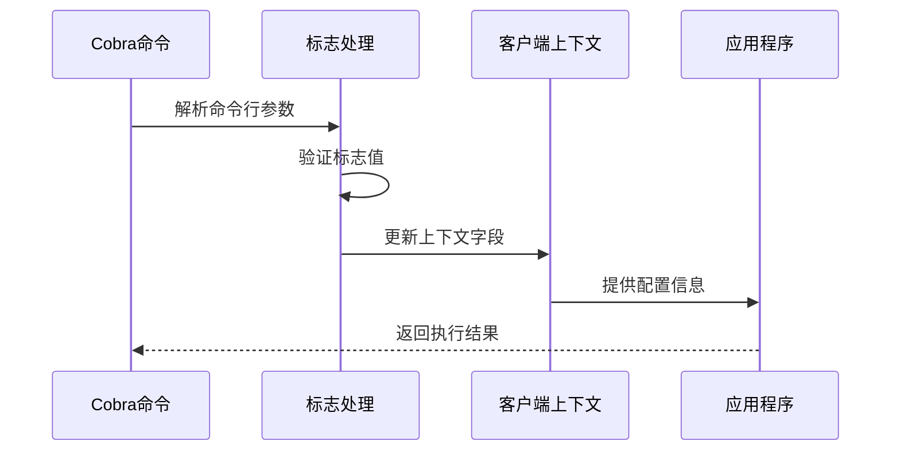
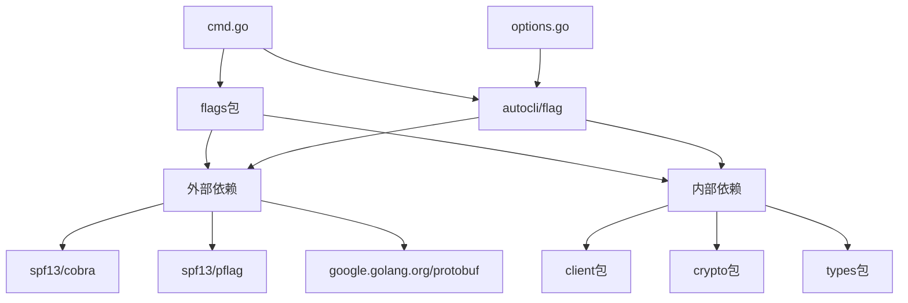

# 标志（Flags）处理系统

<cite>
**本文档引用的文件**
- [flags.go](file://client/flags/flags.go)
- [builder.go](file://client/v2/autocli/flag/builder.go)
- [interface.go](file://client/v2/autocli/flag/interface.go)
- [address.go](file://client/v2/autocli/flag/address.go)
- [coin.go](file://client/v2/autocli/flag/coin.go)
- [duration.go](file://client/v2/autocli/flag/duration.go)
- [enum.go](file://client/v2/autocli/flag/enum.go)
- [pubkey.go](file://client/v2/autocli/flag/pubkey.go)
- [cmd.go](file://client/cmd.go)
- [options.go](file://client/v2/autocli/options.go)
</cite>

## 目录
1. [简介](#简介)
2. [项目结构](#项目结构)
3. [核心组件](#核心组件)
4. [架构概览](#架构概览)
5. [详细组件分析](#详细组件分析)
6. [依赖关系分析](#依赖关系分析)
7. [性能考虑](#性能考虑)
8. [故障排除指南](#故障排除指南)
9. [结论](#结论)

## 简介

Cosmos SDK的CLI标志处理系统是一个高度模块化和可扩展的框架，用于管理命令行界面的参数解析和验证。该系统分为两个主要版本：传统的`flags`包和现代化的v2版本`autocli/flag`目录。

传统版本提供了基础的全局标志（如`--chain-id`、`--node`）和命令特定标志的实现，支持布尔、字符串、整数等基本类型的标志定义。v2版本则引入了更复杂的类型解析器，专门处理地址、代币、持续时间等复杂类型，并提供了完整的自动CLI生成能力。

## 项目结构

CLI标志处理系统在Cosmos SDK中的组织结构如下：



**图表来源**
- [flags.go](file://client/flags/flags.go#L1-L211)
- [builder.go](file://client/v2/autocli/flag/builder.go#L1-L518)
- [interface.go](file://client/v2/autocli/flag/interface.go#L1-L33)

**章节来源**
- [flags.go](file://client/flags/flags.go#L1-L211)
- [builder.go](file://client/v2/autocli/flag/builder.go#L1-L518)

## 核心组件

### 传统flags包

传统flags包提供了基础的CLI标志功能，包含以下核心常量和函数：

#### 全局标志常量
- **网络相关标志**：`FlagChainID`、`FlagNode`、`FlagGRPC`、`FlagGRPCInsecure`
- **交易相关标志**：`FlagFrom`、`FlagGas`、`FlagFees`、`FlagGasPrices`
- **输出相关标志**：`FlagOutput`、`FlagOutputDocument`
- **认证相关标志**：`FlagKeyringBackend`、`FlagKeyringDir`、`FlagUseLedger`

#### 标志注册函数
- `AddQueryFlagsToCmd()`：为查询命令添加通用标志
- `AddTxFlagsToCmd()`：为交易命令添加通用标志  
- `AddPaginationFlagsToCmd()`：为分页查询添加标志

### v2版本autocli标志系统

v2版本引入了更强大的类型系统和自动CLI生成功能：

#### 接口定义
- **Type接口**：定义自定义标志类型的行为
- **Value接口**：表示单个标志值
- **HasValue接口**：包装对protobuf值的引用

#### 内置类型处理器
- **地址类型**：账户地址、验证者地址、共识地址
- **数值类型**：整数、浮点数、十进制数
- **复合类型**：列表、映射、消息
- **特殊类型**：枚举、公钥、持续时间、代币

**章节来源**
- [flags.go](file://client/flags/flags.go#L42-L94)
- [interface.go](file://client/v2/autocli/flag/interface.go#L10-L32)

## 架构概览

CLI标志处理系统采用分层架构设计，确保了良好的可扩展性和维护性：



**图表来源**
- [builder.go](file://client/v2/autocli/flag/builder.go#L42-L82)
- [interface.go](file://client/v2/autocli/flag/interface.go#L10-L32)

## 详细组件分析

### 传统flags包分析

#### 标志常量定义

传统flags包通过常量定义了所有可用的CLI标志名称，这些常量在整个SDK中被广泛使用：



**图表来源**
- [flags.go](file://client/flags/flags.go#L42-L94)

#### 标志注册机制

标志注册通过三个主要函数实现，每个函数负责不同类型的命令：

1. **查询标志**：为只读查询命令添加标志
2. **交易标志**：为交易相关命令添加标志  
3. **分页标志**：为分页查询添加分页控制标志

每个函数都设置了适当的默认值和验证规则，确保命令的正确执行。

**章节来源**
- [flags.go](file://client/flags/flags.go#L106-L174)

### v2版本autocli标志系统分析

#### Builder模式实现

v2版本采用了Builder模式来管理标志的创建和配置：



**图表来源**
- [builder.go](file://client/v2/autocli/flag/builder.go#L42-L82)
- [interface.go](file://client/v2/autocli/flag/interface.go#L10-L32)

#### 复杂类型解析器

v2版本为复杂类型提供了专门的解析器实现：

##### 地址解析器

地址解析器支持多种输入格式：
- 键名查找
- 账户地址字符串
- 验证者地址字符串
- 共识地址字符串



**图表来源**
- [address.go](file://client/v2/autocli/flag/address.go#L56-L77)

##### 代币解析器

代币解析器处理货币金额的解析和验证：



**图表来源**
- [coin.go](file://client/v2/autocli/flag/coin.go#L43-L53)

##### 持续时间解析器

持续时间解析器将字符串转换为protobuf Duration类型：



**图表来源**
- [duration.go](file://client/v2/autocli/flag/duration.go#L39-L46)

**章节来源**
- [builder.go](file://client/v2/autocli/flag/builder.go#L114-L141)
- [address.go](file://client/v2/autocli/flag/address.go#L1-L167)
- [coin.go](file://client/v2/autocli/flag/coin.go#L1-L59)
- [duration.go](file://client/v2/autocli/flag/duration.go#L1-L52)

### 上下文处理机制

CLI标志处理系统与客户端上下文紧密集成，确保标志值能够正确传递给应用程序：



**图表来源**
- [cmd.go](file://client/cmd.go#L100-L299)

**章节来源**
- [cmd.go](file://client/cmd.go#L100-L299)

## 依赖关系分析

CLI标志处理系统的依赖关系体现了清晰的分层架构：



**图表来源**
- [flags.go](file://client/flags/flags.go#L1-L10)
- [builder.go](file://client/v2/autocli/flag/builder.go#L1-L25)

### 关键依赖说明

1. **spf13/cobra**：提供命令行界面框架
2. **spf13/pflag**：提供标志解析功能
3. **google.golang.org/protobuf**：提供Protocol Buffers支持
4. **client包**：提供客户端上下文和工具函数
5. **crypto包**：提供加密相关功能
6. **types包**：提供基础数据类型定义

**章节来源**
- [flags.go](file://client/flags/flags.go#L1-L10)
- [builder.go](file://client/v2/autocli/flag/builder.go#L1-L25)

## 性能考虑

CLI标志处理系统在设计时充分考虑了性能优化：

### 延迟初始化
- v2版本的Builder采用延迟初始化策略，只有在需要时才创建类型处理器
- 类型解析器缓存已解析的类型信息，避免重复计算

### 内存优化
- 标志值采用值类型设计，减少内存分配
- 复合类型使用引用计数，避免不必要的复制

### 并发安全
- 标志解析器设计为无状态，支持并发访问
- 类型处理器不保存可变状态

## 故障排除指南

### 常见问题及解决方案

#### 类型转换错误

**问题描述**：标志值无法转换为期望的Go类型

**解决方案**：
1. 检查输入格式是否符合要求
2. 验证类型处理器的实现
3. 添加适当的错误处理逻辑

**示例场景**：
- 地址格式无效
- 数值超出范围
- JSON格式错误

#### 必填项校验失败

**问题描述**：必需的标志未提供或为空

**解决方案**：
1. 设置适当的默认值
2. 在命令帮助中明确说明必需参数
3. 添加运行时验证逻辑

**示例场景**：
- `--chain-id`未提供
- `--from`地址无效
- 交易费用缺失

#### 自定义标志开发指南

开发自定义标志类型需要遵循以下步骤：

1. **实现Type接口**：
   ```go
   type CustomType struct{}
   
   func (t CustomType) NewValue(ctx *context.Context, b *Builder) Value {
       return &CustomValue{}
   }
   
   func (t CustomType) DefaultValue() string {
       return ""
   }
   ```

2. **实现Value接口**：
   ```go
   type CustomValue struct {
       value string
   }
   
   func (v *CustomValue) Set(s string) error {
       // 实现解析逻辑
       return nil
   }
   
   func (v *CustomValue) String() string {
       return v.value
   }
   ```

3. **注册类型**：
   ```go
   builder.DefineScalarFlagType("custom.type", CustomType{})
   ```

#### 验证函数配置

自定义验证函数可以通过以下方式实现：

1. **输入验证**：
   - 格式检查
   - 范围验证
   - 业务规则检查

2. **默认值设置**：
   - 提供合理的默认值
   - 支持环境变量覆盖
   - 实现条件默认值

3. **用户提示信息**：
   - 清晰的错误消息
   - 使用建议
   - 示例代码

**章节来源**
- [builder.go](file://client/v2/autocli/flag/builder.go#L114-L141)
- [interface.go](file://client/v2/autocli/flag/interface.go#L10-L32)

## 结论

Cosmos SDK的CLI标志处理系统展现了优秀的软件架构设计原则：

### 主要优势

1. **模块化设计**：清晰的职责分离和接口定义
2. **可扩展性**：支持自定义类型和验证逻辑
3. **向后兼容**：传统版本保持稳定，v2版本提供新特性
4. **性能优化**：延迟初始化和内存优化策略
5. **类型安全**：强类型系统确保运行时安全

### 最佳实践建议

1. **选择合适的版本**：根据项目需求选择传统或v2版本
2. **合理使用自定义类型**：仅在必要时开发自定义标志类型
3. **完善的错误处理**：提供清晰的错误消息和使用指导
4. **性能监控**：关注标志解析的性能影响
5. **文档维护**：及时更新标志使用的文档和示例

### 发展方向

随着Cosmos生态系统的不断发展，CLI标志处理系统将继续演进：

1. **更好的开发者体验**：简化自定义类型的开发流程
2. **增强的类型系统**：支持更多复杂的数据类型
3. **改进的验证机制**：提供更丰富的验证选项
4. **性能优化**：进一步提升标志解析的效率
5. **生态系统集成**：更好地与其他Cosmos组件集成

通过深入理解和正确使用CLI标志处理系统，开发者可以构建出功能强大、用户体验优秀的命令行工具，为Cosmos生态系统的发展贡献力量。