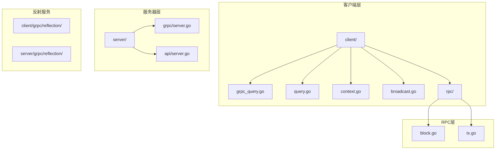
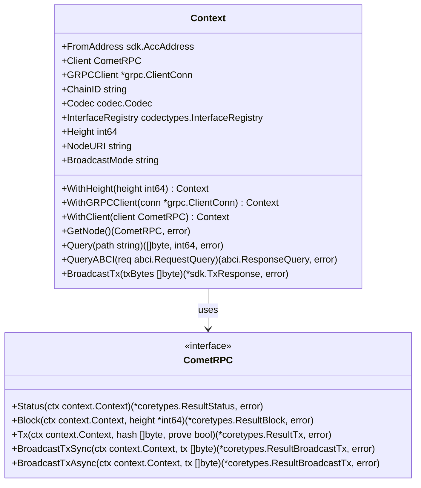
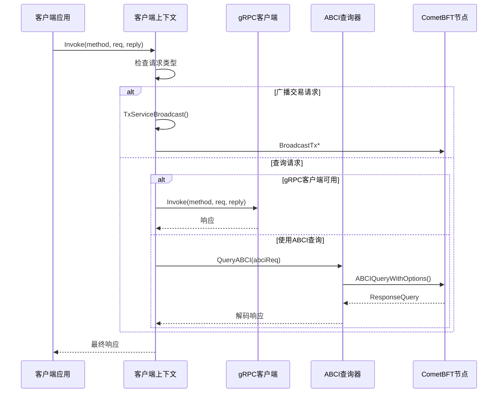
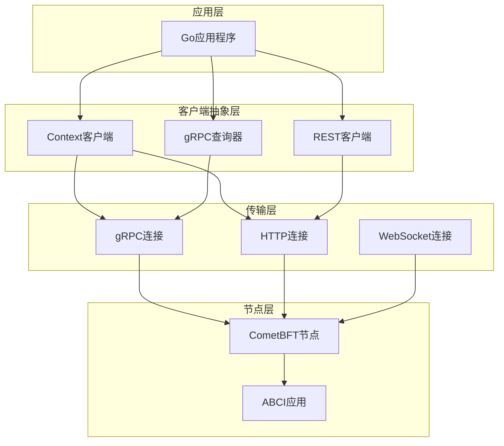
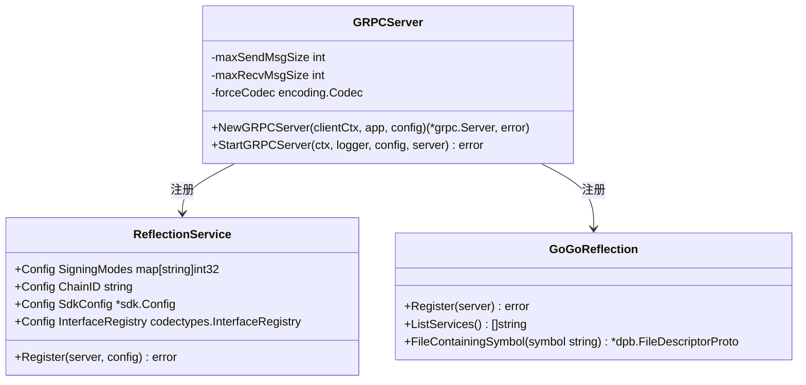
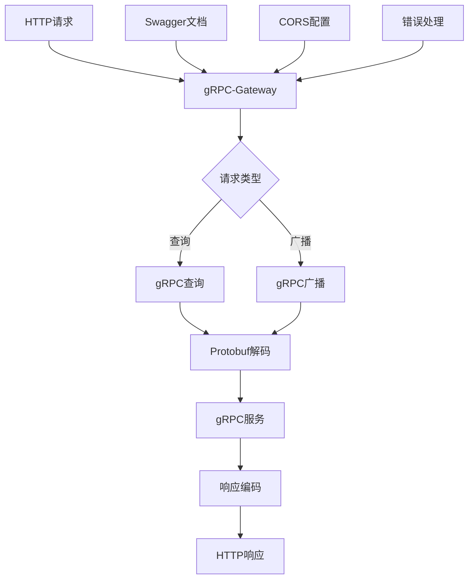
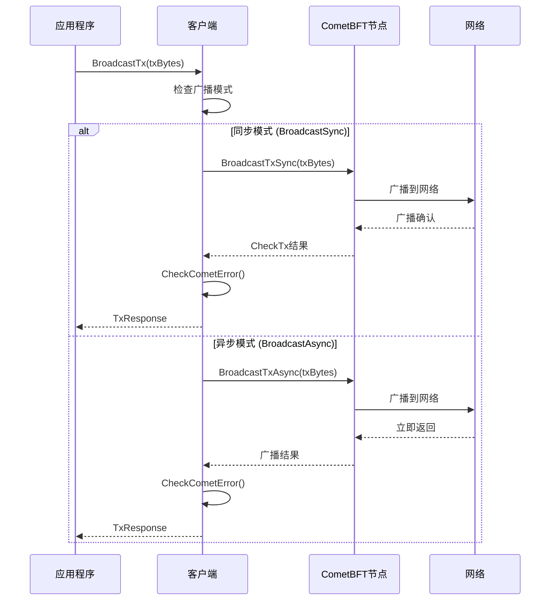
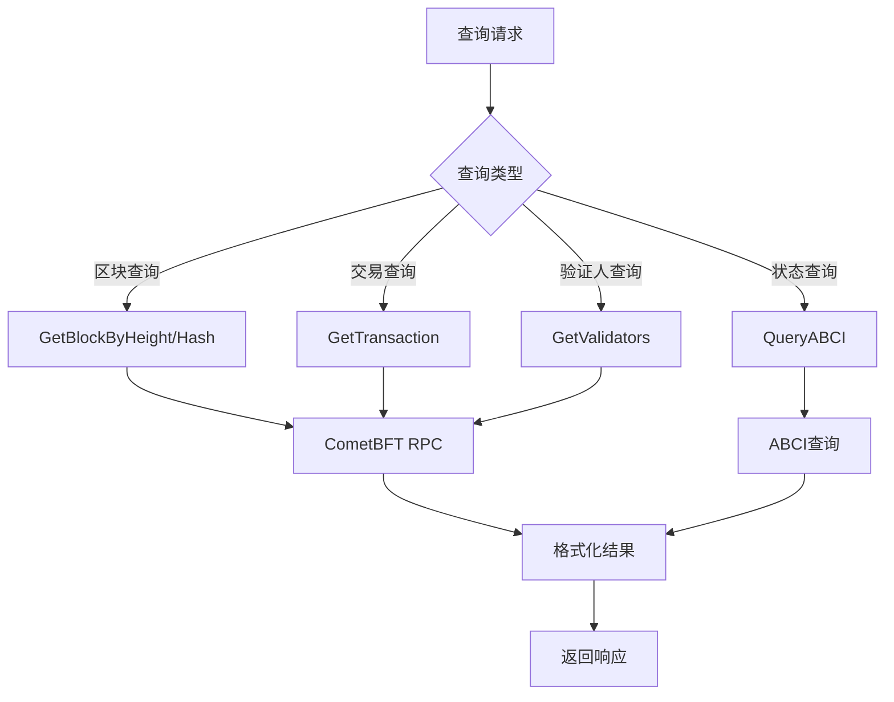
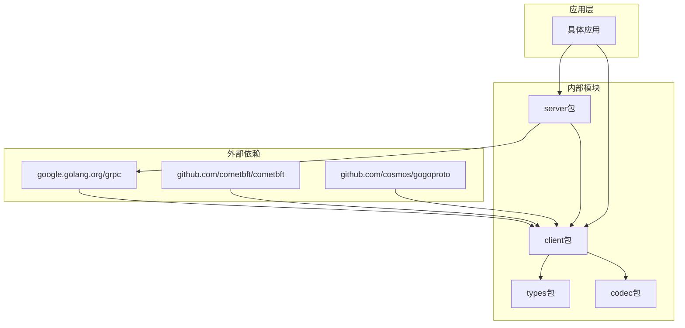

# gRPC/REST客户端

<cite>
**本文档引用的文件**
- [client/grpc_query.go](file://client/grpc_query.go)
- [client/query.go](file://client/query.go)
- [client/context.go](file://client/context.go)
- [client/broadcast.go](file://client/broadcast.go)
- [client/rpc/block.go](file://client/rpc/block.go)
- [client/rpc/tx.go](file://client/rpc/tx.go)
- [server/grpc/server.go](file://server/grpc/server.go)
- [server/api/server.go](file://server/api/server.go)
- [client/cometbft.go](file://client/cometbft.go)
</cite>

## 目录
1. [简介](#简介)
2. [项目结构概览](#项目结构概览)
3. [核心组件](#核心组件)
4. [架构概览](#架构概览)
5. [详细组件分析](#详细组件分析)
6. [依赖关系分析](#依赖关系分析)
7. [性能考虑](#性能考虑)
8. [故障排除指南](#故障排除指南)
9. [结论](#结论)

## 简介

Cosmos SDK提供了强大的gRPC和REST客户端功能，允许开发者通过多种协议与Cosmos节点进行交互。本文档详细介绍了如何使用这些客户端来查询区块链状态、提交交易以及处理各种网络操作。

gRPC客户端提供了高性能的二进制通信，而REST API则通过gRPC-Gateway生成，为HTTP客户端提供友好的接口。系统支持节点发现、连接池管理、超时控制等高级特性，确保可靠性和可扩展性。

## 项目结构概览

Cosmos SDK的gRPC/REST客户端实现主要分布在以下目录中：



**图表来源**
- [client/grpc_query.go](file://client/grpc_query.go#L1-L143)
- [server/grpc/server.go](file://server/grpc/server.go#L1-L108)

**章节来源**
- [client/context.go](file://client/context.go#L1-L455)
- [server/grpc/server.go](file://server/grpc/server.go#L1-L108)

## 核心组件

### 客户端上下文(Context)

客户端上下文是整个gRPC/REST客户端系统的核心，包含了所有必要的配置和连接信息：



**图表来源**
- [client/context.go](file://client/context.go#L27-L68)
- [client/cometbft.go](file://client/cometbft.go#L11-L35)

### gRPC查询机制

gRPC查询系统提供了统一的查询接口，支持直接gRPC调用或通过ABCI查询fallback：



**图表来源**
- [client/grpc_query.go](file://client/grpc_query.go#L31-L121)
- [client/query.go](file://client/query.go#L78-L101)

**章节来源**
- [client/grpc_query.go](file://client/grpc_query.go#L31-L121)
- [client/context.go](file://client/context.go#L27-L68)

## 架构概览

Cosmos SDK的gRPC/REST架构采用分层设计，确保了灵活性和可扩展性：



**图表来源**
- [client/context.go](file://client/context.go#L27-L68)
- [server/api/server.go](file://server/api/server.go#L43-L80)

## 详细组件分析

### gRPC服务器配置

gRPC服务器负责处理来自客户端的所有gRPC请求，并提供反射服务以支持动态客户端开发：



**图表来源**
- [server/grpc/server.go](file://server/grpc/server.go#L22-L67)

### REST API网关

REST API通过gRPC-Gateway自动生成，提供HTTP接口访问gRPC服务：



**图表来源**
- [server/api/server.go](file://server/api/server.go#L43-L80)

### 交易广播机制

交易广播系统支持同步和异步两种模式，确保不同场景下的需求：



**图表来源**
- [client/broadcast.go](file://client/broadcast.go#L19-L147)

### 区块链状态查询

区块链状态查询系统提供了多种查询方式，支持区块、交易、验证人等信息的获取：



**图表来源**
- [client/rpc/block.go](file://client/rpc/block.go#L15-L135)
- [client/rpc/tx.go](file://client/rpc/tx.go#L1-L227)

**章节来源**
- [server/grpc/server.go](file://server/grpc/server.go#L22-L67)
- [client/broadcast.go](file://client/broadcast.go#L19-L147)

## 依赖关系分析

系统的依赖关系展现了清晰的分层架构：



**图表来源**
- [client/context.go](file://client/context.go#L1-L22)
- [server/grpc/server.go](file://server/grpc/server.go#L1-L20)

**章节来源**
- [client/context.go](file://client/context.go#L1-L22)
- [server/grpc/server.go](file://server/grpc/server.go#L1-L20)

## 性能考虑

### 连接池管理

系统通过连接池优化gRPC连接的使用效率：

- **最大发送消息大小**: 可配置，默认值为1MB
- **最大接收消息大小**: 可配置，默认值为1MB  
- **连接复用**: 多个查询共享同一个gRPC连接
- **优雅关闭**: 支持平滑关闭连接，避免数据丢失

### 超时控制

多层次的超时控制确保系统响应性：

- **gRPC调用超时**: 可配置的单次调用超时
- **上下文超时**: 支持取消操作的上下文超时
- **连接超时**: 建立连接时的超时控制
- **读写超时**: CometBFT RPC的读写超时配置

### 缓存策略

系统实现了多级缓存机制：

- **元数据缓存**: 缓存服务发现信息
- **接口注册表缓存**: 缓存类型注册信息
- **查询结果缓存**: 缓存频繁查询的结果

## 故障排除指南

### 常见错误及解决方案

#### 连接问题

**问题**: 无法建立gRPC连接
**解决方案**:
1. 检查节点地址配置
2. 验证防火墙设置
3. 确认TLS证书配置
4. 检查网络连通性

**问题**: 连接频繁断开
**解决方案**:
1. 调整心跳间隔
2. 增加重试次数
3. 优化超时设置
4. 检查资源使用情况

#### 查询超时

**问题**: 查询操作超时
**解决方案**:
1. 增加查询超时时间
2. 优化查询条件
3. 使用分页查询
4. 检查节点负载

#### 广播失败

**问题**: 交易广播失败
**解决方案**:
1. 检查交易格式
2. 验证签名有效性
3. 确认账户余额
4. 检查网络状态

### 调试技巧

#### 日志配置

启用详细的日志记录来诊断问题：
```go
// 设置日志级别
logger := log.NewTMLogger(log.NewSyncWriter(os.Stdout))
logger = log.With(logger, "module", "cosmos-client")

// 启用gRPC日志
grpc.EnableTracing = true
```

#### 性能监控

监控关键指标来评估系统性能：
- 连接建立时间
- 查询响应时间
- 广播成功率
- 错误率统计

**章节来源**
- [client/broadcast.go](file://client/broadcast.go#L43-L84)
- [client/query.go](file://client/query.go#L114-L125)

## 结论

Cosmos SDK的gRPC/REST客户端系统提供了完整而强大的区块链交互能力。通过统一的客户端上下文、灵活的查询机制、可靠的广播系统和完善的错误处理，开发者可以构建高效、稳定的区块链应用程序。

系统的主要优势包括：

1. **多协议支持**: 同时支持gRPC和REST API
2. **高性能**: 优化的连接管理和缓存机制
3. **可靠性**: 完善的错误处理和重试机制
4. **可扩展性**: 模块化的架构设计
5. **易用性**: 简洁的API设计和丰富的工具函数

通过合理配置和使用这些客户端功能，开发者可以充分利用Cosmos生态系统的强大能力，构建出满足各种业务需求的分布式应用。