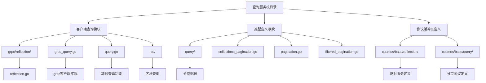
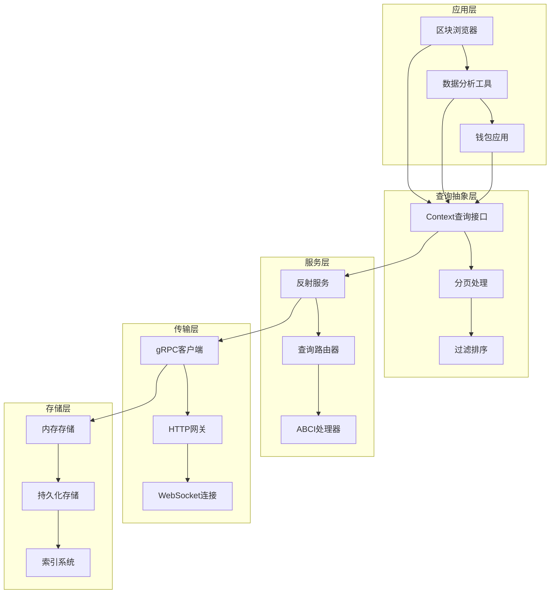
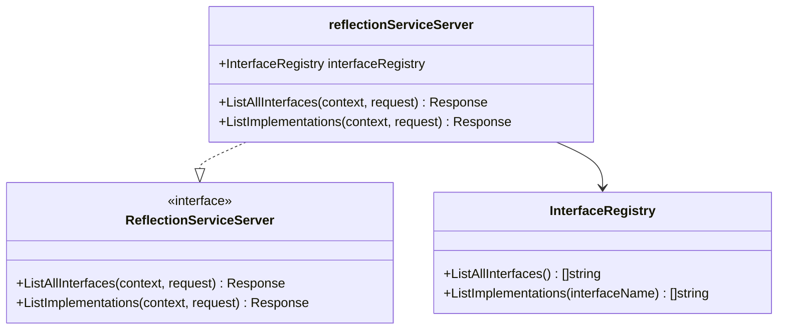
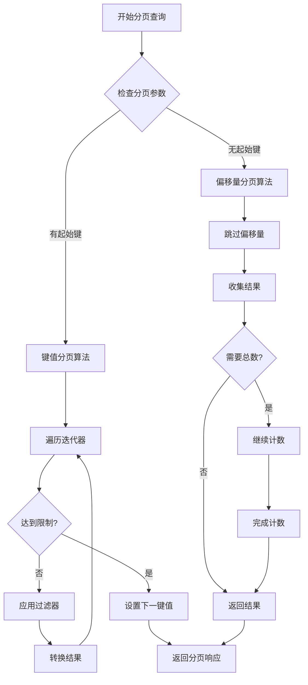
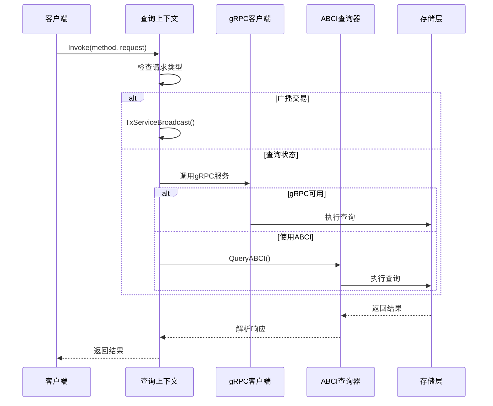
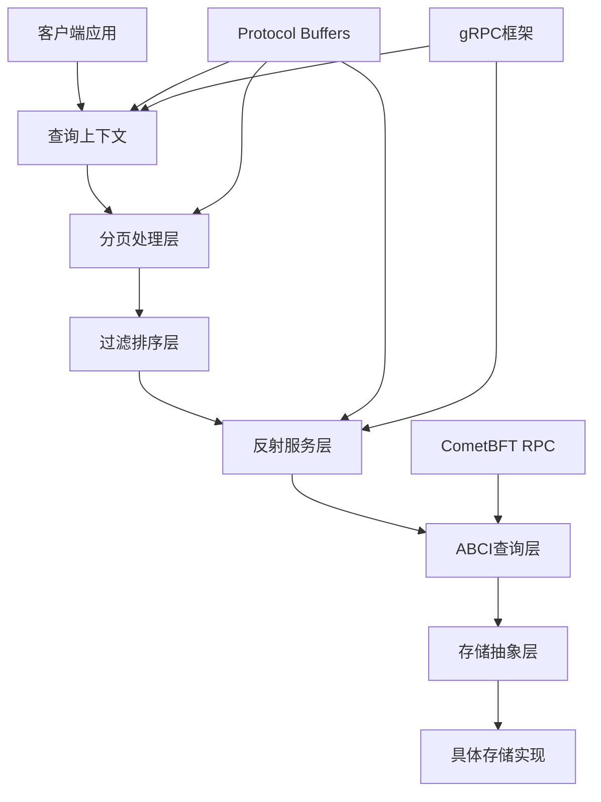

# 查询服务

<cite>
**本文档中引用的文件**
- [client/grpc/reflection/reflection.go](file://client/grpc/reflection/reflection.go)
- [client/query.go](file://client/query.go)
- [types/query/collections_pagination.go](file://types/query/collections_pagination.go)
- [types/query/pagination.go](file://types/query/pagination.go)
- [types/query/filtered_pagination.go](file://types/query/filtered_pagination.go)
- [client/grpc_query.go](file://client/grpc_query.go)
- [proto/cosmos/base/reflection/v2alpha1/reflection.proto](file://proto/cosmos/base/reflection/v2alpha1/reflection.proto)
- [proto/cosmos/base/query/v1beta1/pagination.proto](file://proto/cosmos/base/query/v1beta1/pagination.proto)
- [client/rpc/block.go](file://client/rpc/block.go)
- [client/grpc/cmtservice/service.go](file://client/grpc/cmtservice/service.go)
</cite>

## 目录
1. [简介](#简介)
2. [项目结构](#项目结构)
3. [核心组件](#核心组件)
4. [架构概览](#架构概览)
5. [详细组件分析](#详细组件分析)
6. [依赖关系分析](#依赖关系分析)
7. [性能考虑](#性能考虑)
8. [故障排除指南](#故障排除指南)
9. [结论](#结论)

## 简介

Cosmos SDK的查询服务是一个强大而灵活的系统，提供了多种查询机制来访问区块链状态数据。该系统包含服务反射机制、高级查询功能、分页处理和过滤排序等核心特性。查询服务支持动态服务发现和元数据查询，使客户端能够探索节点支持的API，并提供高效的区块浏览器和数据分析工具实现能力。

## 项目结构

查询服务的代码分布在多个目录中，形成了一个层次化的架构：

**图表来源**
- [client/grpc/reflection/reflection.go](file://client/grpc/reflection/reflection.go#L1-L46)
- [client/query.go](file://client/query.go#L1-L171)
- [types/query/collections_pagination.go](file://types/query/collections_pagination.go#L1-L344)

## 核心组件

### 服务反射机制

服务反射是查询服务的重要组成部分，它允许客户端动态发现和探索可用的服务接口。

#### 反射服务服务器

反射服务通过`reflectionServiceServer`结构体实现，提供以下核心功能：

- **接口列表查询**：`ListAllInterfaces`方法返回所有注册的接口名称
- **实现者查询**：`ListImplementations`方法根据接口名称返回具体的实现类型

#### 元数据查询功能

反射服务提供了丰富的元数据查询能力：

- 应用程序描述符查询
- 链信息描述符查询  
- 编解码器描述符查询
- 配置描述符查询
- 查询服务描述符查询
- 交易描述符查询

**章节来源**
- [client/grpc/reflection/reflection.go](file://client/grpc/reflection/reflection.go#L12-L46)

### 高级查询功能

查询服务提供了多层次的查询抽象，从底层的ABCI查询到高级的集合分页功能。

#### 基础查询接口

`client.Context`提供了多种查询方法：

- `Query()`：基本路径查询
- `QueryWithData()`：带数据载荷的查询  
- `QueryStore()`：存储键值查询
- `QueryABCI()`：直接ABCI查询

#### 分页处理机制

查询服务实现了完善的分页处理机制：

- **默认分页参数**：页面大小100，默认第一页
- **偏移量和键值分页**：支持两种分页方式
- **反向查询**：支持降序结果排列
- **总数统计**：可选择是否计算总记录数

**章节来源**
- [client/query.go](file://client/query.go#L29-L171)
- [types/query/pagination.go](file://types/query/pagination.go#L1-L161)

## 架构概览

查询服务采用分层架构设计，从底层的存储访问到高层的应用接口：

**图表来源**
- [client/query.go](file://client/query.go#L1-L171)
- [client/grpc_query.go](file://client/grpc_query.go#L1-L143)

## 详细组件分析

### 服务反射组件

#### 反射服务实现

**图表来源**
- [client/grpc/reflection/reflection.go](file://client/grpc/reflection/reflection.go#L12-L46)

#### 反射服务协议

反射服务通过Protocol Buffers定义了完整的元数据查询接口：

- `GetAuthnDescriptor`：获取认证描述符
- `GetChainDescriptor`：获取链描述符  
- `GetCodecDescriptor`：获取编解码器描述符
- `GetConfigurationDescriptor`：获取配置描述符
- `GetQueryServicesDescriptor`：获取查询服务描述符
- `GetTxDescriptor`：获取交易描述符

**章节来源**
- [proto/cosmos/base/reflection/v2alpha1/reflection.proto](file://proto/cosmos/base/reflection/v2alpha1/reflection.proto#L113-L140)

### 高级查询组件

#### 分页算法实现

查询服务提供了三种主要的分页算法：

**图表来源**
- [types/query/collections_pagination.go](file://types/query/collections_pagination.go#L65-L111)
- [types/query/pagination.go](file://types/query/pagination.go#L50-L122)

#### 过滤和排序功能

查询服务支持复杂的过滤和排序操作：

- **谓词函数过滤**：通过`predicateFunc`参数实现自定义过滤逻辑
- **变换函数**：通过`transformFunc`参数对结果进行转换
- **多字段排序**：支持复合排序条件
- **范围查询**：支持基于键值范围的查询

**章节来源**
- [types/query/collections_pagination.go](file://types/query/collections_pagination.go#L57-L71)
- [types/query/filtered_pagination.go](file://types/query/filtered_pagination.go#L13-L21)

### 客户端查询组件

#### gRPC查询实现

**图表来源**
- [client/grpc_query.go](file://client/grpc_query.go#L31-L122)

**章节来源**
- [client/grpc_query.go](file://client/grpc_query.go#L1-L143)

## 依赖关系分析

查询服务的依赖关系体现了清晰的分层架构：

**图表来源**
- [client/query.go](file://client/query.go#L1-L171)
- [client/grpc_query.go](file://client/grpc_query.go#L1-L143)

**章节来源**
- [client/query.go](file://client/query.go#L1-L171)
- [client/grpc_query.go](file://client/grpc_query.go#L1-L143)

## 性能考虑

### 查询性能优化

查询服务在设计时充分考虑了性能优化：

#### 分页策略优化

- **键值分页优于偏移量分页**：键值分页避免了跳过大量数据的问题
- **智能预取**：提前加载下一页面的数据以减少延迟
- **缓存友好的迭代**：优化迭代器的使用模式

#### 内存管理

- **流式处理**：大型查询结果采用流式处理避免内存溢出
- **及时释放**：查询完成后立即释放相关资源
- **批量处理**：支持批量查询以提高吞吐量

#### 网络优化

- **压缩传输**：支持Protocol Buffers的压缩传输
- **连接复用**：gRPC连接的自动复用
- **超时控制**：合理的查询超时设置

### 资源限制

查询服务实施了多层资源限制：

- **分页限制**：防止无限分页导致的资源耗尽
- **查询大小限制**：限制单次查询的数据量
- **并发控制**：限制同时执行的查询数量
- **内存使用监控**：监控查询过程中的内存使用

## 故障排除指南

### 常见问题及解决方案

#### 查询超时问题

**症状**：查询长时间无响应或超时
**原因**：可能由于网络延迟、查询复杂度高或服务器负载过高
**解决方案**：
- 调整查询超时设置
- 使用更精确的查询条件
- 实现查询结果缓存

#### 分页不正确

**症状**：分页结果重复或遗漏
**原因**：分页键值处理错误或数据变更
**解决方案**：
- 使用键值分页而非偏移量分页
- 确保查询期间数据稳定性
- 正确处理分页边界情况

#### 反射服务不可用

**症状**：无法获取服务元数据信息
**原因**：反射服务未正确注册或客户端配置错误
**解决方案**：
- 检查服务注册配置
- 验证客户端连接设置
- 确认Protocol Buffers定义完整性

**章节来源**
- [client/query.go](file://client/query.go#L114-L125)
- [types/query/pagination.go](file://types/query/pagination.go#L26-L48)

## 结论

Cosmos SDK的查询服务提供了一个完整、高效且灵活的数据访问解决方案。通过服务反射机制，客户端能够动态发现和探索可用的API；通过高级查询功能，开发者可以构建复杂的区块浏览器和数据分析工具；通过完善的分页和过滤机制，系统能够处理大规模数据查询需求。

查询服务的设计体现了现代分布式系统的设计原则：分层架构、模块化设计、性能优化和可扩展性。它不仅满足了当前的需求，还为未来的功能扩展提供了良好的基础。

对于开发者而言，理解查询服务的工作原理和最佳实践，将有助于构建更加高效和可靠的区块链应用程序。随着Cosmos生态系统的不断发展，查询服务将继续发挥其重要作用，为开发者提供强大的数据访问能力。