# 交易处理

<cite>
**本文档引用的文件**
- [client/tx/factory.go](file://client/tx/factory.go)
- [client/context.go](file://client/context.go)
- [client/tx/aux_builder.go](file://client/tx/aux_builder.go)
- [client/broadcast.go](file://client/broadcast.go)
- [client/tx/tx.go](file://client/tx/tx.go)
- [client/account_retriever.go](file://client/account_retriever.go)
- [types/tx/types.go](file://types/tx/types.go)
</cite>

## 目录
1. [简介](#简介)
2. [项目结构概览](#项目结构概览)
3. [交易工厂模式](#交易工厂模式)
4. [客户端上下文](#客户端上下文)
5. [辅助交易构建器](#辅助交易构建器)
6. [交易构建流程](#交易构建流程)
7. [签名与广播](#签名与广播)
8. [离线与在线工作流](#离线与在线工作流)
9. [交易响应处理](#交易响应处理)
10. [最佳实践](#最佳实践)
11. [故障排除](#故障排除)
12. [总结](#总结)

## 简介

Cosmos SDK 的交易处理系统是一个高度模块化的架构，通过交易工厂模式、客户端上下文和辅助构建器等组件，提供了灵活且强大的交易构建、签名和广播功能。该系统支持多种签名模式、气体估算、离线签名和在线广播等多种工作流程。

## 项目结构概览

交易处理相关的核心文件分布在以下目录结构中：

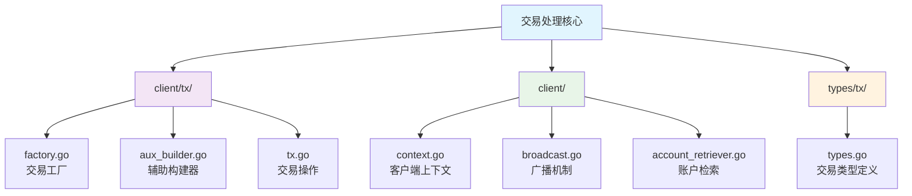

**图表来源**
- [client/tx/factory.go](file://client/tx/factory.go#L1-L50)
- [client/context.go](file://client/context.go#L1-L50)
- [client/tx/aux_builder.go](file://client/tx/aux_builder.go#L1-L50)

## 交易工厂模式

### 工厂结构设计

交易工厂（Factory）是整个交易处理系统的核心组件，负责管理交易构建过程中的所有配置参数。

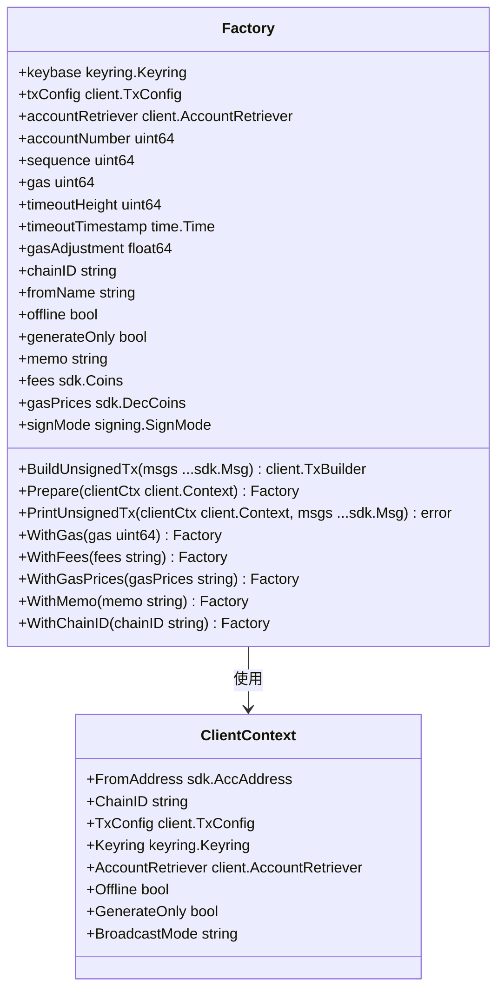

**图表来源**
- [client/tx/factory.go](file://client/tx/factory.go#L27-L53)
- [client/context.go](file://client/context.go#L27-L68)

### 配置参数详解

交易工厂包含以下关键配置参数：

| 参数 | 类型 | 描述 | 默认值 |
|------|------|------|--------|
| `gas` | `uint64` | 交易气体限制 | 0 |
| `gasAdjustment` | `float64` | 气体调整系数 | 1.0 |
| `fees` | `sdk.Coins` | 手续费金额 | 0 |
| `gasPrices` | `sdk.DecCoins` | 气体价格 | 0 |
| `memo` | `string` | 交易备注 | "" |
| `timeoutHeight` | `uint64` | 超时区块高度 | 0 |
| `timeoutTimestamp` | `time.Time` | 超时时间戳 | 0 |
| `chainID` | `string` | 区块链标识符 | "" |
| `signMode` | `signing.SignMode` | 签名模式 | SIGN_MODE_UNSPECIFIED |

**章节来源**
- [client/tx/factory.go](file://client/tx/factory.go#L27-L53)

### 工厂初始化流程

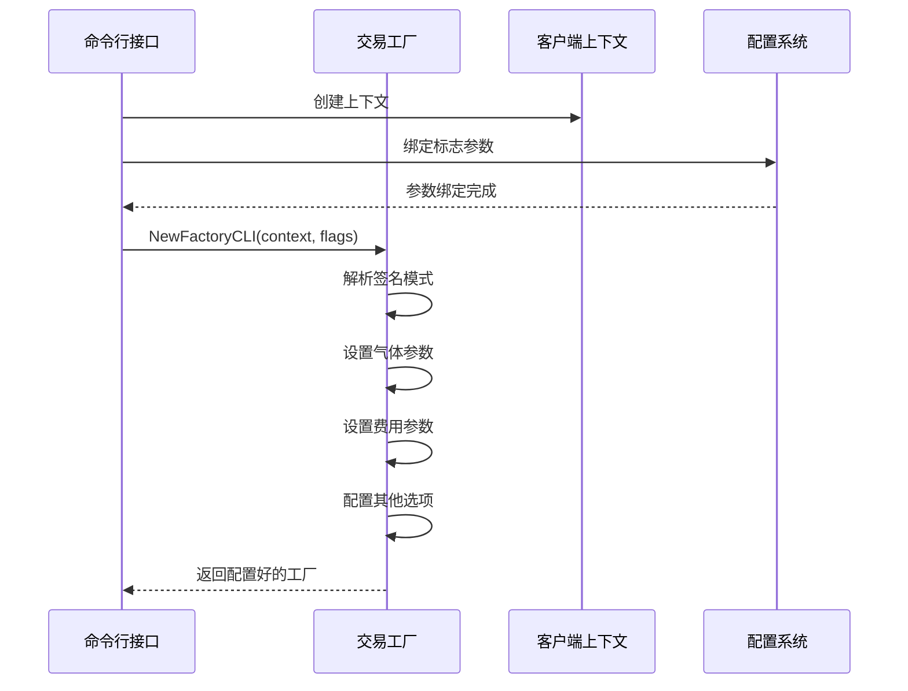

**图表来源**
- [client/tx/factory.go](file://client/tx/factory.go#L55-L132)

**章节来源**
- [client/tx/factory.go](file://client/tx/factory.go#L55-L132)

## 客户端上下文

### 上下文结构设计

客户端上下文（Context）封装了交易处理所需的所有环境信息和依赖服务。

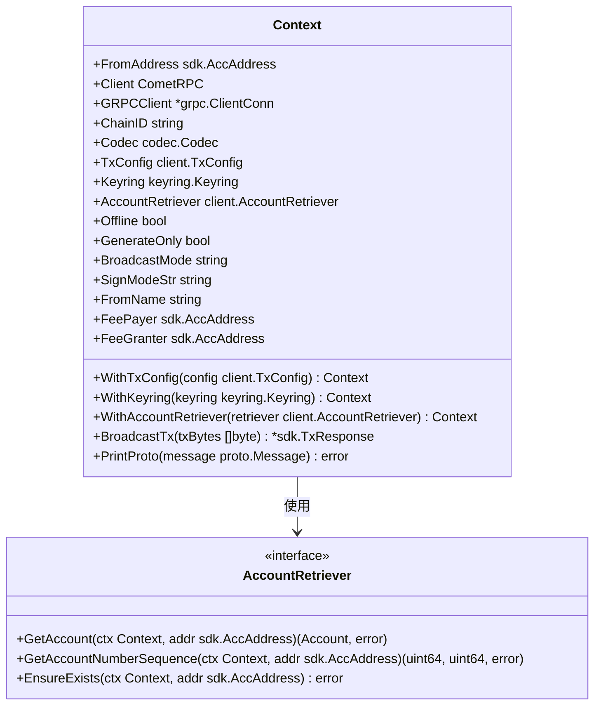

**图表来源**
- [client/context.go](file://client/context.go#L27-L68)
- [client/account_retriever.go](file://client/account_retriever.go#L16-L24)

### 上下文配置选项

| 配置项 | 类型 | 描述 | 用途 |
|--------|------|------|------|
| `Offline` | `bool` | 离线模式标志 | 禁用网络连接 |
| `GenerateOnly` | `bool` | 仅生成交易标志 | 不进行签名或广播 |
| `Simulate` | `bool` | 模拟模式标志 | 仅执行气体估算 |
| `SkipConfirm` | `bool` | 跳过确认标志 | 自动确认交易 |
| `BroadcastMode` | `string` | 广播模式 | 同步/异步广播 |
| `SignModeStr` | `string` | 签名模式字符串 | DIRECT/AUX/AMINO |

**章节来源**
- [client/context.go](file://client/context.go#L47-L62)

## 辅助交易构建器

### 构建器架构

辅助交易构建器（AuxTxBuilder）专门用于构建辅助签名者数据，支持直接辅助签名和传统AMINO JSON签名模式。

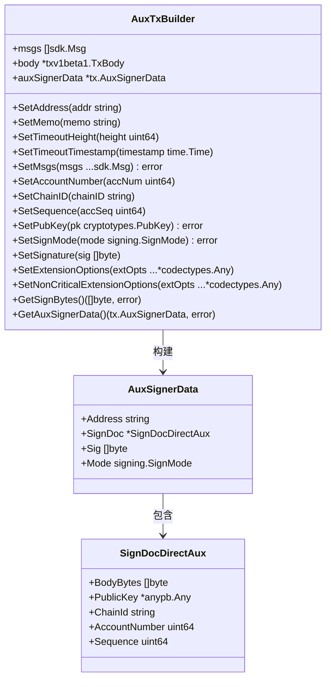

**图表来源**
- [client/tx/aux_builder.go](file://client/tx/aux_builder.go#L23-L32)

### 支持的签名模式

辅助构建器支持两种签名模式：

1. **DIRECT_AUX**: 直接辅助签名模式
2. **LEGACY_AMINO_JSON**: 传统AMINO JSON签名模式

**章节来源**
- [client/tx/aux_builder.go](file://client/tx/aux_builder.go#L132-L144)

## 交易构建流程

### 标准交易构建

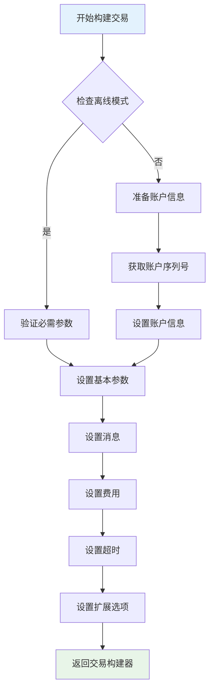

**图表来源**
- [client/tx/factory.go](file://client/tx/factory.go#L330-L387)

### 气体估算流程

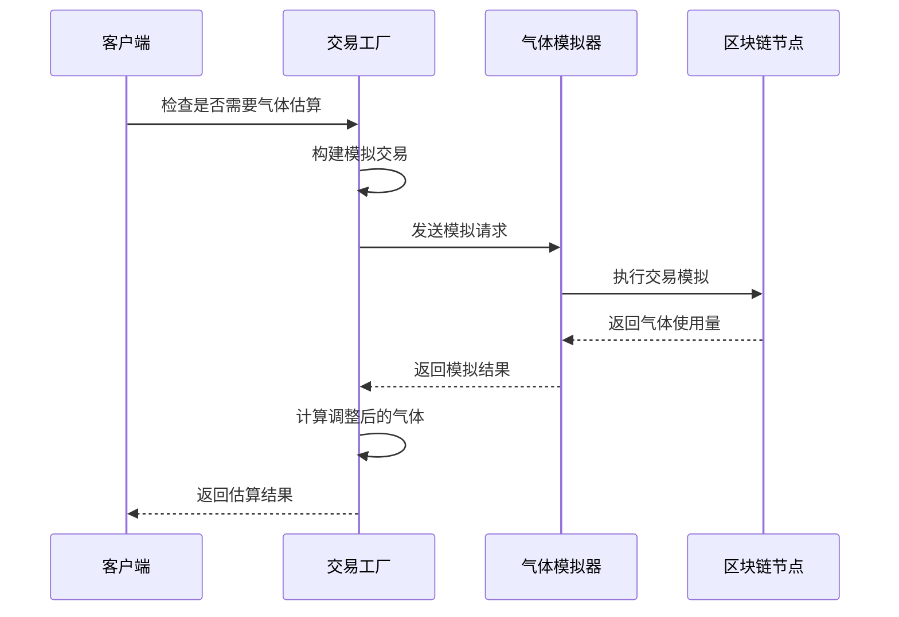

**图表来源**
- [client/tx/tx.go](file://client/tx/tx.go#L147-L166)

**章节来源**
- [client/tx/factory.go](file://client/tx/factory.go#L330-L387)
- [client/tx/tx.go](file://client/tx/tx.go#L147-L166)

## 签名与广播

### 签名流程

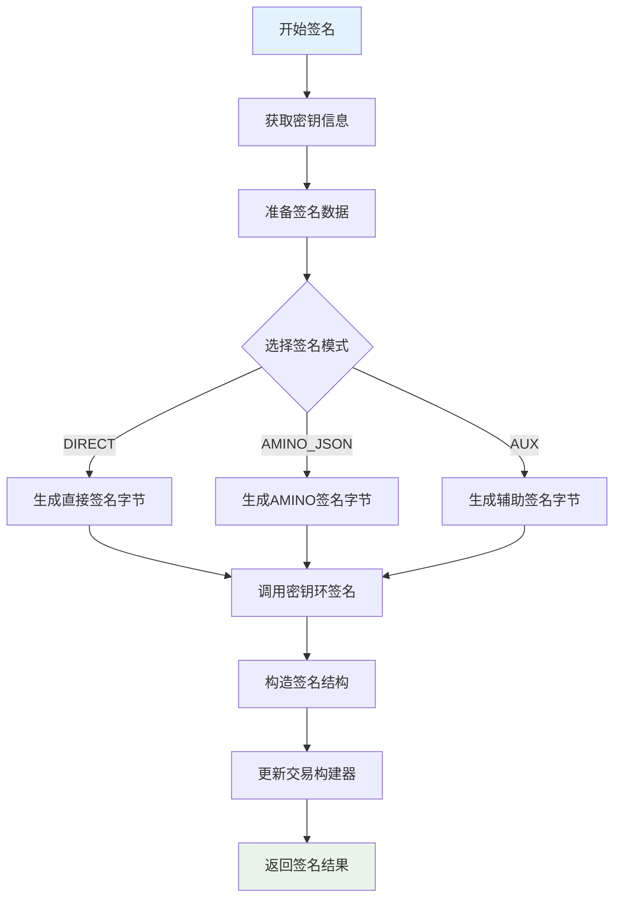

**图表来源**
- [client/tx/tx.go](file://client/tx/tx.go#L245-L361)

### 广播机制

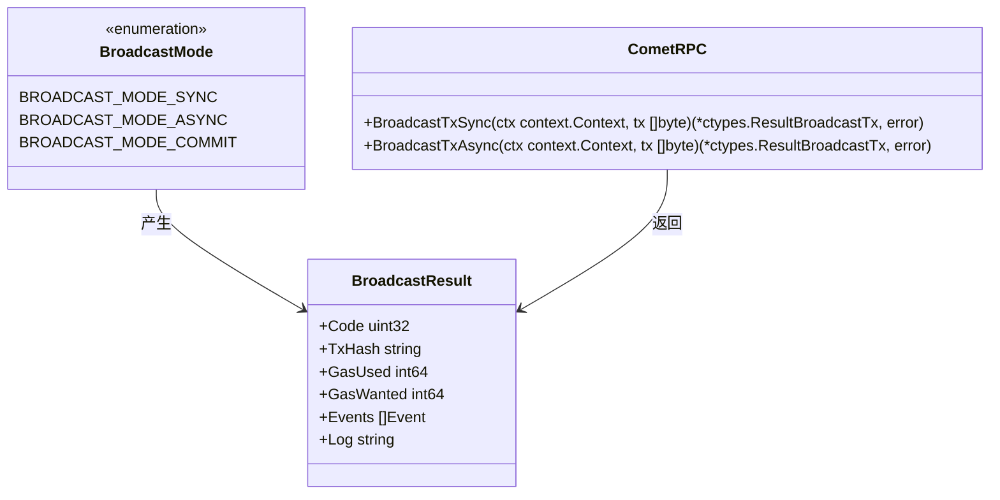

**图表来源**
- [client/broadcast.go](file://client/broadcast.go#L19-L36)

**章节来源**
- [client/tx/tx.go](file://client/tx/tx.go#L245-L361)
- [client/broadcast.go](file://client/broadcast.go#L19-L36)

## 离线与在线工作流

### 在线工作流

在线工作流适用于需要实时查询区块链状态的场景：

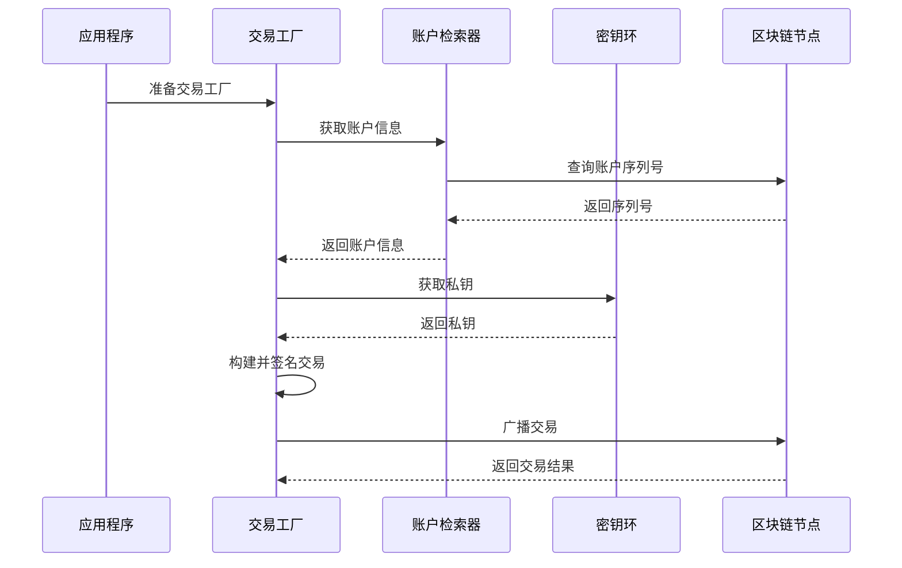

**图表来源**
- [client/tx/factory.go](file://client/tx/factory.go#L512-L549)

### 离线工作流

离线工作流适用于需要预先签名的场景：

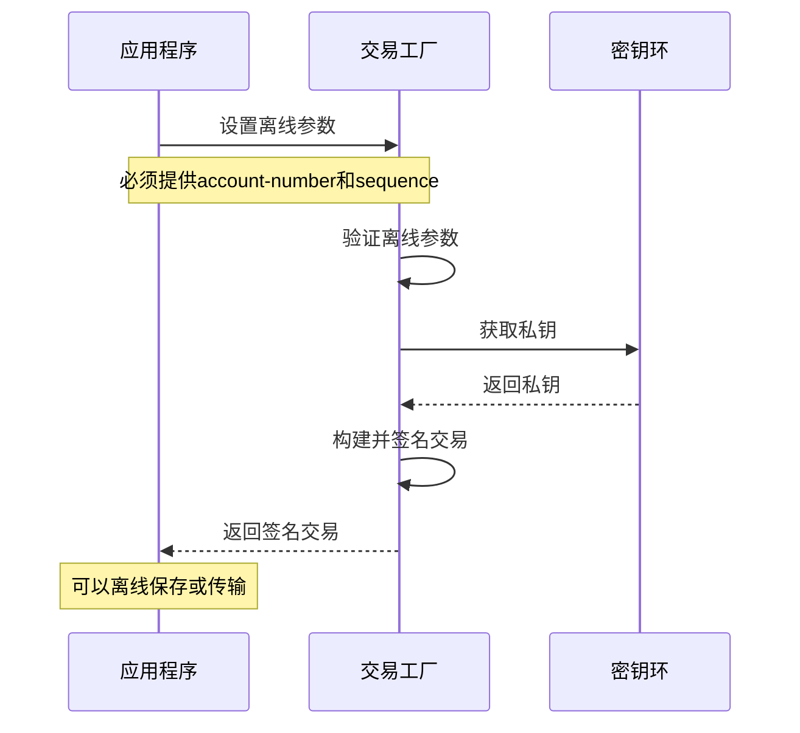

**图表来源**
- [client/tx/factory.go](file://client/tx/factory.go#L79-L86)

### 工作流对比表

| 特性 | 在线工作流 | 离线工作流 |
|------|------------|------------|
| 账户查询 | 自动查询 | 必须手动提供 |
| 签名时机 | 实时签名 | 提前签名 |
| 网络连接 | 需要 | 可选 |
| 参数要求 | 可选account-number和sequence | 必须提供 |
| 使用场景 | 日常交易 | 签名分离、批量签名 |

**章节来源**
- [client/tx/factory.go](file://client/tx/factory.go#L512-L549)
- [client/tx/factory.go](file://client/tx/factory.go#L79-L86)

## 交易响应处理

### 响应结构解析

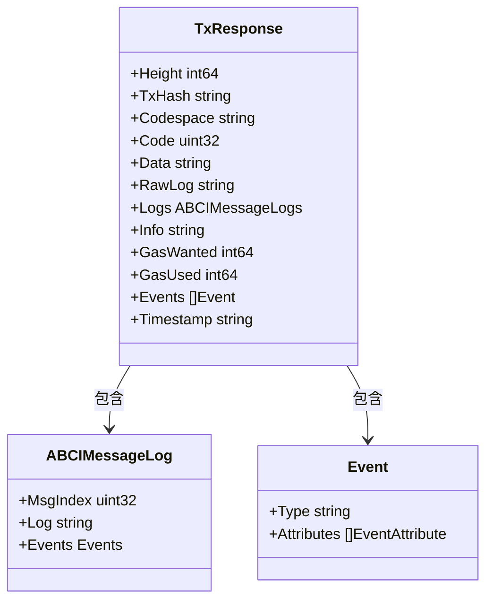

**图表来源**
- [types/tx/types.go](file://types/tx/types.go#L1-L50)

### 事件日志处理

交易响应中的事件日志提供了详细的执行信息：

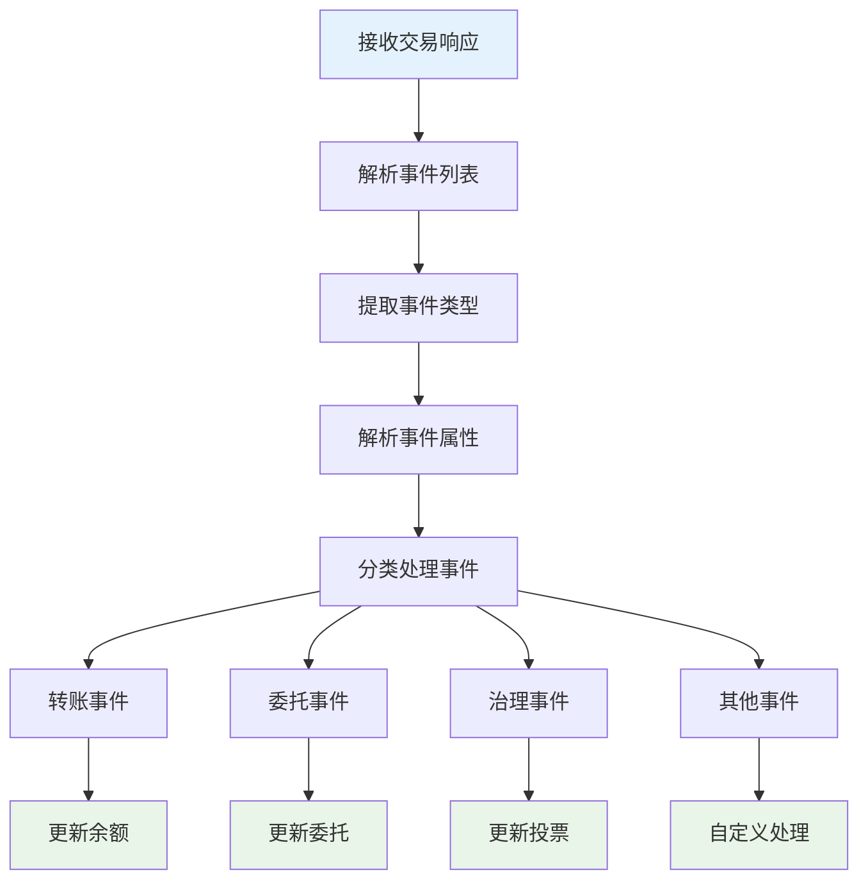

**章节来源**
- [types/tx/types.go](file://types/tx/types.go#L1-L200)

## 最佳实践

### 1. 交易工厂配置

```go
// 推荐的工厂配置模式
factory := client.Factory{}.
    WithChainID(chainID).
    WithKeybase(keyring).
    WithTxConfig(txConfig).
    WithAccountRetriever(accountRetriever).
    WithGas(gasLimit).
    WithGasAdjustment(1.2).
    WithFees("1000stake").
    WithMemo("用户转账").
    WithSignMode(signing.SignMode_SIGN_MODE_DIRECT)
```

### 2. 错误处理策略

```go
// 建议的错误处理模式
func processTransaction(clientCtx client.Context, factory client.Factory, msgs []sdk.Msg) error {
    // 1. 验证消息
    for _, msg := range msgs {
        if err := msg.ValidateBasic(); err != nil {
            return fmt.Errorf("消息验证失败: %w", err)
        }
    }
    
    // 2. 准备交易工厂
    factory, err := factory.Prepare(clientCtx)
    if err != nil {
        return fmt.Errorf("准备交易工厂失败: %w", err)
    }
    
    // 3. 处理气体估算
    if factory.SimulateAndExecute() {
        _, adjusted, err := client.CalculateGas(clientCtx, factory, msgs...)
        if err != nil {
            return fmt.Errorf("气体估算失败: %w", err)
        }
        factory = factory.WithGas(adjusted)
    }
    
    // 4. 构建交易
    tx, err := factory.BuildUnsignedTx(msgs...)
    if err != nil {
        return fmt.Errorf("构建交易失败: %w", err)
    }
    
    // 5. 签名和广播
    // ...
}
```

### 3. 性能优化建议

| 优化项 | 建议 | 说明 |
|--------|------|------|
| 气体预估 | 使用合理的gasAdjustment | 避免过高或过低的气体限制 |
| 批量处理 | 合并多个小交易 | 减少网络往返次数 |
| 缓存机制 | 缓存账户信息 | 避免重复查询 |
| 连接池 | 复用GRPC连接 | 提高网络效率 |

## 故障排除

### 常见问题及解决方案

#### 1. 账户序列号不匹配

**问题症状**: `incorrect account sequence`

**解决方案**:
```go
// 方法1：自动同步序列号
factory, err := factory.Prepare(clientCtx)
if err != nil {
    // 处理错误
}

// 方法2：手动设置序列号
factory = factory.WithSequence(correctSequence)
```

#### 2. 气体估算失败

**问题症状**: `failed to estimate gas`

**解决方案**:
```go
// 检查离线模式
if clientCtx.Offline {
    return errors.New("无法在离线模式下估算气体")
}

// 检查账户是否存在
if err := factory.accountRetriever.EnsureExists(clientCtx, fromAddress); err != nil {
    return fmt.Errorf("账户不存在: %w", err)
}
```

#### 3. 签名验证失败

**问题症状**: `signature verification failed`

**解决方案**:
```go
// 验证签名模式
if factory.signMode == signing.SignMode_SIGN_MODE_UNSPECIFIED {
    // 设置默认签名模式
    factory = factory.WithSignMode(signing.SignMode_SIGN_MODE_DIRECT)
}

// 验证公钥
pubKey, err := key.GetPubKey()
if err != nil {
    return fmt.Errorf("获取公钥失败: %w", err)
}
```

### 调试工具

#### 交易调试命令

```bash
# 生成未签名交易
simd tx bank send [from] [to] [amount] \
  --chain-id=testnet \
  --node=https://rpc.testnet.cosmos.network:443 \
  --generate-only \
  --output=json

# 签名交易
simd tx sign [unsigned_tx.json] \
  --from=mykey \
  --chain-id=testnet \
  --offline \
  --account-number=1 \
  --sequence=2

# 广播交易
simd tx broadcast [signed_tx.json] \
  --chain-id=testnet \
  --node=https://rpc.testnet.cosmos.network:443
```

#### 日志分析

```go
// 启用详细日志
logger := log.New(os.Stdout, "", log.LstdFlags)
logger.Println("交易哈希:", txResponse.TxHash)
logger.Println("气体使用:", txResponse.GasUsed)
logger.Println("执行结果:", txResponse.Logs)
```

## 总结

Cosmos SDK 的交易处理系统通过交易工厂模式、客户端上下文和辅助构建器等核心组件，提供了一个完整而灵活的交易处理框架。该系统支持多种工作流程，包括在线和离线模式，并提供了丰富的配置选项和错误处理机制。

### 关键特性

1. **模块化设计**: 清晰的职责分离，便于维护和扩展
2. **多签名模式**: 支持DIRECT、AUX、AMINO等多种签名模式
3. **灵活配置**: 丰富的配置选项满足不同使用场景
4. **错误处理**: 完善的错误处理和诊断机制
5. **性能优化**: 支持气体估算和批量处理

### 开发建议

- 根据具体需求选择合适的工作流程
- 正确处理各种错误情况
- 合理配置气体参数
- 利用缓存机制提高性能
- 实施适当的日志记录和监控

通过遵循本文档提供的指导原则和最佳实践，开发者可以有效地集成和使用 Cosmos SDK 的交易处理功能，构建稳定可靠的区块链应用程序。