# 交易广播

<cite>
**本文档中引用的文件**
- [client/broadcast.go](file://client/broadcast.go)
- [client/flags/flags.go](file://client/flags/flags.go)
- [client/context.go](file://client/context.go)
- [client/broadcast_test.go](file://client/broadcast_test.go)
- [client/cometbft.go](file://client/cometbft.go)
- [types/tx/types.go](file://types/tx/types.go)
- [api/cosmos/base/abci/v1beta1/abci.pulsar.go](file://api/cosmos/base/abci/v1beta1/abci.pulsar.go)
- [types/tx/service.pb.gw.go](file://types/tx/service.pb.gw.go)
</cite>

## 目录
1. [简介](#简介)
2. [核心架构概览](#核心架构概览)
3. [广播模式详解](#广播模式详解)
4. [上下文配置与模式选择](#上下文配置与模式选择)
5. [gRPC与REST API交互](#grpc与rest-api交互)
6. [错误处理与重试机制](#错误处理与重试机制)
7. [命令行参数控制](#命令行参数控制)
8. [响应解析指南](#响应解析指南)
9. [最佳实践与故障排除](#最佳实践与故障排除)
10. [总结](#总结)

## 简介

Cosmos SDK的交易广播系统是连接客户端应用与区块链网络的核心组件。它负责将签名后的交易发送到CometBFT节点进行验证和执行。本文档以`client/broadcast.go`中的`BroadcastTx`函数为核心，深入解析三种广播模式的工作原理、使用场景和性能影响。

交易广播系统提供了三种主要的广播模式：
- **同步模式（sync）**：等待交易被区块包含后返回结果
- **异步模式（async）**：立即返回，不等待交易确认
- **区块模式（block）**：等待交易被区块包含并确认

每种模式都有其特定的应用场景和性能特征，开发者需要根据具体需求选择合适的广播策略。

## 核心架构概览

交易广播系统采用分层架构设计，从上到下包括：

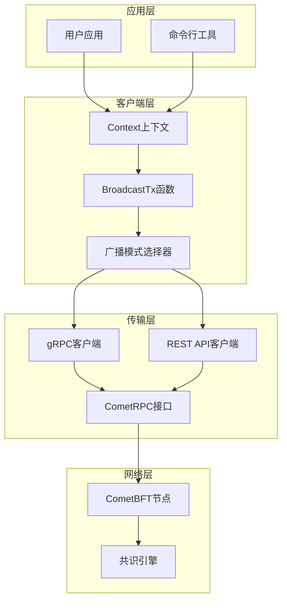

**图表来源**
- [client/broadcast.go](file://client/broadcast.go#L22-L35)
- [client/context.go](file://client/context.go#L27-L68)

**章节来源**
- [client/broadcast.go](file://client/broadcast.go#L1-L148)
- [client/context.go](file://client/context.go#L1-L200)

## 广播模式详解

### 同步模式（BroadcastSync）

同步模式是最常用的广播方式，它在交易通过`CheckTx`验证后立即返回，但会等待交易被包含到区块中。

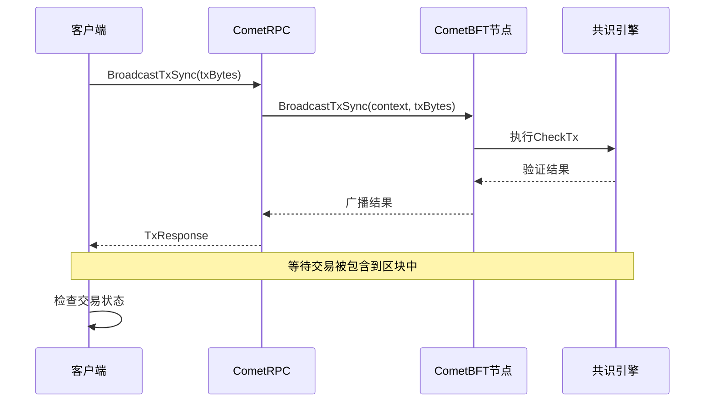

**图表来源**
- [client/broadcast.go](file://client/broadcast.go#L86-L100)

**特点：**
- 立即返回验证结果
- 等待交易被区块确认
- 适合需要确认交易状态的场景
- 性能开销相对较高

### 异步模式（BroadcastAsync）

异步模式提供最快的响应时间，交易仅在通过`CheckTx`验证后立即返回，不等待区块确认。

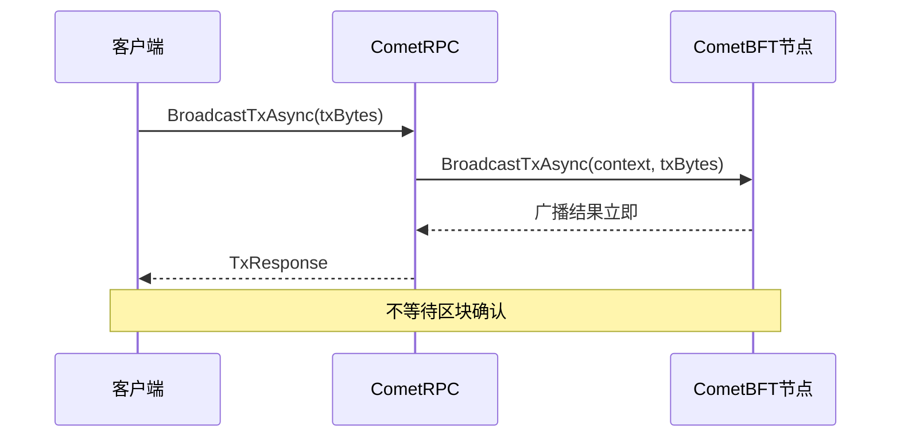

**图表来源**
- [client/broadcast.go](file://client/broadcast.go#L102-L116)

**特点：**
- 最快的响应速度
- 立即返回验证结果
- 不保证交易最终被确认
- 适合高吞吐量场景

### 区块模式（未直接实现）

虽然代码中没有直接实现区块模式，但可以通过组合同步模式和轮询机制实现类似功能。

**章节来源**
- [client/broadcast.go](file://client/broadcast.go#L22-L116)

## 上下文配置与模式选择

### Context结构体

`Context`结构体包含了所有广播操作所需的关键配置：

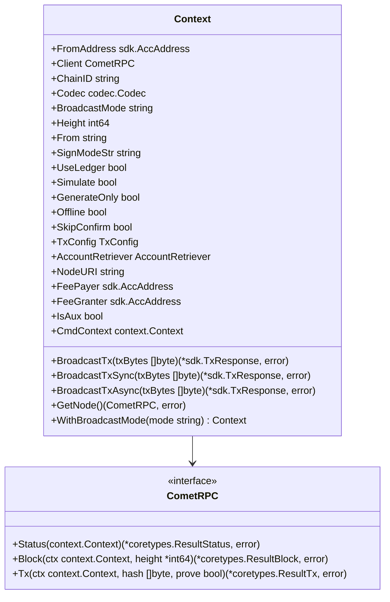

**图表来源**
- [client/context.go](file://client/context.go#L27-L68)
- [client/cometbft.go](file://client/cometbft.go#L10-L37)

### BroadcastMode配置

`BroadcastMode`字段决定了交易的广播行为：

| 模式 | 描述 | 使用场景 |
|------|------|----------|
| `"sync"` | 同步广播，等待区块确认 | 需要确认交易状态的场景 |
| `"async"` | 异步广播，立即返回 | 高吞吐量、快速响应场景 |
| 默认值 | 如果未设置，默认使用同步模式 | 兼容性考虑 |

**章节来源**
- [client/context.go](file://client/context.go#L46-L46)
- [client/broadcast.go](file://client/broadcast.go#L23-L32)

## gRPC与REST API交互

### gRPC服务接口

Cosmos SDK提供了标准的gRPC服务接口用于交易广播：

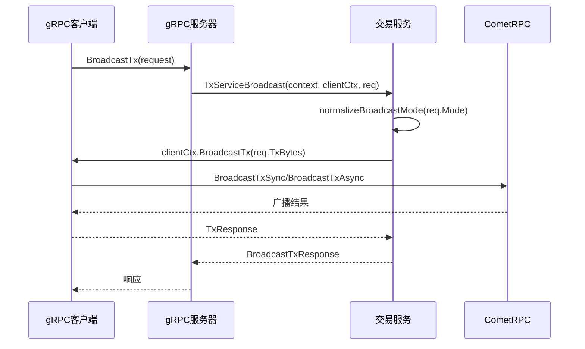

**图表来源**
- [client/broadcast.go](file://client/broadcast.go#L120-L134)
- [types/tx/service.pb.gw.go](file://types/tx/service.pb.gw.go#L117-L149)

### REST API端点

系统同时支持REST API调用，提供HTTP接口访问：

| 方法 | 端点 | 描述 |
|------|------|------|
| POST | `/cosmos/tx/v1beta1/txs` | 广播交易的主要端点 |
| GET | `/cosmos/tx/v1beta1/txs/{hash}` | 查询交易状态 |

**章节来源**
- [types/tx/service.pb.gw.go](file://types/tx/service.pb.gw.go#L432-L489)

## 错误处理与重试机制

### CometBFT错误检测

系统实现了专门的错误检测机制来处理CometBFT节点返回的预检查错误：

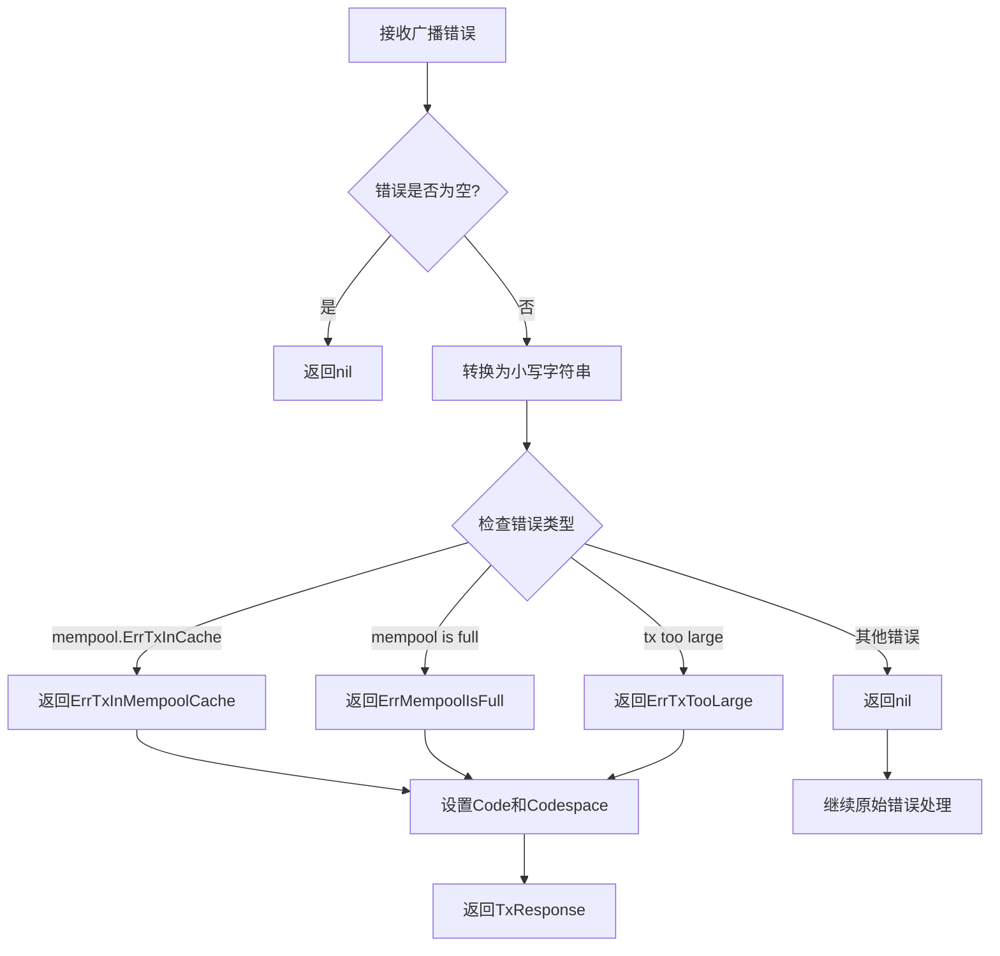

**图表来源**
- [client/broadcast.go](file://client/broadcast.go#L43-L84)

### 支持的错误类型

| 错误类型 | ABCI代码 | 描述 |
|----------|----------|------|
| `ErrTxInMempoolCache` | 1 | 交易已在内存池缓存中 |
| `ErrMempoolIsFull` | 2 | 内存池已满 |
| `ErrTxTooLarge` | 3 | 交易过大 |

### 超时与取消处理

系统支持上下文取消机制，当操作被取消时会正确处理：

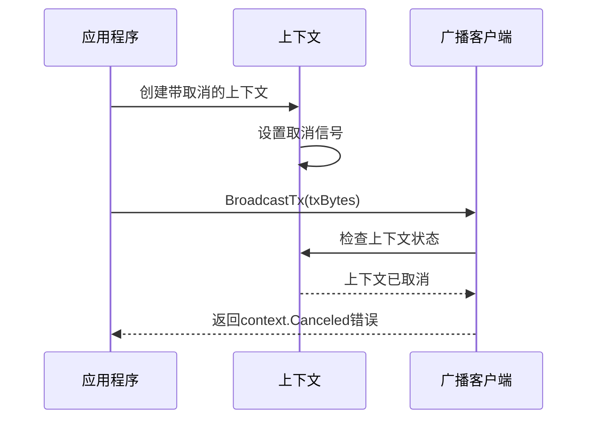

**图表来源**
- [client/broadcast_test.go](file://client/broadcast_test.go#L51-L66)

**章节来源**
- [client/broadcast.go](file://client/broadcast.go#L43-L84)
- [client/broadcast_test.go](file://client/broadcast_test.go#L51-L66)

## 命令行参数控制

### 广播模式参数

通过命令行参数可以灵活控制广播行为：

```bash
# 使用同步模式（默认）
simd tx send <recipient> <amount> --broadcast-mode sync

# 使用异步模式
simd tx send <recipient> <amount> --broadcast-mode async

# 使用自动模式（根据情况选择）
simd tx send <recipient> <amount> --broadcast-mode auto
```

### 相关标志参数

| 参数 | 类型 | 默认值 | 描述 |
|------|------|--------|------|
| `--broadcast-mode` | string | `"sync"` | 广播模式：sync/async |
| `--node` | string | `"tcp://localhost:26657"` | CometBFT RPC地址 |
| `--chain-id` | string | 必需 | 区块链网络标识符 |

### flags包中的常量定义

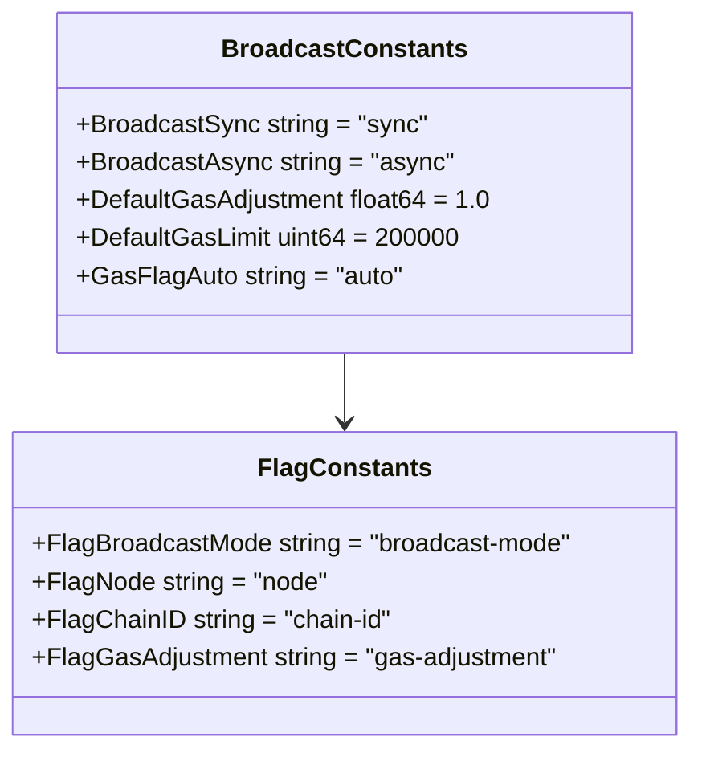

**图表来源**
- [client/flags/flags.go](file://client/flags/flags.go#L23-L28)

**章节来源**
- [client/flags/flags.go](file://client/flags/flags.go#L120-L146)

## 响应解析指南

### TxResponse结构体

广播操作返回的标准响应格式：

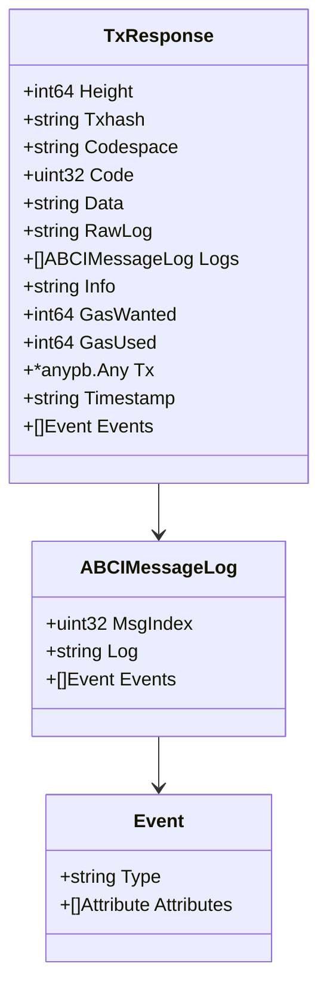

**图表来源**
- [api/cosmos/base/abci/v1beta1/abci.pulsar.go](file://api/cosmos/base/abci/v1beta1/abci.pulsar.go#L7283-L7320)

### 关键字段解析

| 字段 | 类型 | 描述 | 检查要点 |
|------|------|------|----------|
| `Code` | uint32 | ABCI响应码 | 0表示成功，非0表示失败 |
| `Txhash` | string | 交易哈希值 | 用于后续查询交易状态 |
| `RawLog` | string | 原始日志信息 | 失败时的重要错误信息 |
| `Height` | int64 | 包含交易的区块高度 | 同步模式下的重要信息 |
| `GasUsed` | int64 | 实际消耗的Gas | 成本计算参考 |

### 交易状态判断

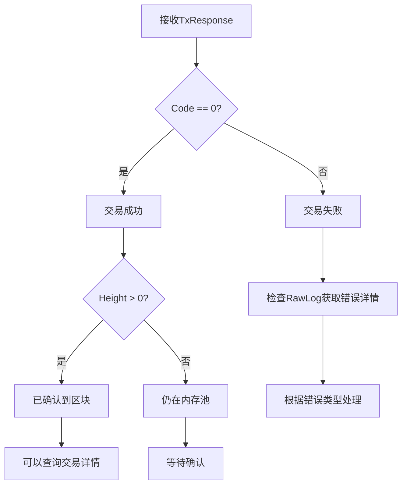

**章节来源**
- [api/cosmos/base/abci/v1beta1/abci.pulsar.go](file://api/cosmos/base/abci/v1beta1/abci.pulsar.go#L7283-L7320)

## 最佳实践与故障排除

### 可靠广播的最佳实践

1. **选择合适的广播模式**
   - 对于关键交易使用同步模式
   - 对于批量操作使用异步模式
   - 根据网络状况调整超时设置

2. **错误处理策略**
   ```go
   // 示例：可靠的广播实现
   func ReliableBroadcast(clientCtx client.Context, txBytes []byte) (*sdk.TxResponse, error) {
       var lastErr error
       for i := 0; i < 3; i++ {
           resp, err := clientCtx.BroadcastTx(txBytes)
           if err == nil {
               return resp, nil
           }
           lastErr = err
           time.Sleep(time.Duration(i+1) * time.Second)
       }
       return nil, fmt.Errorf("failed after retries: %w", lastErr)
   }
   ```

3. **网络故障恢复**
   - 实现指数退避重试机制
   - 监控节点健康状态
   - 准备备用节点列表

### 常见问题诊断

| 问题症状 | 可能原因 | 解决方案 |
|----------|----------|----------|
| 交易长时间未确认 | 网络拥堵、节点延迟 | 切换到异步模式或使用备用节点 |
| 频繁的mempool错误 | 内存池已满 | 调整gas限制或等待 |
| 交易被拒绝 | 签名无效或账户余额不足 | 检查交易构建和账户状态 |
| 连接超时 | 网络不稳定 | 增加超时时间或切换节点 |

### 性能优化建议

1. **批量处理**：对于大量交易，考虑批量广播
2. **并发控制**：限制同时广播的交易数量
3. **监控指标**：跟踪广播成功率和延迟
4. **缓存策略**：缓存频繁使用的交易数据

### 故障排除流程

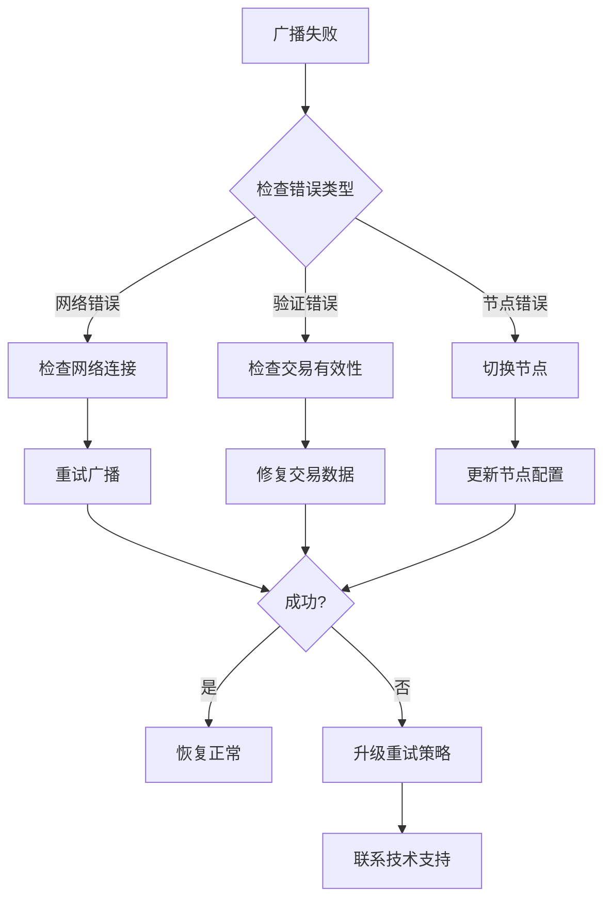

## 总结

Cosmos SDK的交易广播系统提供了灵活而强大的交易提交机制。通过理解三种广播模式的特点和适用场景，开发者可以根据具体需求选择最优的广播策略。

关键要点：
- **同步模式**适用于需要确认交易状态的场景
- **异步模式**提供最佳性能，适合高吞吐量应用
- **上下文配置**决定了广播行为的具体实现
- **错误处理**是确保系统可靠性的重要环节
- **命令行参数**提供了灵活的配置选项

通过遵循本文档提供的最佳实践和故障排除指南，开发者可以构建稳定可靠的交易广播系统，充分利用Cosmos SDK的强大功能。