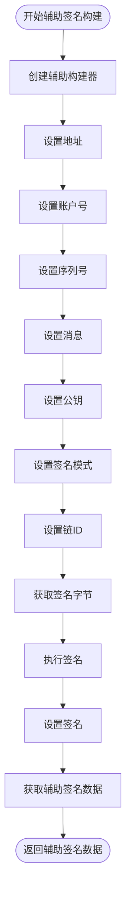

# 交易构建

<cite>
**本文档中引用的文件**
- [client/tx/factory.go](file://client/tx/factory.go)
- [client/tx/tx.go](file://client/tx/tx.go)
- [client/tx/aux_builder.go](file://client/tx/aux_builder.go)
- [types/tx/types.go](file://types/tx/types.go)
- [types/tx/signing/types.go](file://types/tx/signing/types.go)
- [client/context.go](file://client/context.go)
- [client/tx_config.go](file://client/tx_config.go)
- [client/tx/factory_test.go](file://client/tx/factory_test.go)
</cite>

## 目录
1. [简介](#简介)
2. [交易工厂架构概览](#交易工厂架构概览)
3. [Factory结构体详解](#factory结构体详解)
4. [核心方法深度解析](#核心方法深度解析)
5. [交易构建流程](#交易构建流程)
6. [签名数据结构](#签名数据结构)
7. [实际使用示例](#实际使用示例)
8. [最佳实践与优化建议](#最佳实践与优化建议)
9. [故障排除指南](#故障排除指南)
10. [总结](#总结)

## 简介

Cosmos SDK中的交易构建系统基于工厂模式设计，通过`Factory`结构体提供了灵活且强大的交易配置和构建能力。该系统支持多种交易类型，包括标准交易、辅助签名交易（Aux Signer Data）以及扩展选项交易，为开发者提供了完整的交易生命周期管理功能。

交易构建的核心目标是：
- 提供统一的交易配置接口
- 支持多种签名模式和验证机制
- 实现智能的gas估算和费用计算
- 确保交易的安全性和完整性

## 交易工厂架构概览

交易构建系统采用分层架构设计，主要包含以下核心组件：


**图表来源**
- [client/tx/factory.go](file://client/tx/factory.go#L27-L53)
- [client/context.go](file://client/context.go#L27-L71)

## Factory结构体详解

`Factory`结构体是整个交易构建系统的核心，包含了构建交易所需的所有配置参数：


**图表来源**
- [client/tx/factory.go](file://client/tx/factory.go#L27-L53)
- [client/tx_config.go](file://client/tx_config.go#L41-L64)
- [client/tx/aux_builder.go](file://client/tx/aux_builder.go#L24-L32)

### 核心配置字段说明

| 字段名 | 类型 | 描述 | 默认值 |
|--------|------|------|--------|
| `keybase` | `keyring.Keyring` | 密钥库，用于签名操作 | - |
| `txConfig` | `client.TxConfig` | 交易编码配置 | - |
| `accountNumber` | `uint64` | 账户编号 | 0 |
| `sequence` | `uint64` | 序列号 | 0 |
| `gas` | `uint64` | gas限制 | 0 |
| `gasAdjustment` | `float64` | gas调整系数 | 1.0 |
| `chainID` | `string` | 区块链标识符 | "" |
| `memo` | `string` | 交易备注 | "" |
| `fees` | `sdk.Coins` | 手续费 | nil |
| `gasPrices` | `sdk.DecCoins` | gas价格 | nil |
| `timeoutHeight` | `uint64` | 超时区块高度 | 0 |
| `timeoutTimestamp` | `time.Time` | 超时时间戳 | 零值 |
| `signMode` | `signing.SignMode` | 签名模式 | SIGN_MODE_UNSPECIFIED |

**章节来源**
- [client/tx/factory.go](file://client/tx/factory.go#L27-L53)

## 核心方法深度解析

### NewFactoryCLI 方法

`NewFactoryCLI`是创建交易工厂的主要入口点，负责从命令行标志和客户端上下文中初始化工厂实例：


**图表来源**
- [client/tx/factory.go](file://client/tx/factory.go#L55-L132)

### Prepare 方法

`Prepare`方法确保账户存在并获取必要的账户信息：


**图表来源**
- [client/tx/factory.go](file://client/tx/factory.go#L512-L549)

### BuildUnsignedTx 方法

`BuildUnsignedTx`是交易构建的核心方法，负责创建未签名的交易：


**图表来源**
- [client/tx/factory.go](file://client/tx/factory.go#L330-L387)

**章节来源**
- [client/tx/factory.go](file://client/tx/factory.go#L55-L132)
- [client/tx/factory.go](file://client/tx/factory.go#L512-L549)
- [client/tx/factory.go](file://client/tx/factory.go#L330-L387)

## 交易构建流程

### 标准交易构建流程

标准交易构建遵循严格的步骤序列，确保交易的完整性和安全性：


**图表来源**
- [client/tx/tx.go](file://client/tx/tx.go#L70-L145)
- [client/tx/factory.go](file://client/tx/factory.go#L330-L387)

### 辅助签名交易构建

辅助签名交易（Aux Signer Data）提供了特殊的签名机制，主要用于Tipper模式：



**图表来源**
- [client/tx/aux_builder.go](file://client/tx/aux_builder.go#L34-L290)

**章节来源**
- [client/tx/tx.go](file://client/tx/tx.go#L70-L145)
- [client/tx/aux_builder.go](file://client/tx/aux_builder.go#L34-L290)

## 签名数据结构

### SignerData 结构

`SignerData`是签名过程中使用的标准化数据结构：


**图表来源**
- [types/tx/signing/types.go](file://types/tx/signing/types.go#L1-L50)
- [client/tx/tx.go](file://client/tx/tx.go#L251-L361)

### 交易数据模型

Cosmos SDK中的交易数据模型基于Protocol Buffers定义：

```mermaid
erDiagram
Tx {
TxBody body
AuthInfo auth_info
[]bytes signatures
}
TxBody {
[]Any messages
string memo
uint64 timeout_height
uint64 extension_options
uint64 non_critical_extension_options
}
AuthInfo {
[]SignerInfo signer_infos
Fee fee
}
SignerInfo {
Any public_key
uint64 mode_info
uint64 sequence
}
Fee {
Coins amount
uint64 gas_limit
string payer
string granter
}
Tx ||--|| TxBody : "包含"
Tx ||--|| AuthInfo : "包含"
AuthInfo ||--o{ SignerInfo : "包含"
AuthInfo ||--|| Fee : "包含"
```

**图表来源**
- [types/tx/types.go](file://types/tx/types.go#L1-L237)

**章节来源**
- [types/tx/signing/types.go](file://types/tx/signing/types.go#L1-L50)
- [types/tx/types.go](file://types/tx/types.go#L1-L237)

## 实际使用示例

### 基础交易构建示例

以下是构建标准交易的典型代码模式：

```go
// 1. 创建交易工厂
factory := client.Factory{}
clientCtx := client.Context{}
msgs := []sdk.Msg{msg1, msg2}

// 2. 准备工厂
preparedFactory, err := factory.Prepare(clientCtx)
if err != nil {
    return err
}

// 3. 构建未签名交易
unsignedTx, err := preparedFactory.BuildUnsignedTx(msgs...)
if err != nil {
    return err
}

// 4. 设置签名
err = tx.Sign(clientCtx.GetCmdContextWithFallback(), 
              preparedFactory, 
              clientCtx.FromName, 
              unsignedTx, 
              true)
if err != nil {
    return err
}

// 5. 获取交易字节并广播
txBytes, err := clientCtx.TxConfig.TxEncoder()(unsignedTx.GetTx())
if err != nil {
    return err
}

result, err := clientCtx.BroadcastTx(txBytes)
```

### 批量交易处理

对于需要处理多个消息的场景：

```go
// 构建批量交易
batchMsgs := []sdk.Msg{
    banktypes.NewMsgSend(fromAddr, toAddr1, amount1),
    banktypes.NewMsgSend(fromAddr, toAddr2, amount2),
    banktypes.NewMsgSend(fromAddr, toAddr3, amount3),
}

// 使用工厂构建交易
factory := factory.WithGas(200000).WithFees("1000stake")
unsignedTx, err := factory.BuildUnsignedTx(batchMsgs...)
```

### 动态费用交易

实现动态费用估算：

```go
// 启用gas模拟和执行
factory := factory.WithSimulateAndExecute(true)

// 执行交易（会自动估算gas）
result, err := tx.BroadcastTx(clientCtx, factory, msgs...)
if err != nil {
    return err
}
```

### 辅助签名交易示例

```go
// 创建辅助签名构建器
builder := tx.NewAuxTxBuilder()
fromAddress, _, _, err := client.GetFromFields(clientCtx, clientCtx.Keyring, clientCtx.From)
if err != nil {
    return err
}

// 设置辅助签名数据
builder.SetAddress(fromAddress.String())
builder.SetAccountNumber(accountNumber)
builder.SetSequence(sequence)
builder.SetMsgs(msgs...)
builder.SetPubKey(pubKey)
builder.SetSignMode(signing.SignMode_SIGN_MODE_DIRECT_AUX)

// 获取签名字节
signBytes, err := builder.GetSignBytes()
if err != nil {
    return err
}

// 执行签名
signature, _, err := clientCtx.Keyring.Sign(name, signBytes, signing.SignMode_SIGN_MODE_DIRECT_AUX)
if err != nil {
    return err
}

// 设置签名
builder.SetSignature(signature)

// 获取最终的辅助签名数据
auxSignerData, err := builder.GetAuxSignerData()
```

**章节来源**
- [client/tx/tx.go](file://client/tx/tx.go#L24-L145)
- [client/tx/aux_builder.go](file://client/tx/aux_builder.go#L370-L431)

## 最佳实践与优化建议

### Gas估算优化

1. **启用自动gas估算**：
```go
factory := factory.WithSimulateAndExecute(true)
```

2. **合理设置gas调整系数**：
```go
factory := factory.WithGasAdjustment(1.2) // 20%缓冲
```

3. **监控gas使用情况**：
```go
// 在生产环境中记录gas使用统计
gasUsed := unsignedTx.GetTx().GetGas()
fmt.Printf("Gas used: %d\n", gasUsed)
```

### 错误处理策略

1. **验证输入参数**：
```go
// 在构建前验证消息
for _, msg := range msgs {
    if err := msg.ValidateBasic(); err != nil {
        return fmt.Errorf("invalid message: %w", err)
    }
}
```

2. **优雅处理网络错误**：
```go
// 实现重试机制
maxRetries := 3
for i := 0; i < maxRetries; i++ {
    result, err := tx.BroadcastTx(clientCtx, factory, msgs...)
    if err == nil {
        break
    }
    time.Sleep(time.Duration(i+1) * time.Second)
}
```

### 安全性考虑

1. **防止助记词泄露**：
```go
// 验证备忘录不包含有效助记词
if bip39.IsMnemonicValid(strings.ToLower(factory.Memo())) {
    return errors.New("备忘录不能包含有效的助记词")
}
```

2. **验证账户状态**：
```go
// 确保账户有足够的余额
balance := clientCtx.Balance(fromAddr, denom)
if balance.IsLT(factory.Fees()) {
    return errors.New("账户余额不足")
}
```

### 性能优化建议

1. **缓存工厂实例**：
```go
// 复用工厂实例避免重复初始化
var cachedFactory client.Factory
func getFactory() client.Factory {
    if cachedFactory == (client.Factory{}) {
        cachedFactory = createFactory()
    }
    return cachedFactory
}
```

2. **批量处理消息**：
```go
// 将相关消息组合到单个交易中
combinedMsgs := combineRelatedMessages(msgs)
unsignedTx, err := factory.BuildUnsignedTx(combinedMsgs...)
```

### 测试策略

1. **单元测试**：
```go
func TestBuildTransaction(t *testing.T) {
    factory := createTestFactory()
    msgs := createTestMessages()
    
    tx, err := factory.BuildUnsignedTx(msgs...)
    require.NoError(t, err)
    require.NotNil(t, tx)
}
```

2. **集成测试**：
```go
func TestTransactionLifecycle(t *testing.T) {
    // 测试完整的交易生命周期
    // 包括构建、签名、广播和确认
}
```

## 故障排除指南

### 常见错误及解决方案

1. **链ID相关错误**：
```
错误：chain ID required but not specified
解决：确保在工厂中正确设置chainID
factory := factory.WithChainID("cosmoshub-4")
```

2. **账户信息错误**：
```
错误：account-number and sequence must be set in offline mode
解决：在离线模式下手动设置账户信息
factory := factory.WithAccountNumber(1).WithSequence(2)
```

3. **gas配置冲突**：
```
错误：cannot provide both fees and gas prices
解决：只能选择一种费用计算方式
factory := factory.WithFees("1000stake") // 或
factory := factory.WithGasPrices("0.001stake")
```

4. **签名模式错误**：
```
错误：AuxTxBuilder can only sign with SIGN_MODE_DIRECT_AUX or SIGN_MODE_LEGACY_AMINO_JSON
解决：使用允许的签名模式
builder.SetSignMode(signing.SignMode_SIGN_MODE_DIRECT_AUX)
```

### 调试技巧

1. **启用详细日志**：
```go
// 设置调试级别
logLevel := "debug"
clientCtx := clientCtx.WithLogLevel(logLevel)
```

2. **打印交易详情**：
```go
// 打印交易的JSON表示
encoder := factory.txConfig.TxJSONEncoder()
jsonBytes, err := encoder(unsignedTx.GetTx())
if err == nil {
    fmt.Println("交易详情:", string(jsonBytes))
}
```

3. **验证交易结构**：
```go
// 验证交易的基本有效性
err := unsignedTx.GetTx().ValidateBasic()
if err != nil {
    fmt.Printf("交易验证失败: %v\n", err)
}
```

### 性能问题诊断

1. **gas估算过慢**：
```go
// 禁用自动gas估算，使用固定值
factory := factory.WithGas(200000)
```

2. **网络延迟问题**：
```go
// 设置合理的超时时间
clientCtx := clientCtx.WithTimeout(30 * time.Second)
```

**章节来源**
- [client/tx/factory.go](file://client/tx/factory.go#L330-L387)
- [client/tx/tx.go](file://client/tx/tx.go#L147-L166)

## 总结

Cosmos SDK的交易构建系统通过工厂模式提供了强大而灵活的交易管理能力。核心优势包括：

### 主要特性

1. **模块化设计**：清晰分离了配置、构建和签名等不同阶段
2. **多签名支持**：兼容多种签名模式和验证机制
3. **智能gas管理**：自动估算和调整gas使用
4. **扩展性**：支持自定义扩展选项和预处理钩子
5. **安全性**：内置多重验证和错误检查机制

### 使用建议

1. **开发阶段**：充分利用gas估算和调试工具
2. **生产环境**：实施完善的错误处理和监控机制
3. **性能优化**：根据具体需求调整gas配置和缓存策略
4. **安全考虑**：严格验证输入参数和账户状态

### 未来发展方向

随着Cosmos生态系统的不断发展，交易构建系统将继续演进，可能的方向包括：
- 更智能的gas估算算法
- 改进的多签支持
- 更丰富的扩展选项
- 增强的安全特性

通过深入理解和正确使用这些工具，开发者可以构建出高效、安全且可维护的区块链应用程序。