# 交易签名机制全面文档

<cite>
**本文档引用的文件**
- [client/context.go](file://client/context.go)
- [client/tx/factory.go](file://client/tx/factory.go)
- [client/tx/tx.go](file://client/tx/tx.go)
- [client/tx/aux_builder.go](file://client/tx/aux_builder.go)
- [client/account_retriever.go](file://client/account_retriever.go)
- [crypto/keyring/keyring.go](file://crypto/keyring/keyring.go)
- [crypto/keyring/signing_algorithms.go](file://crypto/keyring/signing_algorithms.go)
</cite>

## 目录
1. [简介](#简介)
2. [核心组件架构](#核心组件架构)
3. [Context对象详解](#context对象详解)
4. [账户序列号和公钥获取机制](#账户序列号和公钥获取机制)
5. [离线签名与在线签名工作流](#离线签名与在线签名工作流)
6. [签名算法与密钥管理](#签名算法与密钥管理)
7. [工厂模式与交易构建](#工厂模式与交易构建)
8. [分离签名与多签支持](#分离签名与多签支持)
9. [高级签名场景](#高级签名场景)
10. [故障排除指南](#故障排除指南)
11. [总结](#总结)

## 简介

Cosmos SDK的交易签名机制是一个复杂而精密的系统，负责确保区块链网络中所有交易的完整性和安全性。该机制通过多个核心组件协同工作，实现了从密钥管理到最终签名生成的完整流程。

本文档将深入探讨交易签名的核心原理，重点分析`client/context.go`中`Context`对象的作用，详细说明离线和在线签名的工作流程，并展示如何处理复杂的多签和分离签名场景。

## 核心组件架构

交易签名机制的核心架构包含以下主要组件：

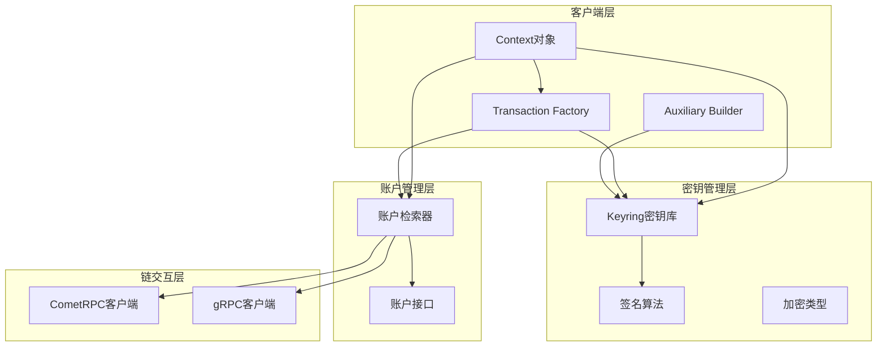

**图表来源**
- [client/context.go](file://client/context.go#L27-L68)
- [client/tx/factory.go](file://client/tx/factory.go#L27-L53)
- [crypto/keyring/keyring.go](file://crypto/keyring/keyring.go#L58-L106)

## Context对象详解

`Context`对象是交易签名机制的核心控制器，它封装了所有必要的配置和状态信息。

### Context结构体组成

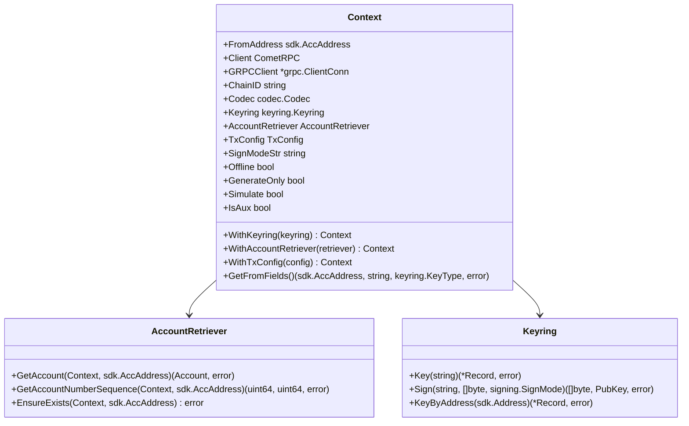

**图表来源**
- [client/context.go](file://client/context.go#L29-L68)
- [client/account_retriever.go](file://client/account_retriever.go#L16-L24)
- [crypto/keyring/keyring.go](file://crypto/keyring/keyring.go#L58-L106)

### Context的核心职责

1. **身份验证管理**：维护发送者地址、名称和密钥类型
2. **链连接管理**：提供CometRPC和gRPC客户端连接
3. **编码配置**：管理消息编解码器和接口注册表
4. **密钥访问**：提供对密钥库的访问接口
5. **签名模式控制**：配置不同的签名模式

**章节来源**
- [client/context.go](file://client/context.go#L27-L68)

## 账户序列号和公钥获取机制

### GetAccount方法详解

`GetAccount`方法是`AccountRetriever`接口的核心方法，负责从链上获取账户信息。

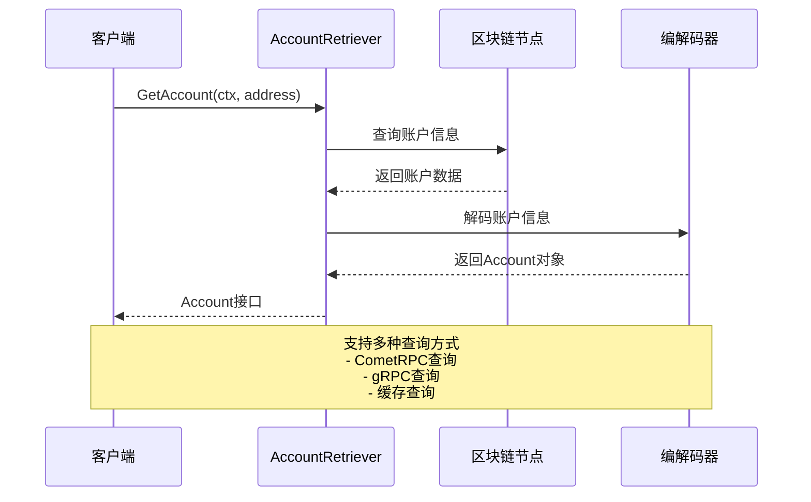

**图表来源**
- [client/account_retriever.go](file://client/account_retriever.go#L19-L24)

### QueryAccount方法实现

`QueryAccount`方法提供了更灵活的账户查询功能，支持指定高度查询：

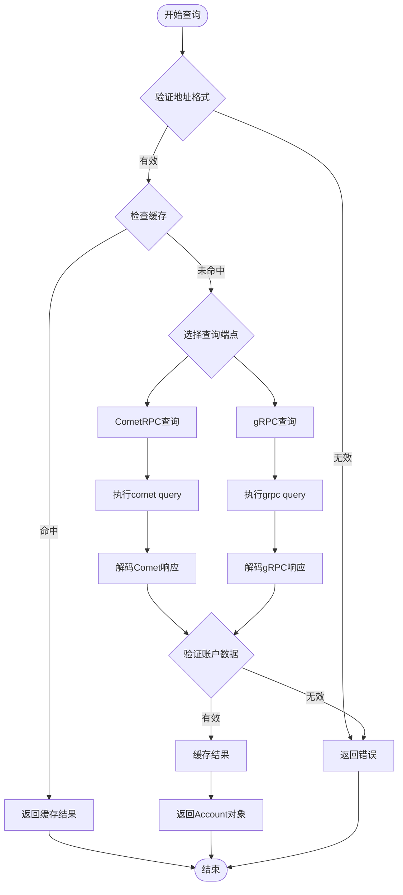

**图表来源**
- [client/account_retriever.go](file://client/account_retriever.go#L19-L24)

### 序列号获取逻辑

账户序列号的获取遵循严格的顺序：

1. **离线模式**：直接使用预设值
2. **在线模式**：
   - 首先尝试从缓存获取
   - 如果缓存未命中，查询链状态
   - 更新本地缓存

**章节来源**
- [client/account_retriever.go](file://client/account_retriever.go#L16-L50)

## 离线签名与在线签名工作流

### 离线签名工作流

离线签名适用于需要在无网络环境中生成签名的场景：

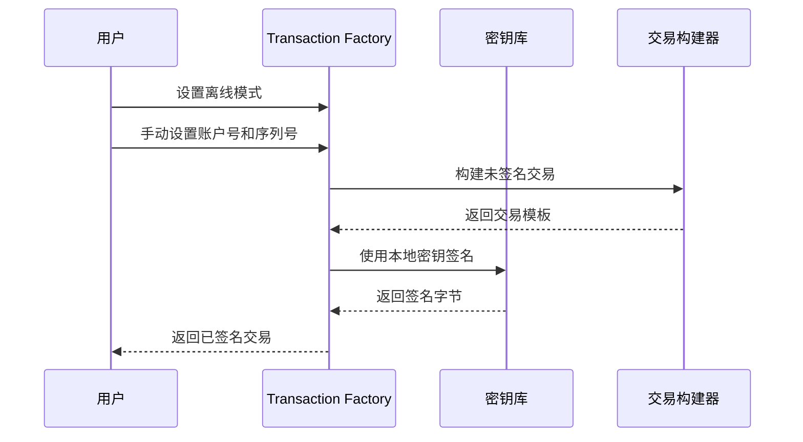

**图表来源**
- [client/tx/factory.go](file://client/tx/factory.go#L79-L87)

### 在线签名工作流

在线签名自动从链上获取必要的账户信息：

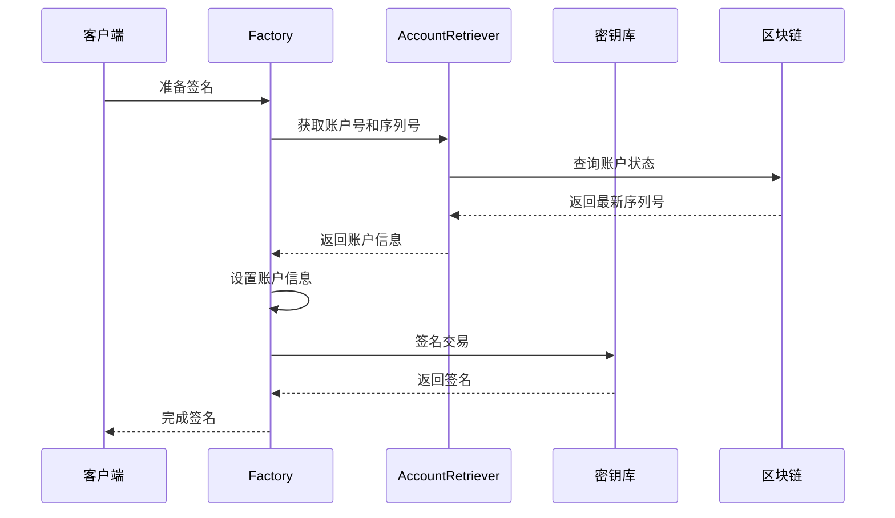

**图表来源**
- [client/tx/factory.go](file://client/tx/factory.go#L512-L549)

### 工作流对比表

| 特性 | 离线签名 | 在线签名 |
|------|----------|----------|
| 网络要求 | 不需要 | 需要 |
| 账户信息来源 | 手动设置 | 自动查询 |
| 序列号准确性 | 可能过期 | 始终最新 |
| 安全性 | 更高（无网络暴露） | 较低（网络传输） |
| 性能 | 快速 | 需要网络延迟 |
| 适用场景 | 硬件钱包、安全环境 | 普通用户场景 |

**章节来源**
- [client/tx/factory.go](file://client/tx/factory.go#L79-L87)
- [client/tx/factory.go](file://client/tx/factory.go#L512-L549)

## 签名算法与密钥管理

### 密钥库架构

密钥库是签名机制的基础，负责安全存储和管理私钥：

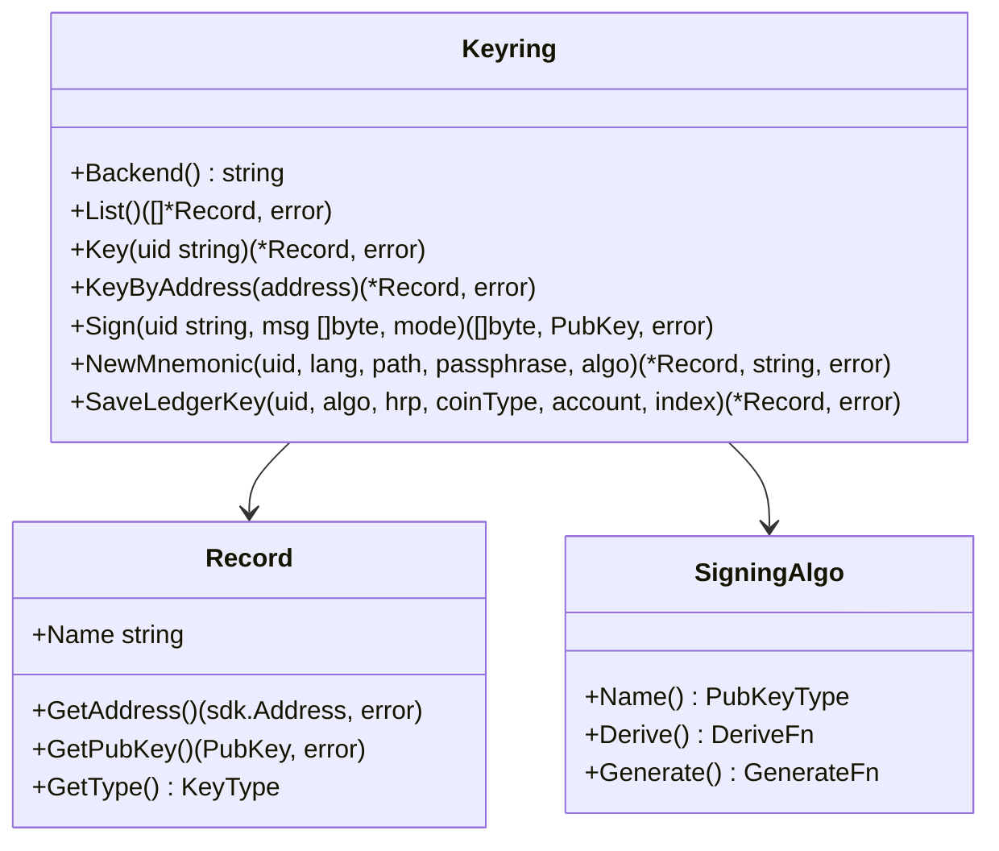

**图表来源**
- [crypto/keyring/keyring.go](file://crypto/keyring/keyring.go#L58-L106)
- [crypto/keyring/keyring.go](file://crypto/keyring/keyring.go#L202-L242)

### 支持的签名算法

当前支持的主要签名算法：

| 算法 | 类型 | 安全级别 | 用途 |
|------|------|----------|------|
| Secp256k1 | ECDSA | 高 | 主要签名算法 |
| Ed25519 | Edwards | 高 | 验证和验证 |
| BLS | BLS12-381 | 极高 | 多签和聚合签名 |

### 密钥存储后端

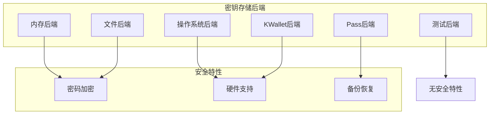

**图表来源**
- [crypto/keyring/keyring.go](file://crypto/keyring/keyring.go#L31-L39)

**章节来源**
- [crypto/keyring/keyring.go](file://crypto/keyring/keyring.go#L58-L106)
- [crypto/keyring/signing_algorithms.go](file://crypto/keyring/signing_algorithms.go#L1-L50)

## 工厂模式与交易构建

### Transaction Factory设计

`Factory`结构体采用工厂模式，提供灵活的交易构建和签名配置：

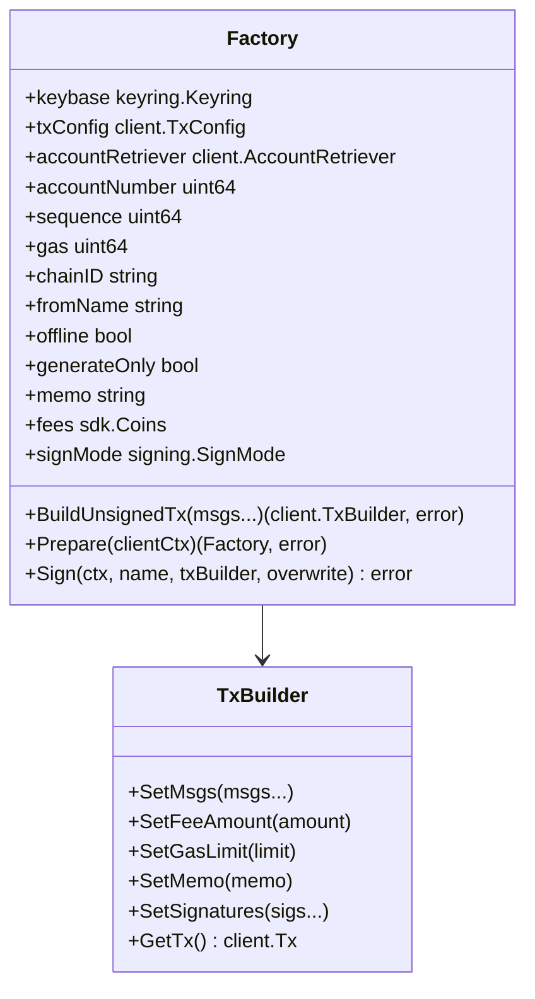

**图表来源**
- [client/tx/factory.go](file://client/tx/factory.go#L27-L53)

### 交易构建流程

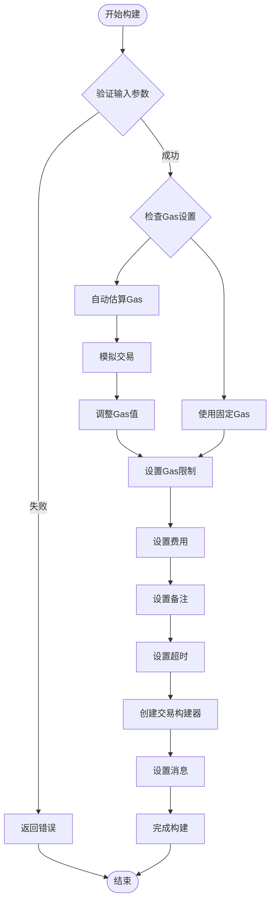

**图表来源**
- [client/tx/factory.go](file://client/tx/factory.go#L330-L386)

**章节来源**
- [client/tx/factory.go](file://client/tx/factory.go#L27-L53)

## 分离签名与多签支持

### AuxTxBuilder机制

分离签名允许将签名过程与交易构建分离，特别适用于Tipper模式：

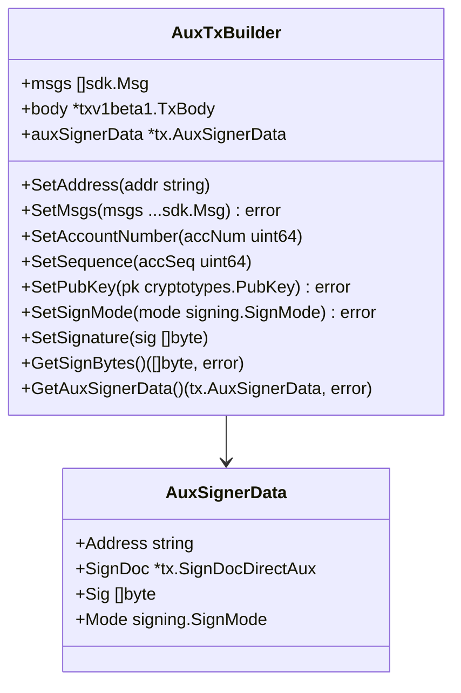

**图表来源**
- [client/tx/aux_builder.go](file://client/tx/aux_builder.go#L23-L32)

### 多签交易处理

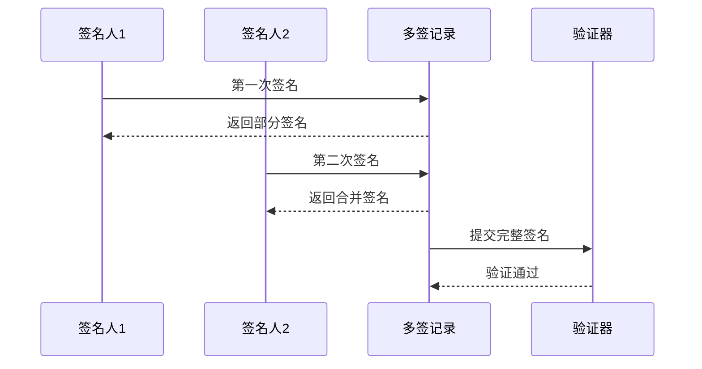

**图表来源**
- [client/tx/aux_builder.go](file://client/tx/aux_builder.go#L1-L290)

### 分离签名工作流程

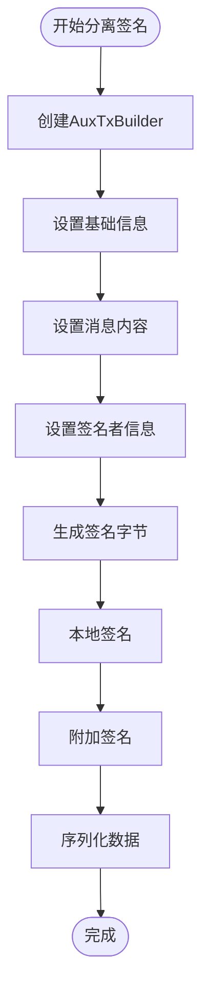

**图表来源**
- [client/tx/tx.go](file://client/tx/tx.go#L372-L431)

**章节来源**
- [client/tx/aux_builder.go](file://client/tx/aux_builder.go#L23-L32)
- [client/tx/tx.go](file://client/tx/tx.go#L372-L431)

## 高级签名场景

### Tipper模式签名

Tipper模式允许第三方为交易支付费用：

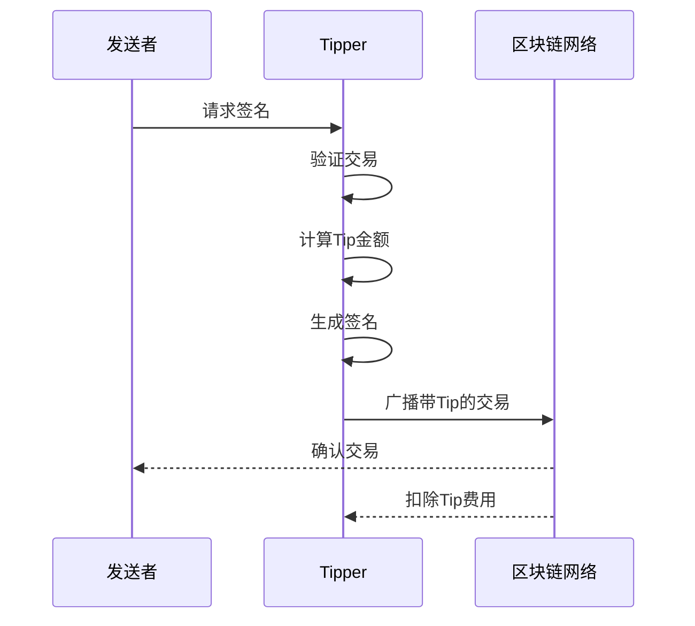

### 动态费用签名

动态费用允许根据市场情况调整Gas价格：

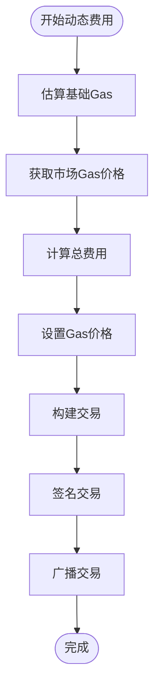

### 硬件钱包集成

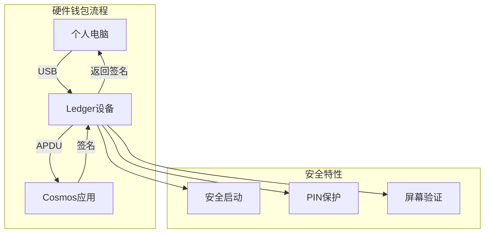

**章节来源**
- [client/tx/tx.go](file://client/tx/tx.go#L372-L431)

## 故障排除指南

### 常见签名错误

| 错误类型 | 原因 | 解决方案 |
|----------|------|----------|
| 账户不存在 | 地址格式错误或账户未创建 | 检查地址格式，确认账户存在 |
| 序列号不匹配 | 账户序列号过期 | 重新查询最新序列号 |
| 签名验证失败 | 私钥不匹配或消息被篡改 | 检查密钥一致性，验证消息完整性 |
| Gas不足 | Gas估算错误 | 增加Gas限制或优化交易 |
| 网络连接失败 | 链节点不可用 | 检查网络连接，切换节点 |

### 调试技巧

1. **启用详细日志**：设置适当的日志级别
2. **使用模拟模式**：在离线环境中测试
3. **分步验证**：逐步检查每个组件的状态
4. **监控网络**：观察网络请求和响应

### 性能优化建议

1. **缓存策略**：合理使用账户信息缓存
2. **批量操作**：合并多个小交易
3. **异步处理**：使用异步签名流程
4. **资源管理**：及时释放不需要的资源

## 总结

Cosmos SDK的交易签名机制是一个高度模块化和可扩展的系统，通过以下关键特性确保了交易的安全性和可靠性：

### 核心优势

1. **模块化设计**：清晰的职责分离和接口定义
2. **多重安全机制**：从密钥存储到签名验证的全方位保护
3. **灵活的工作流**：支持离线、在线和分离签名等多种场景
4. **广泛的兼容性**：支持多种签名算法和硬件钱包

### 最佳实践

1. **安全第一**：始终使用安全的密钥存储后端
2. **验证完整**：在签名前验证所有输入参数
3. **错误处理**：实现完善的错误处理和恢复机制
4. **性能监控**：持续监控签名性能和资源使用

### 未来发展方向

随着区块链技术的发展，交易签名机制将继续演进，可能的方向包括：

- 更高效的多签算法
- 支持更多硬件钱包设备
- 增强的隐私保护功能
- 更智能的Gas费用管理

通过深入理解和正确使用这些机制，开发者可以构建出既安全又高效的区块链应用程序。