# 响应与事件处理

<cite>
**本文档中引用的文件**
- [types/result.go](file://types/result.go)
- [types/events.go](file://types/events.go)
- [api/cosmos/base/abci/v1beta1/abci.pulsar.go](file://api/cosmos/base/abci/v1beta1/abci.pulsar.go)
- [errors/abci.go](file://errors/abci.go)
- [client/rpc/tx.go](file://client/rpc/tx.go)
- [systemtests/system.go](file://systemtests/system.go)
- [types/tx/service.pb.gw.go](file://types/tx/service.pb.gw.go)
</cite>

## 目录
1. [简介](#简介)
2. [核心数据结构](#核心数据结构)
3. [交易响应处理](#交易响应处理)
4. [事件系统架构](#事件系统架构)
5. [事件属性与索引](#事件属性与索引)
6. [错误诊断与调试](#错误诊断与调试)
7. [事件监听与查询](#事件监听与查询)
8. [实际应用示例](#实际应用示例)
9. [最佳实践](#最佳实践)
10. [故障排除指南](#故障排除指南)

## 简介

Cosmos SDK的交易响应和事件处理系统是构建去中心化应用的核心组件。该系统通过`abci.ResponseDeliverTx`和`types/Result`结构体提供详细的交易执行结果，包括成功或失败的状态、消耗的Gas、产生的事件以及错误信息。事件系统则提供了强大的查询和过滤功能，支持实时监听和历史查询。

## 核心数据结构

### abci.ResponseDeliverTx 结构体

`abci.ResponseDeliverTx`是ABCI（Application Blockchain Interface）层的核心响应结构，包含了完整的交易执行结果信息。

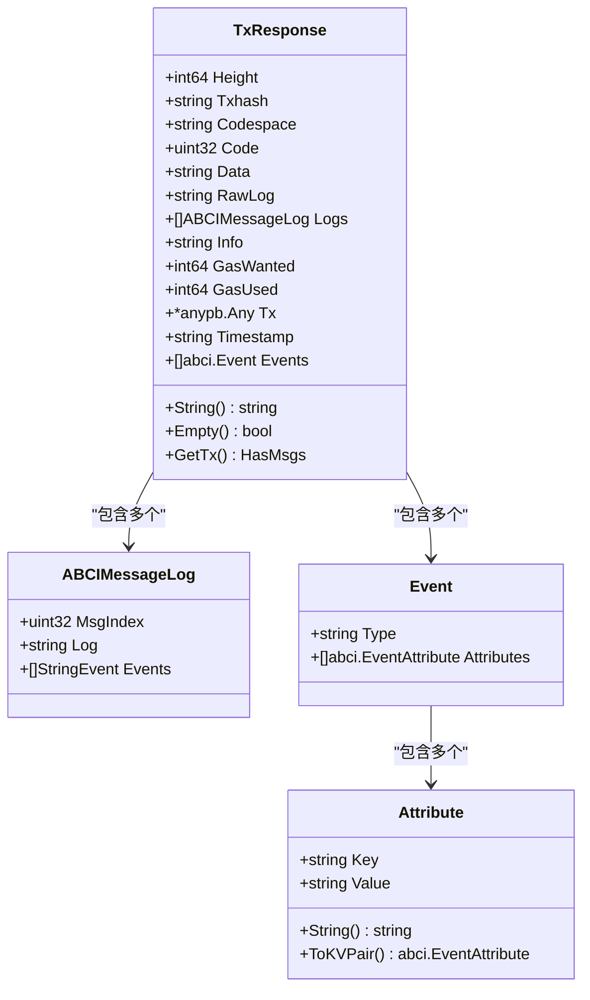

**图表来源**
- [api/cosmos/base/abci/v1beta1/abci.pulsar.go](file://api/cosmos/base/abci/v1beta1/abci.pulsar.go#L7283-L7320)
- [types/events.go](file://types/events.go#L158-L166)

### 关键字段详解

| 字段名 | 类型 | 描述 | 用途 |
|--------|------|------|------|
| `Code` | `uint32` | 交易执行状态码 | 0表示成功，非0表示失败 |
| `GasUsed` | `int64` | 实际消耗的Gas量 | 用于计算交易费用 |
| `Events` | `[]abci.Event` | 产生的事件列表 | 提供交易执行的详细信息 |
| `RawLog` | `string` | 原始日志信息 | 包含详细的错误或执行信息 |
| `Logs` | `[]ABCIMessageLog` | 消息级别的日志 | 每个消息的独立日志记录 |

**章节来源**
- [api/cosmos/base/abci/v1beta1/abci.pulsar.go](file://api/cosmos/base/abci/v1beta1/abci.pulsar.go#L7283-L7320)

## 交易响应处理

### 响应生成流程

交易响应的生成遵循严格的流程，确保每个交易都有完整的执行记录：

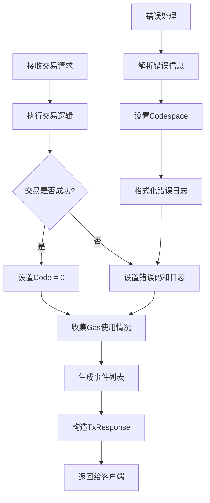

**图表来源**
- [types/result.go](file://types/result.go#L60-L82)
- [types/result.go](file://types/result.go#L104-L119)

### 响应转换函数

SDK提供了多种响应转换函数来处理不同场景下的交易响应：

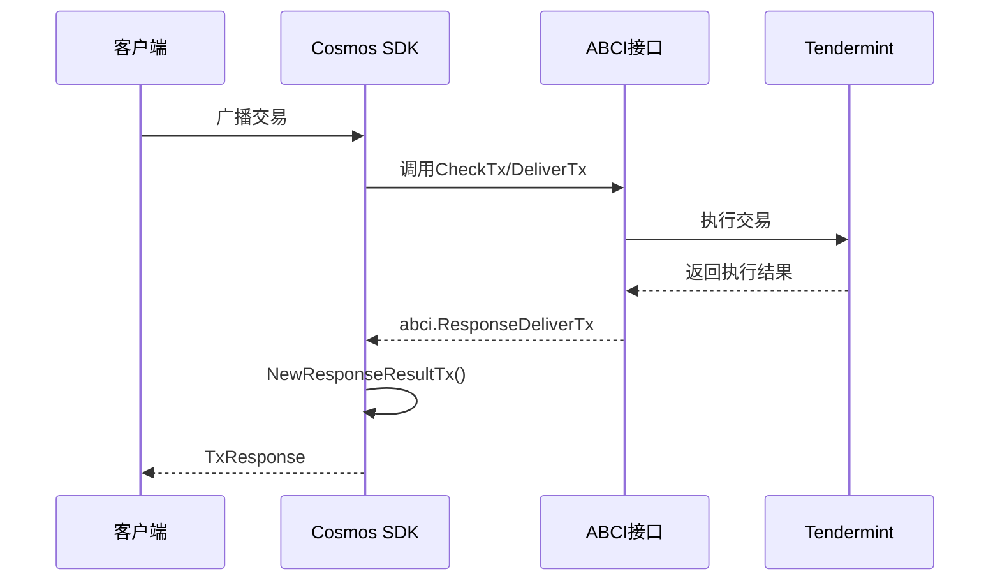

**图表来源**
- [types/result.go](file://types/result.go#L60-L82)
- [client/rpc/tx.go](file://client/rpc/tx.go#L26-L50)

**章节来源**
- [types/result.go](file://types/result.go#L60-L120)
- [client/rpc/tx.go](file://client/rpc/tx.go#L26-L90)

## 事件系统架构

### 事件管理器

事件系统通过`EventManager`实现，提供了灵活的事件生成和管理机制：

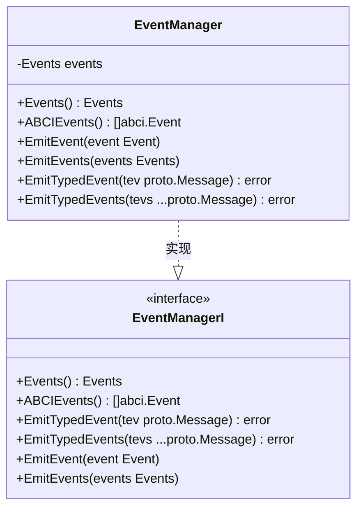

**图表来源**
- [types/events.go](file://types/events.go#L38-L58)

### 事件类型与属性

SDK定义了标准的事件类型和属性键，便于统一处理：

| 事件类型 | 描述 | 常用属性 |
|----------|------|----------|
| `tx` | 交易级别事件 | `acc_seq`, `signature`, `fee`, `fee_payer` |
| `message` | 消息级别事件 | `action`, `module`, `sender`, `amount` |
| `transfer` | 转账事件 | `recipient`, `sender`, `amount` |

**章节来源**
- [types/events.go](file://types/events.go#L252-L266)

## 事件属性与索引

### 属性结构

事件属性是键值对形式的数据，支持高效的查询和过滤：

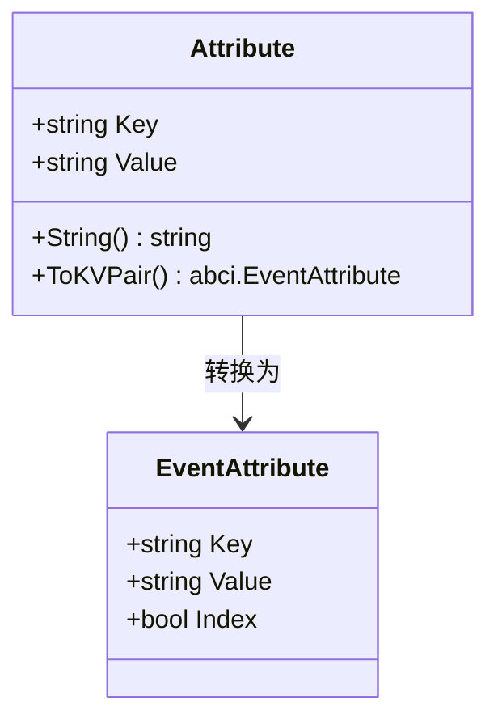

**图表来源**
- [types/events.go](file://types/events.go#L179-L196)

### 索引策略

事件属性可以配置索引标志，影响查询性能和能力：

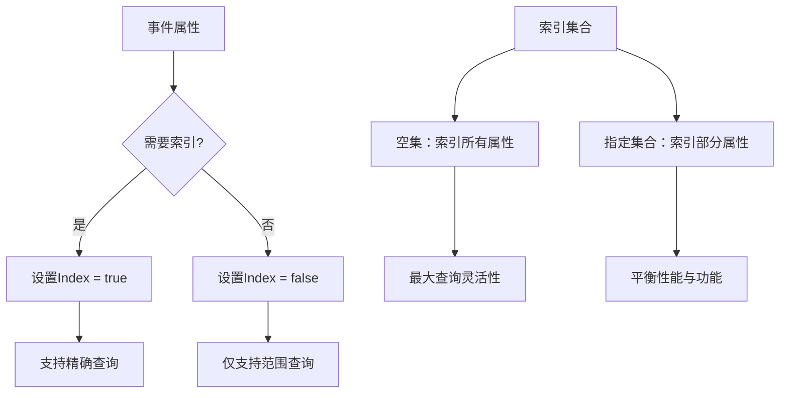

**图表来源**
- [types/events.go](file://types/events.go#L313-L340)

**章节来源**
- [types/events.go](file://types/events.go#L179-L249)

## 错误诊断与调试

### 错误码系统

SDK使用分层的错误码系统来精确定位问题：

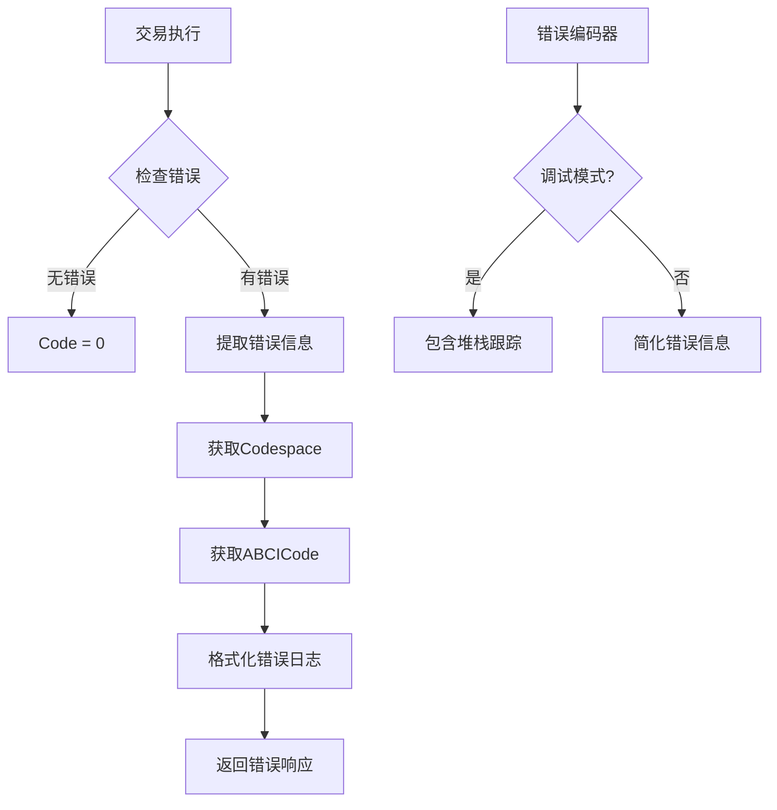

**图表来源**
- [errors/abci.go](file://errors/abci.go#L27-L37)

### 常见错误类型

| 错误码 | 错误名称 | 描述 | 解决方案 |
|--------|----------|------|----------|
| 5 | `ErrInsufficientFunds` | 余额不足 | 检查账户余额，补充资金 |
| 13 | `ErrInsufficientFee` | 手续费不足 | 增加手续费或调整Gas限制 |
| 11 | `ErrOutOfGas` | Gas不足 | 增加Gas限制或优化交易 |
| 4 | `ErrUnauthorized` | 权限不足 | 检查签名和权限设置 |

### 日志解析

`RawLog`字段包含了详细的错误信息，可以通过以下方式解析：

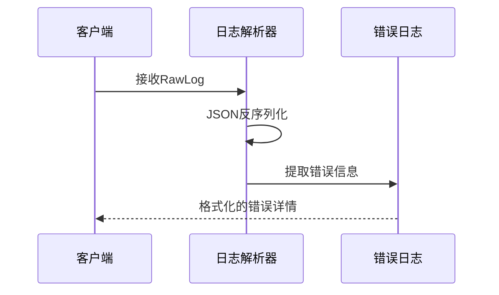

**图表来源**
- [types/result.go](file://types/result.go#L158-L162)

**章节来源**
- [errors/abci.go](file://errors/abci.go#L27-L113)
- [types/result.go](file://types/result.go#L158-L162)

## 事件监听与查询

### WebSocket订阅

SDK提供了强大的WebSocket事件监听功能：

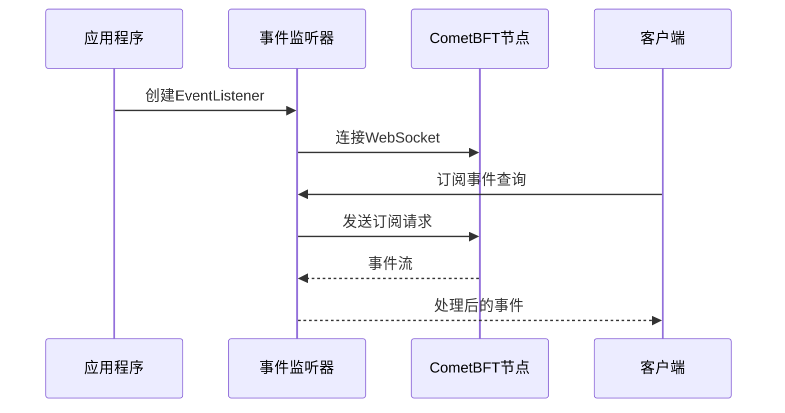

**图表来源**
- [systemtests/system.go](file://systemtests/system.go#L838-L880)

### 查询语法

事件查询支持复杂的过滤条件：

| 查询类型 | 语法示例 | 描述 |
|----------|----------|------|
| 交易哈希 | `tx.hash='ABC123...'` | 按交易哈希过滤 |
| 事件类型 | `transfer.amount>100` | 按事件属性过滤 |
| 组合查询 | `tx.height>=100 AND transfer.amount>100` | 多条件组合 |

### 实时监听示例

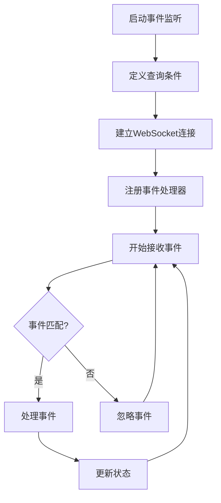

**图表来源**
- [systemtests/system.go](file://systemtests/system.go#L878-L917)

**章节来源**
- [systemtests/system.go](file://systemtests/system.go#L838-L963)
- [client/rpc/tx.go](file://client/rpc/tx.go#L97-L200)

## 实际应用示例

### 交易监控应用

构建一个完整的交易监控应用需要以下组件：

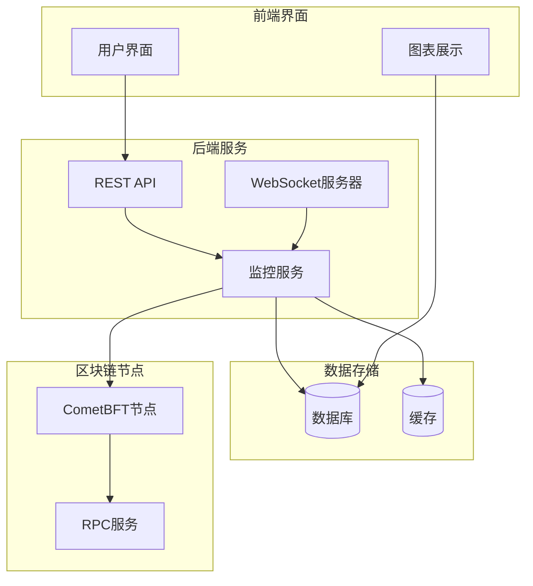

### 状态同步应用

状态同步应用需要实时跟踪链上状态变化：

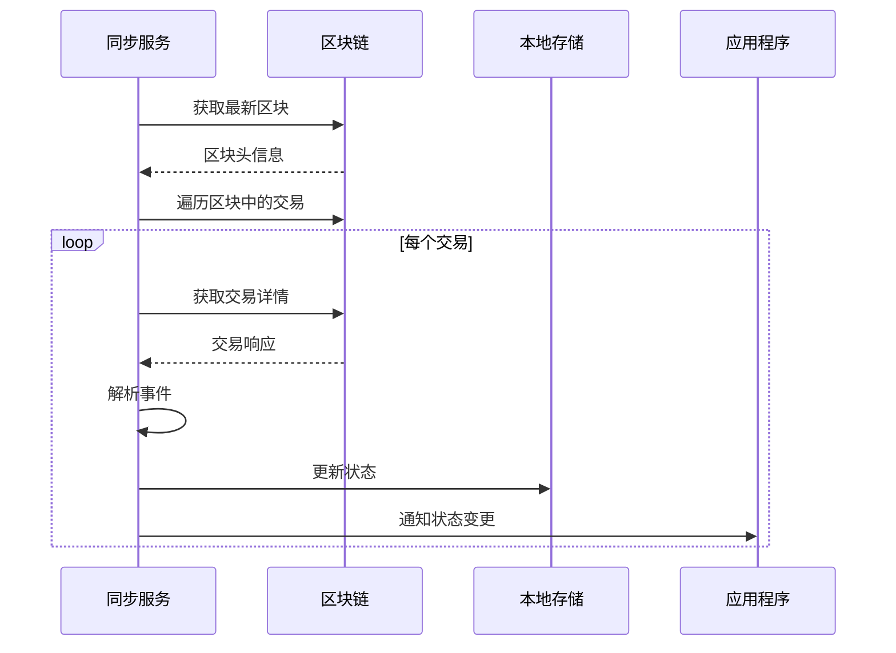

### 事件过滤器

实现高效的事件过滤器：

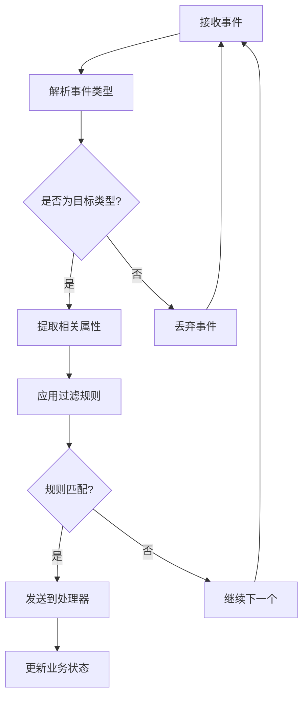

**章节来源**
- [systemtests/system.go](file://systemtests/system.go#L913-L963)

## 最佳实践

### 性能优化

1. **合理使用索引**：只对频繁查询的属性启用索引
2. **批量处理**：合并多个小事件为批量事件
3. **缓存策略**：缓存热点查询结果
4. **异步处理**：使用异步方式处理非关键事件

### 错误处理

1. **分级处理**：区分可恢复和不可恢复的错误
2. **重试机制**：为临时性错误实现指数退避重试
3. **监控告警**：建立完善的错误监控体系
4. **日志记录**：保持详细的错误日志以便调试

### 安全考虑

1. **输入验证**：严格验证所有输入参数
2. **权限控制**：实施细粒度的访问控制
3. **审计追踪**：记录所有关键操作
4. **异常隔离**：防止单点故障影响整个系统

## 故障排除指南

### 常见问题诊断

| 问题症状 | 可能原因 | 解决方案 |
|----------|----------|----------|
| 交易被拒绝 | Gas不足或权限问题 | 检查Gas设置和账户权限 |
| 事件丢失 | 索引配置错误 | 验证事件索引设置 |
| 查询超时 | 数据库负载过高 | 优化查询或增加缓存 |
| 内存泄漏 | 事件监听未正确关闭 | 确保资源正确释放 |

### 调试工具

1. **日志分析**：使用结构化日志记录关键路径
2. **性能监控**：监控CPU、内存和网络使用情况
3. **链上调试**：直接查询区块链状态验证
4. **单元测试**：编写全面的单元测试覆盖各种场景

### 监控指标

关键监控指标包括：
- 交易成功率
- 平均响应时间
- 事件处理延迟
- 错误率分布
- 资源使用情况

通过深入理解Cosmos SDK的交易响应和事件处理机制，开发者可以构建更加健壮、高效和可维护的去中心化应用。这些组件不仅提供了基础的功能支持，还为高级应用场景如实时监控、状态同步和复杂业务逻辑的实现奠定了坚实的基础。