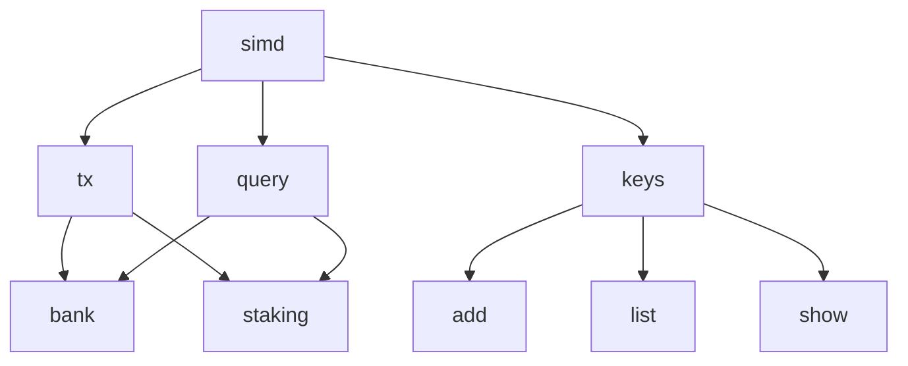
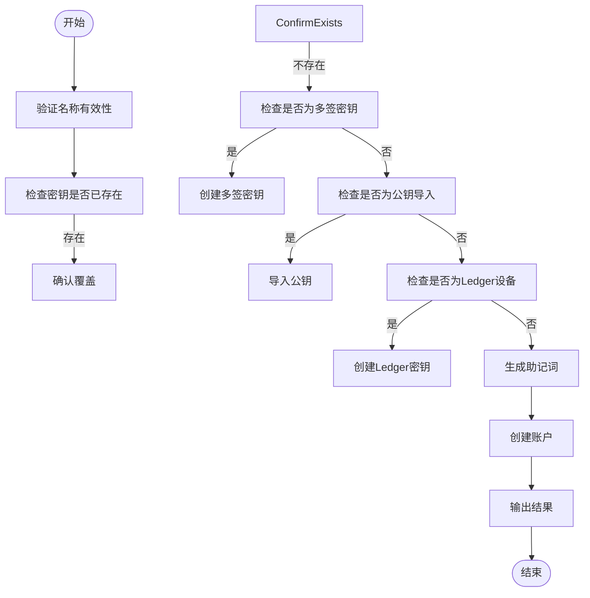
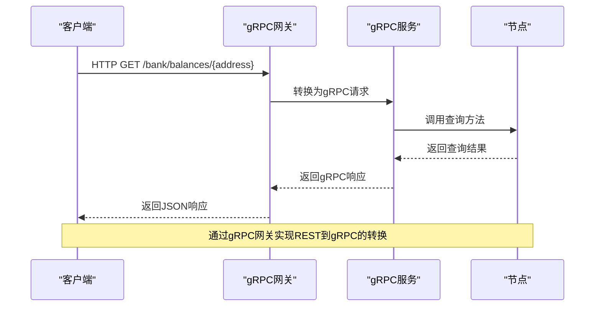
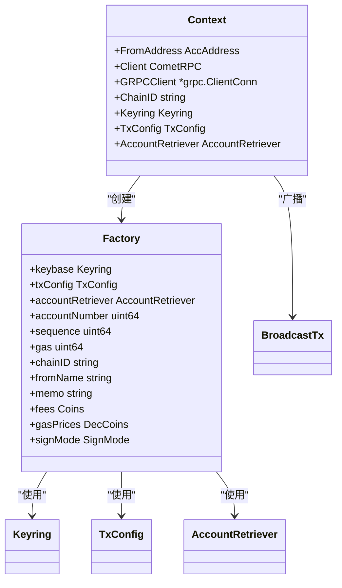
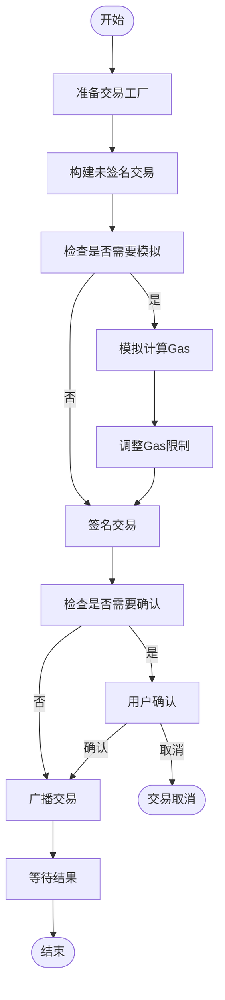

# 客户端工具

<cite>
**本文档中引用的文件**   
- [cmd.go](file://client/cmd.go)
- [context.go](file://client/context.go)
- [flags.go](file://client/flags/flags.go)
- [tx/factory.go](file://client/tx/factory.go)
- [tx/tx.go](file://client/tx/tx.go)
- [keys/root.go](file://client/keys/root.go)
- [keys/add.go](file://client/keys/add.go)
- [keys/list.go](file://client/keys/list.go)
- [keys/show.go](file://client/keys/show.go)
- [grpc_query.go](file://client/grpc_query.go)
- [broadcast.go](file://client/broadcast.go)
- [query.go](file://client/query.go)
- [simapp/simd/cmd/root.go](file://simapp/simd/cmd/root.go)
</cite>

## 目录
1. [简介](#简介)
2. [CLI命令行工具](#cli命令行工具)
3. [密钥管理](#密钥管理)
4. [gRPC和REST客户端](#grpc和rest客户端)
5. [交易构建与广播](#交易构建与广播)
6. [开发者集成指南](#开发者集成指南)

## 简介
Cosmos SDK提供了全面的客户端工具集，使用户和开发者能够与区块链节点进行交互。这些工具包括命令行界面(CLI)、gRPC客户端和REST客户端，支持密钥管理、查询和交易广播等功能。本文档详细介绍了这些客户端工具的使用方法和内部实现机制。

## CLI命令行工具
Cosmos SDK的CLI工具基于Cobra库构建，提供了一套完整的命令来与区块链网络交互。核心命令结构遵循`simd tx bank send`这样的模式，其中`simd`是应用程序名称，`tx`表示交易操作，`bank`是模块名称，`send`是具体命令。

CLI工具通过`Context`结构管理客户端状态，包括节点连接、密钥环、输出格式等配置。命令执行前会通过`SetCmdClientContextHandler`函数读取持久性标志并设置上下文。



**Diagram sources**
- [simapp/simd/cmd/root.go](file://simapp/simd/cmd/root.go#L28-L114)
- [client/cmd.go](file://client/cmd.go#L10-L376)

**Section sources**
- [client/cmd.go](file://client/cmd.go#L1-L376)
- [simapp/simd/cmd/root.go](file://simapp/simd/cmd/root.go#L1-L114)

## 密钥管理
密钥管理功能通过`keys`命令提供，支持创建、导入、列出和删除密钥对。密钥环支持多种后端存储，包括操作系统默认凭据存储、加密文件存储等。

### 创建密钥
使用`keys add`命令创建新的密钥对。该命令支持多种签名算法，并可以通过BIP39助记词恢复现有密钥。



**Diagram sources**
- [client/keys/add.go](file://client/keys/add.go#L48-L436)

**Section sources**
- [client/keys/root.go](file://client/keys/root.go#L1-L59)
- [client/keys/add.go](file://client/keys/add.go#L1-L436)

### 密钥操作命令
| 命令 | 描述 | 示例 |
|------|------|------|
| `keys add` | 创建或恢复密钥 | `simd keys add mykey` |
| `keys list` | 列出所有密钥 | `simd keys list` |
| `keys show` | 显示密钥信息 | `simd keys show mykey` |
| `keys delete` | 删除密钥 | `simd keys delete mykey` |
| `keys import` | 从文件导入密钥 | `simd keys import mykey keyfile` |

**Section sources**
- [client/keys/list.go](file://client/keys/list.go#L1-L72)
- [client/keys/show.go](file://client/keys/show.go#L1-L229)

## gRPC和REST客户端
Cosmos SDK支持通过gRPC和REST接口与节点交互。gRPC客户端提供高性能的二进制通信，而REST客户端提供易于使用的HTTP接口。

### gRPC客户端
gRPC客户端通过`Context`结构中的`GRPCClient`字段实现。当`GRPCClient`不为空时，查询请求会直接通过gRPC发送到节点。

```go
// Invoke方法实现gRPC调用
func (ctx Context) Invoke(grpcCtx context.Context, method string, req, reply any, opts ...grpc.CallOption) error {
    if ctx.GRPCClient != nil {
        return ctx.GRPCClient.Invoke(grpcCtx, method, req, reply, opts...)
    }
    // 回退到ABCI查询
    ...
}
```

### REST客户端
REST客户端通过gRPC网关实现，将HTTP请求转换为gRPC调用。系统测试中包含了REST查询的测试用例。



**Diagram sources**
- [client/grpc_query.go](file://client/grpc_query.go#L1-L143)
- [server/grpc/server.go](file://server/grpc/server.go#L75-L107)

**Section sources**
- [client/grpc_query.go](file://client/grpc_query.go#L1-L143)
- [systemtests/rest_support.go](file://systemtests/rest_support.go#L1-L49)

## 交易构建与广播
交易构建和广播流程通过交易工厂模式实现，该模式在`tx/factory.go`文件中定义。工厂模式封装了交易构建的复杂性，提供了一致的API。

### 交易工厂
`Factory`结构体包含构建交易所需的所有参数，包括密钥环、交易配置、账户信息等。通过一系列`With`方法可以链式配置工厂。



**Diagram sources**
- [client/tx/factory.go](file://client/tx/factory.go#L1-L550)

**Section sources**
- [client/tx/factory.go](file://client/tx/factory.go#L1-L550)
- [client/tx/tx.go](file://client/tx/tx.go#L1-L432)

### 交易流程
1. **准备**: 通过`Prepare`方法确保账户存在并获取账户序列号
2. **构建**: 使用`BuildUnsignedTx`创建未签名交易
3. **签名**: 调用`Sign`方法对交易进行签名
4. **广播**: 通过`BroadcastTx`将交易发送到网络



**Diagram sources**
- [client/tx/tx.go](file://client/tx/tx.go#L26-L145)

**Section sources**
- [client/tx/tx.go](file://client/tx/tx.go#L1-L432)
- [client/broadcast.go](file://client/broadcast.go#L1-L148)

## 开发者集成指南
开发者可以通过以下方式在自己的应用程序中集成Cosmos SDK客户端工具：

1. **创建客户端上下文**: 初始化`client.Context`结构体
2. **配置交易工厂**: 使用`NewFactoryCLI`创建交易工厂
3. **执行查询**: 通过`Context.Query`或gRPC客户端进行状态查询
4. **构建和广播交易**: 使用交易工厂模式处理交易

```go
// 示例：集成客户端工具
clientCtx := client.Context{
    ChainID: "mychain",
    Keyring: keyring,
    TxConfig: txConfig,
    AccountRetriever: accountRetriever,
}

// 创建交易工厂
factory, err := tx.NewFactoryCLI(clientCtx, flagSet)
if err != nil {
    return err
}

// 构建和广播交易
err = tx.GenerateOrBroadcastTxWithFactory(clientCtx, factory, msgs...)
```

**Section sources**
- [client/context.go](file://client/context.go#L1-L455)
- [client/tx/tx.go](file://client/tx/tx.go#L26-L67)