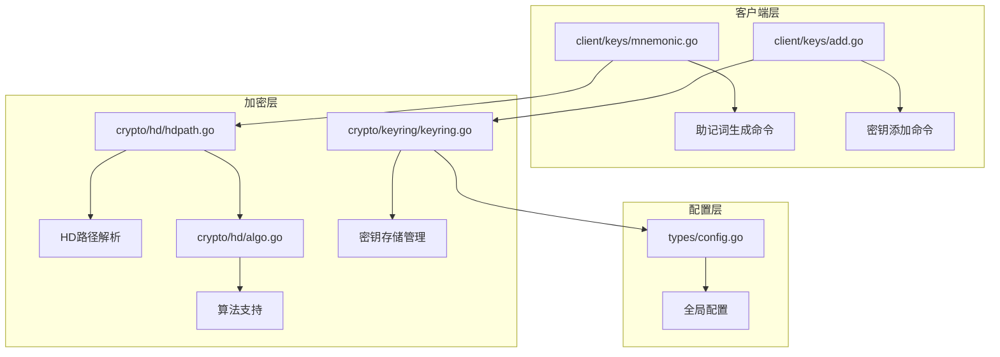
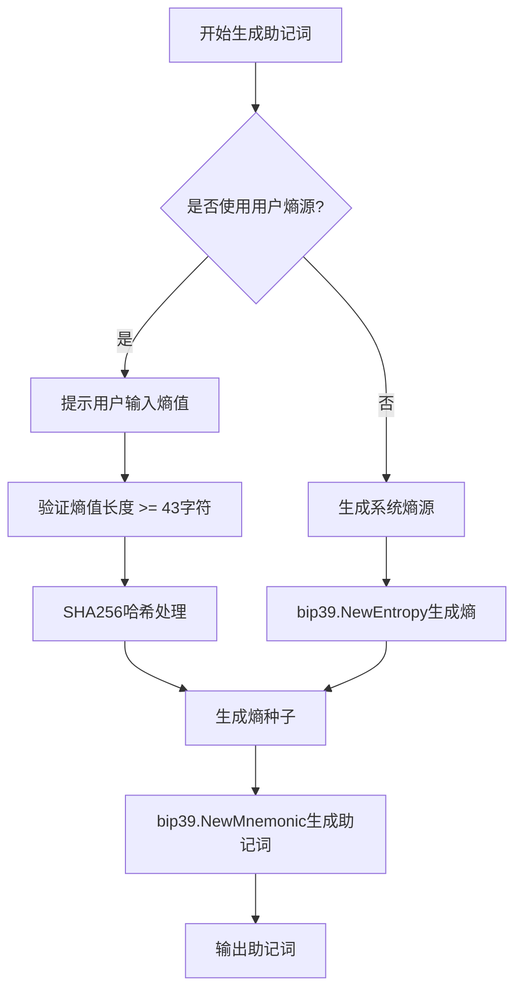
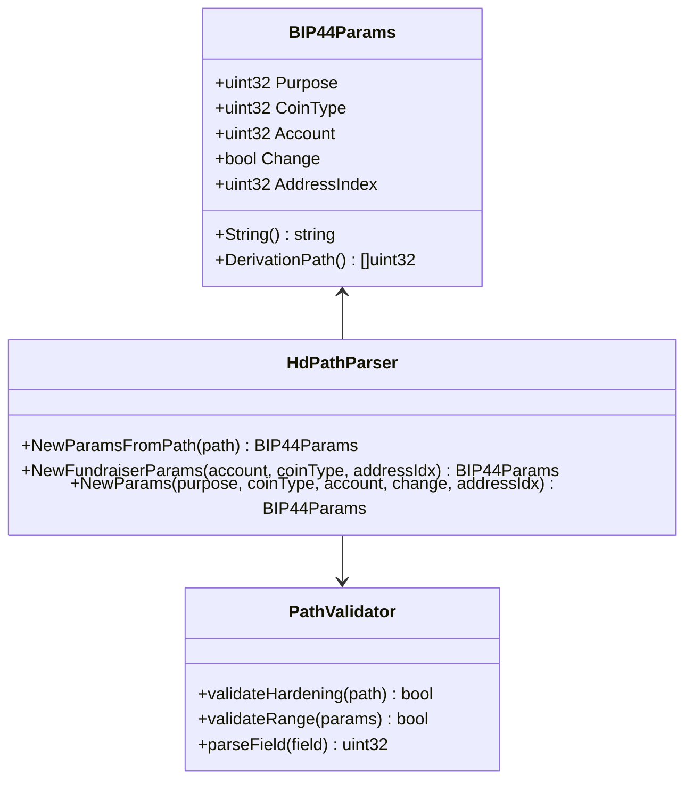
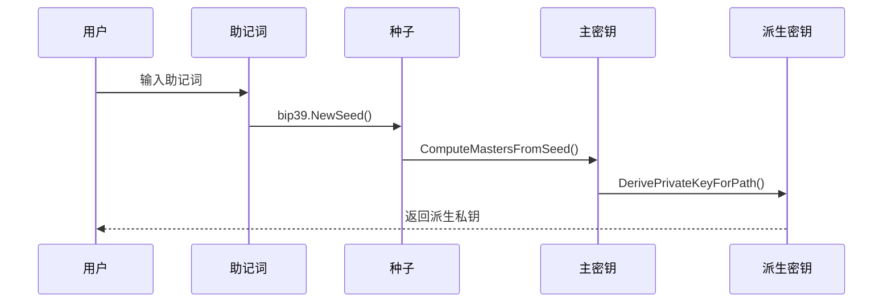
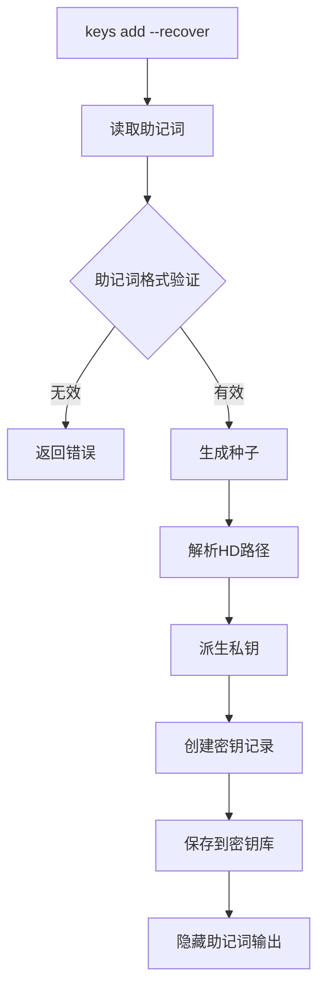

# 助记词生成与恢复

<cite>
**本文档引用的文件**
- [mnemonic.go](file://client/keys/mnemonic.go)
- [add.go](file://client/keys/add.go)
- [hdpath.go](file://crypto/hd/hdpath.go)
- [algo.go](file://crypto/hd/algo.go)
- [keyring.go](file://crypto/keyring/keyring.go)
- [config.go](file://types/config.go)
- [doc.go](file://crypto/hd/doc.go)
</cite>

## 目录
1. [简介](#简介)
2. [项目结构概览](#项目结构概览)
3. [BIP39助记词生成流程](#bip39助记词生成流程)
4. [HD路径解析与应用](#hd路径解析与应用)
5. [密钥派生实现逻辑](#密钥派生实现逻辑)
6. [用户恢复操作](#用户恢复操作)
7. [安全性建议](#安全性建议)
8. [故障排除指南](#故障排除指南)
9. [总结](#总结)

## 简介

Cosmos SDK提供了完整的助记词生成与恢复功能，基于BIP39标准实现安全的钱包密钥管理。该系统支持多种加密算法（secp256k1、ed25519），并通过BIP44路径规范确保跨平台兼容性。本文档详细说明了助记词生成、HD路径处理、密钥派生以及安全恢复的完整流程。

## 项目结构概览

助记词相关功能主要分布在以下模块中：

**图表来源**
- [mnemonic.go](file://client/keys/mnemonic.go#L1-L79)
- [add.go](file://client/keys/add.go#L1-L436)
- [hdpath.go](file://crypto/hd/hdpath.go#L1-L282)
- [algo.go](file://crypto/hd/algo.go#L1-L72)

## BIP39助记词生成流程

### 熵源生成

BIP39标准要求从安全的随机源生成熵值，熵长度为256位（32字节）。系统提供两种熵源生成方式：

1. **系统熵源**：使用加密安全的随机数生成器
2. **用户自定义熵源**：允许用户输入自定义熵值

**图表来源**
- [mnemonic.go](file://client/keys/mnemonic.go#L26-L78)

### 单词映射与校验和

助记词生成过程包含以下关键步骤：

1. **熵到助记词转换**：将256位熵映射为24个单词
2. **校验和计算**：添加1/32的校验和位
3. **单词表验证**：确保所有单词都在有效范围内

**章节来源**
- [mnemonic.go](file://client/keys/mnemonic.go#L57-L66)

## HD路径解析与应用

### BIP44路径格式

HD路径遵循BIP44标准格式：`m/purpose'/coin_type'/account'/change/address_index`

**图表来源**
- [hdpath.go](file://crypto/hd/hdpath.go#L16-L101)

### 路径解析规则

系统严格验证HD路径格式：

| 字段位置 | 格式要求 | 验证规则 |
|---------|---------|---------|
| 第1字段 | 必须为"44'" | 固定用途标识符 |
| 第2字段 | 必须硬化 | coin_type' |
| 第3字段 | 必须硬化 | account' |
| 第4字段 | 必须非硬化 | change（0或1） |
| 第5字段 | 必须非硬化 | address_index |

### 不同算法的路径规范

| 算法类型 | 默认路径格式 | 用途说明 |
|---------|-------------|---------|
| secp256k1 | m/44'/118'/account'/0/index | Cosmos生态系统默认 |
| ed25519 | m/44'/118'/account'/0/index | Tendermint核心算法 |
| bls12_381 | m/44'/118'/account'/0/index | 零知识证明场景 |

**章节来源**
- [hdpath.go](file://crypto/hd/hdpath.go#L76-L94)
- [algo.go](file://crypto/hd/algo.go#L13-L24)

## 密钥派生实现逻辑

### 主密钥生成

密钥派生从BIP39种子开始，通过HKDF-SHA512函数生成主私钥和链码：

**图表来源**
- [hdpath.go](file://crypto/hd/hdpath.go#L158-L212)

### 分层派生过程

密钥派生采用分层结构，支持无限深度的子密钥生成：

1. **主密钥派生**：从种子生成主私钥和链码
2. **硬化派生**：使用私钥进行派生，可从父密钥推导出子密钥
3. **非硬化派生**：使用公钥进行派生，可从父公钥推导出子公钥

### 硬化与非硬化密钥

| 派生类型 | 安全级别 | 使用场景 | 可逆性 |
|---------|---------|---------|-------|
| 硬化派生 | 高 | 子账户创建 | 不可从公钥推导 |
| 非硬化派生 | 中 | 地址生成 | 可从公钥推导 |

**章节来源**
- [hdpath.go](file://crypto/hd/hdpath.go#L166-L212)

## 用户恢复操作

### `keys add --recover`命令流程

用户可以通过助记词恢复已有账户：

**图表来源**
- [add.go](file://client/keys/add.go#L296-L413)

### 恢复过程的关键步骤

1. **助记词验证**：检查助记词的有效性
2. **种子生成**：使用BIP39标准生成种子
3. **路径解析**：解析或使用默认HD路径
4. **密钥派生**：根据路径派生私钥
5. **密钥存储**：保存到本地密钥库

### 文件导入支持

系统支持从文件导入助记词：
- 支持指定助记词文件路径
- 自动读取文件内容
- 验证文件格式和内容

**章节来源**
- [add.go](file://client/keys/add.go#L302-L312)
- [add.go](file://client/keys/add.go#L423-L435)

## 安全性建议

### 助记词保护原则

1. **物理安全**：将助记词写在安全的地方
2. **环境隔离**：在无网络环境下生成助记词
3. **备份策略**：准备多个备份副本
4. **访问控制**：限制助记词的访问权限

### 明文存储风险

避免以下危险行为：
- 将助记词保存在文本文件中
- 在聊天软件中传输助记词
- 将助记词上传到云存储
- 在公共电脑上生成助记词

### 硬件钱包推荐

对于高价值资产，强烈建议使用硬件钱包：

| 硬件钱包类型 | 安全特性 | 适用场景 |
|-------------|---------|---------|
| Ledger Nano X | 离线签名 | 日常交易 |
| Trezor Model T | 生物识别 | 企业级应用 |
| Coldcard | 多重签名 | 储备金管理 |

### 最佳实践清单

- ✅ 生成助记词时断开网络连接
- ✅ 使用强密码保护密钥库
- ✅ 定期备份助记词和密钥
- ✅ 测试恢复流程的有效性
- ❌ 不要在公共场合讨论助记词
- ❌ 不要将助记词发送给任何人

**章节来源**
- [add.go](file://client/keys/add.go#L378-L379)

## 故障排除指南

### 常见错误及解决方案

| 错误类型 | 症状描述 | 解决方案 |
|---------|---------|---------|
| 助记词无效 | "invalid mnemonic" | 检查单词拼写和空格 |
| 路径格式错误 | "invalid HD path" | 验证路径格式符合BIP44规范 |
| 权限不足 | "permission denied" | 检查密钥库文件权限 |
| 网络连接问题 | "connection timeout" | 检查网络连接状态 |

### 恢复测试流程

1. **验证助记词**：确认助记词完整性
2. **测试路径**：使用相同路径重新派生
3. **地址对比**：验证派生地址一致性
4. **签名测试**：尝试对消息进行签名

### 数据迁移注意事项

当需要迁移密钥时：
- 确保新环境的安全性
- 验证目标平台的兼容性
- 备份原始数据以防万一
- 测试迁移后的功能

**章节来源**
- [keyring.go](file://crypto/keyring/keyring.go#L87-L95)

## 总结

Cosmos SDK的助记词生成与恢复功能提供了完整的去中心化密钥管理解决方案。通过遵循BIP39和BIP44标准，系统确保了跨平台兼容性和安全性。关键特性包括：

- **标准化流程**：完全符合BIP39和BIP44规范
- **多算法支持**：secp256k1、ed25519等多种算法
- **灵活配置**：支持自定义HD路径和参数
- **安全设计**：多层次的安全防护机制
- **用户友好**：直观的命令行界面

正确使用这些功能可以确保用户的数字资产安全，同时提供便捷的密钥管理体验。建议用户始终遵循安全最佳实践，定期备份重要数据，并考虑使用硬件钱包来增强安全性。