# 密钥存储后端

<cite>
**本文档中引用的文件**
- [keyring.go](file://crypto/keyring/keyring.go)
- [record.go](file://crypto/keyring/record.go)
- [types.go](file://crypto/keyring/types.go)
- [keyring_linux.go](file://crypto/keyring/keyring_linux.go)
- [keyring_other.go](file://crypto/keyring/keyring_other.go)
- [codec.go](file://crypto/keyring/codec.go)
- [errors.go](file://crypto/keyring/errors.go)
- [doc.go](file://crypto/keyring/doc.go)
</cite>

## 目录
1. [简介](#简介)
2. [项目结构](#项目结构)
3. [核心组件](#核心组件)
4. [架构概览](#架构概览)
5. [详细组件分析](#详细组件分析)
6. [依赖关系分析](#依赖关系分析)
7. [性能考虑](#性能考虑)
8. [故障排除指南](#故障排除指南)
9. [结论](#结论)

## 简介

Cosmos SDK 的密钥存储后端系统提供了一个统一的密钥管理接口，支持多种操作系统和环境下的安全密钥存储。该系统通过抽象层设计，实现了跨平台的密钥管理功能，同时保持了高度的安全性和灵活性。

密钥存储后端系统的核心目标是：
- 提供统一的密钥管理接口
- 支持多种存储后端（操作系统原生、文件系统、密码管理器等）
- 确保密钥的安全存储和访问控制
- 支持硬件钱包和离线签名
- 提供灵活的配置选项以适应不同的使用场景

## 项目结构

密钥存储后端系统的文件组织结构如下：

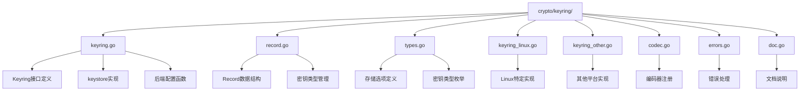

**图表来源**
- [keyring.go](file://crypto/keyring/keyring.go#L1-L50)
- [record.go](file://crypto/keyring/record.go#L1-L30)
- [types.go](file://crypto/keyring/types.go#L1-L20)

**章节来源**
- [keyring.go](file://crypto/keyring/keyring.go#L1-L100)
- [record.go](file://crypto/keyring/record.go#L1-L50)
- [types.go](file://crypto/keyring/types.go#L1-L72)

## 核心组件

### Keyring 接口

Keyring 接口是整个密钥存储系统的核心抽象，定义了所有密钥操作的标准方法：

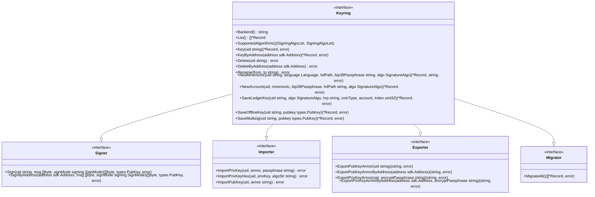

**图表来源**
- [keyring.go](file://crypto/keyring/keyring.go#L58-L138)

### Record 数据结构

Record 结构体封装了密钥的所有相关信息，支持多种密钥类型：

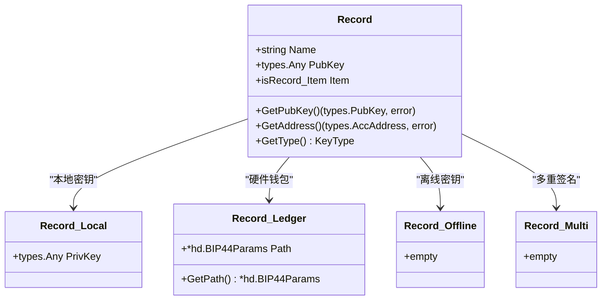

**图表来源**
- [record.go](file://crypto/keyring/record.go#L23-L68)

**章节来源**
- [keyring.go](file://crypto/keyring/keyring.go#L58-L138)
- [record.go](file://crypto/keyring/record.go#L23-L141)

## 架构概览

密钥存储后端系统采用分层架构设计，提供了清晰的抽象层次：

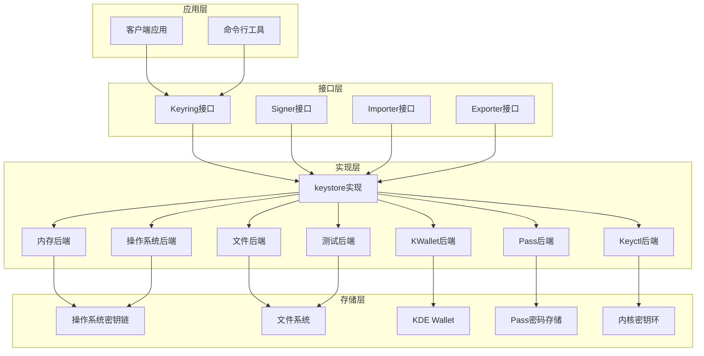

**图表来源**
- [keyring.go](file://crypto/keyring/keyring.go#L167-L200)
- [keyring_linux.go](file://crypto/keyring/keyring_linux.go#L61-L85)

## 详细组件分析

### 密钥环接口实现

#### keystore 结构体

keystore 是 Keyring 接口的主要实现，负责协调各种后端操作：

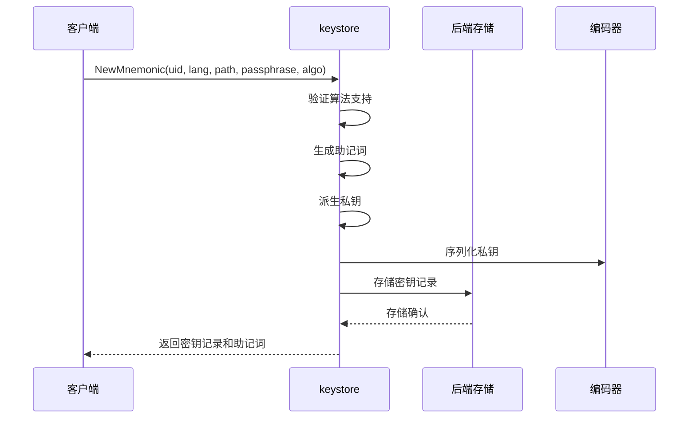

**图表来源**
- [keyring.go](file://crypto/keyring/keyring.go#L543-L573)

#### 后端配置系统

系统支持多种后端配置，每种都有其特定的安全特性和适用场景：

| 后端类型 | 描述 | 安全级别 | 便利性 | 平台支持 |
|---------|------|----------|--------|----------|
| `os` | 操作系统原生密钥链 | 高 | 中 | 跨平台 |
| `file` | 文件系统加密存储 | 中 | 高 | 跨平台 |
| `kwallet` | KDE Wallet管理器 | 高 | 中 | Linux |
| `pass` | Pass命令行工具 | 中 | 低 | 跨平台 |
| `keyctl` | Linux内核密钥环 | 高 | 中 | Linux |
| `test` | 测试用不安全存储 | 低 | 高 | 跨平台 |
| `memory` | 内存临时存储 | 中 | 高 | 跨平台 |

**章节来源**
- [keyring.go](file://crypto/keyring/keyring.go#L31-L39)
- [keyring_linux.go](file://crypto/keyring/keyring_linux.go#L18-L25)

### 密钥记录数据结构

#### Record 类型系统

Record 结构体支持四种主要的密钥类型：

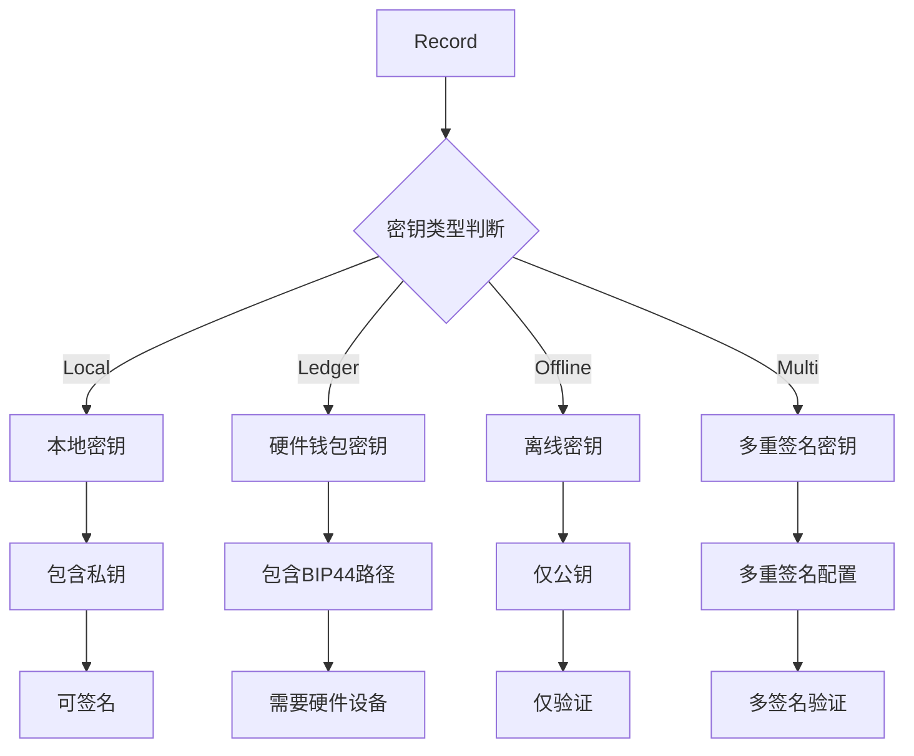

**图表来源**
- [record.go](file://crypto/keyring/record.go#L90-L102)

#### 密钥类型枚举

系统定义了明确的密钥类型标识：

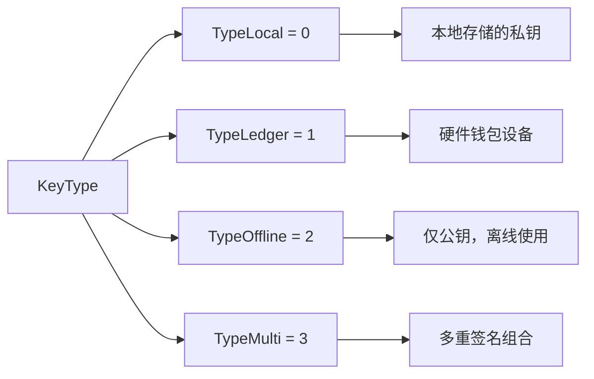

**图表来源**
- [types.go](file://crypto/keyring/types.go#L47-L58)

**章节来源**
- [record.go](file://crypto/keyring/record.go#L23-L141)
- [types.go](file://crypto/keyring/types.go#L43-L64)

### 签名算法支持

#### 支持的签名算法

系统默认支持 Secp256k1 算法，这是 Cosmos 生态系统中最常用的椭圆曲线算法：

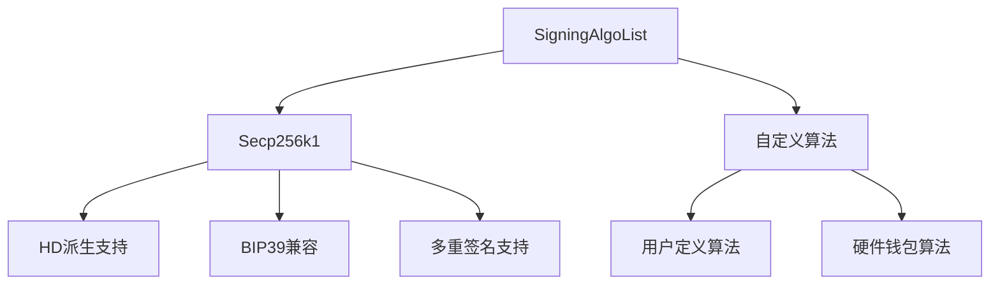

**图表来源**
- [keyring.go](file://crypto/keyring/keyring.go#L212-L215)

#### BIP44 路径支持

系统完全支持 BIP44 多账户层级标准：

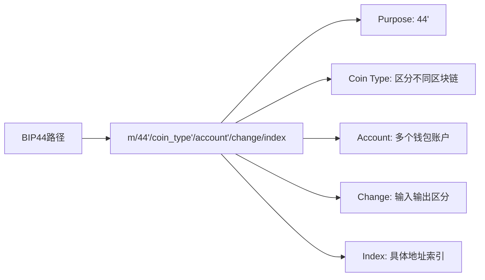

**图表来源**
- [keyring.go](file://crypto/keyring/keyring.go#L430-L432)

**章节来源**
- [keyring.go](file://crypto/keyring/keyring.go#L212-L215)
- [keyring.go](file://crypto/keyring/keyring.go#L430-L432)

### 错误处理机制

系统定义了全面的错误类型体系：

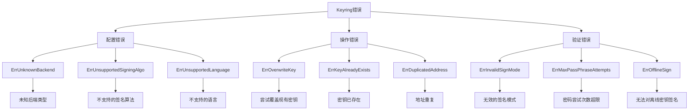

**图表来源**
- [errors.go](file://crypto/keyring/errors.go#L5-L38)

**章节来源**
- [errors.go](file://crypto/keyring/errors.go#L5-L39)

## 依赖关系分析

### 核心依赖关系

密钥存储后端系统的依赖关系图：

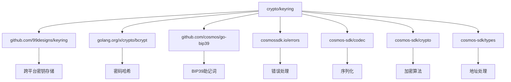

**图表来源**
- [keyring.go](file://crypto/keyring/keyring.go#L3-L28)

### 平台特定实现

不同平台的实现策略：

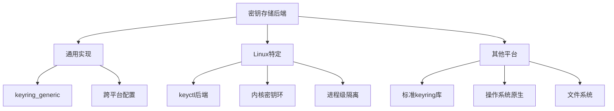

**图表来源**
- [keyring_linux.go](file://crypto/keyring/keyring_linux.go#L61-L85)
- [keyring_other.go](file://crypto/keyring/keyring_other.go#L30-L34)

**章节来源**
- [keyring.go](file://crypto/keyring/keyring.go#L3-L28)
- [keyring_linux.go](file://crypto/keyring/keyring_linux.go#L61-L85)

## 性能考虑

### 密钥访问性能

不同后端的性能特征：

| 后端类型 | 访问延迟 | 内存占用 | 并发支持 | 适用场景 |
|---------|----------|----------|----------|----------|
| Memory | 极低 | 低 | 高 | 测试、临时密钥 |
| Test | 极低 | 低 | 高 | 开发测试 |
| File | 中等 | 中等 | 中等 | 个人使用 |
| OS | 中等 | 中等 | 中等 | 生产环境 |
| Keyctl | 低 | 低 | 高 | Linux生产 |

### 加密强度与性能平衡

系统在安全性与性能之间进行了精心平衡：

- **密码哈希**: 使用 bcrypt 进行密码存储，成本因子为 2，提供良好的安全性和性能平衡
- **密钥派生**: 支持 BIP39 助记词派生，确保种子的安全性
- **传输加密**: 所有敏感数据都经过加密传输和存储

## 故障排除指南

### 常见问题及解决方案

#### 后端初始化失败

**问题**: 无法初始化特定后端
**原因**: 
- 权限不足
- 依赖软件未安装
- 配置错误

**解决方案**:
1. 检查文件权限和目录存在性
2. 确认依赖软件已正确安装
3. 验证配置参数的正确性

#### 密钥导入导出失败

**问题**: 密钥导入或导出过程中出现错误
**原因**:
- 密码错误
- 格式不匹配
- 权限问题

**解决方案**:
1. 确认密码的正确性
2. 检查密钥格式的兼容性
3. 验证文件系统的写入权限

#### 硬件钱包连接问题

**问题**: 无法连接到硬件钱包设备
**原因**:
- 设备未正确连接
- 驱动程序缺失
- 应用程序版本不兼容

**解决方案**:
1. 检查USB连接状态
2. 安装必要的驱动程序
3. 更新应用程序版本

**章节来源**
- [errors.go](file://crypto/keyring/errors.go#L5-L39)
- [keyring.go](file://crypto/keyring/keyring.go#L740-L787)

## 结论

Cosmos SDK 的密钥存储后端系统提供了一个强大而灵活的密钥管理解决方案。通过统一的接口设计和多样化的后端支持，系统能够满足从开发测试到生产部署的各种需求。

### 主要优势

1. **跨平台兼容性**: 统一的接口支持多种操作系统和环境
2. **安全性保障**: 多层次的安全措施确保密钥的机密性和完整性
3. **灵活性**: 可配置的后端选择适应不同的使用场景
4. **扩展性**: 清晰的接口设计便于添加新的后端支持

### 最佳实践建议

1. **生产环境**: 优先使用操作系统原生后端或文件后端
2. **开发测试**: 可以使用内存后端或测试后端
3. **硬件钱包**: 正确配置硬件钱包后端以获得最高安全性
4. **备份策略**: 建立完善的密钥备份和恢复机制

该系统的设计充分体现了 Cosmos SDK 对安全性和可用性的双重追求，为区块链应用的密钥管理奠定了坚实的基础。