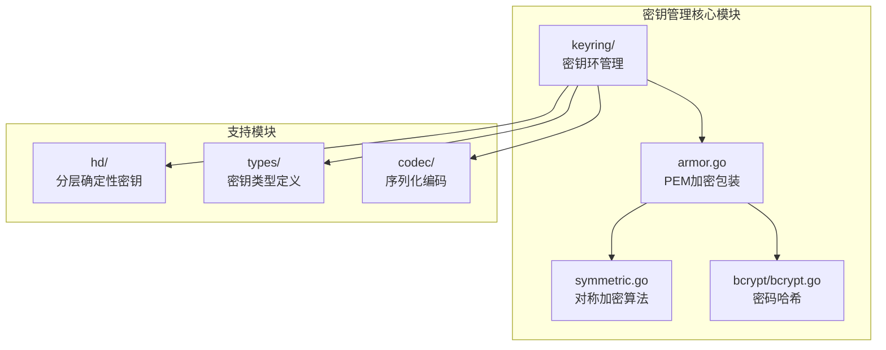
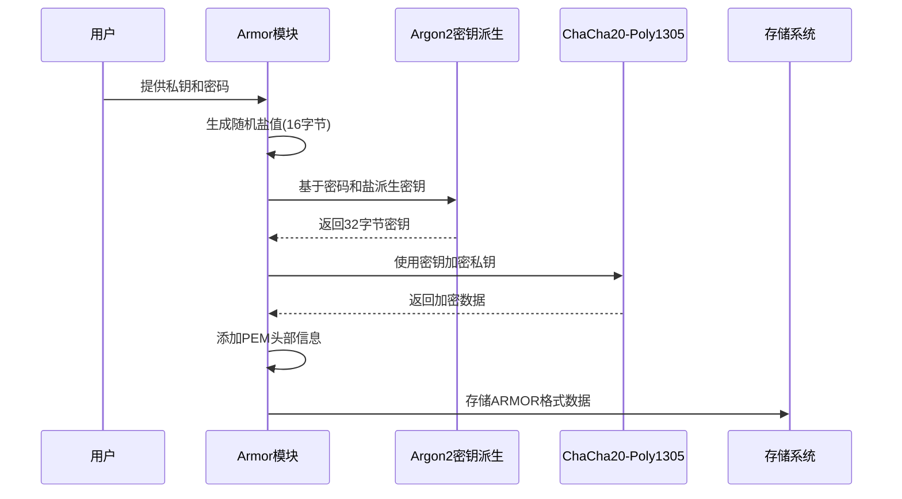
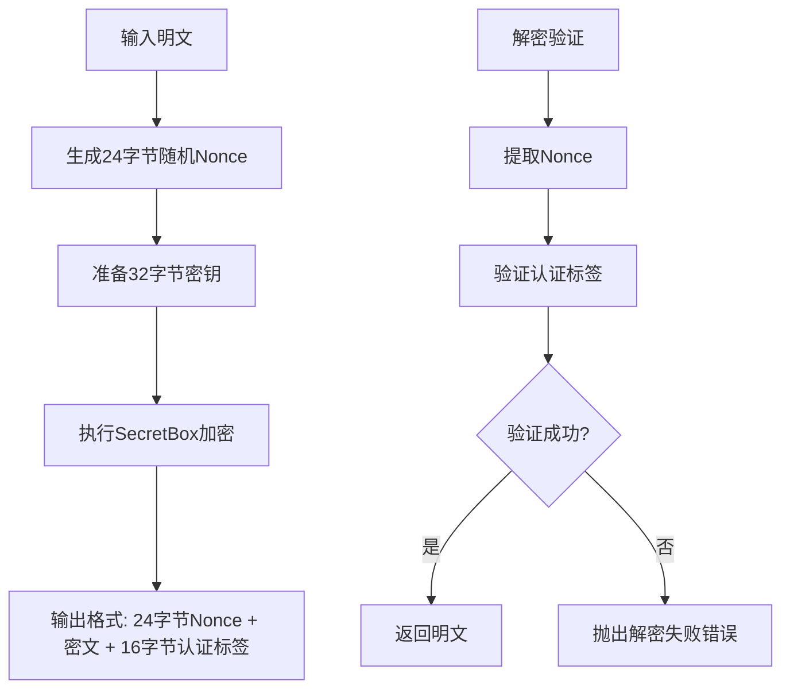
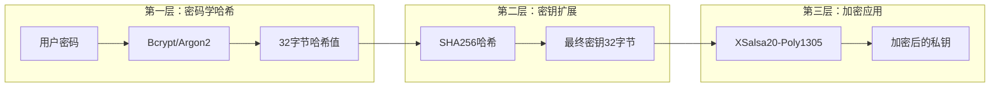
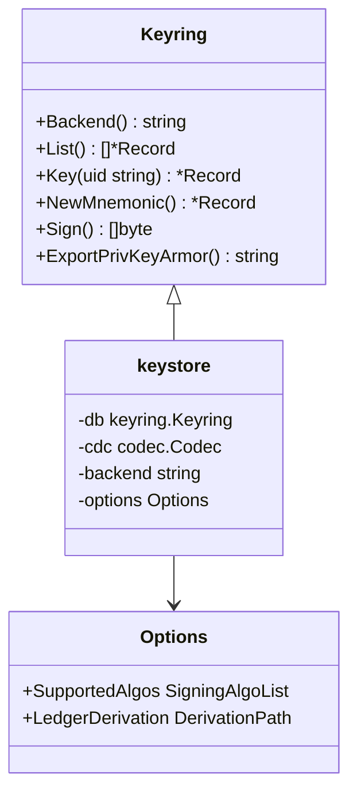
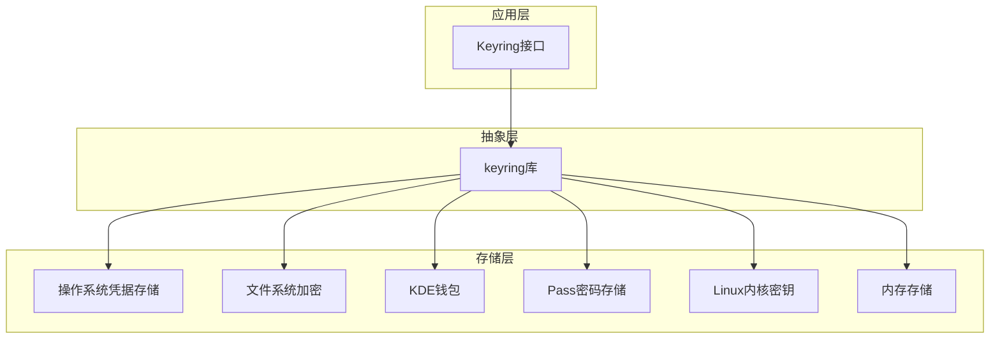
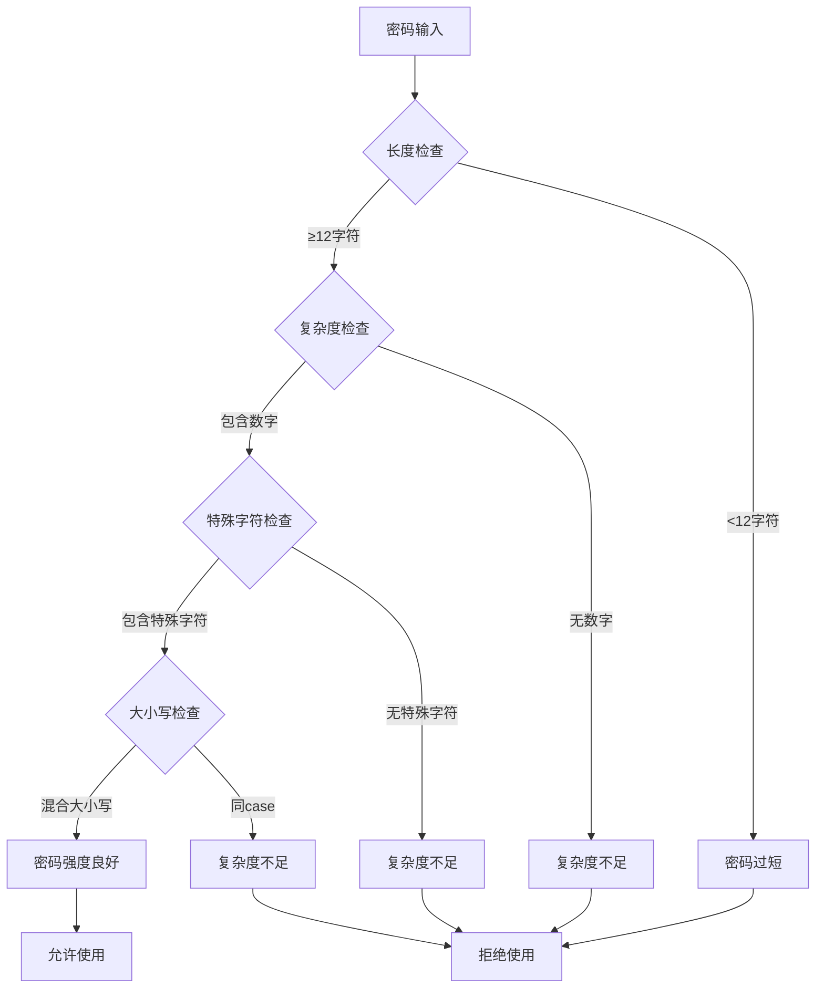
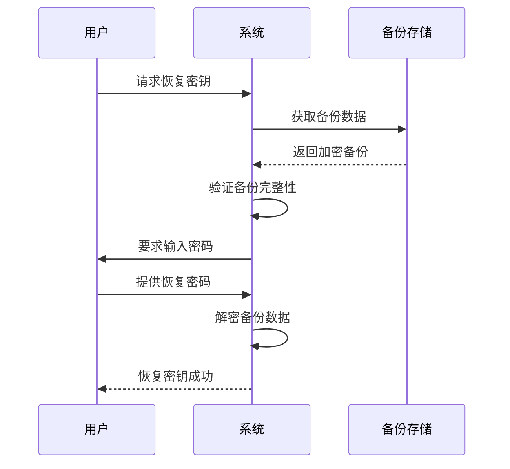
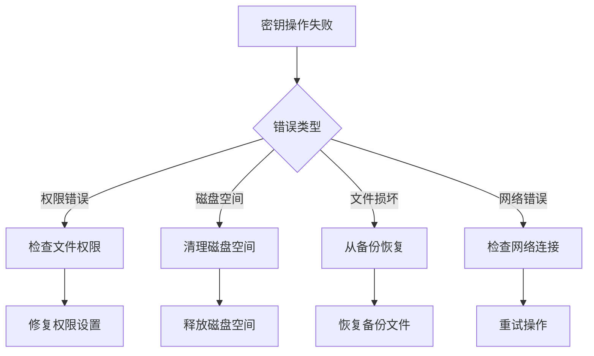

# 密钥安全管理最佳实践

<cite>
**本文档引用的文件**
- [armor.go](file://crypto/armor.go)
- [symmetric.go](file://crypto/xsalsa20symmetric/symmetric.go)
- [bcrypt.go](file://crypto/keys/bcrypt/bcrypt.go)
- [keyring.go](file://crypto/keyring/keyring.go)
- [doc.go](file://crypto/keyring/doc.go)
- [errors.go](file://crypto/keyring/errors.go)
- [keyring_linux.go](file://crypto/keyring/keyring_linux.go)
- [armor_test.go](file://crypto/armor_test.go)
- [bcrypt_readme.md](file://crypto/bcrypt_readme.md)
</cite>

## 目录
1. [简介](#简介)
2. [项目结构概览](#项目结构概览)
3. [PEM格式加密包装（Armor）实现](#pem格式加密包装armor实现)
4. [XSalsa20-Poly1305对称加密算法](#xsalsa20-poly1305对称加密算法)
5. [密钥派生机制](#密钥派生机制)
6. [密钥环架构设计](#密钥环架构设计)
7. [安全存储后端](#安全存储后端)
8. [密钥管理最佳实践](#密钥管理最佳实践)
9. [开发指南](#开发指南)
10. [故障排除](#故障排除)
11. [总结](#总结)

## 简介

Cosmos SDK 提供了一套完整的密钥安全管理解决方案，通过多层加密保护机制确保私钥的安全存储和传输。本文档深入分析了SDK中密钥管理的核心组件，包括PEM格式加密包装（Armor）、XSalsa20-Poly1305对称加密算法、密钥派生机制以及各种安全存储后端的实现原理和最佳实践。

## 项目结构概览

Cosmos SDK 的密钥管理系统采用模块化设计，主要组件分布在以下目录结构中：



**图表来源**
- [armor.go](file://crypto/armor.go#L1-L50)
- [symmetric.go](file://crypto/xsalsa20symmetric/symmetric.go#L1-L30)
- [keyring.go](file://crypto/keyring/keyring.go#L1-L100)

**章节来源**
- [armor.go](file://crypto/armor.go#L1-L290)
- [symmetric.go](file://crypto/xsalsa20symmetric/symmetric.go#L1-L72)
- [keyring.go](file://crypto/keyring/keyring.go#L1-L200)

## PEM格式加密包装（Armor）实现

### 核心设计理念

PEM（Privacy Enhanced Mail）格式加密包装是Cosmos SDK中用于保护私钥的重要机制。它结合了密码学哈希函数和对称加密算法，提供了双重保护层。

### 加密流程架构



**图表来源**
- [armor.go](file://crypto/armor.go#L162-L178)
- [armor.go](file://crypto/armor.go#L213-L256)

### 关键配置参数

| 参数 | 值 | 说明 |
|------|-----|------|
| Argon2时间参数 | 1 | 计算时间，单位为秒 |
| Argon2内存参数 | 64KB | 内存使用量 |
| Argon2线程数 | 4 | 并发线程数 |
| Salt长度 | 16字节 | 随机盐值长度 |
| 密钥长度 | 32字节 | ChaCha20密钥长度 |

### 支持的加密算法

Armor模块支持两种密钥派生函数：

1. **Argon2**: 当前推荐的算法，提供抗ASIC攻击能力
2. **Bcrypt**: 向后兼容的传统算法

**章节来源**
- [armor.go](file://crypto/armor.go#L41-L61)
- [armor.go](file://crypto/armor.go#L145-L211)

## XSalsa20-Poly1305对称加密算法

### 算法特性

XSalsa20-Poly1305是基于NaCl（Networking and Cryptography Library）的现代加密算法组合，提供认证加密功能。

### 加密过程详解



**图表来源**
- [symmetric.go](file://crypto/xsalsa20symmetric/symmetric.go#L20-L61)

### 安全参数配置

| 参数 | 数值 | 用途 |
|------|------|------|
| Nonce长度 | 24字节 | 随机性保证 |
| 密钥长度 | 32字节 | XSalsa20密钥 |
| 认证标签长度 | 16字节 | Poly1305认证 |
| 输出膨胀 | 40字节 | Nonce + Overhead |

**章节来源**
- [symmetric.go](file://crypto/xsalsa20symmetric/symmetric.go#L13-L19)
- [symmetric.go](file://crypto/xsalsa20symmetric/symmetric.go#L20-L61)

## 密钥派生机制

### 多层次密钥派生策略

Cosmos SDK 实现了多层次的密钥派生机制，确保即使密码泄露，也无法直接访问私钥。



**图表来源**
- [armor.go](file://crypto/armor.go#L235-L256)
- [bcrypt.go](file://crypto/keys/bcrypt/bcrypt.go#L85-L98)

### Bcrypt安全参数

| 安全参数 | 推荐值 | 性能影响 |
|----------|--------|----------|
| 成本参数 | 12 | 约0.25秒（中等硬件） |
| 最小成本 | 4 | 最低成本 |
| 最大成本 | 31 | 最高安全性 |
| 盐值长度 | 16字节 | 随机性保证 |

**章节来源**
- [bcrypt.go](file://crypto/keys/bcrypt/bcrypt.go#L21-L25)
- [bcrypt_readme.md](file://crypto/bcrypt_readme.md#L1-L9)

## 密钥环架构设计

### 密钥环接口设计

密钥环（Keyring）提供了统一的密钥管理接口，支持多种存储后端：



**图表来源**
- [keyring.go](file://crypto/keyring/keyring.go#L58-L150)
- [keyring.go](file://crypto/keyring/keyring.go#L200-L220)

### 核心功能模块

| 功能模块 | 描述 | 安全特性 |
|----------|------|----------|
| 新建助记词 | 生成新的BIP39助记词 | 分层确定性密钥派生 |
| 导入导出 | 支持ARMOR格式导入导出 | 加密保护 |
| 签名验证 | 数字签名功能 | 多算法支持 |
| 键重命名 | 安全的键管理 | 原子操作 |

**章节来源**
- [keyring.go](file://crypto/keyring/keyring.go#L79-L100)
- [keyring.go](file://crypto/keyring/keyring.go#L140-L150)

## 安全存储后端

### 后端类型对比

Cosmos SDK 支持多种安全存储后端，每种都有其特定的安全模型：

| 后端类型 | 安全级别 | 适用场景 | 特点 |
|----------|----------|----------|------|
| os | 高 | 生产环境 | 操作系统凭据管理器 |
| file | 中 | 开发测试 | 文件加密存储 |
| memory | 低 | 测试调试 | 内存临时存储 |
| kwallet | 中 | KDE桌面 | KDE钱包管理 |
| pass | 中 | 命令行工具 | Pass密码管理器 |
| keyctl | 高 | Linux内核 | 内核密钥管理 |

### 存储后端架构



**图表来源**
- [doc.go](file://crypto/keyring/doc.go#L24-L42)
- [keyring.go](file://crypto/keyring/keyring.go#L172-L200)

**章节来源**
- [doc.go](file://crypto/keyring/doc.go#L1-L43)
- [keyring.go](file://crypto/keyring/keyring.go#L31-L40)

## 密钥管理最佳实践

### 密码安全策略

#### 强密码要求
- **最小长度**: 12字符
- **复杂度**: 包含大小写字母、数字和特殊符号
- **唯一性**: 避免使用常见词汇和重复模式
- **定期更换**: 建议每90天更换一次

#### 密码强度评估



### 备份与恢复策略

#### 多重备份原则
1. **物理备份**: 将助记词写在防火保险箱中
2. **电子备份**: 使用加密文件存储助记词
3. **异地备份**: 在不同地点保存备份副本
4. **定期验证**: 每季度验证备份有效性

#### 恢复流程



### 设备安全建议

#### 公共设备操作
- **临时使用**: 仅在必要时使用公共设备
- **内存清理**: 操作完成后立即清除内存
- **网络隔离**: 使用VPN确保通信安全
- **监控审计**: 记录所有密钥操作行为

#### 私人设备保护
- **系统更新**: 及时安装安全补丁
- **防病毒软件**: 安装并定期更新杀毒软件
- **访问控制**: 设置强密码和屏幕锁定
- **数据加密**: 对敏感数据进行全盘加密

**章节来源**
- [keyring.go](file://crypto/keyring/keyring.go#L83-L90)
- [armor.go](file://crypto/armor.go#L47-L61)

## 开发指南

### API调用示例

#### 创建安全密钥环

```go
// 创建文件后端的密钥环
keyring, err := crypto.keyring.New(
    "myapp",
    crypto.keyring.BackendFile,
    homeDir,
    userInput,
    encodingConfig.Codec,
)
if err != nil {
    return err
}
```

#### 生成新密钥

```go
// 生成新的助记词密钥
record, mnemonic, err := keyring.NewMnemonic(
    "my-key",
    crypto.keyring.English,
    sdk.FullFundraiserPath,
    crypto.keyring.DefaultBIP39Passphrase,
    hd.Secp256k1,
)
if err != nil {
    return err
}
```

#### 安全导出密钥

```go
// 使用强密码加密导出私钥
armorStr, err := keyring.ExportPrivKeyArmor(
    "my-key",
    "strong-password-with-minimum-12-characters",
)
if err != nil {
    return err
}
```

### 错误处理模式

```go
// 安全的密钥操作错误处理
func secureKeyOperation(keyring crypto.Keyring, uid, passphrase string) error {
    // 验证密码强度
    if !validatePasswordStrength(passphrase) {
        return fmt.Errorf("密码强度不足: %w", crypto.ErrWeakPassword)
    }
    
    // 限制尝试次数
    for attempt := 0; attempt < maxPassphraseAttempts; attempt++ {
        try:
            // 执行密钥操作
            return performKeyOperation(keyring, uid, passphrase)
        catch crypto.ErrWrongPassword:
            if attempt == maxPassphraseAttempts - 1:
                return fmt.Errorf("多次密码错误: %w", crypto.ErrMaxAttempts)
            continue
        catch crypto.ErrKeyNotFound:
            return fmt.Errorf("密钥不存在: %w", crypto.ErrKeyNotFound)
    }
}
```

### 编程范例

#### 密钥轮换实现

```go
// 安全的密钥轮换流程
func rotateKey(keyring crypto.Keyring, uid, oldPass, newPass string) error {
    // 1. 验证当前密码
    if err := verifyCurrentPassword(keyring, uid, oldPass); err != nil {
        return err
    }
    
    // 2. 导出现有密钥
    armorStr, err := keyring.ExportPrivKeyArmor(uid, oldPass)
    if err != nil {
        return err
    }
    
    // 3. 删除旧密钥
    if err := keyring.Delete(uid); err != nil {
        return err
    }
    
    // 4. 导入新密钥（使用新密码）
    return keyring.ImportPrivKey(uid+"-new", armorStr, newPass)
}
```

**章节来源**
- [keyring.go](file://crypto/keyring/keyring.go#L167-L200)
- [armor.go](file://crypto/armor.go#L145-L161)

## 故障排除

### 常见问题诊断

#### 密码相关问题

| 问题症状 | 可能原因 | 解决方案 |
|----------|----------|----------|
| "密码错误" | 密码不匹配 | 检查大小写和特殊字符 |
| "盐值缺失" | ARMOR格式损坏 | 重新导出密钥 |
| "解密失败" | 密钥被篡改 | 验证文件完整性 |

#### 存储相关问题



### 调试技巧

#### 日志记录最佳实践

```go
// 启用详细日志记录
logger := log.New(os.Stdout, "[KEYRING] ", log.LstdFlags|log.Lshortfile)

// 记录关键操作
logger.Printf("开始密钥操作: UID=%s, 后端=%s", uid, keyring.Backend())

// 记录错误详情
if err != nil {
    logger.Printf("密钥操作失败: %v, 错误类型=%T", err, err)
}
```

#### 性能监控

```go
// 密码哈希性能监控
func monitorPasswordHashPerformance(password []byte) {
    start := time.Now()
    
    // 执行密码哈希
    hash, err := bcrypt.GenerateFromPassword(salt, password, bcrypt.DefaultCost)
    if err != nil {
        return
    }
    
    duration := time.Since(start)
    logger.Printf("密码哈希耗时: %v, 大小: %d字节", duration, len(hash))
    
    // 性能告警阈值
    if duration > 1*time.Second {
        logger.Warnf("密码哈希性能下降: %v", duration)
    }
}
```

**章节来源**
- [errors.go](file://crypto/keyring/errors.go#L1-L24)
- [armor.go](file://crypto/armor.go#L180-L211)

## 总结

Cosmos SDK 的密钥安全管理方案提供了全面的安全保护机制，通过以下核心要素确保密钥安全：

### 技术优势
1. **多层加密保护**: PEM格式Armor结合对称加密算法
2. **现代密码学**: Argon2和ChaCha20-Poly1305算法组合
3. **灵活存储后端**: 支持多种安全级别的存储选项
4. **标准化接口**: 统一的密钥管理API设计

### 安全特性
- **抗暴力破解**: bcrypt和argon2的计算密集性
- **随机性保证**: 16字节随机盐值和24字节Nonce
- **完整性验证**: Poly1305认证标签保护
- **密钥隔离**: 不同后端的独立安全模型

### 最佳实践要点
1. **密码安全**: 使用强密码并定期更换
2. **多重备份**: 实施多重备份策略
3. **设备保护**: 区分公共和私人设备使用
4. **监控审计**: 建立完善的监控和审计机制

通过遵循本文档提供的最佳实践和安全建议，开发者可以构建安全可靠的密钥管理系统，有效保护用户的数字资产安全。