# 密钥生命周期管理

<cite>
**本文档中引用的文件**
- [add.go](file://client/keys/add.go)
- [import.go](file://client/keys/import.go)
- [export.go](file://client/keys/export.go)
- [list.go](file://client/keys/list.go)
- [show.go](file://client/keys/show.go)
- [delete.go](file://client/keys/delete.go)
- [root.go](file://client/keys/root.go)
- [types.go](file://client/keys/types.go)
- [utils.go](file://client/keys/utils.go)
- [mnemonic.go](file://client/keys/mnemonic.go)
- [output.go](file://client/keys/output.go)
- [hdpath.go](file://crypto/hd/hdpath.go)
- [keyring.go](file://crypto/keyring/keyring.go)
</cite>

## 目录
1. [简介](#简介)
2. [项目结构概览](#项目结构概览)
3. [核心组件分析](#核心组件分析)
4. [密钥生命周期详解](#密钥生命周期详解)
5. [助记词与HD路径实现](#助记词与hd路径实现)
6. [密钥导入导出机制](#密钥导入导出机制)
7. [密钥查询与展示](#密钥查询与展示)
8. [安全删除流程](#安全删除流程)
9. [CLI命令使用指南](#cli命令使用指南)
10. [多链环境兼容性](#多链环境兼容性)
11. [故障排除指南](#故障排除指南)
12. [总结](#总结)

## 简介

Cosmos SDK的密钥生命周期管理系统提供了完整的密钥管理功能，支持密钥的创建、导入、导出、查询和删除等操作。该系统基于BIP39助记词标准和BIP44分层确定性钱包协议，确保密钥的安全性和可移植性。

本文档详细分析了密钥生命周期管理的核心组件，包括助记词派生路径的实现、密钥导入导出格式与加密机制、本地密钥信息展示方式，以及安全删除流程。同时提供了每个CLI命令的使用示例和参数配置说明。

## 项目结构概览

密钥管理功能主要集中在`client/keys`目录下，包含以下核心文件：

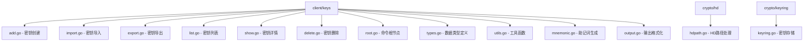

**图表来源**
- [root.go](file://client/keys/root.go#L12-L59)
- [add.go](file://client/keys/add.go#L1-L50)
- [import.go](file://client/keys/import.go#L1-L30)
- [export.go](file://client/keys/export.go#L1-L30)

**章节来源**
- [root.go](file://client/keys/root.go#L1-L59)

## 核心组件分析

### 密钥管理架构

密钥管理系统采用分层架构设计，主要包含以下几个层次：

1. **CLI接口层**：提供用户友好的命令行接口
2. **业务逻辑层**：处理密钥创建、导入、导出等核心业务
3. **加密算法层**：基于BIP39和BIP44标准的加密算法实现
4. **存储抽象层**：支持多种密钥存储后端

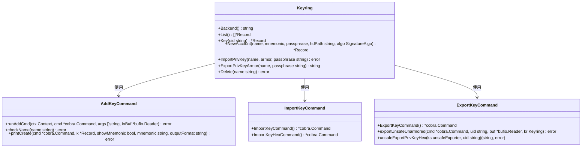

**图表来源**
- [keyring.go](file://crypto/keyring/keyring.go#L58-L150)
- [add.go](file://client/keys/add.go#L137-L200)
- [import.go](file://client/keys/import.go#L17-L47)
- [export.go](file://client/keys/export.go#L21-L70)

**章节来源**
- [keyring.go](file://crypto/keyring/keyring.go#L1-L200)
- [add.go](file://client/keys/add.go#L1-L100)

## 密钥生命周期详解

### 密钥创建流程

密钥创建是密钥生命周期的起点，支持多种创建方式：

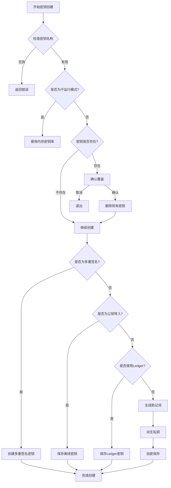

**图表来源**
- [add.go](file://client/keys/add.go#L137-L382)

#### 助记词生成与派生

助记词生成过程遵循BIP39标准，支持熵值输入和默认随机熵生成：

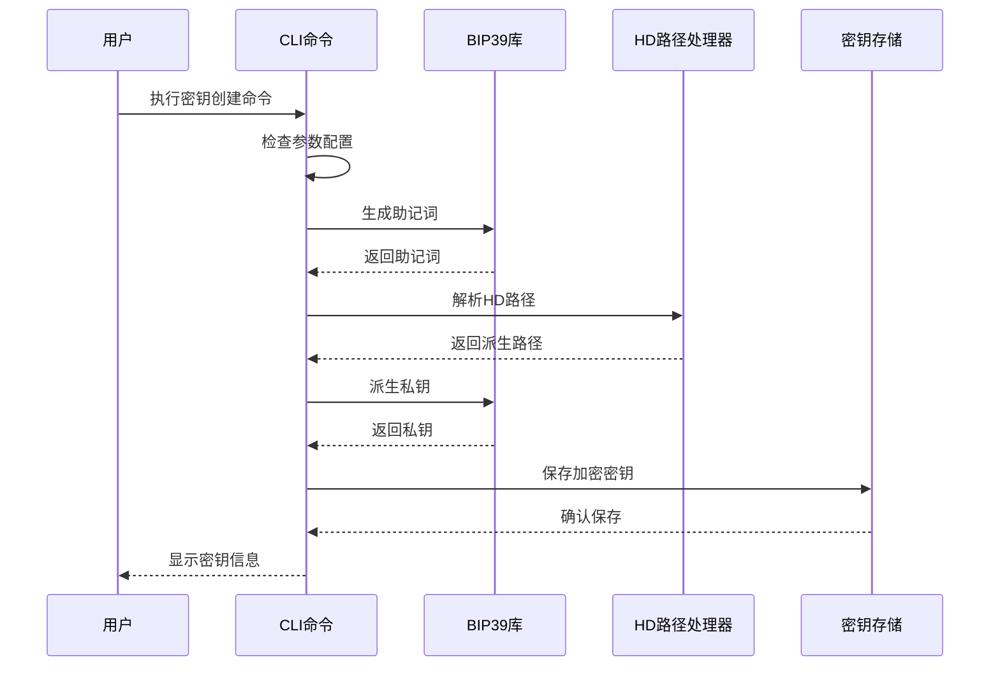

**图表来源**
- [add.go](file://client/keys/add.go#L335-L370)
- [mnemonic.go](file://client/keys/mnemonic.go#L20-L79)

**章节来源**
- [add.go](file://client/keys/add.go#L137-L436)
- [mnemonic.go](file://client/keys/mnemonic.go#L1-L79)

### 密钥导入流程

密钥导入支持多种格式，包括ASCII装甲私钥和十六进制编码：

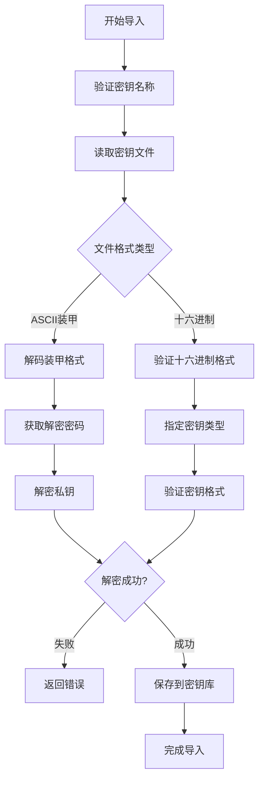

**图表来源**
- [import.go](file://client/keys/import.go#L24-L45)

**章节来源**
- [import.go](file://client/keys/import.go#L1-L83)

### 密钥导出流程

密钥导出提供多种安全级别的选项：

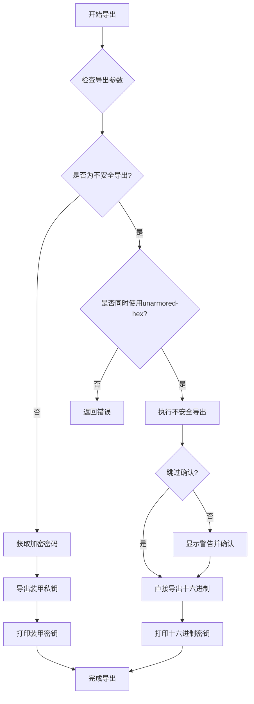

**图表来源**
- [export.go](file://client/keys/export.go#L35-L62)

**章节来源**
- [export.go](file://client/keys/export.go#L1-L109)

## 助记词与HD路径实现

### BIP44标准实现

HD路径遵循BIP44标准，支持分层确定性钱包的派生：

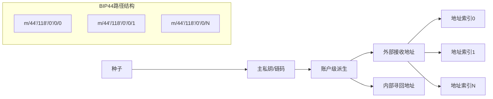

**图表来源**
- [hdpath.go](file://crypto/hd/hdpath.go#L141-L156)

### HD路径参数解析

HD路径参数包括目的、币种类型、账户、变更和地址索引五个部分：

| 参数位置 | 名称 | 描述 | 示例值 |
|---------|------|------|--------|
| 1 | Purpose | 目的标识符 | 44' (BIP44) |
| 2 | Coin Type | 币种类型 | 118' (Cosmos) |
| 3 | Account | 账户索引 | 0' |
| 4 | Change | 变更地址 | 0 (外部) / 1 (内部) |
| 5 | Address Index | 地址索引 | 0, 1, 2... |

**章节来源**
- [hdpath.go](file://crypto/hd/hdpath.go#L1-L282)

## 密钥导入导出机制

### 加密机制

密钥导入导出采用多层次加密保护：

1. **文件级加密**：使用bcrypt进行密码哈希
2. **密钥级加密**：使用AES对称加密
3. **传输级加密**：支持SSH等传输层加密

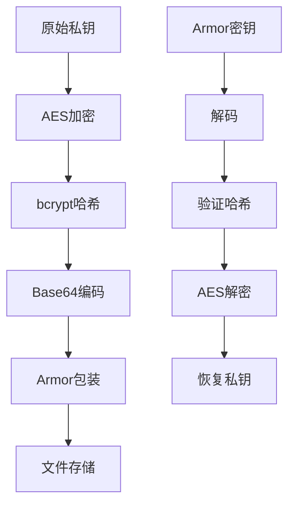

**图表来源**
- [keyring.go](file://crypto/keyring/keyring.go#L1-L100)

### 支持的导入格式

| 格式类型 | 描述 | 使用场景 |
|---------|------|----------|
| ASCII Armor | PEM格式的加密私钥 | 安全存储和传输 |
| Hex Encoding | 十六进制编码的私钥 | 快速导入和导出 |
| Ledger Device | Ledger硬件设备 | 硬件安全存储 |
| Public Key | 公钥信息 | 离线密钥管理 |

**章节来源**
- [import.go](file://client/keys/import.go#L1-L83)
- [export.go](file://client/keys/export.go#L1-L109)

## 密钥查询与展示

### 密钥列表功能

密钥列表提供多种查询和展示选项：

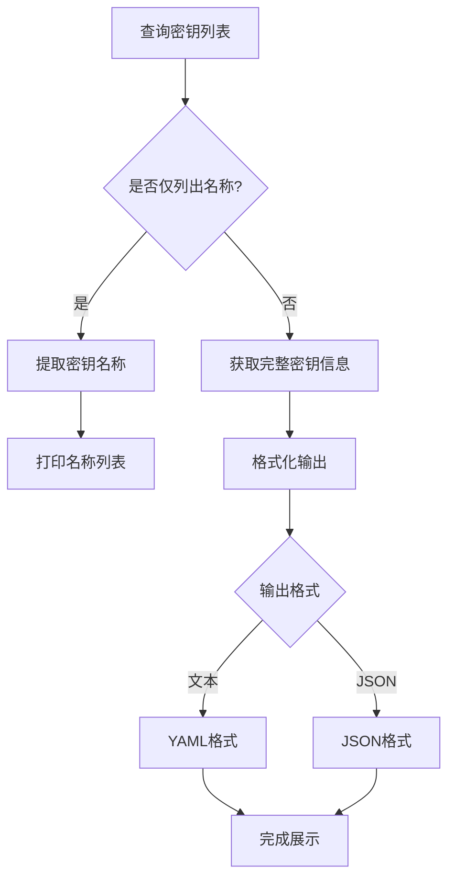

**图表来源**
- [list.go](file://client/keys/list.go#L26-L50)

### 密钥详情展示

密钥详情展示支持多种输出格式和过滤选项：

| 展示选项 | 描述 | 使用场景 |
|---------|------|----------|
| 地址 | 显示Bech32格式地址 | 区块链交互 |
| 公钥 | 显示公钥信息 | 验证和授权 |
| 多重签名 | 创建临时多重签名 | 联署交易 |
| 设备模式 | 显示Ledger设备地址 | 硬件钱包 |
| QR码 | 二维码格式地址 | 移动设备扫描 |

**章节来源**
- [list.go](file://client/keys/list.go#L1-L72)
- [show.go](file://client/keys/show.go#L1-L229)

## 安全删除流程

### 删除确认机制

密钥删除采用多层确认机制确保安全性：

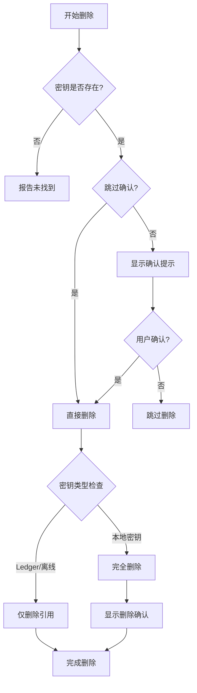

**图表来源**
- [delete.go](file://client/keys/delete.go#L30-L64)

### 删除类型处理

不同类型的密钥采用不同的删除策略：

| 密钥类型 | 删除行为 | 说明 |
|---------|----------|------|
| 本地密钥 | 完全删除 | 私钥和元数据全部移除 |
| Ledger密钥 | 引用删除 | 仅删除本地公钥引用 |
| 离线密钥 | 引用删除 | 仅删除本地公钥引用 |
| 多重签名 | 完全删除 | 删除所有参与密钥的引用 |

**章节来源**
- [delete.go](file://client/keys/delete.go#L1-L73)

## CLI命令使用指南

### 密钥创建命令

#### 基本密钥创建
```bash
# 创建新密钥
simd keys add alice

# 创建带有特定路径的密钥
simd keys add bob --coin-type 118 --account 1 --index 0

# 交互式创建密钥
simd keys add charlie -i

# 恢复已有密钥
simd keys add david --recover

# 创建多重签名密钥
simd keys add multisig --multisig "alice,bob,charlie" --multisig-threshold 2
```

#### 密钥创建参数说明

| 参数 | 类型 | 默认值 | 描述 |
|------|------|--------|------|
| `--interactive` | bool | false | 交互式输入助记词和密码 |
| `--recover` | bool | false | 从助记词恢复密钥 |
| `--coin-type` | uint32 | 118 | BIP44币种类型 |
| `--account` | uint32 | 0 | BIP44账户索引 |
| `--index` | uint32 | 0 | BIP44地址索引 |
| `--hd-path` | string | 自动 | 自定义HD路径 |
| `--multisig` | string | - | 多重签名参与者列表 |
| `--multisig-threshold` | int | 1 | 多重签名阈值 |

### 密钥导入命令

#### ASCII装甲密钥导入
```bash
# 导入ASCII装甲密钥
simd keys import alice keyfile.asc

# 导入十六进制密钥
simd keys import-hex bob 0x1234567890abcdef...
```

#### 导入参数说明

| 命令 | 参数 | 描述 |
|------|------|------|
| `keys import` | `<name> <keyfile>` | 从文件导入ASCII装甲密钥 |
| `keys import-hex` | `<name> [hex]` | 导入十六进制私钥 |

### 密钥导出命令

#### 安全导出
```bash
# 导出ASCII装甲密钥
simd keys export alice

# 不安全导出（危险）
simd keys export alice --unsafe --unarmored-hex
```

#### 导出参数说明

| 参数 | 类型 | 描述 |
|------|------|------|
| `--unsafe` | bool | 启用不安全操作 |
| `--unarmored-hex` | bool | 导出无装甲十六进制格式 |
| `--yes` | bool | 跳过确认提示 |

### 密钥查询命令

#### 列表查询
```bash
# 查看所有密钥
simd keys list

# 仅列出密钥名称
simd keys list --list-names

# 查看支持的密钥类型
simd keys list-key-types
```

#### 详情查询
```bash
# 查看密钥详情
simd keys show alice

# 仅显示地址
simd keys show alice --address

# 仅显示公钥
simd keys show alice --pubkey

# 显示QR码
simd keys show alice --qrcode
```

### 密钥删除命令

```bash
# 删除单个密钥
simd keys delete alice

# 批量删除密钥
simd keys delete alice bob charlie

# 跳过确认删除
simd keys delete alice --yes
```

**章节来源**
- [add.go](file://client/keys/add.go#L47-L107)
- [import.go](file://client/keys/import.go#L17-L83)
- [export.go](file://client/keys/export.go#L21-L70)
- [list.go](file://client/keys/list.go#L12-L72)
- [show.go](file://client/keys/show.go#L36-L56)
- [delete.go](file://client/keys/delete.go#L18-L73)

## 多链环境兼容性

### Bech32地址格式

Cosmos SDK支持多种Bech32前缀，适应不同的区块链环境：

| 前缀类型 | 用途 | 示例 |
|---------|------|------|
| `acc` | 账户地址 | cosmos1... |
| `val` | 验证人地址 | cosmosvaloper1... |
| `cons` | 共识地址 | cosmosvalcons1... |

### 密钥类型支持

系统支持多种签名算法：

| 算法类型 | 密钥类型 | 安全级别 | 适用场景 |
|---------|----------|----------|----------|
| Secp256k1 | ECDSA | 高 | 主要链 |
| Ed25519 | Edwards | 极高 | Tendermint共识 |
| BLS12-381 | BLS | 高 | 验证人聚合签名 |

### 配置管理

密钥管理器支持多种配置选项：

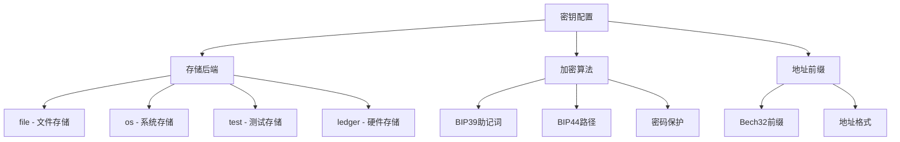

**图表来源**
- [keyring.go](file://crypto/keyring/keyring.go#L31-L40)
- [output.go](file://client/keys/output.go#L41-L62)

**章节来源**
- [output.go](file://client/keys/output.go#L1-L90)
- [keyring.go](file://crypto/keyring/keyring.go#L31-L50)

## 故障排除指南

### 常见问题及解决方案

#### 密钥创建问题

**问题：助记词验证失败**
```
错误：无效的助记词
```
**解决方案：**
- 检查助记词单词拼写
- 确保使用正确的语言词典
- 验证助记词长度和格式

**问题：HD路径解析错误**
```
错误：无效的HD路径
```
**解决方案：**
- 检查路径格式是否符合`m/44'/118'/0'/0/0`格式
- 确保硬化索引使用单引号
- 验证各段数值范围

#### 密钥导入问题

**问题：密钥文件格式错误**
```
错误：无法识别的密钥格式
```
**解决方案：**
- 确认密钥文件为有效的ASCII装甲格式
- 检查文件编码格式
- 验证Armor头部和尾部标记

**问题：解密密码错误**
```
错误：解密失败
```
**解决方案：**
- 确认使用的解密密码正确
- 检查密码是否区分大小写
- 验证密码字符集

#### 密钥导出问题

**问题：不安全导出被阻止**
```
错误：需要同时使用--unsafe和--unarmored-hex
```
**解决方案：**
- 理解不安全导出的风险
- 添加`--unsafe --unarmored-hex`参数
- 确认了解潜在的安全风险

#### 密钥查询问题

**问题：密钥不存在**
```
错误：密钥未找到
```
**解决方案：**
- 检查密钥名称拼写
- 使用`keys list`查看可用密钥
- 确认密钥存储位置

### 性能优化建议

1. **密钥存储优化**
   - 使用SSD存储提高访问速度
   - 定期清理无用密钥
   - 考虑使用内存后端进行临时操作

2. **批量操作优化**
   - 使用脚本批量处理多个密钥
   - 避免频繁的密钥查询操作
   - 合理设置缓存策略

3. **安全最佳实践**
   - 定期备份重要密钥
   - 使用强密码保护密钥文件
   - 在安全环境中进行密钥操作

**章节来源**
- [add.go](file://client/keys/add.go#L119-L125)
- [import.go](file://client/keys/import.go#L35-L45)
- [export.go](file://client/keys/export.go#L44-L48)

## 总结

Cosmos SDK的密钥生命周期管理系统提供了完整、安全、易用的密钥管理解决方案。通过深入分析各个组件的实现，我们可以看到：

1. **完整性**：涵盖了密钥生命周期的所有关键环节，从创建到删除的全流程管理
2. **安全性**：采用多层加密保护，支持多种安全级别的操作
3. **灵活性**：支持多种密钥类型、存储后端和输出格式
4. **标准化**：严格遵循BIP39和BIP44标准，确保互操作性
5. **易用性**：提供直观的CLI接口和丰富的配置选项

该系统为Cosmos生态系统的安全运行提供了坚实的基础，支持开发者和用户在各种环境下安全地管理数字资产。随着区块链技术的发展，这套密钥管理系统将继续演进，以满足不断增长的安全需求和用户体验要求。