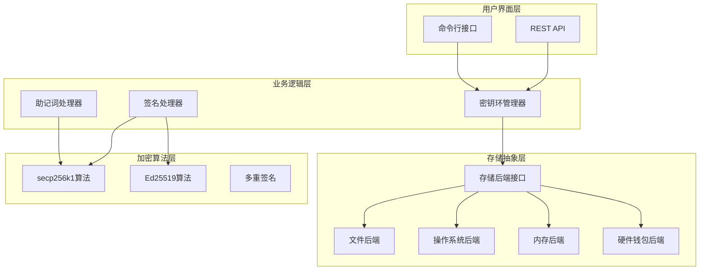
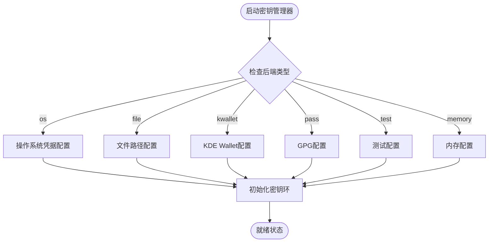
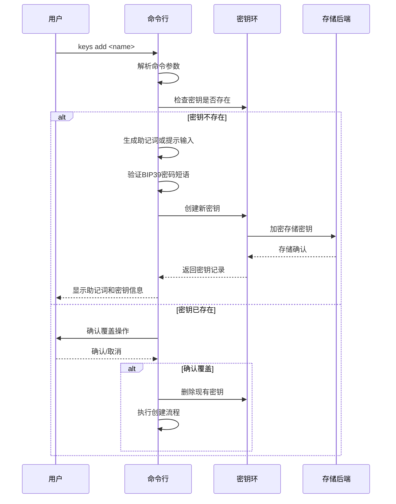
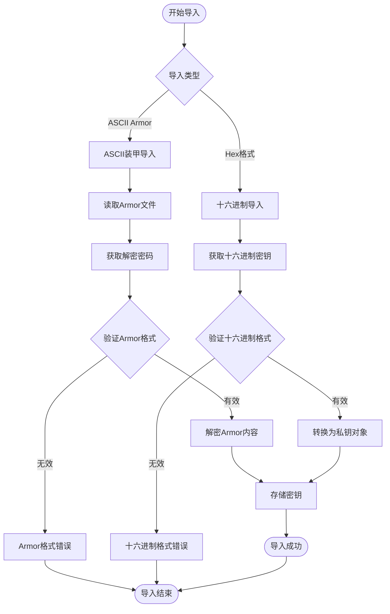
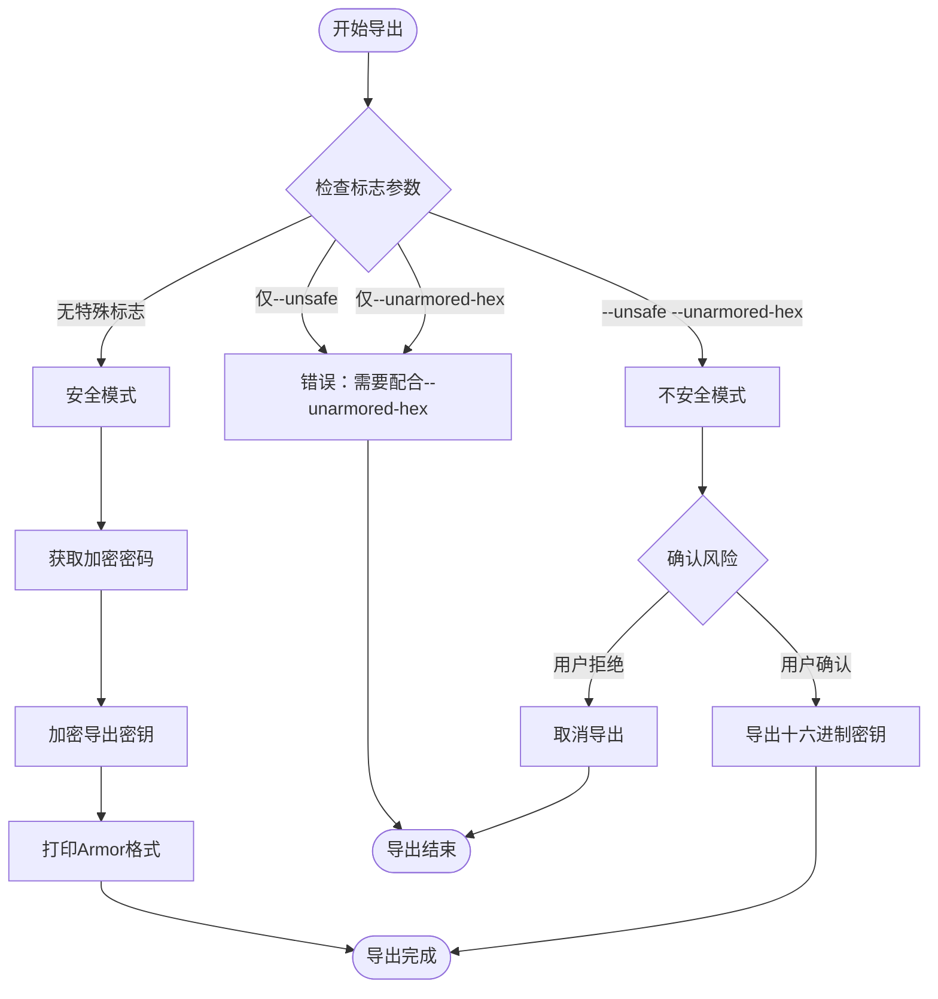
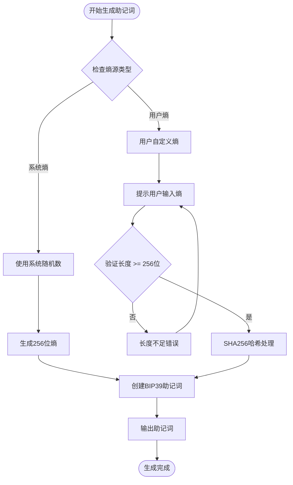
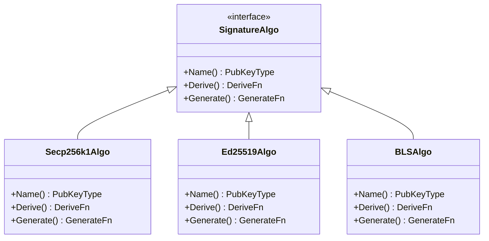
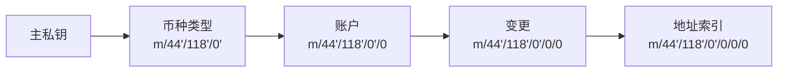
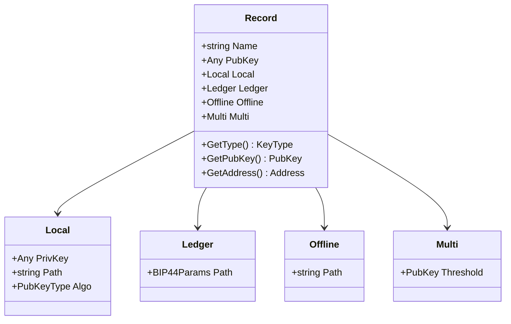
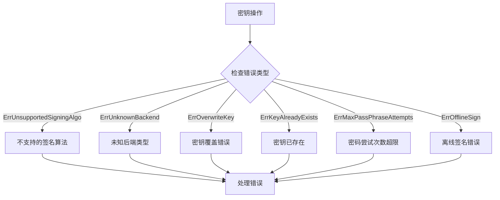

# 密钥管理系统

<cite>
**本文档中引用的文件**
- [client/keys/root.go](file://client/keys/root.go)
- [client/keys/add.go](file://client/keys/add.go)
- [client/keys/import.go](file://client/keys/import.go)
- [client/keys/export.go](file://client/keys/export.go)
- [client/keys/delete.go](file://client/keys/delete.go)
- [client/keys/list.go](file://client/keys/list.go)
- [client/keys/show.go](file://client/keys/show.go)
- [client/keys/mnemonic.go](file://client/keys/mnemonic.go)
- [client/keys/types.go](file://client/keys/types.go)
- [client/keys/utils.go](file://client/keys/utils.go)
- [crypto/keyring/keyring.go](file://crypto/keyring/keyring.go)
- [crypto/keyring/signing_algorithms.go](file://crypto/keyring/signing_algorithms.go)
- [crypto/hd/algo.go](file://crypto/hd/algo.go)
- [crypto/keyring/doc.go](file://crypto/keyring/doc.go)
</cite>

## 目录
1. [简介](#简介)
2. [系统架构概览](#系统架构概览)
3. [密钥存储后端](#密钥存储后端)
4. [密钥管理核心功能](#密钥管理核心功能)
5. [助记词生成与恢复](#助记词生成与恢复)
6. [签名算法支持](#签名算法支持)
7. [密钥类型与记录](#密钥类型与记录)
8. [安全最佳实践](#安全最佳实践)
9. [编程接口指导](#编程接口指导)
10. [故障排除指南](#故障排除指南)
11. [总结](#总结)

## 简介

Cosmos SDK 的密钥管理系统是一个功能完整的客户端密钥管理解决方案，提供了从密钥生成到存储、导出、导入和删除的全生命周期管理功能。该系统基于 Go-BIP39 标准实现了助记词生成功能，并支持多种签名算法和存储后端。

密钥管理系统的核心目标是为区块链应用提供安全、可靠且用户友好的密钥管理体验，同时确保私钥的安全性和可恢复性。

## 系统架构概览

密钥管理系统采用分层架构设计，主要包含以下核心组件：



**图表来源**
- [client/keys/root.go](file://client/keys/root.go#L12-L58)
- [crypto/keyring/keyring.go](file://crypto/keyring/keyring.go#L58-L106)

**章节来源**
- [client/keys/root.go](file://client/keys/root.go#L1-L59)
- [crypto/keyring/keyring.go](file://crypto/keyring/keyring.go#L1-L200)

## 密钥存储后端

密钥管理系统支持多种存储后端，每种后端都有其特定的用途和安全特性：

### 后端类型概览

| 后端类型 | 描述 | 安全级别 | 使用场景 |
|---------|------|----------|----------|
| `os` | 操作系统默认凭据存储 | 高 | 生产环境，用户交互 |
| `file` | 加密文件存储 | 高 | 桌面应用，服务器部署 |
| `kwallet` | KDE Wallet Manager | 中 | Linux KDE桌面环境 |
| `pass` | pass命令行工具 | 中 | 命令行工作流 |
| `test` | 不安全测试存储 | 低 | 开发测试环境 |
| `memory` | 内存临时存储 | 中 | 测试，临时密钥生成 |

### 后端配置与选择

系统通过 `Backend()` 方法返回当前使用的后端类型，并支持运行时切换。每个后端都有其特定的配置要求：



**图表来源**
- [crypto/keyring/keyring.go](file://crypto/keyring/keyring.go#L167-L200)

**章节来源**
- [crypto/keyring/doc.go](file://crypto/keyring/doc.go#L22-L42)
- [crypto/keyring/keyring.go](file://crypto/keyring/keyring.go#L31-L50)

## 密钥管理核心功能

### 创建密钥 (`add` 子命令)

创建新密钥是密钥管理系统的核心功能之一，支持多种创建方式：

#### 助记词生成模式
- 自动生成24字助记词
- 支持自定义BIP39密码短语
- 可指定HD路径和账户参数

#### 恢复模式 (`--recover`)
- 从现有助记词恢复密钥
- 支持外部助记词文件导入
- 提供交互式密码确认

#### 多重签名模式 (`--multisig`)
- 组合多个密钥创建多重签名地址
- 支持阈值签名机制
- 可控制密钥排序

#### 公钥导入模式 (`--pubkey-base64`)
- 导入任意公钥到密钥环
- 支持离线密钥管理
- 用于构建多重签名交易



**图表来源**
- [client/keys/add.go](file://client/keys/add.go#L137-L436)

**章节来源**
- [client/keys/add.go](file://client/keys/add.go#L47-L106)

### 导入密钥 (`import` 和 `import-hex` 子命令)

#### ASCII装甲密钥导入
支持从Armor格式的私钥文件导入：
- 自动识别Armor格式
- 要求输入解密密码
- 支持多种编码格式

#### 十六进制密钥导入
直接导入十六进制格式的私钥：
- 支持指定签名算法类型
- 可选交互式输入或命令行参数
- 提供算法兼容性检查



**图表来源**
- [client/keys/import.go](file://client/keys/import.go#L24-L83)

**章节来源**
- [client/keys/import.go](file://client/keys/import.go#L1-L83)

### 导出密钥 (`export` 子命令)

密钥导出功能提供两种模式：

#### 安全导出模式
- 默认使用Armor格式加密导出
- 要求设置导出密码
- 适合备份和迁移场景

#### 不安全导出模式 (`--unsafe --unarmored-hex`)
- 直接导出十六进制私钥
- 仅适用于热钱包集成
- 需要用户明确确认风险



**图表来源**
- [client/keys/export.go](file://client/keys/export.go#L35-L109)

**章节来源**
- [client/keys/export.go](file://client/keys/export.go#L1-L109)

### 删除密钥 (`delete` 子命令)

密钥删除功能支持批量操作和条件删除：

#### 删除流程
1. 验证密钥存在性
2. 确认删除操作（可跳过）
3. 执行删除操作
4. 处理不同类型密钥的特殊情况

#### 特殊处理
- **Ledger设备密钥**：仅删除本地公钥引用
- **离线密钥**：仅删除本地公钥引用
- **普通密钥**：完全删除密钥材料

**章节来源**
- [client/keys/delete.go](file://client/keys/delete.go#L1-L73)

### 列表和显示功能

#### 密钥列表 (`list` 子命令)
- 显示所有存储的密钥
- 支持仅显示名称模式
- 提供多种输出格式

#### 密钥详情 (`show` 子命令)
- 支持按名称或地址查找
- 显示公钥、地址等详细信息
- 支持多重签名密钥组合
- 提供QR码地址显示

**章节来源**
- [client/keys/list.go](file://client/keys/list.go#L1-L72)
- [client/keys/show.go](file://client/keys/show.go#L1-L229)

## 助记词生成与恢复

### 助记词生成流程

助记词生成是密钥管理系统的重要功能，基于BIP39标准实现：



**图表来源**
- [client/keys/mnemonic.go](file://client/keys/mnemonic.go#L26-L79)

### 助记词安全性

#### 熵源要求
- 最小256位熵长度
- 推荐使用系统随机数生成器
- 用户自定义熵需要额外验证

#### 助记词保护
- 生成时自动显示重要性提示
- 支持隐藏助记词输出
- 提供备份提醒机制

**章节来源**
- [client/keys/mnemonic.go](file://client/keys/mnemonic.go#L1-L79)

## 签名算法支持

### 支持的签名算法

密钥管理系统支持多种签名算法，每种算法都有其特定的应用场景：

| 算法类型 | 密钥长度 | 安全强度 | 应用场景 |
|---------|----------|----------|----------|
| `secp256k1` | 256位 | 高 | 主要推荐算法 |
| `ed25519` | 256位 | 高 | 高性能场景 |
| `bls12_381` | 可变 | 极高 | 零知识证明 |

### 算法选择与配置



**图表来源**
- [crypto/hd/algo.go](file://crypto/hd/algo.go#L10-L72)
- [crypto/keyring/signing_algorithms.go](file://crypto/keyring/signing_algorithms.go#L11-L51)

### HD钱包路径支持

系统支持BIP44标准的分层确定性钱包路径：



**章节来源**
- [crypto/hd/algo.go](file://crypto/hd/algo.go#L1-L72)
- [crypto/keyring/signing_algorithms.go](file://crypto/keyring/signing_algorithms.go#L1-L51)

## 密钥类型与记录

### 密钥记录结构

密钥管理系统使用统一的记录结构来表示不同类型的密钥：



**图表来源**
- [crypto/keyring/record.go](file://crypto/keyring/record.go#L40-L140)

### 密钥类型分类

| 类型 | 描述 | 私钥存储位置 | 使用场景 |
|------|------|-------------|----------|
| `Local` | 本地生成的密钥 | 存储后端 | 普通用户钱包 |
| `Ledger` | 硬件钱包密钥 | Ledger设备 | 高安全需求 |
| `Offline` | 离线密钥 | 本地存储 | 热钱包签名 |
| `Multi` | 多重签名密钥 | 本地存储 | 团队协作 |

**章节来源**
- [crypto/keyring/record.go](file://crypto/keyring/record.go#L75-L140)

## 安全最佳实践

### 密钥存储安全

#### 后端选择建议
1. **生产环境**：优先选择 `os` 或 `file` 后端
2. **开发测试**：使用 `test` 后端但避免敏感数据
3. **硬件安全**：考虑 `ledger` 设备集成

#### 密码策略
- 使用强密码至少12字符
- 包含大小写字母、数字和特殊符号
- 避免使用常见词汇和重复字符

### 助记词保护

#### 保管原则
1. **物理隔离**：助记词不应存储在电子设备上
2. **分散存储**：将助记词的不同部分分别保管
3. **定期验证**：定期测试助记词恢复功能

#### 备份策略
- 至少准备两份独立备份
- 存放在不同的安全位置
- 记录备份的存放位置

### 多重签名安全

#### 阈值设置
- 小团队：设置为 `(n-1)` 阈值
- 大团队：设置为 `(n/2 + 1)` 阈值
- 关键决策：设置为 `n` 阈值

#### 密钥分发
- 使用硬件钱包分发密钥
- 实施严格的访问控制
- 定期轮换密钥角色

### 网络安全

#### 通信安全
- 使用HTTPS传输敏感数据
- 实施证书验证
- 避免在公共网络中操作

#### 环境安全
- 在受控环境中执行密钥操作
- 使用防篡改设备
- 监控异常访问行为

## 编程接口指导

### 密钥环接口

开发者可以通过以下接口集成密钥环功能：

#### 基本操作接口
```go
// 创建新的密钥环实例
keyring.New(appName, backend, rootDir, userInput, codec)

// 密钥管理操作
keyring.NewMnemonic()
keyring.NewAccount()
keyring.SaveLedgerKey()
keyring.SaveOfflineKey()
keyring.SaveMultisig()

// 查询操作
keyring.List()
keyring.Key()
keyring.KeyByAddress()

// 删除操作
keyring.Delete()
keyring.DeleteByAddress()

// 导入导出
keyring.ImportPrivKey()
keyring.ExportPrivKeyArmor()
```

#### 签名接口
```go
// 签名操作
keyring.Sign(uid, msg, signMode)
keyring.SignByAddress(address, msg, signMode)

// 验证接口
keyring.SupportedAlgorithms()
```

### 错误处理

密钥管理系统定义了完整的错误处理机制：



**图表来源**
- [crypto/keyring/errors.go](file://crypto/keyring/errors.go#L1-L24)

### 集成示例

#### 基本密钥管理
```go
// 初始化密钥环
kr, err := keyring.New("myapp", keyring.BackendFile, "/path/to/config", nil, codec)

// 创建新密钥
record, mnemonic, err := kr.NewMnemonic("mykey", hd.English, 
    sdk.FullFundraiserPath, "password", hd.Secp256k1)

// 导入私钥
err = kr.ImportPrivKey("imported", armoredKey, "password")
```

#### 多重签名集成
```go
// 创建多重签名密钥
pks := []cryptotypes.PubKey{pk1, pk2, pk3}
multiKey := multisig.NewLegacyAminoPubKey(2, pks)
record, err := kr.SaveMultisig("multisig", multiKey)
```

**章节来源**
- [crypto/keyring/keyring.go](file://crypto/keyring/keyring.go#L58-L150)

## 故障排除指南

### 常见问题与解决方案

#### 密钥导入失败
**问题**：无法导入私钥文件
**原因**：Armor格式错误或密码错误
**解决**：检查文件格式和密码正确性

#### 助记词验证失败
**问题**：助记词无法验证
**原因**：助记词拼写错误或语言不匹配
**解决**：仔细核对助记词并确认语言设置

#### 签名算法不支持
**问题**：请求的签名算法不受支持
**原因**：算法类型错误或后端不支持
**解决**：检查算法类型并选择支持的算法

#### 存储后端连接失败
**问题**：无法连接到存储后端
**原因**：权限不足或后端服务不可用
**解决**：检查权限设置和后端服务状态

### 调试技巧

#### 日志分析
- 启用详细日志记录
- 分析错误堆栈信息
- 检查系统资源使用情况

#### 环境验证
- 验证存储后端配置
- 检查依赖库版本兼容性
- 测试网络连接和权限

#### 数据完整性检查
- 验证密钥环文件完整性
- 检查加密解密过程
- 测试备份恢复功能

**章节来源**
- [crypto/keyring/errors.go](file://crypto/keyring/errors.go#L1-L38)

## 总结

Cosmos SDK 的密钥管理系统提供了一个完整、安全且灵活的密钥管理解决方案。通过支持多种存储后端、丰富的签名算法和完善的密钥生命周期管理，该系统能够满足从个人用户到企业级应用的各种需求。

### 主要优势

1. **安全性**：多层安全防护机制，支持硬件钱包集成
2. **灵活性**：支持多种存储后端和签名算法
3. **易用性**：直观的命令行接口和REST API
4. **可扩展性**：模块化设计便于功能扩展
5. **标准化**：遵循BIP39、BIP44等行业标准

### 发展方向

随着区块链技术的发展，密钥管理系统将继续演进，重点关注：
- 更多签名算法的支持
- 硬件钱包集成的优化
- 跨平台兼容性的提升
- 用户体验的持续改进

通过遵循本文档提供的指导原则和最佳实践，开发者可以充分利用密钥管理系统的强大功能，构建安全可靠的区块链应用。