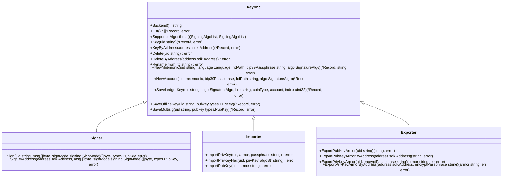
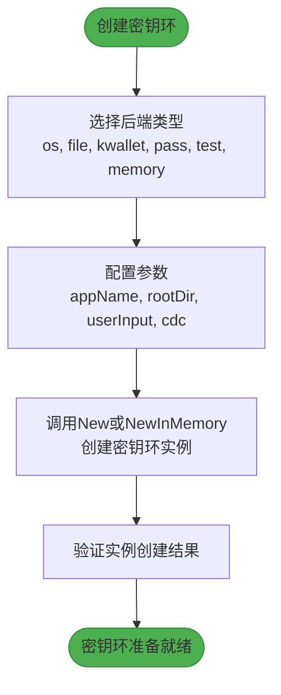
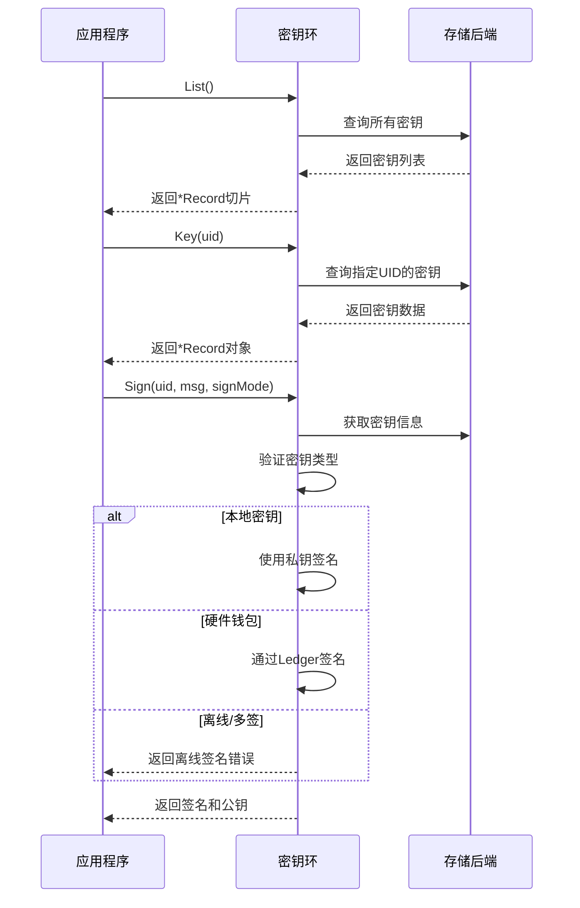
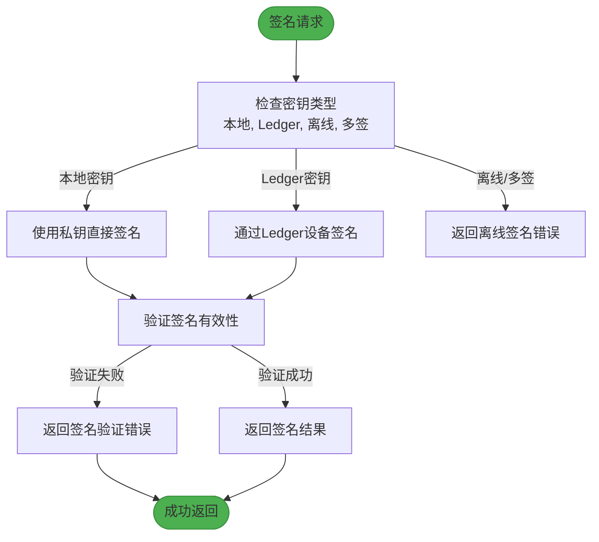
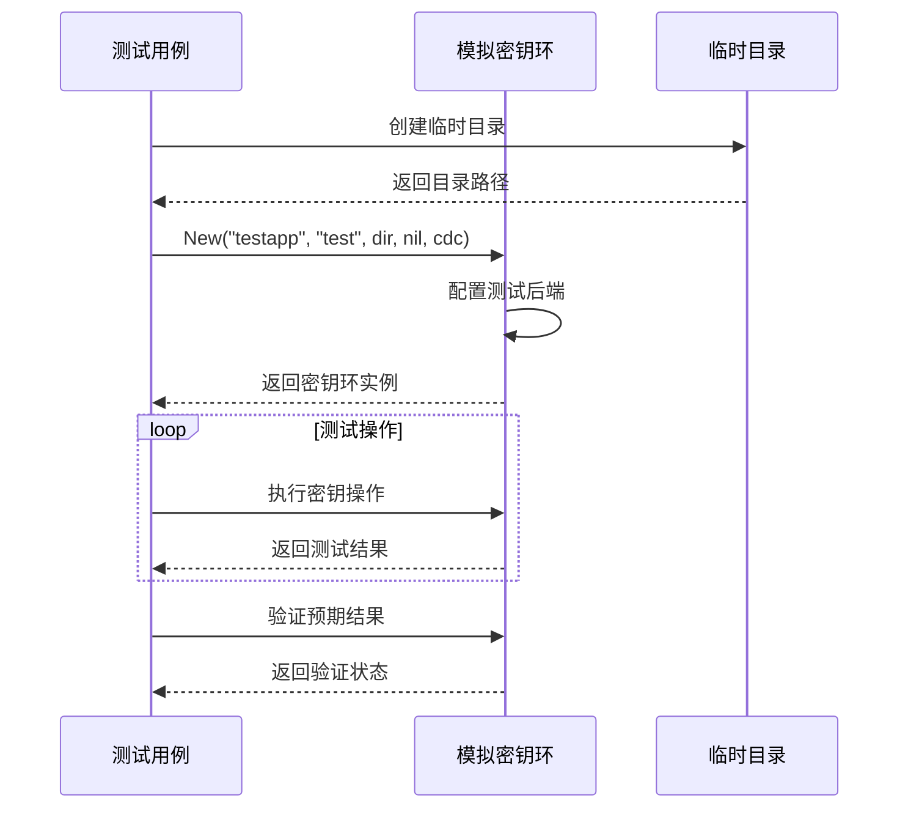
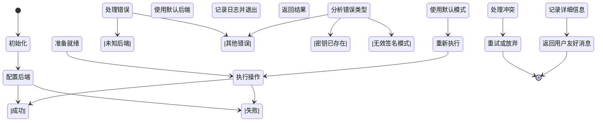
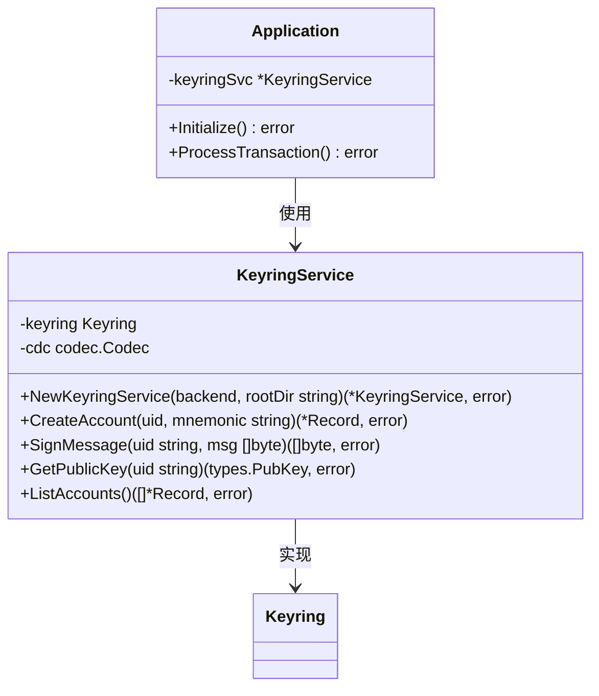

# 程序化密钥环集成

<cite>
**本文档中引用的文件**  
- [interface.go](file://client/v2/autocli/keyring/interface.go)
- [keyring.go](file://crypto/keyring/keyring.go)
- [types.go](file://crypto/keyring/types.go)
- [keyring_test.go](file://crypto/keyring/keyring_test.go)
- [mock/keyring.go](file://testutil/mock/keyring.go)
</cite>

## 目录
1. [简介](#简介)
2. [核心接口定义](#核心接口定义)
3. [密钥环初始化与配置](#密钥环初始化与配置)
4. [核心方法使用指南](#核心方法使用指南)
5. [签名操作安全实践](#签名操作安全实践)
6. [单元测试中的模拟](#单元测试中的模拟)
7. [错误处理与最佳实践](#错误处理与最佳实践)
8. [完整代码示例](#完整代码示例)

## 简介
密钥环（Keyring）是Cosmos SDK中用于管理加密密钥的核心组件，为区块链应用提供安全的密钥存储和签名功能。本指南深入解析`interface.go`中`Keyring`接口的定义，包括`Sign`、`Get`、`List`等核心方法的使用方式。我们将详细说明如何在自定义应用中初始化密钥环实例，配置后端存储类型，并安全地执行签名操作。通过结合测试模拟，展示如何在单元测试中隔离密钥环依赖，确保开发人员能够正确、安全地将密钥管理功能嵌入其区块链应用中。

**Section sources**
- [keyring.go](file://crypto/keyring/keyring.go#L58-L149)
- [interface.go](file://client/v2/autocli/keyring/interface.go#L11-L23)

## 核心接口定义
`Keyring`接口定义了密钥存储后端所需实现的方法，为密钥管理提供了统一的API。该接口在`crypto/keyring/keyring.go`文件中定义，包含了一系列用于密钥管理、签名和导入导出的操作。

**Diagram sources**
- [keyring.go](file://crypto/keyring/keyring.go#L58-L149)

**Section sources**
- [keyring.go](file://crypto/keyring/keyring.go#L58-L149)

## 密钥环初始化与配置
在Cosmos SDK中，可以通过`New`和`NewInMemory`构造函数创建密钥环实例。`New`构造函数返回一个由keyring库支持的实现，该库提供了在Windows、macOS和大多数GNU/Linux发行版之间统一的抽象接口。

**Diagram sources**
- [keyring.go](file://crypto/keyring/keyring.go#L167-L199)
- [keyring.go](file://crypto/keyring/keyring.go#L154-L159)

**Section sources**
- [keyring.go](file://crypto/keyring/keyring.go#L154-L199)

## 核心方法使用指南
`Keyring`接口提供了多种核心方法来管理密钥。`List`方法用于列出所有存储的密钥，`Key`和`KeyByAddress`方法用于根据用户ID或地址获取密钥信息。`Sign`和`SignByAddress`方法用于对消息进行签名，而`NewMnemonic`和`NewAccount`方法用于创建新的密钥对。

**Diagram sources**
- [keyring.go](file://crypto/keyring/keyring.go#L63-L74)
- [keyring.go](file://crypto/keyring/keyring.go#L118-L122)
- [keyring.go](file://crypto/keyring/keyring.go#L83-L98)

**Section sources**
- [keyring.go](file://crypto/keyring/keyring.go#L63-L98)

## 签名操作安全实践
安全的签名操作是密钥管理的关键。`Sign`方法支持多种签名模式，包括`SIGN_MODE_LEGACY_AMINO_JSON`和`SIGN_MODE_TEXTUAL`。在执行签名操作时，系统会根据密钥类型（本地、Ledger、离线或多签）采取不同的处理流程。

**Diagram sources**
- [keyring.go](file://crypto/keyring/keyring.go#L383-L413)
- [keyring.go](file://crypto/keyring/keyring.go#L618-L662)

**Section sources**
- [keyring.go](file://crypto/keyring/keyring.go#L383-L413)

## 单元测试中的模拟
在单元测试中，可以使用`testutil/mock/keyring.go`中的模拟来隔离密钥环依赖。测试中常用的后端是`test`，它以不安全的方式将密钥存储在磁盘上，不会提示输入密码，仅用于测试目的。

**Diagram sources**
- [keyring_test.go](file://crypto/keyring/keyring_test.go#L341-L390)
- [keyring_linux_test.go](file://crypto/keyring/keyring_linux_test.go#L1-L50)

**Section sources**
- [keyring_test.go](file://crypto/keyring/keyring_test.go#L341-L390)
- [keyring_linux_test.go](file://crypto/keyring/keyring_linux_test.go#L1-L50)

## 错误处理与最佳实践
密钥环操作中可能遇到多种错误，如`ErrUnknownBackend`（未知后端）、`ErrKeyAlreadyExists`（密钥已存在）和`ErrInvalidSignMode`（无效签名模式）。正确的错误处理是确保应用稳定性的关键。

**Diagram sources**
- [errors.go](file://crypto/keyring/errors.go#L1-L24)
- [keyring.go](file://crypto/keyring/keyring.go#L471-L490)

**Section sources**
- [errors.go](file://crypto/keyring/errors.go#L1-L24)

## 完整代码示例
以下是一个完整的Go代码示例，演示如何在模块中注入密钥环服务并处理错误场景：

**Diagram sources**
- [keyring.go](file://crypto/keyring/keyring.go#L154-L199)
- [keyring.go](file://crypto/keyring/keyring.go#L543-L573)

**Section sources**
- [keyring.go](file://crypto/keyring/keyring.go#L154-L573)