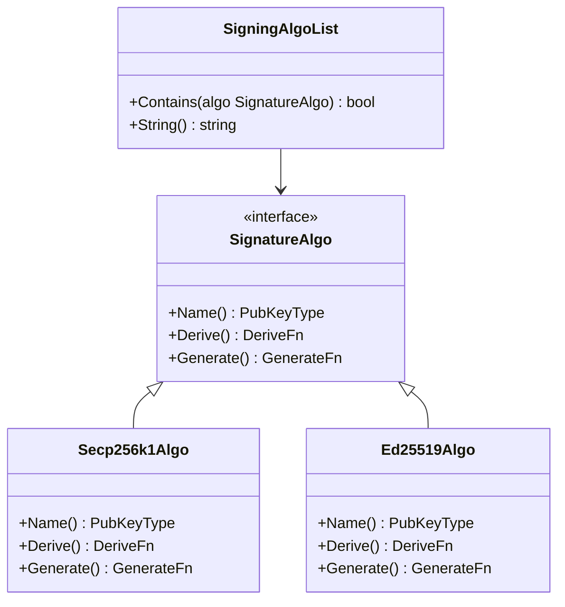
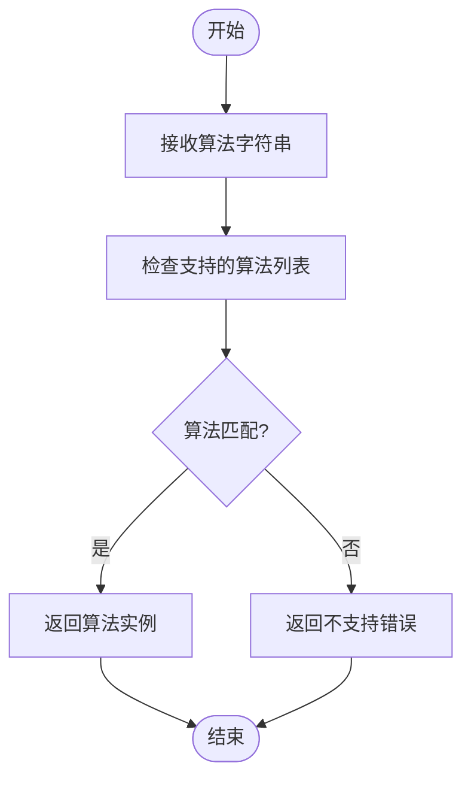
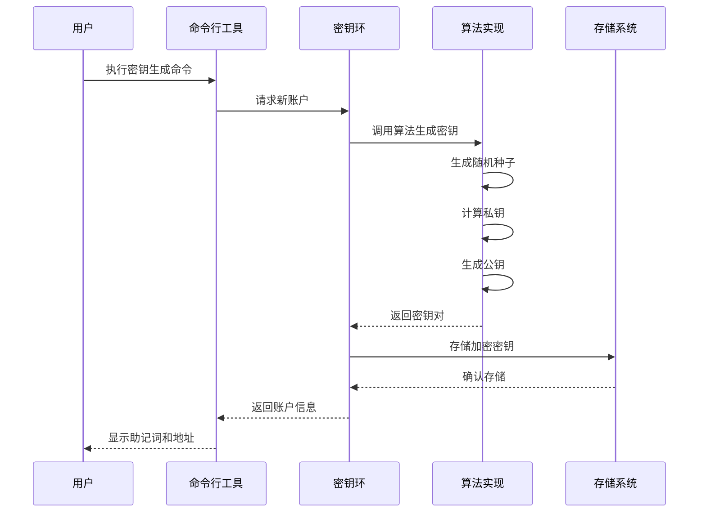
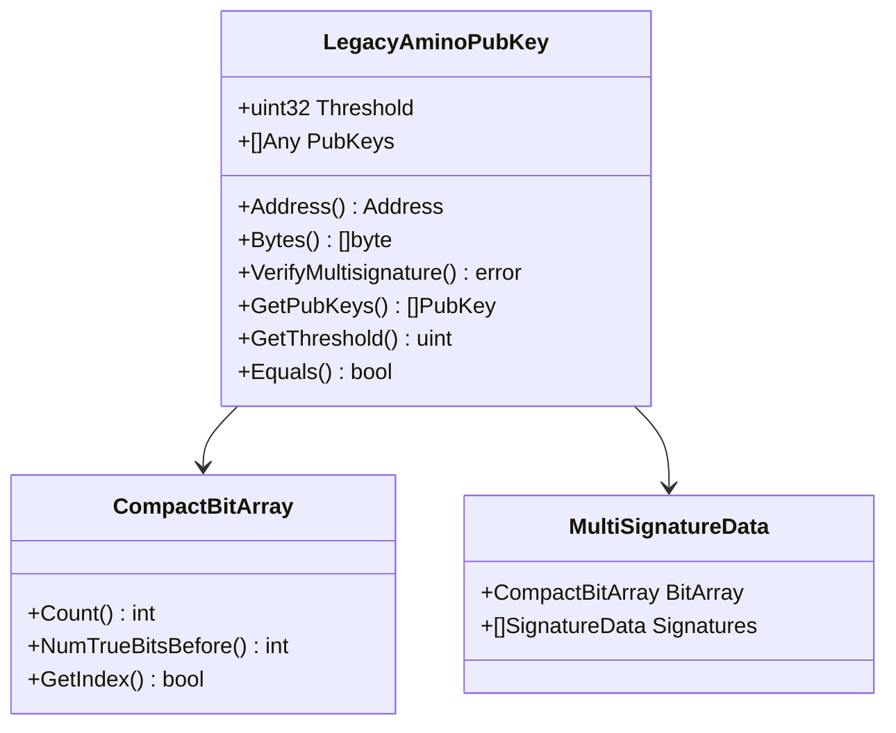
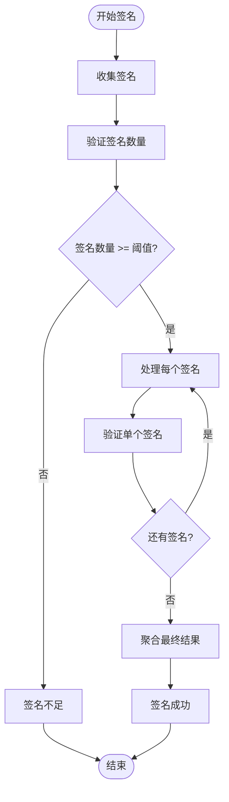

# 签名算法支持

<cite>
**本文档引用的文件**
- [signing_algorithms.go](file://crypto/keyring/signing_algorithms.go)
- [algo.go](file://crypto/hd/algo.go)
- [secp256k1.go](file://crypto/keys/secp256k1/secp256k1.go)
- [ed25519.go](file://crypto/keys/ed25519/ed25519.go)
- [multisig.go](file://crypto/keys/multisig/multisig.go)
- [add.go](file://client/keys/add.go)
- [signing_algorithms_test.go](file://crypto/keyring/signing_algorithms_test.go)
- [bench_test.go](file://crypto/keys/secp256k1/bench_test.go)
</cite>

## 目录
1. [简介](#简介)
2. [签名算法架构](#签名算法架构)
3. [支持的签名算法](#支持的签名算法)
4. [密钥生成与管理](#密钥生成与管理)
5. [多签密钥系统](#多签密钥系统)
6. [算法选择与配置](#算法选择与配置)
7. [性能与安全性分析](#性能与安全性分析)
8. [区块链网络兼容性](#区块链网络兼容性)
9. [使用指南](#使用指南)
10. [故障排除](#故障排除)

## 简介

Cosmos SDK 提供了一套完整的签名算法支持系统，允许开发者在不同的区块链网络中使用多种加密算法来生成和管理密钥对。该系统的核心是 `keyring` 包，它定义了统一的接口来处理各种签名算法，包括 `secp256k1`、`ed25519` 和其他高级算法。

## 签名算法架构

### 核心接口设计

签名算法系统基于 `SignatureAlgo` 接口构建，该接口定义了所有支持算法必须实现的基本功能：



**图表来源**
- [signing_algorithms.go](file://crypto/keyring/signing_algorithms.go#L11-L16)
- [algo.go](file://crypto/hd/algo.go#L39-L71)

### 算法选择机制

系统通过 `NewSigningAlgoFromString` 函数实现算法的动态选择：



**图表来源**
- [signing_algorithms.go](file://crypto/keyring/signing_algorithms.go#L18-L26)

**章节来源**
- [signing_algorithms.go](file://crypto/keyring/signing_algorithms.go#L1-L51)
- [algo.go](file://crypto/hd/algo.go#L1-L72)

## 支持的签名算法

### secp256k1 算法

`secp256k1` 是比特币和以太坊等区块链广泛使用的椭圆曲线数字签名算法。

#### 密钥结构
- **私钥大小**: 32 字节
- **公钥大小**: 33 字节（压缩格式）
- **签名大小**: 65 字节（包含恢复标识符）

#### 实现特性
- 基于 secp256k1 椭圆曲线
- 使用 RFC 6979 随机数生成器
- 支持确定性签名
- 兼容 Bitcoin 地址格式

#### 性能特点
- 密钥生成时间：约 1-2 毫秒
- 签名生成时间：约 1-3 毫秒
- 签名验证时间：约 10-20 毫秒

### ed25519 算法

`ed25519` 是基于 Edwards 曲线的现代签名算法，以其高性能和安全性著称。

#### 密钥结构
- **私钥大小**: 64 字节（前 32 字节为种子，后 32 字节为公钥）
- **公钥大小**: 32 字节
- **签名大小**: 64 字节

#### 实现特性
- 基于 Edwards25519 曲线
- 使用 SHA-512 哈希函数
- 抗量子计算攻击
- 快速签名验证

#### 性能特点
- 密钥生成时间：约 0.5-1 毫秒
- 签名生成时间：约 0.5-1 毫秒
- 签名验证时间：约 5-10 毫秒

### 其他算法支持

系统还支持以下算法：
- **BLS12-381**: 用于聚合签名的配对密码学算法
- **sr25519**: Polkadot 生态系统的签名算法

**章节来源**
- [secp256k1.go](file://crypto/keys/secp256k1/secp256k1.go#L1-L209)
- [ed25519.go](file://crypto/keys/ed25519/ed25519.go#L1-L232)

## 密钥生成与管理

### 密钥生成流程



**图表来源**
- [add.go](file://client/keys/add.go#L137-L436)

### 种子生成方法

系统支持多种种子生成方式：

1. **随机生成**: 使用操作系统熵源生成新的助记词
2. **恢复模式**: 通过助记词恢复现有密钥
3. **秘密派生**: 从密码派生稳定的私钥

### 密钥安全特性

- **加密存储**: 所有私钥都使用用户密码加密存储
- **多重认证**: 支持密码、PIN 码等多种认证方式
- **硬件支持**: 支持 Ledger 等硬件钱包设备

**章节来源**
- [add.go](file://client/keys/add.go#L137-L436)

## 多签密钥系统

### 多签架构设计

多签密钥系统允许设置多个签名者和阈值要求，提供了更高的安全性和灵活性。



**图表来源**
- [multisig.go](file://crypto/keys/multisig/multisig.go#L1-L175)

### 权重分配机制

多签系统支持灵活的权重分配：

- **阈值设置**: 定义需要的最小签名数量
- **权重计算**: 每个签名者可以有不同的权重
- **签名聚合**: 自动处理签名顺序和验证

### 签名聚合逻辑



**图表来源**
- [multisig.go](file://crypto/keys/multisig/multisig.go#L52-L97)

**章节来源**
- [multisig.go](file://crypto/keys/multisig/multisig.go#L1-L175)

## 算法选择与配置

### 命令行参数

使用 `--algo` 参数指定签名算法：

```bash
# 创建 secp256k1 密钥
cosmos keys add mykey --algo secp256k1

# 创建 ed25519 密钥  
cosmos keys add mykey --algo ed25519

# 创建多签密钥
cosmos keys add mymultisig --multisig "key1,key2,key3" --multisig-threshold 2
```

### 默认算法设置

系统默认使用 `secp256k1` 算法，因为它具有广泛的兼容性和成熟的生态系统支持。

### 算法兼容性矩阵

| 算法 | 区块链网络 | 主要用途 | 兼容性 |
|------|------------|----------|--------|
| secp256k1 | Cosmos、Ethereum、Bitcoin | 通用交易签名 | 广泛支持 |
| ed25519 | Solana、Polkadot | 高性能验证 | 中等支持 |
| BLS12-381 | Ethereum 2.0 | 聚合签名 | 新兴标准 |

**章节来源**
- [add.go](file://client/keys/add.go#L94-L94)
- [signing_algorithms.go](file://crypto/keyring/signing_algorithms.go#L18-L26)

## 性能与安全性分析

### 性能对比

| 算法 | 密钥生成 | 签名生成 | 签名验证 | 内存占用 |
|------|----------|----------|----------|----------|
| secp256k1 | 1-2 ms | 1-3 ms | 10-20 ms | 32 KB |
| ed25519 | 0.5-1 ms | 0.5-1 ms | 5-10 ms | 16 KB |
| BLS12-381 | 5-10 ms | 20-50 ms | 100-200 ms | 128 KB |

### 安全性评估

#### 密钥生成安全性
- **熵源质量**: 使用操作系统提供的高质量随机数生成器
- **抗侧信道攻击**: 实现常量时间操作
- **备份保护**: 支持助记词和硬件备份

#### 签名安全性
- **确定性签名**: 防止随机数泄露导致的安全问题
- **抗重放攻击**: 使用消息哈希作为签名输入
- **抗伪造**: 强数学基础保证

### 性能优化建议

1. **批量操作**: 对于大量签名需求，考虑使用 BLS 聚合签名
2. **硬件加速**: 在支持的平台上使用硬件加速
3. **缓存策略**: 缓存公钥验证结果以提高效率

**章节来源**
- [bench_test.go](file://crypto/keys/secp256k1/bench_test.go#L1-L30)

## 区块链网络兼容性

### 主要网络支持

#### Cosmos 生态系统
- **Cosmos Hub**: 支持所有算法
- **Osmosis**: 推荐使用 ed25519
- **Juno**: 支持 secp256k1 和 ed25519

#### 以太坊生态
- **以太坊主网**: 主要使用 secp256k1
- **以太坊 2.0**: 支持 BLS12-381
- **Polygon**: 支持 secp256k1

#### 其他网络
- **Solana**: 推荐使用 ed25519
- **Polkadot**: 支持 sr25519
- **Tezos**: 支持多种算法

### 网络特定配置

不同网络可能需要特定的配置参数：

```yaml
# Cosmos Hub 配置
network: cosmoshub-4
coin-type: 118
derivation-path: m/44'/118'/0'/0/0

# Ethereum 配置  
network: ethereum-mainnet
coin-type: 60
derivation-path: m/44'/60'/0'/0/0
```

## 使用指南

### 基本密钥管理

#### 创建新密钥
```bash
# 交互式创建
cosmos keys add mykey

# 指定算法
cosmos keys add mykey --algo ed25519

# 恢复已有密钥
cosmos keys add mykey --recover
```

#### 查看密钥信息
```bash
# 列出所有密钥
cosmos keys list

# 查看特定密钥详情
cosmos keys show mykey

# 导出公钥
cosmos keys show mykey --public
```

### 高级配置

#### 多签配置
```bash
# 创建多签密钥
cosmos keys add multisig \
  --multisig "key1,key2,key3" \
  --multisig-threshold 2

# 添加权重（需要自定义实现）
```

#### 硬件钱包支持
```bash
# 连接 Ledger 设备
cosmos keys add ledger-key --ledger

# 指定路径
cosmos keys add ledger-key --ledger --account 0 --index 0
```

### 最佳实践

1. **密钥分离**: 不同用途使用不同密钥
2. **定期轮换**: 定期更换长期使用的密钥
3. **多重备份**: 使用助记词和硬件钱包双重备份
4. **环境隔离**: 开发、测试、生产环境使用独立密钥

## 故障排除

### 常见问题

#### 算法不支持
**问题**: 尝试使用不受支持的算法
**解决方案**: 检查支持的算法列表或更新 SDK 版本

#### 密钥导入失败
**问题**: 无法正确导入现有密钥
**解决方案**: 验证助记词格式和算法匹配

#### 签名验证失败
**问题**: 签名无法通过验证
**解决方案**: 检查消息哈希和密钥对应关系

### 调试技巧

1. **启用调试日志**: 设置适当的日志级别
2. **验证密钥对**: 使用内置工具验证密钥生成
3. **测试签名流程**: 单独测试签名和验证步骤

### 性能监控

监控关键指标以确保系统正常运行：
- 密钥生成时间
- 签名操作延迟
- 内存使用情况
- 错误率统计

**章节来源**
- [signing_algorithms_test.go](file://crypto/keyring/signing_algorithms_test.go#L1-L113)

## 结论

Cosmos SDK 的签名算法支持系统提供了强大而灵活的密钥管理能力。通过统一的接口设计，开发者可以在不同区块链网络中轻松切换和使用最适合的签名算法。系统的模块化架构确保了良好的可扩展性和维护性，同时丰富的测试覆盖保证了代码的可靠性。

随着区块链技术的发展，该系统将继续演进以支持新的算法和更好的性能优化。开发者应该根据具体的应用场景和安全需求选择合适的算法，并遵循最佳实践来确保密钥的安全管理和高效使用。