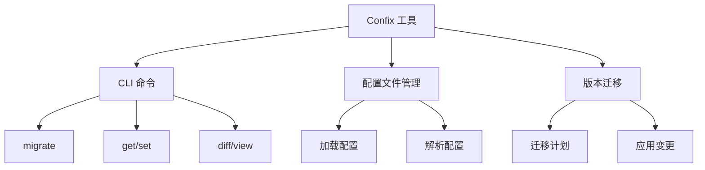
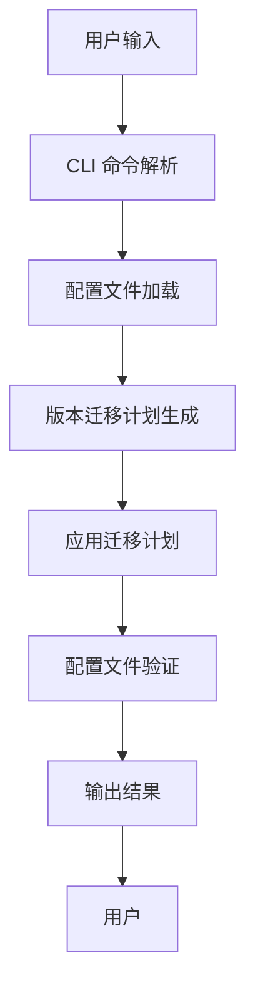
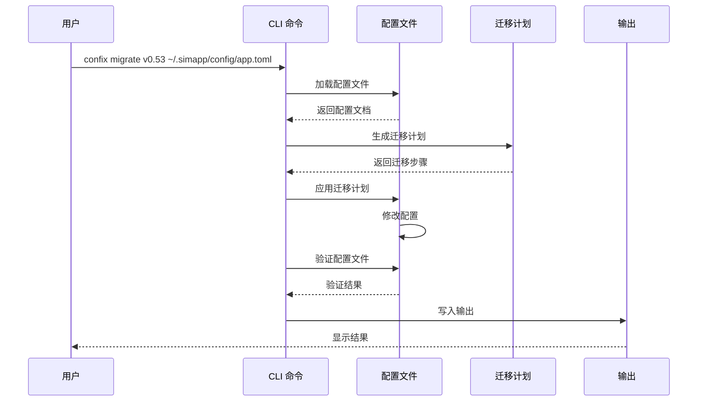
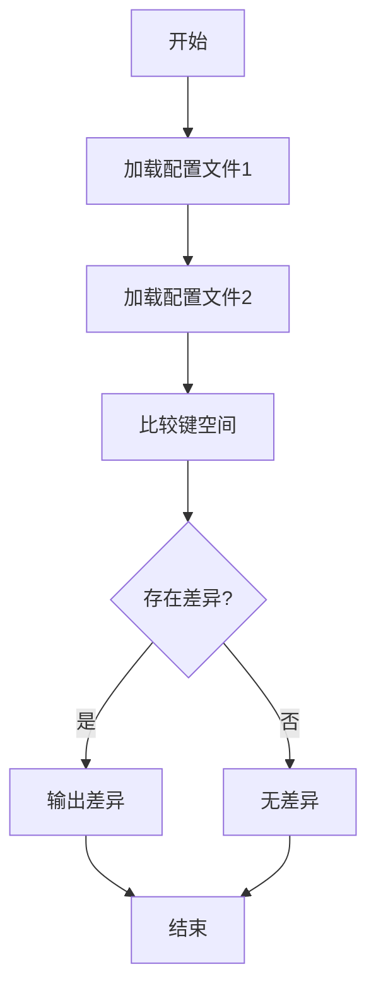
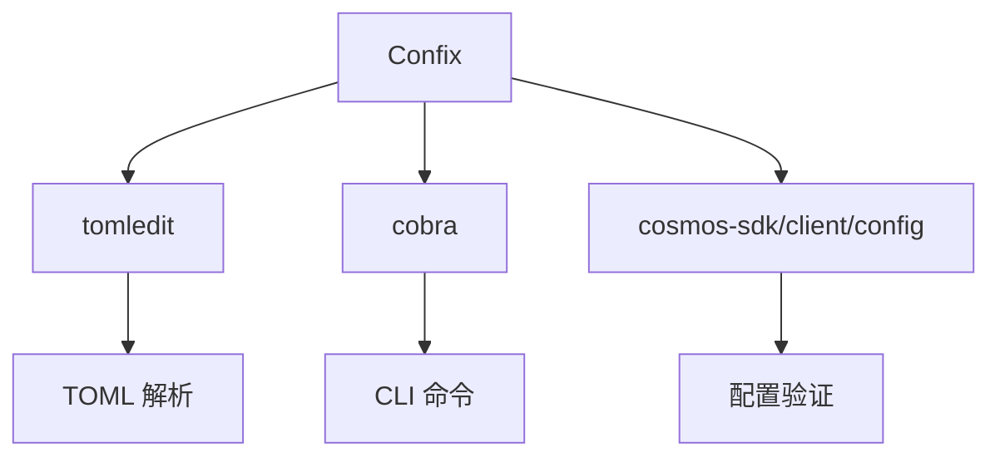

# Confix 配置管理工具

<cite>
**本文档引用的文件**  
- [confix/doc.go](file://tools/confix/doc.go)
- [confix/upgrade.go](file://tools/confix/upgrade.go)
- [confix/migrations.go](file://tools/confix/migrations.go)
- [confix/diff.go](file://tools/confix/diff.go)
- [confix/file.go](file://tools/confix/file.go)
- [confix/cmd/migrate.go](file://tools/confix/cmd/migrate.go)
- [confix/cmd/mutate.go](file://tools/confix/cmd/mutate.go)
- [confix/data/v0.45-app.toml](file://tools/confix/data/v0.45-app.toml)
- [confix/data/v0.53-app.toml](file://tools/confix/data/v0.53-app.toml)
- [confix/README.md](file://tools/confix/README.md)
</cite>

## 目录
1. [简介](#简介)
2. [项目结构](#项目结构)
3. [核心组件](#核心组件)
4. [架构概述](#架构概述)
5. [详细组件分析](#详细组件分析)
6. [依赖分析](#依赖分析)
7. [性能考虑](#性能考虑)
8. [故障排除指南](#故障排除指南)
9. [结论](#结论)

## 简介

Confix 是一个配置管理工具，用于通过命令行界面（CLI）管理 Cosmos SDK 的 TOML 格式配置文件。该工具基于 [CometBFT RFC 019](https://github.com/cometbft/cometbft/blob/5013bc3f4a6d64dcc2bf02ccc002ebc9881c62e4/docs/rfc/rfc-019-config-version.md) 规范，旨在帮助开发者自动化升级和规范化配置文件（如 app.toml 和 client.toml），避免在链升级时手动修改配置。

Confix 支持多种操作，包括获取、设置、迁移、比较和查看配置文件。其核心功能是 `confix migrate` 命令，能够将旧版本的配置文件（如 v0.45）转换为新版本（如 v0.53），并处理字段的重命名、删除和新增。该工具通过 `diff` 和 `mutate` 包进行配置比较和修改，确保配置文件的兼容性和一致性。

## 项目结构

Confix 工具位于 `tools/confix` 目录下，其主要结构包括：

- `cmd/`：包含 CLI 命令的实现，如 `migrate.go`、`mutate.go` 等。
- `data/`：存储不同版本的默认配置文件，如 `v0.45-app.toml`、`v0.53-app.toml` 等。
- `testdata/`：包含测试用的配置文件和差异文件。
- `upgrade.go`：定义了配置文件升级的核心逻辑。
- `migrations.go`：定义了不同版本之间的迁移计划。
- `diff.go`：实现了配置文件的比较功能。
- `file.go`：提供了加载和解析 TOML 配置文件的功能。

**Diagram sources**
- [confix/README.md](file://tools/confix/README.md)

**Section sources**
- [confix/README.md](file://tools/confix/README.md)

## 核心组件

Confix 的核心组件包括：

- **MigrationMap**：定义了从一个版本到另一个版本的转换计划映射。
- **PlanBuilder**：构建迁移计划的函数，用于生成从旧版本到新版本的转换步骤。
- **Upgrade**：执行配置文件升级的函数，应用迁移计划并验证结果。
- **DiffKeys**：比较两个配置文件的键空间，识别新增、删除和修改的配置项。

这些组件共同协作，确保配置文件在不同版本之间的平滑迁移。

**Section sources**
- [confix/migrations.go](file://tools/confix/migrations.go)
- [confix/upgrade.go](file://tools/confix/upgrade.go)
- [confix/diff.go](file://tools/confix/diff.go)

## 架构概述

Confix 的架构基于模块化设计，各组件职责明确，易于扩展和维护。其主要架构如下：

**Diagram sources**
- [confix/cmd/migrate.go](file://tools/confix/cmd/migrate.go)
- [confix/upgrade.go](file://tools/confix/upgrade.go)

## 详细组件分析

### 迁移命令分析

`confix migrate` 命令是 Confix 的核心功能之一，用于将旧版本的配置文件迁移到新版本。其执行流程如下：

1. **解析命令行参数**：获取目标版本和配置文件路径。
2. **加载配置文件**：读取并解析指定路径的配置文件。
3. **生成迁移计划**：根据目标版本和当前配置文件生成迁移计划。
4. **应用迁移计划**：执行迁移计划，修改配置文件。
5. **验证配置文件**：确保迁移后的配置文件符合新版本的要求。
6. **输出结果**：将修改后的配置文件写入指定路径或标准输出。

**Diagram sources**
- [confix/cmd/migrate.go](file://tools/confix/cmd/migrate.go)
- [confix/upgrade.go](file://tools/confix/upgrade.go)

**Section sources**
- [confix/cmd/migrate.go](file://tools/confix/cmd/migrate.go)
- [confix/upgrade.go](file://tools/confix/upgrade.go)

### 配置比较分析

`confix diff` 命令用于比较两个配置文件的差异，帮助开发者了解配置文件的变化。其核心逻辑在 `diff.go` 文件中实现，主要步骤如下：

1. **加载两个配置文件**：读取并解析两个配置文件。
2. **比较键空间**：使用 `DiffKeys` 函数比较两个配置文件的键空间，识别新增、删除和修改的配置项。
3. **输出差异**：将差异信息格式化输出。

**Diagram sources**
- [confix/diff.go](file://tools/confix/diff.go)

**Section sources**
- [confix/diff.go](file://tools/confix/diff.go)

## 依赖分析

Confix 依赖于多个外部库和内部模块，主要依赖包括：

- **github.com/creachadair/tomledit**：用于解析和操作 TOML 配置文件。
- **github.com/spf13/cobra**：用于构建 CLI 命令。
- **github.com/cosmos/cosmos-sdk/client/config**：用于验证客户端配置。

这些依赖确保了 Confix 能够高效地处理配置文件的解析、修改和验证。

**Diagram sources**
- [confix/go.mod](file://tools/confix/go.mod)

**Section sources**
- [confix/go.mod](file://tools/confix/go.mod)

## 性能考虑

Confix 在设计时考虑了性能优化，主要体现在以下几个方面：

- **原子性操作**：使用 `atomicfile.WriteData` 确保配置文件的写入是原子的，避免写入过程中出现部分写入的情况。
- **内存效率**：在比较和迁移配置文件时，尽量减少内存分配，提高处理速度。
- **并发安全**：所有操作都是线程安全的，可以在多线程环境中使用。

## 故障排除指南

在使用 Confix 时，可能会遇到一些常见问题，以下是一些解决方案：

- **配置项丢失**：确保目标版本的配置文件模板是最新的，可以通过 `confix migrate` 命令的 `--verbose` 选项查看详细的迁移日志。
- **类型不匹配**：在迁移过程中，某些配置项的类型可能发生变化，需要手动调整。可以使用 `confix diff` 命令比较新旧版本的配置文件，识别类型变化。
- **验证失败**：如果迁移后的配置文件验证失败，可以使用 `--skip-validate` 选项跳过验证，但需确保配置文件的正确性。

**Section sources**
- [confix/upgrade_test.go](file://tools/confix/upgrade_test.go)
- [confix/migrate_test.go](file://tools/confix/cmd/migrate_test.go)

## 结论

Confix 是一个强大的配置管理工具，能够帮助开发者自动化升级和规范化 Cosmos SDK 的配置文件。通过 `confix migrate` 命令，开发者可以轻松地将旧版本的配置文件迁移到新版本，避免手动修改带来的错误。此外，Confix 还提供了丰富的 CLI 命令，支持获取、设置、比较和查看配置文件，极大地提高了开发效率。