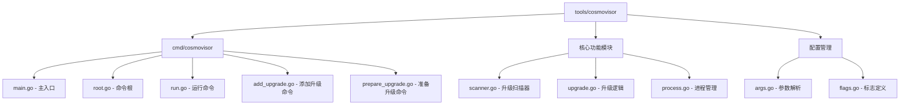
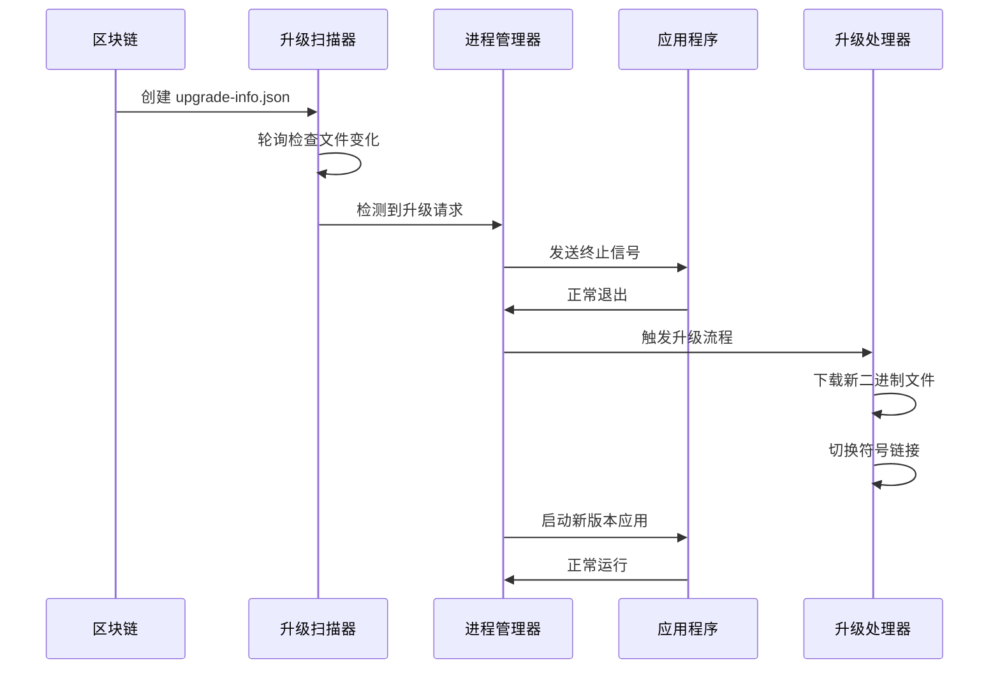
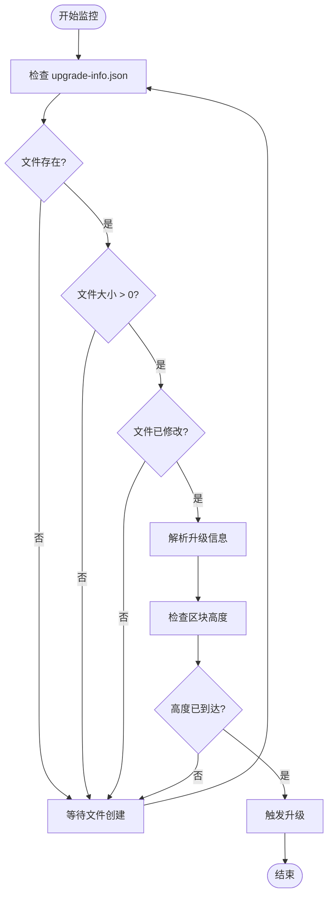
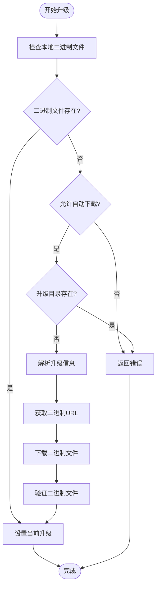
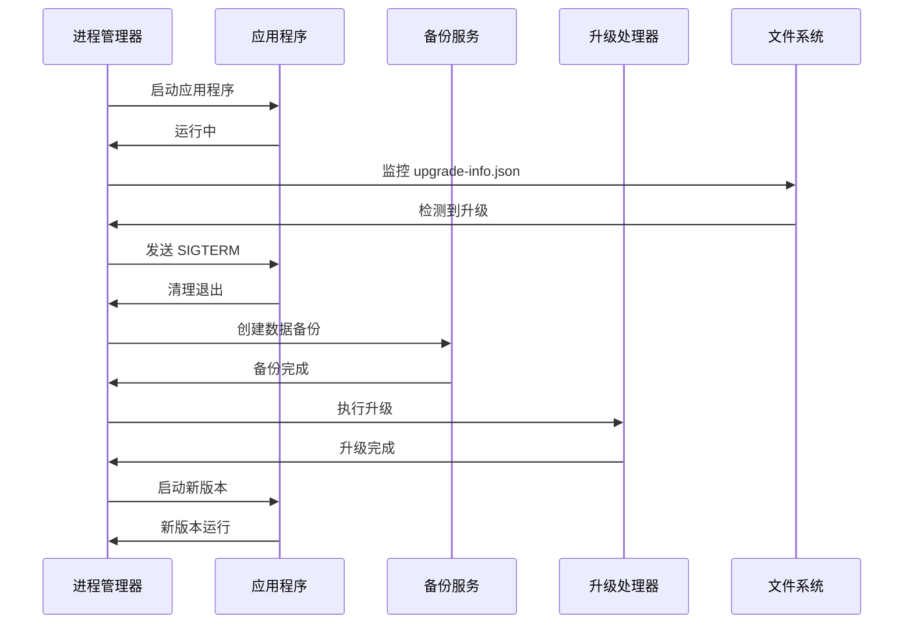
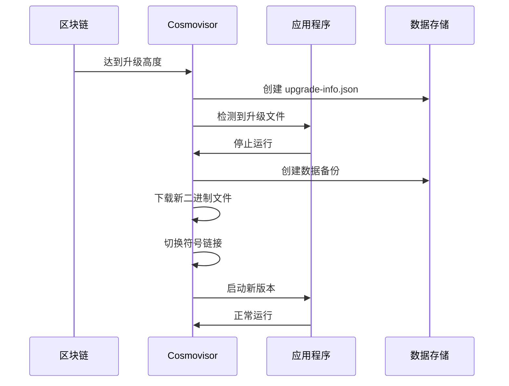

# Cosmovisor 链升级守护进程

<cite>
**本文档中引用的文件**
- [README.md](file://tools/cosmovisor/README.md)
- [main.go](file://tools/cosmovisor/cmd/cosmovisor/main.go)
- [root.go](file://tools/cosmovisor/cmd/cosmovisor/root.go)
- [scanner.go](file://tools/cosmovisor/scanner.go)
- [upgrade.go](file://tools/cosmovisor/upgrade.go)
- [process.go](file://tools/cosmovisor/process.go)
- [args.go](file://tools/cosmovisor/args.go)
- [flags.go](file://tools/cosmovisor/flags.go)
- [add_upgrade.go](file://tools/cosmovisor/cmd/cosmovisor/add_upgrade.go)
- [run.go](file://tools/cosmovisor/cmd/cosmovisor/run.go)
- [prepare_upgrade.go](file://tools/cosmovisor/cmd/cosmovisor/prepare_upgrade.go)
</cite>

## 目录
1. [简介](#简介)
2. [项目结构](#项目结构)
3. [核心组件](#核心组件)
4. [架构概览](#架构概览)
5. [详细组件分析](#详细组件分析)
6. [依赖关系分析](#依赖关系分析)
7. [性能考虑](#性能考虑)
8. [故障排除指南](#故障排除指南)
9. [结论](#结论)

## 简介

Cosmovisor 是一个为 Cosmos SDK 应用程序二进制文件设计的进程管理器，专门用于自动化链升级过程。它通过轮询由 x/upgrade 模块在升级高度创建的 `upgrade-info.json` 文件，能够自动下载新二进制文件、停止当前二进制文件、切换到新二进制文件，并最终使用新二进制文件重新启动节点。

Cosmovisor 的设计目标是：
- 自动化应用程序二进制文件切换过程
- 提供优雅的升级体验
- 支持多种部署场景（全节点、验证人节点）
- 确保升级过程的安全性和可靠性

## 项目结构

Cosmovisor 项目采用模块化架构，主要分为以下几个部分：



**图表来源**
- [main.go](file://tools/cosmovisor/cmd/cosmovisor/main.go#L1-L13)
- [root.go](file://tools/cosmovisor/cmd/cosmovisor/root.go#L1-L30)
- [scanner.go](file://tools/cosmovisor/scanner.go#L1-L270)
- [upgrade.go](file://tools/cosmovisor/upgrade.go#L1-L82)

**章节来源**
- [README.md](file://tools/cosmovisor/README.md#L1-L412)

## 核心组件

### 1. 命令行接口层
负责处理用户输入和命令分发，支持以下核心命令：
- `init` - 初始化 Cosmovisor 环境
- `run` - 运行应用程序并监控升级
- `add-upgrade` - 手动添加升级二进制文件
- `prepare-upgrade` - 准备升级二进制文件
- `config` - 显示当前配置

### 2. 升级扫描器 (`scanner.go`)
监控 `upgrade-info.json` 文件的变化，检测链上软件升级提案的激活状态。

### 3. 升级处理器 (`upgrade.go`)
实现核心的升级逻辑，包括二进制文件下载、符号链接切换和进程重启。

### 4. 进程管理器 (`process.go`)
负责启动、监控和重启应用程序进程，处理升级触发事件。

### 5. 配置管理系统 (`args.go`)
管理环境变量和配置文件，提供灵活的配置选项。

**章节来源**
- [scanner.go](file://tools/cosmovisor/scanner.go#L23-L72)
- [upgrade.go](file://tools/cosmovisor/upgrade.go#L14-L65)
- [process.go](file://tools/cosmovisor/process.go#L32-L45)

## 架构概览

Cosmovisor 采用事件驱动的架构模式，通过文件系统监控和进程管理实现自动化升级：



**图表来源**
- [scanner.go](file://tools/cosmovisor/scanner.go#L89-L114)
- [process.go](file://tools/cosmovisor/process.go#L185-L256)
- [upgrade.go](file://tools/cosmovisor/upgrade.go#L14-L65)

## 详细组件分析

### 升级扫描器 (`scanner.go`)

升级扫描器是 Cosmovisor 的核心监控组件，负责检测链上升级提案的激活状态：

#### 核心功能
1. **文件监控**：持续轮询 `upgrade-info.json` 文件的变化
2. **高度检查**：验证当前区块高度是否达到升级高度
3. **升级检测**：识别新的升级提案并触发升级流程

#### 工作流程



**图表来源**
- [scanner.go](file://tools/cosmovisor/scanner.go#L116-L194)

#### 关键特性
- **智能轮询**：使用可配置的轮询间隔减少资源消耗
- **高度验证**：确保只有在正确高度才触发升级
- **错误处理**：优雅处理文件读取和解析错误

**章节来源**
- [scanner.go](file://tools/cosmovisor/scanner.go#L89-L194)

### 升级处理器 (`upgrade.go`)

升级处理器实现了完整的升级逻辑，包括二进制文件管理和符号链接切换：

#### 核心算法



**图表来源**
- [upgrade.go](file://tools/cosmovisor/upgrade.go#L14-L65)

#### 支持的二进制下载格式
1. **直接URL映射**：操作系统/架构到二进制URL的JSON映射
2. **外部配置文件**：指向包含二进制信息的外部文件

**章节来源**
- [upgrade.go](file://tools/cosmovisor/upgrade.go#L14-L82)

### 进程管理器 (`process.go`)

进程管理器负责应用程序的生命周期管理和升级协调：

#### 主要职责
1. **进程启动**：启动应用程序并建立监控连接
2. **升级协调**：在检测到升级时协调进程终止和重启
3. **备份管理**：在升级前创建数据备份
4. **预升级脚本**：执行自定义预升级逻辑

#### 升级流程



**图表来源**
- [process.go](file://tools/cosmovisor/process.go#L185-L256)

**章节来源**
- [process.go](file://tools/cosmovisor/process.go#L185-L508)

### 配置管理系统 (`args.go`)

配置管理系统提供了灵活的配置选项，支持环境变量和配置文件两种方式：

#### 核心配置项

| 配置项 | 类型 | 默认值 | 描述 |
|--------|------|--------|------|
| `DAEMON_HOME` | 字符串 | 必需 | Cosmovisor 数据目录路径 |
| `DAEMON_NAME` | 字符串 | 必需 | 应用程序二进制文件名 |
| `DAEMON_ALLOW_DOWNLOAD_BINARIES` | 布尔值 | false | 是否允许自动下载二进制文件 |
| `DAEMON_RESTART_AFTER_UPGRADE` | 布尔值 | true | 升级后是否自动重启 |
| `DAEMON_POLL_INTERVAL` | 时间间隔 | 300ms | 文件监控轮询间隔 |
| `UNSAFE_SKIP_BACKUP` | 布尔值 | false | 是否跳过数据备份 |

#### 配置优先级
1. 命令行参数
2. 环境变量
3. 配置文件
4. 默认值

**章节来源**
- [args.go](file://tools/cosmovisor/args.go#L23-L72)

## 命令行工具详解

### cosmovisor init

初始化 Cosmovisor 环境，创建必要的目录结构：

```bash
cosmovisor init ./path/to/binary
```

**操作步骤**：
1. 创建 `$DAEMON_HOME/cosmovisor` 目录
2. 创建 `genesis/bin` 子目录
3. 复制二进制文件到指定位置
4. 设置 `current` 符号链接指向 `genesis`

### cosmovisor run

运行应用程序并监控升级：

```bash
cosmovisor run start --home $HOME/.myapp
```

该命令会：
- 加载配置信息
- 启动应用程序进程
- 监控升级文件变化
- 在检测到升级时自动处理

### cosmovisor add-upgrade

手动添加升级二进制文件：

```bash
cosmovisor add-upgrade v1.0.0 ./path/to/new/binary
```

支持通过 `--upgrade-height` 参数指定特定高度的自动升级。

### cosmovisor prepare-upgrade

从区块链查询并准备升级二进制文件：

```bash
cosmovisor prepare-upgrade
```

该命令会：
- 查询当前活跃的升级计划
- 下载指定的二进制文件
- 验证文件完整性
- 将文件放置在正确的位置

**章节来源**
- [add_upgrade.go](file://tools/cosmovisor/cmd/cosmovisor/add_upgrade.go#L16-L28)
- [run.go](file://tools/cosmovisor/cmd/cosmovisor/run.go#L13-L29)
- [prepare_upgrade.go](file://tools/cosmovisor/cmd/cosmovisor/prepare_upgrade.go#L20-L33)

## 升级流程示例

以下是一个完整的升级流程示例：

### 1. 初始化阶段
```bash
# 设置环境变量
export DAEMON_NAME=myapp
export DAEMON_HOME=$HOME/.myapp

# 初始化 Cosmovisor
cosmovisor init ./build/myapp

# 启动应用程序
cosmovisor run start
```

### 2. 升级提案阶段
```bash
# 提交升级提案
myapp tx upgrade software-upgrade v2.0.0 \
  --title "Upgrade to v2.0.0" \
  --summary "Major feature release" \
  --upgrade-height 1000000 \
  --upgrade-info '{"binaries":{"linux/amd64":"https://example.com/myapp-v2.0.0-linux-amd64"}}' \
  --from validator \
  --chain-id mychain
```

### 3. 升级执行阶段
Cosmovisor 自动检测到升级提案并在区块高度 1000000 处执行：



**图表来源**
- [process.go](file://tools/cosmovisor/process.go#L230-L250)

## 配置选项详解

### 环境变量配置

#### 基础配置
- `DAEMON_HOME`: 应用程序数据目录
- `DAEMON_NAME`: 应用程序二进制文件名

#### 升级行为配置
- `DAEMON_ALLOW_DOWNLOAD_BINARIES`: 是否允许自动下载二进制文件
- `DAEMON_RESTART_AFTER_UPGRADE`: 升级后是否自动重启
- `DAEMON_POLL_INTERVAL`: 文件监控轮询间隔

#### 安全配置
- `DAEMON_DOWNLOAD_MUST_HAVE_CHECKSUM`: 是否要求提供校验和
- `UNSAFE_SKIP_BACKUP`: 是否跳过数据备份

#### 性能配置
- `DAEMON_RESTART_DELAY`: 重启延迟时间
- `DAEMON_SHUTDOWN_GRACE`: 优雅关闭超时时间

### 生产环境最佳实践

#### 1. 安全配置
```bash
# 启用二进制文件校验
export DAEMON_DOWNLOAD_MUST_HAVE_CHECKSUM=true

# 禁用自动下载（更安全）
export DAEMON_ALLOW_DOWNLOAD_BINARIES=false

# 启用数据备份
export UNSAFE_SKIP_BACKUP=false
```

#### 2. 性能优化
```bash
# 增加轮询间隔以减少CPU使用
export DAEMON_POLL_INTERVAL=1s

# 设置优雅关闭超时
export DAEMON_SHUTDOWN_GRACE=30s
```

#### 3. 监控配置
```bash
# 启用彩色日志
export COSMOVISOR_COLOR_LOGS=true

# 设置日志时间格式
export COSMOVISOR_TIMEFORMAT_LOGS=rfc3339

# 禁用日志输出（性能优化）
export COSMOVISOR_DISABLE_LOGS=false
```

**章节来源**
- [args.go](file://tools/cosmovisor/args.go#L23-L72)

## 错误处理与故障排除

### 常见问题及解决方案

#### 1. 升级失败
**症状**: 应用程序无法启动新版本
**原因**: 
- 二进制文件损坏
- 权限不足
- 配置错误

**解决方案**:
```bash
# 检查二进制文件权限
chmod +x $DAEMON_HOME/cosmovisor/upgrades/v2.0.0/bin/myapp

# 验证二进制文件
$DAEMON_HOME/cosmovisor/upgrades/v2.0.0/bin/myapp version

# 查看详细日志
cosmovisor run start 2>&1 | tee cosmovisor.log
```

#### 2. 文件监控问题
**症状**: 升级提案未被检测到
**原因**:
- 文件权限问题
- 轮询间隔过长
- 文件系统不支持监控

**解决方案**:
```bash
# 检查文件权限
ls -la $DAEMON_HOME/data/upgrade-info.json

# 减少轮询间隔
export DAEMON_POLL_INTERVAL=100ms

# 手动触发升级
touch $DAEMON_HOME/data/upgrade-info.json
```

#### 3. 网络下载问题
**症状**: 自动下载失败
**原因**:
- 网络连接问题
- URL不可访问
- 校验和验证失败

**解决方案**:
```bash
# 手动下载二进制文件
mkdir -p $DAEMON_HOME/cosmovisor/upgrades/v2.0.0/bin
wget -O $DAEMON_HOME/cosmovisor/upgrades/v2.0.0/bin/myapp https://example.com/myapp-v2.0.0-linux-amd64
chmod +x $DAEMON_HOME/cosmovisor/upgrades/v2.0.0/bin/myapp
```

### 升级失败恢复

#### 1. 回滚到旧版本
```bash
# 停止 Cosmovisor
killall cosmovisor

# 删除新版本符号链接
rm $DAEMON_HOME/cosmovisor/current

# 重新创建指向 genesis 的链接
ln -s genesis $DAEMON_HOME/cosmovisor/current

# 启动应用程序
cosmovisor run start
```

#### 2. 数据恢复
```bash
# 从备份恢复数据
cp -r $DAEMON_HOME/data-backup-* $DAEMON_HOME/

# 验证数据完整性
myapp unsafe-reset-all
```

**章节来源**
- [process.go](file://tools/cosmovisor/process.go#L324-L360)

## 结论

Cosmovisor 作为一个专业的链升级守护进程，提供了完整而可靠的自动化升级解决方案。其设计特点包括：

### 核心优势
1. **自动化程度高**：从检测升级提案到执行升级的全流程自动化
2. **安全性强**：支持二进制文件校验和数据备份
3. **灵活性好**：支持多种部署场景和配置选项
4. **监控完善**：提供详细的日志和监控信息

### 适用场景
- **验证人节点**：确保升级过程的可靠性和安全性
- **全节点**：简化维护工作，提高可用性
- **测试网络**：快速验证升级流程
- **生产环境**：提供稳定可靠的升级保障

### 最佳实践建议
1. **生产环境**：禁用自动下载，启用数据备份
2. **测试环境**：可以启用自动下载，便于快速测试
3. **监控告警**：设置适当的监控和告警机制
4. **定期演练**：定期进行升级演练，确保流程顺畅

Cosmovisor 通过其精心设计的架构和完善的功能，为 Cosmos 生态系统的链升级提供了强有力的支持，是维护区块链网络稳定运行的重要工具。