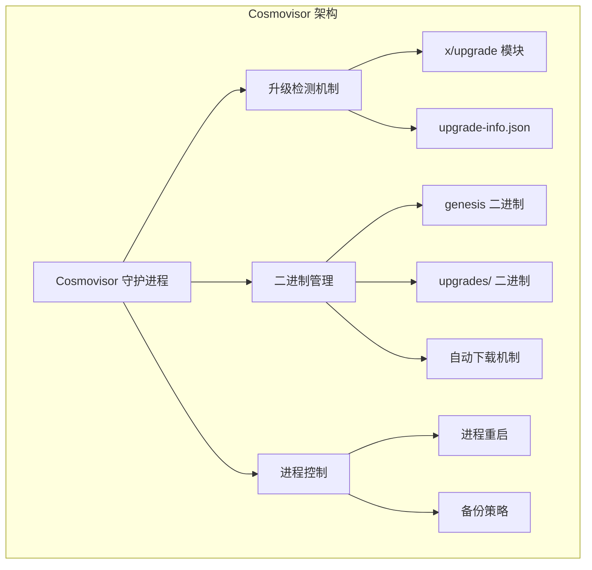
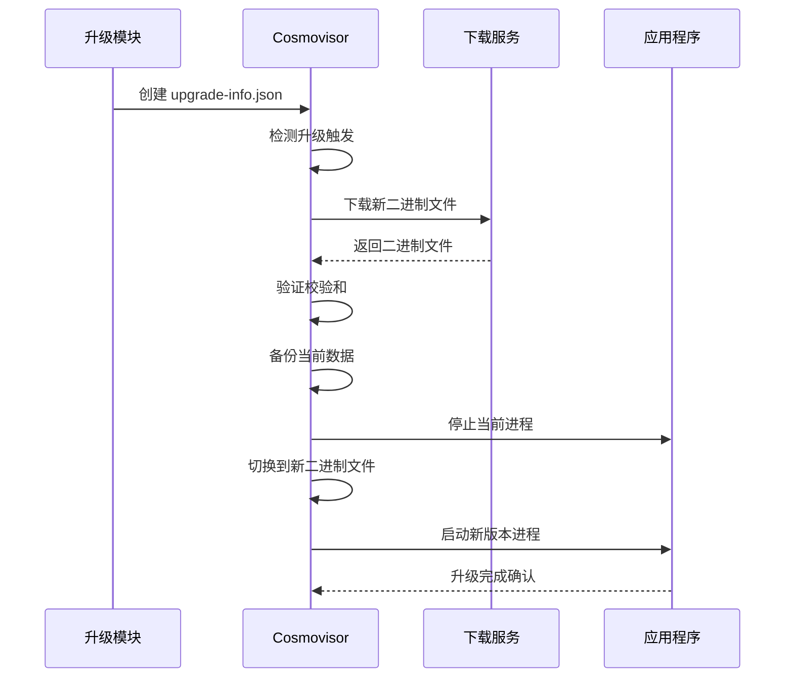
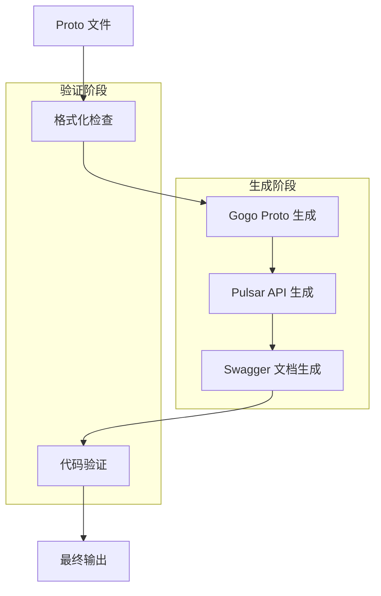

# 开发工具

<cite>
**本文档中引用的文件**
- [tools/confix/README.md](file://tools/confix/README.md)
- [tools/cosmovisor/README.md](file://tools/cosmovisor/README.md)
- [scripts/README.md](file://scripts/README.md)
- [scripts/protocgen.sh](file://scripts/protocgen.sh)
- [scripts/protocgen-pulsar.sh](file://scripts/protocgen-pulsar.sh)
- [scripts/protoc-swagger-gen.sh](file://scripts/protoc-swagger-gen.sh)
- [scripts/init-simapp.sh](file://scripts/init-simapp.sh)
- [scripts/mockgen.sh](file://scripts/mockgen.sh)
- [scripts/go-mod-tidy-all.sh](file://scripts/go-mod-tidy-all.sh)
- [scripts/dep-assert.sh](file://scripts/dep-assert.sh)
- [tools/confix/cmd/cmd.go](file://tools/confix/cmd/cmd.go)
- [tools/cosmovisor/cmd/cosmovisor/main.go](file://tools/cosmovisor/cmd/cosmovisor/main.go)
- [Makefile](file://Makefile)
</cite>

## 目录
1. [简介](#简介)
2. [Confix 配置管理工具](#confix-配置管理工具)
3. [Cosmovisor 守护进程工具](#cosmovisor-守护进程工具)
4. [代码生成脚本](#代码生成脚本)
5. [开发辅助脚本](#开发辅助脚本)
6. [工具集成指南](#工具集成指南)
7. [最佳实践](#最佳实践)
8. [故障排除](#故障排除)

## 简介

Cosmos SDK 提供了一套完整的开发工具集，旨在简化区块链应用的开发、测试和部署过程。这些工具涵盖了从配置管理到代码生成，再到链升级处理的各个方面，为开发者提供了高效的工作流程支持。

本文档详细介绍了三个核心开发工具：`confix`（配置管理工具）、`cosmovisor`（链升级守护进程）以及各种自动化脚本，帮助开发者理解这些工具的功能、使用方法和集成方式。

## Confix 配置管理工具

### 工具概述

Confix 是一个基于 CometBFT RFC 019 的配置管理工具，允许开发者通过命令行界面管理应用程序配置。它提供了配置值的获取、设置、迁移和差异比较等功能，是 Cosmos SDK 中重要的配置管理解决方案。

### 核心功能

#### 配置值操作
- **获取配置值**：从 TOML 配置文件中提取特定配置项
- **设置配置值**：修改 TOML 配置文件中的配置项
- **查看配置文件**：显示完整的配置内容
- **配置迁移**：将配置文件迁移到新版本格式

#### 版本管理
- **配置迁移**：支持不同版本间的配置格式转换
- **差异比较**：对比当前配置与指定版本配置的差异
- **向后兼容**：确保配置文件在版本升级时保持兼容性

### 使用方式

#### 应用内集成
开发者可以将 Confix 命令添加到应用程序的根命令中：

```go
// 导入 confix 包
import "cosmossdk.io/tools/confix/cmd"

// 在初始化根命令后添加 confix 命令
rootCmd.AddCommand(
    confixcmd.ConfigCommand(),
)
```

#### 独立使用
也可以单独安装和使用 Confix 工具：

```bash
# 安装最新版本
go install cosmossdk.io/tools/confix/cmd/confix@latest

# 或从源码构建
make confix
```

### 实际使用示例

#### 获取配置值
```bash
# 使用应用程序内置命令
simd config get app pruning

# 使用独立工具
confix get ~/.simapp/config/app.toml pruning
```

#### 设置配置值
```bash
# 使用应用程序内置命令
simd config set app pruning "enabled"

# 使用独立工具
confix set ~/.simapp/config/app.toml pruning "enabled"
```

#### 配置迁移
```bash
# 迁移到指定版本
simd config migrate v0.50

# 指定客户端配置文件
simd config migrate v0.50 --client
```

#### 差异比较
```bash
# 比较与指定版本的差异
simd config diff v0.47

# 指定客户端配置文件
simd config diff v0.47 --client
```

**章节来源**
- [tools/confix/README.md](file://tools/confix/README.md#L1-L157)

## Cosmovisor 守护进程工具

### 工具概述

Cosmovisor 是一个专门设计用于 Cosmos SDK 应用程序二进制文件管理的进程管理器。它能够自动处理链升级过程中的二进制文件切换，包括监控升级提案、自动下载新二进制文件、执行升级计划等关键功能。

### 核心架构



**图表来源**
- [tools/cosmovisor/README.md](file://tools/cosmovisor/README.md#L28-L40)

### 关键特性

#### 自动化升级流程
1. **升级检测**：持续监控 `$DAEMON_HOME/data/upgrade-info.json` 文件
2. **自动下载**：根据升级计划自动下载新二进制文件
3. **无缝切换**：零停机时间的二进制文件切换
4. **智能重启**：升级后的自动进程重启

#### 安全机制
- **校验和验证**：支持 SHA256/512 校验和验证
- **备份保护**：升级前自动备份数据目录
- **回滚支持**：支持升级失败时的快速回滚

#### 配置灵活性
- **环境变量驱动**：完全基于环境变量配置
- **可选功能**：支持禁用自动下载、跳过备份等选项
- **自定义脚本**：支持预升级和后升级自定义脚本

### 环境变量配置

| 变量名 | 描述 | 默认值 |
|--------|------|--------|
| `DAEMON_HOME` | Cosmovisor 数据目录路径 | 必需 |
| `DAEMON_NAME` | 应用程序二进制文件名 | 必需 |
| `DAEMON_ALLOW_DOWNLOAD_BINARIES` | 是否允许自动下载二进制文件 | false |
| `DAEMON_DOWNLOAD_MUST_HAVE_CHECKSUM` | 下载是否必须包含校验和 | false |
| `DAEMON_RESTART_AFTER_UPGRADE` | 升级后是否自动重启 | true |
| `DAEMON_RESTART_DELAY` | 重启延迟时间 | 无 |
| `DAEMON_SHUTDOWN_GRACE` | 关闭优雅期 | 无 |
| `DAEMON_POLL_INTERVAL` | 升级检测间隔 | 300ms |

### 使用流程

#### 初始化设置
```bash
# 设置必需的环境变量
export DAEMON_NAME=simd
export DAEMON_HOME=$HOME/.simapp

# 初始化 Cosmovisor
cosmovisor init ./build/simd

# 启动应用程序
cosmovisor run start
```

#### 手动添加升级二进制文件
```bash
# 添加新的升级二进制文件
cosmovisor add-upgrade v047-to-v050 ./build/simd

# 指定升级高度（紧急升级）
cosmovisor add-upgrade v047-to-v050 ./build/simd --upgrade-height 200
```

#### 自动准备升级
```bash
# 从区块链获取升级信息并自动准备
cosmovisor prepare-upgrade
```

### 升级工作流



**图表来源**
- [tools/cosmovisor/README.md](file://tools/cosmovisor/README.md#L172-L186)

**章节来源**
- [tools/cosmovisor/README.md](file://tools/cosmovisor/README.md#L1-L412)

## 代码生成脚本

### 脚本体系概述

Cosmos SDK 提供了一套完整的代码生成脚本体系，用于处理 Protocol Buffers（Protobuf）文件的生成、格式化和验证。这些脚本确保了类型安全的 API 接口生成和代码的一致性。

### Protobuf 代码生成流程



**图表来源**
- [scripts/protocgen.sh](file://scripts/protocgen.sh#L1-L40)

### 主要脚本功能

#### protocgen.sh - 主要代码生成脚本
负责执行完整的 Protobuf 代码生成流程：

1. **代码格式化**：使用 clang-format 对所有 `.proto` 文件进行格式化
2. **Gogo Proto 生成**：为不使用原生 Google Protobuf 的文件生成 Go 代码
3. **测试代码生成**：为测试数据和基础应用生成专用代码
4. **文件整理**：将生成的文件移动到正确的位置
5. **依赖更新**：运行 `go mod tidy` 更新依赖
6. **Pulsar 生成**：调用专门的 Pulsar 代码生成脚本

#### protocgen-pulsar.sh - Pulsar API 生成
专注于新一代 Google Protobuf API 的代码生成：

1. **清理旧文件**：删除现有的 Pulsar 和 ORM 文件
2. **API 模块生成**：为 API 模块生成 Pulsar 代码
3. **测试数据生成**：为测试数据生成 Pulsar 代码
4. **交易模块生成**：为 x/tx 模块生成专用代码

#### protoc-swagger-gen.sh - Swagger 文档生成
生成 REST API 文档：

1. **查询文件识别**：筛选出包含查询服务的 `.proto` 文件
2. **Swagger 生成**：为查询服务生成 Swagger 文档
3. **文档合并**：使用 swagger-combine 工具合并多个文档
4. **清理临时文件**：删除生成过程中的临时文件

### 使用方式

#### 本地开发
```bash
# 使用 Docker 环境运行完整代码生成流程
docker build --pull --rm -f "contrib/devtools/Dockerfile" -t cosmossdk-proto:latest "contrib/devtools"
docker run --rm -v $(pwd):/workspace --workdir /workspace cosmossdk-proto sh ./scripts/protocgen.sh
```

#### 开发环境集成
```bash
# 直接在本地运行
./scripts/protocgen.sh
./scripts/protocgen-pulsar.sh
./scripts/protoc-swagger-gen.sh
```

### 代码生成配置

#### Buf 配置文件
- `buf.gen.gogo.yaml`：Gogo Proto 代码生成配置
- `buf.gen.pulsar.yaml`：Pulsar API 代码生成配置  
- `buf.gen.swagger.yaml`：Swagger 文档生成配置

#### 生成规则
- **Gogo Proto**：仅生成未设置 `go_package` 或不指向 `cosmossdk.io/api` 的文件
- **Pulsar API**：生成所有符合新 API 规范的文件
- **Swagger**：仅处理查询服务相关的 `.proto` 文件

**章节来源**
- [scripts/protocgen.sh](file://scripts/protocgen.sh#L1-L40)
- [scripts/protocgen-pulsar.sh](file://scripts/protocgen-pulsar.sh#L1-L14)
- [scripts/protoc-swagger-gen.sh](file://scripts/protoc-swagger-gen.sh#L1-L24)

## 开发辅助脚本

### 脚本集合概述

除了代码生成脚本外，Cosmos SDK 还提供了一系列开发辅助脚本，涵盖模拟、测试、依赖管理和质量保证等方面。

### 核心辅助脚本

#### init-simapp.sh - 模拟应用初始化
快速设置和初始化模拟应用环境：

```bash
# 功能特性
- 自动检测 simd 可执行文件
- 清理现有配置目录
- 设置默认配置参数
- 创建测试密钥对
- 初始化创世状态
- 生成测试交易
```

#### mockgen.sh - Mock 代码生成
自动生成测试所需的 Mock 对象：

```bash
# 支持的 Mock 类型
- BaseApp ABCI 接口
- 客户端账户检索器
- 存储数据库接口
- 模块系统接口
- Keeper 接口
- gRPC 服务器接口
- 日志记录器接口
```

#### go-mod-tidy-all.sh - 依赖管理
批量更新所有子模块的依赖：

```bash
# 功能特点
- 遍历所有 go.mod 文件
- 自动运行 go mod tidy
- 确保依赖一致性
- 支持多模块项目
```

#### dep-assert.sh - 依赖检查
防止不恰当的依赖关系：

```bash
# 检查规则
- 检查非 simapp 模块对 simapp 的依赖
- 排除 simapp 和 tests 目录
- 确保模块间依赖关系合理
```

### 脚本使用场景

#### 开发环境设置
```bash
# 初始化开发环境
make init-simapp

# 生成 Mock 对象
make mocks
```

#### 代码质量保证
```bash
# 更新所有模块依赖
./scripts/go-mod-tidy-all.sh

# 检查依赖关系
./scripts/dep-assert.sh
```

#### 测试支持
```bash
# 自动生成测试 Mock
./scripts/mockgen.sh
```

**章节来源**
- [scripts/init-simapp.sh](file://scripts/init-simapp.sh#L1-L19)
- [scripts/mockgen.sh](file://scripts/mockgen.sh#L1-L28)
- [scripts/go-mod-tidy-all.sh](file://scripts/go-mod-tidy-all.sh#L1-L10)
- [scripts/dep-assert.sh](file://scripts/dep-assert.sh#L1-L21)

## 工具集成指南

### Makefile 集成

Cosmos SDK 的 Makefile 提供了对所有开发工具的统一集成：

```makefile
# 工具构建目标
cosmovisor:
	$(MAKE) -C tools/cosmovisor cosmovisor

confix:
	$(MAKE) -C tools/confix confix

# 开发辅助目标
mocks:
	@go install go.uber.org/mock/mockgen@v0.6.0
	sh ./scripts/mockgen.sh

proto-gen:
	@echo "Generating Protobuf files"
	@$(protoImage) sh ./scripts/protocgen.sh 2>&1 | tee protocgen.log | \
	awk '{print $$0} /contains the reserved field name/ && /tendermint/ {next} 1'
```

### 项目集成步骤

#### 1. Confix 集成
```go
// 在应用程序根命令中集成
func main() {
    rootCmd := &cobra.Command{
        Use:   "app",
        Short: "Application",
    }
    
    // 添加 confix 命令
    rootCmd.AddCommand(confixcmd.ConfigCommand())
    
    // 其他命令...
}
```

#### 2. Cosmovisor 部署
```bash
# 设置环境变量
export DAEMON_NAME=simd
export DAEMON_HOME=$HOME/.simapp
export DAEMON_ALLOW_DOWNLOAD_BINARIES=true

# 初始化
cosmovisor init ./build/simd

# 启动
cosmovisor run start
```

#### 3. 代码生成集成
```bash
# 在 CI/CD 流程中集成
make proto-gen
make lint
make test
```

### 最佳实践配置

#### 开发环境配置
```bash
# .env.local
export DAEMON_NAME=simd
export DAEMON_HOME=$HOME/.myapp
export DAEMON_ALLOW_DOWNLOAD_BINARIES=false
export DAEMON_RESTART_AFTER_UPGRADE=true
export UNSAFE_SKIP_BACKUP=false
```

#### 生产环境配置
```bash
# .env.production
export DAEMON_NAME=simd
export DAEMON_HOME=/var/lib/myapp
export DAEMON_ALLOW_DOWNLOAD_BINARIES=false
export DAEMON_RESTART_AFTER_UPGRADE=true
export UNSAFE_SKIP_BACKUP=false
export DAEMON_DOWNLOAD_MUST_HAVE_CHECKSUM=true
```

## 最佳实践

### 配置管理最佳实践

#### Confix 使用建议
1. **定期备份**：在执行配置迁移前备份重要配置文件
2. **版本控制**：将配置文件纳入版本控制系统
3. **测试验证**：在生产环境部署前充分测试配置变更
4. **文档记录**：记录重要的配置变更历史

#### Cosmovisor 部署建议
1. **安全配置**：启用校验和验证和数据备份
2. **监控设置**：建立升级过程的监控告警
3. **回滚准备**：确保有快速回滚的能力
4. **测试验证**：在测试网络上充分验证升级流程

### 代码生成最佳实践

#### Protobuf 设计原则
1. **向后兼容**：确保新版本的 Protobuf 文件向后兼容
2. **清晰命名**：使用清晰、一致的命名约定
3. **注释规范**：为所有 Protobuf 文件添加适当的注释
4. **分组组织**：按功能模块组织 Protobuf 文件

#### 代码生成流程
1. **自动化集成**：将代码生成集成到 CI/CD 流程
2. **格式检查**：确保生成的代码符合项目编码规范
3. **测试覆盖**：为生成的代码编写相应的单元测试
4. **版本同步**：确保 Protobuf 版本与应用程序版本同步

### 开发效率提升

#### 工具链优化
1. **并行处理**：利用多核 CPU 并行执行代码生成
2. **缓存机制**：利用 Docker 缓存加速构建过程
3. **增量更新**：只重新生成变更的文件
4. **自动化测试**：集成自动化测试流程

#### 团队协作
1. **标准制定**：制定团队统一的开发工具使用标准
2. **知识共享**：建立工具使用的知识库
3. **培训计划**：定期进行工具使用培训
4. **问题解决**：建立快速的问题响应机制

## 故障排除

### 常见问题及解决方案

#### Confix 相关问题

**问题：配置迁移失败**
- **原因**：配置文件格式不兼容或缺少必要字段
- **解决方案**：检查配置文件语法，参考目标版本的配置模板

**问题：权限错误**
- **原因**：没有足够的权限访问配置文件
- **解决方案**：检查文件权限，确保用户有读写权限

#### Cosmovisor 相关问题

**问题：升级检测失败**
- **原因**：`upgrade-info.json` 文件权限或路径问题
- **解决方案**：检查文件权限，确保 Cosmovisor 有访问权限

**问题：自动下载失败**
- **原因**：网络连接问题或校验和验证失败
- **解决方案**：检查网络连接，验证校验和配置

**问题：进程重启异常**
- **原因**：新二进制文件启动失败或配置错误
- **解决方案**：检查日志输出，验证新版本配置

#### 代码生成相关问题

**问题：Protobuf 生成失败**
- **原因**：Protobuf 文件语法错误或依赖缺失
- **解决方案**：检查 Protobuf 文件语法，确保所有依赖已安装

**问题：Mock 生成错误**
- **原因**：接口定义变更或导入路径问题
- **解决方案**：更新 Mock 生成脚本，修复导入路径

### 调试技巧

#### 日志分析
```bash
# 启用详细日志
export COSMOVISOR_DISABLE_LOGS=false
export COSMOVISOR_COLOR_LOGS=true

# 查看 Cosmovisor 日志
tail -f ~/.simapp/cosmovisor/current/log/current

# 检查 Confix 输出
confix --verbose migrate v0.50
```

#### 环境诊断
```bash
# 检查环境变量
cosmovisor config

# 验证配置文件
confix view ~/.simapp/config/app.toml

# 测试连接
cosmovisor run version
```

### 性能优化

#### 构建性能
1. **并行编译**：使用 `make -j` 启用并行构建
2. **缓存利用**：充分利用 Go 模块缓存
3. **增量构建**：只重建变更的组件
4. **资源分配**：合理分配系统资源

#### 运行时优化
1. **内存管理**：监控内存使用情况
2. **CPU 利用**：优化 CPU 密集型操作
3. **I/O 优化**：减少不必要的磁盘 I/O
4. **网络优化**：优化网络请求频率

通过合理使用这些开发工具，开发者可以显著提高开发效率，确保代码质量和系统的稳定性。这些工具的正确集成和使用是构建高质量 Cosmos SDK 应用的基础。