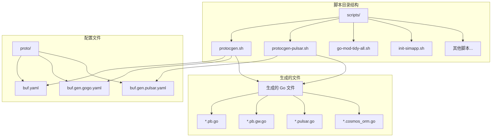
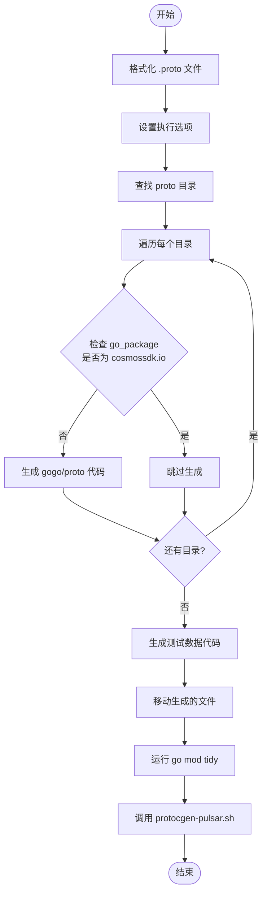
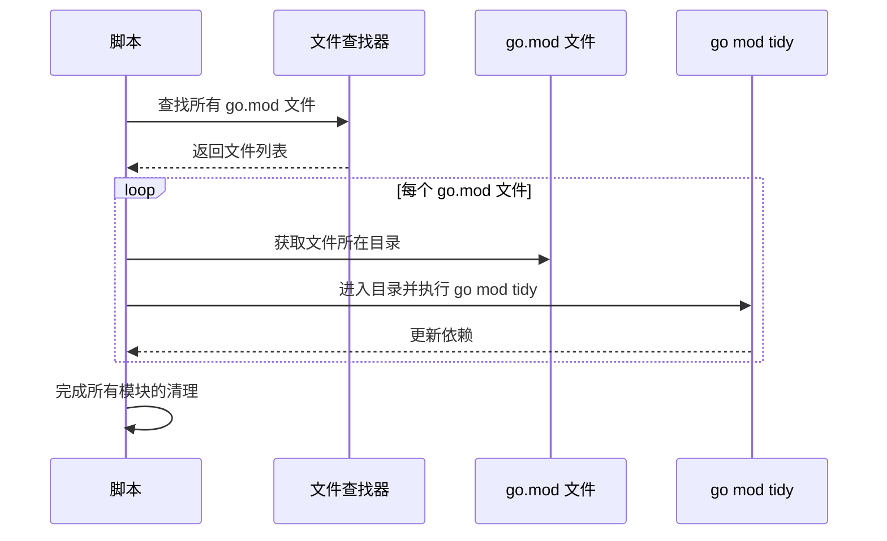
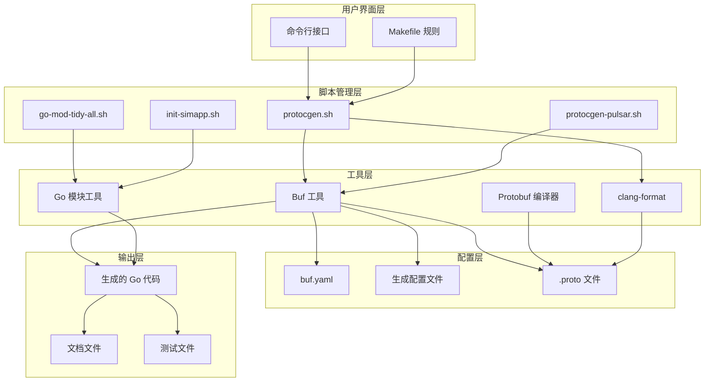
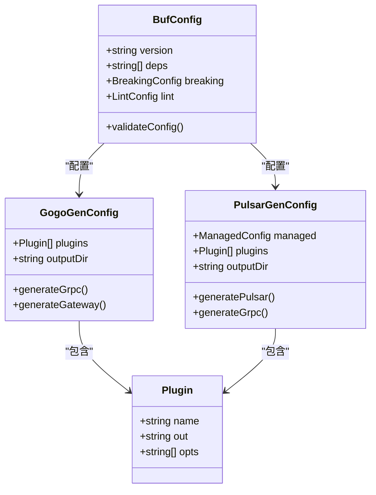
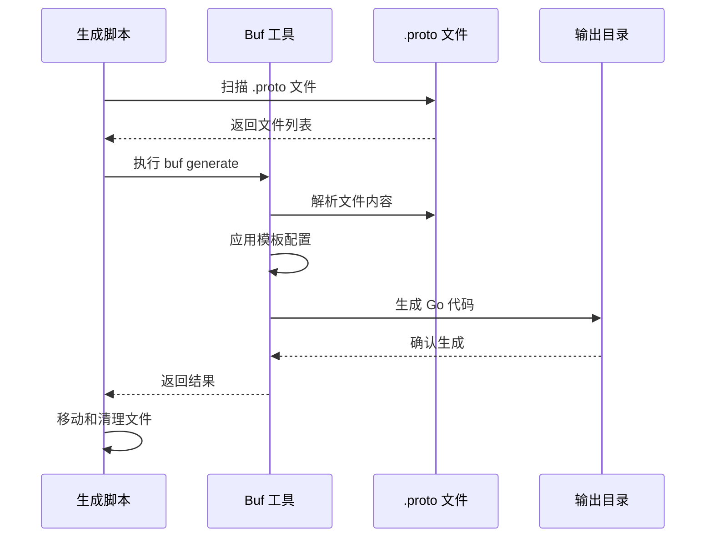
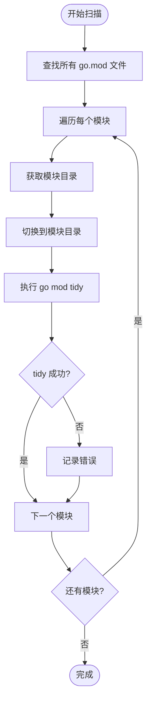
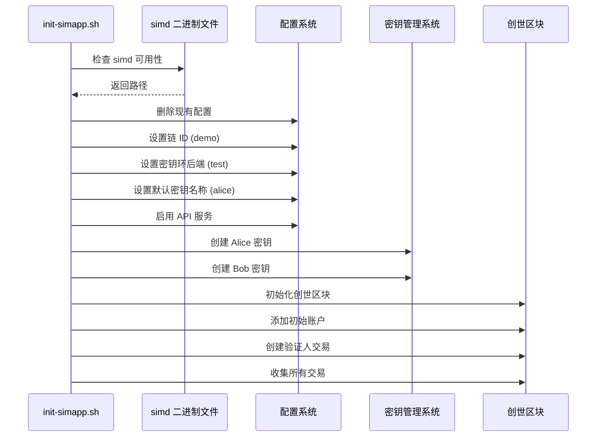
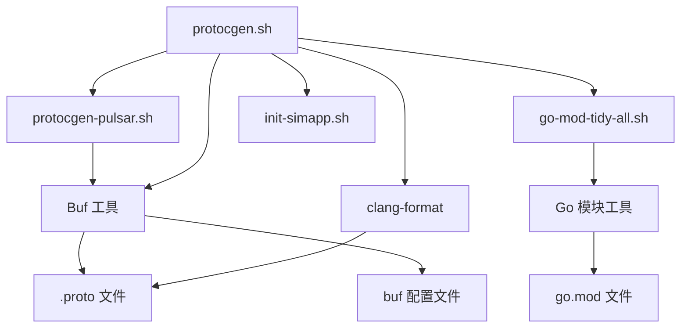

# 开发脚本参考文档

<cite>
**本文档中引用的文件**
- [scripts/protocgen.sh](file://scripts/protocgen.sh)
- [scripts/protocgen-pulsar.sh](file://scripts/protocgen-pulsar.sh)
- [scripts/go-mod-tidy-all.sh](file://scripts/go-mod-tidy-all.sh)
- [scripts/init-simapp.sh](file://scripts/init-simapp.sh)
- [scripts/README.md](file://scripts/README.md)
- [proto/buf.gen.gogo.yaml](file://proto/buf.gen.gogo.yaml)
- [proto/buf.gen.pulsar.yaml](file://proto/buf.gen.pulsar.yaml)
- [proto/buf.yaml](file://proto/buf.yaml)
- [baseapp/testutil/messages.proto](file://baseapp/testutil/messages.proto)
- [client/v2/internal/testpbpulsar/msg.proto](file://client/v2/internal/testpbpulsar/msg.proto)
- [x/tx/Makefile](file://x/tx/Makefile)
</cite>

## 目录
1. [简介](#简介)
2. [项目结构概览](#项目结构概览)
3. [核心脚本分析](#核心脚本分析)
4. [架构概述](#架构概述)
5. [详细组件分析](#详细组件分析)
6. [依赖关系分析](#依赖关系分析)
7. [性能考虑](#性能考虑)
8. [故障排除指南](#故障排除指南)
9. [结论](#结论)

## 简介

Cosmos SDK 的 `scripts/` 目录包含了一系列自动化脚本，用于简化开发流程中的重复性任务。这些脚本主要负责 Protobuf 文件的自动生成、Go 模块依赖管理以及示例应用的初始化。通过使用 `buf` 工具和 Protobuf 编译器（protoc），这些脚本能够自动生成 gRPC、gRPC-Gateway 和 Swagger 文档，同时支持 Pulsar 特定的 Go 代码生成。

## 项目结构概览

**图表来源**
- [scripts/protocgen.sh](file://scripts/protocgen.sh#L1-L40)
- [scripts/protocgen-pulsar.sh](file://scripts/protocgen-pulsar.sh#L1-L14)
- [proto/buf.yaml](file://proto/buf.yaml#L1-L27)

## 核心脚本分析

### protocgen.sh 脚本

`protocgen.sh` 是 Cosmos SDK 中最重要的自动化脚本之一，负责执行主要的 Protobuf 代码生成流程。

#### 主要功能

1. **代码格式化**：使用 clang-format 对所有 `.proto` 文件进行格式化
2. **gogo/proto 代码生成**：基于 `buf.gen.gogo.yaml` 配置生成 gRPC 和 gRPC-Gateway 代码
3. **测试数据生成**：为测试模块生成专用的 Protobuf 代码
4. **文件整理**：将生成的文件移动到正确的位置
5. **依赖清理**：运行 `go mod tidy` 清理依赖
6. **Pulsar 代码生成**：调用 `protocgen-pulsar.sh` 执行 Pulsar 特定的代码生成

#### 执行流程

**图表来源**
- [scripts/protocgen.sh](file://scripts/protocgen.sh#L10-L40)

**章节来源**
- [scripts/protocgen.sh](file://scripts/protocgen.sh#L1-L40)

### protocgen-pulsar.sh 脚本

`protocgen-pulsar.sh` 专门处理基于 `google.golang.org/protobuf` API 的 Protobuf 代码生成。

#### 主要功能

1. **清理旧文件**：删除 API 目录中的旧生成文件
2. **API 模块生成**：为主 API 模块生成代码
3. **测试数据生成**：为测试模块生成 Pulsar 代码
4. **交易模块生成**：为 x/tx 模块生成专用代码

#### 生成的文件类型

| 文件类型 | 描述 | 用途 |
|---------|------|------|
| *.pulsar.go | Pulsar 特定的 Go 代码 | 提供新的 Protobuf API 接口 |
| *.pb.go | 基础 Protobuf 代码 | 底层序列化/反序列化功能 |
| *.cosmos_orm.go | ORM 相关代码 | 数据库操作接口 |
| *.pb.gw.go | gRPC-Gateway 代码 | RESTful API 支持 |

**章节来源**
- [scripts/protocgen-pulsar.sh](file://scripts/protocgen-pulsar.sh#L1-L14)

### go-mod-tidy-all.sh 脚本

该脚本在整个工作区范围内执行 `go mod tidy`，确保所有模块的依赖保持整洁。

#### 执行逻辑

**图表来源**
- [scripts/go-mod-tidy-all.sh](file://scripts/go-mod-tidy-all.sh#L5-L8)

**章节来源**
- [scripts/go-mod-tidy-all.sh](file://scripts/go-mod-tidy-all.sh#L1-L10)

### init-simapp.sh 脚本

`init-simapp.sh` 用于初始化示例应用（simapp），设置开发环境的基本配置。

#### 初始化步骤

1. **二进制文件检查**：验证 `simd` 可执行文件是否存在
2. **配置清理**：删除现有的配置目录
3. **基础配置**：设置链 ID、密钥环后端等基本参数
4. **密钥创建**：生成 Alice 和 Bob 两个测试账户
5. **创世区块**：初始化创世区块并添加初始账户
6. **生成交易**：创建初始验证人交易

**章节来源**
- [scripts/init-simapp.sh](file://scripts/init-simapp.sh#L1-L19)

## 架构概述

Cosmos SDK 的脚本系统采用分层架构设计，通过多个专门的脚本协同工作，实现复杂的代码生成和维护任务。

**图表来源**
- [scripts/protocgen.sh](file://scripts/protocgen.sh#L1-L40)
- [scripts/protocgen-pulsar.sh](file://scripts/protocgen-pulsar.sh#L1-L14)
- [proto/buf.yaml](file://proto/buf.yaml#L1-L27)

## 详细组件分析

### Protobuf 代码生成机制

#### buf 工具配置

Cosmos SDK 使用三个主要的 `buf` 配置文件来控制不同类型的代码生成：

**图表来源**
- [proto/buf.yaml](file://proto/buf.yaml#L1-L27)
- [proto/buf.gen.gogo.yaml](file://proto/buf.gen.gogo.yaml#L1-L9)
- [proto/buf.gen.pulsar.yaml](file://proto/buf.gen.pulsar.yaml#L1-L18)

#### 代码生成流程

**图表来源**
- [scripts/protocgen.sh](file://scripts/protocgen.sh#L12-L24)
- [scripts/protocgen-pulsar.sh](file://scripts/protocgen-pulsar.sh#L8-L14)

**章节来源**
- [proto/buf.gen.gogo.yaml](file://proto/buf.gen.gogo.yaml#L1-L9)
- [proto/buf.gen.pulsar.yaml](file://proto/buf.gen.pulsar.yaml#L1-L18)

### 测试数据生成

#### 多层次测试支持

Cosmos SDK 为不同的测试场景提供了专门的测试数据生成：

| 测试类型 | 生成位置 | 使用场景 |
|---------|----------|----------|
| 基础应用测试 | baseapp/testutil | 基础功能测试 |
| 集成测试 | tests/integration/tx/internal | 交易集成测试 |
| 客户端测试 | testutil/testdata | 客户端功能测试 |
| Pulsar 测试 | client/v2/internal/testpbpulsar | 新 API 测试 |

**章节来源**
- [scripts/protocgen.sh](file://scripts/protocgen.sh#L28-L31)

### 模块依赖管理

#### go mod tidy 自动化

**图表来源**
- [scripts/go-mod-tidy-all.sh](file://scripts/go-mod-tidy-all.sh#L5-L8)

**章节来源**
- [scripts/go-mod-tidy-all.sh](file://scripts/go-mod-tidy-all.sh#L1-L10)

### 示例应用初始化

#### simapp 设置流程

**图表来源**
- [scripts/init-simapp.sh](file://scripts/init-simapp.sh#L7-L19)

**章节来源**
- [scripts/init-simapp.sh](file://scripts/init-simapp.sh#L1-L19)

## 依赖关系分析

### 脚本间依赖关系

**图表来源**
- [scripts/protocgen.sh](file://scripts/protocgen.sh#L1-L40)
- [scripts/protocgen-pulsar.sh](file://scripts/protocgen-pulsar.sh#L1-L14)

### 外部工具依赖

| 工具 | 版本要求 | 用途 | 必需性 |
|------|----------|------|--------|
| Buf | 最新版本 | Protobuf 代码生成 | 必需 |
| Protoc | 兼容版本 | 基础 Protobuf 编译 | 必需 |
| clang-format | 任意版本 | 代码格式化 | 可选 |
| go | 1.19+ | Go 模块管理 | 必需 |
| docker | 任意版本 | 容器化构建（可选） | 可选 |

**章节来源**
- [scripts/protocgen.sh](file://scripts/protocgen.sh#L3-L5)

## 性能考虑

### 并行执行优化

虽然当前脚本主要是串行执行，但可以通过以下方式优化性能：

1. **并行代码生成**：多个 `.proto` 目录可以并行处理
2. **增量更新**：只重新生成修改过的文件
3. **缓存机制**：缓存编译结果避免重复计算

### 内存使用优化

- **流式处理**：对大型 `.proto` 文件采用流式处理
- **临时文件管理**：及时清理中间生成的临时文件
- **内存限制**：为容器化执行设置内存限制

## 故障排除指南

### 常见问题及解决方案

#### 1. Buf 工具相关问题

**问题**：`buf` 命令未找到
**解决方案**：
- 确保已安装 Buf 工具
- 检查 PATH 环境变量
- 使用 Docker 容器执行脚本

**问题**：buf 配置文件解析失败
**解决方案**：
- 验证 YAML 语法正确性
- 检查依赖项版本兼容性
- 使用 `buf lint` 验证配置

#### 2. 代码生成问题

**问题**：生成的代码不符合预期
**解决方案**：
- 检查 `.proto` 文件语法
- 验证 `buf.gen.*.yaml` 配置
- 查看详细的错误日志

**问题**：文件权限问题
**解决方案**：
- 确保脚本具有执行权限
- 检查输出目录写入权限
- 使用 `sudo` 或调整文件权限

#### 3. 依赖管理问题

**问题**：`go mod tidy` 失败
**解决方案**：
- 检查网络连接
- 清理模块缓存：`go clean -modcache`
- 手动修复依赖冲突

**章节来源**
- [scripts/README.md](file://scripts/README.md#L1-L28)

## 结论

Cosmos SDK 的 `scripts/` 目录提供了一套完整而高效的自动化脚本系统，通过精心设计的分层架构和模块化设计，实现了复杂 Protobuf 代码生成、依赖管理和开发环境初始化的自动化。这些脚本不仅简化了开发流程，还确保了代码质量和一致性。

### 关键优势

1. **自动化程度高**：减少手动操作，降低出错概率
2. **模块化设计**：每个脚本专注于特定任务，便于维护和扩展
3. **工具链完整**：整合了 Buf、Protobuf、Go 等多种工具
4. **灵活性强**：支持多种配置和定制需求

### 最佳实践建议

1. **定期运行**：在每次重要更改后运行代码生成脚本
2. **版本控制**：将生成的代码纳入版本控制
3. **监控依赖**：定期检查和更新外部工具版本
4. **文档维护**：保持脚本文档与实际功能同步

通过合理使用这些脚本，开发者可以显著提高开发效率，专注于业务逻辑而非基础设施配置。