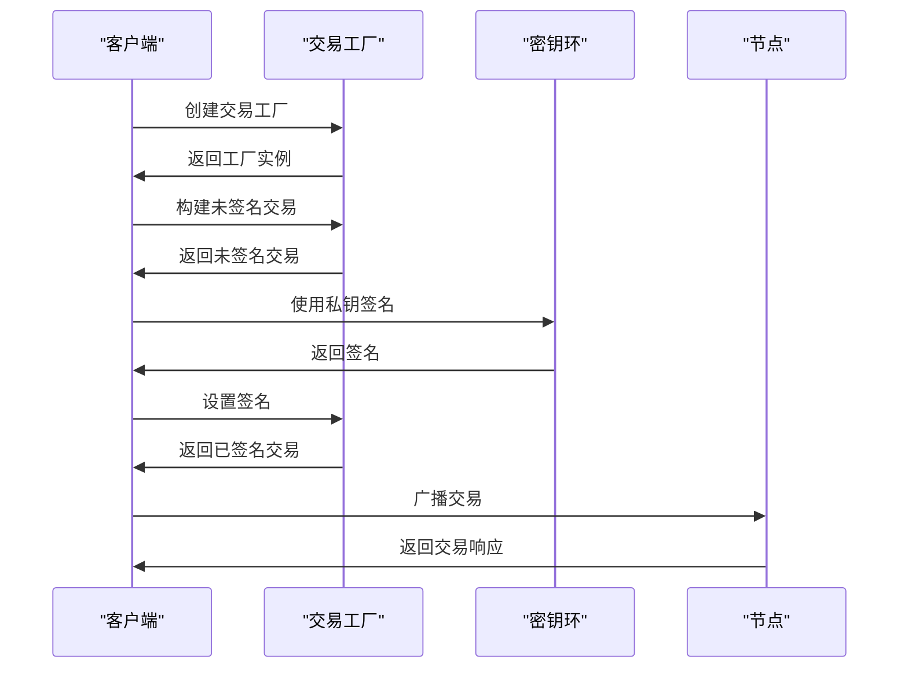
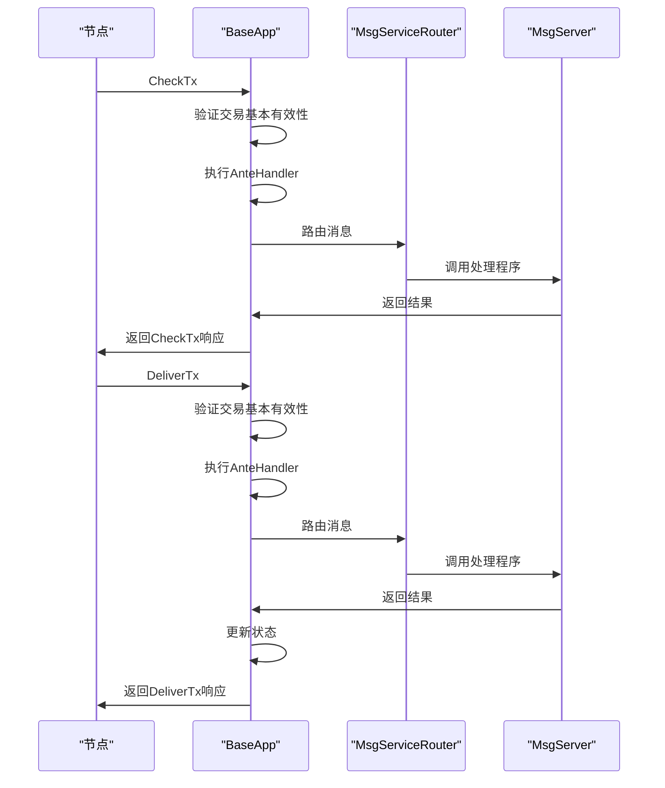
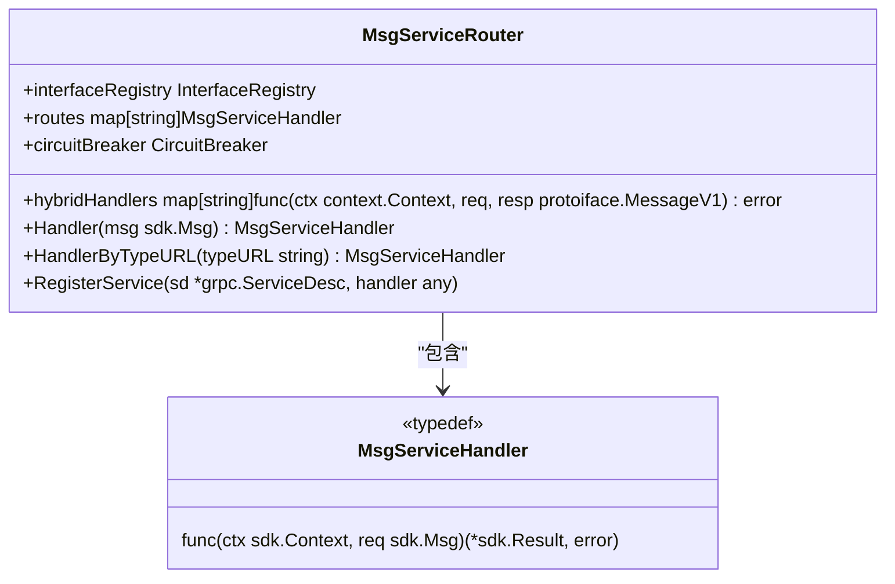
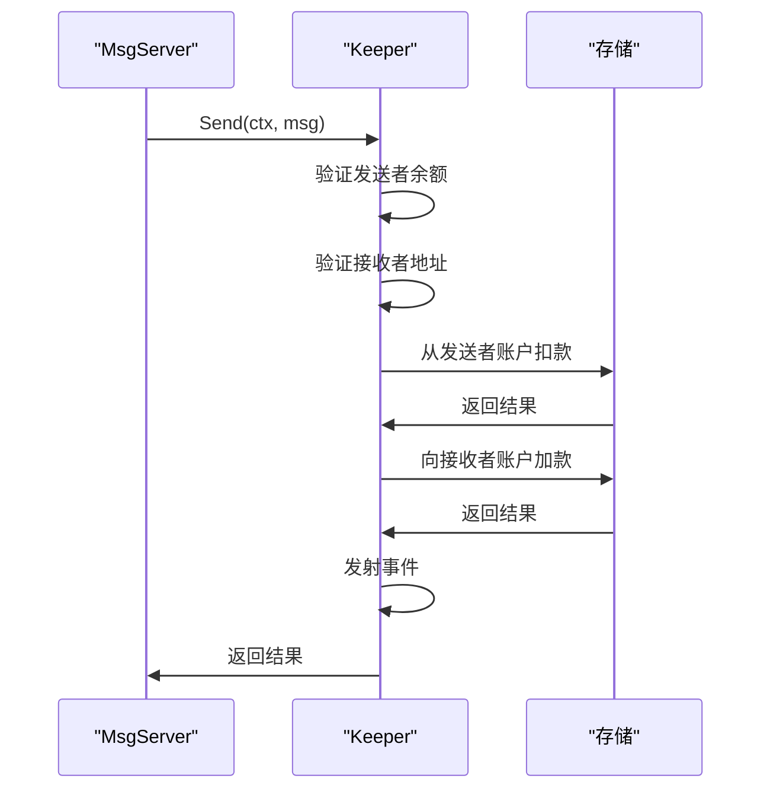
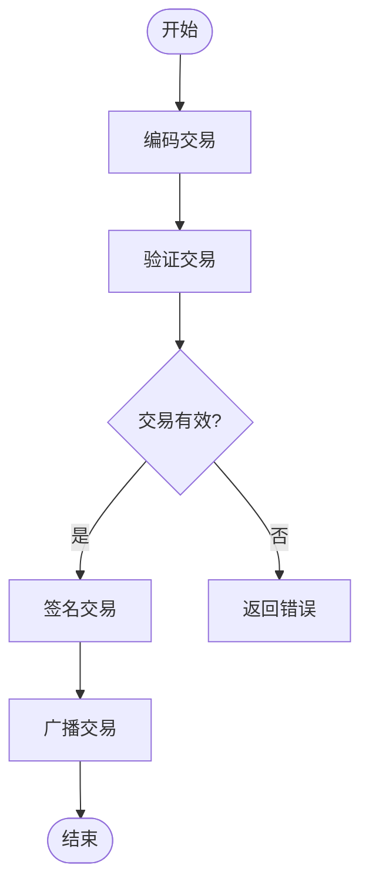
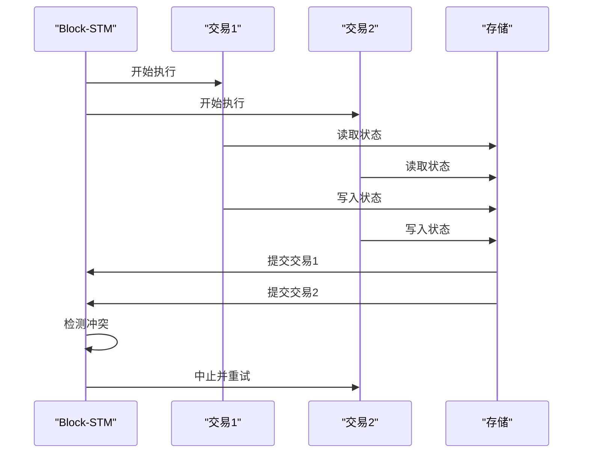

# 交易处理

<cite>
**本文档引用的文件**   
- [tx.go](file://client/tx/tx.go)
- [abci.go](file://baseapp/abci.go)
- [msg_service_router.go](file://baseapp/msg_service_router.go)
- [msg_service.go](file://types/msgservice/msg_service.go)
- [keeper.go](file://x/bank/keeper/keeper.go)
- [send.go](file://x/bank/keeper/send.go)
- [tx.pb.go](file://x/bank/types/tx.pb.go)
</cite>

## 目录
1. [简介](#简介)
2. [客户端交易构建与提交](#客户端交易构建与提交)
3. [服务端交易处理](#服务端交易处理)
4. [MsgServiceRouter路由机制](#msgservicerouter路由机制)
5. [x/bank模块的Send消息处理](#xbank模块的send消息处理)
6. [交易编码与验证](#交易编码与验证)
7. [高级特性](#高级特性)
8. [结论](#结论)

## 简介
本文档详尽描述了Cosmos SDK中一笔交易的完整生命周期。从客户端使用`client/tx`包构建并签名交易开始，到通过gRPC或CLI提交。在服务端，解释`BaseApp`如何通过ABCI接口接收交易，并在`CheckTx`和`DeliverTx`阶段进行验证和执行。重点剖析`MsgServiceRouter`如何根据`Msg`的`TypeURL`将请求路由到正确的`MsgServer`实现。使用`x/bank`的`Send`消息作为实例，展示从`MsgSend`定义、`Server.Send`方法实现到状态更新的全过程。涵盖交易的编码（Proto/JSON）、签名验证、费用扣除和事件发射等关键环节，并讨论反重放保护和非顺序执行（Block-STM）等高级特性。

## 客户端交易构建与提交
在Cosmos SDK中，客户端交易的构建和提交主要通过`client/tx`包完成。该包提供了`GenerateOrBroadcastTxCLI`和`BroadcastTx`等函数，用于生成、签名和广播交易。

**Diagram sources**
- [tx.go](file://client/tx/tx.go#L26-L145)

**Section sources**
- [tx.go](file://client/tx/tx.go#L26-L145)

## 服务端交易处理
服务端的交易处理由`BaseApp`结构体负责，它通过ABCI接口接收交易。`BaseApp`实现了ABCI的`CheckTx`和`DeliverTx`方法，分别用于交易的验证和执行。

**Diagram sources**
- [abci.go](file://baseapp/abci.go#L338-L379)
- [baseapp.go](file://baseapp/baseapp.go#L775-L969)

**Section sources**
- [abci.go](file://baseapp/abci.go#L338-L379)
- [baseapp.go](file://baseapp/baseapp.go#L775-L969)

## MsgServiceRouter路由机制
`MsgServiceRouter`是Cosmos SDK中用于路由消息的核心组件。它根据消息的`TypeURL`将请求路由到正确的`MsgServer`实现。

**Diagram sources**
- [msg_service_router.go](file://baseapp/msg_service_router.go#L28-L222)

**Section sources**
- [msg_service_router.go](file://baseapp/msg_service_router.go#L28-L222)

## x/bank模块的Send消息处理
以`x/bank`模块的`Send`消息为例，展示从`MsgSend`定义到状态更新的完整过程。

**Diagram sources**
- [send.go](file://x/bank/keeper/send.go#L224-L248)
- [keeper.go](file://x/bank/keeper/keeper.go#L137-L180)

**Section sources**
- [send.go](file://x/bank/keeper/send.go#L224-L248)
- [keeper.go](file://x/bank/keeper/keeper.go#L137-L180)

## 交易编码与验证
交易的编码和验证是确保交易安全性和一致性的关键环节。Cosmos SDK使用Proto编码，并通过`ValidateBasic`方法进行基本验证。

**Diagram sources**
- [tx.pb.go](file://x/bank/types/tx.pb.go#L36-L41)
- [send.go](file://x/bank/keeper/send.go#L225-L227)

**Section sources**
- [tx.pb.go](file://x/bank/types/tx.pb.go#L36-L41)
- [send.go](file://x/bank/keeper/send.go#L225-L227)

## 高级特性
### 反重放保护
Cosmos SDK通过序列号（sequence）和账户编号（account number）来防止交易重放。每个交易都必须包含正确的序列号，服务器会验证序列号的正确性。

### 非顺序执行（Block-STM）
Block-STM是一种乐观执行模型，允许交易在不按顺序的情况下执行，从而提高吞吐量。它通过版本控制和冲突检测来确保最终一致性。

**Diagram sources**
- [blockstm](file://blockstm)
- [oe](file://baseapp/oe)

**Section sources**
- [blockstm](file://blockstm)
- [oe](file://baseapp/oe)

## 结论
本文档详细描述了Cosmos SDK中交易的完整生命周期，从客户端构建到服务端处理，涵盖了关键组件和高级特性。通过理解这些机制，开发者可以更好地设计和实现基于Cosmos SDK的应用程序。