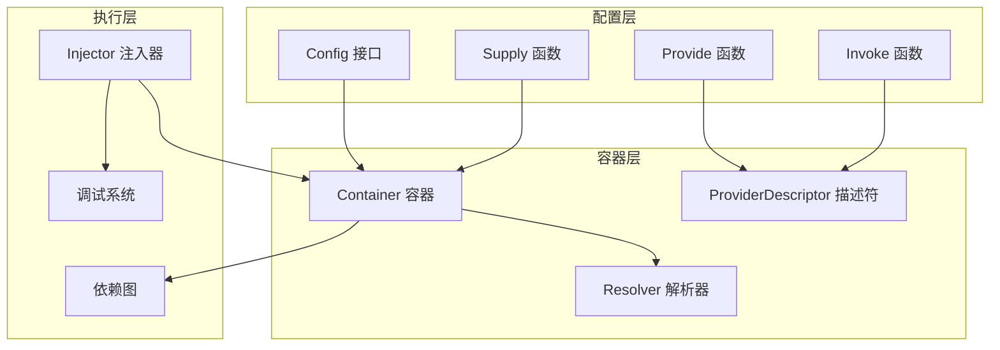
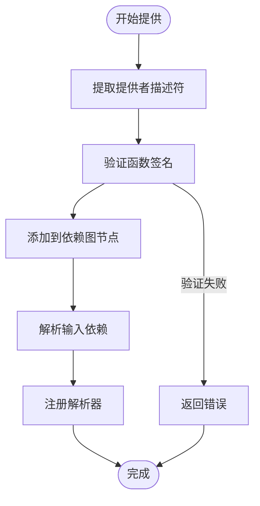
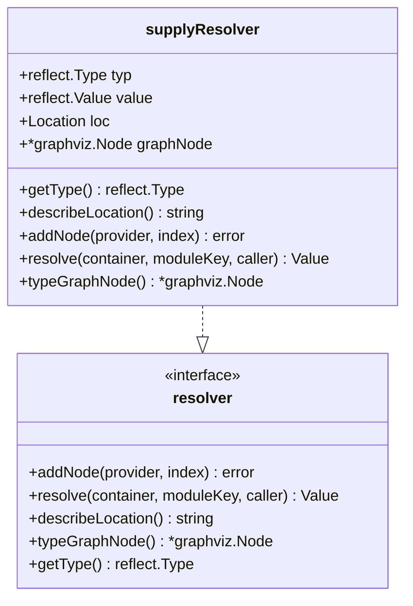
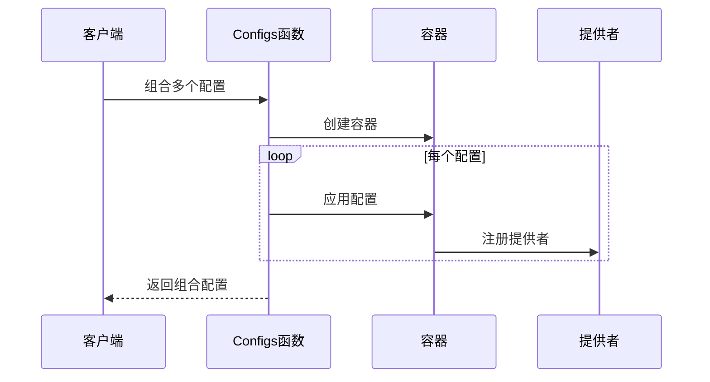
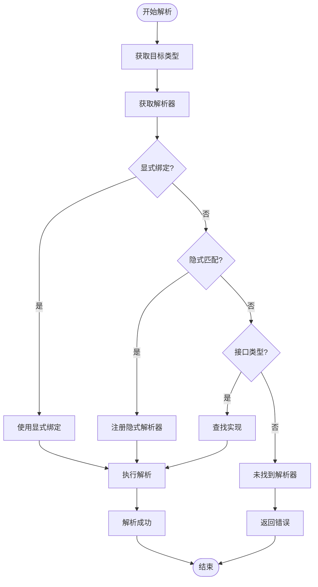
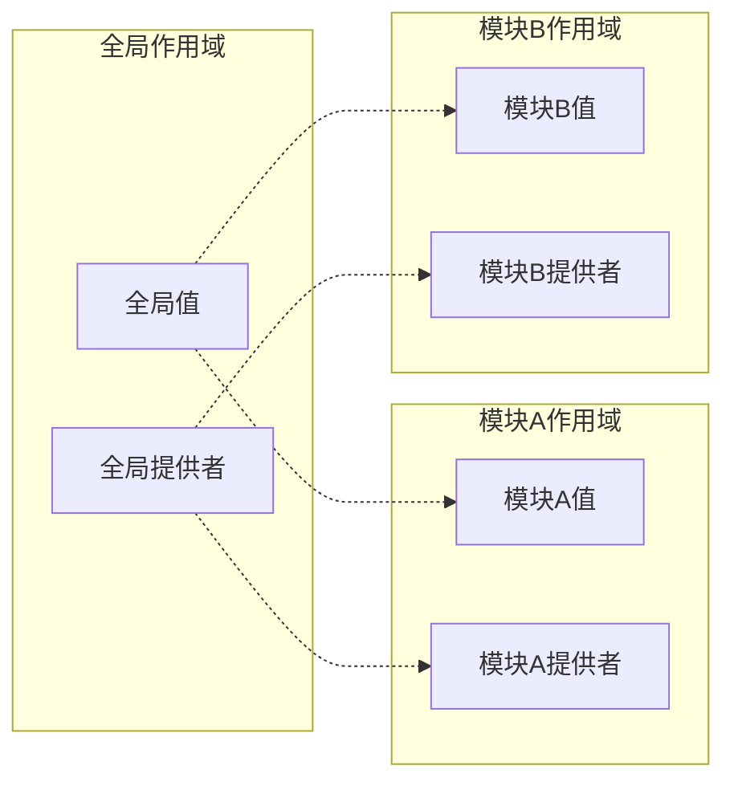
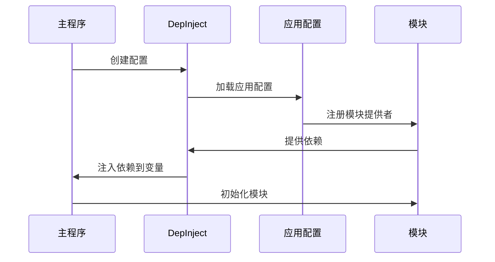
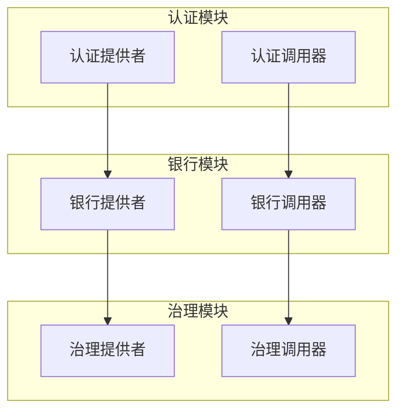
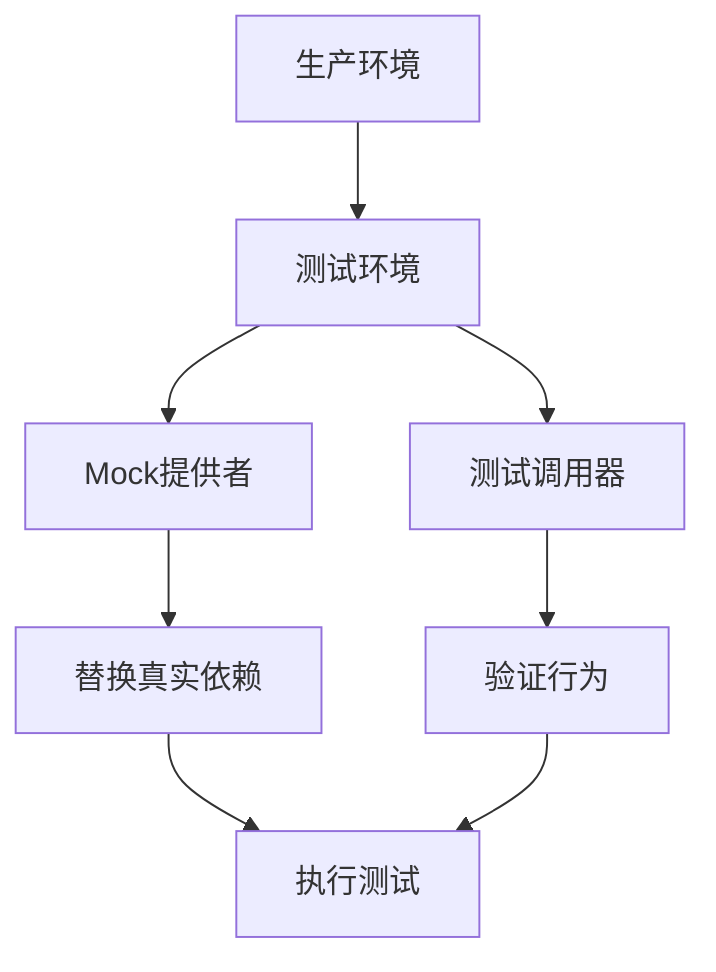
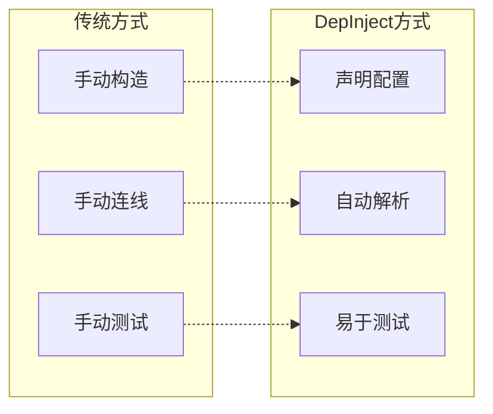

# 依赖注入

<cite>
**本文档中引用的文件**
- [depinject/config.go](file://depinject/config.go)
- [depinject/container.go](file://depinject/container.go)
- [depinject/supply.go](file://depinject/supply.go)
- [depinject/inject.go](file://depinject/inject.go)
- [depinject/provider_desc.go](file://depinject/provider_desc.go)
- [depinject/resolver.go](file://depinject/resolver.go)
- [simapp/app_di.go](file://simapp/app_di.go)
- [simapp/app_config.go](file://simapp/app_config.go)
- [depinject/invoke_test.go](file://depinject/invoke_test.go)
</cite>

## 目录
1. [简介](#简介)
2. [核心概念](#核心概念)
3. [架构概览](#架构概览)
4. [关键函数详解](#关键函数详解)
5. [配置系统](#配置系统)
6. [依赖解析机制](#依赖解析机制)
7. [实际应用示例](#实际应用示例)
8. [测试中的依赖替换](#测试中的依赖替换)
9. [与传统依赖注入的对比](#与传统依赖注入的对比)
10. [最佳实践](#最佳实践)
11. [总结](#总结)

## 简介

`depinject`是Cosmos SDK中一个强大的依赖注入框架，它采用声明式的方式定义组件依赖关系，替代了传统的手动构造方式。该框架通过`depinject.Config`来声明式地管理复杂的依赖图，为区块链应用提供了灵活且可维护的依赖管理解决方案。

`depinject`的核心优势在于：
- **声明式配置**：通过`Provide`、`Invoke`和`Supply`等函数声明依赖关系
- **自动解析**：智能的依赖解析算法，支持循环依赖检测和错误处理
- **模块化设计**：支持模块级别的依赖隔离和作用域管理
- **接口绑定**：灵活的接口类型解析，实现组件解耦
- **可视化调试**：内置的图形化依赖关系可视化功能

## 核心概念

### 依赖注入基础

依赖注入（Dependency Injection）是一种设计模式，用于实现控制反转（IoC）。在`depinject`中，依赖注入通过以下三种主要方式实现：

1. **提供者（Provider）**：负责提供依赖的函数
2. **调用器（Invoker）**：在依赖解析完成后执行的函数
3. **供应者（Supplier）**：直接提供具体值的机制

### 类型系统

`depinject`支持多种类型的依赖关系：

- **简单类型**：基本数据类型和结构体
- **接口类型**：抽象接口，支持多态实现
- **模块类型**：特定模块范围内的单例
- **组类型**：模块范围内的映射集合

## 架构概览



**图表来源**
- [depinject/config.go](file://depinject/config.go#L10-L196)
- [depinject/container.go](file://depinject/container.go#L12-L562)

**章节来源**
- [depinject/config.go](file://depinject/config.go#L1-L196)
- [depinject/container.go](file://depinject/container.go#L1-L562)

## 关键函数详解

### Provide 函数

`Provide`函数是`depinject`中最核心的函数之一，用于注册依赖提供者函数。



**图表来源**
- [depinject/config.go](file://depinject/config.go#L22-L26)
- [depinject/container.go](file://depinject/container.go#L210-L337)

**主要特性**：
- 支持多个提供者函数同时注册
- 自动验证函数签名和导出状态
- 检查类型导出性和包路径合规性
- 处理可选参数和忽略参数

### Invoke 函数

`Invoke`函数用于注册在依赖解析完成后执行的调用器函数。

**特点**：
- 调用器函数没有输出参数
- 所有输入参数都被标记为可选
- 在依赖图构建完成后按顺序执行
- 支持错误返回但不传递给后续调用器

### Supply 函数

`Supply`函数提供了一种直接注入具体值的方式。



**图表来源**
- [depinject/supply.go](file://depinject/supply.go#L9-L36)
- [depinject/resolver.go](file://depinject/resolver.go#L9-L16)

**章节来源**
- [depinject/config.go](file://depinject/config.go#L149-L160)
- [depinject/inject.go](file://depinject/inject.go#L1-L83)

## 配置系统

### Config 接口

`Config`接口是`depinject`配置系统的核心抽象，所有配置操作都通过其实现。

```mermaid
classDiagram
class Config {
<<interface>>
+apply(*container) error
}
class containerConfig {
+func(*container) error
+apply(*container) error
}
class debugConfig {
+logf(format string, args ...interface{})
+indentLogger()
+dedentLogger()
+generateGraph()
}
containerConfig ..|> Config
debugConfig --> containerConfig
```

**图表来源**
- [depinject/config.go](file://depinject/config.go#L10-L196)

### 配置组合

`Configs`函数允许将多个配置组合成单一配置：



**图表来源**
- [depinject/config.go](file://depinject/config.go#L170-L181)

**章节来源**
- [depinject/config.go](file://depinject/config.go#L170-L181)

## 依赖解析机制

### 类型匹配算法

`depinject`的依赖解析基于反射和类型匹配算法：



**图表来源**
- [depinject/container.go](file://depinject/container.go#L99-L175)

### 作用域管理

`depinject`支持两种作用域：

1. **全局作用域**：在整个应用范围内可用
2. **模块作用域**：仅在指定模块内可用



### 错误处理

`depinject`提供了完善的错误处理机制：

- **循环依赖检测**：自动检测并报告循环依赖
- **类型不匹配**：报告类型不兼容错误
- **缺失依赖**：报告无法解析的依赖
- **重复定义**：检测并报告重复的提供者

**章节来源**
- [depinject/container.go](file://depinject/container.go#L99-L175)
- [depinject/container.go](file://depinject/container.go#L375-L425)

## 实际应用示例

### SimApp 应用示例

以`simapp`为例，展示如何使用`depinject`配置整个应用的依赖关系：



**图表来源**
- [simapp/app_di.go](file://simapp/app_di.go#L108-L158)
- [simapp/app_di.go](file://simapp/app_di.go#L158-L178)

### BaseApp 和核心组件

在`simapp`中，`BaseApp`和核心组件的依赖关系配置展示了框架的强大能力：

| 组件 | 类型 | 作用域 | 依赖关系 |
|------|------|--------|----------|
| BaseApp | 结构体 | 全局 | 存储、日志、编码器 |
| AccountKeeper | 接口 | 全局 | BaseApp、存储 |
| BankKeeper | 结构体 | 全局 | AccountKeeper、存储 |
| StakingKeeper | 结构体 | 全局 | BankKeeper、存储 |
| GovKeeper | 结构体 | 全局 | AccountKeeper、BankKeeper |

### 模块化配置



**图表来源**
- [simapp/app_config.go](file://simapp/app_config.go#L87-L271)

**章节来源**
- [simapp/app_di.go](file://simapp/app_di.go#L108-L178)
- [simapp/app_config.go](file://simapp/app_config.go#L87-L271)

## 测试中的依赖替换

### Mock 对象集成

`depinject`在测试环境中特别有用，可以轻松替换生产环境的依赖：



**图表来源**
- [depinject/invoke_test.go](file://depinject/invoke_test.go#L32-L85)

### 测试配置示例

测试中常见的依赖替换模式：

1. **接口替换**：用Mock实现替换真实接口
2. **值替换**：直接替换具体的值
3. **行为替换**：修改提供者的返回行为

**章节来源**
- [depinject/invoke_test.go](file://depinject/invoke_test.go#L32-L85)

## 与传统依赖注入的对比

### 优势对比

| 特性 | 传统方式 | DepInject |
|------|----------|-----------|
| 配置方式 | 手动构造 | 声明式配置 |
| 循环依赖 | 难以处理 | 自动检测 |
| 类型安全 | 编译时检查 | 运行时验证 |
| 可视化 | 无 | 内置图形化 |
| 模块化 | 有限 | 完整支持 |

### 实现差异



### 性能考虑

`depinject`在性能方面做了以下优化：

- **延迟初始化**：只在需要时才创建对象
- **缓存机制**：缓存解析结果避免重复计算
- **类型检查优化**：使用反射缓存提高效率

## 最佳实践

### 配置组织

1. **模块化配置**：按模块组织提供者和调用器
2. **清晰命名**：使用有意义的函数名和模块名
3. **文档注释**：为每个提供者添加适当的注释

### 错误处理

1. **早期验证**：在应用启动时验证所有依赖
2. **详细错误信息**：提供有助于调试的错误消息
3. **优雅降级**：为可选依赖提供默认值

### 性能优化

1. **避免过度依赖**：减少不必要的依赖关系
2. **合理使用模块作用域**：根据需要选择合适的作用域
3. **缓存频繁使用的对象**：利用模块作用域缓存

### 测试策略

1. **隔离测试**：使用依赖替换进行单元测试
2. **集成测试**：验证完整的依赖链
3. **性能测试**：监控依赖注入的性能影响

## 总结

`depinject`框架为Cosmos SDK提供了一个强大而灵活的依赖注入解决方案。通过声明式的配置方式，它解决了传统手动构造方式面临的复杂依赖管理问题。框架的核心优势包括：

- **声明式配置**：通过`Provide`、`Invoke`和`Supply`函数实现简洁的依赖声明
- **智能解析**：自动处理复杂的依赖关系和类型匹配
- **模块化支持**：完整的模块作用域管理和依赖隔离
- **调试友好**：内置的可视化和错误诊断功能
- **测试便利**：易于进行依赖替换和模拟

在区块链应用开发中，`depinject`特别适合处理复杂的模块间依赖关系，特别是在需要高度模块化和可扩展性的场景下。通过合理的配置和使用最佳实践，开发者可以构建出既灵活又可靠的依赖管理系统。

随着Cosmos SDK生态系统的不断发展，`depinject`将继续发挥重要作用，为构建去中心化应用提供坚实的基础设施支持。