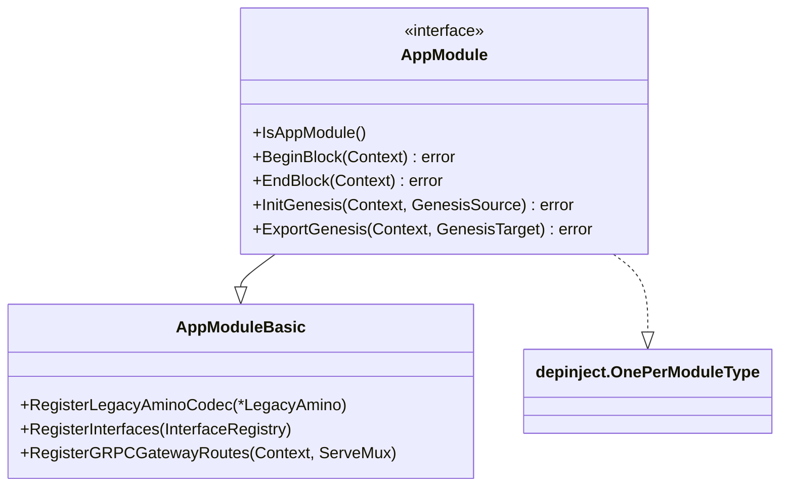
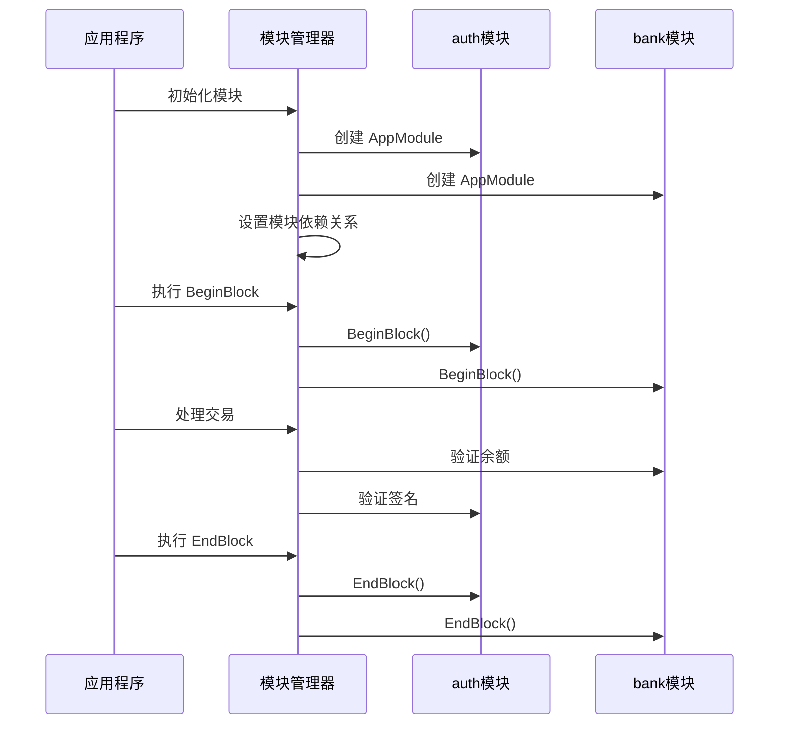
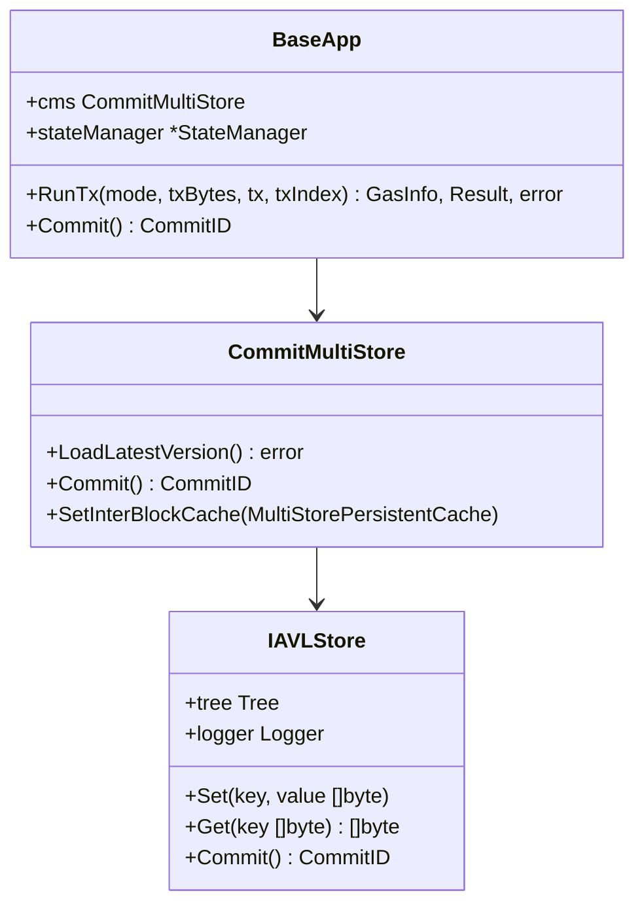
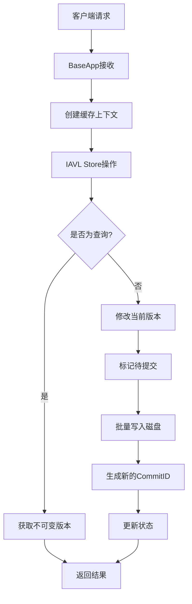
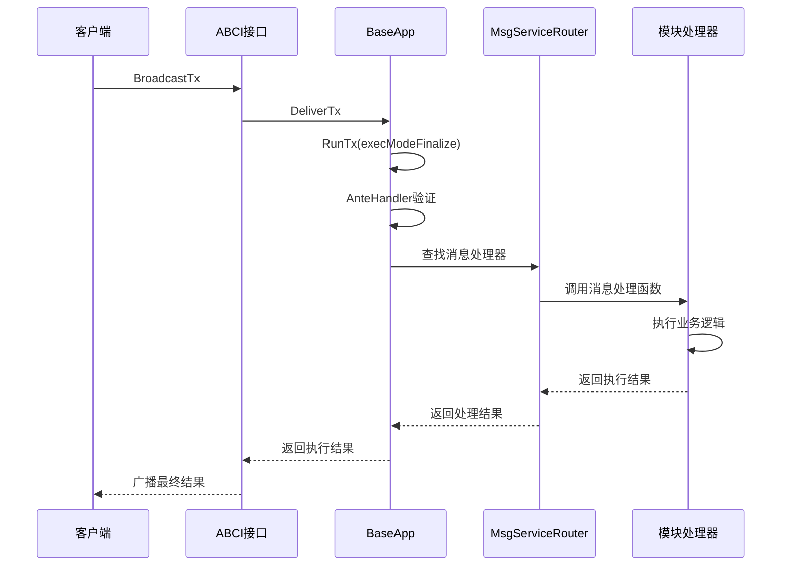
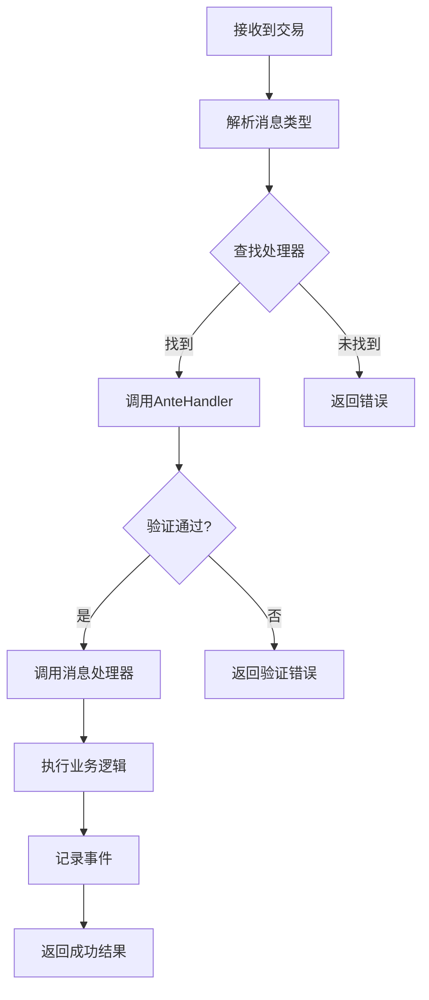
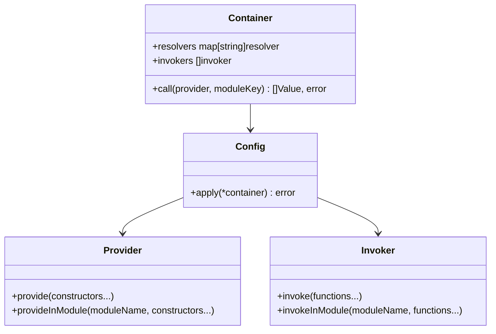
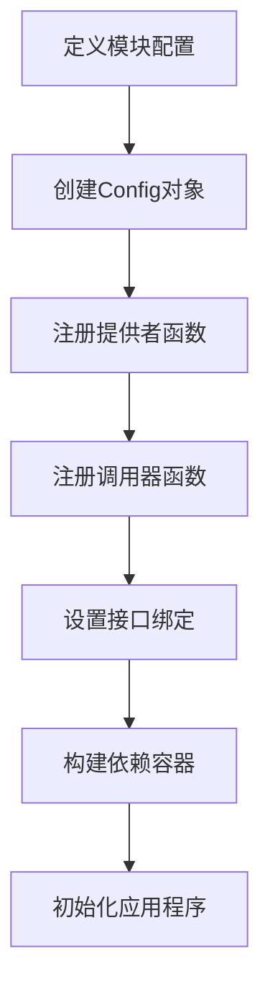
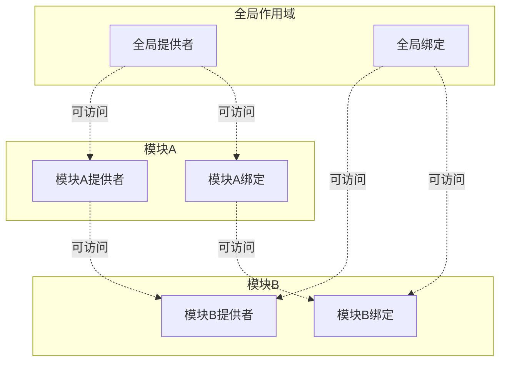

# Cosmos SDK 核心概念

<cite>
**本文档中引用的文件**
- [baseapp/baseapp.go](file://baseapp/baseapp.go)
- [baseapp/msg_service_router.go](file://baseapp/msg_service_router.go)
- [baseapp/abci.go](file://baseapp/abci.go)
- [store/iavl/store.go](file://store/iavl/store.go)
- [depinject/config.go](file://depinject/config.go)
- [depinject/container.go](file://depinject/container.go)
- [depinject/appconfig/config.go](file://depinject/appconfig/config.go)
- [simapp/app.go](file://simapp/app.go)
- [core/appmodule/module.go](file://core/appmodule/module.go)
- [types/module/module.go](file://types/module/module.go)
</cite>

## 目录
1. [引言](#引言)
2. [模块化架构](#模块化架构)
3. [状态管理](#状态管理)
4. [交易处理](#交易处理)
5. [依赖注入](#依赖注入)
6. [总结](#总结)

## 引言

Cosmos SDK 是一个强大的区块链应用开发框架，其设计围绕四个核心概念构建：模块化架构、状态管理、交易处理和依赖注入。这些概念共同构成了一个可扩展、可维护且高度模块化的区块链应用平台。

## 模块化架构

### AppModule 接口概述

Cosmos SDK 的模块化架构以 `AppModule` 接口为核心，该接口允许功能模块实现即插即用的特性。`AppModule` 接口定义了模块的基本行为和生命周期方法。

**图表来源**
- [core/appmodule/module.go](file://core/appmodule/module.go#L14-L19)
- [types/module/module.go](file://types/module/module.go#L202-L206)

### 模块接口层次结构

模块系统采用分层设计，包含以下核心接口：

| 接口类型 | 功能描述 | 实现要求 |
|---------|---------|---------|
| `AppModuleBasic` | 基础非依赖功能 | 注册编解码器、接口、gRPC路由 |
| `AppModule` | 依赖模块功能 | 实现生命周期方法如 BeginBlock、EndBlock |
| `HasGenesis` | 创世状态管理 | 实现 InitGenesis 和 ExportGenesis |
| `HasServices` | 服务注册 | 实现 RegisterServices 方法 |

### auth 和 bank 模块示例

以 `auth` 和 `bank` 模块为例展示模块化架构的应用：

**节来源**
- [simapp/app.go](file://simapp/app.go#L126-L166)

## 状态管理

### BaseApp 与 Store 包交互

BaseApp 通过 Store 包实现高效的状态管理，其中 IAVL 树是核心的数据结构。

**图表来源**
- [baseapp/baseapp.go](file://baseapp/baseapp.go#L62-L167)
- [store/iavl/store.go](file://store/iavl/store.go#L36-L42)

### IAVL 树持久化机制

IAVL 树提供了高效的键值存储和版本控制功能：

**节来源**
- [store/iavl/store.go](file://store/iavl/store.go#L130-L144)

## 交易处理

### 完整交易生命周期

从客户端提交交易到 BaseApp 路由执行的完整流程：

**图表来源**
- [baseapp/abci.go](file://baseapp/abci.go#L140-L200)
- [baseapp/msg_service_router.go](file://baseapp/msg_service_router.go#L53-L62)

### MsgServiceRouter 路由机制

消息服务路由器负责将交易中的消息路由到相应的处理器：

**节来源**
- [baseapp/msg_service_router.go](file://baseapp/msg_service_router.go#L170-L209)

## 依赖注入

### depinject 框架概述

Cosmos SDK 使用 depinject 框架简化应用构建过程，避免复杂的构造函数依赖管理。

**图表来源**
- [depinject/container.go](file://depinject/container.go#L12-L24)
- [depinject/config.go](file://depinject/config.go#L10-L13)

### 配置示例

以下是使用 `depinject.Config` 的典型配置示例：

**节来源**
- [depinject/config.go](file://depinject/config.go#L15-L42)
- [depinject/appconfig/config.go](file://depinject/appconfig/config.go#L67-L164)

### 模块化依赖管理

依赖注入系统支持模块级别的依赖管理：

## 总结

Cosmos SDK 的四个核心概念形成了一个强大而灵活的区块链应用开发框架：

1. **模块化架构**：通过 `AppModule` 接口实现功能模块的即插即用，支持独立开发和部署
2. **状态管理**：利用 IAVL 树提供高效、持久化的状态存储和版本控制
3. **交易处理**：完整的交易生命周期管理，从客户端提交到最终执行
4. **依赖注入**：简化复杂应用的依赖管理，提高代码的可测试性和可维护性

这些概念相互协作，为开发者提供了一个既强大又易于使用的区块链应用开发平台。通过理解和掌握这些核心概念，开发者可以构建出高质量、可扩展的区块链应用程序。