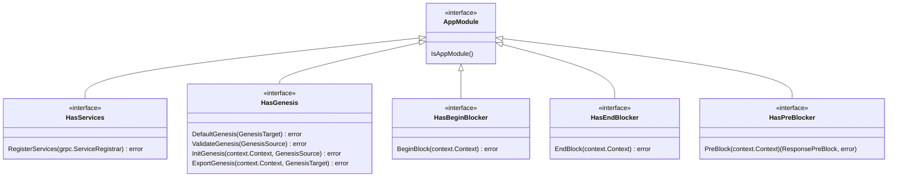
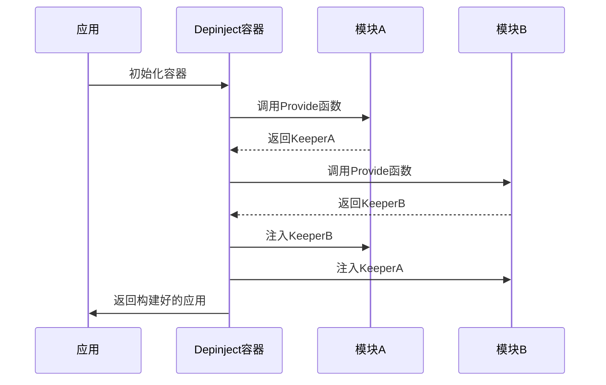
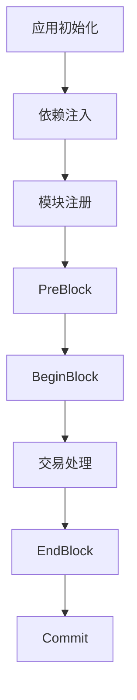

# 模块化架构

<cite>
**本文档中引用的文件**   
- [module.go](file://core/appmodule/module.go)
- [module.go](file://runtime/module.go)
- [README.md](file://core/appmodule/README.md)
- [01-module-manager.md](file://docs/docs/build/building-modules/01-module-manager.md)
- [adr-063-core-module-api.md](file://docs/architecture/adr-063-core-module-api.md)
- [container.go](file://depinject/container.go)
- [register.go](file://core/appmodule/register.go)
- [module.go](file://types/module/module.go)
</cite>

## 目录
1. [引言](#引言)
2. [AppModule接口与即插即用设计](#appmodule接口与即插即用设计)
3. [依赖注入与depinject机制](#依赖注入与depinject机制)
4. [模块生命周期](#模块生命周期)
5. [auth与bank模块示例分析](#auth与bank模块示例分析)
6. [创建自定义模块](#创建自定义模块)
7. [模块间通信](#模块间通信)
8. [模块版本化与升级策略](#模块版本化与升级策略)
9. [结论](#结论)

## 引言
Cosmos SDK的模块化架构设计是其核心优势之一，它允许开发者以即插即用的方式构建和组合区块链应用。该架构通过`AppModule`接口、依赖注入（depinject）和清晰的生命周期管理，实现了模块间的松耦合和高内聚。这种设计不仅简化了应用的构建过程，还增强了系统的可维护性和可扩展性。

**Section sources**
- [01-module-manager.md](file://docs/docs/build/building-modules/01-module-manager.md#L16-L25)

## AppModule接口与即插即用设计
`AppModule`接口是Cosmos SDK模块化设计的基石，它作为一个标记接口（tag interface），为所有应用模块提供了一个统一的基类。任何有效的应用模块都应实现此接口，以便其他模块（通常通过依赖注入）能够识别其为应用模块。



**Diagram sources**
- [module.go](file://core/appmodule/module.go#L11-L97)

`AppModule`接口本身不提供任何功能，它通过一系列扩展接口来定义模块的具体功能：
- **`HasServices`**: 用于注册在`.proto`文件中定义的服务实现，如gRPC查询服务和交易消息服务。
- **`HasGenesis`**: 包含与创世状态相关的功能，如`DefaultGenesis`、`ValidateGenesis`、`InitGenesis`和`ExportGenesis`。`ExportGenesis`方法在导出状态时执行，用于创建最新的模块状态子集的`GenesisState`，主要用于链的硬分叉升级。
- **`HasBeginBlocker`**: 在每个区块的交易处理前执行自定义逻辑。
- **`HasEndBlocker`**: 在每个区块的交易处理后执行自定义逻辑。
- **`HasPreBlocker`**: 在`BeginBlock`之前执行，可以修改共识参数。

这种接口分离的设计使得模块只需实现所需的功能，避免了大量不必要的占位函数，从而实现了真正的即插即用。

**Section sources**
- [module.go](file://core/appmodule/module.go#L11-L97)
- [adr-063-core-module-api.md](file://docs/architecture/adr-063-core-module-api.md#L194-L446)
- [01-module-manager.md](file://docs/docs/build/building-modules/01-module-manager.md#L31-L47)

## 依赖注入与depinject机制
Cosmos SDK使用`depinject`框架来管理模块间的依赖关系，实现了声明式的模块组合。模块通过在`init`函数中调用`appmodule.Register`来注册其依赖注入提供者（provider）和调用者（invoker）。



**Diagram sources**
- [README.md](file://core/appmodule/README.md#L0-L232)

一个模块的配置通常定义在一个独立的protobuf消息中，例如`auth`模块的配置：
```protobuf
package cosmos.auth.module.v1;

message Module {
  option (cosmos.app.v1alpha1.module) = {
    go_import: "github.com/cosmos/cosmos-sdk/x/auth"
  };
  string bech32_prefix = 1;
}
```
在模块的`init`函数中，通过`appmodule.Register`注册提供者和调用者：
```go
func init() {
	appmodule.Register(&modulev1.Module{},
		appmodule.Provide(provideSomething),
		appmodule.Invoke(invokeSomething),
	)
}
```
`depinject`的提供者（provider）函数接收其他模块的依赖作为输入，并返回本模块的输出供其他模块使用；调用者（invoker）函数则在依赖图初始化的最后阶段执行，通常用于执行一些初始化逻辑。

**Section sources**
- [README.md](file://core/appmodule/README.md#L0-L232)
- [register.go](file://core/appmodule/register.go#L7-L17)
- [container.go](file://depinject/container.go#L1-L200)

## 模块生命周期
模块的生命周期从应用初始化开始，贯穿整个区块处理过程。其主要阶段包括：



**Diagram sources**
- [01-module-manager.md](file://docs/docs/build/building-modules/01-module-manager.md#L50-L52)

1.  **初始化与依赖注入**: 应用启动时，`depinject`容器根据配置文件解析并构建所有模块的依赖关系图，完成模块的初始化和依赖注入。
2.  **路由设置**: 模块通过`RegisterServices`方法向应用的服务注册器注册其gRPC服务和消息服务。
3.  **区块处理**:
    *   **`PreBlock`**: 在`BeginBlock`之前执行，可以修改共识参数。
    *   **`BeginBlock`**: 在交易处理前执行，例如`mint`模块在此阶段计算并分发通胀奖励。
    *   **`EndBlock`**: 在交易处理后执行，例如`staking`模块在此阶段更新验证者集。
4.  **提交 (Commit)**: 区块处理完成后，状态被提交到存储中。

模块的执行顺序由模块管理器（Module Manager）通过`SetOrderBeginBlockers`和`SetOrderEndBlockers`等方法进行管理，确保了模块间逻辑的正确执行顺序。

**Section sources**
- [module.go](file://types/module/module.go#L755-L829)
- [01-module-manager.md](file://docs/docs/build/building-modules/01-module-manager.md#L50-L52)
- [adr-063-core-module-api.md](file://docs/architecture/adr-063-core-module-api.md#L280-L369)

## auth与bank模块示例分析
`auth`和`bank`模块是Cosmos SDK中最基础的两个模块，它们共同实现了账户管理和代币转账功能。

`auth`模块负责管理账户，其`AppModule`实现主要通过`depinject`提供`AccountKeeper`。`bank`模块则依赖`auth`模块的`AccountKeeper`来验证账户，并通过`Keeper`实现代币的发送、铸造和燃烧等核心功能。

在集成测试中，两个模块的`AppModule`实例被注册到一个集成应用中：
```go
authModule := auth.NewAppModule(cdc, accountKeeper, authsims.RandomGenesisAccounts, nil)
bankModule := bank.NewAppModule(cdc, bankKeeper, accountKeeper, nil)

integrationApp := integration.NewIntegrationApp(newCtx, logger, keys, cdc, map[string]appmodule.AppModule{
    authtypes.ModuleName: authModule,
    banktypes.ModuleName: bankModule,
})
```
这展示了模块如何通过`depinject`进行依赖注入和即插即用。

**Section sources**
- [deterministic_test.go](file://tests/integration/bank/keeper/deterministic_test.go#L79-L122)

## 创建自定义模块
创建一个自定义模块通常遵循以下步骤：

1.  **定义消息类型**: 在`.proto`文件中定义模块的交易消息（Msg）和查询服务（Query）。
2.  **实现处理逻辑**: 创建`keeper`来封装业务逻辑，并实现`MsgServer`和`QueryServer`接口。
3.  **管理状态存储**: 使用Cosmos SDK的状态库（如ORM或collections）来定义和操作状态。
4.  **实现AppModule接口**: 创建一个结构体实现`AppModule`及其扩展接口，如`HasServices`和`HasGenesis`。

一个典型的`AppModule`结构如下：
```go
type AppModule struct {
	AppModuleBasic
	keeper Keeper
}

func (am AppModule) RegisterServices(cfg module.Configurator) {
	banktypes.RegisterMsgServer(cfg.MsgServer(), am.keeper)
	banktypes.RegisterQueryServer(cfg.QueryServer(), am.keeper)
}
```

**Section sources**
- [01-module-manager.md](file://docs/docs/build/building-modules/01-module-manager.md#L238-L257)

## 模块间通信
模块间的安全通信主要通过`keeper`和`service`实现。一个模块的`keeper`可以持有对另一个模块`keeper`的引用，从而直接调用其方法。例如，`bank`模块的`keeper`持有`auth`模块`keeper`的引用，以验证账户是否存在。

此外，通过`depinject`的`Configurator.RequireServer`机制，模块可以在`RegisterServices`方法中声明对其他模块服务的依赖，确保在应用启动时所有依赖都能被正确解析，从而避免了运行时的依赖缺失问题。

**Section sources**
- [adr-033-protobuf-inter-module-comm.md](file://docs/architecture/adr-033-protobuf-inter-module-comm.md#L248-L282)

## 模块版本化与升级策略
Cosmos SDK支持模块的版本化和无缝升级。模块通过`ConsensusVersion()`方法声明其共识版本。当模块发生状态迁移时，可以通过`x/upgrade`模块执行升级计划。

`x/upgrade`模块作为`UpgradeModule`，其迁移处理程序会在其他所有模块的迁移之前执行，确保了升级过程的原子性和一致性。通过`Cosmovisor`工具，可以实现节点的自动二进制文件下载和切换，从而完成整个网络的平滑升级。

**Section sources**
- [module.go](file://types/module/module.go#L223-L229)
- [UPGRADE_GUIDE.md](file://UPGRADE_GUIDE.md#L35-L261)

## 结论
Cosmos SDK的模块化架构通过`AppModule`接口、`depinject`依赖注入和清晰的生命周期管理，为构建复杂、可扩展的区块链应用提供了强大的基础。开发者可以专注于业务逻辑的实现，而无需过多关注模块间的底层耦合问题。这种设计模式极大地提高了开发效率和代码的可维护性，是Cosmos生态成功的关键因素之一。