# 状态管理

<cite>
**本文档中引用的文件**
- [store/types/store.go](file://store/types/store.go)
- [store/iavl/store.go](file://store/iavl/store.go)
- [store/cachemulti/store.go](file://store/cachemulti/store.go)
- [store/transient/store.go](file://store/transient/store.go)
- [store/rootmulti/store.go](file://store/rootmulti/store.go)
- [store/cachekv/store.go](file://store/cachekv/store.go)
- [collections/indexed_map.go](file://collections/indexed_map.go)
- [collections/map.go](file://collections/map.go)
- [x/bank/keeper/keeper.go](file://x/bank/keeper/keeper.go)
</cite>

## 目录
1. [简介](#简介)
2. [Store接口体系](#store接口体系)
3. [多层存储架构](#多层存储架构)
4. [状态提交流程](#状态提交流程)
5. [Collections库详解](#collections库详解)
6. [Bank模块案例分析](#bank模块案例分析)
7. [状态根哈希与证明机制](#状态根哈希与证明机制)
8. [性能优化策略](#性能优化策略)
9. [总结](#总结)

## 简介

Cosmos SDK的状态管理系统是一个复杂而精密的多层架构，旨在提供高效、可靠且可扩展的状态存储解决方案。该系统通过分层设计实现了状态的持久化、缓存、事务处理和查询功能，为区块链应用提供了坚实的数据基础。

核心设计理念包括：
- **分层抽象**：通过Store接口体系实现不同存储类型的统一抽象
- **缓存优化**：多层次缓存机制提升读写性能
- **事务隔离**：支持原子性状态变更
- **类型安全**：通过Collections库提供强类型的状态操作
- **证明支持**：内置状态证明机制确保数据完整性

## Store接口体系

### 核心接口层次结构

Cosmos SDK的状态管理基于精心设计的接口层次结构，每一层都承担特定的职责：

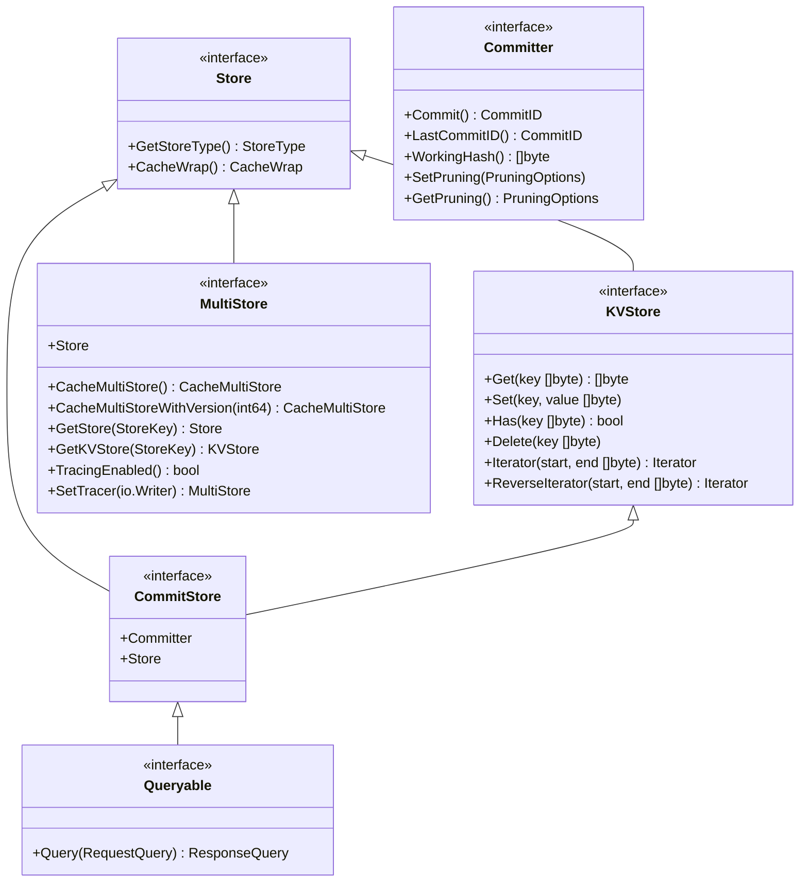

**图表来源**
- [store/types/store.go](file://store/types/store.go#L17-L32)

### 接口职责说明

| 接口 | 职责 | 关键方法 |
|------|------|----------|
| `Store` | 基础存储接口 | `GetStoreType()`, `CacheWrap()` |
| `KVStore` | 键值存储操作 | `Get()`, `Set()`, `Has()`, `Delete()` |
| `Committer` | 状态提交管理 | `Commit()`, `LastCommitID()`, `WorkingHash()` |
| `Queryable` | 查询接口 | `Query()` |
| `MultiStore` | 多存储管理 | `CacheMultiStore()`, `GetStore()`, `TracingEnabled()` |

**章节来源**
- [store/types/store.go](file://store/types/store.go#L17-L150)

## 多层存储架构

### 存储类型概览

Cosmos SDK支持多种存储类型，每种类型针对不同的使用场景进行了优化：

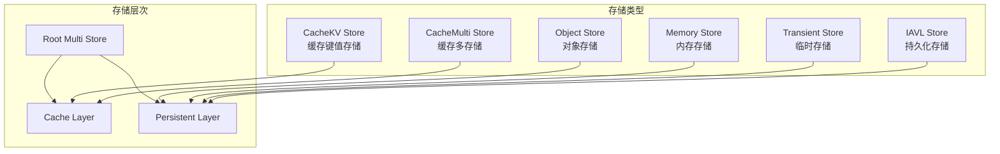

**图表来源**
- [store/types/store.go](file://store/types/store.go#L355-L397)

### IAVL Store（持久化存储）

IAVL（Immutable AVL）树是Cosmos SDK的核心持久化存储引擎，提供高效的键值存储和版本控制功能：

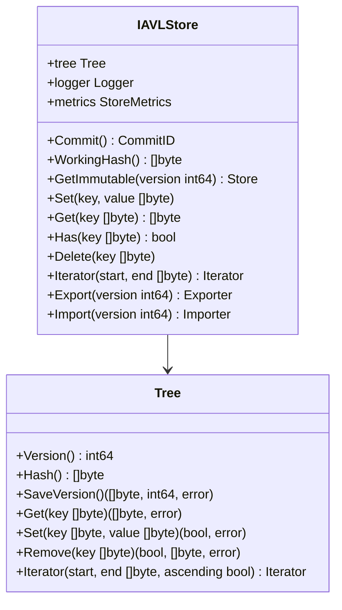

**图表来源**
- [store/iavl/store.go](file://store/iavl/store.go#L36-L42)

#### IAVL Store特性

- **不可变性**：每个版本都是独立的快照
- **高效迭代**：支持前向和后向迭代器
- **版本控制**：自动维护历史版本
- **压缩支持**：可配置的垃圾回收策略
- **证明生成**：支持状态证明构建

**章节来源**
- [store/iavl/store.go](file://store/iavl/store.go#L46-L94)

### CacheMulti Store（缓存多存储）

CacheMulti Store是多存储的缓存包装器，提供透明的缓存机制：

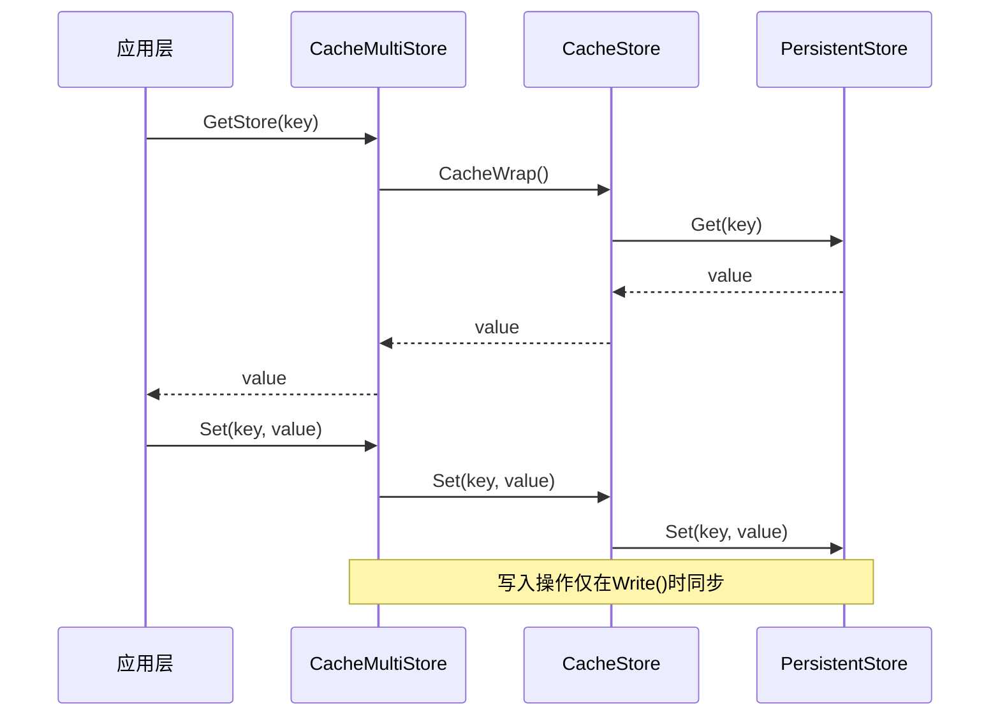

**图表来源**
- [store/cachemulti/store.go](file://store/cachemulti/store.go#L18-L30)

#### 缓存策略

CacheMulti Store采用写透（Write-through）策略，在写入时同时更新缓存和底层存储：

**章节来源**
- [store/cachemulti/store.go](file://store/cachemulti/store.go#L53-L60)

### CacheKV Store（缓存键值存储）

CacheKV Store是最基础的缓存层，提供单个存储的缓存功能：

```mermaid
classDiagram
    class CacheKVStore {
        +mtx sync.Mutex
        +cache map[string]*cValue
        +unsortedCache map[string]struct{}
        +sortedCache BTree
        +parent KVStore
        +isZero func(V) bool
        +valueLen func(V) int
        +Get(key []byte) V
        +Set(key, value V)
        +Has(key []byte) bool
        +Delete(key []byte)
        +Write()
        +CacheWrap() CacheWrap
    }
    class cValue {
        +value V
        +dirty bool
    }
    CacheKVStore --> cValue
```

**图表来源**
- [store/cachekv/store.go](file://store/cachekv/store.go#L44-L56)

#### 缓存优化机制

- **延迟写入**：批量写入优化
- **智能排序**：按键排序减少查找时间
- **内存管理**：动态缓存大小调整
- **并发安全**：互斥锁保护

**章节来源**
- [store/cachekv/store.go](file://store/cachekv/store.go#L58-L68)

### Transient Store（临时存储）

Transient Store用于存储仅在区块内有效的临时数据：

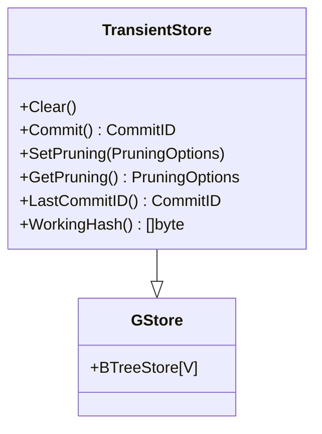

**图表来源**
- [store/transient/store.go](file://store/transient/store.go#L18-L26)

#### 特性说明

- **自动清理**：区块结束后自动清空
- **高性能**：基于B树的快速查找
- **类型安全**：泛型支持任意类型

**章节来源**
- [store/transient/store.go](file://store/transient/store.go#L34-L50)

## 状态提交流程

### 完整提交周期

状态提交是Cosmos SDK中最关键的操作之一，涉及多个阶段的协调：

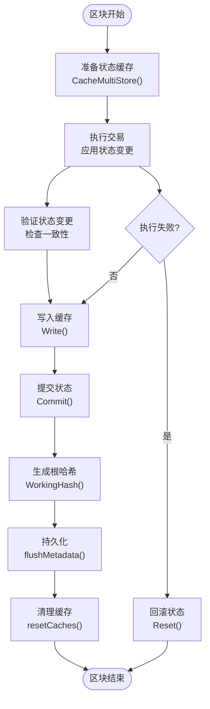

**图表来源**
- [store/rootmulti/store.go](file://store/rootmulti/store.go#L481-L535)

### 提交过程详解

#### 1. 缓存分支阶段

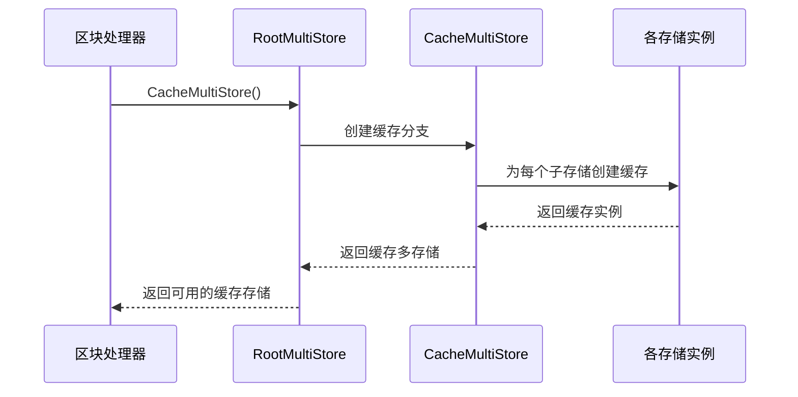

**图表来源**
- [store/rootmulti/store.go](file://store/rootmulti/store.go#L578-L593)

#### 2. 状态变更阶段

在交易执行过程中，所有状态变更都记录在缓存中：

**章节来源**
- [store/rootmulti/store.go](file://store/rootmulti/store.go#L578-L593)

#### 3. 原子性提交阶段

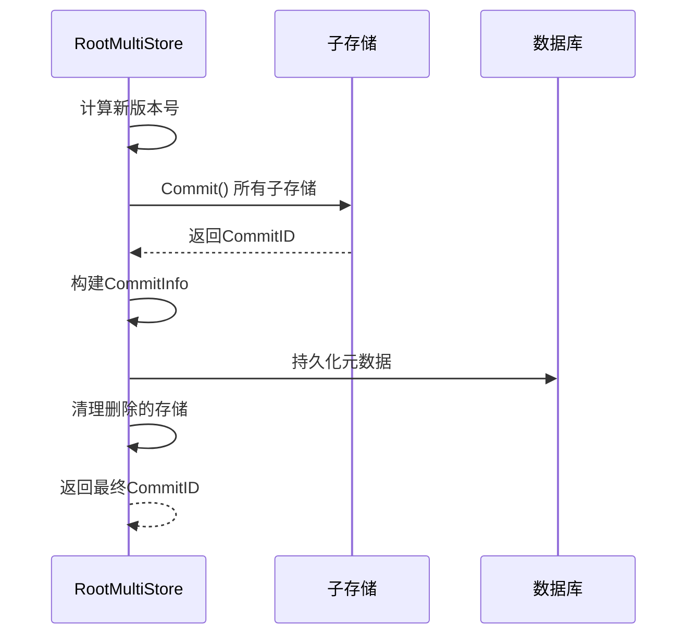

**图表来源**
- [store/rootmulti/store.go](file://store/rootmulti/store.go#L1226-L1266)

#### 4. 最终化处理

提交完成后，系统执行以下清理和优化操作：

**章节来源**
- [store/rootmulti/store.go](file://store/rootmulti/store.go#L510-L535)

## Collections库详解

### 类型安全的状态操作

Collections库是Cosmos SDK提供的高级状态操作抽象，通过类型系统确保状态操作的安全性和一致性：

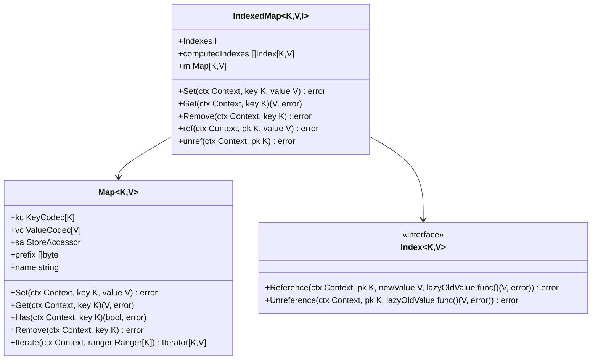

**图表来源**
- [collections/map.go](file://collections/map.go#L12-L28)
- [collections/indexed_map.go](file://collections/indexed_map.go#L33-L42)

### IndexedMap的工作原理

IndexedMap通过索引系统实现复杂的状态关系管理：

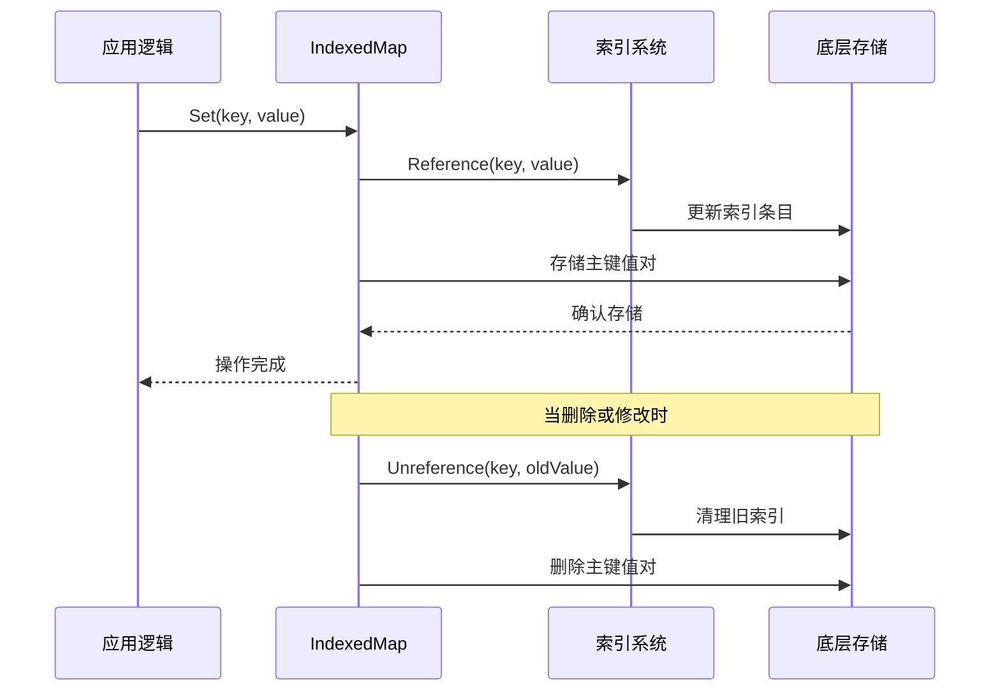

**图表来源**
- [collections/indexed_map.go](file://collections/indexed_map.go#L138-L156)

### 索引类型

Collections库支持多种索引类型以满足不同的查询需求：

| 索引类型 | 用途 | 特点 |
|----------|------|------|
| `Unique` | 唯一约束索引 | 每个值只能有一个对应键 |
| `ReversePair` | 反向查找索引 | 支持按值查找键集合 |
| `Multi` | 多值索引 | 一个键可以对应多个值 |

**章节来源**
- [collections/indexed_map.go](file://collections/indexed_map.go#L17-L31)

## Bank模块案例分析

### 银行模块的存储架构

Bank模块是Cosmos SDK中最典型的状态管理案例，展示了Collections库的实际应用：

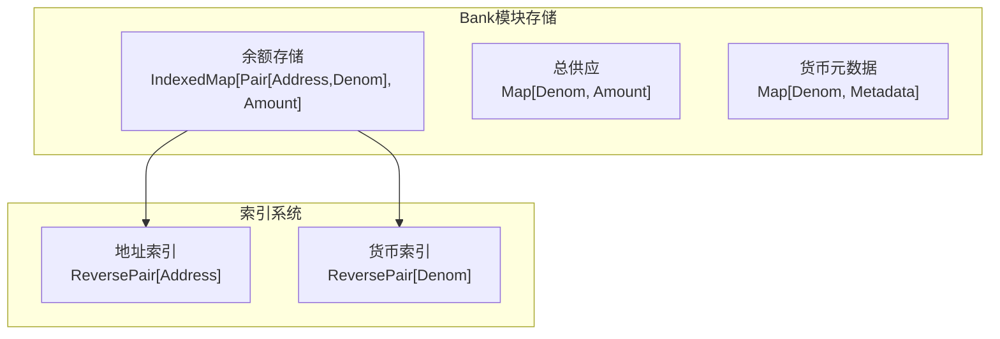

**图表来源**
- [x/bank/keeper/keeper.go](file://x/bank/keeper/keeper.go#L65-L71)

### 余额存储的完整生命周期

#### 1. 存储定义

银行模块使用复合键来组织余额数据：

**章节来源**
- [x/bank/keeper/keeper.go](file://x/bank/keeper/keeper.go#L65-L71)

#### 2. 设置余额操作

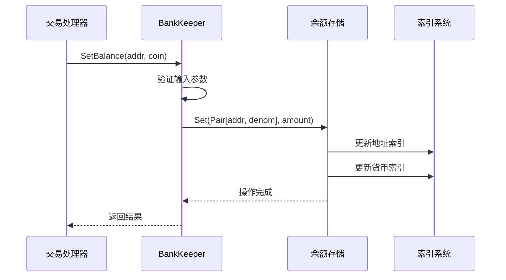

**图表来源**
- [collections/indexed_map.go](file://collections/indexed_map.go#L138-L156)

#### 3. 查询余额操作

查询操作通过索引系统实现高效的查找：

**章节来源**
- [collections/indexed_map.go](file://collections/indexed_map.go#L123-L126)

### 类型安全的优势

Collections库在Bank模块中的应用体现了类型安全的重要优势：

- **编译时检查**：避免键值类型不匹配
- **自动编码**：无需手动序列化/反序列化
- **索引维护**：自动维护相关索引
- **错误处理**：统一的错误处理机制

**章节来源**
- [collections/map.go](file://collections/map.go#L76-L91)

## 状态根哈希与证明机制

### 根哈希生成流程

状态根哈希是区块链验证的核心组件，确保状态的一致性和完整性：

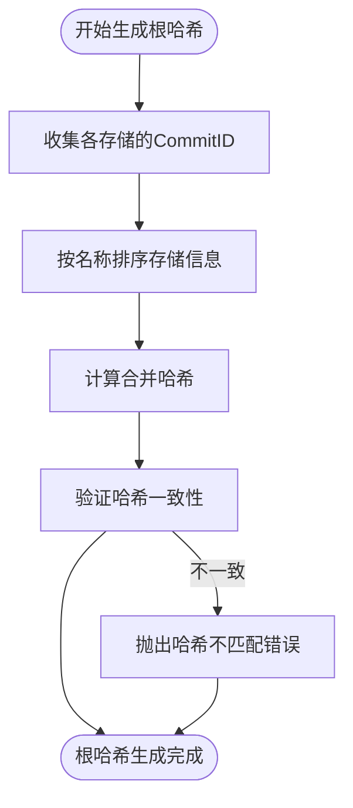

**图表来源**
- [store/rootmulti/store.go](file://store/rootmulti/store.go#L537-L566)

### 证明机制

IAVL树原生支持状态证明，为轻客户端验证提供基础：

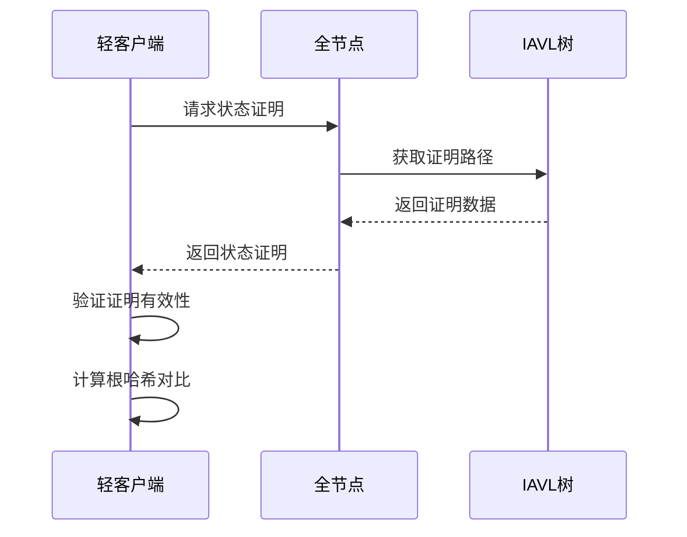

**图表来源**
- [store/iavl/store.go](file://store/iavl/store.go#L308-L392)

### 证明类型

| 证明类型 | 用途 | 特点 |
|----------|------|------|
| 存在证明 | 验证键存在 | 提供键值和路径证明 |
| 不存在证明 | 验证键不存在 | 提供缺失键的路径证明 |
| 范围证明 | 验证范围查询 | 支持前缀查询证明 |

**章节来源**
- [store/iavl/store.go](file://store/iavl/store.go#L399-L427)

## 性能优化策略

### 缓存优化

#### 1. 多层缓存架构

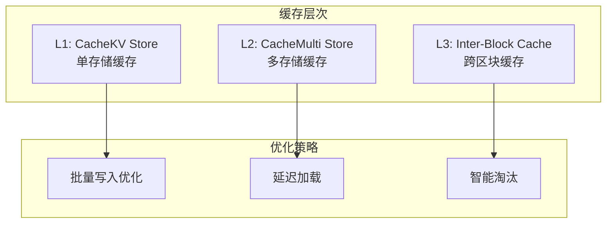

#### 2. 缓存大小调优

系统提供了多种缓存大小配置选项：

- **IAVL缓存**：默认500,000项，可动态调整
- **内存限制**：超过100,000项时自动清理
- **批量大小**：写入时的批处理优化

**章节来源**
- [store/cachekv/store.go](file://store/cachekv/store.go#L120-L140)

### 迭代器优化

#### 1. 合并迭代器

CacheKV Store实现了智能的合并迭代器：

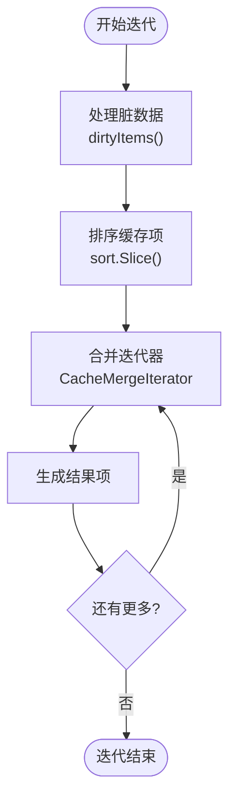

**图表来源**
- [store/cachekv/store.go](file://store/cachekv/store.go#L205-L239)

#### 2. 分段处理

对于大型数据集，系统采用分段处理策略：

- **最小排序大小**：1024项触发排序优化
- **分段查找**：二分查找定位目标范围
- **批量删除**：10,000项为批次进行删除

**章节来源**
- [store/cachekv/store.go](file://store/cachekv/store.go#L323-L420)

### 并发优化

#### 1. 读写分离

系统通过互斥锁实现读写分离：

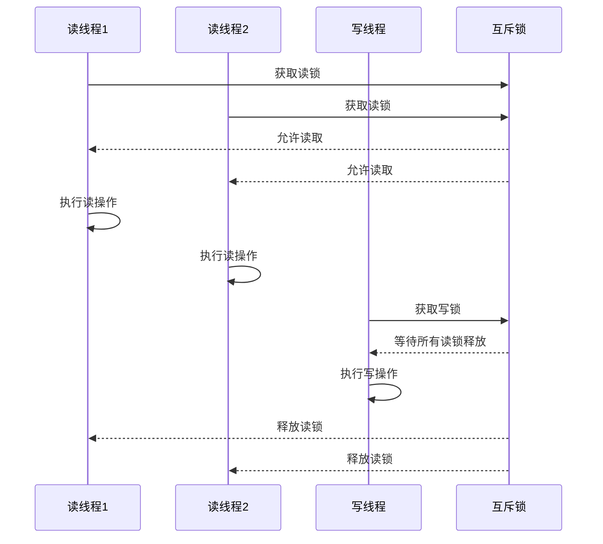

#### 2. 原子操作

关键状态操作使用原子操作保证一致性：

- **版本号递增**：原子性版本管理
- **状态标志**：无锁状态检查
- **计数器更新**：原子计数操作

**章节来源**
- [store/rootmulti/store.go](file://store/rootmulti/store.go#L481-L535)

### 存储优化

#### 1. 垃圾回收

IAVL树支持多种垃圾回收策略：

- **PruneNothing**：保留所有历史版本
- **PruneEverything**：仅保留最新版本
- **Custom**：自定义保留策略

#### 2. 压缩优化

系统提供异步压缩功能：

- **后台压缩**：不影响主业务流程
- **增量压缩**：逐步清理历史数据
- **智能调度**：根据负载动态调整

**章节来源**
- [store/rootmulti/store.go](file://store/rootmulti/store.go#L1170-L1292)

## 总结

Cosmos SDK的状态管理系统通过精心设计的分层架构和优化策略，为区块链应用提供了强大而高效的状态管理能力。主要特点包括：

### 核心优势

1. **分层抽象**：清晰的接口层次确保了系统的可扩展性和可维护性
2. **多层缓存**：从单存储到多存储的完整缓存覆盖，显著提升性能
3. **类型安全**：Collections库提供强类型的状态操作，减少运行时错误
4. **证明支持**：原生支持状态证明，为轻客户端验证提供基础
5. **事务隔离**：完整的事务支持确保状态变更的一致性

### 设计理念

- **模块化**：每个存储类型专注于特定场景
- **可组合**：通过缓存包装器实现功能叠加
- **性能优先**：多层次优化策略确保最佳性能
- **安全第一**：类型安全和证明机制保障数据完整性

### 应用价值

该状态管理系统不仅支撑了Cosmos生态系统的稳定运行，也为其他区块链项目提供了优秀的参考实现。通过深入理解其设计原理和实现细节，开发者可以更好地利用这些工具构建高质量的区块链应用。

未来的优化方向可能包括：
- 更智能的缓存策略
- 更高效的证明算法
- 更好的并发性能
- 更灵活的存储选择

这个系统的设计充分体现了区块链技术对数据一致性、安全性和性能的严格要求，是现代分布式系统设计的优秀范例。