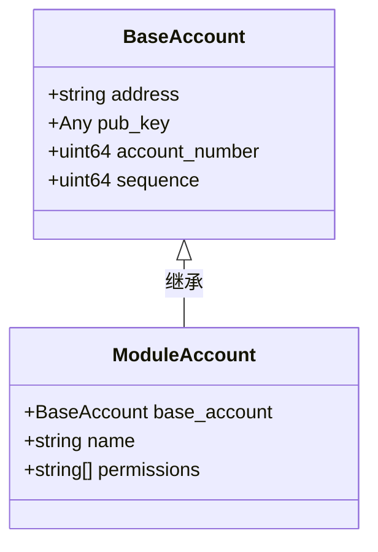
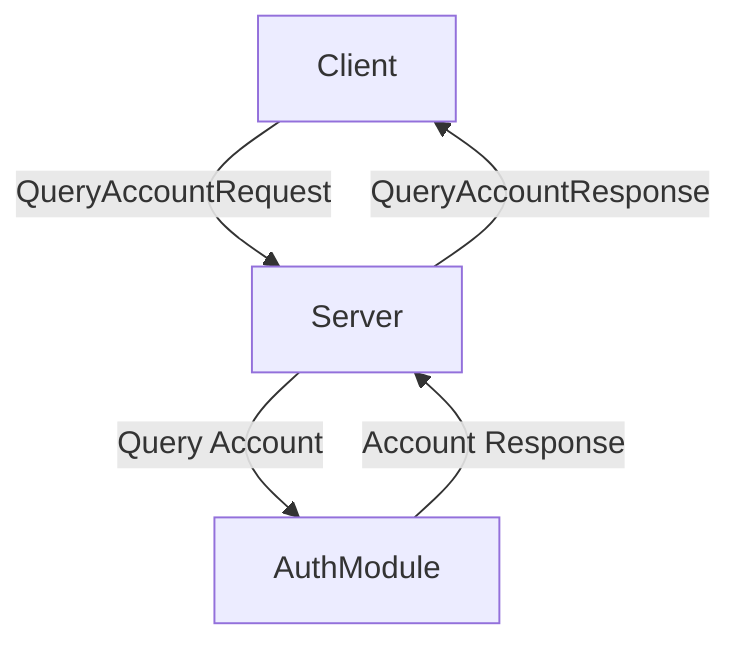
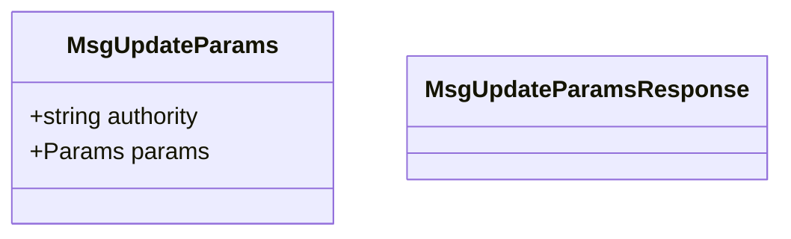
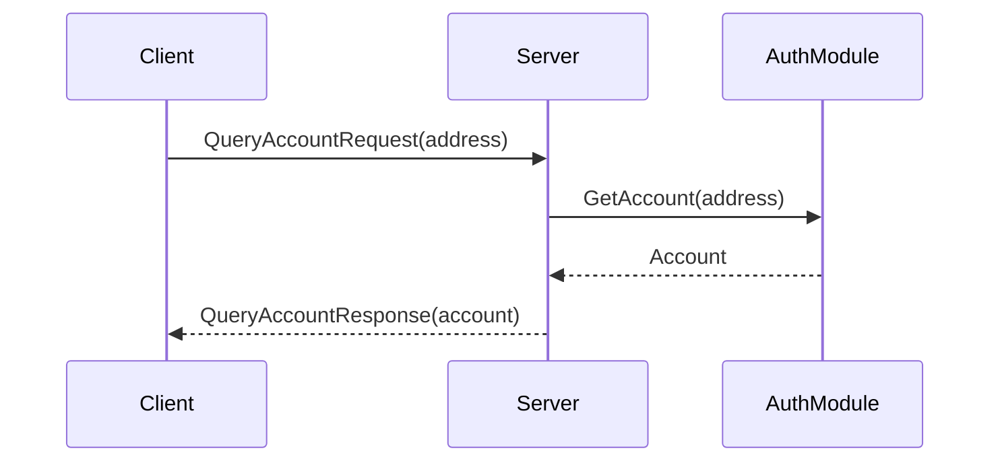

# Auth模块

<cite>
**本文档中引用的文件**   
- [auth.pulsar.go](file://api/cosmos/auth/v1beta1/auth.pulsar.go)
- [tx.pulsar.go](file://api/cosmos/auth/v1beta1/tx.pulsar.go)
- [query.pulsar.go](file://api/cosmos/auth/v1beta1/query.pulsar.go)
</cite>

## 目录
1. [简介](#简介)
2. [核心功能](#核心功能)
3. [账户管理](#账户管理)
4. [gRPC API端点](#grpc-api端点)
5. [消息类型](#消息类型)
6. [查询服务](#查询服务)
7. [配置参数](#配置参数)
8. [使用场景](#使用场景)

## 简介
Cosmos SDK的Auth模块是区块链应用的基础组件，负责管理账户、公钥存储和交易序列号控制。该模块为其他模块（如Bank和Staking）提供交易签名验证功能，确保系统的安全性和完整性。Auth模块通过Protobuf定义了标准的数据结构和接口，支持gRPC API进行账户信息查询和参数管理。

**Section sources**
- [auth.pulsar.go](file://api/cosmos/auth/v1beta1/auth.pulsar.go#L1-L100)

## 核心功能
Auth模块的核心功能包括账户管理、公钥存储和序列号控制。它定义了`BaseAccount`和`ModuleAccount`两种账户类型，分别用于用户账户和模块账户。每个账户包含地址、公钥、账户编号和序列号等属性。序列号用于防止重放攻击，确保每笔交易的唯一性。

**Diagram sources **
- [auth.pulsar.go](file://api/cosmos/auth/v1beta1/auth.pulsar.go#L20-L800)

**Section sources**
- [auth.pulsar.go](file://api/cosmos/auth/v1beta1/auth.pulsar.go#L20-L800)

## 账户管理
Auth模块通过`BaseAccount`结构体管理用户账户，包含地址、公钥、账户编号和序列号。`ModuleAccount`扩展了`BaseAccount`，增加了名称和权限列表，用于管理模块账户。公钥以Any类型存储，支持多种加密算法。

**Section sources**
- [auth.pulsar.go](file://api/cosmos/auth/v1beta1/auth.pulsar.go#L20-L800)

## gRPC API端点
Auth模块提供了一系列gRPC API端点，用于查询账户信息和系统参数。主要端点包括`QueryAccount`、`QueryParams`和`QueryAccounts`，支持分页查询和参数检索。

**Diagram sources **
- [query.pulsar.go](file://api/cosmos/auth/v1beta1/query.pulsar.go#L1-L200)

**Section sources**
- [query.pulsar.go](file://api/cosmos/auth/v1beta1/query.pulsar.go#L1-L200)

## 消息类型
Auth模块定义了`MsgUpdateParams`消息类型，用于更新模块参数。该消息包含授权地址和参数对象，需要通过治理流程进行修改。

**Diagram sources **
- [tx.pulsar.go](file://api/cosmos/auth/v1beta1/tx.pulsar.go#L1-L800)

**Section sources**
- [tx.pulsar.go](file://api/cosmos/auth/v1beta1/tx.pulsar.go#L1-L800)

## 查询服务
Auth模块提供了多个查询服务，包括`QueryAccount`、`QueryParams`、`QueryAccounts`等。这些服务允许客户端查询账户信息、系统参数和账户列表。

**Diagram sources **
- [query.pulsar.go](file://api/cosmos/auth/v1beta1/query.pulsar.go#L1-L200)

**Section sources**
- [query.pulsar.go](file://api/cosmos/auth/v1beta1/query.pulsar.go#L1-L200)

## 配置参数
Auth模块的配置参数通过`Params`结构体定义，包含最小燃气价格、最大内存等系统级设置。这些参数可以通过`MsgUpdateParams`消息进行更新。

**Section sources**
- [tx.pulsar.go](file://api/cosmos/auth/v1beta1/tx.pulsar.go#L1-L800)

## 使用场景
Auth模块作为Cosmos SDK的基础模块，被Bank、Staking等模块依赖，用于处理交易签名验证。开发者可以利用其提供的API进行账户管理、参数查询和系统配置。

**Section sources**
- [auth.pulsar.go](file://api/cosmos/auth/v1beta1/auth.pulsar.go#L1-L800)
- [tx.pulsar.go](file://api/cosmos/auth/v1beta1/tx.pulsar.go#L1-L800)
- [query.pulsar.go](file://api/cosmos/auth/v1beta1/query.pulsar.go#L1-L200)