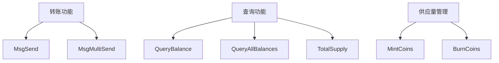
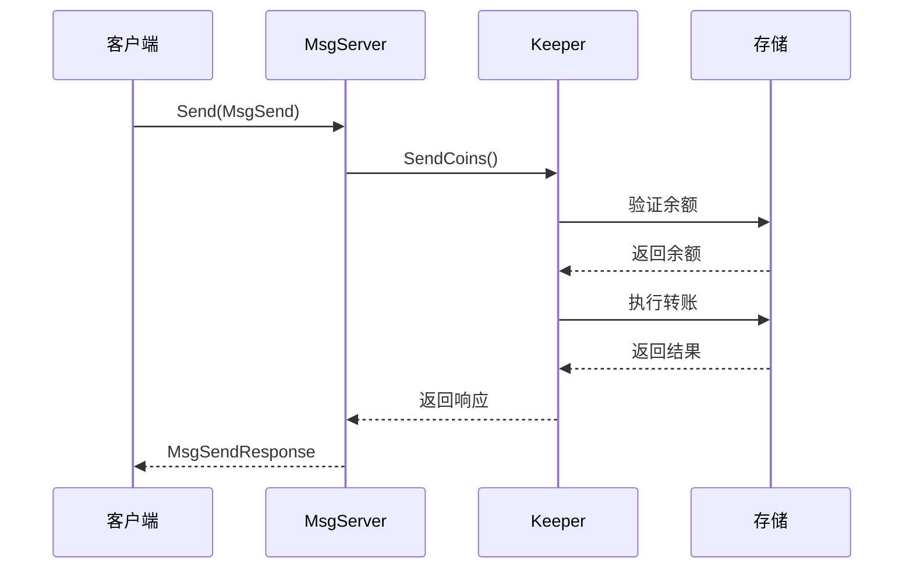
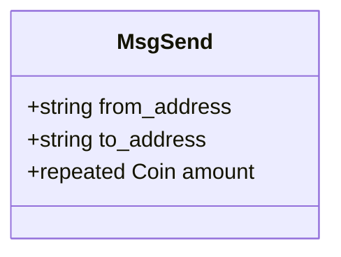
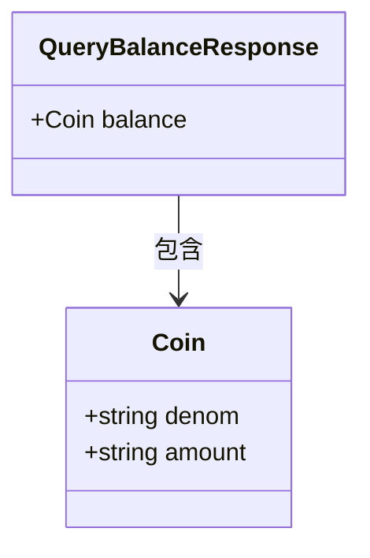
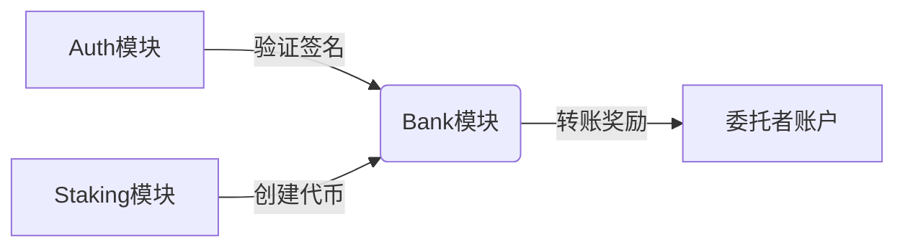
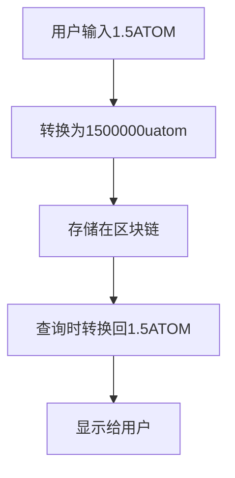

# Bank模块

<cite>
**本文档中引用的文件**  
- [tx.proto](file://proto/cosmos/bank/v1beta1/tx.proto)
- [query.proto](file://proto/cosmos/bank/v1beta1/query.proto)
- [bank.pb.go](file://x/bank/types/bank.pb.go)
- [module.go](file://x/bank/module.go)
- [keeper.go](file://x/bank/keeper/keeper.go)
- [send.go](file://x/bank/keeper/send.go)
</cite>

## 目录
1. [简介](#简介)
2. [核心功能](#核心功能)
3. [gRPC API端点](#grpc-api端点)
4. [消息定义](#消息定义)
5. [模块集成](#模块集成)
6. [转账限制与费用](#转账限制与费用)
7. [精确小数处理](#精确小数处理)

## 简介
Bank模块是Cosmos SDK中的核心模块，负责管理代币转账、余额查询和供应量管理。该模块提供了安全可靠的代币转移机制，支持单笔和多笔转账操作，并与Auth模块和Staking模块紧密集成，确保交易的安全性和一致性。

**Section sources**
- [module.go](file://x/bank/module.go#L1-L311)

## 核心功能
Bank模块的核心功能包括代币转账、余额查询和供应量管理。模块通过MsgSend和MsgMultiSend消息处理转账请求，通过QueryBalance查询余额，并通过TotalSupply查询总供应量。模块还支持代币元数据管理，包括名称、符号、精度等信息。

**Diagram sources**
- [tx.proto](file://proto/cosmos/bank/v1beta1/tx.proto#L14-L73)
- [query.proto](file://proto/cosmos/bank/v1beta1/query.proto#L16-L127)

**Section sources**
- [keeper.go](file://x/bank/keeper/keeper.go#L23-L61)
- [send.go](file://x/bank/keeper/send.go#L23-L51)

## gRPC API端点
Bank模块提供了丰富的gRPC API端点，支持各种查询和操作。

### 转账端点
- **Send**: 处理单笔转账请求，从一个账户向另一个账户发送代币
- **MultiSend**: 处理多笔转账请求，支持多个输入和输出的复杂转账场景

### 查询端点
- **Balance**: 查询指定账户的特定代币余额
- **AllBalances**: 查询指定账户的所有代币余额
- **TotalSupply**: 查询网络中所有代币的总供应量
- **SupplyOf**: 查询特定代币的供应量
- **Params**: 查询Bank模块的参数配置

**Diagram sources**
- [tx.proto](file://proto/cosmos/bank/v1beta1/tx.proto#L14-L27)
- [query.proto](file://proto/cosmos/bank/v1beta1/query.proto#L16-L76)

**Section sources**
- [tx.proto](file://proto/cosmos/bank/v1beta1/tx.proto#L14-L73)
- [query.proto](file://proto/cosmos/bank/v1beta1/query.proto#L16-L127)

## 消息定义
Bank模块使用Protocol Buffers定义消息结构，确保跨平台兼容性和高效序列化。

### MsgSend
MsgSend消息用于单笔转账，包含发送方地址、接收方地址和转账金额。

### QueryBalanceResponse
QueryBalanceResponse消息包含查询到的代币余额信息。

**Diagram sources**
- [tx.proto](file://proto/cosmos/bank/v1beta1/tx.proto#L38-L57)
- [query.proto](file://proto/cosmos/bank/v1beta1/query.proto#L141-L145)

**Section sources**
- [bank.pb.go](file://x/bank/types/bank.pb.go#L31-L88)
- [query.proto](file://proto/cosmos/bank/v1beta1/query.proto#L141-L145)

## 模块集成
Bank模块与Cosmos SDK的其他模块紧密集成，形成完整的生态系统。

### 与Auth模块集成
Bank模块依赖Auth模块验证交易发送者的身份。每个转账交易都必须由发送方签名，Auth模块负责验证签名的有效性，确保只有账户所有者才能发起转账。

### 与Staking模块交互
Bank模块与Staking模块协作处理委托奖励。当验证者获得奖励时，Staking模块调用Bank模块的MintCoins功能创建新代币，然后通过转账功能将奖励分配给委托者。

**Diagram sources**
- [module.go](file://x/bank/module.go#L28-L34)
- [keeper.go](file://x/bank/keeper/keeper.go#L67-L71)

**Section sources**
- [module.go](file://x/bank/module.go#L28-L34)
- [keeper.go](file://x/bank/keeper/keeper.go#L137-L179)

## 转账限制与费用
Bank模块实现了多种安全机制来防止滥用和确保网络稳定。

### 转账限制
模块支持基于代币类型的发送限制，可以通过治理提案启用或禁用特定代币的转账功能。这为项目方提供了灵活的代币管理能力。

### 费用支付
所有交易都需要支付费用，费用以网络的原生代币支付。费用机制防止垃圾交易，确保网络资源的合理使用。费用由发送方支付，并根据交易的复杂性和资源消耗计算。

**Section sources**
- [send.go](file://x/bank/keeper/send.go#L36-L48)
- [module.go](file://x/bank/module.go#L29-L34)

## 精确小数处理
Bank模块采用高精度整数运算来处理代币余额，避免浮点数精度问题。代币余额以最小单位存储，通过元数据定义显示精度。例如，1个ATOM存储为1000000uatom，显示时自动转换为正确的精度。

**Diagram sources**
- [bank.pb.go](file://x/bank/types/bank.pb.go#L264-L331)
- [query.proto](file://proto/cosmos/bank/v1beta1/query.proto#L333-L339)

**Section sources**
- [bank.pb.go](file://x/bank/types/bank.pb.go#L264-L331)
- [query.proto](file://proto/cosmos/bank/v1beta1/query.proto#L333-L339)