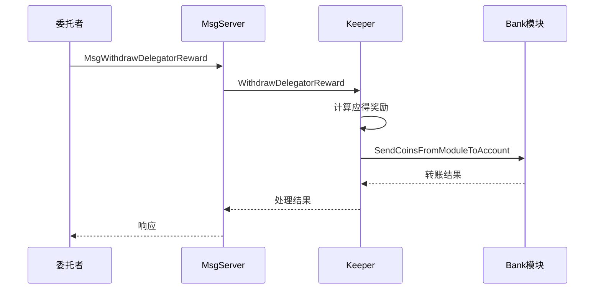

# Distribution模块

<cite>
**本文档中引用的文件**  
- [distribution.proto](file://proto/cosmos/distribution/v1beta1/distribution.proto)
- [tx.proto](file://proto/cosmos/distribution/v1beta1/tx.proto)
- [query.proto](file://proto/cosmos/distribution/v1beta1/query.proto)
- [module.proto](file://proto/cosmos/distribution/module/v1/module.proto)
- [module.go](file://x/distribution/module.go)
- [abci.go](file://x/distribution/abci.go)
- [expected_keepers.go](file://x/distribution/types/expected_keepers.go)
</cite>

## 目录
1. [简介](#简介)
2. [核心功能](#核心功能)
3. [gRPC API端点](#grpc-api端点)
4. [消息定义](#消息定义)
5. [模块协作](#模块协作)
6. [社区税收与分配器](#社区税收与分配器)
7. [代码示例](#代码示例)

## 简介
Distribution模块是Cosmos SDK中的一个关键模块，负责管理链上产生的收益分配。该模块主要处理交易费用和区块奖励的分配，确保验证者和委托者能够获得相应的收益。它与Staking模块和Bank模块紧密协作，实现复杂的奖励计算和代币转账功能。

## 核心功能
Distribution模块的核心功能是分配链上产生的收益给验证者和委托者。当网络中产生交易费用或区块奖励时，这些收益会被收集到一个全局的费用池中。模块根据验证者的表现和委托者的委托关系，计算每个参与者应得的奖励份额。验证者可以获得其自委托部分的奖励以及从委托者那里获得的佣金，而委托者则可以获得其委托份额对应的奖励。

**Section sources**
- [distribution.proto](file://proto/cosmos/distribution/v1beta1/distribution.proto#L12-L195)
- [module.go](file://x/distribution/module.go#L1-L278)

## gRPC API端点
Distribution模块提供了多个gRPC API端点，用于查询和管理分配相关的数据。`MsgWithdrawDelegatorReward`端点允许委托者从特定验证者处提取其应得的奖励。`MsgSetWithdrawAddress`端点允许委托者设置或更改其奖励提取地址，使得奖励可以发送到指定的账户。此外，还有用于查询验证者奖励、佣金和社区池余额的查询端点。



**Diagram sources**
- [tx.proto](file://proto/cosmos/distribution/v1beta1/tx.proto#L76-L87)
- [module.go](file://x/distribution/module.go#L132-L133)

**Section sources**
- [tx.proto](file://proto/cosmos/distribution/v1beta1/tx.proto#L14-L56)
- [query.proto](file://proto/cosmos/distribution/v1beta1/query.proto#L14-L74)

## 消息定义
来自`distribution.proto`和`distribution.pulsar.go`的请求/响应消息定义了Distribution模块的核心数据结构。`Params`消息定义了模块的参数，包括社区税收比例和是否启用提现地址功能。`ValidatorOutstandingRewards`消息跟踪验证者未提取的奖励，而`DelegationDelegatorReward`消息表示委托者的奖励信息。这些消息通过Protocol Buffers定义，确保了跨语言和跨平台的兼容性。

**Section sources**
- [distribution.proto](file://proto/cosmos/distribution/v1beta1/distribution.proto#L12-L195)
- [module.proto](file://proto/cosmos/distribution/module/v1/module.proto#L1-L18)

## 模块协作
Distribution模块与Staking模块和Bank模块有着紧密的协作关系。它依赖Staking模块获取验证者和委托者的关系数据，根据委托份额和验证者表现来计算奖励分配。同时，它使用Bank模块的接口来执行实际的代币转账操作，将计算出的奖励从模块账户转移到用户账户。这种模块化的设计使得各个功能组件可以独立开发和维护，同时又能协同工作。

```mermaid
graph TB
subgraph "核心模块"
Distribution[Distribution模块]
Staking[Staking模块]
Bank[Bank模块]
end
Distribution --> Staking: 查询验证者和委托关系
Distribution --> Bank: 执行代币转账
Staking --> Distribution: 提供委托数据
Bank --> Distribution: 返回转账结果
```

**Diagram sources**
- [expected_keepers.go](file://x/distribution/types/expected_keepers.go#L13-L65)
- [module.go](file://x/distribution/module.go#L100-L103)

**Section sources**
- [expected_keepers.go](file://x/distribution/types/expected_keepers.go#L13-L65)
- [abci.go](file://x/distribution/abci.go#L8-L17)

## 社区税收与分配器
Distribution模块实现了社区税收机制，将一部分链上收益分配给社区池。社区税收的比例由模块参数`community_tax`控制，可以在链上通过治理提案进行调整。社区池中的资金可以用于支持生态系统发展、资助开发项目或进行其他社区决策。分配器负责管理这些资金的分配，确保其按照社区共识进行使用。

**Section sources**
- [distribution.proto](file://proto/cosmos/distribution/v1beta1/distribution.proto#L16-L21)
- [module.go](file://x/distribution/module.go#L243-L246)

## 代码示例
以下是一个委托者提取奖励的实际代码示例。通过调用`MsgWithdrawDelegatorReward`消息，委托者可以指定要提取奖励的验证者地址。系统会根据当前的委托关系和奖励累积情况，计算出应得的奖励金额，并通过Bank模块将其转移到委托者的账户中。这个过程确保了奖励分配的透明性和可追溯性。

**Section sources**
- [tx.proto](file://proto/cosmos/distribution/v1beta1/tx.proto#L76-L87)
- [module.go](file://x/distribution/module.go#L132-L133)