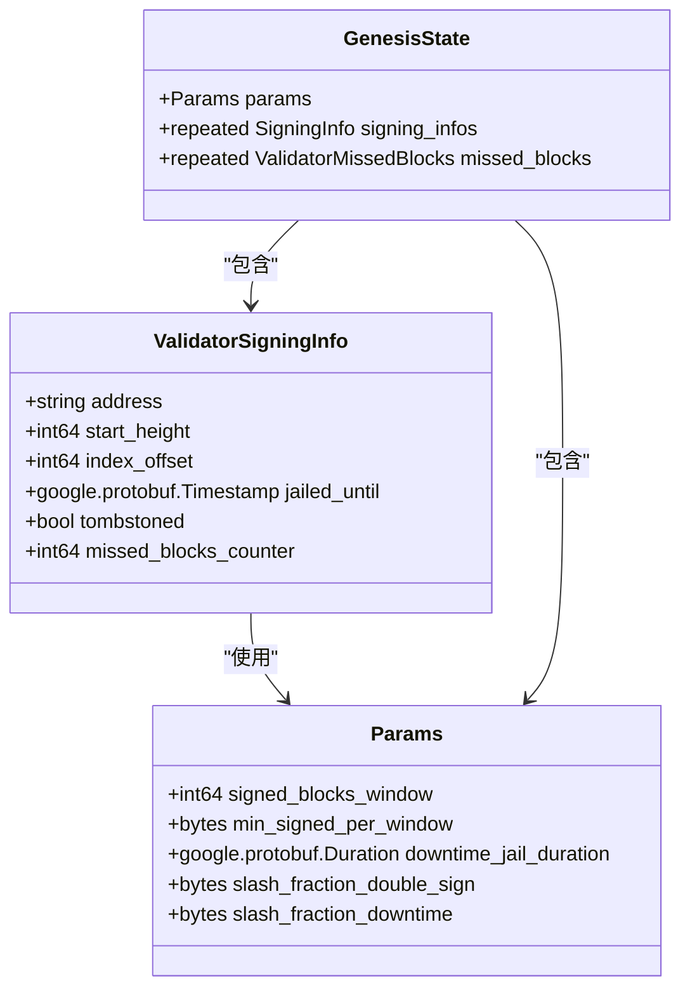
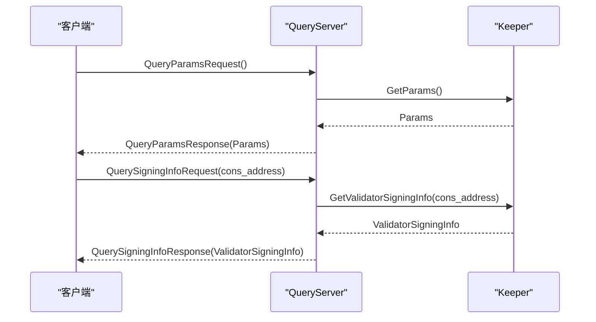

# Slashing模块

<cite>
**本文档引用的文件**
- [module.go](file://x/slashing/module.go)
- [abci.go](file://x/slashing/abci.go)
- [slashing.proto](file://proto/cosmos/slashing/v1beta1/slashing.proto)
- [query.proto](file://proto/cosmos/slashing/v1beta1/query.proto)
- [genesis.proto](file://proto/cosmos/slashing/v1beta1/genesis.proto)
- [module.pulsar.go](file://api/cosmos/slashing/module/v1/module.pulsar.go)
- [slashing.pulsar.go](file://api/cosmos/slashing/v1beta1/slashing.pulsar.go)
- [keeper_test.go](file://tests/integration/slashing/keeper/keeper_test.go)
</cite>

## 目录
1. [简介](#简介)
2. [核心功能](#核心功能)
3. [Protobuf定义](#protobuf定义)
4. [gRPC API端点](#grpc-api端点)
5. [与Staking模块的集成](#与staking模块的集成)
6. [惩罚机制与参数配置](#惩罚机制与参数配置)
7. [违规行为的惩罚力度与恢复流程](#违规行为的惩罚力度与恢复流程)

## 简介
Slashing模块是Cosmos SDK中的一个关键安全组件，旨在通过惩罚机制维护网络的安全性和可靠性。该模块主要针对验证者的恶意或不当行为，如双签（double-signing）和长期离线等，实施相应的惩罚措施。通过这些措施，Slashing模块确保了网络的稳定运行，防止了潜在的攻击和滥用。

## 核心功能
Slashing模块的核心功能包括对验证者的双签行为和长期离线行为进行检测和惩罚。当检测到验证者存在双签行为时，系统会立即对其进行严厉的惩罚，包括但不限于削减其质押份额。对于长期离线的验证者，系统也会根据其离线时间的长短实施不同程度的惩罚，以确保网络的高可用性。

**Section sources**
- [module.go](file://x/slashing/module.go#L31-L258)
- [abci.go](file://x/slashing/abci.go#L14-L31)

## Protobuf定义
Slashing模块的Protobuf定义主要包含在`slashing.proto`、`query.proto`和`genesis.proto`文件中。其中，`ValidatorSigningInfo`结构体用于存储验证者的签名信息，包括地址、开始高度、索引偏移、被监禁时间、是否被永久封禁以及错过的区块计数器等字段。

**Diagram sources**
- [slashing.proto](file://proto/cosmos/slashing/v1beta1/slashing.proto#L13-L63)
- [genesis.proto](file://proto/cosmos/slashing/v1beta1/genesis.proto#L11-L49)

## gRPC API端点
Slashing模块提供了多个gRPC API端点，用于查询和管理验证者的状态。主要的API端点包括`MsgUnjail`和`QueryParams`。`MsgUnjail`允许被监禁的验证者请求解封，而`QueryParams`则用于查询Slashing模块的参数配置。

**Diagram sources**
- [query.proto](file://proto/cosmos/slashing/v1beta1/query.proto#L13-L67)
- [module.go](file://x/slashing/module.go#L129-L131)

## 与Staking模块的集成
Slashing模块与Staking模块紧密集成，当验证者被罚没时，会触发其质押份额的减少。这种集成确保了惩罚措施的有效执行，同时也维护了网络的经济模型。具体来说，当验证者因双签或长期离线被罚没时，其质押的代币会被部分或全部扣除，从而影响其在网络中的地位和收益。

**Section sources**
- [module.go](file://x/slashing/module.go#L93-L96)
- [keeper_test.go](file://tests/integration/slashing/keeper/keeper_test.go#L104-L128)

## 惩罚机制与参数配置
Slashing模块的惩罚机制由一系列参数控制，这些参数定义了惩罚的条件和程度。主要参数包括`signed_blocks_window`（签名区块窗口）、`min_signed_per_window`（每窗口最小签名数）、`downtime_jail_duration`（离线监禁时长）、`slash_fraction_double_sign`（双签惩罚比例）和`slash_fraction_downtime`（离线惩罚比例）。通过合理配置这些参数，可以有效平衡网络的安全性和可用性。

**Section sources**
- [slashing.proto](file://proto/cosmos/slashing/v1beta1/slashing.proto#L37-L63)
- [module.go](file://x/slashing/module.go#L149-L153)

## 违规行为的惩罚力度与恢复流程
对于不同的违规行为，Slashing模块设定了不同的惩罚力度。例如，双签行为通常会导致更严重的惩罚，包括较高的惩罚比例和较长的监禁时间。恢复流程则包括被监禁验证者通过`MsgUnjail`请求解封，系统在验证其符合条件后解除监禁状态。这一流程确保了网络的公平性和透明度。

**Section sources**
- [module.go](file://x/slashing/module.go#L166-L168)
- [keeper_test.go](file://tests/integration/slashing/keeper/keeper_test.go#L268-L299)