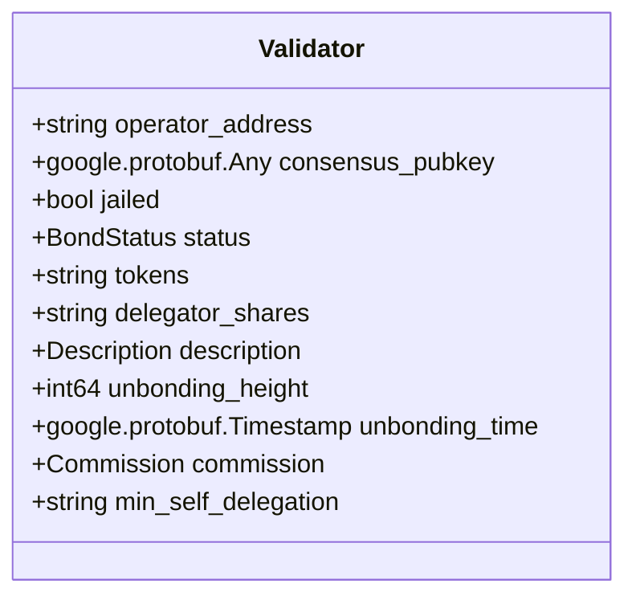
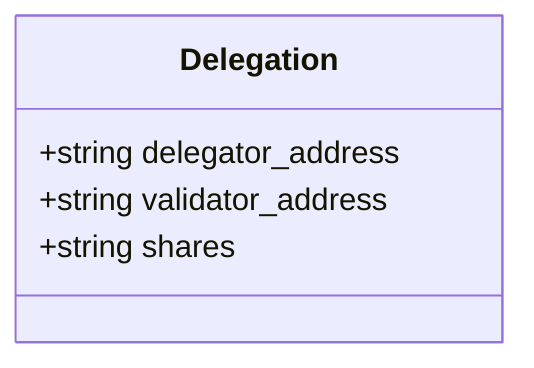
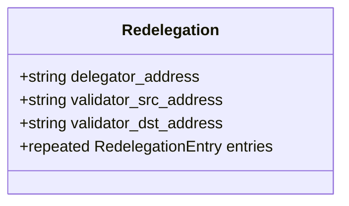
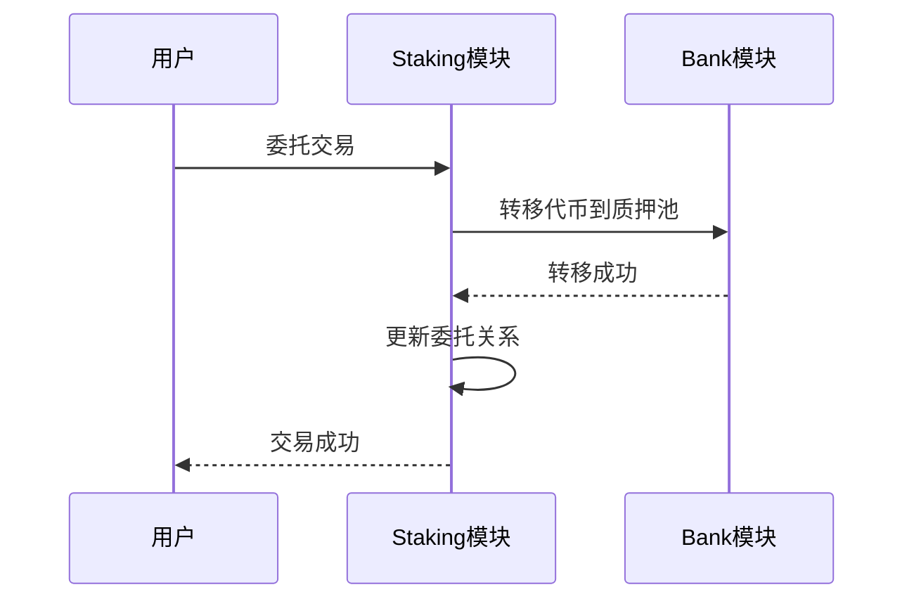
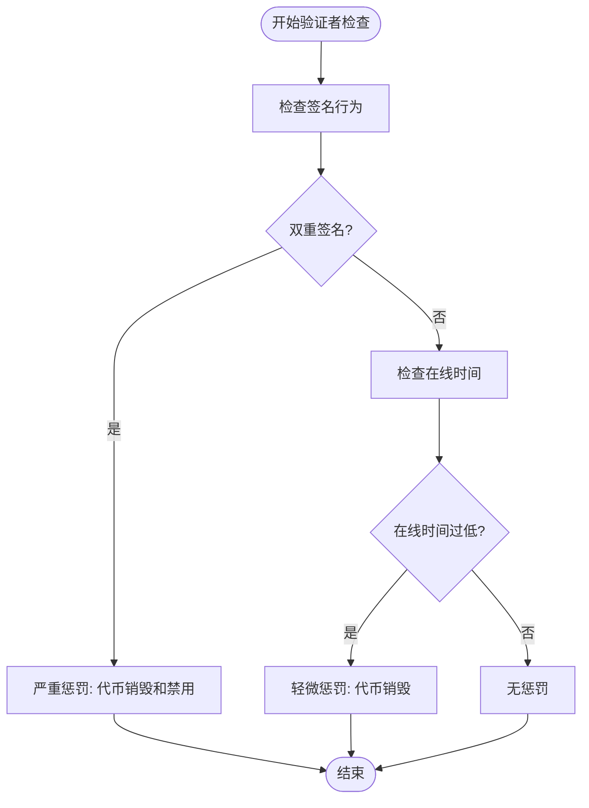

# Staking模块

<cite>
**本文档中引用的文件**  
- [staking.proto](file://proto/cosmos/staking/v1beta1/staking.proto)
- [tx.proto](file://proto/cosmos/staking/v1beta1/tx.proto)
- [query.proto](file://proto/cosmos/staking/v1beta1/query.proto)
- [genesis.proto](file://proto/cosmos/staking/v1beta1/genesis.proto)
- [authz.pulsar.go](file://api/cosmos/staking/v1beta1/authz.pulsar.go)
</cite>

## 目录
1. [介绍](#介绍)
2. [核心功能](#核心功能)
3. [关键gRPC API端点](#关键grpc-api端点)
4. [Protobuf消息摘要](#protobuf消息摘要)
5. [模块协同工作](#模块协同工作)
6. [质押机制](#质押机制)
7. [代码示例](#代码示例)

## 介绍
Staking模块是Cosmos SDK中的核心模块之一，负责管理验证者、委托、取消委托和再委托等权益证明(PoS)机制的关键功能。该模块实现了验证者生命周期管理、代币委托机制、质押奖励分配以及惩罚系统。Staking模块与Bank模块和Auth模块紧密协作，确保代币转移的安全性和权限控制的正确性。

**Section sources**
- [staking.proto](file://proto/cosmos/staking/v1beta1/staking.proto#L1-L394)

## 核心功能
Staking模块提供了完整的权益证明机制实现，包括验证者管理、委托、取消委托和再委托功能。验证者是网络中的节点运营商，负责验证交易和生成区块。委托人可以将自己的代币委托给验证者，从而参与网络的安全保障并获得奖励。该模块通过维护验证者状态、委托关系和质押池来实现这些功能。

### 验证者管理
验证者管理功能允许用户创建、编辑和查询验证者信息。每个验证者都有一个操作员地址、共识公钥、状态（绑定、解绑或未绑定）、质押代币数量、委托份额、描述信息、佣金率和最小自委托数量等属性。验证者可以被暂时禁用（jail）以防止恶意行为。

### 委托
委托功能允许代币持有者将他们的代币委托给验证者。当用户进行委托时，他们获得与委托代币数量相对应的委托份额。这些份额可以用于计算未来的奖励分配。委托增加了验证者的投票权，从而影响其在共识过程中的权重。

### 取消委托
取消委托功能允许委托人从验证者那里撤回他们的代币。取消委托需要一定的时间才能完成，这段时间称为解绑时间。在此期间，代币仍然被视为质押状态，但不再参与共识过程。解绑时间是可配置的参数，确保网络稳定性。

### 再委托
再委托功能允许委托人将他们的委托从一个验证者转移到另一个验证者，而无需经历完整的解绑过程。这为委托人提供了更大的灵活性，使他们能够根据验证者的性能和信誉调整其委托策略。

**Section sources**
- [staking.proto](file://proto/cosmos/staking/v1beta1/staking.proto#L82-L136)
- [tx.proto](file://proto/cosmos/staking/v1beta1/tx.proto#L26-L36)

## 关键gRPC API端点
Staking模块提供了丰富的gRPC API端点，用于查询和修改质押状态。这些端点分为消息服务（Msg）和查询服务（Query）两类。

### 消息服务端点
消息服务端点用于提交交易，修改链上状态。

#### MsgDelegate
`MsgDelegate`端点用于执行从委托人到验证者的代币委托。该消息包含委托人地址、验证者地址和委托金额。执行成功后，委托人获得相应的委托份额，并增加验证者的质押代币数量。

**Section sources**
- [tx.proto](file://proto/cosmos/staking/v1beta1/tx.proto#L103-L118)

#### MsgBeginRedelegate
`MsgBeginRedelegate`端点用于执行从一个验证者到另一个验证者的再委托。该消息包含委托人地址、源验证者地址、目标验证者地址和再委托金额。再委托过程需要一定时间才能完成，类似于取消委托。

**Section sources**
- [tx.proto](file://proto/cosmos/staking/v1beta1/tx.proto#L120-L139)

#### MsgUndelegate
`MsgUndelegate`端点用于执行从验证者的取消委托。该消息包含委托人地址、验证者地址和取消委托金额。取消委托后，代币进入解绑状态，并在解绑时间结束后返回到委托人的账户。

**Section sources**
- [tx.proto](file://proto/cosmos/staking/v1beta1/tx.proto#L141-L163)

### 查询服务端点
查询服务端点用于获取链上状态信息。

#### QueryValidator
`QueryValidator`端点用于查询特定验证者的详细信息。该查询接受验证者地址作为参数，并返回验证者的完整信息，包括状态、质押代币数量、委托份额、描述信息和佣金率等。

**Section sources**
- [query.proto](file://proto/cosmos/staking/v1beta1/query.proto#L25-L29)

#### QueryDelegation
`QueryDelegation`端点用于查询特定委托人和验证者对的委托信息。该查询返回委托份额和相应的代币余额。

**Section sources**
- [query.proto](file://proto/cosmos/staking/v1beta1/query.proto#L51-L56)

#### QueryRedelegations
`QueryRedelegations`端点用于查询特定委托人的所有再委托信息。该查询可以过滤特定的源验证者和目标验证者。

**Section sources**
- [query.proto](file://proto/cosmos/staking/v1beta1/query.proto#L87-L94)

## Protobuf消息摘要
Staking模块使用Protobuf定义了关键的数据结构，这些结构在链上状态和API通信中广泛使用。

### Validator消息
`Validator`消息定义了验证者的核心属性，包括操作员地址、共识公钥、状态、质押代币数量、委托份额、描述信息、解绑高度、解绑时间、佣金和最小自委托数量。

**Diagram sources**
- [staking.proto](file://proto/cosmos/staking/v1beta1/staking.proto#L90-L136)

### Delegation消息
`Delegation`消息表示委托人与验证者之间的委托关系，包含委托人地址、验证者地址和委托份额。

**Diagram sources**
- [staking.proto](file://proto/cosmos/staking/v1beta1/staking.proto#L194-L208)

### Redelegation消息
`Redelegation`消息表示从一个验证者到另一个验证者的再委托，包含委托人地址、源验证者地址、目标验证者地址和再委托条目。

**Diagram sources**
- [staking.proto](file://proto/cosmos/staking/v1beta1/staking.proto#L283-L296)

## 模块协同工作
Staking模块与Cosmos SDK中的其他模块紧密协作，形成完整的权益证明生态系统。

### 与Bank模块的协同
Staking模块与Bank模块协同工作，处理代币转移。当用户进行委托、取消委托或再委托时，Staking模块会调用Bank模块的转账功能来移动代币。Bank模块负责维护账户余额和执行代币转移，而Staking模块负责管理委托关系和质押状态。

**Diagram sources**
- [tx.proto](file://proto/cosmos/staking/v1beta1/tx.proto#L103-L118)
- [staking.proto](file://proto/cosmos/staking/v1beta1/staking.proto#L358-L377)

### 与Auth模块的协同
Staking模块与Auth模块协同工作，处理权限和签名验证。所有质押相关的交易都需要由相应的账户签名。Auth模块负责验证交易签名、管理账户序列号和防止重放攻击。Staking模块依赖Auth模块确保只有授权用户才能执行质押操作。

## 质押机制
Staking模块实现了复杂的质押机制，包括奖励分配、佣金和惩罚系统。

### 质押奖励
质押奖励是激励用户参与网络安全保障的机制。奖励来自区块奖励和交易费用。奖励根据验证者的质押份额按比例分配给验证者和其委托人。奖励分配是自动进行的，用户可以随时查询和领取他们的奖励。

### 佣金
验证者可以设置佣金率，从其委托人获得的奖励中抽取一定比例作为服务费用。佣金率在创建验证者时设定，并可以在一定限制内进行调整。最大佣金率和最大日变化率是防止佣金率过快增长的保护机制。

### 惩罚机制
惩罚机制用于维护网络的安全性和可靠性。主要的惩罚包括：

#### 滑点（Downtime）
如果验证者在预定时间内未能签署足够数量的区块，将受到滑点惩罚。这种惩罚会导致验证者的质押代币被部分销毁，从而降低其投票权。

#### 双重签名（Double Sign）
如果验证者被发现对同一高度的两个不同区块进行签名，将受到更严厉的惩罚，通常包括大部分质押代币的销毁和长期禁用。

**Diagram sources**
- [staking.proto](file://proto/cosmos/staking/v1beta1/staking.proto#L379-L387)

## 代码示例
以下是一些使用Staking模块的代码示例。

### 创建验证者
创建验证者的代码示例展示了如何初始化一个新的验证者节点。

**Section sources**
- [tx.proto](file://proto/cosmos/staking/v1beta1/tx.proto#L51-L74)

### 进行委托
进行委托的代码示例展示了如何将代币委托给验证者。

**Section sources**
- [tx.proto](file://proto/cosmos/staking/v1beta1/tx.proto#L103-L118)