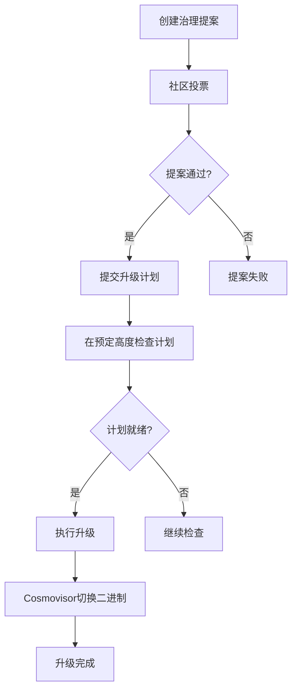

# Upgrade模块

<cite>
**本文档引用的文件**
- [upgrade.proto](file://proto/cosmos/upgrade/v1beta1/upgrade.proto)
- [query.proto](file://proto/cosmos/upgrade/v1beta1/query.proto)
- [tx.proto](file://proto/cosmos/upgrade/v1beta1/tx.proto)
- [module.go](file://x/upgrade/module.go)
- [abci.go](file://x/upgrade/abci.go)
- [doc.go](file://x/upgrade/doc.go)
- [module.pulsar.go](file://api/cosmos/upgrade/module/v1/module.pulsar.go)
</cite>

## 目录
1. [简介](#简介)
2. [核心功能](#核心功能)
3. [Protobuf定义](#protobuf定义)
4. [gRPC API端点](#grpc-api端点)
5. [与Gov模块集成](#与gov模块集成)
6. [与Cosmovisor协同工作](#与cosmovisor协同工作)
7. [升级流程示例](#升级流程示例)

## 简介

Upgrade模块是Cosmos SDK中的一个关键模块，用于协调和执行区块链的软件升级，实现无需分叉的平滑升级。该模块通过在预定的区块高度暂停区块链状态机，确保所有验证者在同一时间点切换到新版本的软件。这种机制避免了传统升级中可能出现的状态不一致问题。

**Section sources**
- [doc.go](file://x/upgrade/doc.go#L1-L13)

## 核心功能

Upgrade模块的核心功能包括：
- **计划升级**：允许通过治理提案创建升级计划，指定升级名称和执行高度。
- **协调执行**：在预定的区块高度，模块会检查是否存在待执行的升级计划，并协调所有节点执行升级。
- **版本管理**：跟踪模块的版本信息，确保升级过程中的兼容性。
- **错误处理**：在升级过程中提供详细的错误信息，帮助节点操作员及时响应。

该模块通过`PreBlocker`钩子在每个区块开始时检查升级计划，确保升级在精确的区块高度执行。如果当前软件版本不支持即将执行的升级，模块会触发错误并停止节点，防止状态不一致。

**Section sources**
- [abci.go](file://x/upgrade/abci.go#L17-L135)
- [module.go](file://x/upgrade/module.go#L158-L163)

## Protobuf定义

### Plan结构

`Plan`消息定义了升级计划的详细信息：

```protobuf
message Plan {
  string name = 1;
  int64 height = 3;
  string info = 4;
}
```

- **name**：升级的名称，用于标识升级计划。
- **height**：升级必须执行的区块高度。
- **info**：包含升级的附加信息，如Git提交哈希。

### 模块配置

`Module`消息定义了Upgrade模块的配置：

```protobuf
message Module {
  string authority = 1;
}
```

- **authority**：自定义模块的授权地址，默认为治理模块。

**Diagram sources**
- [upgrade.proto](file://proto/cosmos/upgrade/v1beta1/upgrade.proto#L14-L44)
- [module.pulsar.go](file://api/cosmos/upgrade/module/v1/module.pulsar.go#L449-L457)

## gRPC API端点

### QueryCurrentPlan

`QueryCurrentPlan`端点用于查询当前的升级计划：

```protobuf
rpc CurrentPlan(QueryCurrentPlanRequest) returns (QueryCurrentPlanResponse) {
  option (google.api.http).get = "/cosmos/upgrade/v1beta1/current_plan";
}
```

- **请求**：`QueryCurrentPlanRequest`（空消息）
- **响应**：`QueryCurrentPlanResponse`，包含当前的`Plan`对象。

### MsgSoftwareUpgrade

`MsgSoftwareUpgrade`消息用于通过治理提案发起软件升级：

```protobuf
message MsgSoftwareUpgrade {
  string authority = 1;
  Plan plan = 2;
}
```

- **authority**：控制模块的地址（默认为x/gov）。
- **plan**：要执行的升级计划。

**Diagram sources**
- [query.proto](file://proto/cosmos/upgrade/v1beta1/query.proto#L13-L15)
- [tx.proto](file://proto/cosmos/upgrade/v1beta1/tx.proto#L28-L39)

## 与Gov模块集成

Upgrade模块与Gov模块紧密集成，通过链上治理提案来触发升级计划。具体流程如下：

1. **提案创建**：通过`MsgSoftwareUpgrade`消息创建一个治理提案，包含升级计划。
2. **投票和执行**：社区成员对提案进行投票，如果提案通过，升级计划将被提交到Upgrade模块。
3. **计划执行**：在预定的区块高度，Upgrade模块会检查并执行升级计划。

这种集成确保了升级过程的去中心化和透明性，所有节点操作员都可以参与决策。

**Section sources**
- [tx.proto](file://proto/cosmos/upgrade/v1beta1/tx.proto#L17-L25)
- [module.go](file://x/upgrade/module.go#L115-L117)

## 与Cosmovisor协同工作

Upgrade模块与Cosmovisor工具协同工作，后者负责在计划的升级高度自动切换到新版本的二进制文件。具体工作流程如下：

1. **二进制文件准备**：节点操作员提前将新版本的二进制文件放置在Cosmovisor的指定目录中。
2. **升级触发**：当Upgrade模块检测到升级计划时，会通知Cosmovisor。
3. **自动切换**：Cosmovisor在预定的区块高度自动停止当前节点并启动新版本的二进制文件。

这种协同工作确保了升级过程的自动化和可靠性，减少了人为干预的风险。

**Section sources**
- [abci.go](file://x/upgrade/abci.go#L97-L109)
- [module.go](file://x/upgrade/module.go#L223-L227)

## 升级流程示例

### 创建升级计划

1. **准备提案**：创建一个包含`MsgSoftwareUpgrade`消息的治理提案。
2. **提交提案**：通过CLI或API提交提案，指定升级名称、高度和附加信息。
3. **投票**：社区成员对提案进行投票，确保多数同意。

### 执行升级

1. **计划检查**：在每个区块开始时，Upgrade模块检查是否存在待执行的升级计划。
2. **执行升级**：在预定的区块高度，模块调用`ApplyUpgrade`函数执行升级。
3. **二进制切换**：Cosmovisor检测到升级信号，自动切换到新版本的二进制文件。



**Diagram sources**
- [abci.go](file://x/upgrade/abci.go#L73-L115)
- [module.go](file://x/upgrade/module.go#L223-L227)