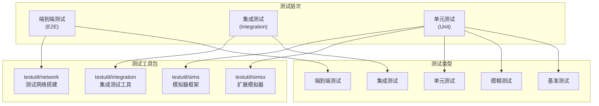
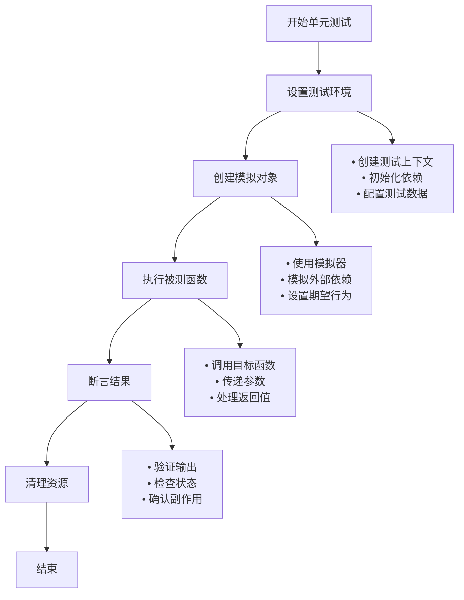
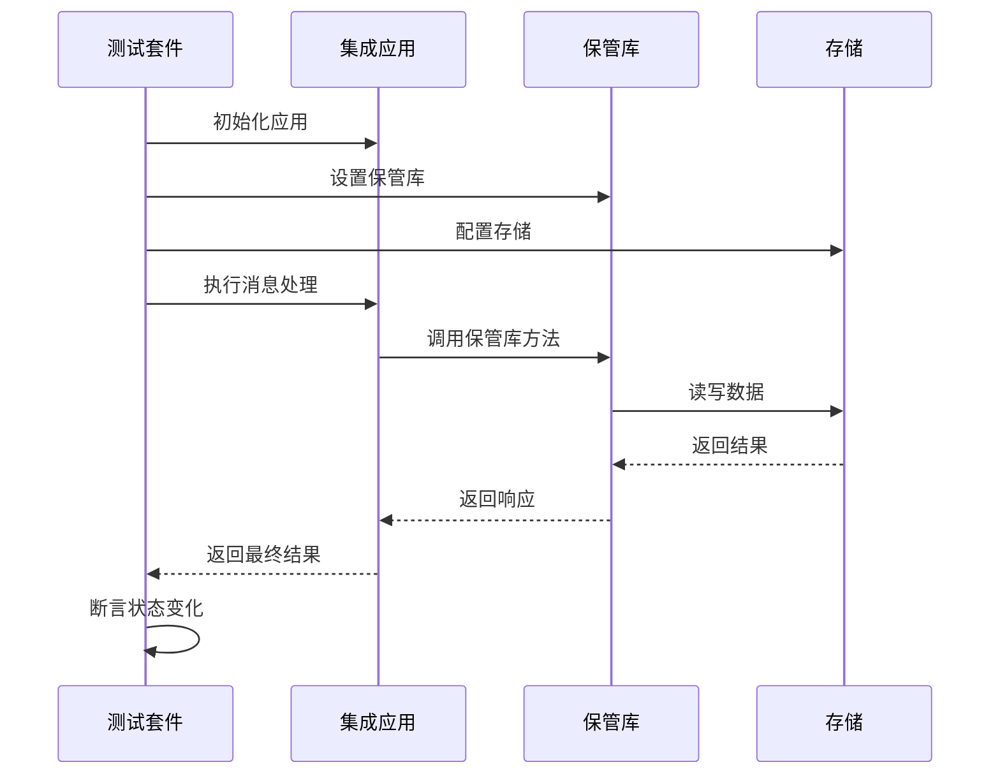
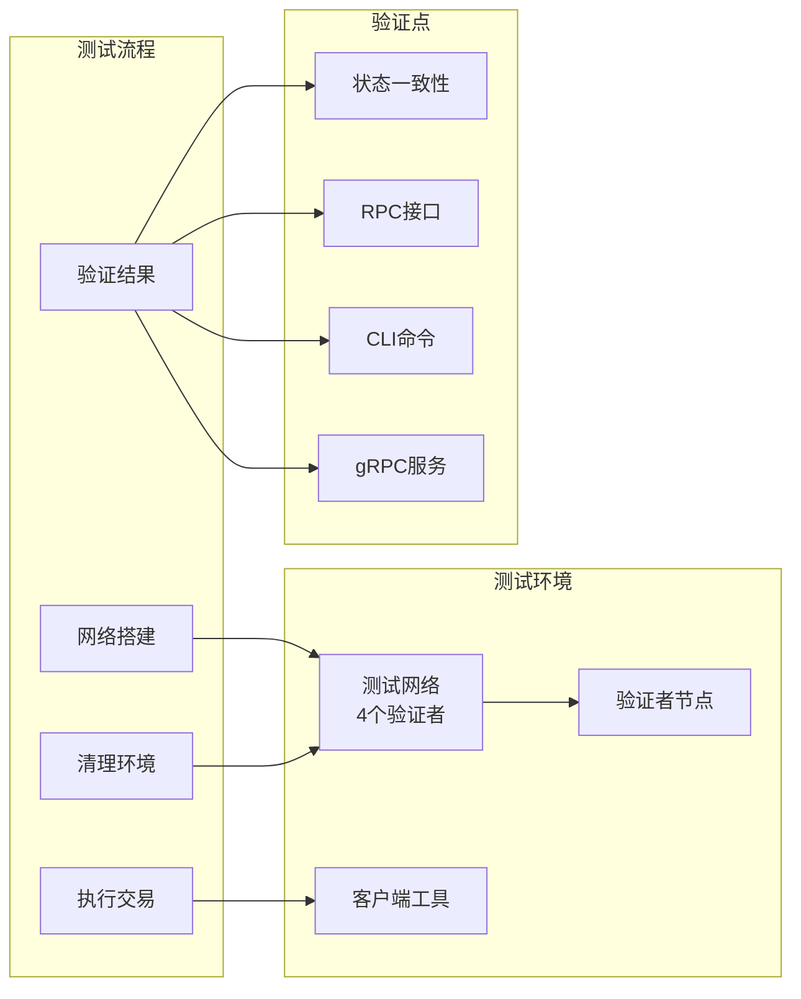
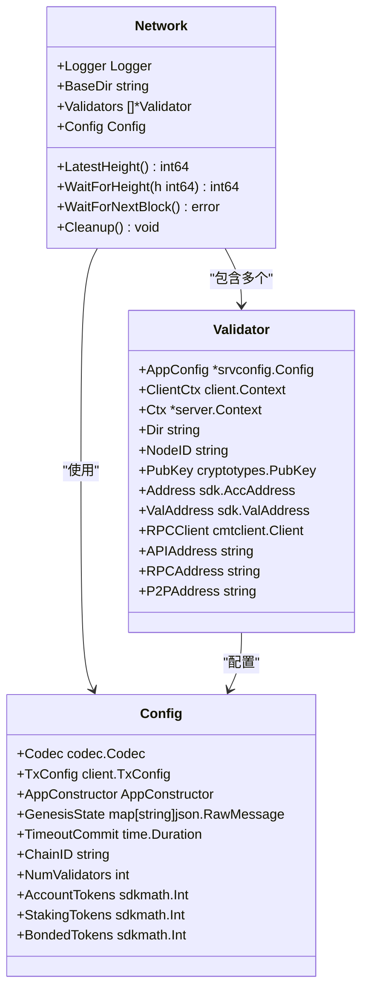
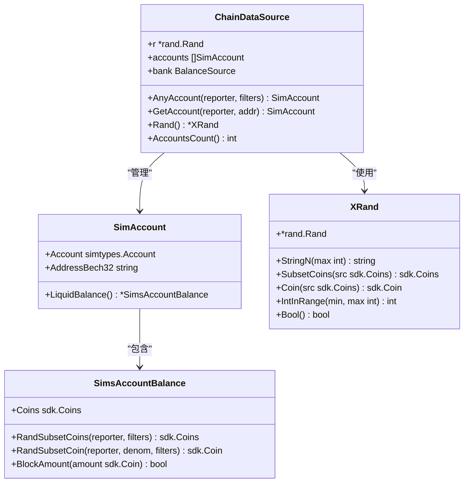
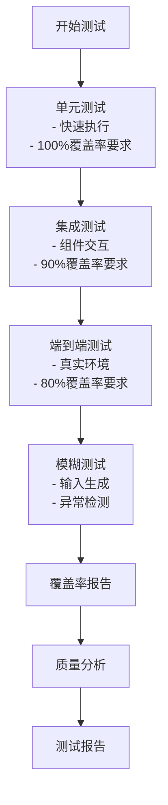

# 测试指南

<cite>
**本文档引用的文件**
- [testutil/network/doc.go](file://testutil/network/doc.go)
- [testutil/network/network.go](file://testutil/network/network.go)
- [testutil/simsx/README.md](file://testutil/simsx/README.md)
- [testutil/simsx/environment.go](file://testutil/simsx/environment.go)
- [testutil/sims/app_helpers.go](file://testutil/sims/app_helpers.go)
- [testutil/integration/router.go](file://testutil/integration/router.go)
- [tests/e2e/bank/suite.go](file://tests/e2e/bank/suite.go)
- [tests/integration/bank/keeper/deterministic_test.go](file://tests/integration/bank/keeper/deterministic_test.go)
- [tests/Makefile](file://tests/Makefile)
- [codecov.yml](file://codecov.yml)
- [tests/fuzz/README.md](file://tests/fuzz/README.md)
</cite>

## 目录
1. [简介](#简介)
2. [测试架构概览](#测试架构概览)
3. [单元测试](#单元测试)
4. [集成测试](#集成测试)
5. [端到端测试](#端到端测试)
6. [测试工具包详解](#测试工具包详解)
7. [测试覆盖率与质量保证](#测试覆盖率与质量保证)
8. [测试最佳实践](#测试最佳实践)
9. [常见陷阱与解决方案](#常见陷阱与解决方案)
10. [性能测试与基准测试](#性能测试与基准测试)
11. [总结](#总结)

## 简介

Cosmos SDK 提供了完整的测试框架，支持从单元测试到端到端测试的全方位测试覆盖。本指南详细介绍了如何使用 SDK 内置的测试工具包，包括 `testutil` 包中的核心组件：`network`、`sims` 和 `simsx`，以及如何编写高质量的测试用例。

## 测试架构概览

Cosmos SDK 的测试架构采用分层设计，包含以下主要层次：



**图表来源**
- [testutil/network/doc.go](file://testutil/network/doc.go#L1-L67)
- [testutil/simsx/README.md](file://testutil/simsx/README.md#L1-L48)

## 单元测试

### 基础单元测试结构

单元测试是测试金字塔的基础，专注于测试单个函数或方法的行为。



**图表来源**
- [tests/integration/bank/keeper/deterministic_test.go](file://tests/integration/bank/keeper/deterministic_test.go#L60-L129)

### 使用模拟器进行单元测试

`testutil/sims` 包提供了强大的模拟功能，用于创建可控的测试环境：

#### 模拟应用设置

```go
// 初始化测试配置
func initDeterministicFixture(t *testing.T) *deterministicFixture {
    // 创建存储键
    keys := storetypes.NewKVStoreKeys(authtypes.StoreKey, banktypes.StoreKey)
    
    // 创建编码配置
    cdc := moduletestutil.MakeTestEncodingConfig(
        auth.AppModuleBasic{}, 
        bank.AppModuleBasic{}
    ).Codec
    
    // 创建上下文和多存储
    logger := log.NewTestLogger(t)
    cms := integration.CreateMultiStore(keys, logger)
    newCtx := sdk.NewContext(cms, cmtproto.Header{}, true, logger)
    
    // 初始化账户和银行保管库
    accountKeeper := authkeeper.NewAccountKeeper(/* ... */)
    bankKeeper := keeper.NewBaseKeeper(/* ... */)
    
    // 创建集成应用
    integrationApp := integration.NewIntegrationApp(/* ... */)
    
    return &deterministicFixture{
        ctx:         sdkCtx,
        bankKeeper:  bankKeeper,
        queryClient: queryClient,
    }
}
```

**章节来源**
- [tests/integration/bank/keeper/deterministic_test.go](file://tests/integration/bank/keeper/deterministic_test.go#L60-L129)

### 使用快速测试进行确定性测试

Cosmos SDK 支持使用 `rapid` 库进行快速测试，确保测试的确定性和可重复性：

```go
func TestGRPCQueryBalance(t *testing.T) {
    t.Parallel()
    f := initDeterministicFixture(t)
    
    rapid.Check(t, func(rt *rapid.T) {
        addr := testdata.AddressGenerator(rt).Draw(rt, "address")
        coin := getCoin(rt)
        fundAccount(f, addr, coin)
        
        req := banktypes.NewQueryBalanceRequest(addr, coin.GetDenom())
        testdata.DeterministicIterations(f.ctx, t, req, f.queryClient.Balance, 0, true)
    })
}
```

**章节来源**
- [tests/integration/bank/keeper/deterministic_test.go](file://tests/integration/bank/keeper/deterministic_test.go#L143-L155)

## 集成测试

### 集成测试概述

集成测试验证多个组件之间的交互，确保它们能够正确地协同工作。



**图表来源**
- [testutil/integration/router.go](file://testutil/integration/router.go#L122-L168)

### 创建集成测试应用

集成测试应用提供了模块间的完整交互环境：

```go
func NewIntegrationApp(
    sdkCtx sdk.Context,
    logger log.Logger,
    keys map[string]*storetypes.KVStoreKey,
    appCodec codec.Codec,
    modules map[string]appmodule.AppModule,
    baseAppOptions ...func(*baseapp.BaseApp),
) *App {
    // 创建基础应用
    bApp := baseapp.NewBaseApp(appName, logger, db, txConfig.TxDecoder(), baseAppOptions...)
    
    // 设置初始化链和块处理器
    bApp.SetInitChainer(func(_ sdk.Context, _ *cmtabcitypes.RequestInitChain) (*cmtabcitypes.ResponseInitChain, error) {
        for _, mod := range modules {
            if m, ok := mod.(module.HasGenesis); ok {
                m.InitGenesis(sdkCtx, appCodec, m.DefaultGenesis(appCodec))
            }
        }
        return &cmtabcitypes.ResponseInitChain{}, nil
    })
    
    // 设置消息路由器
    router := baseapp.NewMsgServiceRouter()
    router.SetInterfaceRegistry(interfaceRegistry)
    bApp.SetMsgServiceRouter(router)
    
    return &App{
        BaseApp:       bApp,
        logger:        logger,
        ctx:           ctx,
        moduleManager: *moduleManager,
        queryHelper:   baseapp.NewQueryServerTestHelper(ctx, interfaceRegistry),
    }
}
```

**章节来源**
- [testutil/integration/router.go](file://testutil/integration/router.go#L42-L119)

### 消息执行和状态验证

集成测试中的消息执行流程：

```go
func (app *App) RunMsg(msg sdk.Msg, option ...Option) (*codectypes.Any, error) {
    // 应用选项配置
    cfg := &Config{}
    for _, opt := range option {
        opt(cfg)
    }
    
    // 自动提交配置
    if cfg.AutomaticCommit {
        defer app.Commit()
    }
    
    // 自动完成区块
    if cfg.AutomaticFinalizeBlock {
        height := app.LastBlockHeight() + 1
        if _, err := app.FinalizeBlock(&cmtabcitypes.RequestFinalizeBlock{Height: height}); err != nil {
            return nil, fmt.Errorf("failed to run finalize block: %w", err)
        }
    }
    
    // 执行消息
    handler := app.MsgServiceRouter().Handler(msg)
    if handler == nil {
        return nil, fmt.Errorf("handler is nil, can't route message %s: %+v", sdk.MsgTypeURL(msg), msg)
    }
    
    msgResult, err := handler(app.ctx, msg)
    if err != nil {
        return nil, fmt.Errorf("failed to execute message %s: %w", sdk.MsgTypeURL(msg), err)
    }
    
    return msgResult.MsgResponses[0], nil
}
```

**章节来源**
- [testutil/integration/router.go](file://testutil/integration/router.go#L122-L168)

## 端到端测试

### 端到端测试架构

端到端测试模拟真实的用户场景，验证整个系统的功能。



**图表来源**
- [testutil/network/network.go](file://testutil/network/network.go#L346-L432)
- [tests/e2e/bank/suite.go](file://tests/e2e/bank/suite.go#L36-L95)

### 测试网络配置

端到端测试使用 `testutil/network` 包创建真实的测试网络：

```go
func (s *E2ETestSuite) SetupSuite() {
    s.T().Log("设置端到端测试套件")
    
    // 配置网络
    cfg := network.DefaultConfig()
    cfg.NumValidators = 4
    cfg.ChainID = "test-chain"
    
    // 启动测试网络
    var err error
    s.network, err = network.New(s.T(), s.T().TempDir(), cfg)
    s.Require().NoError(err)
    
    // 等待初始区块
    s.Require().NoError(s.network.WaitForNextBlock())
}
```

**章节来源**
- [tests/e2e/bank/suite.go](file://tests/e2e/bank/suite.go#L36-L95)

### 交易执行和验证

端到端测试中的交易执行流程：

```go
func (s *E2ETestSuite) TestNewSendTxCmd() {
    val := s.network.Validators[0]
    clientCtx := val.ClientCtx
    
    // 准备交易参数
    from := val.Address
    to := val.Address
    amount := sdk.NewCoins(
        sdk.NewCoin(fmt.Sprintf("%stoken", val.Moniker), math.NewInt(10)),
        sdk.NewCoin(s.cfg.BondDenom, math.NewInt(10)),
    )
    
    // 执行交易
    bz, err := clitestutil.MsgSendExec(clientCtx, from, to, amount, 
        addresscodec.NewBech32Codec("cosmos"), args...)
    
    // 验证结果
    s.Require().NoError(err)
    tx, err := s.cfg.TxConfig.TxJSONDecoder()(bz.Bytes())
    s.Require().NoError(err)
    s.Require().Equal([]sdk.Msg{types.NewMsgSend(from, to, amount)}, tx.GetMsgs())
}
```

**章节来源**
- [tests/e2e/bank/suite.go](file://tests/e2e/bank/suite.go#L98-L121)

## 测试工具包详解

### Network 包 - 测试网络搭建

`testutil/network` 包提供了完整的测试网络基础设施：

#### 核心组件



**图表来源**
- [testutil/network/network.go](file://testutil/network/network.go#L252-L310)

#### 默认配置

```go
func DefaultConfig(factory TestFixtureFactory) Config {
    fixture := factory()
    
    return Config{
        Codec:             fixture.EncodingConfig.Codec,
        TxConfig:          fixture.EncodingConfig.TxConfig,
        LegacyAmino:       fixture.EncodingConfig.Amino,
        InterfaceRegistry: fixture.EncodingConfig.InterfaceRegistry,
        AccountRetriever:  authtypes.AccountRetriever{},
        AppConstructor:    fixture.AppConstructor,
        GenesisState:      fixture.GenesisState,
        TimeoutCommit:     2 * time.Second,
        ChainID:           "chain-" + unsafe.Str(6),
        NumValidators:     4,
        BondDenom:         sdk.DefaultBondDenom,
        MinGasPrices:      fmt.Sprintf("0.000006%s", sdk.DefaultBondDenom),
        AccountTokens:     sdk.TokensFromConsensusPower(1000, sdk.DefaultPowerReduction),
        StakingTokens:     sdk.TokensFromConsensusPower(500, sdk.DefaultPowerReduction),
        BondedTokens:      sdk.TokensFromConsensusPower(100, sdk.DefaultPowerReduction),
        PruningStrategy:   pruningtypes.PruningOptionNothing,
        CleanupDir:        true,
        SigningAlgo:       string(hd.Secp256k1Type),
        KeyringOptions:    []keyring.Option{},
        PrintMnemonic:     false,
    }
}
```

**章节来源**
- [testutil/network/network.go](file://testutil/network/network.go#L135-L161)

### Simsx 包 - 扩展模拟器

`simsx` 包提供了更高级的模拟器功能，简化了消息工厂和测试数据管理：

#### 测试数据环境



**图表来源**
- [testutil/simsx/environment.go](file://testutil/simsx/environment.go#L247-L390)

#### 消息工厂模式

```go
func MsgSendFactory() simsx.SimMsgFactoryFn[*types.MsgSend] {
    return func(ctx context.Context, testData *simsx.ChainDataSource, reporter simsx.SimulationReporter) ([]simsx.SimAccount, *types.MsgSend) {
        from := testData.AnyAccount(reporter, simsx.WithSpendableBalance())
        to := testData.AnyAccount(reporter, simsx.ExcludeAccounts(from))
        coins := from.LiquidBalance().RandSubsetCoins(reporter, simsx.WithSendEnabledCoins())
        
        return []simsx.SimAccount{from}, types.NewMsgSend(from.AddressBech32, to.AddressBech32, coins)
    }
}
```

**章节来源**
- [testutil/simsx/README.md](file://testutil/simsx/README.md#L8-L18)

### Sim 包 - 基础模拟器

`sims` 包提供了基础的模拟器功能，用于应用程序级别的模拟测试：

#### 应用设置

```go
func SetupWithConfiguration(appConfig depinject.Config, startupConfig StartupConfig, extraOutputs ...any) (*runtime.App, error) {
    // 注入依赖
    var (
        app        *runtime.App
        appBuilder *runtime.AppBuilder
        codec      codec.Codec
    )
    
    if err := depinject.Inject(appConfig, append(extraOutputs, &appBuilder, &codec)...); err != nil {
        return nil, fmt.Errorf("failed to inject dependencies: %w", err)
    }
    
    // 构建应用
    app = appBuilder.Build(startupConfig.DB, nil, startupConfig.BaseAppOption)
    if err := app.Load(true); err != nil {
        return nil, fmt.Errorf("failed to load app: %w", err)
    }
    
    // 创建验证者集合
    valSet, err := startupConfig.ValidatorSet()
    if err != nil {
        return nil, fmt.Errorf("failed to create validator set")
    }
    
    // 初始化创世状态
    genesisState, err := GenesisStateWithValSet(codec, app.DefaultGenesis(), valSet, genAccounts, balances...)
    if err != nil {
        return nil, fmt.Errorf("failed to create genesis state: %w", err)
    }
    
    return app, nil
}
```

**章节来源**
- [testutil/sims/app_helpers.go](file://testutil/sims/app_helpers.go#L136-L208)

## 测试覆盖率与质量保证

### 覆盖率配置

Cosmos SDK 使用 Codecov 进行测试覆盖率监控：

```yaml
coverage:
  precision: 2
  round: down
  range: "70...100"

  status:
    project:
      default:
        target: auto
        threshold: 0.5%
        informational: false
        if_ci_failed: error
```

**章节来源**
- [codecov.yml](file://codecov.yml#L1-L15)

### 测试执行策略



### 测试命令

```bash
# 集成测试
make test-integration

# 集成测试覆盖率
make test-integration-cov

# 端到端测试
make test-e2e

# 端到端测试覆盖率
make test-e2e-cov
```

**章节来源**
- [tests/Makefile](file://tests/Makefile#L1-L11)

## 测试最佳实践

### 测试命名约定

1. **单元测试**: `TestFunctionName`
2. **集成测试**: `TestModuleNameSuite`
3. **端到端测试**: `TestE2EFunctionality`
4. **模糊测试**: `FuzzFunctionName`

### 测试组织结构

```go
// 推荐的测试文件结构
package keeper_test

import (
    "testing"
    "github.com/stretchr/testify/suite"
    
    "cosmossdk.io/types"
    "cosmossdk.io/keeper"
)

// 测试套件结构
type KeeperTestSuite struct {
    suite.Suite
    ctx         sdk.Context
    keeper      keeper.BaseKeeper
    queryServer types.QueryServer
}

// 测试套件初始化
func (s *KeeperTestSuite) SetupTest() {
    // 设置测试环境
}

// 单元测试
func (s *KeeperTestSuite) TestFunctionName() {
    // 测试逻辑
}

// 集成测试
func TestKeeperTestSuite(t *testing.T) {
    suite.Run(t, new(KeeperTestSuite))
}
```

### 测试数据管理

```go
// 使用测试工具包提供的辅助函数
func fundAccount(f *deterministicFixture, addr sdk.AccAddress, coin ...sdk.Coin) {
    err := banktestutil.FundAccount(f.ctx, f.bankKeeper, addr, sdk.NewCoins(coin...))
    assert.NilError(&testing.T{}, err)
}

// 使用快速测试生成随机数据
func getCoin(rt *rapid.T) sdk.Coin {
    return sdk.NewCoin(
        rapid.StringMatching(denomRegex).Draw(rt, "denom"),
        math.NewInt(rapid.Int64Min(1).Draw(rt, "amount")),
    )
}
```

### 错误处理最佳实践

```go
// 使用 Require() 进行断言
func (s *E2ETestSuite) TestTransactionValidation() {
    val := s.network.Validators[0]
    
    // 正确的错误处理
    _, err := clitestutil.MsgSendExec(clientCtx, from, to, invalidAmount, args...)
    s.Require().Error(err)
    
    // 验证特定错误码
    s.Require().Equal(sdkerrors.ErrInsufficientFee.ABCICode(), txResp.Code)
}

// 使用 Skip() 处理可选测试
func (s *E2ETestSuite) TestOptionalFeature() {
    if !optionalFeatureEnabled {
        s.T().Skip("可选特性未启用")
    }
    
    // 执行测试
}
```

## 常见陷阱与解决方案

### 时间处理陷阱

在测试中正确处理时间是关键：

```go
// 问题：使用系统时间导致测试不可重现
func problematicTest() {
    now := time.Now()  // ❌ 不可重现
    // 测试逻辑
}

// 解决方案：使用确定性时间
func goodTest() {
    // 在测试中设置固定时间
    ctx := ctx.WithBlockTime(time.Date(2023, 1, 1, 0, 0, 0, 0, time.UTC))
    
    // 或使用模拟时间
    mockTime := time.Date(2023, 1, 1, 0, 0, 0, 0, time.UTC)
    ctx = ctx.WithBlockTime(mockTime)
}
```

### 随机性陷阱

```go
// 问题：使用不固定的随机数种子
func badRandomTest() {
    rand.Seed(time.Now().UnixNano())  // ❌ 每次运行不同
    // 测试逻辑
}

// 解决方案：使用确定性随机数生成器
func goodRandomTest() {
    // 使用测试工具包提供的随机数生成器
    rt := rapid.NewRapid()
    rt.Seed(42)  // ✅ 固定种子
    
    // 或使用测试数据生成器
    addr := testdata.AddressGenerator(rt).Draw(rt, "address")
}
```

### 并发测试陷阱

```go
// 问题：并发测试中的竞态条件
func badConcurrentTest() {
    var wg sync.WaitGroup
    for i := 0; i < 10; i++ {
        wg.Add(1)
        go func(i int) {
            defer wg.Done()
            // 共享状态操作 ❌
        }(i)
    }
    wg.Wait()
}

// 解决方案：使用线程安全的数据结构
func goodConcurrentTest() {
    var mu sync.Mutex
    sharedState := make(map[int]int)
    
    var wg sync.WaitGroup
    for i := 0; i < 10; i++ {
        wg.Add(1)
        go func(i int) {
            defer wg.Done()
            mu.Lock()
            sharedState[i] = i * 2
            mu.Unlock()
        }(i)
    }
    wg.Wait()
}
```

### 网络测试陷阱

```go
// 问题：网络测试中的端口冲突
func badNetworkTest() {
    // 使用固定端口 ❌
    server := http.ListenAndServe(":8080", handler)
}

// 解决方案：使用动态端口分配
func goodNetworkTest() {
    listener, err := net.Listen("tcp", "localhost:0")
    if err != nil {
        // 错误处理
    }
    port := listener.Addr().(*net.TCPAddr).Port
    
    server := http.Serve(listener, handler)
    // 使用 port 进行测试
}
```

## 性能测试与基准测试

### 基准测试框架

```go
// 基准测试示例
func BenchmarkBankTransfer(b *testing.B) {
    f := initDeterministicFixture(b)
    
    // 设置测试数据
    from := sdk.AccAddress("from_address")
    to := sdk.AccAddress("to_address")
    amount := sdk.NewCoins(sdk.NewCoin("stake", math.NewInt(100)))
    
    fundAccount(f, from, amount...)
    
    // 重置计时器
    b.ResetTimer()
    
    // 执行基准测试
    for i := 0; i < b.N; i++ {
        _, err := f.bankKeeper.SendCoins(f.ctx, from, to, amount)
        require.NoError(b, err)
    }
}
```

### 性能监控

```go
// 性能指标收集
func BenchmarkMessageProcessing(b *testing.B) {
    // 设置监控
    metrics := telemetry.NewMetrics()
    
    // 执行测试
    for i := 0; i < b.N; i++ {
        start := time.Now()
        // 处理消息
        elapsed := time.Since(start)
        
        // 记录指标
        metrics.RecordHistogram("message_processing_time", float64(elapsed.Milliseconds()))
    }
}
```

### 内存使用分析

```go
// 内存使用基准测试
func BenchmarkMemoryUsage(b *testing.B) {
    b.ReportAllocs()
    
    for i := 0; i < b.N; i++ {
        // 创建大量对象
        objects := make([]largeObject, 1000)
        for j := range objects {
            objects[j] = createLargeObject()
        }
        // 清理
        objects = nil
    }
}
```

## 总结

Cosmos SDK 提供了完整的测试生态系统，从底层的单元测试到顶层的端到端测试，涵盖了软件开发生命周期的各个阶段。通过合理使用 `testutil` 包中的工具，开发者可以构建高质量、可维护的测试套件。

### 关键要点

1. **分层测试策略**: 结合单元测试、集成测试和端到端测试，确保全面覆盖
2. **使用合适的工具**: 根据测试需求选择 `network`、`sims` 或 `simsx` 工具包
3. **关注测试质量**: 重视测试覆盖率、可读性和可维护性
4. **避免常见陷阱**: 特别注意时间处理、随机性和并发测试的问题
5. **持续改进**: 定期审查和优化测试套件，保持其有效性

### 下一步建议

1. **阅读源码**: 深入理解测试工具包的实现细节
2. **实践练习**: 为自定义模块编写测试用例
3. **参与社区**: 参与测试相关的讨论和贡献
4. **学习最佳实践**: 关注社区分享的测试经验和技巧

通过遵循本指南的原则和最佳实践，开发者可以构建出可靠、高效的测试体系，确保 Cosmos SDK 应用的质量和稳定性。