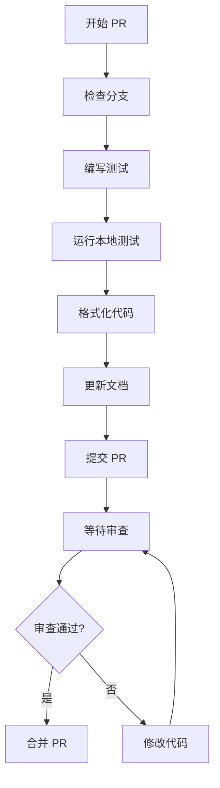
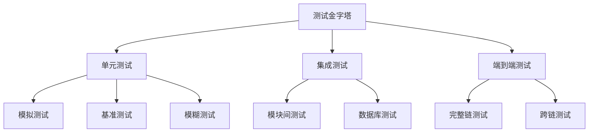
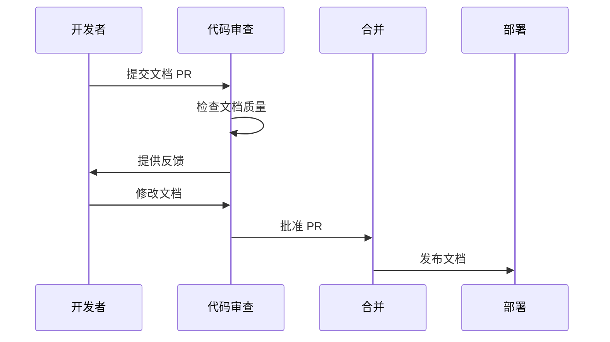
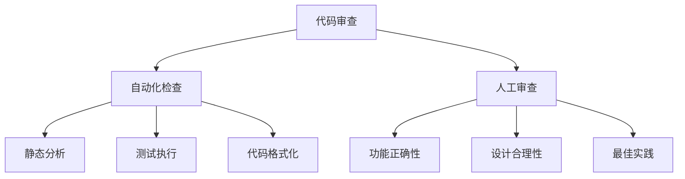
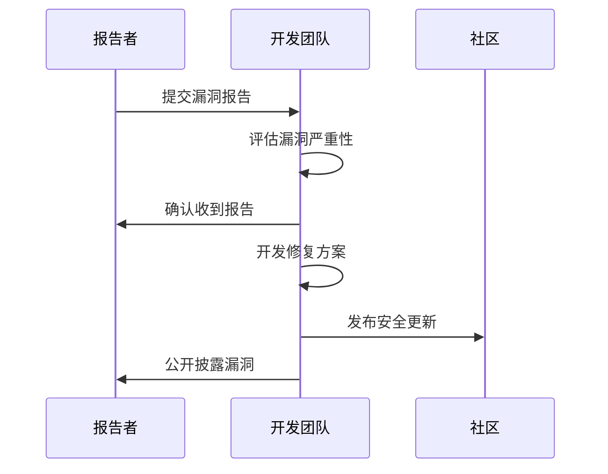

# 贡献指南

<cite>
**本文档中引用的文件**
- [README.md](file://README.md)
- [SECURITY.md](file://SECURITY.md)
- [UPGRADING.md](file://UPGRADING.md)
- [RELEASE_NOTES.md](file://RELEASE_NOTES.md)
- [Makefile](file://Makefile)
- [contrib/githooks/README.md](file://contrib/githooks/README.md)
- [CHANGELOG.md](file://CHANGELOG.md)
- [Dockerfile](file://Dockerfile)
- [codecov.yml](file://codecov.yml)
</cite>

## 目录
1. [项目简介](#项目简介)
2. [如何报告问题](#如何报告问题)
3. [如何提出功能请求](#如何提出功能请求)
4. [提交拉取请求的标准](#提交拉取请求的标准)
5. [代码风格和格式化](#代码风格和格式化)
6. [测试要求](#测试要求)
7. [文档更新](#文档更新)
8. [版本发布周期](#版本发布周期)
9. [本地开发环境设置](#本地开发环境设置)
10. [代码审查流程](#代码审查流程)
11. [社区行为准则](#社区行为准则)
12. [安全漏洞报告](#安全漏洞报告)
13. [故障排除指南](#故障排除指南)

## 项目简介

Cosmos SDK 是一个模块化的开源区块链 SDK，用于构建安全、高性能的第一层链，具有完全可定制性。该项目由 Cosmos Labs 维护，支持 200 多个生产中的区块链项目。

### 项目特点
- **模块化架构**：提供预定义模块和自定义模块支持
- **互操作性**：通过 IBC 协议实现原生跨链通信
- **高性能**：推荐使用 CometBFT 共识引擎
- **活跃社区**：拥有强大的开源贡献者社区

**章节来源**
- [README.md](file://README.md#L1-L80)

## 如何报告问题

### 报告 Bug 的流程

1. **搜索现有问题**
   - 在 GitHub Issues 中搜索相关问题
   - 确保问题没有被重复报告

2. **创建新问题**
   - 使用 Bug 报告模板
   - 提供详细的重现步骤
   - 包含系统环境信息
   - 描述预期行为和实际行为

3. **问题模板内容**
   - 版本信息
   - 操作系统信息
   - 复现步骤
   - 预期结果
   - 实际结果
   - 相关日志输出

### 问题分类

| 类别 | 描述 | 示例 |
|------|------|------|
| Bug | 功能异常或错误行为 | 应用程序崩溃、数据丢失 |
| 性能 | 性能问题或优化需求 | 内存泄漏、响应缓慢 |
| 文档 | 文档错误或缺失 | 错误的配置示例、遗漏的说明 |
| 安全 | 安全漏洞或风险 | 认证绕过、数据泄露 |

**章节来源**
- [README.md](file://README.md#L64-L66)

## 如何提出功能请求

### 功能请求流程

1. **讨论阶段**
   - 在 GitHub Discussions 中发起讨论
   - 描述功能需求和使用场景
   - 与维护者和其他贡献者交流

2. **提案准备**
   - 编写详细的功能描述
   - 说明技术实现方案
   - 讨论对现有系统的潜在影响

3. **正式提交**
   - 使用功能请求模板
   - 包含用例和验收标准
   - 提供实现时间估算

### 功能请求评估标准

- **兼容性**：是否破坏现有 API
- **复杂度**：实现难度和维护成本
- **价值**：对社区的贡献程度
- **可行性**：技术实现的可行性

## 提交拉取请求的标准

### PR 准备清单

1. **分支策略**
   - 基于最新的 `main` 分支创建功能分支
   - 使用描述性的分支名称
   - 遵循命名约定：`feature/描述`、`bugfix/描述`、`docs/描述`

2. **提交消息**
   - 使用 Conventional Commits 格式
   - 包含简短的标题和详细描述
   - 引用相关的 Issue 号码

3. **代码质量**
   - 通过所有自动化测试
   - 保持代码覆盖率在合理水平
   - 遵循项目编码标准

### PR 模板要求



**图表来源**
- [Makefile](file://Makefile#L190-L206)

**章节来源**
- [Makefile](file://Makefile#L190-L206)

## 代码风格和格式化

### 自动化工具

Cosmos SDK 使用以下工具确保代码一致性：

1. **Git Hooks**
   - 安装位置：`contrib/githooks/`
   - 自动运行：`gofmt`、`goimports`、`misspell`
   - 依赖工具：`golang.org/x/tools/cmd/goimports`、`github.com/golangci/misspell`

2. **安装命令**
   ```bash
   git config core.hooksPath contrib/githooks
   ```

### 手动格式化

```bash
# 运行代码格式化
make lint-fix

# 运行代码检查
make lint

# 格式化 Protobuf 文件
make proto-format
```

### 编码标准

| 标准 | 工具 | 命令 |
|------|------|------|
| Go 代码格式 | gofmt | `gofmt -w .` |
| 导入排序 | goimports | `goimports -w .` |
| 拼写检查 | misspell | `misspell -w .` |
| 代码检查 | golangci-lint | `make lint` |

**章节来源**
- [contrib/githooks/README.md](file://contrib/githooks/README.md#L3-L22)
- [Makefile](file://Makefile#L382-L398)

## 测试要求

### 测试类型

Cosmos SDK 实施多层次测试策略：



**图表来源**
- [Makefile](file://Makefile#L189-L206)

### 测试命令

```bash
# 运行所有测试
make test-all

# 运行单元测试
make test-unit

# 运行集成测试
make test-integration

# 运行端到端测试
make test-e2e

# 运行模拟测试
make test-sim-nondeterminism

# 运行基准测试
make test-sim-benchmark
```

### 测试覆盖率

项目使用 Codecov 监控测试覆盖率：

- **目标覆盖率**：至少 70%
- **忽略文件**：测试文件、Protobuf 生成文件、文档
- **报告格式**：HTML 和 JSON 格式

**章节来源**
- [Makefile](file://Makefile#L189-L206)
- [codecov.yml](file://codecov.yml#L1-L54)

## 文档更新

### 文档类型

1. **代码注释**
   - 使用 GoDoc 格式
   - 为公共 API 提供详细说明
   - 包含使用示例

2. **README 文件**
   - 更新项目说明
   - 添加新的使用示例
   - 更新依赖信息

3. **变更日志**
   - 记录重大更改
   - 使用统一的格式
   - 包含链接到相关 PR

### 文档提交流程



**图表来源**
- [CHANGELOG.md](file://CHANGELOG.md#L1-L37)

**章节来源**
- [CHANGELOG.md](file://CHANGELOG.md#L1-L37)

## 版本发布周期

### 发布策略

Cosmos SDK 采用以下发布策略：

1. **主要版本**（Major）
   - 包含破坏性更改
   - 需要协调升级
   - 通常包含新功能

2. **次要版本**（Minor）
   - 新功能和改进
   - 向后兼容
   - 较少破坏性更改

3. **补丁版本**（Patch）
   - Bug 修复
   - 安全修复
   - 向后兼容

### 升级注意事项

根据 [UPGRADING.md](file://UPGRADING.md)，升级到 v0.54.x 需要注意：

- **CometBFT 升级**：从 v0.x.x 升级到 v2.x.x
- **配置变更**：`TimeoutCommit` 被 `NextBlockDelay` 替代
- **协调升级**：需要链间的协调

### 发布时间线

| 阶段 | 时间范围 | 主要活动 |
|------|----------|----------|
| 开发阶段 | 3-6个月 | 功能开发、测试 |
| RC 阶段 | 2-4周 | 最终测试、修复 |
| 正式发布 | 1周内 | 文档、公告 |

**章节来源**
- [UPGRADING.md](file://UPGRADING.md#L1-L27)
- [RELEASE_NOTES.md](file://RELEASE_NOTES.md#L1-L18)

## 本地开发环境设置

### 系统要求

1. **Go 版本**
   - 推荐使用最新稳定版
   - 至少 Go 1.21+
   - 支持交叉编译

2. **操作系统**
   - Linux、macOS、Windows
   - 需要 Docker（可选）

3. **其他工具**
   - Git
   - Make
   - Protobuf 编译器

### 环境搭建步骤

```bash
# 克隆仓库
git clone https://github.com/cosmos/cosmos-sdk.git
cd cosmos-sdk

# 安装依赖
make install

# 初始化模拟应用
make init-simapp

# 运行本地网络
make localnet-start
```

### 开发工作流


**图表来源**
- [Makefile](file://Makefile#L190-L206)

### Docker 开发环境

项目提供 Docker 支持：

```bash
# 构建 Docker 镜像
docker build -t simapp .

# 运行本地网络
make localnet-start
```

**章节来源**
- [Makefile](file://Makefile#L190-L206)
- [Dockerfile](file://Dockerfile#L1-L56)

## 代码审查流程

### 审查标准

1. **功能性**
   - 代码是否实现预期功能
   - 是否处理了边界情况
   - 性能是否满足要求

2. **安全性**
   - 是否存在安全漏洞
   - 输入验证是否充分
   - 权限控制是否正确

3. **可维护性**
   - 代码是否易于理解
   - 是否有适当的注释
   - 是否遵循设计模式

4. **测试覆盖**
   - 是否有足够的测试
   - 测试是否有效
   - 是否覆盖了关键路径

### 审查工具



**图表来源**
- [Makefile](file://Makefile#L382-L398)

### 审查流程

1. **自动检查**
   - 代码格式化
   - 静态分析
   - 测试执行

2. **人工审查**
   - 功能验证
   - 设计评估
   - 代码质量

3. **最终决策**
   - 批准合并
   - 要求修改
   - 关闭 PR

**章节来源**
- [Makefile](file://Makefile#L382-L398)

## 社区行为准则

### 核心原则

1. **尊重包容**
   - 尊重不同观点和经验
   - 创建欢迎新贡献者的环境
   - 避免歧视性语言

2. **专业协作**
   - 保持专业态度
   - 建设性地提供反馈
   - 专注于问题解决

3. **积极贡献**
   - 主动帮助他人
   - 分享知识和经验
   - 促进社区发展

### 行为期望

| 积极行为 | 不当行为 |
|----------|----------|
| 建设性讨论 | 攻击性言论 |
| 乐于助人 | 不当行为 |
| 尊重差异 | 恶意攻击 |
| 透明沟通 | 偏见言论 |

### 问题处理

如果遇到不当行为：
1. 首先尝试私下沟通解决
2. 如果无法解决，联系项目维护者
3. 必要时向 GitHub 团队报告

## 安全漏洞报告

### 报告渠道

Cosmos SDK 实施负责任的漏洞披露政策：

1. **GitHub 私有漏洞报告**
   - 优先推荐方式
   - 保护开发者隐私
   - 快速响应处理

2. **HackerOne 奖励计划**
   - 适用于 Go、Rust、Protobuf 代码
   - 提供奖励机制
   - 专业的评估流程

### 报告要求

| 信息类型 | 必需程度 | 描述 |
|----------|----------|------|
| 漏洞描述 | 必需 | 详细说明漏洞 |
| 复现步骤 | 必需 | 清晰的操作步骤 |
| 影响范围 | 推荐 | 潜在影响评估 |
| 解决方案 | 可选 | 建议的修复方案 |

### 处理流程



**图表来源**
- [SECURITY.md](file://SECURITY.md#L22-L45)

**章节来源**
- [SECURITY.md](file://SECURITY.md#L1-L73)

## 故障排除指南

### 常见问题

1. **构建失败**
   - 检查 Go 版本兼容性
   - 确认依赖已正确安装
   - 清理缓存重新构建

2. **测试失败**
   - 检查测试环境配置
   - 验证测试数据完整性
   - 查看详细错误日志

3. **性能问题**
   - 分析资源使用情况
   - 检查并发设置
   - 优化数据库查询

### 调试工具

```bash
# 启用调试模式
make build-debug

# 运行内存分析
make test-sim-profile

# 运行竞争条件检测
make test-race
```

### 获取帮助

- **GitHub Discussions**：技术讨论和问题解答
- **Discord 社区**：实时交流和支持
- **官方文档**：详细的使用指南

**章节来源**
- [Makefile](file://Makefile#L190-L206)

## 结语

Cosmos SDK 项目欢迎所有形式的贡献。无论您是报告 bug、提出功能请求、提交代码还是改进文档，您的贡献都将帮助我们构建更好的区块链生态系统。

我们致力于创建一个包容、友好的环境，让每个人都能参与并贡献自己的力量。如果您有任何问题或建议，请随时通过各种渠道联系我们。

感谢您对 Cosmos SDK 生态系统的支持和贡献！