# 部署与运维

<cite>
**本文档中引用的文件**
- [server/config/config.go](file://server/config/config.go)
- [server/config/toml.go](file://server/config/toml.go)
- [client/config/config.go](file://client/config/config.go)
- [client/config/toml.go](file://client/config/toml.go)
- [Dockerfile](file://Dockerfile)
- [docker-compose.yml](file://docker-compose.yml)
- [server/pruning.go](file://server/pruning.go)
- [server/util.go](file://server/util.go)
- [server/start.go](file://server/start.go)
- [server/export.go](file://server/export.go)
- [telemetry/metrics.go](file://telemetry/metrics.go)
- [store/snapshots/manager.go](file://store/snapshots/manager.go)
- [store/snapshots/README.md](file://store/snapshots/README.md)
</cite>

## 目录
1. [简介](#简介)
2. [配置文件详解](#配置文件详解)
3. [数据修剪策略](#数据修剪策略)
4. [容器化部署](#容器化部署)
5. [监控与日志记录](#监控与日志记录)
6. [故障排除](#故障排除)
7. [高可用性部署](#高可用性部署)
8. [备份与恢复](#备份与恢复)
9. [最佳实践](#最佳实践)
10. [总结](#总结)

## 简介

Cosmos SDK是一个模块化的区块链开发框架，提供了完整的基础设施来构建去中心化应用。本指南涵盖了从基础配置到生产环境运维的完整流程，帮助运维人员建立稳定可靠的区块链节点。

## 配置文件详解

### 应用配置文件 (app.toml)

应用配置文件控制Cosmos SDK应用程序的核心行为，包含多个重要配置段落。

#### 基础配置 (Base Configuration)

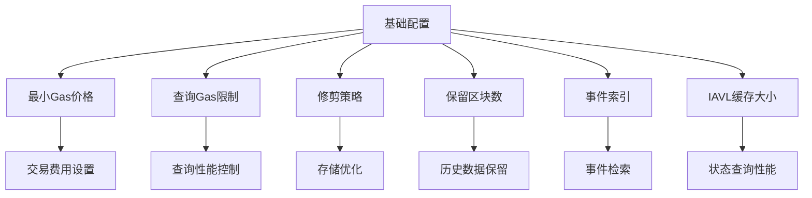

**图表来源**
- [server/config/config.go](file://server/config/config.go#L35-L94)

#### 关键参数说明

| 参数 | 默认值 | 描述 | 影响 |
|------|--------|------|------|
| `minimum-gas-prices` | "" | 最小Gas价格要求 | 决定交易费用门槛 |
| `query-gas-limit` | 0 | 查询最大Gas消耗 | 控制查询性能和安全性 |
| `pruning` | "default" | 修剪策略 | 影响磁盘空间使用 |
| `min-retain-blocks` | 0 | 最小保留区块数 | 影响历史数据保留 |
| `inter-block-cache` | true | 区块间缓存 | 提升查询性能 |
| `iavl-cache-size` | 781250 | IAVL树缓存大小 | 影响状态查询速度 |

#### API配置 (API Configuration)

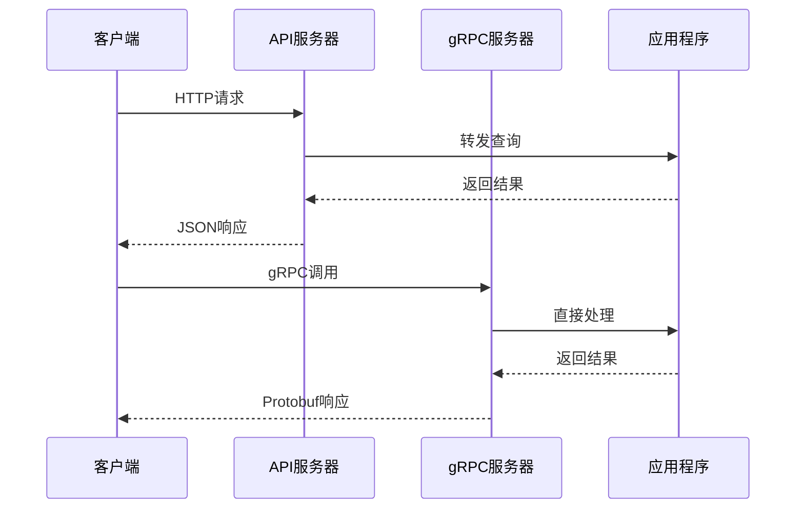

**图表来源**
- [server/config/config.go](file://server/config/config.go#L96-L125)

#### gRPC配置 (gRPC Configuration)

| 参数 | 默认值 | 描述 | 性能影响 |
|------|--------|------|----------|
| `enable` | true | 启用gRPC服务 | 提供高性能接口 |
| `address` | "localhost:9090" | 服务地址 | 网络访问配置 |
| `max-recv-msg-size` | 10MB | 最大接收消息大小 | 防止内存溢出 |
| `max-send-msg-size` | MaxInt32 | 最大发送消息大小 | 传输效率控制 |

**节来源**
- [server/config/config.go](file://server/config/config.go#L127-L145)

### 客户端配置文件 (client.toml)

客户端配置文件管理CLI工具和外部客户端的连接设置。

#### 核心配置项

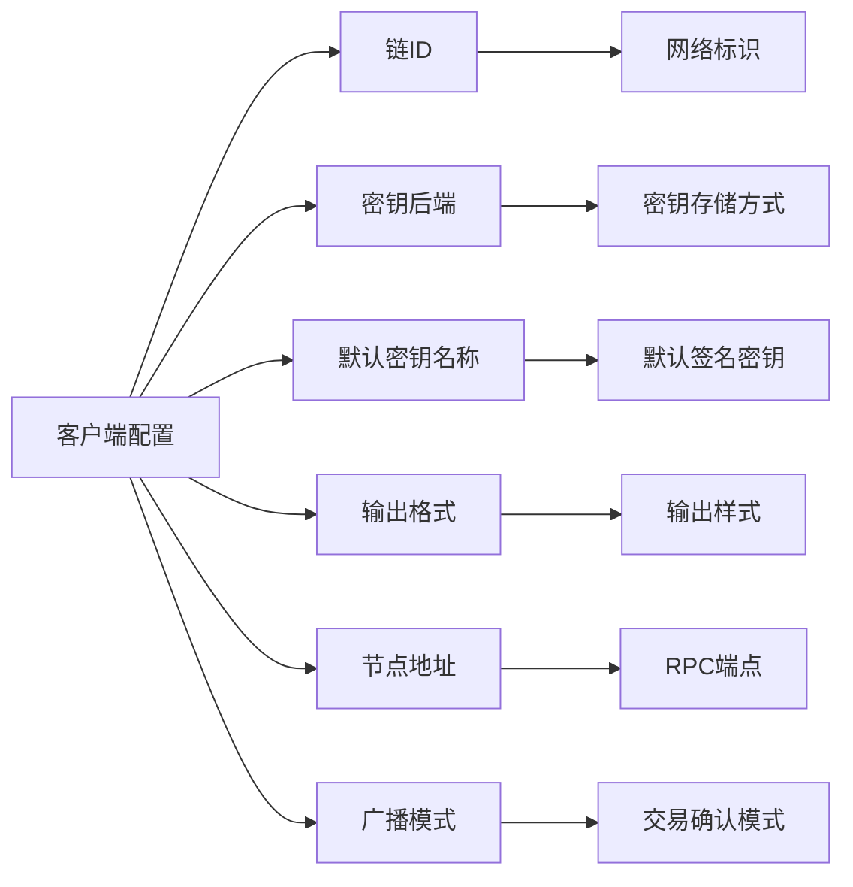

**图表来源**
- [client/config/config.go](file://client/config/config.go#L23-L30)

**节来源**
- [client/config/config.go](file://client/config/config.go#L11-L122)
- [client/config/toml.go](file://client/config/toml.go#L11-L67)

## 数据修剪策略

### 修剪类型与配置

Cosmos SDK提供了四种修剪策略，每种策略都有不同的性能和存储权衡：

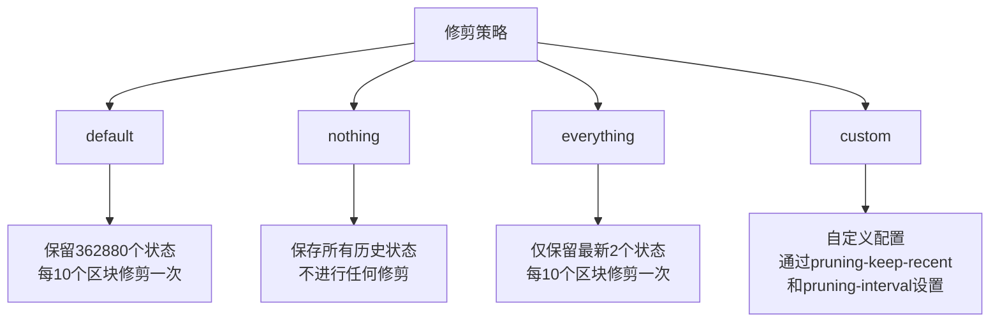

**图表来源**
- [server/pruning.go](file://server/pruning.go#L14-L40)

#### 修剪参数详解

| 参数 | 类型 | 描述 | 使用场景 |
|------|------|------|----------|
| `pruning` | string | 修剪策略选择 | 生产环境推荐default |
| `pruning-keep-recent` | string | 保留的最近状态数量 | 自定义修剪时必需 |
| `pruning-interval` | string | 修剪间隔区块数 | 自定义修剪时必需 |

#### 修剪对性能的影响

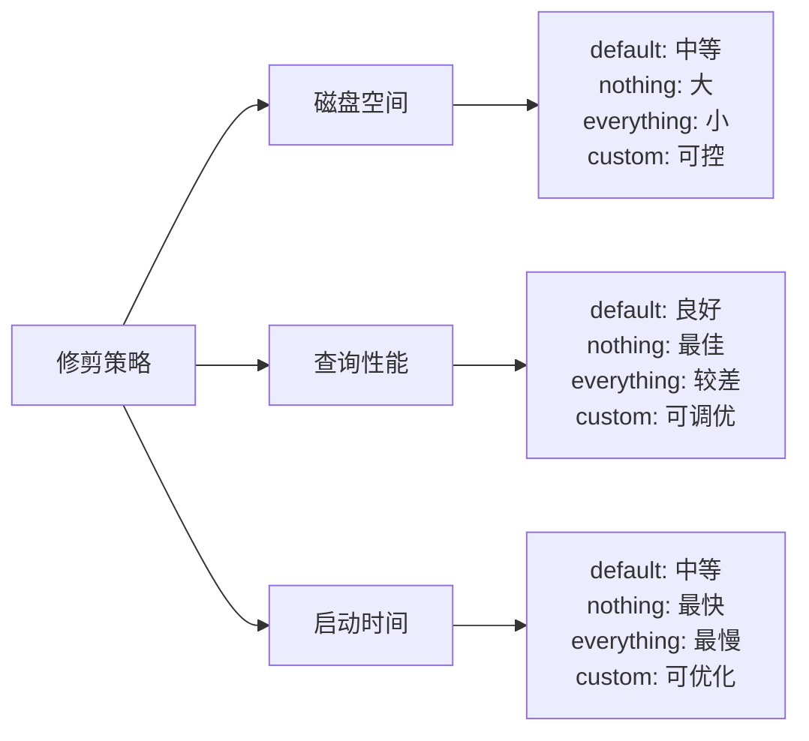

**节来源**
- [server/pruning.go](file://server/pruning.go#L14-L40)

## 容器化部署

### Docker部署

Cosmos SDK提供了完整的Docker支持，简化了部署流程。

#### Dockerfile结构分析

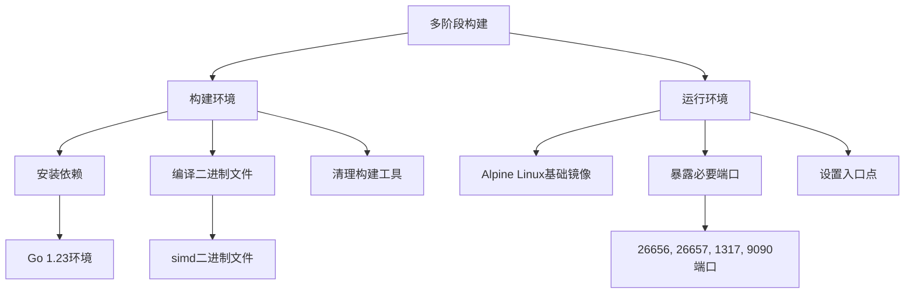

**图表来源**
- [Dockerfile](file://Dockerfile#L15-L56)

#### Docker Compose配置

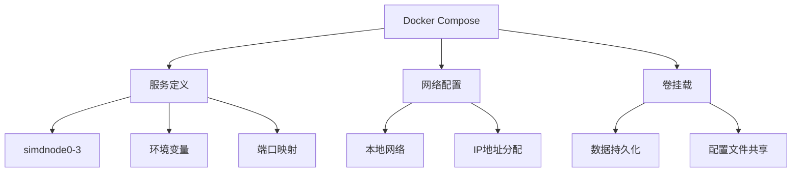

**图表来源**
- [docker-compose.yml](file://docker-compose.yml#L3-L99)

#### 容器化部署步骤

1. **构建镜像**
   ```bash
   docker build -t simapp .
   ```

2. **初始化节点**
   ```bash
   docker run -it \
     -p 26657:26657 \
     -p 26656:26656 \
     -v ~/.simapp:/root/.simapp \
     simapp simd init test-chain
   ```

3. **启动节点**
   ```bash
   docker run -it \
     -p 26657:26657 \
     -p 26656:26656 \
     -v ~/.simapp:/root/.simapp \
     simapp simd start
   ```

**节来源**
- [Dockerfile](file://Dockerfile#L1-L56)
- [docker-compose.yml](file://docker-compose.yml#L1-L99)

## 监控与日志记录

### 指标收集与监控

Cosmos SDK内置了强大的遥测功能，支持多种监控后端。

#### 遥测配置选项

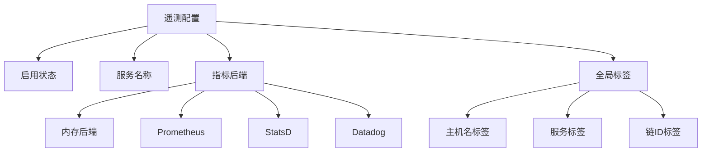

**图表来源**
- [telemetry/metrics.go](file://telemetry/metrics.go#L54-L93)

#### 支持的指标后端

| 后端类型 | 配置参数 | 用途 | 特点 |
|----------|----------|------|------|
| 内存后端 | `metrics-sink: "mem"` | 开发测试 | 默认启用，无外部依赖 |
| Prometheus | `prometheus-retention-time` | 生产监控 | 时间序列数据库集成 |
| StatsD | `statsd-addr` | 通用指标收集 | 支持多种下游系统 |
| Datadog | `datadog-hostname` | 企业监控 | 云原生监控平台 |

#### 日志级别配置

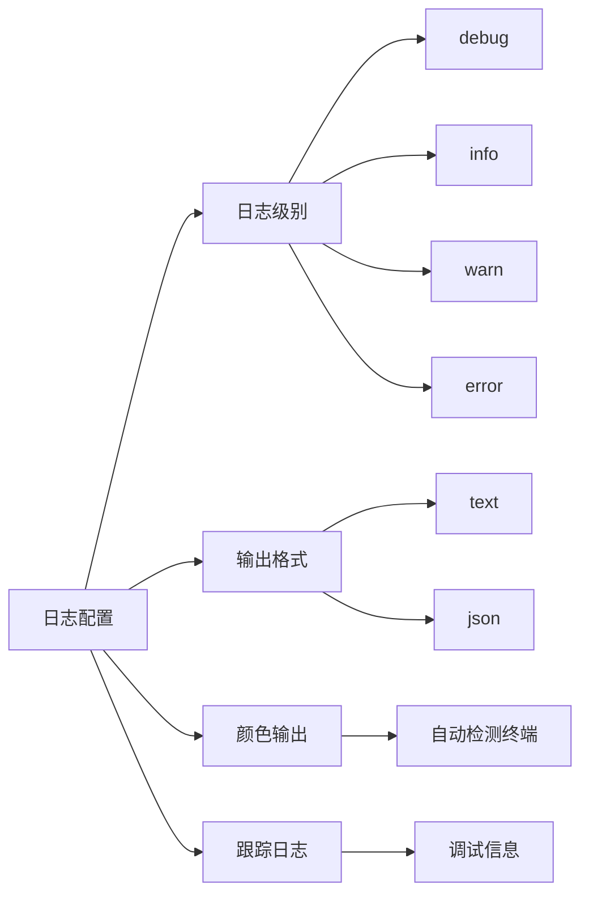

**节来源**
- [telemetry/metrics.go](file://telemetry/metrics.go#L54-L242)
- [server/util.go](file://server/util.go#L168-L210)

## 故障排除

### 常见问题诊断

#### 启动失败排查

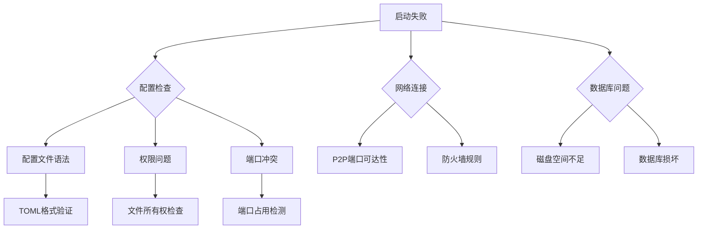

#### 错误恢复机制

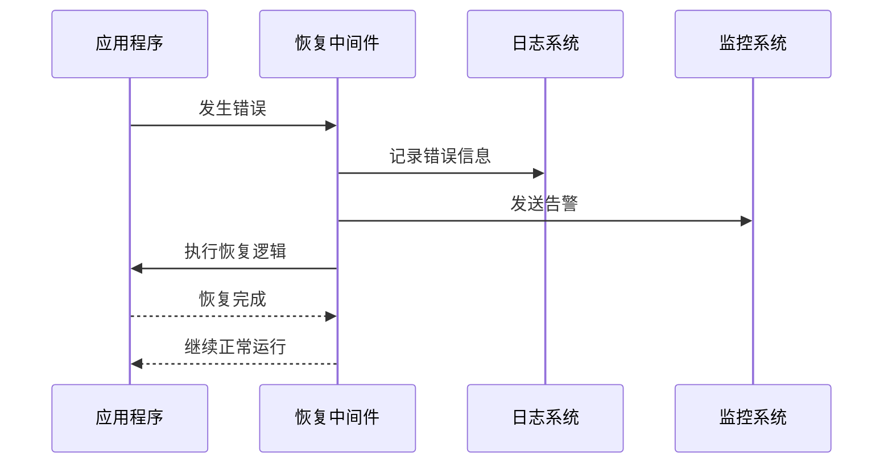

**图表来源**
- [baseapp/recovery.go](file://baseapp/recovery.go#L40-L80)

#### 性能问题诊断

| 问题类型 | 症状 | 排查方法 | 解决方案 |
|----------|------|----------|----------|
| 内存泄漏 | 内存使用持续增长 | 监控内存指标 | 调整修剪策略 |
| 磁盘IO瓶颈 | 响应时间增加 | 检查磁盘IO | 优化存储配置 |
| 网络延迟 | 同步缓慢 | 测试网络连通性 | 优化P2P配置 |
| CPU过载 | 处理能力下降 | 分析CPU使用率 | 调整并发设置 |

**节来源**
- [server/start.go](file://server/start.go#L1-L800)
- [errors/errors.go](file://errors/errors.go#L1-L77)

## 高可用性部署

### 多节点架构

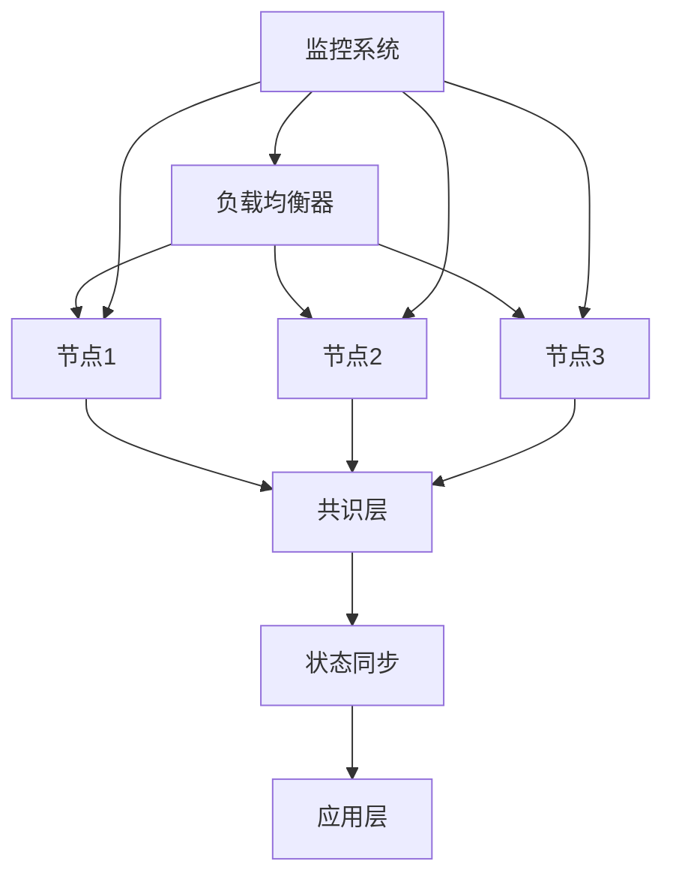

### 状态同步机制

Cosmos SDK实现了先进的状态同步功能，允许新节点快速加入网络。

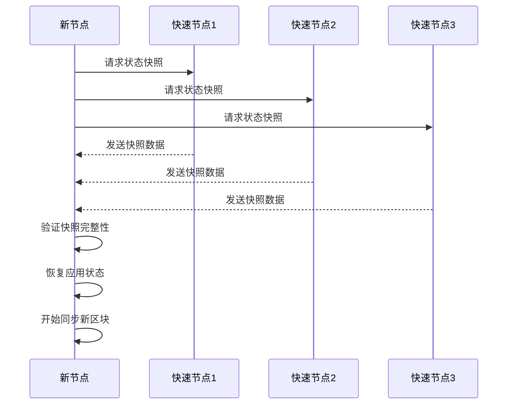

**图表来源**
- [store/snapshots/manager.go](file://store/snapshots/manager.go#L429-L469)

#### 状态同步配置

| 参数 | 默认值 | 描述 | 性能影响 |
|------|--------|------|----------|
| `snapshot-interval` | 0 | 快照间隔区块数 | 影响同步速度 |
| `snapshot-keep-recent` | 2 | 保留的快照数量 | 影响存储需求 |

**节来源**
- [store/snapshots/README.md](file://store/snapshots/README.md#L220-L285)

## 备份与恢复

### 备份策略

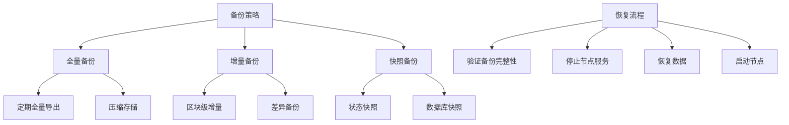

#### 导出命令使用

```bash
# 导出现有状态
simd export --height 1000000 --for-zero-height --output-document backup.json

# 导出特定模块
simd export --modules-to-export bank,staking --height 1000000

# 导出到标准输出
simd export --height 1000000 | gzip > backup.json.gz
```

### 恢复操作


**节来源**
- [server/export.go](file://server/export.go#L1-L127)

## 最佳实践

### 生产环境配置建议

#### 系统资源规划

| 组件 | CPU | 内存 | 存储 | 网络 |
|------|-----|------|------|------|
| 全节点 | 4核心+ | 8GB+ | 1TB SSD+ | 100Mbps+ |
| 验证人节点 | 8核心+ | 16GB+ | 2TB NVMe+ | 1Gbps+ |
| API节点 | 2核心+ | 4GB+ | 500GB SSD+ | 100Mbps+ |

#### 安全配置

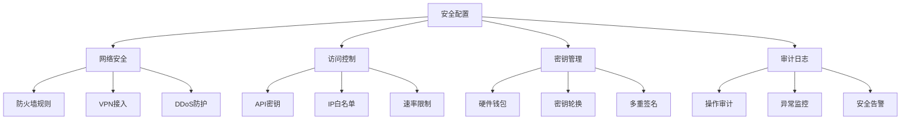

#### 监控指标建议

| 监控类别 | 关键指标 | 告警阈值 | 处理动作 |
|----------|----------|----------|----------|
| 系统健康 | CPU使用率 | >80% | 扩容或优化 |
| 系统健康 | 内存使用率 | >85% | 增加内存 |
| 系统健康 | 磁盘使用率 | >90% | 清理或扩容 |
| 网络状态 | 连接数 | 异常波动 | 检查网络 |
| 区块同步 | 块高度差 | >100 | 检查同步 |
| 区块同步 | 同步速度 | <1块/分钟 | 优化网络 |

### 运维自动化

#### 部署脚本示例

```bash
#!/bin/bash
# 自动化部署脚本

# 配置验证
validate_config() {
    echo "验证配置文件..."
    simd validate-genesis
}

# 系统检查
system_check() {
    echo "检查系统资源..."
    check_disk_space
    check_memory
    check_cpu
}

# 启动服务
start_node() {
    echo "启动Cosmos节点..."
    docker-compose up -d
    sleep 10
    check_health
}
```

#### 监控脚本示例

```bash
#!/bin/bash
# 健康检查脚本

check_node_health() {
    local health=$(curl -s http://localhost:1317/status | jq -r '.sync_info.catching_up')
    if [ "$health" = "false" ]; then
        echo "节点健康：已同步"
        return 0
    else
        echo "节点健康：未同步"
        return 1
    fi
}

check_peers() {
    local peer_count=$(curl -s http://localhost:1317/net_info | jq -r '.n_peers')
    if [ "$peer_count" -gt 0 ]; then
        echo "连接节点数：$peer_count"
        return 0
    else
        echo "警告：无连接节点"
        return 1
    fi
}
```

## 总结

Cosmos SDK的部署与运维涉及多个层面的配置和管理。通过合理配置修剪策略、采用容器化部署、建立完善的监控体系，以及制定详细的备份恢复计划，可以确保区块链节点在生产环境中稳定可靠地运行。

关键要点：
1. **配置优化**：根据实际需求调整修剪策略和资源分配
2. **监控告警**：建立全面的监控体系，及时发现和处理问题
3. **备份策略**：制定多层次的备份和恢复方案
4. **安全防护**：实施完善的安全措施，保护节点免受攻击
5. **自动化运维**：通过脚本和工具提高运维效率

遵循这些最佳实践，结合具体的业务需求，可以构建出高性能、高可用的Cosmos区块链节点。