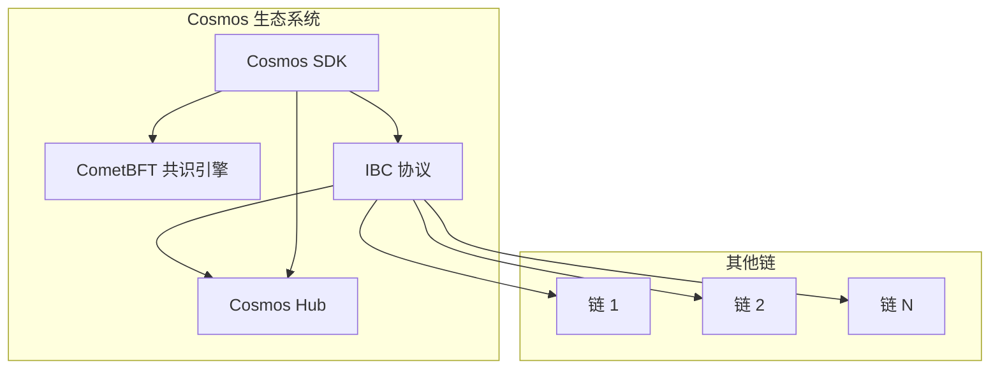
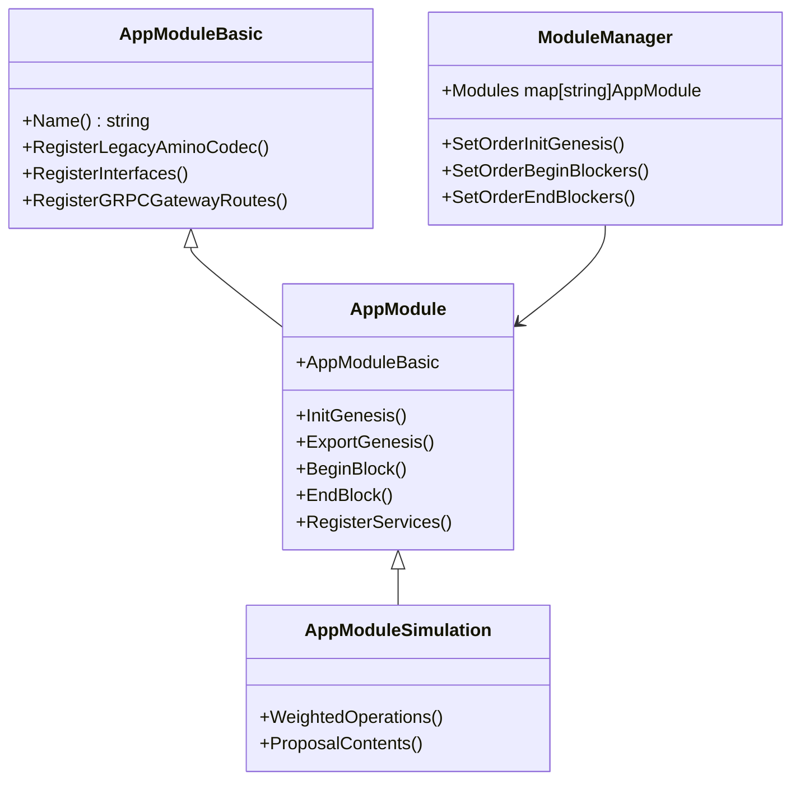
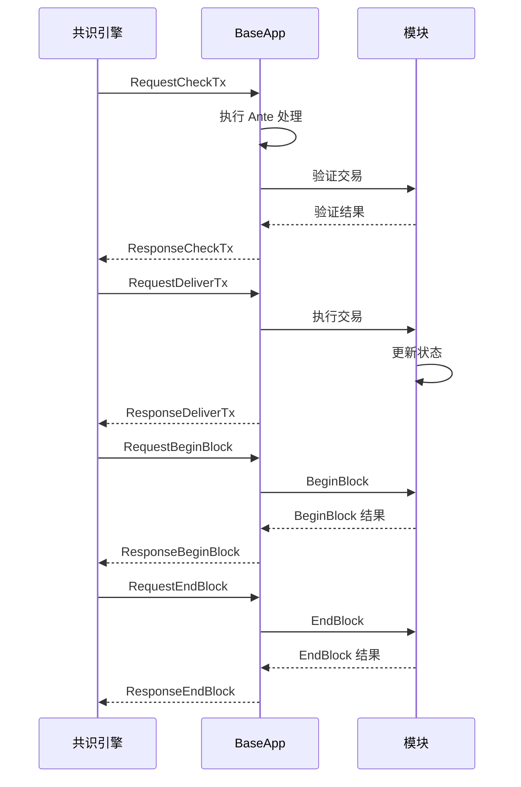
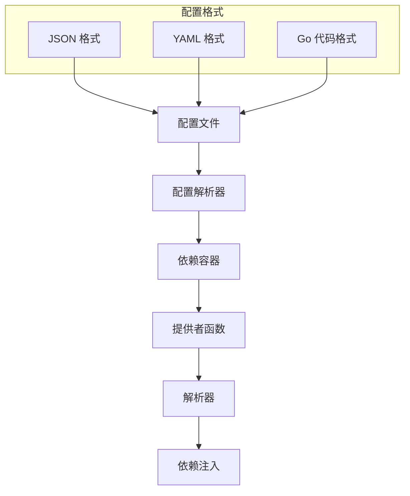
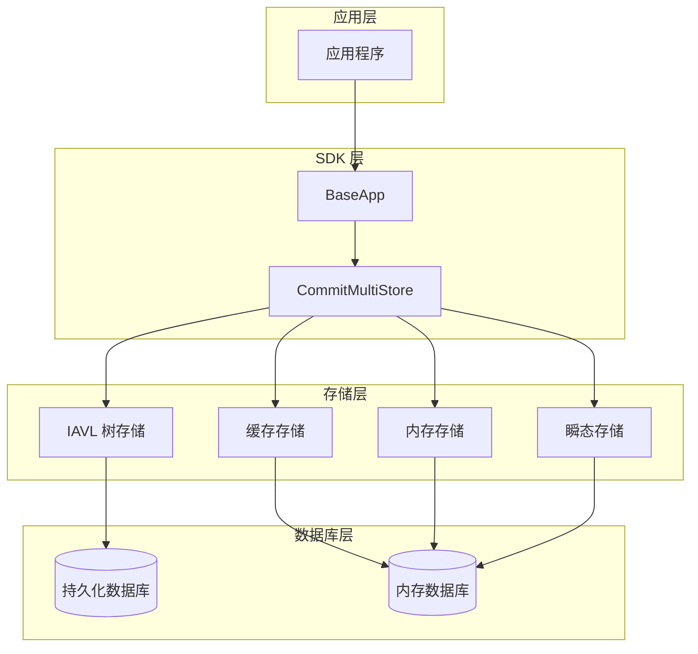
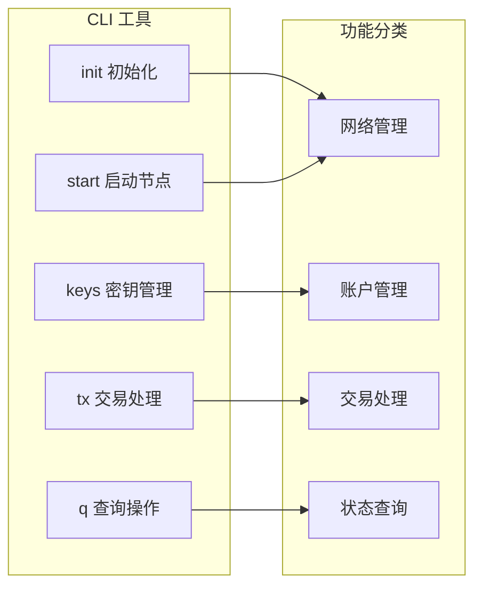
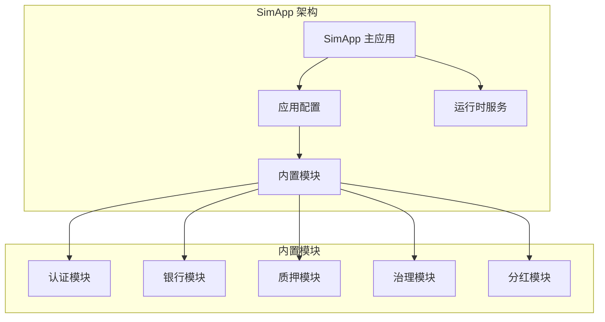

# Cosmos SDK 项目概述

<cite>
**本文档中引用的文件**
- [README.md](file://README.md)
- [simapp/README.md](file://simapp/README.md)
- [core/README.md](file://core/README.md)
- [depinject/README.md](file://depinject/README.md)
- [simapp/app.go](file://simapp/app.go)
- [baseapp/baseapp.go](file://baseapp/baseapp.go)
- [core/appconfig/config.go](file://core/appconfig/config.go)
- [types/module/module.go](file://types/module/module.go)
- [runtime/app.go](file://runtime/app.go)
- [CHANGELOG.md](file://CHANGELOG.md)
</cite>

## 目录
1. [简介](#简介)
2. [核心愿景与目标](#核心愿景与目标)
3. [Cosmos 生态系统中的角色](#cosmos-生态系统中的角色)
4. [模块化架构](#模块化架构)
5. [ABCI 接口与共识引擎解耦](#abci-接口与共识引擎解耦)
6. [关键特性](#关键特性)
7. [依赖注入系统 (Depinject)](#依赖注入系统-depinject)
8. [先进的状态存储系统](#先进的状态存储系统)
9. [强大的客户端工具](#强大的客户端工具)
10. [设计哲学](#设计哲学)
11. [与其他区块链框架的对比](#与其他区块链框架的对比)
12. [参考实现：SimApp](#参考实现-simapp)
13. [总结](#总结)

## 简介

Cosmos SDK 是一个模块化的开源区块链软件开发工具包，专为构建安全、高性能的第一层链而设计。作为 Cosmos 生态系统的核心组件，它被超过 200 条生产链使用，为开发者提供了构建原生可互操作区块链的完整解决方案。

Cosmos SDK 的设计理念是提供高度可定制的模块化架构，让开发者能够轻松快速地搭建自定义区块链，同时保持与 Cosmos 生态系统的互操作性。

**章节来源**
- [README.md](file://README.md#L27-L29)

## 核心愿景与目标

### 构建可互操作的区块链应用程序

Cosmos SDK 的核心使命是成为构建可互操作区块链应用程序的模块化框架。它不仅关注单个区块链的功能实现，更重视不同区块链之间的互联互通能力。

### 安全性与性能的平衡

SDK 致力于提供：
- **安全性**：通过严格的模块化设计和验证机制确保网络的安全性
- **高性能**：优化的执行引擎和存储系统支持高吞吐量交易处理
- **可扩展性**：模块化架构允许根据需求灵活扩展功能

### 开发者友好性

为开发者提供：
- **易用性**：简洁的 API 和丰富的预定义模块
- **灵活性**：完全的自定义能力满足特定需求
- **社区支持**：活跃的开发者社区和完善的文档体系

**章节来源**
- [README.md](file://README.md#L27-L29)

## Cosmos 生态系统中的角色

### Inter-Blockchain Communication Protocol (IBC) 集成

Cosmos SDK 内置了对 IBC 协议的原生支持，这是 Cosmos 生态系统实现跨链通信的核心协议。这种集成使得基于 SDK 构建的区块链能够：

- **原生互操作性**：无需额外配置即可实现与其他区块链的交互
- **资产转移**：支持任意类型数据的字节编码传输
- **跨链应用**：构建复杂的跨链应用场景

### 与 CometBFT 共识引擎的协作

虽然 Cosmos SDK 可以与任何共识引擎配合使用，但推荐使用 CometBFT 作为默认的共识引擎：

- **高性能**：支持每秒数千笔交易的高吞吐量
- **可配置性**：灵活的拜占庭容错算法参数调整
- **稳定性**：经过生产环境验证的成熟技术



**图表来源**
- [README.md](file://README.md#L31-L33)

**章节来源**
- [README.md](file://README.md#L31-L33)

## 模块化架构

### 模块化设计原则

Cosmos SDK 采用高度模块化的架构设计，将不同的功能分离到独立的模块中：



**图表来源**
- [types/module/module.go](file://types/module/module.go#L55-L200)

### 模块类型层次

SDK 定义了三种主要的模块类型：

1. **AppModuleBasic**：基本非依赖元素，包含模块的基本信息和注册功能
2. **AppModule**：完整的模块功能，包含状态管理和业务逻辑
3. **AppModuleSimulation**：模拟功能模块，用于测试和仿真

### 模块管理器

ModuleManager 负责协调所有模块的生命周期：

- **初始化顺序控制**：确保模块按正确顺序初始化
- **区块处理协调**：管理 BeginBlock、EndBlock 等生命周期事件
- **状态同步**：维护模块间的状态一致性

**章节来源**
- [types/module/module.go](file://types/module/module.go#L1-L200)

## ABCI 接口与共识引擎解耦

### ABCI 接口抽象

Cosmos SDK 通过 BaseApp 实现了与具体共识引擎的解耦：



**图表来源**
- [baseapp/baseapp.go](file://baseapp/baseapp.go#L60-L200)

### BaseApp 核心功能

BaseApp 是 SDK 的核心组件，实现了 ABCI 接口：

- **状态管理**：维护应用状态的读写上下文
- **交易处理**：执行交易验证和状态更新
- **区块管理**：协调区块的开始和结束流程
- **查询服务**：提供状态查询和历史数据访问

### 解耦的优势

这种设计带来了以下优势：

- **灵活性**：可以更换不同的共识引擎
- **可测试性**：便于单元测试和集成测试
- **可维护性**：模块职责清晰，易于维护

**章节来源**
- [baseapp/baseapp.go](file://baseapp/baseapp.go#L1-L200)

## 关键特性

### 模块化架构

SDK 的模块化设计是其最重要的特性之一：

- **可组合性**：模块可以自由组合形成新的功能
- **可重用性**：标准模块可以在多个项目中复用
- **可扩展性**：支持自定义模块的开发和集成

### 预定义模块集合

SDK 提供了一套完整的预定义模块：

| 模块名称 | 功能描述 | 主要用途 |
|---------|----------|----------|
| auth | 身份认证和授权 | 用户账户管理、签名验证 |
| bank | 银行系统和资产转移 | 代币发行和转账 |
| staking | 质押和验证人管理 | 共识机制支持 |
| gov | 治理系统 | 区块链升级和参数修改 |
| distribution | 分红分配 | 验证人奖励分发 |
| slashing | 切片惩罚 | 违规行为惩罚机制 |

### 状态管理

SDK 提供了多层次的状态管理机制：

- **持久化存储**：基于 IAVL 树的高效持久化存储
- **缓存机制**：多级缓存提升读写性能
- **快照支持**：支持状态快照和恢复

**章节来源**
- [README.md](file://README.md#L45-L48)

## 依赖注入系统 (Depinject)

### Depinject 简介

Depinject 是 Cosmos SDK 的依赖注入框架，旨在简化区块链应用程序的构建和配置过程：



**图表来源**
- [depinject/README.md](file://depinject/README.md#L1-L50)

### 核心特性

1. **声明式配置**：使用配置文件而非大量样板代码
2. **自动依赖解析**：智能识别和解决模块间的依赖关系
3. **接口类型支持**：支持接口类型的输入参数，增强模块解耦
4. **调试支持**：提供详细的依赖图可视化和错误诊断

### 使用示例

Depinject 通过提供者函数和注入机制工作：

```go
// 提供者函数示例
func ProvideBankKeeper(...) bankkeeper.BaseKeeper {
    return bankkeeper.NewBaseKeeper(...)
}

// 注入使用
var bankKeeper bankkeeper.BaseKeeper
depinject.Inject(
    depinject.Provide(ProvideBankKeeper),
    &bankKeeper,
)
```

### 接口类型解析

Depinject 支持接口类型作为输入参数，这有助于模块间的解耦：

- **类型安全**：编译时检查接口实现
- **灵活替换**：可以在不修改调用方的情况下替换实现
- **测试友好**：便于使用模拟对象进行测试

**章节来源**
- [depinject/README.md](file://depinject/README.md#L1-L206)

## 先进的状态存储系统

### 存储架构层次

Cosmos SDK 实现了多层存储架构：



**图表来源**
- [core/store/service.go](file://core/store/service.go#L1-L27)

### 存储服务类型

SDK 提供了多种存储服务：

1. **KVStoreService**：常规的键值存储服务
2. **MemoryStoreService**：内存后端的键值存储
3. **TransientStoreService**：每个区块重置的瞬态存储

### 性能优化特性

- **多级缓存**：减少数据库访问次数
- **批量操作**：合并多个写操作提升性能
- **压缩支持**：减少存储空间占用
- **异步提交**：提升写入性能

**章节来源**
- [core/store/service.go](file://core/store/service.go#L1-L27)

## 强大的客户端工具

### 命令行界面 (CLI)

SDK 提供了完整的命令行工具集：



### REST API 和 gRPC 服务

- **REST API**：提供 HTTP 接口，便于 Web 应用集成
- **gRPC 服务**：高性能的 RPC 通信协议
- **WebSocket 支持**：实时事件订阅和推送

### 自动 CLI 生成

SDK 提供了自动 CLI 命令生成功能：

- **基于 protobuf**：从消息定义自动生成命令
- **类型安全**：编译时检查命令参数
- **文档自动生成**：提供完整的命令文档

### 客户端配置管理

- **多环境支持**：支持测试网、主网等不同环境
- **配置热更新**：运行时更新客户端配置
- **连接池管理**：优化网络连接性能

**章节来源**
- [client/cmd.go](file://client/cmd.go#L1-L100)

## 设计哲学

### 模块化优先

SDK 的设计始终以模块化为核心：

- **单一职责**：每个模块专注于特定功能领域
- **松耦合**：模块间通过明确定义的接口交互
- **高内聚**：相关功能集中在同一模块内

### 可扩展性设计

- **插件架构**：支持第三方模块的无缝集成
- **钩子机制**：提供多个扩展点供开发者使用
- **配置驱动**：通过配置文件控制行为而非硬编码

### 安全性第一

- **最小权限原则**：模块只能访问必要的资源
- **输入验证**：严格验证所有外部输入
- **审计跟踪**：完整的操作日志和监控

### 开发体验优化

- **零配置启动**：提供合理的默认配置
- **丰富的工具链**：完整的开发、测试、部署工具
- **文档完善**：详细的 API 文档和最佳实践指南

**章节来源**
- [CHANGELOG.md](file://CHANGELOG.md#L1-L50)

## 与其他区块链框架的对比

### 与 Ethereum 区块链虚拟机 (EVM) 对比

| 特性 | Cosmos SDK | Ethereum EVM |
|------|------------|--------------|
| 执行模型 | 原生 Go 执行 | 虚拟机执行 |
| 性能 | 更高性能，更低延迟 | 较低性能，较高延迟 |
| 开发语言 | Go | Solidity/EVM 字节码 |
| 模块化 | 内置模块系统 | 合约即模块 |
| 互操作性 | 原生 IBC 支持 | 需要桥接方案 |
| 上线时间 | 快速上线 | 需要复杂部署 |

### 与 Solana 区块链对比

| 特性 | Cosmos SDK | Solana |
|------|------------|--------|
| 共识机制 | 可选多种共识引擎 | 特定的 PoH 共识 |
| 跨链能力 | 原生 IBC 支持 | 需要 Wormhole 等桥接 |
| 开发成本 | 中等，需要学习 SDK | 较低，熟悉 Rust |
| 生态系统 | 成熟的生态系统 | 快速发展的生态 |

### 与 Substrate 区块链对比

| 特性 | Cosmos SDK | Substrate |
|------|------------|-----------|
| 技术栈 | Go 语言 | Rust 语言 |
| 模块系统 | 原生模块化 | FRAME 框架 |
| 跨链支持 | 原生 IBC | Polkadot 生态 |
| 社区规模 | 广泛的社区支持 | 相对较小但活跃 |
| 上手难度 | 中等 | 较高 |

## 参考实现：SimApp

### SimApp 概述

SimApp 是 Cosmos SDK 的参考实现，用于演示和测试：



**图表来源**
- [simapp/app.go](file://simapp/app.go#L125-L170)

### SimApp 的特点

1. **教育价值**：为开发者提供学习 SDK 的最佳实践
2. **测试平台**：用于 SDK 功能的全面测试
3. **原型开发**：快速验证新想法和概念
4. **最佳实践**：展示推荐的架构模式

### 运行测试网

SimApp 支持快速启动测试网络：

```bash
# 构建二进制文件
make build

# 初始化节点
./build/simd init mynode --chain-id testchain

# 创建验证人密钥
./build/simd keys add validator

# 添加初始账户
./build/simd genesis add-genesis-account validator 1000000000stake

# 创建创世交易
./build/simd genesis gentx validator 1000000stake --chain-id testchain

# 收集创世交易
./build/simd genesis collect-gentxs

# 启动节点
./build/simd start
```

### 配置灵活性

SimApp 支持多种配置方式：

- **Go 配置**：通过 Go 代码配置应用
- **YAML 配置**：使用 YAML 文件配置
- **JSON 配置**：使用 JSON 格式配置

**章节来源**
- [simapp/README.md](file://simapp/README.md#L1-L54)

## 总结

Cosmos SDK 作为一个成熟的模块化区块链开发框架，在以下几个方面表现出色：

### 核心优势

1. **模块化架构**：提供了高度可组合和可重用的模块系统
2. **互操作性**：原生支持 IBC 协议，实现跨链通信
3. **性能表现**：基于 Go 语言的高效执行引擎
4. **开发效率**：丰富的工具链和完善的文档支持

### 适用场景

- **企业级应用**：需要高性能和高安全性的商业应用
- **金融基础设施**：去中心化金融和支付系统
- **游戏和娱乐**：NFT 和游戏经济系统
- **供应链管理**：透明可信的供应链追踪

### 发展趋势

随着 Cosmos 生态系统的不断发展，Cosmos SDK 将继续演进：

- **性能优化**：持续改进执行效率和存储性能
- **开发者体验**：简化开发流程，降低上手门槛
- **生态建设**：丰富模块库，完善工具链
- **标准化**：推动跨链标准和最佳实践的普及

Cosmos SDK 不仅是一个技术框架，更是构建下一代互联网基础设施的重要工具。它为开发者提供了构建安全、可互操作、高性能区块链应用的完整解决方案，正在成为区块链开发领域的主流选择。