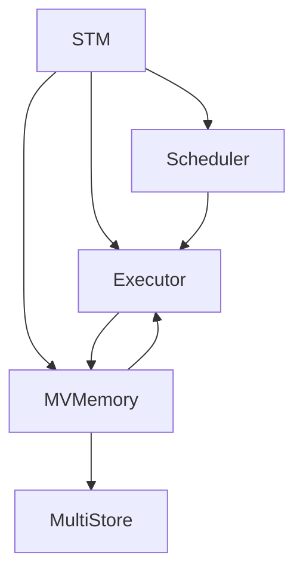
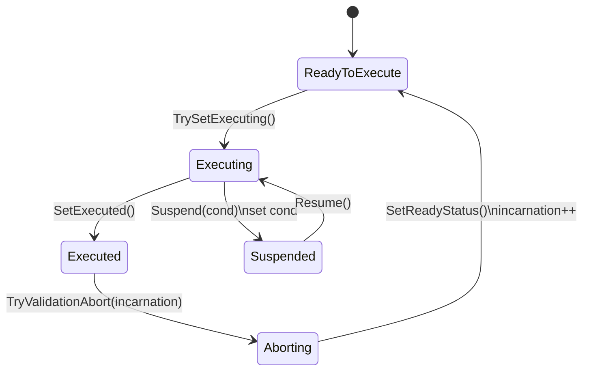
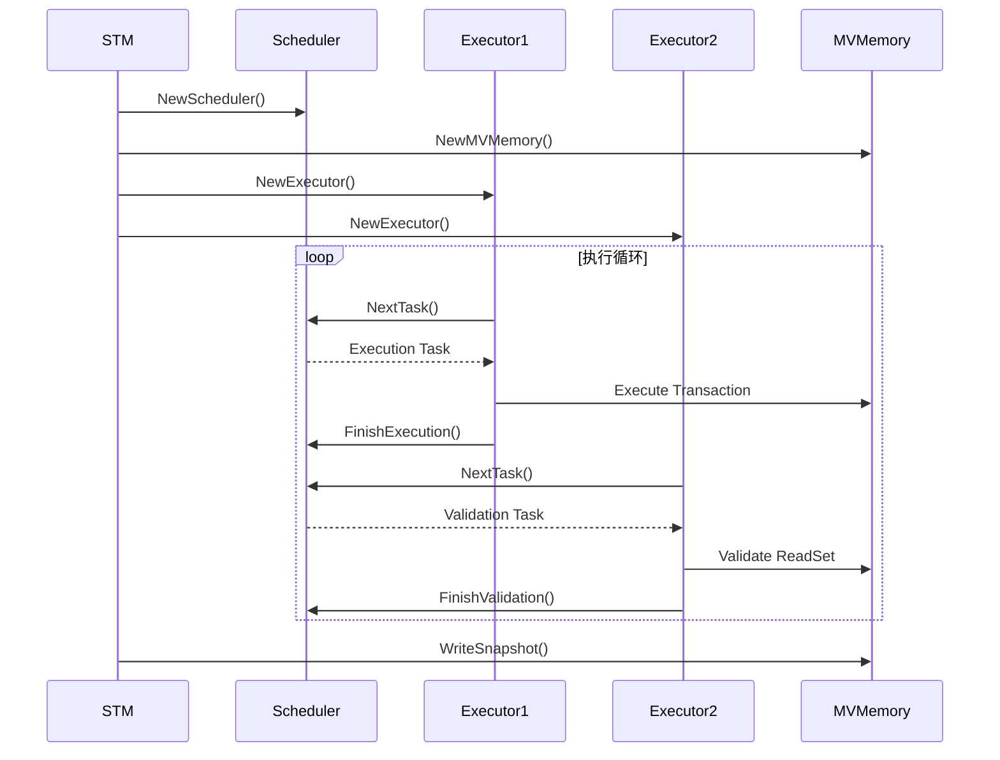

# Block-STM性能优化

<cite>
**本文档中引用的文件**  
- [stm.go](file://blockstm/stm.go)
- [scheduler.go](file://blockstm/scheduler.go)
- [executor.go](file://blockstm/executor.go)
- [mvview.go](file://blockstm/mvview.go)
- [types.go](file://blockstm/types.go)
- [mvdata.go](file://blockstm/mvdata.go)
- [mvmemory.go](file://blockstm/mvmemory.go)
- [multimvview.go](file://blockstm/multimvview.go)
- [status.go](file://blockstm/status.go)
- [utils.go](file://blockstm/utils.go)
- [txnrunner.go](file://blockstm/txnrunner.go)
- [README.md](file://blockstm/README.md)
- [bench_test.go](file://blockstm/bench_test.go)
- [mock_block.go](file://blockstm/mock_block.go)
- [baseapp/oe/optimistic_execution.go](file://baseapp/oe/optimistic_execution.go)
- [baseapp/baseapp.go](file://baseapp/baseapp.go)
</cite>

## 目录
1. [引言](#引言)
2. [核心思想与架构](#核心思想与架构)
3. [关键组件分析](#关键组件分析)
4. [执行流程详解](#执行流程详解)
5. [与BaseApp集成](#与baseapp集成)
6. [性能优势与适用场景](#性能优势与适用场景)
7. [配置与使用指南](#配置与使用指南)
8. [性能对比分析](#性能对比分析)
9. [结论](#结论)

## 引言

Block-STM（基于区块的软件事务内存）是一种创新的并行交易处理机制，旨在通过乐观并发控制（Optimistic Concurrency Control）显著提升区块链系统的吞吐量。与传统的串行处理模式不同，Block-STM允许区块内的多个交易在无锁的情况下并行执行，并在提交阶段验证其有效性。这种机制特别适用于高并发、高竞争的环境，能够有效减少交易处理的延迟。本文档将深入解析Block-STM在Cosmos SDK中的实现机制，详细阐述其核心组件、交互流程以及与BaseApp的集成方式。

## 核心思想与架构

Block-STM的核心思想是利用乐观并发控制来实现交易的并行执行。在传统的ABCI（Application BlockChain Interface）流程中，交易是按顺序逐个执行的，这在高负载下会成为性能瓶颈。而Block-STM则打破了这一限制，它假设交易之间的冲突是罕见的，因此允许所有交易同时开始执行。

其架构主要由四个核心组件构成：`STM`（Software Transactional Memory）、`Scheduler`（调度器）、`Executor`（执行器）和`MVView`（多版本视图）。这些组件协同工作，确保交易能够高效、安全地并行执行。

- **STM**：作为顶层模块，负责协调整个区块的并行执行过程。它通过`ExecuteBlock`函数启动执行流程，管理执行器的数量，并最终将结果写入存储。
- **Scheduler**：负责任务的调度和依赖管理。它维护一个执行索引和一个验证索引，决定下一个要执行或验证的交易。
- **Executor**：实际执行交易的工作者。每个执行器都是一个独立的goroutine，从调度器获取任务并执行。
- **MVView**：为每个交易提供一个隔离的、多版本的内存视图。交易在执行时读写的是这个视图，而不是直接操作底层存储。



**图表来源**
- [stm.go](file://blockstm/stm.go#L16-L75)
- [scheduler.go](file://blockstm/scheduler.go#L32-L61)
- [executor.go](file://blockstm/executor.go#L9-L32)
- [mvview.go](file://blockstm/mvview.go#L19-L49)

## 关键组件分析

### STM (Software Transactional Memory)

STM是Block-STM的入口点，其主要功能是协调整个区块的并行执行。`ExecuteBlock`函数是其核心API，它接收一个交易列表、存储实例和一个执行回调函数。STM会创建一个调度器和一个MVMemory实例，然后启动多个执行器来并行处理交易。

```go
func ExecuteBlock(
    ctx context.Context,
    blockSize int,
    stores map[storetypes.StoreKey]int,
    storage MultiStore,
    executors int,
    txExecutor TxExecutor,
) error
```

该函数通过`errgroup`来管理多个执行器的生命周期，确保所有执行器都完成工作后才返回。执行完成后，STM会将MVMemory中的快照写入底层存储，完成整个区块的处理。

**章节来源**
- [stm.go](file://blockstm/stm.go#L16-L75)

### Scheduler (调度器)

调度器是Block-STM的大脑，负责决定交易的执行和验证顺序。它维护两个关键的原子计数器：`executionIdx`和`validationIdx`，分别指向下一个要执行和验证的交易索引。

调度器的核心算法是`NextTask`，它根据两个索引的相对位置来决定下一个任务是执行还是验证。如果`validationIdx`小于`executionIdx`，则优先进行验证，以尽早发现冲突并减少不必要的执行。



**图表来源**
- [scheduler.go](file://blockstm/scheduler.go#L32-L61)
- [status.go](file://blockstm/status.go#L29-L36)

### Executor (执行器)

执行器是实际执行交易的单元。每个执行器都是一个独立的goroutine，它从调度器获取任务（执行或验证），然后调用相应的处理函数。

执行器的`Run`方法是一个无限循环，它不断从调度器获取任务，直到区块处理完成。对于执行任务，它会调用`TryExecute`；对于验证任务，则调用`NeedsReexecution`。

```go
func (e *Executor) Run() error {
    var kind TaskKind
    version := InvalidTxnVersion
    for !e.scheduler.Done() {
        if !version.Valid() {
            version, kind = e.scheduler.NextTask()
            continue
        }

        switch kind {
        case TaskKindExecution:
            version, kind = e.TryExecute(version)
        case TaskKindValidation:
            version, kind = e.NeedsReexecution(version)
        default:
            return fmt.Errorf("unknown task kind %v", kind)
        }
    }
    return nil
}
```

**章节来源**
- [executor.go](file://blockstm/executor.go#L35-L65)

### MVView (多版本视图)

MVView为每个交易提供了隔离的执行环境。当一个交易执行时，它读写的是MVView，而不是直接操作底层的KVStore。MVView内部维护了一个读集（ReadSet）和一个写集（WriteSet），用于记录交易的读写操作。

当交易读取一个键时，MVView会首先检查写集。如果键存在于写集中，则直接返回写集中的值。否则，它会查询MVMemory，获取该键的最新版本值，并将读取操作记录到读集中。

```go
func (s *GMVMemoryView[V]) Get(key []byte) V {
    if s.writeSet != nil {
        if value, found := s.writeSet.OverlayGet(key); found {
            return value
        }
    }

    for {
        value, version, estimate := s.mvData.Read(key, s.txn)
        if estimate {
            s.waitFor(version.Index)
            continue
        }

        s.readSet.Reads = append(s.readSet.Reads, ReadDescriptor{key, version})
        if !version.Valid() {
            return s.storage.Get(key)
        }
        return value
    }
}
```

**章节来源**
- [mvview.go](file://blockstm/mvview.go#L84-L108)

## 执行流程详解

Block-STM的执行流程可以分为以下几个阶段：

1.  **初始化**：STM创建调度器、MVMemory和多个执行器。
2.  **并行执行**：执行器从调度器获取执行任务，开始并行执行交易。每个交易在自己的MVView中运行。
3.  **写入记录**：当交易执行完毕，执行器会调用`FinishExecution`，将交易的写集记录到MVMemory中。
4.  **并行验证**：调度器会安排验证任务。执行器调用`NeedsReexecution`来验证交易的读集是否仍然有效。
5.  **冲突处理**：如果验证失败，交易会被标记为需要重试。调度器会将其状态重置为`READY_TO_EXECUTE`，并递增其版本号。
6.  **提交**：当所有交易都成功通过验证后，MVMemory会将最终的快照写入底层存储。



**图表来源**
- [stm.go](file://blockstm/stm.go#L46-L56)
- [scheduler.go](file://blockstm/scheduler.go#L139-L146)
- [executor.go](file://blockstm/executor.go#L40-L65)
- [mvmemory.go](file://blockstm/mvmemory.go#L131-L134)

## 与BaseApp集成

Block-STM通过`TxRunner`接口与Cosmos SDK的BaseApp集成。`STMRunner`是`TxRunner`的一个具体实现，它在`DeliverTx`阶段替代了传统的串行执行器。

在BaseApp中，可以通过配置启用Block-STM。`STMRunner`会接收原始的交易字节，使用`txDecoder`解码交易，并利用预估信息（estimates）来优化执行过程。例如，它可以预先知道哪些交易会修改账户余额，从而更高效地管理依赖关系。

```go
func (e STMRunner) Run(ctx context.Context, ms storetypes.MultiStore, txs [][]byte, deliverTx sdk.DeliverTxFunc) ([]*abci.ExecTxResult, error) {
    // ... 初始化逻辑
    if e.estimate {
        memTxs, estimates = preEstimates(txs, e.workers, authStore, bankStore, e.coinDenom, e.txDecoder)
    }

    if err := ExecuteBlockWithEstimates(
        ctx,
        blockSize,
        index,
        stmMultiStoreWrapper{ms},
        e.workers,
        estimates,
        func(txn TxnIndex, ms MultiStore) {
            // ... 执行交易
            results[txn] = deliverTx(memTx, msWrapper{ms}, int(txn), cache)
        },
    ); err != nil {
        return nil, err
    }

    return results, nil
}
```

**章节来源**
- [txnrunner.go](file://blockstm/txnrunner.go#L41-L103)
- [baseapp/oe/optimistic_execution.go](file://baseapp/oe/optimistic_execution.go)

## 性能优势与适用场景

Block-STM的主要性能优势体现在高并发、低冲突的场景下。通过并行执行，它可以充分利用多核CPU的计算能力，显著提高系统的吞吐量。

- **性能优势**：
  - **高吞吐量**：在无冲突或低冲突的交易序列中，性能提升接近线性。
  - **低延迟**：减少了交易在内存池中的等待时间。
  - **资源利用率高**：有效利用了现代多核处理器的并行计算能力。

- **适用场景**：
  - **高频交易应用**：如去中心化交易所（DEX）、支付网络等。
  - **低相关性交易**：交易之间读写的数据集重叠较少。
  - **读多写少的应用**：验证阶段的开销相对较小。

- **潜在复杂性**：
  - **交易重试**：在高竞争环境下，交易可能需要多次重试才能成功，增加了复杂性。
  - **内存开销**：维护多版本数据结构会消耗更多的内存。
  - **调试困难**：并行执行使得问题的复现和调试更加困难。

**章节来源**
- [bench_test.go](file://blockstm/bench_test.go#L13-L54)
- [README.md](file://blockstm/README.md#L1-L42)

## 配置与使用指南

要使用Block-STM，首先需要在应用中创建一个`STMRunner`实例，并将其注入到BaseApp中。

```go
runner := blockstm.NewSTMRunner(
    txDecoder,
    []storetypes.StoreKey{StoreKeyAuth, StoreKeyBank},
    4, // workers
    true, // estimate
    "stake",
)
```

关键配置参数包括：
- **workers**：并行执行器的数量，通常设置为CPU核心数。
- **estimate**：是否启用预估优化，可以提高执行效率。
- **stores**：需要支持的存储键列表。

在测试环境中，可以使用`BenchmarkBlockSTM`来评估不同配置下的性能表现。

**章节来源**
- [txnrunner.go](file://blockstm/txnrunner.go#L18-L30)
- [bench_test.go](file://blockstm/bench_test.go#L13-L54)

## 性能对比分析

根据`bench_test.go`中的基准测试，Block-STM在不同场景下的性能表现如下：

- **无冲突场景** (`no-conflict-10000`)：并行执行的性能远超串行执行，随着工作线程数的增加，吞吐量显著提升。
- **随机冲突场景** (`random-10000/100`)：性能提升依然明显，但随着工作线程数的增加，收益会逐渐递减，因为冲突导致的重试开销增大。
- **最坏情况** (`worst-case-10000`)：所有交易都竞争同一个资源，此时并行执行的优势消失，性能可能不如串行执行。

这些测试结果表明，Block-STM在大多数实际场景中都能带来显著的性能提升，尤其是在交易相关性较低的应用中。

**章节来源**
- [bench_test.go](file://blockstm/bench_test.go#L13-L54)

## 结论

Block-STM是Cosmos SDK中一项重要的性能优化技术。它通过引入乐观并发控制，实现了交易的并行执行，从而在高吞吐量场景下展现出巨大的潜力。其核心组件——STM、Scheduler、Executor和MVView——设计精巧，协同工作，确保了执行的正确性和高效性。

尽管Block-STM在高竞争环境下可能面临重试开销的挑战，但其在大多数应用场景中的性能优势是显而易见的。通过与BaseApp的无缝集成，开发者可以轻松地在自己的应用中启用这一功能，以应对日益增长的交易负载。未来，随着更多优化技术的引入，Block-STM有望成为高性能区块链应用的标配。