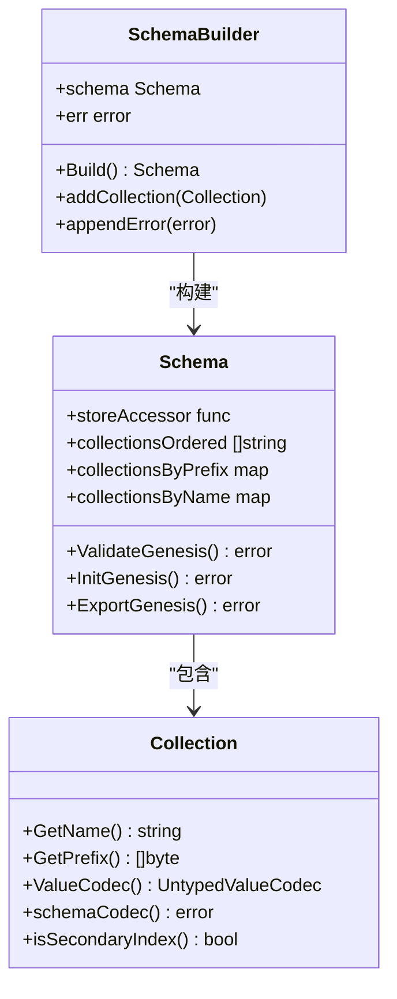
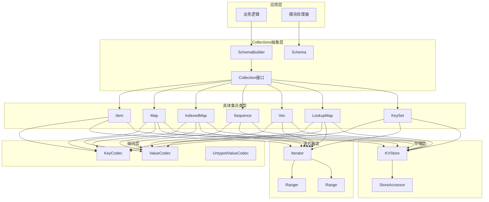
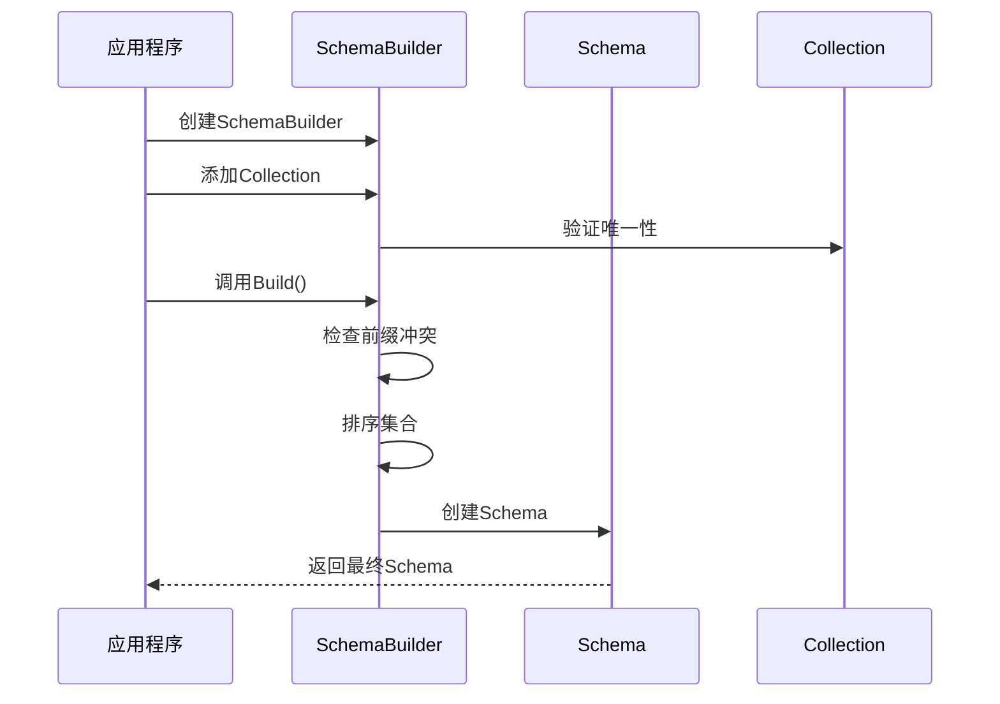
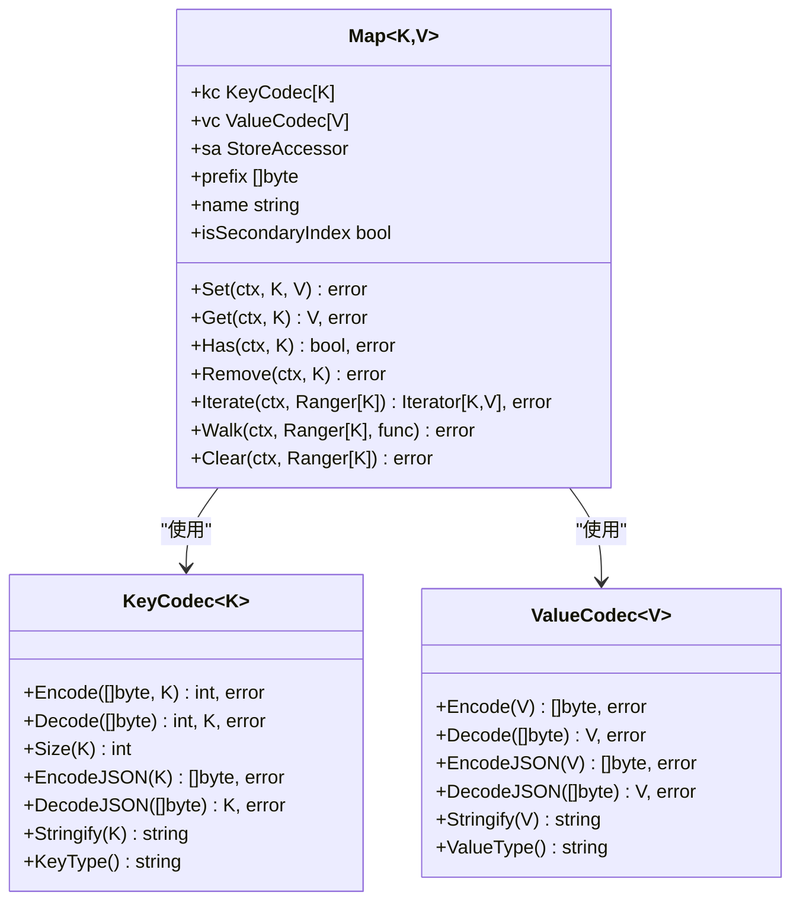
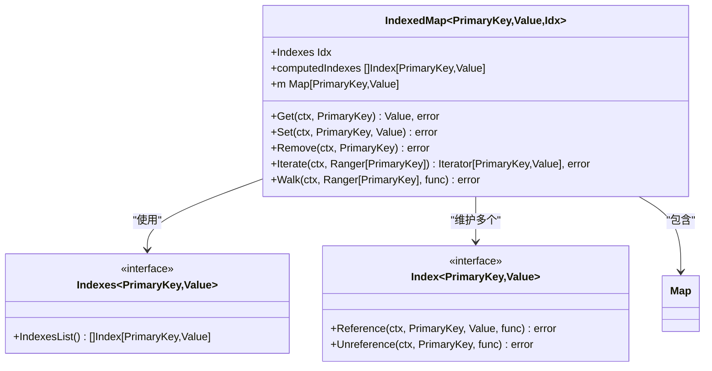
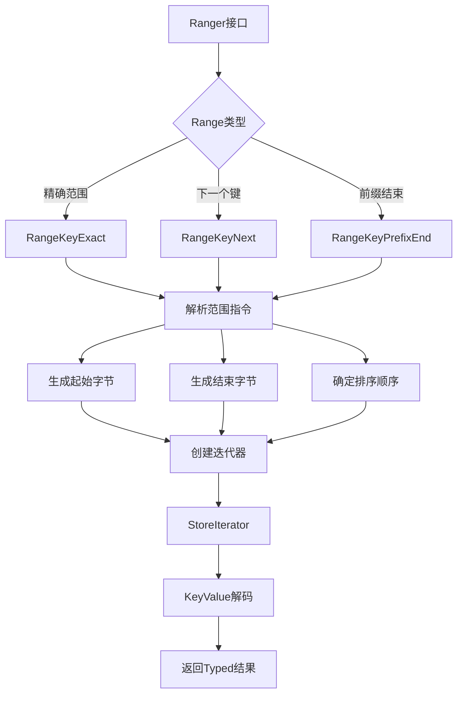

# Collections库详解

<cite>
**本文档引用的文件**
- [collections.go](file://collections/collections.go)
- [schema.go](file://collections/schema.go)
- [item.go](file://collections/item.go)
- [map.go](file://collections/map.go)
- [indexed_map.go](file://collections/indexed_map.go)
- [indexing.go](file://collections/indexing.go)
- [iter.go](file://collections/iter.go)
- [codec/codec.go](file://collections/codec/codec.go)
- [sequence.go](file://collections/sequence.go)
- [vec.go](file://collections/vec.go)
- [lookup_map.go](file://collections/lookup_map.go)
- [keyset.go](file://collections/keyset.go)
- [genesis.go](file://collections/genesis.go)
</cite>

## 目录
1. [简介](#简介)
2. [核心概念](#核心概念)
3. [架构概览](#架构概览)
4. [详细组件分析](#详细组件分析)
5. [迁移指南](#迁移指南)
6. [性能考量](#性能考量)
7. [最佳实践](#最佳实践)
8. [故障排除](#故障排除)
9. [总结](#总结)

## 简介

Cosmos SDK的Collections库是一个高级的状态管理工具，旨在简化模块状态的定义和操作。它提供了一套类型安全的抽象，通过自动生成的编码/解码逻辑和索引管理来减少样板代码，同时保持与底层存储系统的紧密集成。

Collections库的核心优势在于：
- **类型安全性**：编译时检查确保数据类型的正确性
- **自动编码**：自动生成键值对的序列化和反序列化逻辑
- **索引支持**：内置多级索引系统，支持复杂查询
- **迭代器模式**：提供高效的范围查询和遍历功能
- **模块化设计**：支持灵活的状态组织和管理

## 核心概念

### SchemaBuilder 和 Schema

`SchemaBuilder`是Collections库的入口点，负责构建和验证整个状态架构。它确保所有集合具有唯一的前缀和名称，并在构建完成后生成最终的`Schema`对象。



**图表来源**
- [schema.go](file://collections/schema.go#L13-L301)
- [collections.go](file://collections/collections.go#L78-L101)

### 主要集合类型

Collections库提供了多种预定义的集合类型，每种都针对特定的使用场景进行了优化：

| 集合类型 | 用途 | 特点 |
|---------|------|------|
| `Item` | 单值存储 | 无键，仅存储单个值 |
| `Map` | 键值对存储 | 标准的键值映射 |
| `IndexedMap` | 带索引的键值对 | 支持多字段索引 |
| `Sequence` | 自增序列 | 用于生成唯一递增编号 |
| `Vec` | 动态数组 | 类似切片的动态列表 |
| `LookupMap` | 快速查找 | 优化的单向查找 |
| `KeySet` | 唯一集合 | 存储不重复的键 |

**段落来源**
- [collections.go](file://collections/collections.go#L22-L76)
- [item.go](file://collections/item.go#L11-L68)
- [sequence.go](file://collections/sequence.go#L11-L50)
- [vec.go](file://collections/vec.go#L38-L142)

## 架构概览

Collections库采用分层架构设计，从底层存储到高层抽象形成清晰的层次结构：



**图表来源**
- [schema.go](file://collections/schema.go#L13-L301)
- [collections.go](file://collections/collections.go#L78-L179)
- [map.go](file://collections/map.go#L12-L299)

## 详细组件分析

### SchemaBuilder - 架构构建器

`SchemaBuilder`是Collections库的核心组件，负责协调整个状态架构的构建过程。它确保所有集合的唯一性和一致性。



**图表来源**
- [schema.go](file://collections/schema.go#L39-L83)

**段落来源**
- [schema.go](file://collections/schema.go#L13-L83)

### Map - 基础键值对存储

`Map`是最基础的集合类型，提供了完整的CRUD操作和迭代功能。它是所有其他集合类型的基础。



**图表来源**
- [map.go](file://collections/map.go#L12-L299)
- [codec/codec.go](file://collections/codec/codec.go#L10-L75)

**段落来源**
- [map.go](file://collections/map.go#L12-L299)

### IndexedMap - 带索引的键值对存储

`IndexedMap`扩展了`Map`的功能，支持多字段索引，使得复杂的查询成为可能。



**图表来源**
- [indexed_map.go](file://collections/indexed_map.go#L12-L218)

**段落来源**
- [indexed_map.go](file://collections/indexed_map.go#L12-L218)

### 迭代器系统

Collections库提供了强大的迭代器系统，支持范围查询和高效的遍历操作。



**图表来源**
- [iter.go](file://collections/iter.go#L64-L362)

**段落来源**
- [iter.go](file://collections/iter.go#L1-L362)

### 编码系统

Collections库实现了完整的编码系统，处理键和值的序列化和反序列化。

```mermaid
classDiagram
class KeyCodec~K~ {
<<interface>>
+Encode([]byte, K) int, error
+Decode([]byte) int, K, error
+Size(K) int
+EncodeJSON(K) []byte, error
+DecodeJSON([]byte) K, error
+Stringify(K) string
+KeyType() string
+EncodeNonTerminal([]byte, K) int, error
+DecodeNonTerminal([]byte) int, K, error
+SizeNonTerminal(K) int
}
class ValueCodec~V~ {
<<interface>>
+Encode(V) []byte, error
+Decode([]byte) V, error
+EncodeJSON(V) []byte, error
+DecodeJSON([]byte) V, error
+Stringify(V) string
+ValueType() string
}
class UntypedValueCodec {
+Decode([]byte) interface{}, error
+Encode(interface{}) []byte, error
+DecodeJSON([]byte) interface{}, error
+EncodeJSON(interface{}) []byte, error
+Stringify(interface{}) string, error
+ValueType() string
}
KeyCodec --> ValueCodec : "转换为"
ValueCodec --> UntypedValueCodec : "包装为"
```

**图表来源**
- [codec/codec.go](file://collections/codec/codec.go#L10-L176)

**段落来源**
- [codec/codec.go](file://collections/codec/codec.go#L1-L176)

## 迁移指南

### 从传统Keeper模式迁移到Collections模式

Collections库的设计目标之一就是简化状态管理，减少样板代码。以下是迁移的基本步骤：

#### 1. 定义Schema

```go
// 传统模式
type Keeper struct {
    storeKey sdk.StoreKey
    // 多个独立的存储键
    accountStoreKey sdk.StoreKey
    bankStoreKey    sdk.StoreKey
}

// Collections模式
type Keeper struct {
    schema collections.Schema
    accounts collections.Map[string, Account]
    balances collections.Map[string, sdk.Coins]
}
```

#### 2. 初始化Schema

```go
// 传统模式
func NewKeeper(storeKey sdk.StoreKey) Keeper {
    return Keeper{
        storeKey: storeKey,
        // 手动管理多个存储键
    }
}

// Collections模式
func NewKeeper(storeKey sdk.StoreKey) Keeper {
    sb := collections.NewSchemaBuilder(storeKey)
    
    accounts := collections.NewMap(sb, collections.NewPrefix("accounts"), "account", 
        collections.StringKey, collections.ProtoValue[Account]())
    
    balances := collections.NewMap(sb, collections.NewPrefix("balances"), "balance", 
        collections.StringKey, collections.ProtoValue[sdk.Coins]())
    
    schema, err := sb.Build()
    if err != nil {
        panic(err)
    }
    
    return Keeper{
        schema: schema,
        accounts: accounts,
        balances: balances,
    }
}
```

#### 3. CRUD操作迁移

```go
// 传统模式 - Get操作
func (k Keeper) GetAccount(ctx sdk.Context, addr string) (Account, bool) {
    store := ctx.KVStore(k.storeKey)
    bz := store.Get([]byte(addr))
    if bz == nil {
        return nil, false
    }
    var acc Account
    k.cdc.MustUnmarshal(bz, &acc)
    return acc, true
}

// Collections模式 - Get操作
func (k Keeper) GetAccount(ctx sdk.Context, addr string) (Account, error) {
    return k.accounts.Get(ctx, addr)
}
```

#### 4. 迭代操作迁移

```go
// 传统模式 - 迭代
func (k Keeper) IterateAccounts(ctx sdk.Context, cb func(addr string, acc Account) bool) {
    store := ctx.KVStore(k.storeKey)
    iter := sdk.KVStorePrefixIterator(store, []byte("accounts"))
    defer iter.Close()
    
    for ; iter.Valid(); iter.Next() {
        var acc Account
        k.cdc.MustUnmarshal(iter.Value(), &acc)
        if cb(string(iter.Key()), acc) {
            break
        }
    }
}

// Collections模式 - 迭代
func (k Keeper) IterateAccounts(ctx sdk.Context, cb func(addr string, acc Account) bool) error {
    return k.accounts.Walk(ctx, nil, func(addr string, acc Account) (bool, error) {
        return cb(addr, acc), nil
    })
}
```

**段落来源**
- [collections.go](file://collections/collections.go#L1-L179)
- [schema.go](file://collections/schema.go#L1-L301)

### 最佳实践

#### 1. 前缀设计原则

```go
// 好的前缀设计
accountsPrefix := collections.NewPrefix("accounts")
transactionsPrefix := collections.NewPrefix("txs")
paramsPrefix := collections.NewPrefix("params")

// 避免重叠前缀
// ❌ 错误：前缀重叠
badPrefix1 := collections.NewPrefix("users")
badPrefix2 := collections.NewPrefix("users_data") // 包含在badPrefix1中

// ✅ 正确：明确区分
goodPrefix1 := collections.NewPrefix("users")
goodPrefix2 := collections.NewPrefix("user_data")
```

#### 2. 类型安全的键设计

```go
// 使用强类型而不是字符串
type AccountID string
type TransactionID string

// ✅ 推荐：类型安全
accounts := collections.NewMap(sb, accountsPrefix, "accounts", 
    collections.StringKey, collections.ProtoValue[Account]())

// ❌ 不推荐：字符串键容易出错
accounts := collections.NewMap(sb, accountsPrefix, "accounts", 
    collections.StringKey, collections.ProtoValue[Account]())
```

#### 3. 索引策略

```go
// 复杂索引示例
type UserIndex struct {
    EmailIndex collections.Index[string, User]
    UsernameIndex collections.Index[string, User]
}

func (i UserIndex) IndexesList() []collections.Index[string, User] {
    return []collections.Index[string, User]{
        i.EmailIndex,
        i.UsernameIndex,
    }
}

// 使用索引
users := collections.NewIndexedMap(sb, usersPrefix, "users", 
    collections.StringKey, collections.ProtoValue[User](), UserIndex{})
```

## 性能考量

### 内存使用优化

Collections库在内存使用方面有以下特点：

| 组件 | 内存占用 | 优化建议 |
|------|----------|----------|
| Schema | 小量固定内存 | 一次性构建，长期持有 |
| Map | 按数据量增长 | 合理设置缓存大小 |
| Iterator | 小量固定内存 | 及时关闭避免内存泄漏 |
| Codec | 小量固定内存 | 复用编码器实例 |

### 查询性能

```mermaid
graph LR
A[查询请求] --> B{查询类型}
B --> |精确查找| C[直接键查询]
B --> |范围查询| D[迭代器查询]
B --> |索引查询| E[索引查找]
C --> F[O(log n)时间复杂度]
D --> G[O(k)时间复杂度，k为结果数量]
E --> H[O(log n)时间复杂度]
F --> I[高性能]
G --> J[中等性能]
H --> K[高性能]
```

### 批量操作优化

```go
// 批量写入优化
func (k Keeper) BatchSetAccounts(ctx sdk.Context, accounts []Account) error {
    // 使用事务批量提交
    return k.schema.WithTxn(func(txn collections.Txn) error {
        for _, acc := range accounts {
            if err := k.accounts.Set(txn, acc.Address, acc); err != nil {
                return err
            }
        }
        return nil
    })
}

// 清理操作优化
func (k Keeper) ClearOldAccounts(ctx sdk.Context, cutoffTime time.Time) error {
    // 使用批量删除避免OOM
    return k.accounts.Clear(ctx, collections.Range[string]{}.StartInclusive(cutoffTime))
}
```

## 最佳实践

### 设计模式

#### 1. 分层架构模式

```go
// 层次化设计
type ModuleKeeper struct {
    schema collections.Schema
    // 基础层
    accounts collections.Map[string, Account]
    transactions collections.Map[string, Transaction]
    
    // 业务层
    userProfiles collections.Map[string, UserProfile]
    userBalances collections.Map[string, sdk.Coins]
    
    // 索引层
    userIndex collections.IndexedMap[string, User, UserIndexes]
    transactionIndex collections.IndexedMap[string, Transaction, TransactionIndexes]
}
```

#### 2. 索引策略模式

```go
// 多级索引设计
type UserIndexes struct {
    EmailIndex collections.Index[string, User]
    StatusIndex collections.Index[string, User]
    CreatedAtIndex collections.Index[int64, User]
}

func (i UserIndexes) IndexesList() []collections.Index[string, User] {
    return []collections.Index[string, User]{
        i.EmailIndex,
        i.StatusIndex,
        i.CreatedAtIndex,
    }
}
```

#### 3. 迭代器模式

```go
// 高效迭代模式
func (k Keeper) IterateActiveUsers(ctx sdk.Context) error {
    // 使用索引进行高效查询
    return k.userIndex.Walk(ctx, 
        collections.Range[string]{}.StartInclusive("active"),
        func(id string, user User) (bool, error) {
            // 处理用户逻辑
            return false, nil // 继续迭代
        })
}
```

### 错误处理

```go
// 统一错误处理
func (k Keeper) SafeGetAccount(ctx sdk.Context, addr string) (Account, error) {
    account, err := k.accounts.Get(ctx, addr)
    if err != nil {
        if errors.Is(err, collections.ErrNotFound) {
            return Account{}, fmt.Errorf("account not found: %s", addr)
        }
        return Account{}, fmt.Errorf("failed to get account: %w", err)
    }
    return account, nil
}
```

### 测试策略

```go
// 集成测试
func TestUserManagement(t *testing.T) {
    // 设置测试环境
    ctx, keeper := setupTest(t)
    
    // 测试基本CRUD操作
    user := createUser("alice")
    err := keeper.users.Set(ctx, "alice", user)
    require.NoError(t, err)
    
    // 测试索引查询
    found, err := keeper.users.Has(ctx, "alice")
    require.NoError(t, err)
    require.True(t, found)
    
    // 测试迭代
    var count int
    err = keeper.users.Walk(ctx, nil, func(id string, u User) (bool, error) {
        count++
        return false, nil
    })
    require.NoError(t, err)
    require.Equal(t, 1, count)
}
```

## 故障排除

### 常见问题及解决方案

#### 1. Schema构建错误

```go
// 问题：前缀冲突
// 错误信息：schema has overlapping prefixes
// 解决方案：使用不同的前缀
accountsPrefix := collections.NewPrefix("accounts")
transactionsPrefix := collections.NewPrefix("transactions") // 不要使用"tx"
```

#### 2. 编码错误

```go
// 问题：类型不匹配
// 错误信息：encoding error
// 解决方案：确保键值类型一致
// ✅ 正确
accounts := collections.NewMap(sb, accountsPrefix, "accounts", 
    collections.StringKey, collections.ProtoValue[Account]())

// ❌ 错误：类型不匹配
accounts := collections.NewMap(sb, accountsPrefix, "accounts", 
    collections.Uint64Key, collections.ProtoValue[Account]()) // 键类型错误
```

#### 3. 迭代器问题

```go
// 问题：迭代器未关闭导致内存泄漏
// ❌ 错误
func badIteration(ctx sdk.Context, keeper Keeper) error {
    iter, err := keeper.accounts.Iterate(ctx, nil)
    if err != nil {
        return err
    }
    // 忘记关闭迭代器
    for ; iter.Valid(); iter.Next() {
        // 处理数据
    }
    return nil
}

// ✅ 正确
func goodIteration(ctx sdk.Context, keeper Keeper) error {
    iter, err := keeper.accounts.Iterate(ctx, nil)
    if err != nil {
        return err
    }
    defer iter.Close() // 确保关闭
    
    for ; iter.Valid(); iter.Next() {
        // 处理数据
    }
    return nil
}
```

### 调试技巧

#### 1. Schema验证

```go
// 在构建Schema后立即验证
schema, err := sb.Build()
if err != nil {
    log.Printf("Schema build failed: %v", err)
    return nil
}

// 验证Schema的一致性
if err := schema.ValidateGenesis(nil); err != nil {
    log.Printf("Schema validation failed: %v", err)
}
```

#### 2. 数据完整性检查

```go
// 检查数据完整性
func (k Keeper) CheckDataIntegrity(ctx sdk.Context) error {
    // 检查索引一致性
    return k.userIndex.Walk(ctx, nil, func(id string, user User) (bool, error) {
        // 验证索引是否正确
        if user.Email != "" {
            emailUser, err := k.emailIndex.Get(ctx, user.Email)
            if err != nil {
                return false, fmt.Errorf("inconsistent email index for %s: %w", id, err)
            }
            if emailUser.ID != id {
                return false, fmt.Errorf("email index mismatch for %s", id)
            }
        }
        return false, nil
    })
}
```

## 总结

Cosmos SDK的Collections库代表了状态管理技术的重大进步，它通过以下特性显著提升了开发效率和代码质量：

### 主要优势

1. **类型安全**：编译时检查确保数据类型的正确性，避免运行时错误
2. **自动编码**：自动生成的序列化和反序列化逻辑减少了样板代码
3. **索引支持**：内置的多级索引系统支持复杂的查询需求
4. **迭代器模式**：提供高效的范围查询和遍历功能
5. **模块化设计**：支持灵活的状态组织和管理

### 技术创新

- **Schema驱动架构**：通过SchemaBuilder统一管理整个状态架构
- **泛型支持**：利用Go泛型提供类型安全的抽象
- **编码器系统**：完整的键值编码解码框架
- **事务支持**：内置的事务机制保证数据一致性

### 应用价值

Collections库不仅简化了开发者的工作，更重要的是提高了系统的可靠性和可维护性。通过减少手动编码错误、提供类型安全的API和优化的查询性能，它为构建高质量的区块链应用奠定了坚实的基础。

随着Cosmos生态系统的不断发展，Collections库将继续演进，为开发者提供更加强大和易用的状态管理工具。