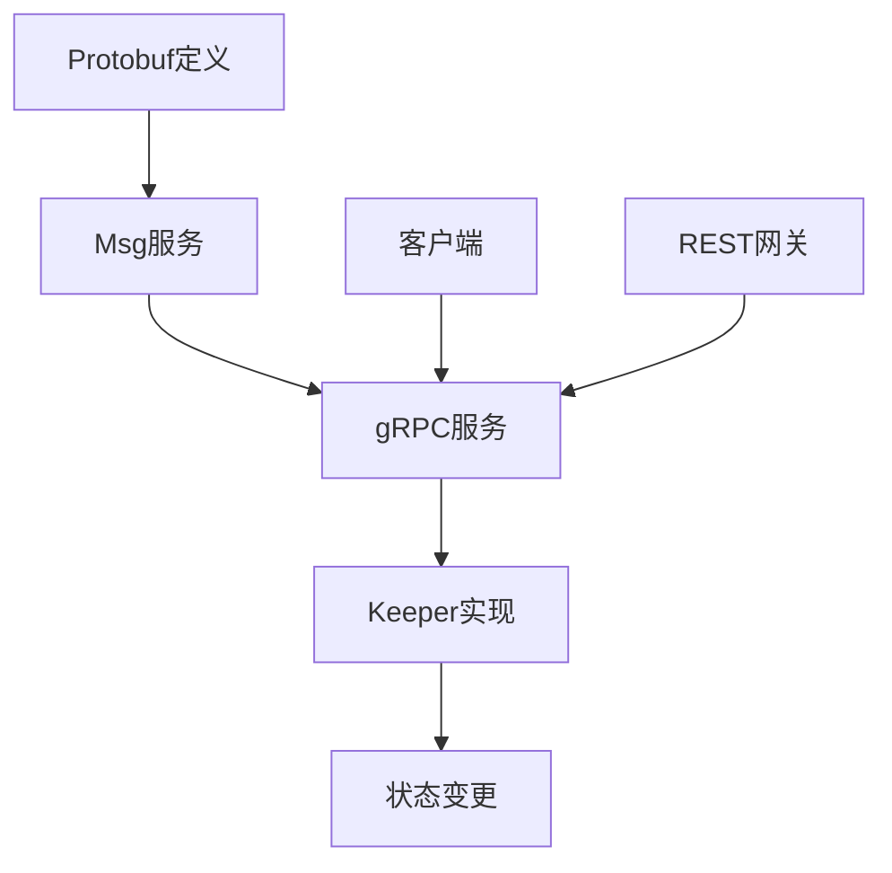
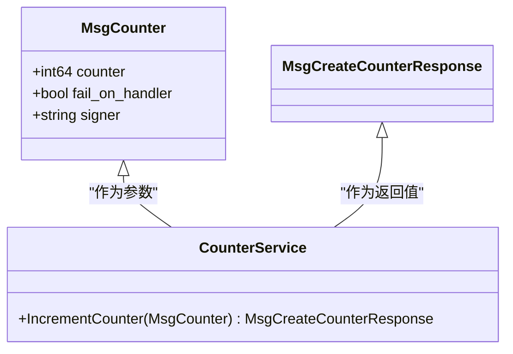
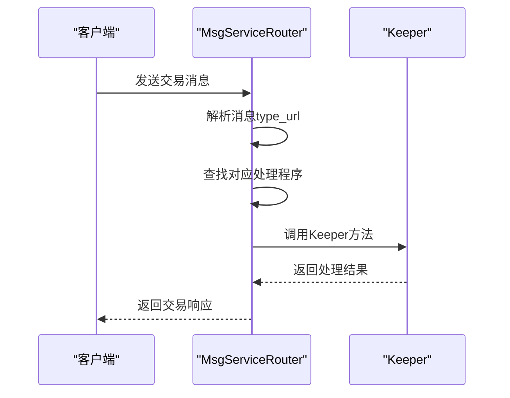
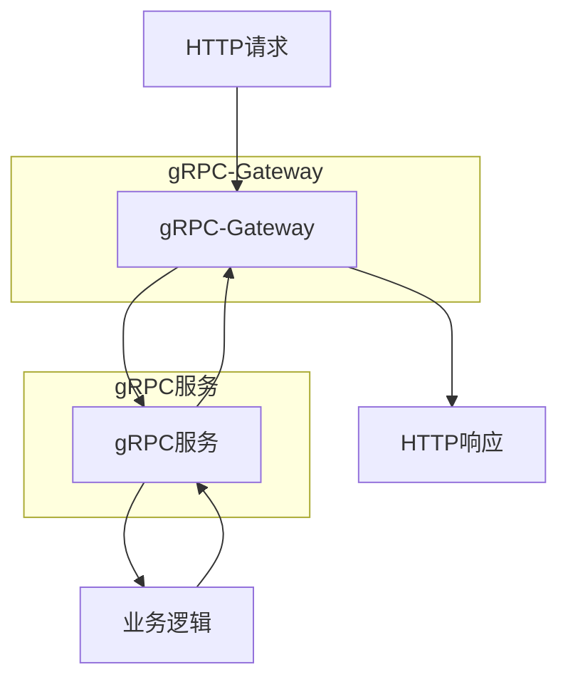
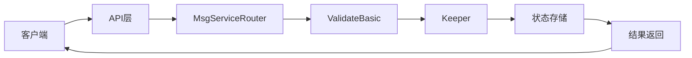

# MsgService与Protobuf消息

<cite>
**本文档引用的文件**
- [msg_service_router.go](file://baseapp/msg_service_router.go)
- [msg_service.go](file://types/msgservice/msg_service.go)
- [messages.proto](file://baseapp/testutil/messages.proto)
- [service.pb.gw.go](file://types/tx/service.pb.gw.go)
- [msg_server.go](file://testutil/testdata/msg_server.go)
- [grpcserver.go](file://baseapp/grpcserver.go)
- [grpcrouter.go](file://baseapp/grpcrouter.go)
</cite>

## 目录
1. [引言](#引言)
2. [MsgService模式概述](#msgservice模式概述)
3. [Protobuf定义与Msg服务](#protobuf定义与msg服务)
4. [MsgService路由机制](#msgservice路由机制)
5. [gRPC-Gateway转换](#grpc-gateway转换)
6. [端到端交易处理流程](#端到端交易处理流程)
7. [优势与最佳实践](#优势与最佳实践)
8. [结论](#结论)

## 引言

Cosmos SDK中的MsgService模式结合Protobuf实现了现代化、类型安全的交易处理系统。这种架构通过gRPC服务定义和Protobuf消息规范，为区块链应用提供了清晰的接口契约和强大的类型安全保障。本文档系统性地阐述了MsgService模式如何在Cosmos SDK中实现交易处理，对比了传统Msg处理方式与基于gRPC MsgService的差异，并详细说明了从Protobuf定义到服务端逻辑实现的完整流程。

**Section sources**
- [msg_service_router.go](file://baseapp/msg_service_router.go#L1-L222)
- [msg_service.go](file://types/msgservice/msg_service.go#L1-L74)

## MsgService模式概述

MsgService模式是Cosmos SDK中用于处理交易消息的现代化架构。它基于gRPC服务定义和Protobuf消息，提供了一种类型安全、自文档化的交易处理方式。与传统的Msg处理方式相比，MsgService模式具有以下核心优势：

1. **类型安全**：通过Protobuf定义消息结构，确保编译时类型检查
2. **接口契约**：gRPC服务定义提供了清晰的API契约
3. **自动生成代码**：从Protobuf定义自动生成客户端和服务端代码
4. **错误处理**：标准化的错误处理机制
5. **生态集成**：与gRPC生态系统无缝集成

MsgService模式的核心思想是将每个交易类型定义为gRPC服务中的一个方法，而不是传统的独立消息类型。这种方法使得交易处理逻辑更加模块化和可维护。



**Diagram sources**
- [msg_service_router.go](file://baseapp/msg_service_router.go#L1-L222)
- [msg_service.go](file://types/msgservice/msg_service.go#L1-L74)

**Section sources**
- [msg_service_router.go](file://baseapp/msg_service_router.go#L1-L222)
- [msg_service.go](file://types/msgservice/msg_service.go#L1-L74)

## Protobuf定义与Msg服务

在Cosmos SDK中，Msg服务通过Protobuf文件定义。每个Msg服务包含一个或多个方法，每个方法对应一种交易类型。以下是典型的Msg服务定义示例：

```protobuf
service Counter {
  rpc IncrementCounter(MsgCounter) returns (MsgCreateCounterResponse);
}

message MsgCounter {
  option (cosmos.msg.v1.signer) = "signer";
  
  int64 counter = 1;
  bool fail_on_handler = 2;
  string signer = 3;
}

message MsgCreateCounterResponse {}
```

关键特性包括：

- **服务定义**：使用`service`关键字定义Msg服务
- **方法签名**：每个方法接受一个Msg消息并返回响应
- **选项注解**：使用`option (cosmos.msg.v1.signer)`指定签名者字段
- **消息结构**：定义请求和响应消息的字段

Protobuf编译器会根据这些定义生成相应的Go代码，包括服务接口、消息类型和gRPC绑定代码。



**Diagram sources**
- [messages.proto](file://baseapp/testutil/messages.proto#L37-L47)
- [msg_server.go](file://testutil/testdata/msg_server.go#L1-L16)

**Section sources**
- [messages.proto](file://baseapp/testutil/messages.proto#L1-L47)
- [msg_server.go](file://testutil/testdata/msg_server.go#L1-L16)

## MsgService路由机制

MsgService路由机制是Cosmos SDK中处理交易的核心组件。`MsgServiceRouter`负责将交易消息路由到相应的处理程序。其工作原理如下：

1. **注册服务**：模块在初始化时注册Msg服务
2. **解析消息**：根据消息的type_url查找对应的处理程序
3. **执行处理**：调用相应的Keeper方法处理交易
4. **返回结果**：包装并返回处理结果

`MsgServiceRouter`实现了gRPC Server接口，能够直接注册gRPC服务描述符。当服务被注册时，它会自动为每个方法创建相应的消息处理程序。



**Diagram sources**
- [msg_service_router.go](file://baseapp/msg_service_router.go#L1-L222)
- [msg_service.go](file://types/msgservice/msg_service.go#L1-L74)

**Section sources**
- [msg_service_router.go](file://baseapp/msg_service_router.go#L1-L222)

## gRPC-Gateway转换

gRPC-Gateway在Cosmos SDK中扮演着重要角色，它实现了gRPC到REST的自动转换。`service.pb.gw.go`文件是由protoc-gen-grpc-gateway插件生成的，包含了将gRPC调用转换为HTTP/JSON请求的代码。

转换过程包括：

1. **请求解析**：将HTTP请求解析为gRPC请求
2. **调用转发**：调用相应的gRPC服务方法
3. **响应转换**：将gRPC响应转换为HTTP响应
4. **错误处理**：统一处理gRPC错误并转换为HTTP状态码

这种转换机制使得开发者可以同时提供gRPC和REST API，而无需编写重复的业务逻辑代码。



**Diagram sources**
- [service.pb.gw.go](file://types/tx/service.pb.gw.go#L1-L200)
- [grpcserver.go](file://baseapp/grpcserver.go#L1-L129)

**Section sources**
- [service.pb.gw.go](file://types/tx/service.pb.gw.go#L1-L878)
- [grpcserver.go](file://baseapp/grpcserver.go#L1-L129)

## 端到端交易处理流程

完整的交易处理流程从客户端发起交易开始，经过多个组件的处理，最终写入区块链状态。以下是详细的处理流程：

1. **客户端准备**：构建交易消息并签名
2. **广播交易**：通过gRPC或REST API广播交易
3. **消息路由**：MsgServiceRouter根据type_url路由消息
4. **验证基本**：执行ValidateBasic验证
5. **执行业务逻辑**：调用Keeper方法处理交易
6. **状态变更**：更新应用状态
7. **返回结果**：返回交易执行结果

每个步骤都经过精心设计，确保交易处理的安全性、可靠性和效率。



**Diagram sources**
- [msg_service_router.go](file://baseapp/msg_service_router.go#L1-L222)
- [grpcrouter.go](file://baseapp/grpcrouter.go#L1-L160)

**Section sources**
- [msg_service_router.go](file://baseapp/msg_service_router.go#L1-L222)
- [grpcrouter.go](file://baseapp/grpcrouter.go#L1-L160)

## 优势与最佳实践

MsgService与Protobuf模式为Cosmos SDK带来了诸多优势：

### 主要优势

1. **类型安全**：编译时类型检查避免运行时错误
2. **接口清晰**：gRPC服务定义提供明确的API契约
3. **代码生成**：自动生成客户端和服务端代码
4. **文档自动生成**：Protobuf定义可生成API文档
5. **跨语言支持**：Protobuf支持多种编程语言
6. **性能优化**：二进制序列化提高传输效率

### 最佳实践

1. **合理设计消息结构**：避免过度嵌套和复杂类型
2. **使用适当的字段编号**：预留扩展空间
3. **定义清晰的错误码**：标准化错误处理
4. **优化序列化性能**：选择合适的数据类型
5. **版本控制**：妥善处理API版本演进

这些优势和实践使得MsgService模式成为构建现代化区块链应用的理想选择。

**Section sources**
- [msg_service.go](file://types/msgservice/msg_service.go#L1-L74)
- [msg_service_router.go](file://baseapp/msg_service_router.go#L1-L222)

## 结论

MsgService与Protobuf模式在Cosmos SDK中实现了现代化、类型安全的交易处理系统。通过将交易定义为gRPC服务方法，结合Protobuf的强类型特性，该模式提供了清晰的接口契约、自动生成的客户端代码和更好的错误处理机制。gRPC-Gateway的集成进一步实现了gRPC到REST的无缝转换，为开发者提供了灵活的API访问方式。这种架构不仅提高了开发效率，还增强了系统的可靠性和可维护性，是构建下一代区块链应用的重要基础。