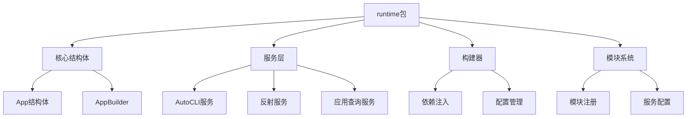
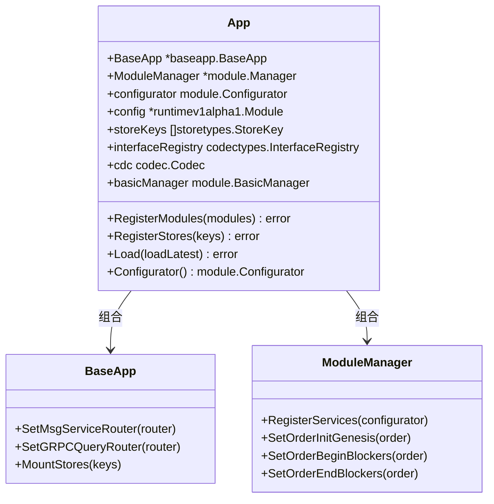
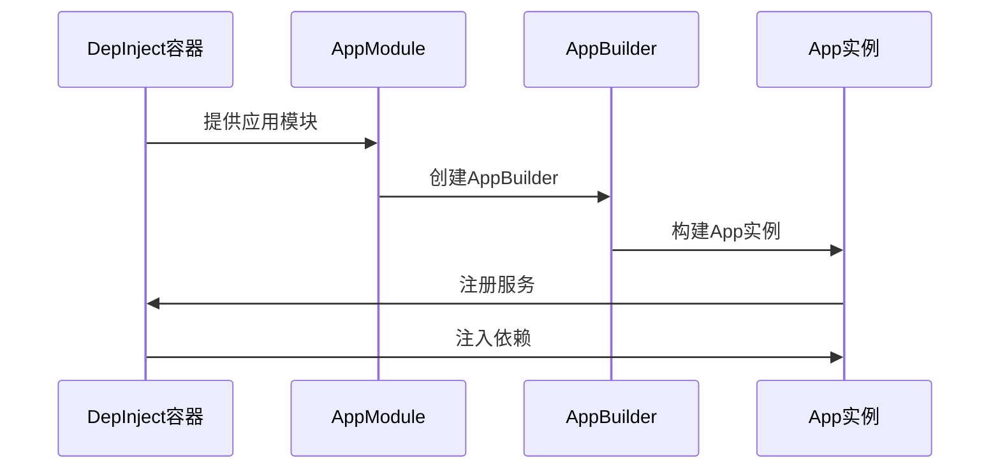
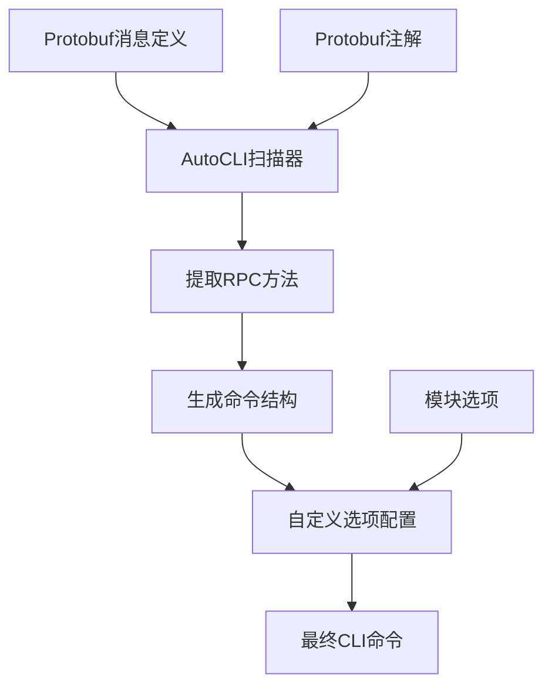
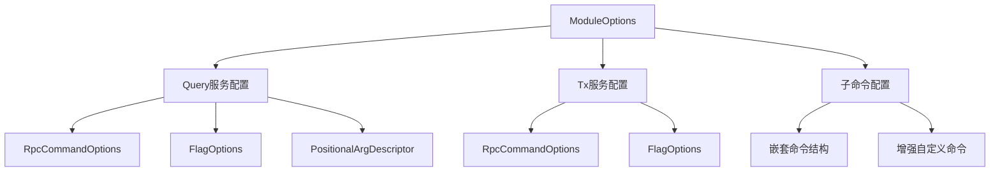
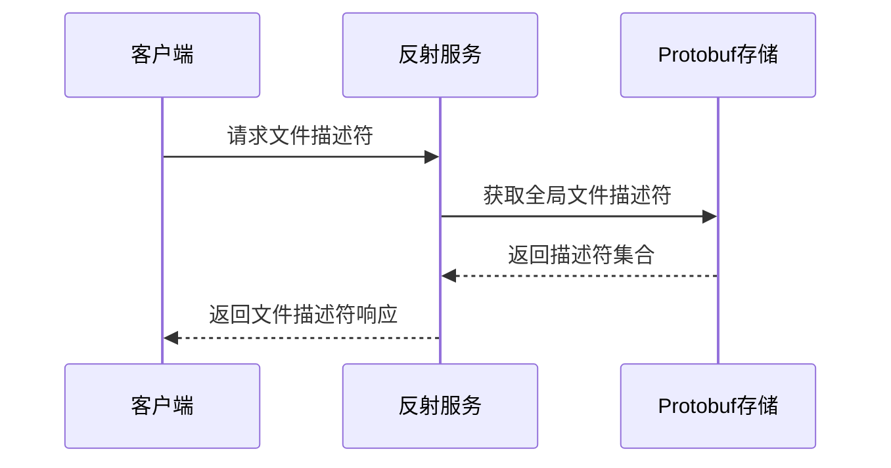
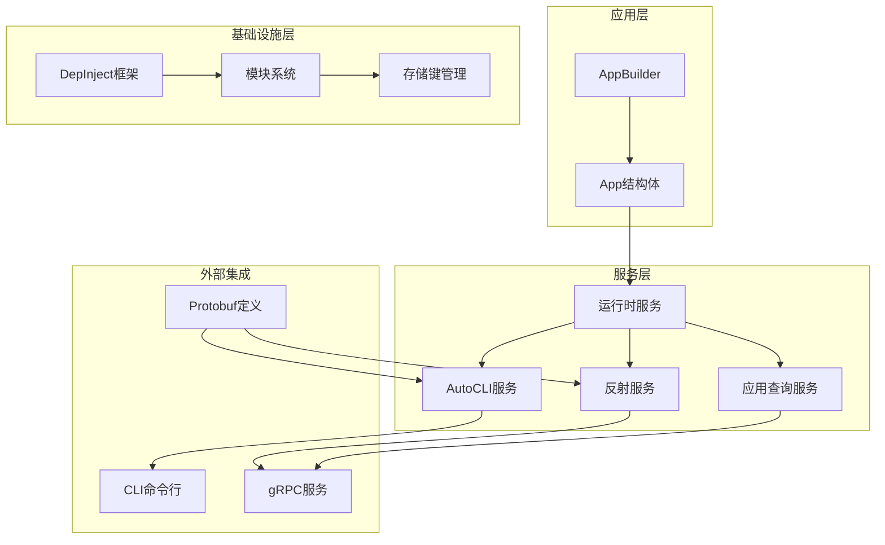

# 运行时服务与AutoCLI

<cite>
**本文档中引用的文件**
- [runtime/app.go](file://runtime/app.go)
- [runtime/services.go](file://runtime/services.go)
- [runtime/autocli.go](file://runtime/autocli.go)
- [runtime/services/app.go](file://runtime/services/app.go)
- [runtime/services/autocli.go](file://runtime/services/autocli.go)
- [runtime/services/reflection.go](file://runtime/services/reflection.go)
- [runtime/builder.go](file://runtime/builder.go)
- [runtime/module.go](file://runtime/module.go)
- [client/v2/autocli/options.go](file://client/v2/autocli/options.go)
- [simapp/app.go](file://simapp/app.go)
</cite>

## 目录
1. [简介](#简介)
2. [项目结构概览](#项目结构概览)
3. [App结构体：应用配置与构建中心](#app结构体应用配置与构建中心)
4. [DepInject依赖注入框架](#depinject依赖注入框架)
5. [AutoCLI功能详解](#autocli功能详解)
6. [AutoCLIOptions配置](#autoclioptions配置)
7. [反射服务](#反射服务)
8. [架构图](#架构图)
9. [最佳实践](#最佳实践)
10. [总结](#总结)

## 简介

Cosmos SDK的`runtime`包提供了高级运行时服务，是现代Cosmos应用的核心基础设施。该包通过声明式的方式简化了应用的配置和构建过程，同时提供了强大的AutoCLI功能和反射服务，显著提升了开发效率和应用的可维护性。

本文档将深入探讨`runtime`包的核心组件，包括：
- `App`结构体如何作为应用的配置和构建中心
- `depinject`依赖注入框架如何与之协同工作
- AutoCLI功能如何通过Protobuf注解自动生成CLI命令
- 反射服务如何提供gRPC服务发现能力

## 项目结构概览

`runtime`包的组织结构体现了其模块化设计理念：



**图表来源**
- [runtime/app.go](file://runtime/app.go#L40-L60)
- [runtime/builder.go](file://runtime/builder.go#L14-L19)
- [runtime/module.go](file://runtime/module.go#L37-L49)

**章节来源**
- [runtime/app.go](file://runtime/app.go#L1-L271)
- [runtime/services.go](file://runtime/services.go#L1-L49)

## App结构体：应用配置与构建中心

`App`结构体是`runtime`包的核心，它封装了整个应用的配置和运行时状态。

### 核心设计原则

`App`结构体采用了组合模式，将不同的功能模块组合在一起：



**图表来源**
- [runtime/app.go](file://runtime/app.go#L40-L60)
- [runtime/app.go](file://runtime/app.go#L62-L91)

### 关键功能特性

1. **模块化管理**：通过`ModuleManager`统一管理所有模块
2. **存储键管理**：自动处理不同类型的存储键
3. **接口注册**：维护类型安全的接口注册表
4. **配置驱动**：支持基于配置的应用初始化

**章节来源**
- [runtime/app.go](file://runtime/app.go#L40-L271)

## DepInject依赖注入框架

`depinject`是Cosmos SDK的依赖注入框架，与`runtime`包深度集成，实现了声明式的应用构建。

### 模块提供者系统



**图表来源**
- [runtime/module.go](file://runtime/module.go#L63-L83)
- [runtime/builder.go](file://runtime/builder.go#L26-L57)

### 存储键提供者

`runtime`包提供了多种存储键类型：

| 存储键类型 | 用途 | 生命周期 |
|-----------|------|----------|
| KVStoreKey | 持久化存储 | 应用生命周期 |
| TransientStoreKey | 临时存储 | 区块生命周期 |
| MemoryStoreKey | 内存存储 | 应用生命周期 |
| ObjectStoreKey | 对象存储 | 应用生命周期 |

**章节来源**
- [runtime/module.go](file://runtime/module.go#L203-L246)

## AutoCLI功能详解

AutoCLI是`runtime`包提供的强大功能，能够根据Protobuf定义自动生成CLI命令，彻底消除了手动编写CLI代码的需求。

### 工作原理



**图表来源**
- [runtime/services/autocli.go](file://runtime/services/autocli.go#L34-L90)
- [runtime/autocli.go](file://runtime/autocli.go#L9-L42)

### 自动发现机制

AutoCLI通过以下方式自动发现和生成命令：

1. **服务扫描**：扫描所有注册的服务
2. **方法识别**：识别RPC方法
3. **参数提取**：从消息定义中提取参数
4. **类型推断**：自动推断参数类型

**章节来源**
- [runtime/services/autocli.go](file://runtime/services/autocli.go#L34-L90)

## AutoCLIOptions配置

`AutoCLIOptions`允许开发者精确控制CLI命令的生成行为。

### 配置层次结构



**图表来源**
- [runtime/autocli.go](file://runtime/autocli.go#L9-L42)
- [runtime/services/autocli.go](file://runtime/services/autocli.go#L20-L32)

### 位置参数配置

AutoCLI支持灵活的位置参数配置：

| 参数类型 | 描述 | 示例 |
|---------|------|------|
| 基础位置参数 | 固定顺序的参数 | `[arg1] [arg2]` |
| 可选参数 | 最后一个可选参数 | `[arg1] [arg2...]` |
| 可变参数 | 支持多个值的参数 | `[arg1] [arg2...]` |

**章节来源**
- [runtime/services/autocli.go](file://runtime/services/autocli.go#L135-L144)

## 反射服务

反射服务提供了gRPC服务发现能力，使客户端能够动态了解可用的服务和方法。

### 服务发现流程



**图表来源**
- [runtime/services/reflection.go](file://runtime/services/reflection.go#L12-L34)

### 文件描述符管理

反射服务维护着完整的Protobuf文件描述符集合，支持：

1. **动态服务发现**：客户端可以动态发现可用服务
2. **类型信息获取**：提供完整的消息和服务类型信息
3. **版本兼容性**：支持多版本Protobuf定义

**章节来源**
- [runtime/services/reflection.go](file://runtime/services/reflection.go#L12-L34)

## 架构图

以下是`runtime`包的整体架构：



**图表来源**
- [runtime/app.go](file://runtime/app.go#L40-L60)
- [runtime/services.go](file://runtime/services.go#L17-L32)
- [runtime/module.go](file://runtime/module.go#L37-L49)

## 最佳实践

### 1. 模块注册最佳实践

```go
// 推荐的模块注册方式
func (m appModule) RegisterServices(configurator module.Configurator) {
    err := m.app.registerRuntimeServices(configurator)
    if err != nil {
        panic(err)
    }
}
```

### 2. AutoCLI配置优化

```go
// 为特定模块提供自定义AutoCLI选项
func (m appModule) AutoCLIOptions() *autocliv1.ModuleOptions {
    return &autocliv1.ModuleOptions{
        Query: &autocliv1.ServiceCommandDescriptor{
            Service: "YourService",
            RpcCommandOptions: []*autocliv1.RpcCommandOptions{
                {
                    RpcMethod: "YourMethod",
                    Short:     "简短描述",
                    Long:      "详细描述",
                    Example:   "使用示例",
                },
            },
        },
    }
}
```

### 3. 存储键管理

```go
// 合理的存储键命名策略
func ProvideKVStoreKey(config *runtimev1alpha1.Module, key depinject.ModuleKey, app *AppBuilder) *storetypes.KVStoreKey {
    if slices.Contains(config.SkipStoreKeys, key.Name()) {
        return nil
    }
    
    override := storeKeyOverride(config, key.Name())
    storeKeyName := key.Name()
    if override != nil {
        storeKeyName = override.KvStoreKey
    }
    
    return storetypes.NewKVStoreKey(storeKeyName)
}
```

### 4. 错误处理策略

```go
// 在服务注册中添加错误处理
func (a *App) registerRuntimeServices(cfg module.Configurator) error {
    if a.appConfig != nil {
        appv1alpha1.RegisterQueryServer(cfg.QueryServer(), services.NewAppQueryService(a.appConfig))
    }
    
    autocliv1.RegisterQueryServer(cfg.QueryServer(), services.NewAutoCLIQueryService(a.ModuleManager.Modules))
    
    reflectionSvc, err := services.NewReflectionService()
    if err != nil {
        return err
    }
    reflectionv1.RegisterReflectionServiceServer(cfg.QueryServer(), reflectionSvc)
    
    return nil
}
```

## 总结

Cosmos SDK的`runtime`包通过以下核心特性显著提升了开发体验：

### 主要优势

1. **声明式配置**：通过配置驱动的方式简化应用构建
2. **自动化工具**：AutoCLI完全消除了手动CLI代码的编写
3. **类型安全**：基于Protobuf的强类型系统保证正确性
4. **模块化设计**：清晰的职责分离和可扩展性
5. **服务发现**：反射服务提供了强大的gRPC服务发现能力

### 开发效率提升

- **减少样板代码**：AutoCLI自动生成CLI命令
- **类型安全**：编译时检查确保正确性
- **配置驱动**：通过配置文件管理应用行为
- **模块化架构**：易于测试和维护

### 可维护性改进

- **清晰的依赖关系**：通过DepInject框架管理依赖
- **标准化接口**：统一的服务注册和调用方式
- **文档自动生成**：基于Protobuf定义的文档
- **版本兼容性**：良好的向后兼容性保证

通过合理使用`runtime`包提供的功能，开发者可以构建出既高效又可维护的Cosmos应用，同时享受到现代化开发工具带来的便利。