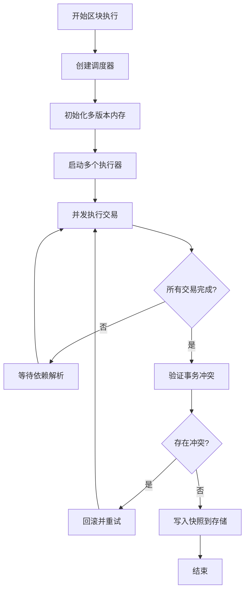
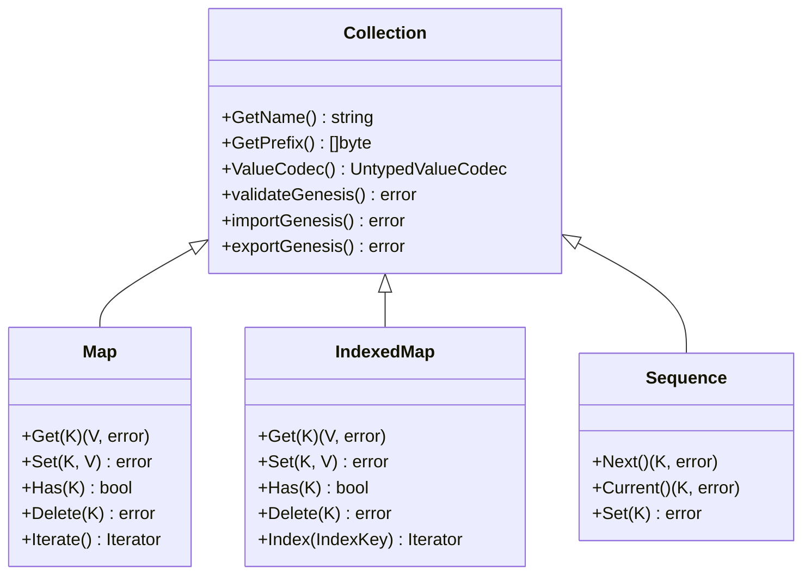
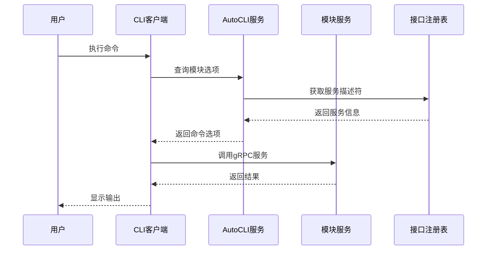
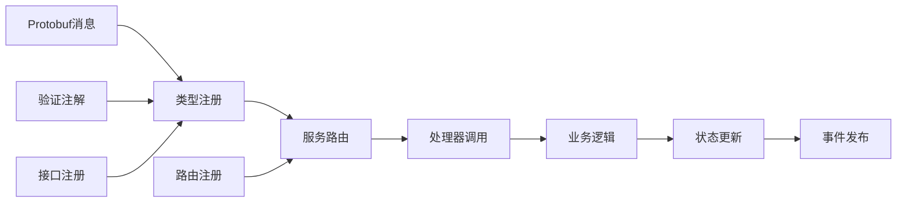
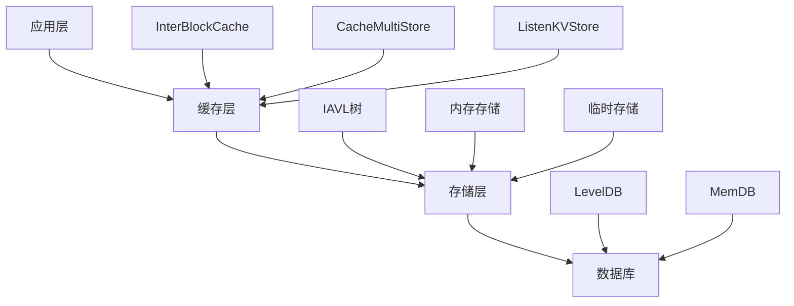
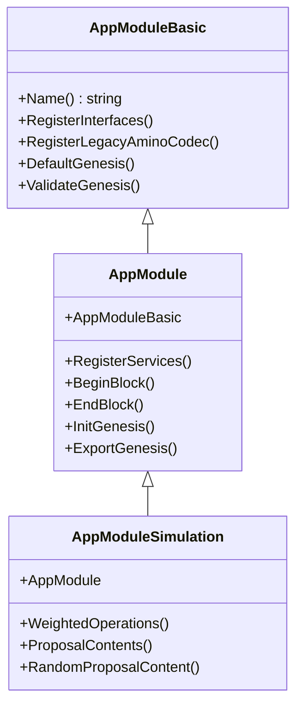
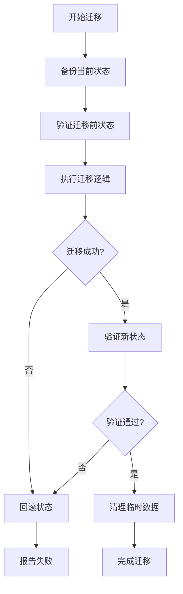

# 高级主题

<cite>
**本文档中引用的文件**
- [blockstm/README.md](file://blockstm/README.md)
- [blockstm/stm.go](file://blockstm/stm.go)
- [runtime/services/autocli.go](file://runtime/services/autocli.go)
- [codec/collections.go](file://codec/collections.go)
- [types/msgservice/msg_service.go](file://types/msgservice/msg_service.go)
- [runtime/app.go](file://runtime/app.go)
- [runtime/builder.go](file://runtime/builder.go)
- [types/msgservice/validate.go](file://types/msgservice/validate.go)
- [store/rootmulti/store.go](file://store/rootmulti/store.go)
- [baseapp/msg_service_router.go](file://baseapp/msg_service_router.go)
- [testutil/collections_test.go](file://testutil/collections_test.go)
- [tools/confix/cmd/migrate.go](file://tools/confix/cmd/migrate.go)
</cite>

## 目录
1. [简介](#简介)
2. [BlockSTM：块级软件事务内存](#blockstm块级软件事务内存)
3. [`collections`库：简化模块开发和状态管理](#collections库简化模块开发和状态管理)
4. [`runtime`包：高级功能与AutoCLI](#runtime包高级功能与autocli)
5. [`MsgService`与Protobuf：类型安全的交易处理](#msgservice与protobuf类型安全的交易处理)
6. [性能优化策略](#性能优化策略)
7. [安全审计最佳实践](#安全审计最佳实践)
8. [自定义模块开发指南](#自定义模块开发指南)
9. [复杂状态迁移](#复杂状态迁移)
10. [故障排除指南](#故障排除指南)
11. [结论](#结论)

## 简介

Cosmos SDK提供了丰富的高级功能和最佳实践，帮助开发者构建生产级的区块链应用。本指南深入探讨了SDK中的核心技术，包括高性能的状态管理系统、自动化的CLI生成、类型安全的交易处理以及复杂的性能优化策略。

## BlockSTM：块级软件事务内存

### 实现原理

BlockSTM（块级软件事务内存）是Cosmos SDK中的一项创新技术，实现了论文《Block-STM: Software Transactional Memory for Blockchain》中描述的算法。该系统通过并发执行交易来显著提高吞吐量。



**图表来源**
- [blockstm/stm.go](file://blockstm/stm.go#L16-L81)

### 核心特性

BlockSTM的主要优势包括：

1. **并发执行**：支持多个交易同时执行，提高区块处理能力
2. **依赖检测**：自动检测和处理数据依赖关系
3. **优化重试**：当读取到`ESTIMATE`标记时，挂起执行而不是完全回滚
4. **多存储支持**：原生支持多个存储键的集成

### 性能提升机制

BlockSTM通过以下方式实现性能优化：

- **条件变量**：使用`CondVar`实现高效的依赖等待机制
- **多版本数据结构**：基于嵌套B树实现的多版本数据结构
- **写集优化**：使用B树实现的写集，利用有序属性优化逻辑
- **并发控制**：动态调整执行器数量以匹配可用CPU核心数

**章节来源**
- [blockstm/README.md](file://blockstm/README.md#L1-L42)
- [blockstm/stm.go](file://blockstm/stm.go#L16-L81)

## `collections`库：简化模块开发和状态管理

### 设计理念

`collections`库提供了一套类型安全的数据结构，用于简化模块开发中的状态管理。它抽象了底层存储操作，为开发者提供高级的集合类型。



**图表来源**
- [collections/collections.go](file://collections/collections.go#L78-L101)

### 核心数据类型

`collections`库提供了多种类型安全的数据结构：

| 数据类型 | 用途 | 键编码 | 值编码 |
|---------|------|--------|--------|
| `Map[K, V]` | 键值对存储 | 自定义键编解码器 | 自定义值编解码器 |
| `IndexedMap[K, V, I]` | 带索引的映射 | 主键编解码器 | 主值编解码器 |
| `Sequence[K]` | 序列化键生成 | 无 | 无 |
| `KeySet[K]` | 去重集合 | 键编解码器 | 无 |

### 编解码器系统

`collections`库支持多种编解码器：

- **基本类型**：`Uint16Key`、`Uint32Key`、`Uint64Key`、`Int32Key`、`Int64Key`、`StringKey`、`BytesKey`、`BoolKey`
- **值类型**：`BoolValue`、`Uint16Value`等
- **协议缓冲区**：`CollValue`、`CollValueV2`、`CollInterfaceValue`

### 使用模式

推荐的使用模式包括：

1. **类型安全访问**：避免运行时类型错误
2. **批量操作**：利用迭代器进行高效批量处理
3. **索引优化**：为频繁查询的字段建立索引
4. **内存管理**：合理使用缓存和持久化策略

**章节来源**
- [collections/collections.go](file://collections/collections.go#L1-L179)

## `runtime`包：高级功能与AutoCLI

### AutoCLI架构

AutoCLI是`runtime`包提供的自动化CLI生成系统，能够根据Protobuf服务自动生成命令行接口。



**图表来源**
- [runtime/services/autocli.go](file://runtime/services/autocli.go#L20-L145)

### 自动发现机制

AutoCLI通过以下机制自动发现模块功能：

1. **服务识别**：扫描具有`cosmos.msg.v1.service`注解的服务
2. **配置提取**：从模块实现中提取AutoCLI配置
3. **命令生成**：基于Protobuf描述生成相应的CLI命令
4. **参数绑定**：自动绑定命令参数到gRPC方法

### 配置选项

AutoCLI支持丰富的配置选项：

| 配置项 | 类型 | 描述 |
|--------|------|------|
| `Tx` | `ServiceCommandDescriptor` | 交易相关命令配置 |
| `Query` | `ServiceCommandDescriptor` | 查询相关命令配置 |
| `Serve` | `ServiceCommandDescriptor` | 服务相关命令配置 |
| `DeprecatedCommands` | `[]string` | 已废弃命令列表 |

### 集成模式

推荐的集成模式包括：

1. **声明式配置**：在模块中声明AutoCLI选项
2. **自动发现**：利用反射机制自动发现服务
3. **类型安全**：确保命令参数与Protobuf消息一致
4. **文档生成**：自动生成命令文档和示例

**章节来源**
- [runtime/services/autocli.go](file://runtime/services/autocli.go#L1-L145)
- [runtime/app.go](file://runtime/app.go#L1-L271)
- [runtime/builder.go](file://runtime/builder.go#L1-L58)

## `MsgService`与Protobuf：类型安全的交易处理

### Protobuf集成

`MsgService`系统提供了完整的Protobuf集成，确保交易处理的类型安全性和互操作性。



**图表来源**
- [types/msgservice/msg_service.go](file://types/msgservice/msg_service.go#L22-L74)

### 类型安全机制

MsgService通过以下机制确保类型安全：

1. **Protobuf注解验证**：检查服务是否正确标注`cosmos.msg.v1.service`
2. **接口注册**：确保所有消息类型都已注册到接口注册表
3. **类型URL验证**：验证消息的类型URL格式正确性
4. **序列化兼容性**：确保gogoproto和标准Protobuf的兼容性

### 注解系统

MsgService使用专门的Protobuf注解来标识消息服务：

```protobuf
service Msg {
  option (cosmos.msg.v1.service) = true;
  
  rpc SignDoc(SignDocRequest) returns (SignDocResponse);
  rpc Tx(TxRequest) returns (TxResponse);
}
```

### 验证流程

消息验证遵循严格的流程：

1. **注解验证**：检查服务是否具有正确的Protobuf注解
2. **类型检查**：验证消息类型是否已注册
3. **路由验证**：确保消息处理器已注册
4. **参数验证**：执行消息特定的验证逻辑

### 兼容性处理

为了处理不同版本间的兼容性：

- **混合处理器**：支持gogoproto和标准Protobuf的混合使用
- **类型转换**：自动处理类型转换和序列化差异
- **向后兼容**：维护对旧版本的兼容性

**章节来源**
- [types/msgservice/msg_service.go](file://types/msgservice/msg_service.go#L1-L74)
- [types/msgservice/validate.go](file://types/msgservice/validate.go#L1-L62)
- [baseapp/msg_service_router.go](file://baseapp/msg_service_router.go#L1-L200)

## 性能优化策略

### 存储层优化

Cosmos SDK提供了多层次的存储优化策略：



**图表来源**
- [store/rootmulti/store.go](file://store/rootmulti/store.go#L57-L90)

### 关键优化技术

1. **多层缓存**：
   - InterBlockCache：跨区块的缓存共享
   - CacheMultiStore：多存储的统一缓存
   - ListenKVStore：监听和追踪变更

2. **存储类型优化**：
   - IAVL树：高效的持久化存储
   - 内存存储：快速的临时数据存储
   - 临时存储：事务性的状态管理

3. **并发控制**：
   - 多版本并发控制（MVCC）
   - 乐观锁机制
   - 并发安全的状态访问

### 性能监控

推荐的性能监控指标：

| 指标类别 | 具体指标 | 监控方法 |
|----------|----------|----------|
| 吞吐量 | TPS（每秒交易数） | 区块时间统计 |
| 延迟 | 交易确认时间 | 时间戳跟踪 |
| 存储 | 写入延迟 | 存储操作计时 |
| 内存 | 内存使用率 | GC监控 |
| CPU | CPU使用率 | 系统监控 |

### 最佳实践

1. **合理的缓存配置**：根据应用特点调整缓存大小
2. **存储分层**：将热数据和冷数据分离存储
3. **批量操作**：利用批量API减少系统调用
4. **异步处理**：将非关键操作异步化

## 安全审计最佳实践

### 代码审计要点

在进行安全审计时，重点关注以下方面：

1. **输入验证**：
   - 所有外部输入必须经过严格验证
   - 防止注入攻击和格式错误
   - 实施白名单验证策略

2. **权限控制**：
   - 基于角色的访问控制（RBAC）
   - 最小权限原则
   - 权限边界清晰

3. **加密安全**：
   - 密钥管理最佳实践
   - 加密算法选择
   - 随机数生成质量

### 自动化审计工具

推荐使用的自动化审计工具：

- **静态分析**：GoSec、GolangCI-Lint
- **模糊测试**：内置fuzzing框架
- **依赖扫描**：依赖项安全检查
- **代码覆盖率**：测试覆盖率分析

### 审计流程

1. **威胁建模**：识别潜在的安全威胁
2. **代码审查**：人工审查关键代码路径
3. **自动化测试**：运行安全相关的自动化测试
4. **渗透测试**：模拟真实攻击场景
5. **持续监控**：部署后的安全监控

## 自定义模块开发指南

### 模块架构模式

Cosmos SDK采用模块化架构，支持三种级别的模块功能：



### 开发最佳实践

1. **接口设计**：
   - 保持接口简洁和稳定
   - 提供清晰的错误信息
   - 支持向后兼容性

2. **状态管理**：
   - 使用`collections`库进行类型安全的状态管理
   - 实施适当的索引策略
   - 考虑状态压缩和优化

3. **测试策略**：
   - 单元测试覆盖核心逻辑
   - 集成测试验证模块交互
   - 性能测试评估模块效率

### 模块间通信

推荐的模块间通信模式：

- **事件系统**：通过事件进行松耦合通信
- **查询接口**：提供标准化的查询接口
- **消息路由**：使用MsgService进行类型安全的通信

## 复杂状态迁移

### 迁移策略

状态迁移是升级过程中的关键环节，需要谨慎处理：



### 迁移工具

Confix工具提供了强大的配置迁移功能：

- **版本兼容性**：支持跨版本的配置迁移
- **自动化处理**：自动识别和修复配置问题
- **验证机制**：迁移前后状态验证
- **回滚支持**：提供安全的回滚机制

### 迁移最佳实践

1. **渐进式迁移**：分阶段进行状态迁移
2. **状态验证**：迁移前后进行完整性检查
3. **回滚计划**：准备详细的回滚方案
4. **监控告警**：实时监控迁移过程

**章节来源**
- [tools/confix/cmd/migrate.go](file://tools/confix/cmd/migrate.go#L1-L100)

## 故障排除指南

### 常见问题诊断

1. **性能问题**：
   - 检查存储配置和缓存设置
   - 分析CPU和内存使用情况
   - 监控网络延迟和带宽

2. **状态不一致**：
   - 验证状态迁移逻辑
   - 检查共识算法配置
   - 分析区块同步问题

3. **模块通信问题**：
   - 检查接口注册
   - 验证消息路由配置
   - 分析事件传递机制

### 调试技巧

- **日志分析**：启用详细日志记录
- **性能分析**：使用pprof进行性能分析
- **状态检查**：定期检查关键状态变量
- **网络监控**：监控节点间通信

### 监控和告警

建立完善的监控体系：

- **系统指标**：CPU、内存、磁盘、网络
- **应用指标**：TPS、延迟、错误率
- **业务指标**：账户余额、交易成功率
- **健康检查**：定期健康状态检查

## 结论

Cosmos SDK提供了丰富的高级功能和最佳实践，帮助开发者构建高性能、安全可靠的区块链应用。通过合理使用BlockSTM、collections库、AutoCLI、MsgService等核心组件，结合性能优化、安全审计和模块化开发的最佳实践，可以构建出满足生产环境需求的区块链解决方案。

掌握这些高级主题不仅能够提高开发效率，还能确保应用的质量和可维护性。随着区块链技术的不断发展，这些最佳实践将继续演进，为开发者提供更强大的工具和指导。